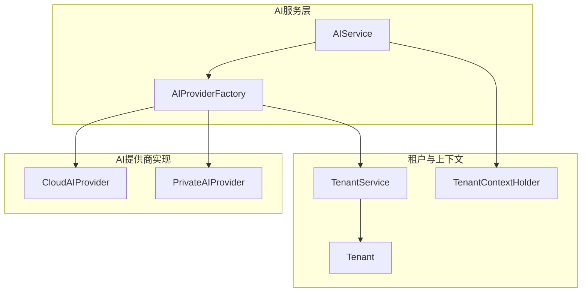
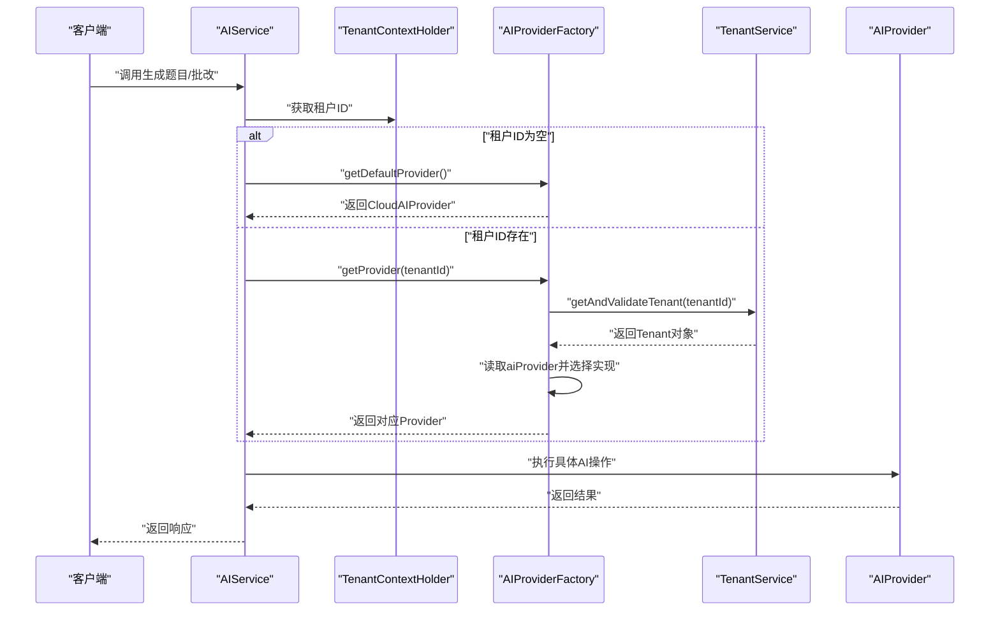
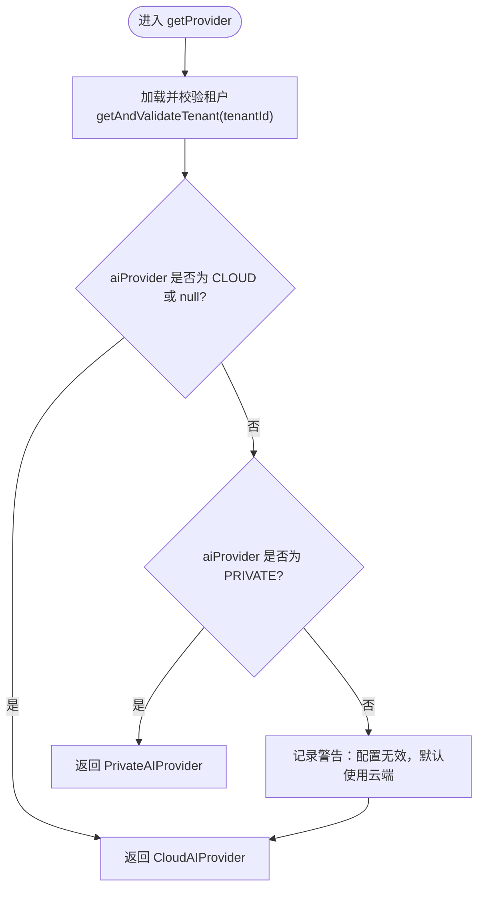
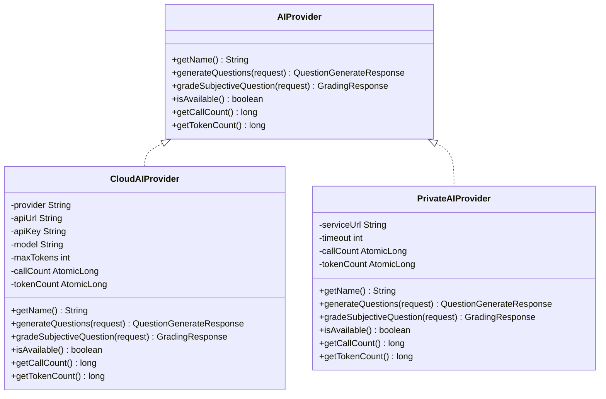
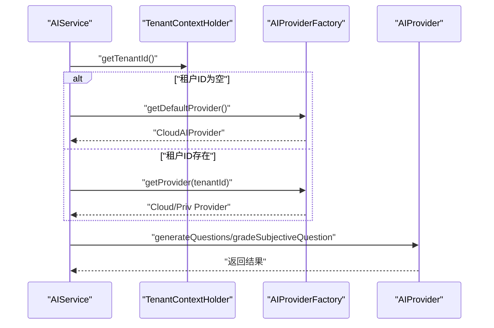
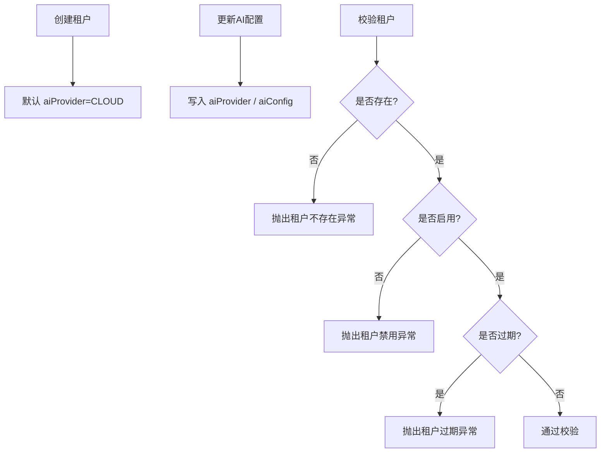
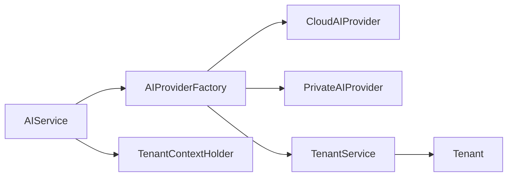

# AI提供商工厂

<cite>
**本文引用的文件**
- [AIProviderFactory.java](file://backend/src/main/java/com/edu/ai/provider/AIProviderFactory.java)
- [AIProvider.java](file://backend/src/main/java/com/edu/ai/provider/AIProvider.java)
- [CloudAIProvider.java](file://backend/src/main/java/com/edu/ai/provider/CloudAIProvider.java)
- [PrivateAIProvider.java](file://backend/src/main/java/com/edu/ai/provider/PrivateAIProvider.java)
- [AIService.java](file://backend/src/main/java/com/edu/ai/service/AIService.java)
- [TenantService.java](file://backend/src/main/java/com/edu/tenant/service/TenantService.java)
- [Tenant.java](file://backend/src/main/java/com/edu/tenant/entity/Tenant.java)
- [TenantConfig.java](file://backend/src/main/java/com/edu/tenant/entity/TenantConfig.java)
- [TenantContextHolder.java](file://backend/src/main/java/com/edu/common/util/TenantContextHolder.java)
- [application.yml](file://backend/src/main/resources/application.yml)
- [QuestionGenerateRequest.java](file://backend/src/main/java/com/edu/ai/dto/QuestionGenerateRequest.java)
- [GradingRequest.java](file://backend/src/main/java/com/edu/ai/dto/GradingRequest.java)
- [AIServiceTest.java](file://backend/src/test/java/com/edu/ai/service/AIServiceTest.java)
- [TenantException.java](file://backend/src/main/java/com/edu/common/exception/TenantException.java)
</cite>

## 目录
1. [简介](#简介)
2. [项目结构](#项目结构)
3. [核心组件](#核心组件)
4. [架构总览](#架构总览)
5. [详细组件分析](#详细组件分析)
6. [依赖关系分析](#依赖关系分析)
7. [性能考量](#性能考量)
8. [故障排查指南](#故障排查指南)
9. [结论](#结论)
10. [附录](#附录)

## 简介
本文件系统性阐述AI提供商工厂的设计与实现，重点覆盖：
- 工厂模式在AI服务中的应用：根据租户配置动态选择云端或私有AI提供商。
- getProvider方法的完整逻辑流程：租户校验、AI配置读取、提供商选择策略与默认回退。
- getProviderByConfig与getDefaultProvider的使用场景与参数处理。
- 云端与私有限制的判断条件、日志记录机制与默认回退策略。
- 工厂类的依赖注入配置、线程安全考虑与性能优化建议。
- 实际配置示例与错误处理最佳实践。

## 项目结构
AI相关模块位于后端工程的ai与tenant包下，采用“接口+多实现+工厂”的分层设计：
- 接口层：AIProvider 定义统一能力契约。
- 实现层：CloudAIProvider 与 PrivateAIProvider 分别对接云端与私有部署服务。
- 工厂层：AIProviderFactory 负责根据租户配置选择具体实现。
- 服务层：AIService 作为统一入口，通过工厂获取Provider并执行业务操作。
- 租户与上下文：TenantService、Tenant、TenantContextHolder 提供租户信息与上下文传递。

图表来源
- [AIService.java:17-82](file://backend/src/main/java/com/edu/ai/service/AIService.java#L17-L82)
- [AIProviderFactory.java:15-66](file://backend/src/main/java/com/edu/ai/provider/AIProviderFactory.java#L15-L66)
- [CloudAIProvider.java:24-120](file://backend/src/main/java/com/edu/ai/provider/CloudAIProvider.java#L24-L120)
- [PrivateAIProvider.java:24-195](file://backend/src/main/java/com/edu/ai/provider/PrivateAIProvider.java#L24-L195)
- [TenantService.java:15-80](file://backend/src/main/java/com/edu/tenant/service/TenantService.java#L15-L80)
- [Tenant.java:9-21](file://backend/src/main/java/com/edu/tenant/entity/Tenant.java#L9-L21)
- [TenantContextHolder.java:8-24](file://backend/src/main/java/com/edu/common/util/TenantContextHolder.java#L8-L24)

章节来源
- [AIService.java:17-102](file://backend/src/main/java/com/edu/ai/service/AIService.java#L17-L102)
- [AIProviderFactory.java:15-66](file://backend/src/main/java/com/edu/ai/provider/AIProviderFactory.java#L15-L66)
- [CloudAIProvider.java:24-267](file://backend/src/main/java/com/edu/ai/provider/CloudAIProvider.java#L24-L267)
- [PrivateAIProvider.java:24-195](file://backend/src/main/java/com/edu/ai/provider/PrivateAIProvider.java#L24-L195)
- [TenantService.java:15-80](file://backend/src/main/java/com/edu/tenant/service/TenantService.java#L15-L80)
- [Tenant.java:9-21](file://backend/src/main/java/com/edu/tenant/entity/Tenant.java#L9-L21)
- [TenantContextHolder.java:8-24](file://backend/src/main/java/com/edu/common/util/TenantContextHolder.java#L8-L24)

## 核心组件
- AIProvider 接口：定义统一能力，包括生成题目、主观题批改、可用性检查、调用统计等。
- CloudAIProvider：基于RestTemplate调用云端模型，支持配置化API Key、URL、模型与最大Token数。
- PrivateAIProvider：封装私有部署服务的HTTP调用，支持健康检查与超时配置。
- AIProviderFactory：工厂类，负责根据租户配置选择Provider，并提供按配置选择与默认Provider的能力。
- AIService：统一入口，结合租户上下文与工厂选择Provider，对外暴露生成题目、批改、状态检查与统计查询。
- TenantService/Tenant/TenantContextHolder：提供租户信息读取、有效性校验与上下文传递。

章节来源
- [AIProvider.java:8-42](file://backend/src/main/java/com/edu/ai/provider/AIProvider.java#L8-L42)
- [CloudAIProvider.java:24-267](file://backend/src/main/java/com/edu/ai/provider/CloudAIProvider.java#L24-L267)
- [PrivateAIProvider.java:24-195](file://backend/src/main/java/com/edu/ai/provider/PrivateAIProvider.java#L24-L195)
- [AIProviderFactory.java:15-66](file://backend/src/main/java/com/edu/ai/provider/AIProviderFactory.java#L15-L66)
- [AIService.java:17-102](file://backend/src/main/java/com/edu/ai/service/AIService.java#L17-L102)
- [TenantService.java:15-80](file://backend/src/main/java/com/edu/tenant/service/TenantService.java#L15-L80)
- [Tenant.java:9-21](file://backend/src/main/java/com/edu/tenant/entity/Tenant.java#L9-L21)
- [TenantContextHolder.java:8-24](file://backend/src/main/java/com/edu/common/util/TenantContextHolder.java#L8-L24)

## 架构总览
AI服务通过AIService统一入口，结合租户上下文决定使用Cloud或Private Provider。工厂类从租户配置中读取aiProvider字段，若为空或为CLOUD则选择云端，为PRIVATE则选择私有，否则默认回退到云端。工厂还提供按配置选择与默认Provider的方法，便于在无租户上下文或特殊场景下使用。

图表来源
- [AIService.java:75-82](file://backend/src/main/java/com/edu/ai/service/AIService.java#L75-L82)
- [AIProviderFactory.java:27-44](file://backend/src/main/java/com/edu/ai/provider/AIProviderFactory.java#L27-L44)
- [TenantService.java:44-56](file://backend/src/main/java/com/edu/tenant/service/TenantService.java#L44-L56)
- [TenantContextHolder.java:12-18](file://backend/src/main/java/com/edu/common/util/TenantContextHolder.java#L12-L18)

## 详细组件分析

### 工厂类：AIProviderFactory
- 依赖注入：持有CloudAIProvider、PrivateAIProvider与TenantService实例。
- getProvider(tenantId)：
  - 调用TenantService.getAndValidateTenant进行租户有效性校验（存在性、启用状态、有效期）。
  - 读取Tenant.aiProvider，若为CLOUD或null则返回CloudAIProvider；若为PRIVATE则返回PrivateAIProvider；否则默认回退到CloudAIProvider。
  - 日志记录：对不同分支输出调试/警告信息，便于追踪选择原因。
- getProviderByConfig(aiProvider, aiConfig)：
  - 仅依据aiProvider字符串选择实现，不涉及租户上下文，适合在无租户或临时切换场景使用。
- getDefaultProvider()：
  - 返回CloudAIProvider，作为无租户上下文或异常情况下的默认实现。

图表来源
- [AIProviderFactory.java:27-44](file://backend/src/main/java/com/edu/ai/provider/AIProviderFactory.java#L27-L44)
- [TenantService.java:44-56](file://backend/src/main/java/com/edu/tenant/service/TenantService.java#L44-L56)

章节来源
- [AIProviderFactory.java:15-66](file://backend/src/main/java/com/edu/ai/provider/AIProviderFactory.java#L15-L66)
- [TenantService.java:44-56](file://backend/src/main/java/com/edu/tenant/service/TenantService.java#L44-L56)

### 接口与实现：AIProvider、CloudAIProvider、PrivateAIProvider
- AIProvider接口：
  - 统一方法：getName、generateQuestions、gradeSubjectiveQuestion、isAvailable、getCallCount、getTokenCount。
- CloudAIProvider：
  - 可用性检查：基于API Key是否配置。
  - 请求构建：构造JSON消息体，设置头部（含API Key与协议版本），调用指定URL。
  - 结果解析：提取content.text与usage.total_tokens，累加调用计数与Token计数。
  - 错误处理：捕获异常并记录错误日志，返回带错误信息的响应。
- PrivateAIProvider：
  - 可用性检查：向私有服务的健康端点发起GET请求，判断HTTP 200。
  - 请求构建：POST至本地服务的生成/批改端点，携带必要参数。
  - 结果解析：解析success标志与questions/score等字段，支持tokensUsed统计。
  - 错误处理：异常与非成功响应均记录日志并填充错误信息。

图表来源
- [AIProvider.java:8-42](file://backend/src/main/java/com/edu/ai/provider/AIProvider.java#L8-L42)
- [CloudAIProvider.java:24-267](file://backend/src/main/java/com/edu/ai/provider/CloudAIProvider.java#L24-L267)
- [PrivateAIProvider.java:24-195](file://backend/src/main/java/com/edu/ai/provider/PrivateAIProvider.java#L24-L195)

章节来源
- [AIProvider.java:8-42](file://backend/src/main/java/com/edu/ai/provider/AIProvider.java#L8-L42)
- [CloudAIProvider.java:24-267](file://backend/src/main/java/com/edu/ai/provider/CloudAIProvider.java#L24-L267)
- [PrivateAIProvider.java:24-195](file://backend/src/main/java/com/edu/ai/provider/PrivateAIProvider.java#L24-L195)

### 统一入口：AIService
- 生成题目/批改：内部通过TenantContextHolder获取租户ID，若为空则使用默认Provider，否则委托工厂选择Provider并执行具体操作。
- 状态检查与统计：直接委托当前Provider，返回名称、调用次数、Token用量与可用性。
- 日志记录：在关键路径输出使用了哪个Provider及请求参数，便于审计与排障。

图表来源
- [AIService.java:75-82](file://backend/src/main/java/com/edu/ai/service/AIService.java#L75-L82)
- [AIProviderFactory.java:64-66](file://backend/src/main/java/com/edu/ai/provider/AIProviderFactory.java#L64-L66)
- [TenantContextHolder.java:12-18](file://backend/src/main/java/com/edu/common/util/TenantContextHolder.java#L12-L18)

章节来源
- [AIService.java:17-102](file://backend/src/main/java/com/edu/ai/service/AIService.java#L17-L102)

### 租户与上下文：TenantService、Tenant、TenantContextHolder
- TenantService：
  - 创建租户时默认aiProvider为CLOUD。
  - 更新AI配置时写入aiProvider与aiConfig。
  - 校验租户：不存在、禁用、过期均抛出TenantException。
- Tenant：包含id、code、aiProvider、aiConfig、status、expireDate等字段。
- TenantContextHolder：使用TransmittableThreadLocal保存租户ID，支持线程与子线程间传递。

图表来源
- [TenantService.java:20-36](file://backend/src/main/java/com/edu/tenant/service/TenantService.java#L20-L36)
- [TenantService.java:58-68](file://backend/src/main/java/com/edu/tenant/service/TenantService.java#L58-L68)
- [TenantService.java:44-56](file://backend/src/main/java/com/edu/tenant/service/TenantService.java#L44-L56)
- [Tenant.java:9-21](file://backend/src/main/java/com/edu/tenant/entity/Tenant.java#L9-L21)

章节来源
- [TenantService.java:15-80](file://backend/src/main/java/com/edu/tenant/service/TenantService.java#L15-L80)
- [Tenant.java:9-21](file://backend/src/main/java/com/edu/tenant/entity/Tenant.java#L9-L21)
- [TenantContextHolder.java:8-24](file://backend/src/main/java/com/edu/common/util/TenantContextHolder.java#L8-L24)

## 依赖关系分析
- 组件耦合：
  - AIService依赖AIProviderFactory；工厂依赖CloudAIProvider、PrivateAIProvider与TenantService。
  - Cloud/Priv Provider依赖配置（application.yml）与外部HTTP服务。
- 外部依赖：
  - Spring配置：application.yml中定义ai.cloud与ai.private相关属性。
  - 日志：各Provider与工厂均使用SLF4J输出调试/警告/错误日志。
- 循环依赖：未发现循环依赖，职责清晰。

图表来源
- [AIService.java:17-102](file://backend/src/main/java/com/edu/ai/service/AIService.java#L17-L102)
- [AIProviderFactory.java:15-66](file://backend/src/main/java/com/edu/ai/provider/AIProviderFactory.java#L15-L66)
- [CloudAIProvider.java:24-267](file://backend/src/main/java/com/edu/ai/provider/CloudAIProvider.java#L24-L267)
- [PrivateAIProvider.java:24-195](file://backend/src/main/java/com/edu/ai/provider/PrivateAIProvider.java#L24-L195)
- [TenantService.java:15-80](file://backend/src/main/java/com/edu/tenant/service/TenantService.java#L15-L80)
- [Tenant.java:9-21](file://backend/src/main/java/com/edu/tenant/entity/Tenant.java#L9-L21)
- [TenantContextHolder.java:8-24](file://backend/src/main/java/com/edu/common/util/TenantContextHolder.java#L8-L24)

章节来源
- [AIService.java:17-102](file://backend/src/main/java/com/edu/ai/service/AIService.java#L17-L102)
- [AIProviderFactory.java:15-66](file://backend/src/main/java/com/edu/ai/provider/AIProviderFactory.java#L15-L66)
- [CloudAIProvider.java:24-267](file://backend/src/main/java/com/edu/ai/provider/CloudAIProvider.java#L24-L267)
- [PrivateAIProvider.java:24-195](file://backend/src/main/java/com/edu/ai/provider/PrivateAIProvider.java#L24-L195)
- [TenantService.java:15-80](file://backend/src/main/java/com/edu/tenant/service/TenantService.java#L15-L80)
- [Tenant.java:9-21](file://backend/src/main/java/com/edu/tenant/entity/Tenant.java#L9-L21)
- [TenantContextHolder.java:8-24](file://backend/src/main/java/com/edu/common/util/TenantContextHolder.java#L8-L24)

## 性能考量
- 线程安全：
  - Provider内部使用AtomicLong维护调用次数与Token用量，保证并发安全。
  - TenantContextHolder使用TransmittableThreadLocal，确保跨线程传递租户ID。
- 连接与超时：
  - Cloud/Priv Provider均使用RestTemplate发起HTTP请求；可通过配置调整超时与连接池参数（如需扩展）。
- 日志开销：
  - 建议在生产环境适当降低日志级别，避免高频调用带来的I/O压力。
- 缓存与预热：
  - 可在工厂层增加轻量缓存（如按租户ID缓存Provider引用），减少重复查询与实例化成本（需评估失效策略）。
- 异常快速失败：
  - 当Provider不可用时立即返回错误响应，避免长时间阻塞。

[本节为通用性能建议，无需特定文件引用]

## 故障排查指南
- 租户相关异常：
  - 不存在、禁用、过期：TenantService在校验阶段抛出TenantException，需检查租户状态与有效期。
- Provider不可用：
  - Cloud：检查ai.cloud.api-key是否配置；确认ai.cloud.api-url可达。
  - Private：检查ai.private.service-url与端口；确认私有服务健康端点返回200。
- 配置无效回退：
  - 若Tenant.aiProvider为null或非CLOUD/PRIVATE，工厂会默认使用云端Provider，检查租户配置是否正确。
- 日志定位：
  - 关注AIService与工厂的日志输出，确认使用的Provider与关键参数。
- 单元测试参考：
  - AIServiceTest展示了在租户上下文缺失时使用默认Provider的行为，可据此验证默认回退逻辑。

章节来源
- [TenantException.java:6-28](file://backend/src/main/java/com/edu/common/exception/TenantException.java#L6-L28)
- [TenantService.java:44-56](file://backend/src/main/java/com/edu/tenant/service/TenantService.java#L44-L56)
- [CloudAIProvider.java:108-110](file://backend/src/main/java/com/edu/ai/provider/CloudAIProvider.java#L108-L110)
- [PrivateAIProvider.java:174-184](file://backend/src/main/java/com/edu/ai/provider/PrivateAIProvider.java#L174-L184)
- [AIProviderFactory.java:31-43](file://backend/src/main/java/com/edu/ai/provider/AIProviderFactory.java#L31-L43)
- [AIServiceTest.java:140-153](file://backend/src/test/java/com/edu/ai/service/AIServiceTest.java#L140-L153)

## 结论
AI提供商工厂通过清晰的接口与实现分离、严格的租户校验与默认回退策略，实现了灵活且可靠的AI服务选择机制。结合统一入口AIService与租户上下文，系统能够在多租户环境下稳定地路由到合适的Provider，并提供可观测的调用统计与错误日志。建议在生产环境中配合合理的日志级别、连接池配置与必要的缓存策略，持续优化性能与稳定性。

[本节为总结性内容，无需特定文件引用]

## 附录

### 配置示例
- application.yml中与AI相关的配置项：
  - ai.default-provider：默认Provider类型（本项目中默认为CLOUD）。
  - ai.cloud.provider：云端提供商名称（如Claude）。
  - ai.cloud.api-url：云端API地址。
  - ai.cloud.api-key：云端API密钥（建议通过环境变量注入）。
  - ai.cloud.model：模型标识。
  - ai.cloud.max-tokens：最大Token数。
  - ai.private.service-url：私有服务地址。
  - ai.private.timeout：私有服务超时时间。

章节来源
- [application.yml:49-60](file://backend/src/main/resources/application.yml#L49-L60)

### 使用场景与参数处理
- getProvider(tenantId)：
  - 场景：常规业务调用，根据租户配置选择Provider。
  - 参数：tenantId；返回：Cloud或Private Provider。
- getProviderByConfig(aiProvider, aiConfig)：
  - 场景：无需租户上下文或临时切换Provider。
  - 参数：aiProvider（CLOUD/PRIVATE/null）；返回：对应Provider。
- getDefaultProvider()：
  - 场景：租户上下文缺失或兜底策略。
  - 返回：CloudAIProvider。

章节来源
- [AIProviderFactory.java:27-59](file://backend/src/main/java/com/edu/ai/provider/AIProviderFactory.java#L27-L59)
- [AIService.java:75-82](file://backend/src/main/java/com/edu/ai/service/AIService.java#L75-L82)

### 数据模型与请求体
- 租户模型：包含aiProvider与aiConfig字段，用于控制Provider选择。
- 题目生成请求：包含学科、题型、难度、知识点、数量与附加要求。
- 主观题批改请求：包含题目内容、题型、标准答案、学生答案、满分与是否需要分析。

章节来源
- [Tenant.java:9-21](file://backend/src/main/java/com/edu/tenant/entity/Tenant.java#L9-L21)
- [QuestionGenerateRequest.java:10-42](file://backend/src/main/java/com/edu/ai/dto/QuestionGenerateRequest.java#L10-L42)
- [GradingRequest.java:8-40](file://backend/src/main/java/com/edu/ai/dto/GradingRequest.java#L8-L40)