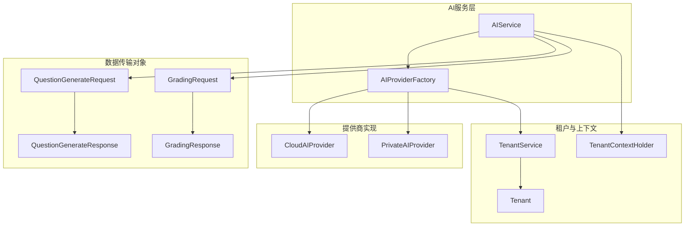
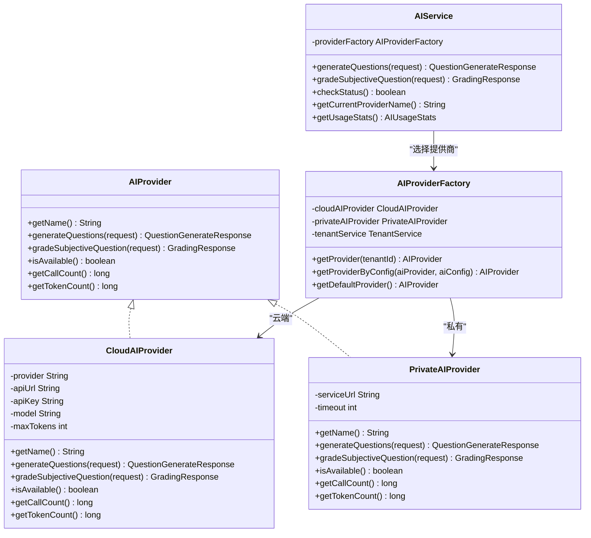
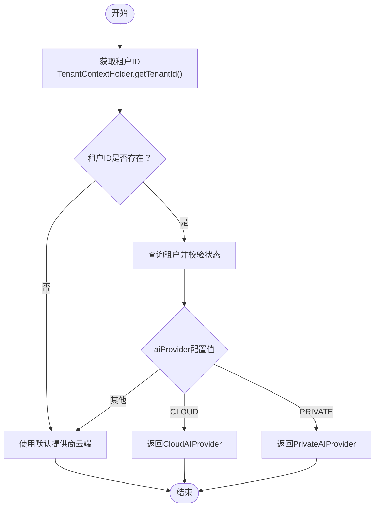
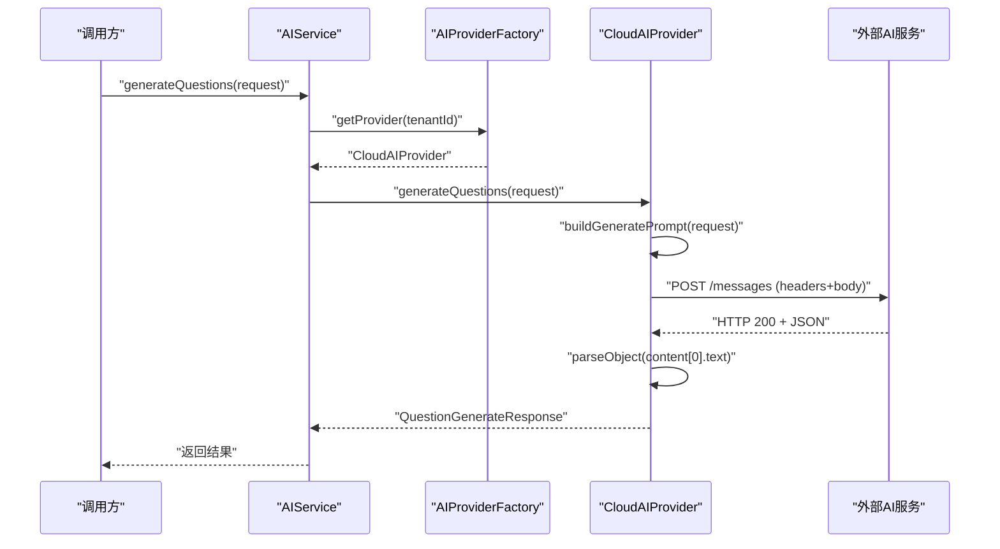
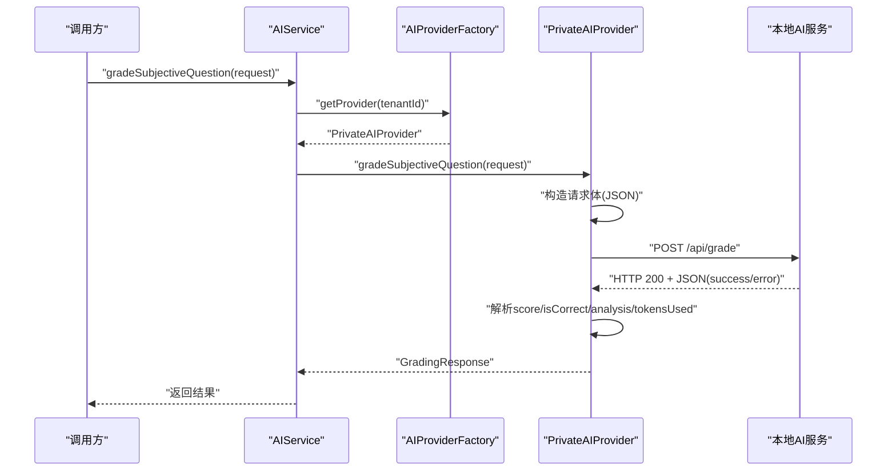
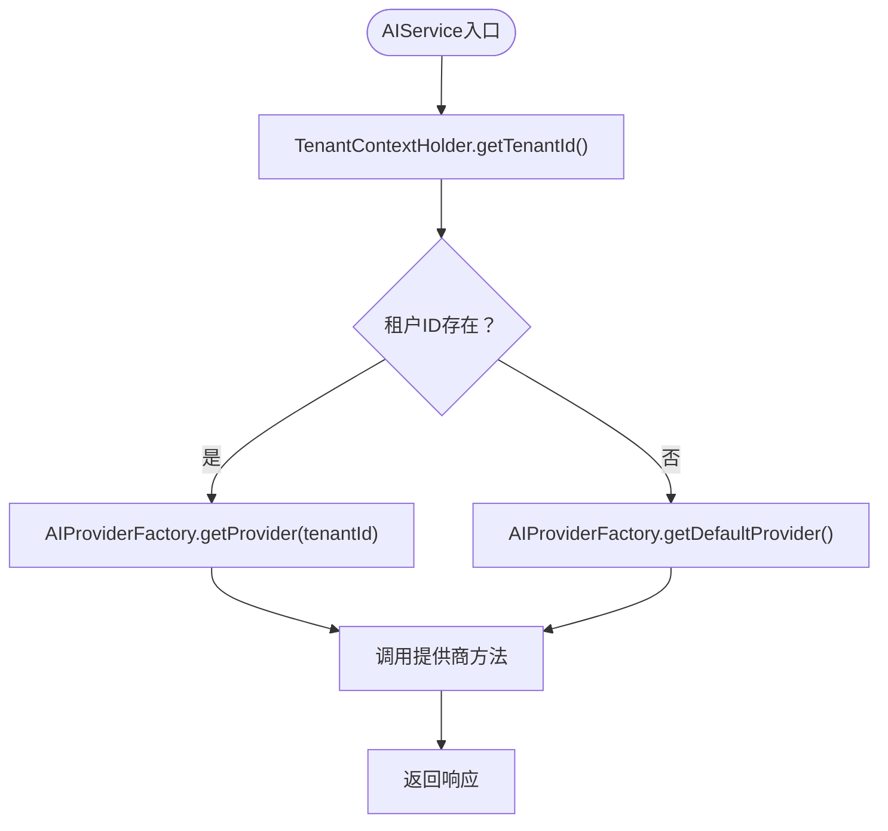
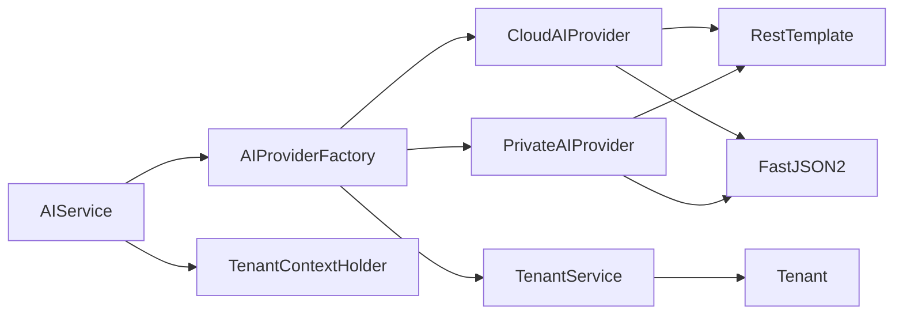

# AI智能服务

<cite>
**本文引用的文件**
- [AIProvider.java](file://backend/src/main/java/com/edu/ai/provider/AIProvider.java)
- [AIProviderFactory.java](file://backend/src/main/java/com/edu/ai/provider/AIProviderFactory.java)
- [CloudAIProvider.java](file://backend/src/main/java/com/edu/ai/provider/CloudAIProvider.java)
- [PrivateAIProvider.java](file://backend/src/main/java/com/edu/ai/provider/PrivateAIProvider.java)
- [AIService.java](file://backend/src/main/java/com/edu/ai/service/AIService.java)
- [GradingRequest.java](file://backend/src/main/java/com/edu/ai/dto/GradingRequest.java)
- [GradingResponse.java](file://backend/src/main/java/com/edu/ai/dto/GradingResponse.java)
- [QuestionGenerateRequest.java](file://backend/src/main/java/com/edu/ai/dto/QuestionGenerateRequest.java)
- [QuestionGenerateResponse.java](file://backend/src/main/java/com/edu/ai/dto/QuestionGenerateResponse.java)
- [application.yml](file://backend/src/main/resources/application.yml)
- [Tenant.java](file://backend/src/main/java/com/edu/tenant/entity/Tenant.java)
- [TenantService.java](file://backend/src/main/java/com/edu/tenant/service/TenantService.java)
- [TenantContextHolder.java](file://backend/src/main/java/com/edu/common/util/TenantContextHolder.java)
- [AIServiceTest.java](file://backend/src/test/java/com/edu/ai/service/AIServiceTest.java)
</cite>

## 目录
1. [简介](#简介)
2. [项目结构](#项目结构)
3. [核心组件](#核心组件)
4. [架构总览](#架构总览)
5. [详细组件分析](#详细组件分析)
6. [依赖分析](#依赖分析)
7. [性能考虑](#性能考虑)
8. [故障排查指南](#故障排查指南)
9. [结论](#结论)
10. [附录](#附录)

## 简介
本文件面向“AI智能服务模块”，系统性阐述其设计与实现，重点包括：
- 基于工厂模式的AI服务提供商抽象与动态切换机制（云端与私有）。
- 云端AI集成方案（以主流平台为例），涵盖请求封装、响应解析与错误处理。
- 私有AI部署策略（本地服务对接、健康检查、超时控制与资源管理）。
- 配置管理、租户维度的AI提供商选择、以及可用性与统计指标。
- 性能优化建议、成本控制策略与监控指标。
- 具体集成示例与最佳实践。

## 项目结构
AI智能服务位于后端模块的AI子包下，采用清晰的分层与职责分离：
- provider：AI服务提供商接口与实现（云端/私有）
- service：统一入口服务，负责租户上下文解析与调用转发
- dto：输入输出数据传输对象
- 资源配置：application.yml中的AI相关配置项
- 租户实体与服务：支持按租户配置AI提供商与配置参数

图表来源
- [AIService.java:17-82](file://backend/src/main/java/com/edu/ai/service/AIService.java#L17-L82)
- [AIProviderFactory.java:15-66](file://backend/src/main/java/com/edu/ai/provider/AIProviderFactory.java#L15-L66)
- [CloudAIProvider.java:24-120](file://backend/src/main/java/com/edu/ai/provider/CloudAIProvider.java#L24-L120)
- [PrivateAIProvider.java:24-194](file://backend/src/main/java/com/edu/ai/provider/PrivateAIProvider.java#L24-L194)
- [QuestionGenerateRequest.java:10-41](file://backend/src/main/java/com/edu/ai/dto/QuestionGenerateRequest.java#L10-L41)
- [QuestionGenerateResponse.java:10-42](file://backend/src/main/java/com/edu/ai/dto/QuestionGenerateResponse.java#L10-L42)
- [GradingRequest.java:8-39](file://backend/src/main/java/com/edu/ai/dto/GradingRequest.java#L8-L39)
- [GradingResponse.java:9-41](file://backend/src/main/java/com/edu/ai/dto/GradingResponse.java#L9-L41)
- [Tenant.java:12-17](file://backend/src/main/java/com/edu/tenant/entity/Tenant.java#L12-L17)
- [TenantService.java:44-56](file://backend/src/main/java/com/edu/tenant/service/TenantService.java#L44-L56)
- [TenantContextHolder.java:8-23](file://backend/src/main/java/com/edu/common/util/TenantContextHolder.java#L8-L23)

章节来源
- [AIService.java:17-82](file://backend/src/main/java/com/edu/ai/service/AIService.java#L17-L82)
- [AIProviderFactory.java:15-66](file://backend/src/main/java/com/edu/ai/provider/AIProviderFactory.java#L15-L66)
- [application.yml:49-59](file://backend/src/main/resources/application.yml#L49-L59)

## 核心组件
- AIProvider接口：定义统一能力（生成题目、主观题批改、可用性检查、调用与Token统计）。
- CloudAIProvider：云端AI实现，基于RestTemplate调用外部API，封装请求与解析响应。
- PrivateAIProvider：私有AI实现，通过HTTP调用本地服务，内置健康检查与超时控制。
- AIProviderFactory：工厂类，依据租户配置动态选择提供商；支持默认提供商与按配置选择。
- AIService：统一入口，负责从租户上下文中解析租户ID，选择提供商并执行业务方法。
- DTO：QuestionGenerateRequest/Response、GradingRequest/Response，承载请求与响应结构。
- 配置：application.yml中的ai.default-provider、ai.cloud.*、ai.private.*。
- 租户与上下文：Tenant、TenantService、TenantContextHolder，支撑按租户切换提供商。

章节来源
- [AIProvider.java:11-41](file://backend/src/main/java/com/edu/ai/provider/AIProvider.java#L11-L41)
- [CloudAIProvider.java:26-120](file://backend/src/main/java/com/edu/ai/provider/CloudAIProvider.java#L26-L120)
- [PrivateAIProvider.java:26-194](file://backend/src/main/java/com/edu/ai/provider/PrivateAIProvider.java#L26-L194)
- [AIProviderFactory.java:18-66](file://backend/src/main/java/com/edu/ai/provider/AIProviderFactory.java#L18-L66)
- [AIService.java:20-82](file://backend/src/main/java/com/edu/ai/service/AIService.java#L20-L82)
- [QuestionGenerateRequest.java:10-41](file://backend/src/main/java/com/edu/ai/dto/QuestionGenerateRequest.java#L10-L41)
- [QuestionGenerateResponse.java:10-42](file://backend/src/main/java/com/edu/ai/dto/QuestionGenerateResponse.java#L10-L42)
- [GradingRequest.java:8-39](file://backend/src/main/java/com/edu/ai/dto/GradingRequest.java#L8-L39)
- [GradingResponse.java:9-41](file://backend/src/main/java/com/edu/ai/dto/GradingResponse.java#L9-L41)
- [application.yml:49-59](file://backend/src/main/resources/application.yml#L49-L59)
- [Tenant.java:12-17](file://backend/src/main/java/com/edu/tenant/entity/Tenant.java#L12-L17)
- [TenantService.java:44-56](file://backend/src/main/java/com/edu/tenant/service/TenantService.java#L44-L56)
- [TenantContextHolder.java:8-23](file://backend/src/main/java/com/edu/common/util/TenantContextHolder.java#L8-L23)

## 架构总览
AI智能服务采用“接口抽象 + 工厂选择 + 统一入口”的架构模式，实现云端与私有AI的统一抽象与动态切换。

图表来源
- [AIProvider.java:11-41](file://backend/src/main/java/com/edu/ai/provider/AIProvider.java#L11-L41)
- [CloudAIProvider.java:26-120](file://backend/src/main/java/com/edu/ai/provider/CloudAIProvider.java#L26-L120)
- [PrivateAIProvider.java:26-194](file://backend/src/main/java/com/edu/ai/provider/PrivateAIProvider.java#L26-L194)
- [AIProviderFactory.java:18-66](file://backend/src/main/java/com/edu/ai/provider/AIProviderFactory.java#L18-L66)
- [AIService.java:20-82](file://backend/src/main/java/com/edu/ai/service/AIService.java#L20-L82)

## 详细组件分析

### 工厂模式与动态切换机制
- 工厂职责：根据租户配置选择云端或私有AI提供商；支持按配置直接选择；提供默认云端提供商。
- 切换逻辑：读取租户的aiProvider字段，若为空或“CLOUD”则使用云端；若为“PRIVATE”则使用私有；否则回退到云端。
- 上下文依赖：通过TenantContextHolder获取当前租户ID；若缺失则走默认提供商路径。

图表来源
- [AIProviderFactory.java:27-44](file://backend/src/main/java/com/edu/ai/provider/AIProviderFactory.java#L27-L44)
- [TenantService.java:44-56](file://backend/src/main/java/com/edu/tenant/service/TenantService.java#L44-L56)
- [TenantContextHolder.java:16-17](file://backend/src/main/java/com/edu/common/util/TenantContextHolder.java#L16-L17)

章节来源
- [AIProviderFactory.java:18-66](file://backend/src/main/java/com/edu/ai/provider/AIProviderFactory.java#L18-L66)
- [TenantService.java:44-56](file://backend/src/main/java/com/edu/tenant/service/TenantService.java#L44-L56)
- [TenantContextHolder.java:8-23](file://backend/src/main/java/com/edu/common/util/TenantContextHolder.java#L8-L23)

### 云端AI集成方案
- 平台适配：当前实现以主流平台为例，封装请求头、消息体与响应解析。
- 请求封装：构建提示词（prompt）、设置模型参数、发送POST请求。
- 响应处理：解析content文本作为结果；提取usage.total_tokens进行Token统计。
- 错误处理：捕获异常并记录日志，返回带错误信息的响应对象。
- 可用性：基于API Key是否配置判断。

图表来源
- [AIService.java:27-32](file://backend/src/main/java/com/edu/ai/service/AIService.java#L27-L32)
- [AIProviderFactory.java:27-44](file://backend/src/main/java/com/edu/ai/provider/AIProviderFactory.java#L27-L44)
- [CloudAIProvider.java:53-78](file://backend/src/main/java/com/edu/ai/provider/CloudAIProvider.java#L53-L78)
- [CloudAIProvider.java:122-165](file://backend/src/main/java/com/edu/ai/provider/CloudAIProvider.java#L122-L165)

章节来源
- [CloudAIProvider.java:26-120](file://backend/src/main/java/com/edu/ai/provider/CloudAIProvider.java#L26-L120)
- [CloudAIProvider.java:122-165](file://backend/src/main/java/com/edu/ai/provider/CloudAIProvider.java#L122-L165)
- [application.yml:51-56](file://backend/src/main/resources/application.yml#L51-L56)

### 私有AI部署策略
- 本地服务对接：通过HTTP调用本地服务的生成与批改接口，支持自定义超时。
- 健康检查：定期GET健康端点，确保服务可用。
- 请求封装：将请求参数序列化为JSON并设置Content-Type。
- 响应解析：解析success标志与questions/score等字段；可选返回tokensUsed并累加统计。
- 错误处理：捕获异常并记录日志，返回error消息。

图表来源
- [AIService.java:37-42](file://backend/src/main/java/com/edu/ai/service/AIService.java#L37-L42)
- [AIProviderFactory.java:27-44](file://backend/src/main/java/com/edu/ai/provider/AIProviderFactory.java#L27-L44)
- [PrivateAIProvider.java:115-172](file://backend/src/main/java/com/edu/ai/provider/PrivateAIProvider.java#L115-L172)
- [PrivateAIProvider.java:174-184](file://backend/src/main/java/com/edu/ai/provider/PrivateAIProvider.java#L174-L184)

章节来源
- [PrivateAIProvider.java:26-194](file://backend/src/main/java/com/edu/ai/provider/PrivateAIProvider.java#L26-L194)
- [application.yml:57-59](file://backend/src/main/resources/application.yml#L57-L59)

### 统一入口与租户上下文
- 统一入口：AIService对外暴露生成题目与批改两个核心方法，内部委托给AIProvider。
- 租户上下文：从TenantContextHolder获取当前租户ID；若缺失则使用默认提供商。
- 使用统计：聚合当前提供商的调用次数与Token统计，并返回可用性状态。

图表来源
- [AIService.java:75-82](file://backend/src/main/java/com/edu/ai/service/AIService.java#L75-L82)
- [TenantContextHolder.java:16-17](file://backend/src/main/java/com/edu/common/util/TenantContextHolder.java#L16-L17)
- [AIProviderFactory.java:64-66](file://backend/src/main/java/com/edu/ai/provider/AIProviderFactory.java#L64-L66)

章节来源
- [AIService.java:20-101](file://backend/src/main/java/com/edu/ai/service/AIService.java#L20-L101)
- [TenantContextHolder.java:8-23](file://backend/src/main/java/com/edu/common/util/TenantContextHolder.java#L8-L23)

### 数据模型与交互契约
- 生成题目请求/响应：包含学科、题型、难度、知识点、数量、附加要求等字段，以及生成的题目列表与Token统计。
- 主观题批改请求/响应：包含题目内容、题型、标准答案、学生答案、满分、是否需要分析等字段，以及评分、正确性标记与分析。

章节来源
- [QuestionGenerateRequest.java:10-41](file://backend/src/main/java/com/edu/ai/dto/QuestionGenerateRequest.java#L10-L41)
- [QuestionGenerateResponse.java:10-42](file://backend/src/main/java/com/edu/ai/dto/QuestionGenerateResponse.java#L10-L42)
- [GradingRequest.java:8-39](file://backend/src/main/java/com/edu/ai/dto/GradingRequest.java#L8-L39)
- [GradingResponse.java:9-41](file://backend/src/main/java/com/edu/ai/dto/GradingResponse.java#L9-L41)

## 依赖分析
- 组件耦合：AIService仅依赖AIProviderFactory与租户上下文；AIProviderFactory依赖CloudAIProvider、PrivateAIProvider与TenantService。
- 外部依赖：RestTemplate用于HTTP通信；FastJSON2用于JSON解析；Spring注解驱动装配。
- 配置依赖：application.yml中的ai.*配置项决定云端与私有服务的行为。

图表来源
- [AIService.java:20-22](file://backend/src/main/java/com/edu/ai/service/AIService.java#L20-L22)
- [AIProviderFactory.java:20-22](file://backend/src/main/java/com/edu/ai/provider/AIProviderFactory.java#L20-L22)
- [CloudAIProvider.java](file://backend/src/main/java/com/edu/ai/provider/CloudAIProvider.java#L43)
- [PrivateAIProvider.java](file://backend/src/main/java/com/edu/ai/provider/PrivateAIProvider.java#L34)
- [TenantService.java:44-56](file://backend/src/main/java/com/edu/tenant/service/TenantService.java#L44-L56)
- [Tenant.java:12-17](file://backend/src/main/java/com/edu/tenant/entity/Tenant.java#L12-L17)
- [TenantContextHolder.java:8-23](file://backend/src/main/java/com/edu/common/util/TenantContextHolder.java#L8-L23)

章节来源
- [AIService.java:17-82](file://backend/src/main/java/com/edu/ai/service/AIService.java#L17-L82)
- [AIProviderFactory.java:15-66](file://backend/src/main/java/com/edu/ai/provider/AIProviderFactory.java#L15-L66)
- [application.yml:49-59](file://backend/src/main/resources/application.yml#L49-L59)

## 性能考虑
- 连接与线程池：当前实现使用RestTemplate默认配置。建议在生产环境引入连接池与超时配置，避免阻塞与资源浪费。
- Token统计：云端实现会累加total_tokens；私有实现支持可选返回tokensUsed。建议在网关或拦截器层统一采集与上报。
- 缓存与预热：对频繁访问的提示模板与静态资源进行缓存；私有模型可考虑预热与并发推理队列。
- 负载均衡与故障转移：当前工厂仅按租户选择单一提供商。建议扩展为多提供商列表与权重/健康度策略，结合熔断与重试。
- 日志与追踪：为每个请求生成traceId，串联租户上下文、提供商选择与外部调用链路，便于定位性能瓶颈。

## 故障排查指南
- 云端AI不可用：检查API Key是否配置；确认外部服务可达与版本头设置；查看响应体解析失败的日志。
- 私有AI不可用：检查本地服务URL与端口；执行健康检查接口；关注超时与异常堆栈。
- 租户配置问题：确认Tenant.aiProvider字段值有效；校验租户状态与有效期；必要时回退到默认提供商。
- 统计不更新：核对AtomicLong的累加逻辑；确认响应中是否包含tokensUsed；检查日志级别与采样策略。

章节来源
- [CloudAIProvider.java:108-110](file://backend/src/main/java/com/edu/ai/provider/CloudAIProvider.java#L108-L110)
- [CloudAIProvider.java:143-165](file://backend/src/main/java/com/edu/ai/provider/CloudAIProvider.java#L143-L165)
- [PrivateAIProvider.java:174-184](file://backend/src/main/java/com/edu/ai/provider/PrivateAIProvider.java#L174-L184)
- [PrivateAIProvider.java:143-171](file://backend/src/main/java/com/edu/ai/provider/PrivateAIProvider.java#L143-L171)
- [TenantService.java:44-56](file://backend/src/main/java/com/edu/tenant/service/TenantService.java#L44-L56)
- [AIServiceTest.java:140-153](file://backend/src/test/java/com/edu/ai/service/AIServiceTest.java#L140-L153)

## 结论
该AI智能服务模块通过接口抽象与工厂模式实现了云端与私有AI的统一接入与动态切换，具备良好的扩展性与可维护性。建议在生产环境中进一步完善连接池、超时与重试、熔断与限流、可观测性与成本控制策略，以满足高并发与高可用需求。

## 附录

### 配置管理与最佳实践
- 默认提供商：在application.yml中设置ai.default-provider，确保租户上下文缺失时的兜底行为。
- 云端配置：ai.cloud.* 包含provider、api-url、api-key、model、max-tokens等；建议通过环境变量注入敏感信息。
- 私有配置：ai.private.* 包含service-url与timeout；建议将本地服务部署在独立容器或进程内，并开启健康检查端点。
- 租户维度切换：Tenant.aiProvider支持“CLOUD”或“PRIVATE”，TenantService提供更新接口；建议在租户创建时即设定默认值。

章节来源
- [application.yml:49-59](file://backend/src/main/resources/application.yml#L49-L59)
- [Tenant.java:16-17](file://backend/src/main/java/com/edu/tenant/entity/Tenant.java#L16-L17)
- [TenantService.java:58-68](file://backend/src/main/java/com/edu/tenant/service/TenantService.java#L58-L68)

### 集成示例与调用流程
- 生成题目：调用AIService.generateQuestions，内部由AIProviderFactory按租户选择提供商，最终由CloudAIProvider或PrivateAIProvider执行请求与解析。
- 批改主观题：调用AIService.gradeSubjectiveQuestion，内部流程同上，返回评分与分析。
- 状态检查与统计：AIService.checkStatus与getUsageStats分别返回可用性与调用/Token统计。

章节来源
- [AIService.java:27-70](file://backend/src/main/java/com/edu/ai/service/AIService.java#L27-L70)
- [AIServiceTest.java:48-137](file://backend/src/test/java/com/edu/ai/service/AIServiceTest.java#L48-L137)