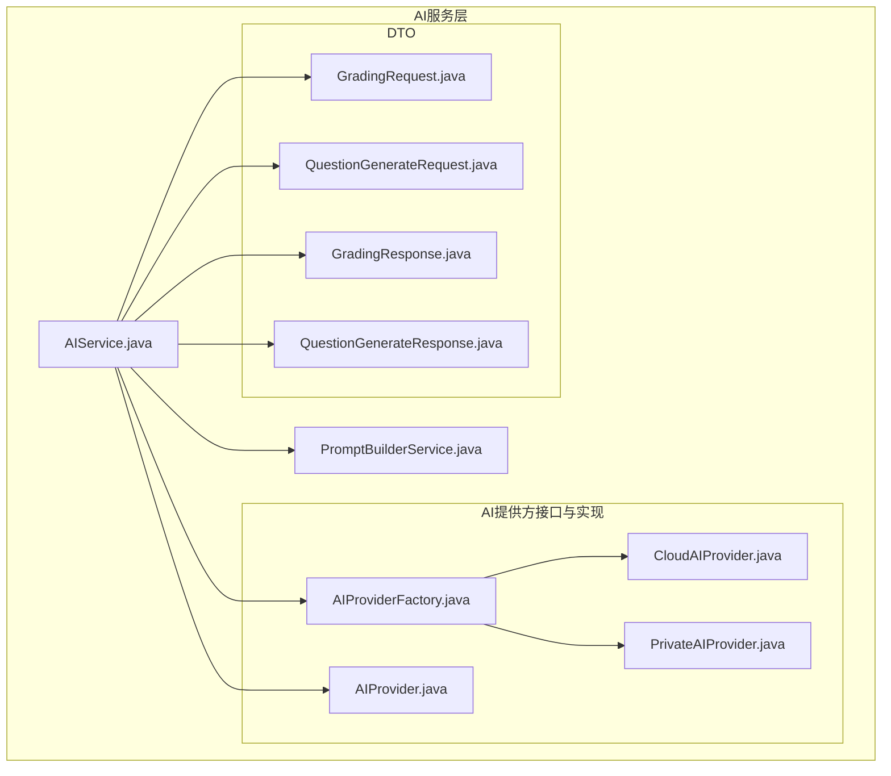
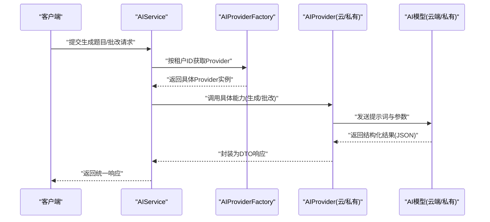
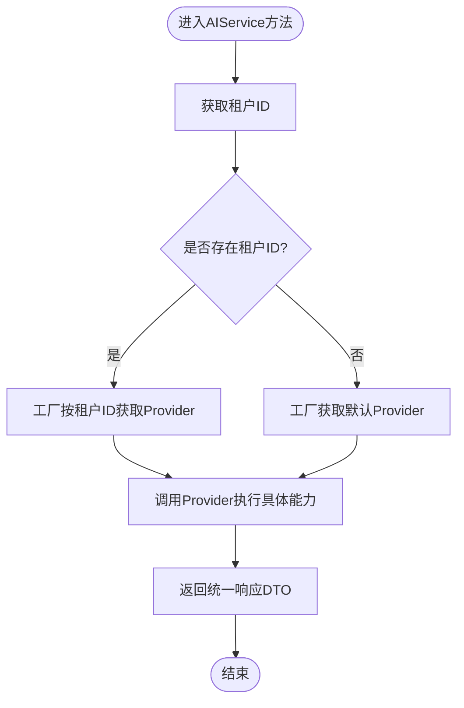
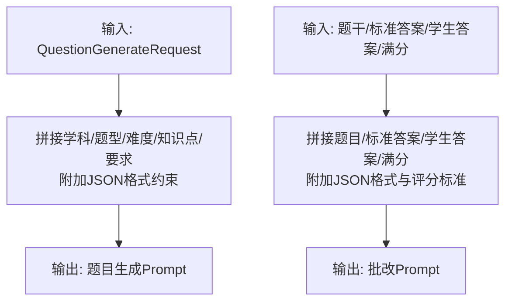
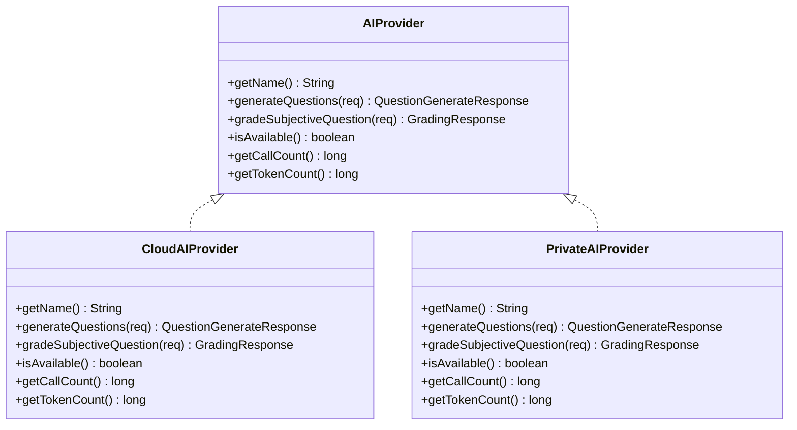
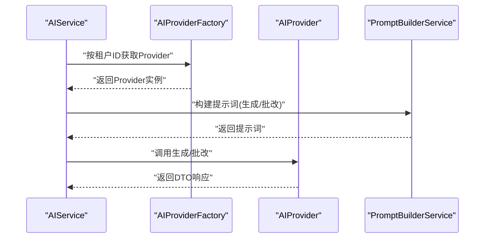
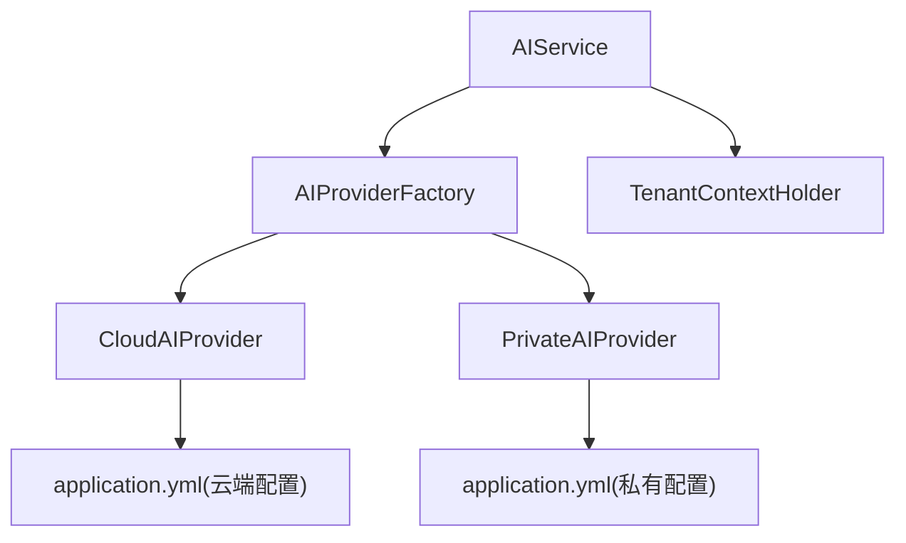

# AI服务层

<cite>
**本文引用的文件**
- [AIService.java](file://backend/src/main/java/com/edu/ai/service/AIService.java)
- [PromptBuilderService.java](file://backend/src/main/java/com/edu/ai/service/PromptBuilderService.java)
- [AIProvider.java](file://backend/src/main/java/com/edu/ai/provider/AIProvider.java)
- [AIProviderFactory.java](file://backend/src/main/java/com/edu/ai/provider/AIProviderFactory.java)
- [CloudAIProvider.java](file://backend/src/main/java/com/edu/ai/provider/CloudAIProvider.java)
- [PrivateAIProvider.java](file://backend/src/main/java/com/edu/ai/provider/PrivateAIProvider.java)
- [GradingRequest.java](file://backend/src/main/java/com/edu/ai/dto/GradingRequest.java)
- [GradingResponse.java](file://backend/src/main/java/com/edu/ai/dto/GradingResponse.java)
- [QuestionGenerateRequest.java](file://backend/src/main/java/com/edu/ai/dto/QuestionGenerateRequest.java)
- [QuestionGenerateResponse.java](file://backend/src/main/java/com/edu/ai/dto/QuestionGenerateResponse.java)
- [application.yml](file://backend/src/main/resources/application.yml)
- [AIServiceTest.java](file://backend/src/test/java/com/edu/ai/service/AIServiceTest.java)
- [PromptBuilderServiceTest.java](file://backend/src/test/java/com/edu/ai/service/PromptBuilderServiceTest.java)
</cite>

## 目录
1. [引言](#引言)
2. [项目结构](#项目结构)
3. [核心组件](#核心组件)
4. [架构总览](#架构总览)
5. [详细组件分析](#详细组件分析)
6. [依赖分析](#依赖分析)
7. [性能考虑](#性能考虑)
8. [故障排查指南](#故障排查指南)
9. [结论](#结论)
10. [附录](#附录)

## 引言
本文件面向“AI服务层”的综合技术文档，聚焦以下目标：
- 深入阐述AI服务的核心业务逻辑：智能出题、自动批改、内容生成等。
- 详解AIService的服务接口设计与调用流程，包括方法定义、参数传递与返回值处理。
- 全面说明PromptBuilderService在提示词构建、模板管理与上下文处理中的作用。
- 描述从请求接收、参数校验、AI提供商选择到结果返回的完整链路。
- 给出配置管理、性能优化与错误处理策略，并结合具体业务场景（题目生成、答案批改、PPT内容制作）进行说明。
- 解释AI服务与其他模块的集成方式与数据流转机制。

## 项目结构
AI服务层位于后端工程的AI包下，采用“接口+工厂+多实现”的分层设计，配合DTO与提示词构建服务，形成清晰的职责边界与扩展性。

图表来源
- [AIService.java:1-102](file://backend/src/main/java/com/edu/ai/service/AIService.java#L1-L102)
- [PromptBuilderService.java:1-121](file://backend/src/main/java/com/edu/ai/service/PromptBuilderService.java#L1-L121)
- [AIProvider.java:1-42](file://backend/src/main/java/com/edu/ai/provider/AIProvider.java#L1-L42)
- [AIProviderFactory.java:1-67](file://backend/src/main/java/com/edu/ai/provider/AIProviderFactory.java#L1-L67)
- [CloudAIProvider.java:1-267](file://backend/src/main/java/com/edu/ai/provider/CloudAIProvider.java#L1-L267)
- [PrivateAIProvider.java:1-195](file://backend/src/main/java/com/edu/ai/provider/PrivateAIProvider.java#L1-L195)
- [GradingRequest.java:1-40](file://backend/src/main/java/com/edu/ai/dto/GradingRequest.java#L1-L40)
- [GradingResponse.java:1-42](file://backend/src/main/java/com/edu/ai/dto/GradingResponse.java#L1-L42)
- [QuestionGenerateRequest.java:1-42](file://backend/src/main/java/com/edu/ai/dto/QuestionGenerateRequest.java#L1-L42)
- [QuestionGenerateResponse.java:1-43](file://backend/src/main/java/com/edu/ai/dto/QuestionGenerateResponse.java#L1-L43)

章节来源
- [AIService.java:1-102](file://backend/src/main/java/com/edu/ai/service/AIService.java#L1-L102)
- [application.yml:49-60](file://backend/src/main/resources/application.yml#L49-L60)

## 核心组件
- AIService：AI服务统一入口，负责租户上下文识别、AI提供商选择、调用统计与状态查询；对外暴露“生成题目”“批改主观题”“状态检查”“使用统计”等方法。
- PromptBuilderService：提示词构建器，根据请求参数动态拼装符合AI模型输出格式的提示词，支持题目生成与主观题批改两类场景。
- AIProvider接口与实现：抽象AI能力，CloudAIProvider对接云端模型（如Claude），PrivateAIProvider对接私有部署服务；两者均提供统一的调用计数与Token统计能力。
- DTO：GradingRequest/GradingResponse与QuestionGenerateRequest/QuestionGenerateResponse承载请求与响应的数据结构，保证跨模块一致的数据契约。

章节来源
- [AIService.java:14-102](file://backend/src/main/java/com/edu/ai/service/AIService.java#L14-L102)
- [PromptBuilderService.java:7-121](file://backend/src/main/java/com/edu/ai/service/PromptBuilderService.java#L7-L121)
- [AIProvider.java:8-42](file://backend/src/main/java/com/edu/ai/provider/AIProvider.java#L8-L42)
- [CloudAIProvider.java:21-267](file://backend/src/main/java/com/edu/ai/provider/CloudAIProvider.java#L21-L267)
- [PrivateAIProvider.java:21-195](file://backend/src/main/java/com/edu/ai/provider/PrivateAIProvider.java#L21-L195)
- [GradingRequest.java:5-40](file://backend/src/main/java/com/edu/ai/dto/GradingRequest.java#L5-L40)
- [GradingResponse.java:7-42](file://backend/src/main/java/com/edu/ai/dto/GradingResponse.java#L7-L42)
- [QuestionGenerateRequest.java:7-42](file://backend/src/main/java/com/edu/ai/dto/QuestionGenerateRequest.java#L7-L42)
- [QuestionGenerateResponse.java:7-43](file://backend/src/main/java/com/edu/ai/dto/QuestionGenerateResponse.java#L7-L43)

## 架构总览
AI服务层通过工厂模式按租户选择具体AI提供商，统一对外提供“智能出题”“自动批改”两大能力。提示词构建服务贯穿请求准备阶段，确保输出格式与评分规则满足下游解析。

图表来源
- [AIService.java:24-82](file://backend/src/main/java/com/edu/ai/service/AIService.java#L24-L82)
- [AIProviderFactory.java:24-66](file://backend/src/main/java/com/edu/ai/provider/AIProviderFactory.java#L24-L66)
- [CloudAIProvider.java:52-105](file://backend/src/main/java/com/edu/ai/provider/CloudAIProvider.java#L52-L105)
- [PrivateAIProvider.java:43-172](file://backend/src/main/java/com/edu/ai/provider/PrivateAIProvider.java#L43-L172)

## 详细组件分析

### AIService 服务接口与调用流程
- 方法概览
  - generateQuestions：生成题目，委托当前Provider执行。
  - gradeSubjectiveQuestion：批改主观题，委托当前Provider执行。
  - checkStatus：检查Provider可用性。
  - getCurrentProviderName：获取当前Provider名称。
  - getUsageStats：聚合Provider调用次数与Token用量。
- 调用流程要点
  - 租户上下文：优先从租户上下文获取租户ID，若缺失则回退至默认Provider。
  - 日志记录：对关键操作进行日志记录，便于审计与排障。
  - 统计聚合：将Provider的调用计数与Token统计汇总为统一视图。

图表来源
- [AIService.java:75-82](file://backend/src/main/java/com/edu/ai/service/AIService.java#L75-L82)
- [AIProviderFactory.java:27-44](file://backend/src/main/java/com/edu/ai/provider/AIProviderFactory.java#L27-L44)

章节来源
- [AIService.java:24-102](file://backend/src/main/java/com/edu/ai/service/AIService.java#L24-L102)
- [AIServiceTest.java:48-154](file://backend/src/test/java/com/edu/ai/service/AIServiceTest.java#L48-L154)

### PromptBuilderService 提示词构建
- 题目生成Prompt
  - 动态拼接学科、题型、难度、知识点、额外要求与JSON格式约束。
  - 对不同题型（如选择题）插入对应字段占位，确保模型输出结构一致。
- 主观题批改Prompt
  - 固定模板：题目、标准答案、学生答案、满分；并给出JSON结构与评分标准（0/1/2）。
- 中文映射
  - 将学科、题型、难度等枚举值映射为中文，提升提示词可读性与一致性。

图表来源
- [PromptBuilderService.java:17-61](file://backend/src/main/java/com/edu/ai/service/PromptBuilderService.java#L17-L61)
- [PromptBuilderService.java:66-90](file://backend/src/main/java/com/edu/ai/service/PromptBuilderService.java#L66-L90)

章节来源
- [PromptBuilderService.java:14-121](file://backend/src/main/java/com/edu/ai/service/PromptBuilderService.java#L14-L121)
- [PromptBuilderServiceTest.java:15-105](file://backend/src/test/java/com/edu/ai/service/PromptBuilderServiceTest.java#L15-L105)

### AIProvider 接口与实现
- 接口职责
  - 统一能力：getName、generateQuestions、gradeSubjectiveQuestion、isAvailable、getCallCount、getTokenCount。
- CloudAIProvider
  - 云端模型对接：基于HTTP调用，解析响应内容与Token统计；对异常进行捕获并填充错误信息。
  - 输出解析：将模型返回的JSON字符串解析为DTO对象。
- PrivateAIProvider
  - 私有服务对接：向私有服务的REST接口发起请求，解析统一响应结构；支持健康检查。
  - 输出解析：将私有服务返回的JSON解析为DTO对象。

图表来源
- [AIProvider.java:11-42](file://backend/src/main/java/com/edu/ai/provider/AIProvider.java#L11-L42)
- [CloudAIProvider.java:26-267](file://backend/src/main/java/com/edu/ai/provider/CloudAIProvider.java#L26-L267)
- [PrivateAIProvider.java:26-195](file://backend/src/main/java/com/edu/ai/provider/PrivateAIProvider.java#L26-L195)

章节来源
- [AIProvider.java:8-42](file://backend/src/main/java/com/edu/ai/provider/AIProvider.java#L8-L42)
- [CloudAIProvider.java:47-237](file://backend/src/main/java/com/edu/ai/provider/CloudAIProvider.java#L47-L237)
- [PrivateAIProvider.java:38-194](file://backend/src/main/java/com/edu/ai/provider/PrivateAIProvider.java#L38-L194)

### DTO 数据模型
- QuestionGenerateRequest/QuestionGenerateResponse
  - 请求：学科、题型、难度、知识点、数量、额外要求。
  - 响应：题目集合（含内容、选项、答案、解析、难度、知识点等）、成功标志、错误信息、Token用量。
- GradingRequest/GradingResponse
  - 请求：题目内容、题型、标准答案、学生答案、满分、是否需要分析。
  - 响应：得分（精度为小数）、正确性标记（0/1/2）、分析、成功标志、错误信息、Token用量。

章节来源
- [QuestionGenerateRequest.java:7-42](file://backend/src/main/java/com/edu/ai/dto/QuestionGenerateRequest.java#L7-L42)
- [QuestionGenerateResponse.java:7-43](file://backend/src/main/java/com/edu/ai/dto/QuestionGenerateResponse.java#L7-L43)
- [GradingRequest.java:5-40](file://backend/src/main/java/com/edu/ai/dto/GradingRequest.java#L5-L40)
- [GradingResponse.java:7-42](file://backend/src/main/java/com/edu/ai/dto/GradingResponse.java#L7-L42)

### 调用流程与控制流
- 智能出题
  - 输入：QuestionGenerateRequest。
  - 处理：AIService选择Provider -> Provider构造提示词 -> 调用模型 -> 解析JSON -> 返回QuestionGenerateResponse。
- 自动批改
  - 输入：GradingRequest。
  - 处理：AIService选择Provider -> Provider构造批改提示词 -> 调用模型 -> 解析JSON -> 返回GradingResponse。
- 状态与统计
  - AIService通过Provider暴露的统计接口聚合调用次数与Token用量，用于监控与成本控制。

图表来源
- [AIService.java:27-42](file://backend/src/main/java/com/edu/ai/service/AIService.java#L27-L42)
- [AIProviderFactory.java:27-44](file://backend/src/main/java/com/edu/ai/provider/AIProviderFactory.java#L27-L44)
- [PromptBuilderService.java:17-90](file://backend/src/main/java/com/edu/ai/service/PromptBuilderService.java#L17-L90)

## 依赖分析
- 组件耦合
  - AIService仅依赖AIProviderFactory与Tenant上下文，低耦合高内聚。
  - Provider实现与外部服务解耦，通过HTTP接口交互，便于替换与扩展。
- 外部依赖
  - 云端模型：RestTemplate + HTTP调用，配置项来自application.yml。
  - 私有模型：RestTemplate + 内部服务接口，支持健康检查。
- 配置依赖
  - 云端模型：provider、api-url、api-key、model、max-tokens。
  - 私有模型：service-url、timeout。

图表来源
- [AIService.java:22-82](file://backend/src/main/java/com/edu/ai/service/AIService.java#L22-L82)
- [AIProviderFactory.java:20-66](file://backend/src/main/java/com/edu/ai/provider/AIProviderFactory.java#L20-L66)
- [application.yml:49-60](file://backend/src/main/resources/application.yml#L49-L60)

章节来源
- [application.yml:49-60](file://backend/src/main/resources/application.yml#L49-L60)

## 性能考虑
- 调用统计与成本控制
  - Provider内部维护原子计数器，记录调用次数与Token用量；AIService聚合展示，便于成本分析与阈值告警。
- 超时与重试
  - 私有Provider支持超时配置；建议在网关或调用侧增加超时与重试策略，避免阻塞。
- 输出解析健壮性
  - Provider对JSON解析失败进行降级处理（如设置默认值），保障服务稳定性。
- 缓存与预热
  - 可在上层引入轻量缓存（如按租户+题型维度）减少重复调用；注意缓存失效策略与一致性。

## 故障排查指南
- 常见问题定位
  - 无法连接云端/私有服务：检查配置项与网络连通性；查看Provider的可用性检测逻辑。
  - 提示词格式不匹配：确认PromptBuilderService输出的JSON格式约束是否被严格遵循。
  - 解析失败：关注Provider对异常的捕获与错误信息填充，必要时开启更详细的日志级别。
- 关键日志点
  - AIService在生成与批改前后打印关键信息，便于快速定位问题。
  - Provider在调用前后记录调用次数与Token统计，便于追踪用量。
- 单元测试参考
  - AIServiceTest与PromptBuilderServiceTest提供了典型场景的断言与覆盖，可作为回归测试基线。

章节来源
- [AIServiceTest.java:48-154](file://backend/src/test/java/com/edu/ai/service/AIServiceTest.java#L48-L154)
- [PromptBuilderServiceTest.java:15-105](file://backend/src/test/java/com/edu/ai/service/PromptBuilderServiceTest.java#L15-L105)

## 结论
AI服务层通过清晰的接口与工厂模式实现了“多租户、多提供商”的灵活扩展；PromptBuilderService确保了提示词的一致性与可解析性；Provider实现屏蔽了外部差异，使上层调用保持稳定。结合完善的统计与错误处理机制，该架构能够支撑智能出题、自动批改等核心业务场景，并为后续内容生成等新能力预留了良好的扩展空间。

## 附录

### 业务场景示例
- 题目生成
  - 场景：按学科、题型、难度与知识点批量生成题目。
  - 流程：AIService接收请求 -> 选择Provider -> 构建提示词 -> 调用模型 -> 解析JSON -> 返回题目集合。
- 答案批改
  - 场景：对主观题进行评分与分析，支持完全正确/部分正确/错误三态。
  - 流程：AIService接收请求 -> 构建批改提示词 -> 调用模型 -> 解析JSON -> 返回评分与分析。
- PPT内容制作
  - 场景：结合现有AI能力，可扩展提示词模板与输出结构，实现内容生成与排版建议。
  - 注意：需在PromptBuilderService中新增模板，并在Provider实现中适配输出格式。

### 集成与数据流转
- 集成点
  - 控制器层通过AIService暴露REST接口；前端通过统一DTO进行数据交互。
  - 租户上下文贯穿调用链，确保不同租户使用不同的Provider与配置。
- 数据流
  - 请求：DTO -> AIService -> Provider -> 外部模型。
  - 响应：外部模型 -> Provider解析 -> DTO -> AIService -> 控制器 -> 前端。