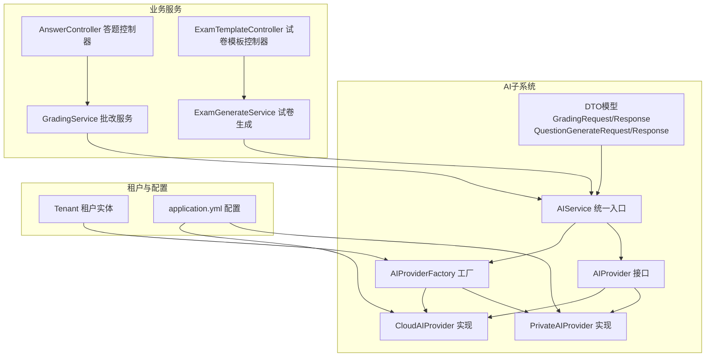
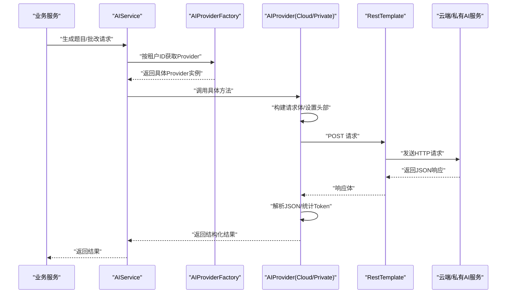
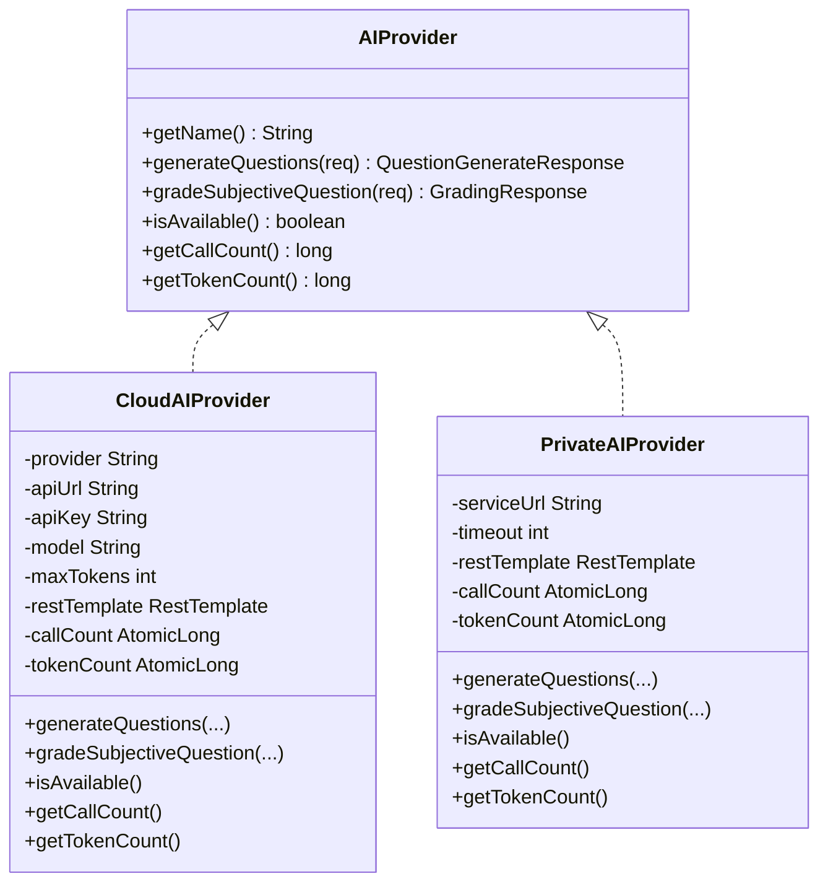
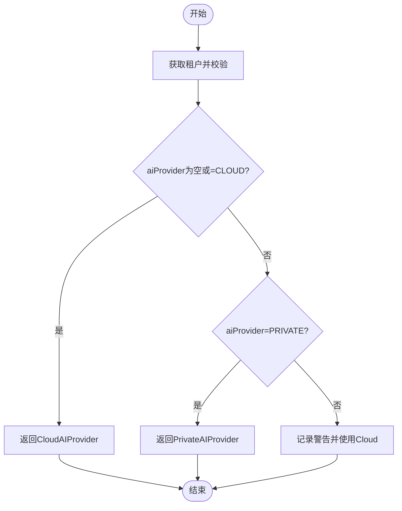
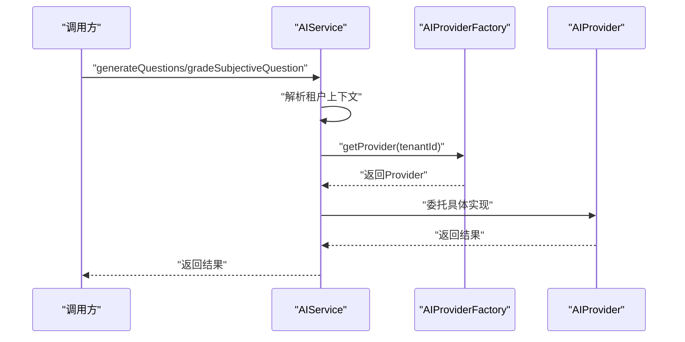
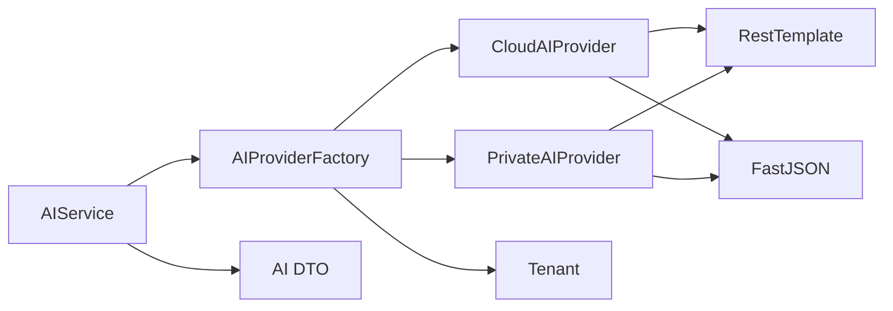

# 云端AI提供商

<cite>
**本文引用的文件**
- [AIProvider.java](file://backend/src/main/java/com/edu/ai/provider/AIProvider.java)
- [AIProviderFactory.java](file://backend/src/main/java/com/edu/ai/provider/AIProviderFactory.java)
- [CloudAIProvider.java](file://backend/src/main/java/com/edu/ai/provider/CloudAIProvider.java)
- [PrivateAIProvider.java](file://backend/src/main/java/com/edu/ai/provider/PrivateAIProvider.java)
- [AIService.java](file://backend/src/main/java/com/edu/ai/service/AIService.java)
- [GradingRequest.java](file://backend/src/main/java/com/edu/ai/dto/GradingRequest.java)
- [GradingResponse.java](file://backend/src/main/java/com/edu/ai/dto/GradingResponse.java)
- [QuestionGenerateRequest.java](file://backend/src/main/java/com/edu/ai/dto/QuestionGenerateRequest.java)
- [QuestionGenerateResponse.java](file://backend/src/main/java/com/edu/ai/dto/QuestionGenerateResponse.java)
- [application.yml](file://backend/src/main/resources/application.yml)
- [Tenant.java](file://backend/src/main/java/com/edu/tenant/entity/Tenant.java)
- [GradingService.java](file://backend/src/main/java/com/edu/grading/service/GradingService.java)
- [ExamGenerateService.java](file://backend/src/main/java/com/edu/exam/service/ExamGenerateService.java)
- [AnswerController.java](file://backend/src/main/java/com/edu/grading/controller/AnswerController.java)
- [ExamTemplateController.java](file://backend/src/main/java/com/edu/exam/controller/ExamTemplateController.java)
</cite>

## 目录
1. [简介](#简介)
2. [项目结构](#项目结构)
3. [核心组件](#核心组件)
4. [架构总览](#架构总览)
5. [组件详解](#组件详解)
6. [依赖关系分析](#依赖关系分析)
7. [性能与成本控制](#性能与成本控制)
8. [故障排查指南](#故障排查指南)
9. [结论](#结论)
10. [附录](#附录)

## 简介
本文件面向“云端AI提供商”的集成与运维，系统性阐述如何在教育平台中对接主流云端AI服务（以Claude为例），并提供统一的AI服务抽象、工厂化选择、请求封装与响应解析、错误处理与重试策略建议、性能监控与日志调试方法，以及可用性保障与故障转移思路。文档同时给出私有部署AI提供商的适配参考，便于在不同租户间灵活切换。

## 项目结构
围绕AI能力的关键模块集中在后端工程的AI子系统，采用“接口-实现-工厂-服务入口”的分层设计，并通过租户配置驱动提供商选择。

图示来源
- [AIService.java:17-82](file://backend/src/main/java/com/edu/ai/service/AIService.java#L17-L82)
- [AIProviderFactory.java:15-66](file://backend/src/main/java/com/edu/ai/provider/AIProviderFactory.java#L15-L66)
- [CloudAIProvider.java:24-120](file://backend/src/main/java/com/edu/ai/provider/CloudAIProvider.java#L24-L120)
- [PrivateAIProvider.java:24-195](file://backend/src/main/java/com/edu/ai/provider/PrivateAIProvider.java#L24-L195)
- [application.yml:49-60](file://backend/src/main/resources/application.yml#L49-L60)
- [Tenant.java:12-20](file://backend/src/main/java/com/edu/tenant/entity/Tenant.java#L12-L20)

章节来源
- [AIService.java:17-102](file://backend/src/main/java/com/edu/ai/service/AIService.java#L17-L102)
- [AIProviderFactory.java:15-66](file://backend/src/main/java/com/edu/ai/provider/AIProviderFactory.java#L15-L66)
- [application.yml:49-60](file://backend/src/main/resources/application.yml#L49-L60)

## 核心组件
- AIProvider 接口：定义统一能力（生成题目、主观题批改、可用性检查、调用与Token统计）。
- CloudAIProvider：基于RestTemplate对接云端AI（Claude），封装请求头、消息体、响应解析与Token统计。
- PrivateAIProvider：对接私有部署AI服务，支持健康检查与本地Token统计。
- AIProviderFactory：依据租户配置动态选择提供商（默认云端，可切换私有）。
- AIService：业务统一入口，负责日志、统计与租户上下文解析。

章节来源
- [AIProvider.java:11-42](file://backend/src/main/java/com/edu/ai/provider/AIProvider.java#L11-L42)
- [CloudAIProvider.java:24-267](file://backend/src/main/java/com/edu/ai/provider/CloudAIProvider.java#L24-L267)
- [PrivateAIProvider.java:24-195](file://backend/src/main/java/com/edu/ai/provider/PrivateAIProvider.java#L24-L195)
- [AIProviderFactory.java:15-66](file://backend/src/main/java/com/edu/ai/provider/AIProviderFactory.java#L15-L66)
- [AIService.java:17-102](file://backend/src/main/java/com/edu/ai/service/AIService.java#L17-L102)

## 架构总览
下图展示从业务调用到AI提供商的完整链路，包括租户选择、请求构建、HTTP通信与响应解析。

图示来源
- [AIService.java:27-82](file://backend/src/main/java/com/edu/ai/service/AIService.java#L27-L82)
- [AIProviderFactory.java:27-44](file://backend/src/main/java/com/edu/ai/provider/AIProviderFactory.java#L27-L44)
- [CloudAIProvider.java:122-165](file://backend/src/main/java/com/edu/ai/provider/CloudAIProvider.java#L122-L165)
- [PrivateAIProvider.java:53-172](file://backend/src/main/java/com/edu/ai/provider/PrivateAIProvider.java#L53-L172)

## 组件详解

### AIProvider 接口与实现
- 统一能力：生成题目、主观题批改、可用性检查、调用次数与Token统计。
- Cloud实现要点：
  - 配置项：提供商名、API地址、API Key、模型、最大输出Token。
  - 请求封装：设置Content-Type、API Key头、Anthropic版本头；消息体包含model、max_tokens与messages。
  - 响应解析：提取content[0].text作为文本；解析usage.total_tokens进行统计。
  - 可用性：仅当API Key非空即视为可用。
- Private实现要点：
  - 配置项：服务URL、超时。
  - 请求封装：向本地服务的/api/generate-questions与/api/grade路径发起POST。
  - 响应解析：读取success字段与questions或score等字段；可选tokensUsed。
  - 健康检查：访问/service-url/health GET，200即可用。

图示来源
- [AIProvider.java:11-42](file://backend/src/main/java/com/edu/ai/provider/AIProvider.java#L11-L42)
- [CloudAIProvider.java:24-267](file://backend/src/main/java/com/edu/ai/provider/CloudAIProvider.java#L24-L267)
- [PrivateAIProvider.java:24-195](file://backend/src/main/java/com/edu/ai/provider/PrivateAIProvider.java#L24-L195)

章节来源
- [AIProvider.java:11-42](file://backend/src/main/java/com/edu/ai/provider/AIProvider.java#L11-L42)
- [CloudAIProvider.java:24-267](file://backend/src/main/java/com/edu/ai/provider/CloudAIProvider.java#L24-L267)
- [PrivateAIProvider.java:24-195](file://backend/src/main/java/com/edu/ai/provider/PrivateAIProvider.java#L24-L195)

### AIProviderFactory 工厂与租户选择
- 根据租户实体的aiProvider字段选择云端或私有AI；默认云端。
- 支持按配置直接获取Provider或返回默认云端。
- 日志记录当前使用的AI提供商，便于排障。

图示来源
- [AIProviderFactory.java:27-44](file://backend/src/main/java/com/edu/ai/provider/AIProviderFactory.java#L27-L44)
- [Tenant.java:16-17](file://backend/src/main/java/com/edu/tenant/entity/Tenant.java#L16-L17)

章节来源
- [AIProviderFactory.java:15-66](file://backend/src/main/java/com/edu/ai/provider/AIProviderFactory.java#L15-L66)
- [Tenant.java:12-20](file://backend/src/main/java/com/edu/tenant/entity/Tenant.java#L12-L20)

### AIService 统一入口
- 从租户上下文中解析tenantId，若缺失则回退至默认Provider。
- 提供状态检查、当前Provider名称查询与使用统计（调用次数、Token用量、可用性）。
- 将业务请求转发给具体Provider并返回结果。

图示来源
- [AIService.java:27-82](file://backend/src/main/java/com/edu/ai/service/AIService.java#L27-L82)
- [AIProviderFactory.java:27-44](file://backend/src/main/java/com/edu/ai/provider/AIProviderFactory.java#L27-L44)

章节来源
- [AIService.java:17-102](file://backend/src/main/java/com/edu/ai/service/AIService.java#L17-L102)

### 请求与响应模型
- 生成题目请求/响应：包含学科、题型、难度、知识点、数量、附加要求及生成的题目集合与Token用量。
- 主观题批改请求/响应：包含题目内容、题型、标准答案、学生答案、满分、是否需要分析及评分、正确性标记与分析。

章节来源
- [QuestionGenerateRequest.java:11-42](file://backend/src/main/java/com/edu/ai/dto/QuestionGenerateRequest.java#L11-L42)
- [QuestionGenerateResponse.java:11-43](file://backend/src/main/java/com/edu/ai/dto/QuestionGenerateResponse.java#L11-L43)
- [GradingRequest.java:9-40](file://backend/src/main/java/com/edu/ai/dto/GradingRequest.java#L9-L40)
- [GradingResponse.java:11-42](file://backend/src/main/java/com/edu/ai/dto/GradingResponse.java#L11-L42)

### API调用流程与封装策略
- 云端AI（CloudAIProvider）：
  - HTTP方法：POST
  - 协议：HTTP/1.1（RestTemplate默认）
  - 头部：Content-Type: application/json；x-api-key；anthropic-version
  - 路径：由配置注入（默认Anthropic Messages API）
  - 请求体：包含model、max_tokens与messages（用户消息）
  - 响应解析：提取content[0].text；统计usage.total_tokens
- 私有AI（PrivateAIProvider）：
  - HTTP方法：POST
  - 路径：/api/generate-questions 与 /api/grade
  - 健康检查：GET /health
  - 响应解析：读取success字段与questions/score等；可选tokensUsed

章节来源
- [CloudAIProvider.java:122-165](file://backend/src/main/java/com/edu/ai/provider/CloudAIProvider.java#L122-L165)
- [PrivateAIProvider.java:53-172](file://backend/src/main/java/com/edu/ai/provider/PrivateAIProvider.java#L53-L172)

### 错误处理与可用性
- CloudAIProvider：
  - 可用性：API Key非空即可用。
  - 异常：捕获运行时异常并记录错误信息；响应解析失败抛出异常。
- PrivateAIProvider：
  - 可用性：健康检查GET /health返回200视为可用。
  - 异常：捕获异常并记录错误信息；响应success=false时设置errorMessage。
- AIService：
  - 统一返回success与errorMessage；提供状态查询与统计。

章节来源
- [CloudAIProvider.java:108-110](file://backend/src/main/java/com/edu/ai/provider/CloudAIProvider.java#L108-L110)
- [CloudAIProvider.java:72-75](file://backend/src/main/java/com/edu/ai/provider/CloudAIProvider.java#L72-L75)
- [PrivateAIProvider.java:174-184](file://backend/src/main/java/com/edu/ai/provider/PrivateAIProvider.java#L174-L184)
- [PrivateAIProvider.java:107-110](file://backend/src/main/java/com/edu/ai/provider/PrivateAIProvider.java#L107-L110)
- [AIService.java:47-70](file://backend/src/main/java/com/edu/ai/service/AIService.java#L47-L70)

### 配置与密钥管理
- application.yml中提供默认配置项：
  - ai.default-provider：默认提供商类型
  - ai.cloud.provider、ai.cloud.api-url、ai.cloud.api-key、ai.cloud.model、ai.cloud.max-tokens
  - ai.private.service-url、ai.private.timeout
- API Key通过环境变量注入（如CLAUDE_API_KEY），避免硬编码。

章节来源
- [application.yml:49-60](file://backend/src/main/resources/application.yml#L49-L60)

### 在业务中的应用
- 答题与批改：AnswerController负责答题提交与提交答题卡；GradingService执行规则引擎批改，结合AI评分与分析（若扩展）。
- 试卷生成：ExamGenerateService支持多种策略（简单、智能、AI），当前AI策略为占位实现，未来可接入AIProvider生成个性化试卷。

章节来源
- [AnswerController.java:22-140](file://backend/src/main/java/com/edu/grading/controller/AnswerController.java#L22-L140)
- [GradingService.java:34-80](file://backend/src/main/java/com/edu/grading/service/GradingService.java#L34-L80)
- [ExamGenerateService.java:34-101](file://backend/src/main/java/com/edu/exam/service/ExamGenerateService.java#L34-L101)

## 依赖关系分析
- 模块内聚：AIProvider接口与实现解耦，工厂负责选择，服务层统一路由。
- 外部依赖：RestTemplate用于HTTP通信；FastJSON用于JSON解析；Spring配置注入用于密钥与参数。
- 潜在风险：CloudAIProvider直接依赖外部API；需关注网络波动与限流；PrivateAIProvider依赖本地服务健康状态。

图示来源
- [AIService.java:22-82](file://backend/src/main/java/com/edu/ai/service/AIService.java#L22-L82)
- [AIProviderFactory.java:20-22](file://backend/src/main/java/com/edu/ai/provider/AIProviderFactory.java#L20-L22)
- [CloudAIProvider.java:43](file://backend/src/main/java/com/edu/ai/provider/CloudAIProvider.java#L43)
- [PrivateAIProvider.java:34](file://backend/src/main/java/com/edu/ai/provider/PrivateAIProvider.java#L34)
- [Tenant.java:16](file://backend/src/main/java/com/edu/tenant/entity/Tenant.java#L16)

章节来源
- [AIService.java:17-102](file://backend/src/main/java/com/edu/ai/service/AIService.java#L17-L102)
- [AIProviderFactory.java:15-66](file://backend/src/main/java/com/edu/ai/provider/AIProviderFactory.java#L15-L66)

## 性能与成本控制
- 调用统计与Token计量：
  - CloudAIProvider：解析usage.total_tokens进行累计。
  - PrivateAIProvider：可选返回tokensUsed字段并累计。
- 成本控制建议：
  - 合理设置maxTokens与模型，避免过度输出。
  - 对高频请求进行缓存（如静态题目模板）。
  - 限制并发与批量大小，结合队列削峰。
- 超时与重试：
  - 当前实现未内置重试；可在RestTemplate层面或上层服务增加指数退避重试策略。
  - 私有部署可配置timeout，云端建议在网关或代理层设置超时与熔断。
- 监控指标：
  - 调用次数、Token用量、平均响应时间、错误率、可用性状态。
  - 建议接入Prometheus+Grafana或APM工具采集。

[本节为通用性能建议，不直接分析特定文件，故无章节来源]

## 故障排查指南
- 常见问题定位：
  - API Key未配置：CloudAIProvider.isAvailable()返回false；检查环境变量与配置文件。
  - 私有服务不可达：PrivateAIProvider健康检查失败；检查service-url与网络连通性。
  - 响应解析失败：Cloud/私有实现均会记录解析异常；检查AI返回格式一致性。
- 日志与调试：
  - AIService与Provider均使用SLF4J记录关键信息；调整application.yml中日志级别以增强可观测性。
  - 建议在网关层记录请求ID，串联调用链。
- 回退策略：
  - 若当前Provider不可用，可通过租户配置切换至另一提供商；或在工厂层实现降级逻辑。

章节来源
- [CloudAIProvider.java:108-110](file://backend/src/main/java/com/edu/ai/provider/CloudAIProvider.java#L108-L110)
- [PrivateAIProvider.java:174-184](file://backend/src/main/java/com/edu/ai/provider/PrivateAIProvider.java#L174-L184)
- [application.yml:61-65](file://backend/src/main/resources/application.yml#L61-L65)

## 结论
该AI子系统通过统一接口与工厂模式实现了对云端与私有AI的灵活适配，具备完善的日志与统计能力。建议后续完善重试与熔断、引入限流与成本预算、扩展AI评分与分析能力，并在业务层（答题与试卷生成）逐步接入AIProvider以提升智能化水平。

[本节为总结性内容，不直接分析特定文件，故无章节来源]

## 附录

### 不同AI平台适配示例（概念性）
- 平台A（如OpenAI/Gemini）：
  - 头部：Authorization: Bearer {api_key}
  - 路径：/v1/chat/completions 或 /v1beta/models/{model}:generateContent
  - 请求体：messages数组、temperature、max_tokens
  - 响应：choices[0].message.content；usage.total_tokens
- 平台B（如Azure OpenAI）：
  - 头部：api-key: {key}
  - 路径：/openai/deployments/{deployment}/chat/completions
  - 请求体：messages、temperature、max_tokens
  - 响应：choices[0].message.content；usage.total_tokens

[本节为概念性说明，不直接映射到具体源码，故无图示来源与章节来源]

### 配置清单（摘自application.yml）
- ai.default-provider：默认提供商类型
- ai.cloud.provider：云端提供商名称（如Claude）
- ai.cloud.api-url：云端API地址
- ai.cloud.api-key：API密钥（建议通过环境变量注入）
- ai.cloud.model：模型标识
- ai.cloud.max-tokens：最大输出Token
- ai.private.service-url：私有服务地址
- ai.private.timeout：请求超时（毫秒）

章节来源
- [application.yml:49-60](file://backend/src/main/resources/application.yml#L49-L60)