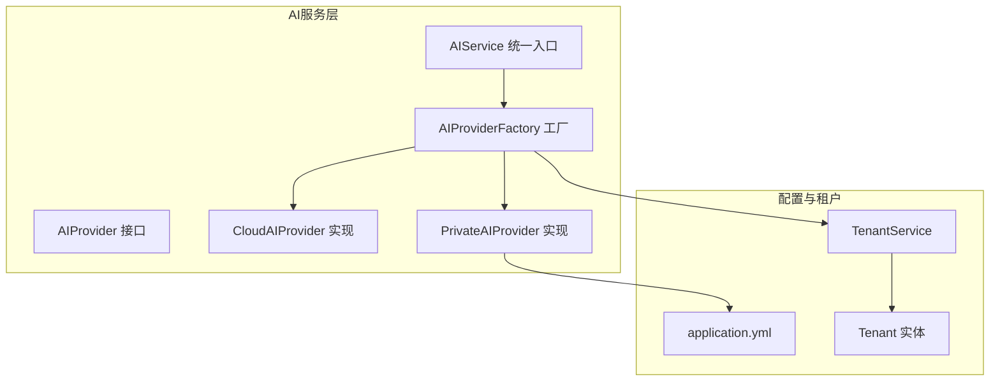
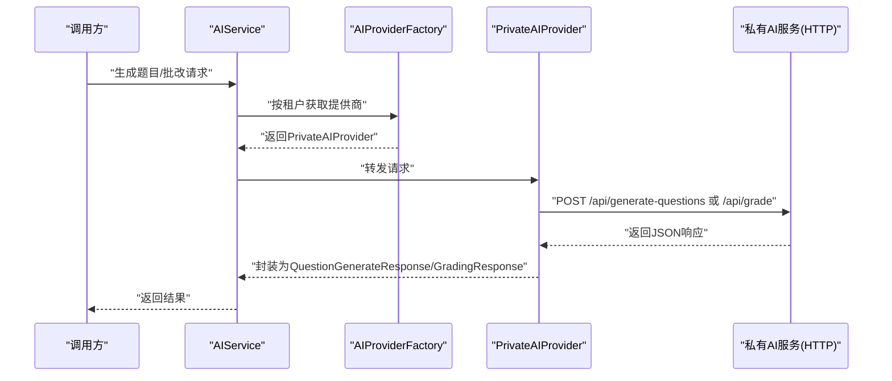
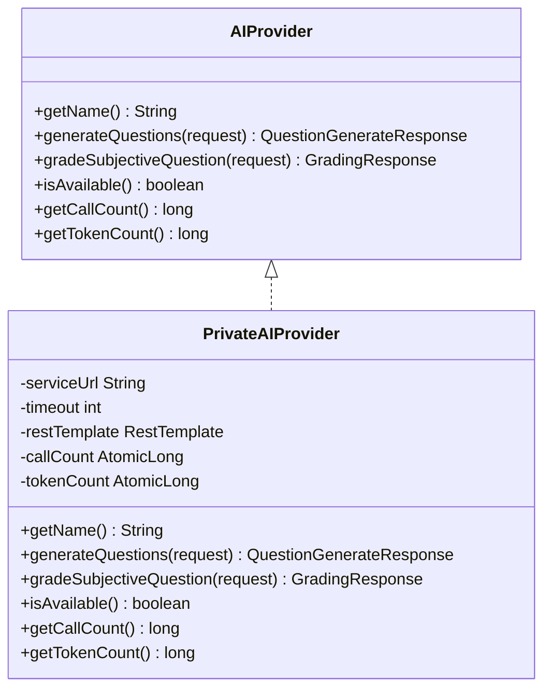
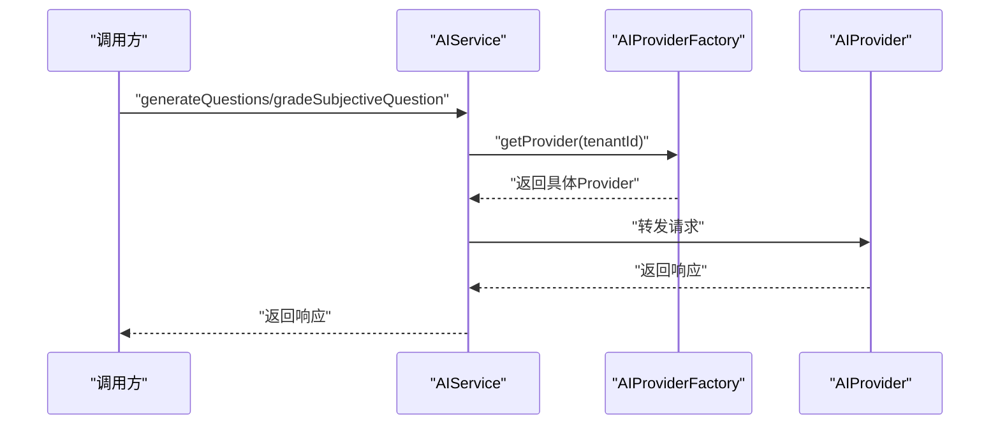
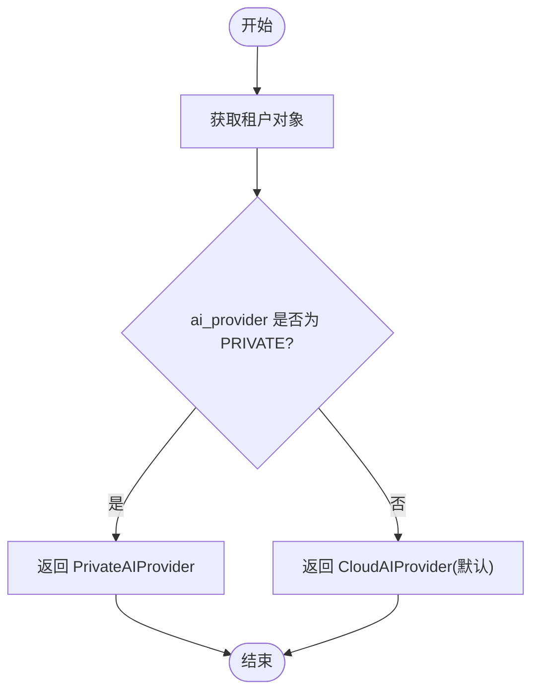
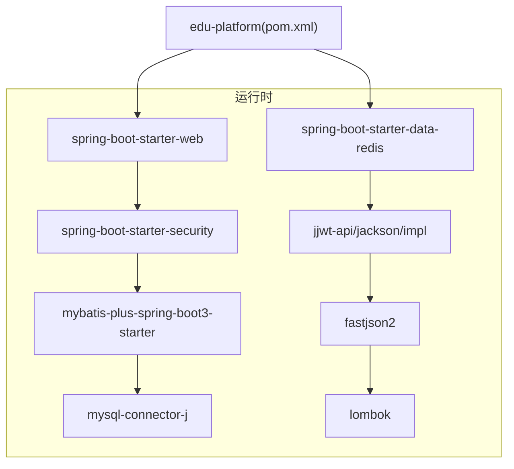

# 私有AI提供商

<cite>
**本文引用的文件**
- [PrivateAIProvider.java](file://backend/src/main/java/com/edu/ai/provider/PrivateAIProvider.java)
- [AIProvider.java](file://backend/src/main/java/com/edu/ai/provider/AIProvider.java)
- [AIProviderFactory.java](file://backend/src/main/java/com/edu/ai/provider/AIProviderFactory.java)
- [AIService.java](file://backend/src/main/java/com/edu/ai/service/AIService.java)
- [GradingRequest.java](file://backend/src/main/java/com/edu/ai/dto/GradingRequest.java)
- [GradingResponse.java](file://backend/src/main/java/com/edu/ai/dto/GradingResponse.java)
- [QuestionGenerateRequest.java](file://backend/src/main/java/com/edu/ai/dto/QuestionGenerateRequest.java)
- [QuestionGenerateResponse.java](file://backend/src/main/java/com/edu/ai/dto/QuestionGenerateResponse.java)
- [application.yml](file://backend/src/main/resources/application.yml)
- [pom.xml](file://backend/pom.xml)
- [Tenant.java](file://backend/src/main/java/com/edu/tenant/entity/Tenant.java)
- [TenantService.java](file://backend/src/main/java/com/edu/tenant/service/TenantService.java)
- [README.md](file://README.md)
- [2026-05-06-teacher-ai-platform-design.md](file://docs/superpowers/specs/2026-05-06-teacher-ai-platform-design.md)
- [2026-05-06-teacher-ai-platform-mvp.md](file://docs/superpowers/plans/2026-05-06-teacher-ai-platform-mvp.md)
- [AIServiceTest.java](file://backend/src/test/java/com/edu/ai/service/AIServiceTest.java)
</cite>

## 目录
1. [简介](#简介)
2. [项目结构](#项目结构)
3. [核心组件](#核心组件)
4. [架构总览](#架构总览)
5. [详细组件分析](#详细组件分析)
6. [依赖分析](#依赖分析)
7. [性能考虑](#性能考虑)
8. [故障排查指南](#故障排查指南)
9. [结论](#结论)
10. [附录](#附录)

## 简介
本文件面向“私有AI提供商”的技术实现，围绕私有部署的AI服务如何在本项目中被抽象、选择与调用进行系统化说明。重点覆盖以下方面：
- 私有限制的初始化与配置（模型文件路径、内存与GPU/CPU资源分配策略）
- 推理过程的实现细节（输入预处理、模型预测、结果后处理）
- 性能优化技术（模型量化、批处理、缓存策略）
- 硬件要求、环境配置与依赖管理
- 监控指标、日志分析与故障诊断
- 私有限制与云端服务的差异与适用场景

说明：当前仓库中的私有AI提供商以HTTP服务形式对外暴露，内部通过RestTemplate发起请求；关于本地模型加载、推理引擎集成与资源管理策略的具体实现细节，需结合私有服务侧的实际实现。本文将基于现有代码进行架构与流程解读，并给出可落地的实施建议与最佳实践。

## 项目结构
后端采用模块化单体架构，AI能力位于独立模块中，通过工厂模式根据租户配置动态选择云端或私有AI服务。关键文件与职责如下：
- 提供商接口与实现：AIProvider接口、CloudAIProvider与PrivateAIProvider
- 工厂与服务：AIProviderFactory负责按租户选择提供商；AIService作为统一入口
- DTO：QuestionGenerateRequest/Response、GradingRequest/Response
- 配置：application.yml中包含ai.default-provider、ai.cloud与ai.private配置
- 租户配置：Tenant实体与TenantService提供ai_provider与ai_config字段

图表来源
- [AIProvider.java:1-42](file://backend/src/main/java/com/edu/ai/provider/AIProvider.java#L1-L42)
- [PrivateAIProvider.java:1-195](file://backend/src/main/java/com/edu/ai/provider/PrivateAIProvider.java#L1-L195)
- [AIProviderFactory.java:1-67](file://backend/src/main/java/com/edu/ai/provider/AIProviderFactory.java#L1-L67)
- [AIService.java:1-102](file://backend/src/main/java/com/edu/ai/service/AIService.java#L1-L102)
- [application.yml:49-60](file://backend/src/main/resources/application.yml#L49-L60)
- [Tenant.java:1-21](file://backend/src/main/java/com/edu/tenant/entity/Tenant.java#L1-L21)
- [TenantService.java:1-81](file://backend/src/main/java/com/edu/tenant/service/TenantService.java#L1-L81)

章节来源
- [AIProvider.java:1-42](file://backend/src/main/java/com/edu/ai/provider/AIProvider.java#L1-L42)
- [PrivateAIProvider.java:1-195](file://backend/src/main/java/com/edu/ai/provider/PrivateAIProvider.java#L1-L195)
- [AIProviderFactory.java:1-67](file://backend/src/main/java/com/edu/ai/provider/AIProviderFactory.java#L1-L67)
- [AIService.java:1-102](file://backend/src/main/java/com/edu/ai/service/AIService.java#L1-L102)
- [application.yml:49-60](file://backend/src/main/resources/application.yml#L49-L60)
- [Tenant.java:1-21](file://backend/src/main/java/com/edu/tenant/entity/Tenant.java#L1-L21)
- [TenantService.java:1-81](file://backend/src/main/java/com/edu/tenant/service/TenantService.java#L1-L81)

## 核心组件
- AIProvider接口：定义提供商名称、题目生成、主观题批改、可用性检查与统计查询等能力
- PrivateAIProvider：私有限制实现，通过HTTP客户端向私有服务发送请求，解析响应并统计调用次数与Token消耗
- AIProviderFactory：根据租户配置动态选择提供商（CLOUD或PRIVATE），并提供默认与按配置选择的能力
- AIService：统一入口，负责获取当前提供商并转发请求，同时聚合调用统计
- DTO：QuestionGenerateRequest/Response与GradingRequest/Response承载请求与响应结构
- 配置：application.yml中ai.private.service-url与timeout控制私有服务地址与超时
- 租户配置：Tenant实体包含ai_provider与ai_config字段，TenantService提供校验与更新

章节来源
- [AIProvider.java:1-42](file://backend/src/main/java/com/edu/ai/provider/AIProvider.java#L1-L42)
- [PrivateAIProvider.java:1-195](file://backend/src/main/java/com/edu/ai/provider/PrivateAIProvider.java#L1-L195)
- [AIProviderFactory.java:1-67](file://backend/src/main/java/com/edu/ai/provider/AIProviderFactory.java#L1-L67)
- [AIService.java:1-102](file://backend/src/main/java/com/edu/ai/service/AIService.java#L1-L102)
- [QuestionGenerateRequest.java:1-42](file://backend/src/main/java/com/edu/ai/dto/QuestionGenerateRequest.java#L1-L42)
- [QuestionGenerateResponse.java:1-43](file://backend/src/main/java/com/edu/ai/dto/QuestionGenerateResponse.java#L1-L43)
- [GradingRequest.java:1-40](file://backend/src/main/java/com/edu/ai/dto/GradingRequest.java#L1-L40)
- [GradingResponse.java:1-42](file://backend/src/main/java/com/edu/ai/dto/GradingResponse.java#L1-L42)
- [application.yml:49-60](file://backend/src/main/resources/application.yml#L49-L60)
- [Tenant.java:1-21](file://backend/src/main/java/com/edu/tenant/entity/Tenant.java#L1-L21)
- [TenantService.java:1-81](file://backend/src/main/java/com/edu/tenant/service/TenantService.java#L1-L81)

## 架构总览
私有限制在本项目中的定位是“HTTP服务”，通过RestTemplate调用私有服务的API端点。工厂根据租户配置选择提供商，AIService作为统一入口协调调用。

图表来源
- [AIService.java:27-42](file://backend/src/main/java/com/edu/ai/service/AIService.java#L27-L42)
- [AIProviderFactory.java:27-44](file://backend/src/main/java/com/edu/ai/provider/AIProviderFactory.java#L27-L44)
- [PrivateAIProvider.java:44-113](file://backend/src/main/java/com/edu/ai/provider/PrivateAIProvider.java#L44-L113)
- [PrivateAIProvider.java:116-172](file://backend/src/main/java/com/edu/ai/provider/PrivateAIProvider.java#L116-L172)

章节来源
- [AIService.java:1-102](file://backend/src/main/java/com/edu/ai/service/AIService.java#L1-L102)
- [AIProviderFactory.java:1-67](file://backend/src/main/java/com/edu/ai/provider/AIProviderFactory.java#L1-L67)
- [PrivateAIProvider.java:1-195](file://backend/src/main/java/com/edu/ai/provider/PrivateAIProvider.java#L1-L195)

## 详细组件分析

### PrivateAIProvider 组件分析
- 初始化与配置
  - 通过@Value注入ai.private.service-url与timeout，分别用于私有服务地址与请求超时
  - 使用RestTemplate发起HTTP请求，统一设置Content-Type为application/json
- 题目生成流程
  - 组装请求体：subject、questionType、difficulty、knowledgePoint、count
  - 发送POST至“/api/generate-questions”
  - 解析响应：success标志、questions数组、tokensUsed（若存在）
  - 统计调用次数与Token消耗
- 主观题批改流程
  - 组装请求体：questionContent、questionType、correctAnswer、studentAnswer、maxScore、needAnalysis
  - 发送POST至“/api/grade”
  - 解析响应：score、isCorrect、analysis、tokensUsed（若存在）
  - 统计调用次数与Token消耗
- 健康检查
  - GET“/health”端点，返回200表示可用
- 统计查询
  - 提供callCount与tokenCount查询接口，便于监控与计费

图表来源
- [AIProvider.java:1-42](file://backend/src/main/java/com/edu/ai/provider/AIProvider.java#L1-L42)
- [PrivateAIProvider.java:1-195](file://backend/src/main/java/com/edu/ai/provider/PrivateAIProvider.java#L1-L195)

章节来源
- [PrivateAIProvider.java:1-195](file://backend/src/main/java/com/edu/ai/provider/PrivateAIProvider.java#L1-L195)
- [application.yml:57-60](file://backend/src/main/resources/application.yml#L57-L60)

### AIService 组件分析
- 统一入口
  - generateQuestions与gradeSubjectiveQuestion直接委托给当前提供商
- 状态与统计
  - checkStatus与getCurrentProviderName分别检查可用性与获取提供商名称
  - getUsageStats聚合提供商的调用次数、Token消耗与可用性
- 上下文选择
  - 通过TenantContextHolder获取租户ID，若为空则回退到默认提供商

图表来源
- [AIService.java:27-82](file://backend/src/main/java/com/edu/ai/service/AIService.java#L27-L82)
- [AIProviderFactory.java:27-44](file://backend/src/main/java/com/edu/ai/provider/AIProviderFactory.java#L27-L44)

章节来源
- [AIService.java:1-102](file://backend/src/main/java/com/edu/ai/service/AIService.java#L1-L102)
- [AIProviderFactory.java:1-67](file://backend/src/main/java/com/edu/ai/provider/AIProviderFactory.java#L1-L67)

### AIProviderFactory 组件分析
- 根据租户配置选择提供商
  - 若ai_provider为CLOUD或为空，则返回CloudAIProvider
  - 若ai_provider为PRIVATE，则返回PrivateAIProvider
  - 默认回退到CloudAIProvider
- 支持按配置直接选择与获取默认提供商

图表来源
- [AIProviderFactory.java:27-44](file://backend/src/main/java/com/edu/ai/provider/AIProviderFactory.java#L27-L44)
- [TenantService.java:44-56](file://backend/src/main/java/com/edu/tenant/service/TenantService.java#L44-L56)

章节来源
- [AIProviderFactory.java:1-67](file://backend/src/main/java/com/edu/ai/provider/AIProviderFactory.java#L1-L67)
- [Tenant.java:1-21](file://backend/src/main/java/com/edu/tenant/entity/Tenant.java#L1-L21)
- [TenantService.java:1-81](file://backend/src/main/java/com/edu/tenant/service/TenantService.java#L1-L81)

### DTO 结构分析
- QuestionGenerateRequest：subject、questionType、difficulty、knowledgePoint、count、additionalRequirements
- QuestionGenerateResponse：questions（GeneratedQuestion列表）、success、errorMessage、tokensUsed
- GradingRequest：questionContent、questionType、correctAnswer、studentAnswer、maxScore、needAnalysis
- GradingResponse：score（BigDecimal）、isCorrect（0/1/2）、analysis、success、errorMessage、tokensUsed

章节来源
- [QuestionGenerateRequest.java:1-42](file://backend/src/main/java/com/edu/ai/dto/QuestionGenerateRequest.java#L1-L42)
- [QuestionGenerateResponse.java:1-43](file://backend/src/main/java/com/edu/ai/dto/QuestionGenerateResponse.java#L1-L43)
- [GradingRequest.java:1-40](file://backend/src/main/java/com/edu/ai/dto/GradingRequest.java#L1-L40)
- [GradingResponse.java:1-42](file://backend/src/main/java/com/edu/ai/dto/GradingResponse.java#L1-L42)

## 依赖分析
- 运行时依赖
  - Spring Boot Starter Web（HTTP客户端与Web容器）
  - Spring Security（安全框架）
  - MyBatis-Plus（ORM）
  - MySQL Connector（数据库驱动）
  - Redis（可选，用于缓存）
  - JWT（鉴权）
  - Fastjson2（JSON处理）
  - Lombok（简化代码）
  - JSqlParser（SQL解析）
- 构建与打包
  - Maven插件：spring-boot-maven-plugin
- 测试
  - Spring Boot Starter Test与Spring Security Test

图表来源
- [pom.xml:29-133](file://backend/pom.xml#L29-L133)

章节来源
- [pom.xml:1-152](file://backend/pom.xml#L1-L152)

## 性能考虑
- 私有限制的性能优化建议（基于现有HTTP调用形态）
  - 批处理：在私有服务侧支持批量请求，减少网络往返开销
  - 缓存策略：对频繁查询的静态知识库或模板进行缓存，降低重复计算
  - 模型量化：在私有服务侧采用量化模型，降低显存与带宽占用
  - 资源分配：合理配置私有服务的CPU/GPU资源，结合队列与并发限制避免过载
  - 超时与重试：结合ai.private.timeout与私有服务端的超时策略，避免请求堆积
  - 监控与告警：利用callCount与tokenCount统计进行容量与成本监控

[本节为通用性能指导，不直接分析具体文件]

## 故障排查指南
- 常见问题与定位
  - 私有服务不可用：检查health端点是否返回200；确认service-url与网络连通性
  - 超时：检查ai.private.timeout配置与私有服务端处理耗时
  - 响应解析失败：确认私有服务返回的JSON结构与字段一致
  - 租户配置错误：检查Tenant.ai_provider与ai_config，确保非空且有效
- 日志与监控
  - AIService与PrivateAIProvider均输出详细日志，便于定位问题
  - 使用AIService.getUsageStats查看调用次数与Token消耗
- 单元测试参考
  - AIServiceTest展示了如何模拟Provider行为并断言结果

章节来源
- [PrivateAIProvider.java:175-184](file://backend/src/main/java/com/edu/ai/provider/PrivateAIProvider.java#L175-L184)
- [AIService.java:62-70](file://backend/src/main/java/com/edu/ai/service/AIService.java#L62-L70)
- [AIServiceTest.java:1-154](file://backend/src/test/java/com/edu/ai/service/AIServiceTest.java#L1-L154)

## 结论
本项目通过AIProvider接口与工厂模式实现了对私有限制的抽象与动态选择。当前私有AI提供商以HTTP服务形式接入，具备清晰的初始化、调用与统计能力。对于本地模型加载、推理引擎集成与资源管理策略，建议在私有服务侧实现，并通过本项目提供的配置与监控能力进行统一管理与观测。

[本节为总结性内容，不直接分析具体文件]

## 附录

### 私有限制的初始化与配置
- 配置项
  - ai.private.service-url：私有服务地址（默认http://localhost:8081）
  - ai.private.timeout：请求超时（毫秒）
- 初始化流程
  - 通过@Value注入上述配置
  - 在构造函数或初始化方法中准备RestTemplate（当前代码直接创建实例）

章节来源
- [application.yml:57-60](file://backend/src/main/resources/application.yml#L57-L60)
- [PrivateAIProvider.java:28-34](file://backend/src/main/java/com/edu/ai/provider/PrivateAIProvider.java#L28-L34)

### 推理过程实现细节
- 输入数据预处理
  - 将请求参数封装为JSON对象，设置Content-Type为application/json
- 模型预测
  - 当前通过HTTP调用私有服务的/api/generate-questions或/api/grade端点
- 结果后处理
  - 解析success标志与业务字段（如questions、score、analysis等）
  - 统计tokensUsed并累加到tokenCount

章节来源
- [PrivateAIProvider.java:56-100](file://backend/src/main/java/com/edu/ai/provider/PrivateAIProvider.java#L56-L100)
- [PrivateAIProvider.java:128-160](file://backend/src/main/java/com/edu/ai/provider/PrivateAIProvider.java#L128-L160)

### 私有限制与云端服务的差异与适用场景
- 差异
  - 数据安全：私有限制完全在本地部署，数据不出域
  - 可用性：私有限制需要自建高可用与运维能力
  - 成本：私有限制一次性投入较高，长期运营成本可控
- 适用场景
  - 对数据隐私要求极高的教育机构
  - 希望自主掌控AI能力与成本的企业

章节来源
- [2026-05-06-teacher-ai-platform-design.md:648-654](file://docs/superpowers/specs/2026-05-06-teacher-ai-platform-design.md#L648-L654)

### 硬件要求、环境配置与依赖管理
- 环境要求
  - 后端：Java 17+、Maven 3.8+、MySQL 8.x、Redis 7.x（可选）
  - 前端：Node.js 18+、npm 9+
- 数据库与配置
  - application.yml中包含数据库、Redis、JWT与AI配置
- 依赖管理
  - 通过pom.xml集中管理运行时与构建依赖

章节来源
- [README.md:3-6](file://README.md#L3-L6)
- [application.yml:1-65](file://backend/src/main/resources/application.yml#L1-L65)
- [pom.xml:1-152](file://backend/pom.xml#L1-L152)