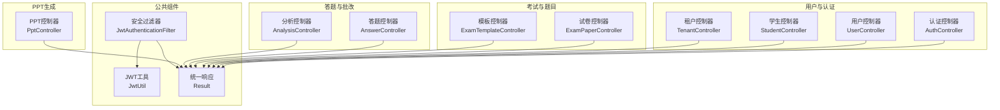
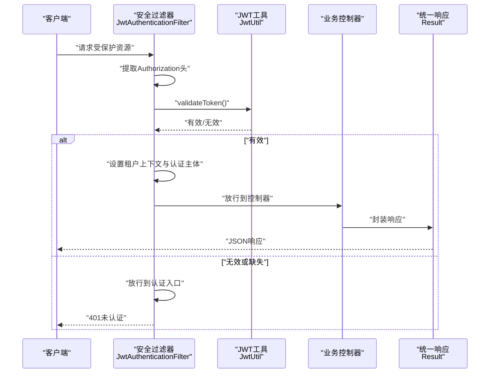
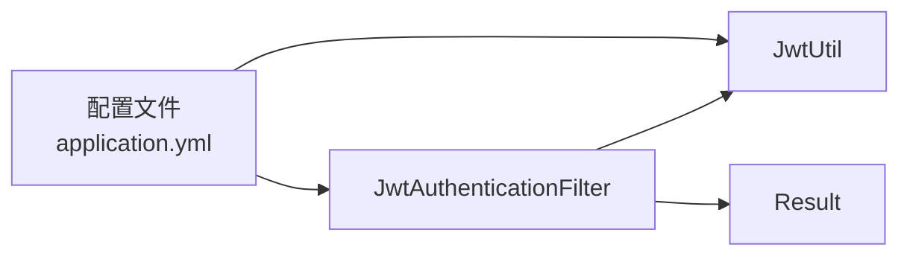

# API接口文档

<cite>
**本文引用的文件**
- [EduApplication.java](file://backend/src/main/java/com/edu/EduApplication.java)
- [JwtAuthenticationFilter.java](file://backend/src/main/java/com/edu/common/security/JwtAuthenticationFilter.java)
- [JwtAuthenticationEntryPoint.java](file://backend/src/main/java/com/edu/common/security/JwtAuthenticationEntryPoint.java)
- [JwtUtil.java](file://backend/src/main/java/com/edu/common/util/JwtUtil.java)
- [Result.java](file://backend/src/main/java/com/edu/common/entity/Result.java)
- [AuthController.java](file://backend/src/main/java/com/edu/user/controller/AuthController.java)
- [UserController.java](file://backend/src/main/java/com/edu/user/controller/UserController.java)
- [StudentController.java](file://backend/src/main/java/com/edu/user/controller/StudentController.java)
- [ExamPaperController.java](file://backend/src/main/java/com/edu/exam/controller/ExamPaperController.java)
- [ExamTemplateController.java](file://backend/src/main/java/com/edu/exam/controller/ExamTemplateController.java)
- [AnswerController.java](file://backend/src/main/java/com/edu/grading/controller/AnswerController.java)
- [AnalysisController.java](file://backend/src/main/java/com/edu/grading/controller/AnalysisController.java)
- [PptController.java](file://backend/src/main/java/com/edu/ppt/controller/PptController.java)
- [TenantController.java](file://backend/src/main/java/com/edu/tenant/controller/TenantController.java)
- [application.yml](file://backend/src/main/resources/application.yml)
</cite>

## 目录
1. [简介](#简介)
2. [项目结构](#项目结构)
3. [核心组件](#核心组件)
4. [架构总览](#架构总览)
5. [详细组件分析](#详细组件分析)
6. [依赖分析](#依赖分析)
7. [性能考虑](#性能考虑)
8. [故障排除指南](#故障排除指南)
9. [结论](#结论)
10. [附录](#附录)

## 简介
本项目是一个基于Spring Boot的教育平台后端，提供教师与学生相关的教学与评测能力，包括用户认证与管理、试卷与题目管理、答题与批改分析、以及AI驱动的PPT生成等功能。本文档面向前后端开发者与集成方，系统性梳理RESTful API端点、认证机制、统一响应格式、错误处理与最佳实践。

## 项目结构
后端采用按功能域分层的包结构，核心模块如下：
- 用户与认证：/user、/tenant
- 考试与题目：/exam、/question
- 答题与批改：/answer、/analysis
- PPT生成：/ppt
- 公共组件：/common（安全、工具、统一响应）

图表来源
- [JwtAuthenticationFilter.java:23-70](file://backend/src/main/java/com/edu/common/security/JwtAuthenticationFilter.java#L23-L70)
- [JwtUtil.java:18-123](file://backend/src/main/java/com/edu/common/util/JwtUtil.java#L18-L123)
- [Result.java:10-44](file://backend/src/main/java/com/edu/common/entity/Result.java#L10-L44)
- [AuthController.java:14-32](file://backend/src/main/java/com/edu/user/controller/AuthController.java#L14-L32)
- [UserController.java:14-79](file://backend/src/main/java/com/edu/user/controller/UserController.java#L14-L79)
- [StudentController.java:11-66](file://backend/src/main/java/com/edu/user/controller/StudentController.java#L11-L66)
- [TenantController.java:13-76](file://backend/src/main/java/com/edu/tenant/controller/TenantController.java#L13-L76)
- [ExamPaperController.java:26-218](file://backend/src/main/java/com/edu/exam/controller/ExamPaperController.java#L26-L218)
- [ExamTemplateController.java:18-118](file://backend/src/main/java/com/edu/exam/controller/ExamTemplateController.java#L18-L118)
- [AnswerController.java:22-140](file://backend/src/main/java/com/edu/grading/controller/AnswerController.java#L22-L140)
- [AnalysisController.java:23-143](file://backend/src/main/java/com/edu/grading/controller/AnalysisController.java#L23-L143)
- [PptController.java:12-45](file://backend/src/main/java/com/edu/ppt/controller/PptController.java#L12-L45)

章节来源
- [EduApplication.java:1-15](file://backend/src/main/java/com/edu/EduApplication.java#L1-L15)
- [application.yml:1-65](file://backend/src/main/resources/application.yml#L1-L65)

## 核心组件
- 统一响应格式：所有接口返回Result包装对象，包含code、message、data三要素，便于前端统一处理。
- 认证与授权：基于JWT的无状态认证，通过拦截器提取并校验token，自动注入租户上下文与用户身份。
- 错误处理：全局异常与认证入口统一输出标准错误响应，状态码遵循HTTP语义。

章节来源
- [Result.java:10-44](file://backend/src/main/java/com/edu/common/entity/Result.java#L10-L44)
- [JwtAuthenticationFilter.java:27-68](file://backend/src/main/java/com/edu/common/security/JwtAuthenticationFilter.java#L27-L68)
- [JwtAuthenticationEntryPoint.java:16-32](file://backend/src/main/java/com/edu/common/security/JwtAuthenticationEntryPoint.java#L16-L32)

## 架构总览
后端启动入口扫描mapper包，启用MyBatis-Plus；安全过滤器在除公开接口外的路径上强制JWT校验；JWT工具负责签发与解析；各业务控制器通过服务层完成数据访问与业务逻辑。

图表来源
- [JwtAuthenticationFilter.java:27-68](file://backend/src/main/java/com/edu/common/security/JwtAuthenticationFilter.java#L27-L68)
- [JwtUtil.java:66-77](file://backend/src/main/java/com/edu/common/util/JwtUtil.java#L66-L77)
- [JwtAuthenticationEntryPoint.java:18-30](file://backend/src/main/java/com/edu/common/security/JwtAuthenticationEntryPoint.java#L18-L30)
- [Result.java:21-42](file://backend/src/main/java/com/edu/common/entity/Result.java#L21-L42)

## 详细组件分析

### 认证接口
- 登录
  - 方法与路径：POST /api/auth/login
  - 请求体：LoginRequest（账号、密码等）
  - 响应体：Result<LoginResponse>（包含token、用户信息）
  - 状态码：200 成功；400 参数错误；401 认证失败
  - 示例：请求体字段与响应体字段请参考LoginRequest/LoginResponse定义
- 注册
  - 方法与路径：POST /api/auth/register
  - 请求体：RegisterRequest（注册信息）
  - 响应体：Result<User>
  - 状态码：200 成功；400 参数错误
- Token传递
  - Authorization: Bearer {token}
  - 刷新策略：当前实现未提供专用刷新接口，建议在前端缓存token并在即将过期时重新登录换取新token

章节来源
- [AuthController.java:20-30](file://backend/src/main/java/com/edu/user/controller/AuthController.java#L20-L30)
- [JwtAuthenticationFilter.java:55-68](file://backend/src/main/java/com/edu/common/security/JwtAuthenticationFilter.java#L55-L68)
- [JwtUtil.java:33-45](file://backend/src/main/java/com/edu/common/util/JwtUtil.java#L33-L45)

### 用户管理接口
- 获取当前用户
  - 方法与路径：GET /api/user/me
  - 认证：需要Bearer Token
  - 响应体：Result<User>
  - 状态码：200 成功；401 未认证
- 查询用户列表
  - 方法与路径：GET /api/user/list
  - 响应体：Result<List<User>>
- 新增用户
  - 方法与路径：POST /api/user
  - 请求体：CreateUserRequest
  - 响应体：Result<User>
- 获取指定用户
  - 方法与路径：GET /api/user/{id}
  - 响应体：Result<User>
- 更新用户
  - 方法与路径：PUT /api/user/{id}
  - 请求体：User（部分字段）
  - 响应体：Result<Void>
- 删除用户
  - 方法与路径：DELETE /api/user/{id}
  - 响应体：Result<Void>
- 分配角色
  - 方法与路径：PUT /api/user/{id}/role?roleCode={roleCode}
  - 响应体：Result<Void>
- 查询用户角色
  - 方法与路径：GET /api/user/{id}/roles
  - 响应体：Result<List<String>>

章节来源
- [UserController.java:21-77](file://backend/src/main/java/com/edu/user/controller/UserController.java#L21-L77)

### 学生管理接口
- 按班级查询学生
  - 方法与路径：GET /api/student/class/{classId}
  - 响应体：Result<List<Student>>
- 获取学生
  - 方法与路径：GET /api/student/{id}
  - 响应体：Result<Student>
- 学号查询
  - 方法与路径：GET /api/student/no/{studentNo}
  - 响应体：Result<Student>
- 新增学生
  - 方法与路径：POST /api/student
  - 请求体：Student
  - 响应体：Result<Student>
- 更新学生
  - 方法与路径：PUT /api/student/{id}
  - 请求体：Student
  - 响应体：Result<Void>
- 转班
  - 方法与路径：PUT /api/student/{id}/transfer?newClassId={newClassId}
  - 响应体：Result<Void>
- 删除学生
  - 方法与路径：DELETE /api/student/{id}
  - 响应体：Result<Void>

章节来源
- [StudentController.java:18-65](file://backend/src/main/java/com/edu/user/controller/StudentController.java#L18-L65)

### 考试管理接口
- 创建试卷（手动）
  - 方法与路径：POST /api/exam-paper
  - 请求体：ExamPaperCreateRequest
  - 响应体：Result<ExamPaperResponse>
- AI生成试卷
  - 方法与路径：POST /api/exam-paper/generate
  - 请求体：ExamGenerateRequest
  - 响应体：Result<ExamPaperResponse>
- 个性化出题
  - 方法与路径：POST /api/exam-paper/generate-personalized
  - 请求体：ExamGenerateRequest
  - 响应体：Result<ExamPaperResponse>
- 获取试卷列表
  - 方法与路径：GET /api/exam-paper
  - 响应体：Result<List<ExamPaperResponse>>
- 按班级查询试卷
  - 方法与路径：GET /api/exam-paper/class/{classId}
  - 响应体：Result<List<ExamPaperResponse>>
- 获取试卷详情（含题目）
  - 方法与路径：GET /api/exam-paper/{id}
  - 响应体：Result<ExamPaperResponse>
- 更新试卷
  - 方法与路径：PUT /api/exam-paper/{id}
  - 请求体：ExamPaperCreateRequest
  - 响应体：Result<Void>
- 发布试卷
  - 方法与路径：PUT /api/exam-paper/{id}/publish
  - 响应体：Result<Void>
- 删除试卷
  - 方法与路径：DELETE /api/exam-paper/{id}
  - 响应体：Result<Void>
- 添加题目到试卷
  - 方法与路径：POST /api/exam-paper/{paperId}/question?questionId={questionId}&sequence={sequence}&score={score}
  - 响应体：Result<Void>

- 试卷模板
  - 创建模板：POST /api/exam-template
  - 模板列表：GET /api/exam-template
  - 按学科查询：GET /api/exam-template/subject/{subject}
  - 获取模板详情：GET /api/exam-template/{id}
  - 更新模板：PUT /api/exam-template/{id}
  - 删除模板：DELETE /api/exam-template/{id}

章节来源
- [ExamPaperController.java:38-143](file://backend/src/main/java/com/edu/exam/controller/ExamPaperController.java#L38-L143)
- [ExamTemplateController.java:28-103](file://backend/src/main/java/com/edu/exam/controller/ExamTemplateController.java#L28-L103)

### 答题与批改分析接口
- 创建答题卡
  - 方法与路径：POST /api/answer/sheet?examPaperId={examPaperId}&studentId={studentId}
  - 响应体：Result<AnswerSheetResponse>
- 提交答案
  - 方法与路径：POST /api/answer
  - 请求体：AnswerSubmitRequest
  - 响应体：Result<AnswerResponse>
- 提交答题卡
  - 方法与路径：POST /api/answer/sheet/{id}/submit
  - 响应体：Result<Void>
- 批改答题卡
  - 方法与路径：POST /api/answer/sheet/{id}/grade?gradedBy={userId}
  - 响应体：Result<Void>
- 获取答题卡详情
  - 方法与路径：GET /api/answer/sheet/{id}
  - 响应体：Result<AnswerSheetResponse>
- 获取某试卷的所有答题卡
  - 方法与路径：GET /api/answer/sheet/list/{examPaperId}
  - 响应体：Result<List<AnswerSheetResponse>>
- 获取答题卡的答案列表
  - 方法与路径：GET /api/answer/list/{answerSheetId}
  - 响应体：Result<List<AnswerResponse>>

- 成绩分析
  - 分析班级成绩：POST /api/analysis/class?examPaperId={examPaperId}&classId={classId}
  - 获取班级成绩分析：GET /api/analysis/class?examPaperId={examPaperId}&classId={classId}
  - 学生错题列表：GET /api/analysis/wrong-questions/{studentId}
  - 标记错题已纠错：POST /api/analysis/wrong-questions/corrected?studentId={studentId}&questionId={questionId}
  - 高频错题：GET /api/analysis/wrong-questions/frequent?limit={limit}

章节来源
- [AnswerController.java:34-97](file://backend/src/main/java/com/edu/grading/controller/AnswerController.java#L34-L97)
- [AnalysisController.java:35-94](file://backend/src/main/java/com/edu/grading/controller/AnalysisController.java#L35-L94)

### PPT生成接口
- 生成PPT
  - 方法与路径：POST /api/ppt/generate
  - 请求体：PptGenerateRequest
  - 响应体：Result<PptResponse>
- 获取PPT列表
  - 方法与路径：GET /api/ppt
  - 响应体：Result<List<PptResponse>>
- 获取PPT详情
  - 方法与路径：GET /api/ppt/{id}
  - 响应体：Result<PptResponse>
- 删除PPT
  - 方法与路径：DELETE /api/ppt/{id}
  - 响应体：Result<Void>

章节来源
- [PptController.java:19-44](file://backend/src/main/java/com/edu/ppt/controller/PptController.java#L19-L44)

### 租户管理接口
- 创建租户
  - 方法与路径：POST /api/tenant
  - 请求体：TenantCreateRequest
  - 响应体：Result<TenantResponse>
- 按编码查询租户
  - 方法与路径：GET /api/tenant/code/{code}
  - 响应体：Result<TenantResponse>
- 获取租户详情
  - 方法与路径：GET /api/tenant/{id}
  - 响应体：Result<TenantResponse>
- 更新AI配置
  - 方法与路径：PUT /api/tenant/{id}/ai-config?provider={provider}
  - 请求体：JSON字符串配置
  - 响应体：Result<Void>
- 禁用租户
  - 方法与路径：PUT /api/tenant/{id}/disable
  - 响应体：Result<Void>

章节来源
- [TenantController.java:20-61](file://backend/src/main/java/com/edu/tenant/controller/TenantController.java#L20-L61)

## 依赖分析
- 安全过滤链路：JwtAuthenticationFilter在进入业务控制器前进行JWT校验，并设置租户上下文；认证失败由JwtAuthenticationEntryPoint统一输出401。
- 统一响应：Result作为所有接口的返回载体，简化前端处理。
- 配置项：JWT密钥与过期时间、AI Provider与模型、数据库连接等均在application.yml中集中配置。

图表来源
- [application.yml:45-60](file://backend/src/main/resources/application.yml#L45-L60)
- [JwtAuthenticationFilter.java:25-34](file://backend/src/main/java/com/edu/common/security/JwtAuthenticationFilter.java#L25-L34)
- [JwtUtil.java:20-24](file://backend/src/main/java/com/edu/common/util/JwtUtil.java#L20-L24)
- [Result.java:17-19](file://backend/src/main/java/com/edu/common/entity/Result.java#L17-L19)

章节来源
- [application.yml:1-65](file://backend/src/main/resources/application.yml#L1-L65)
- [JwtAuthenticationFilter.java:27-68](file://backend/src/main/java/com/edu/common/security/JwtAuthenticationFilter.java#L27-L68)
- [JwtAuthenticationEntryPoint.java:18-30](file://backend/src/main/java/com/edu/common/security/JwtAuthenticationEntryPoint.java#L18-L30)
- [Result.java:21-42](file://backend/src/main/java/com/edu/common/entity/Result.java#L21-L42)

## 性能考虑
- 连接池与超时：HikariCP连接池参数已在配置中设定，建议结合实际并发压测调整最大连接数与超时。
- 日志级别：开发环境开启调试日志，生产环境建议降低至info以减少I/O开销。
- 缓存：当前未启用Redis，如需提升热点查询性能可引入缓存层（建议在前端与后端双缓存策略）。

## 故障排除指南
- 401 未认证
  - 检查请求头是否包含正确的Authorization: Bearer {token}
  - 检查token是否过期或签名无效
- 403 禁止访问
  - 当前未实现细粒度权限控制，若出现权限问题请检查租户上下文与用户归属
- 404 资源不存在
  - 常见于试卷、答题卡、PPT等资源ID错误或已被删除
- 500 服务器内部错误
  - 查看后端日志定位具体异常，确认数据库连接与AI Provider可用性

章节来源
- [JwtAuthenticationEntryPoint.java:18-30](file://backend/src/main/java/com/edu/common/security/JwtAuthenticationEntryPoint.java#L18-L30)
- [Result.java:33-42](file://backend/src/main/java/com/edu/common/entity/Result.java#L33-L42)

## 结论
本API体系以统一响应与JWT认证为核心，覆盖用户、考试、答题、分析与PPT生成的完整教学场景。建议在生产环境中完善限流与鉴权策略、接入缓存与监控，并持续优化AI Provider的稳定性与成本控制。

## 附录

### 统一响应结构
- 成功：code=200，message="success"，data为具体业务对象
- 失败：code为错误码，message为错误描述，data为空

章节来源
- [Result.java:21-42](file://backend/src/main/java/com/edu/common/entity/Result.java#L21-L42)

### 认证机制说明
- 获取token：调用登录接口获取登录响应中的token
- 传递token：在请求头添加Authorization: Bearer {token}
- 刷新流程：当前未提供刷新接口，建议在前端缓存token并在即将过期时重新登录换取新token
- 过期时间：默认24小时，可在配置中调整

章节来源
- [AuthController.java:20-24](file://backend/src/main/java/com/edu/user/controller/AuthController.java#L20-L24)
- [JwtUtil.java:33-45](file://backend/src/main/java/com/edu/common/util/JwtUtil.java#L33-L45)
- [application.yml:45-47](file://backend/src/main/resources/application.yml#L45-L47)

### 版本控制与限流
- 版本控制：当前未实现API版本化策略，建议在路由前缀或Header中引入版本标识
- 限流：当前未实现限流机制，建议在网关或过滤器层加入限流策略（如基于IP或用户维度）

### 前端集成指南与最佳实践
- 建议在拦截器或请求适配器中统一注入Authorization头
- 对401错误进行统一跳转登录页或刷新token
- 对Result.code进行统一判断，避免重复分支处理
- 对大列表分页查询时使用limit/offset或游标分页
- 对AI相关接口增加重试与超时配置