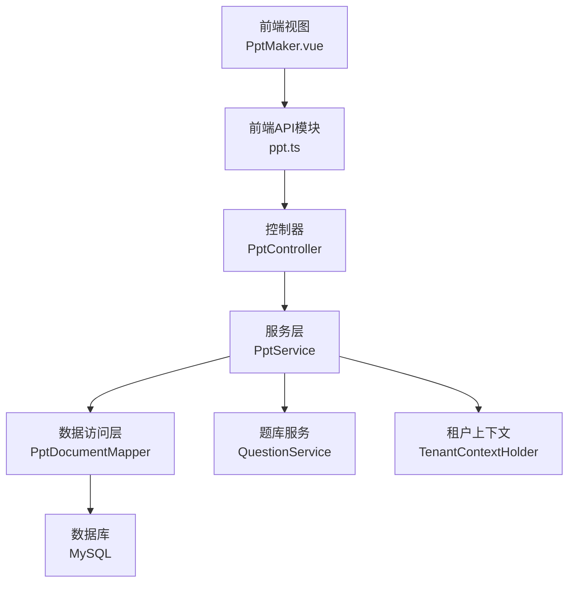
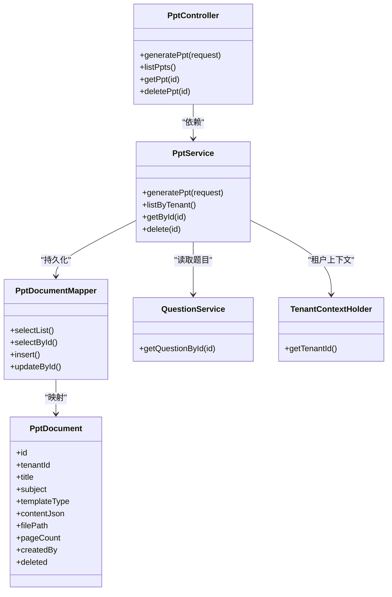
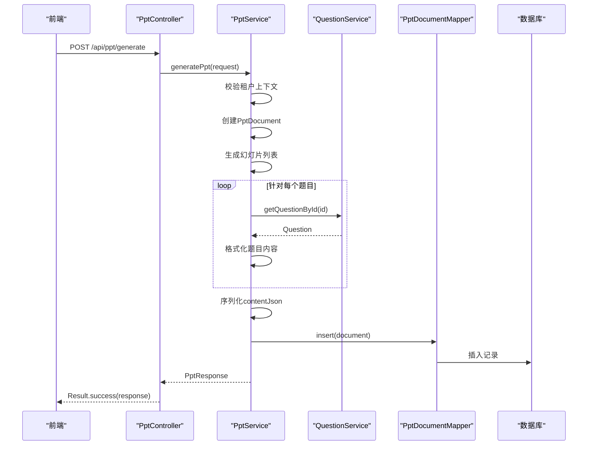
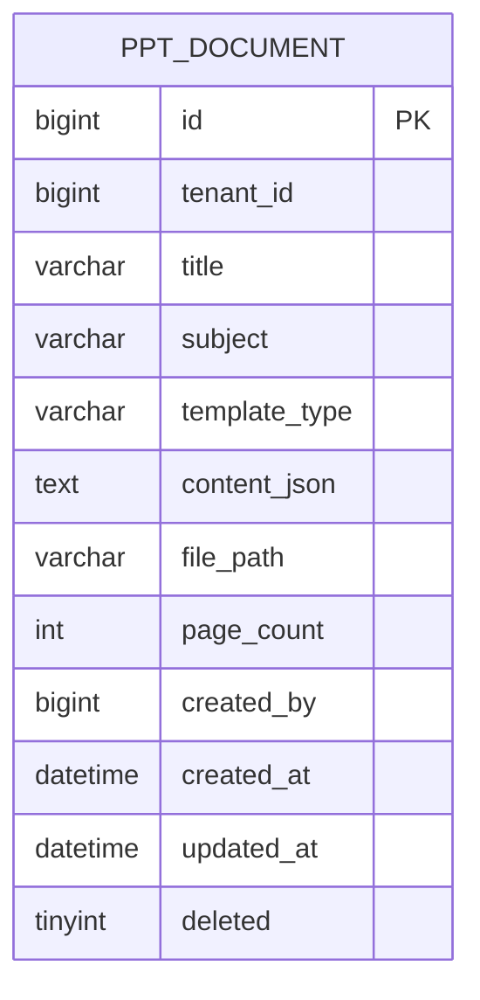
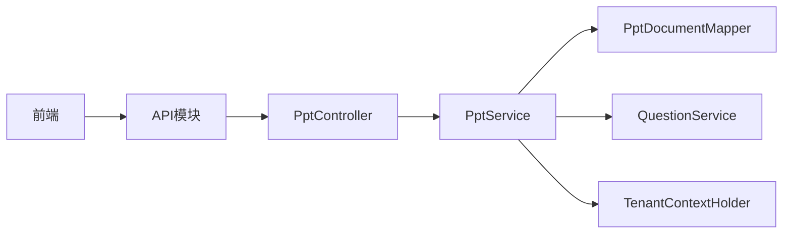
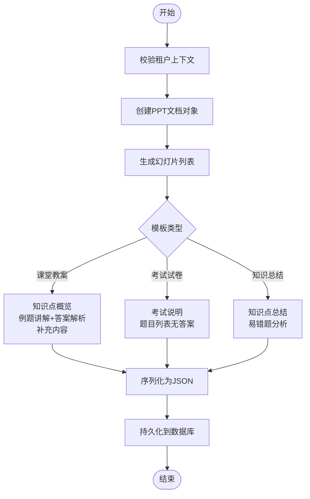

# PPT制作

<cite>
**本文引用的文件**
- [PptController.java](file://backend/src/main/java/com/edu/ppt/controller/PptController.java)
- [PptService.java](file://backend/src/main/java/com/edu/ppt/service/PptService.java)
- [PptGenerateRequest.java](file://backend/src/main/java/com/edu/ppt/dto/PptGenerateRequest.java)
- [PptResponse.java](file://backend/src/main/java/com/edu/ppt/dto/PptResponse.java)
- [PptSlideResponse.java](file://backend/src/main/java/com/edu/ppt/dto/PptSlideResponse.java)
- [PptDocument.java](file://backend/src/main/java/com/edu/ppt/entity/PptDocument.java)
- [PptDocumentMapper.java](file://backend/src/main/java/com/edu/ppt/mapper/PptDocumentMapper.java)
- [schema.sql](file://backend/src/main/resources/db/schema.sql)
- [application.yml](file://backend/src/main/resources/application.yml)
- [ppt.ts](file://frontend/src/api/ppt.ts)
- [PptMaker.vue](file://frontend/src/views/PptMaker.vue)
- [AIService.java](file://backend/src/main/java/com/edu/ai/service/AIService.java)
- [PromptBuilderService.java](file://backend/src/main/java/com/edu/ai/service/PromptBuilderService.java)
- [CloudAIProvider.java](file://backend/src/main/java/com/edu/ai/provider/CloudAIProvider.java)
</cite>

## 目录
1. [简介](#简介)
2. [项目结构](#项目结构)
3. [核心组件](#核心组件)
4. [架构总览](#架构总览)
5. [详细组件分析](#详细组件分析)
6. [依赖分析](#依赖分析)
7. [性能考虑](#性能考虑)
8. [故障排查指南](#故障排查指南)
9. [结论](#结论)
10. [附录](#附录)

## 简介
本模块实现“基于AI内容生成PPT”的完整能力，涵盖文本内容解析、结构化提取与视觉设计转换的思路，以及PPT模板系统的设计理念（模板库管理、样式定制与布局适配）。内容生成流程包括主题确定、内容组织与多媒体元素集成的规划；同时提供PPT文档的存储与管理机制（文件格式转换、版本控制与共享机制）的实现方案与最佳实践。本文档还提供完整的API接口说明与使用示例，以及性能优化与用户体验改进建议。

## 项目结构
后端采用分层架构：控制器层负责HTTP请求处理，服务层承载业务逻辑，数据访问层通过MyBatis-Plus访问数据库。前端采用Vue 3 + Element Plus构建交互界面，通过封装的API模块与后端通信。

图表来源
- [PptController.java:12-45](file://backend/src/main/java/com/edu/ppt/controller/PptController.java#L12-L45)
- [PptService.java:28-328](file://backend/src/main/java/com/edu/ppt/service/PptService.java#L28-L328)
- [PptDocumentMapper.java:1-9](file://backend/src/main/java/com/edu/ppt/mapper/PptDocumentMapper.java#L1-L9)
- [schema.sql:361-378](file://backend/src/main/resources/db/schema.sql#L361-L378)

章节来源
- [PptController.java:12-45](file://backend/src/main/java/com/edu/ppt/controller/PptController.java#L12-L45)
- [PptService.java:28-328](file://backend/src/main/java/com/edu/ppt/service/PptService.java#L28-L328)
- [PptDocumentMapper.java:1-9](file://backend/src/main/java/com/edu/ppt/mapper/PptDocumentMapper.java#L1-L9)
- [schema.sql:361-378](file://backend/src/main/resources/db/schema.sql#L361-L378)

## 核心组件
- 控制器层：提供PPT生成、列表查询、详情查询、删除等REST接口，统一返回Result包装。
- 服务层：实现PPT生成主流程，包括模板类型分支、幻灯片内容生成、JSON序列化、持久化与响应转换。
- DTO与实体：定义请求/响应模型与数据库实体，保证前后端契约一致。
- 数据访问层：基于MyBatis-Plus的通用Mapper，提供条件查询与逻辑删除。
- 前端：提供PPT制作表单、题目选择、生成预览、历史记录与删除等交互。

章节来源
- [PptController.java:12-45](file://backend/src/main/java/com/edu/ppt/controller/PptController.java#L12-L45)
- [PptService.java:28-328](file://backend/src/main/java/com/edu/ppt/service/PptService.java#L28-L328)
- [PptGenerateRequest.java:1-17](file://backend/src/main/java/com/edu/ppt/dto/PptGenerateRequest.java#L1-L17)
- [PptResponse.java:1-20](file://backend/src/main/java/com/edu/ppt/dto/PptResponse.java#L1-L20)
- [PptSlideResponse.java:1-13](file://backend/src/main/java/com/edu/ppt/dto/PptSlideResponse.java#L1-L13)
- [PptDocument.java:1-23](file://backend/src/main/java/com/edu/ppt/entity/PptDocument.java#L1-L23)
- [PptDocumentMapper.java:1-9](file://backend/src/main/java/com/edu/ppt/mapper/PptDocumentMapper.java#L1-L9)
- [PptMaker.vue:173-351](file://frontend/src/views/PptMaker.vue#L173-L351)

## 架构总览
整体采用“控制器-服务-数据访问-数据库”的分层设计，租户隔离通过上下文持有器实现，题库内容通过QuestionService注入到PPT生成流程中。AI能力在本模块中作为可扩展点预留，当前PPT生成以结构化文本为主，文件生成路径为占位符，便于后续接入PPT生成引擎。

图表来源
- [PptController.java:12-45](file://backend/src/main/java/com/edu/ppt/controller/PptController.java#L12-L45)
- [PptService.java:28-328](file://backend/src/main/java/com/edu/ppt/service/PptService.java#L28-L328)
- [PptDocumentMapper.java:1-9](file://backend/src/main/java/com/edu/ppt/mapper/PptDocumentMapper.java#L1-L9)
- [PptDocument.java:1-23](file://backend/src/main/java/com/edu/ppt/entity/PptDocument.java#L1-L23)

## 详细组件分析

### 控制器层：PptController
- 提供生成、列表、详情、删除四个接口，均返回Result包装，便于前端统一处理。
- 生成接口接收PptGenerateRequest，调用服务层生成PPT并返回PptResponse。
- 列表与详情接口基于租户隔离，删除接口执行逻辑删除。

章节来源
- [PptController.java:12-45](file://backend/src/main/java/com/edu/ppt/controller/PptController.java#L12-L45)

### 服务层：PptService
- 租户上下文校验：生成前必须存在租户ID，否则抛出业务异常。
- 文档创建：填充标题、学科、模板类型、创建人等字段，设置删除标记与创建时间。
- 幻灯片生成：根据模板类型分支生成不同内容（课堂教案、考试试卷、知识总结），并统一更新页码。
- 内容序列化：将幻灯片集合转为JSON字符串存入contentJson字段。
- 文件路径：当前为占位符路径，后续可接入PPT生成引擎生成真实文件。
- 查询与删除：支持按租户查询、按ID查询与逻辑删除。

图表来源
- [PptController.java:19-23](file://backend/src/main/java/com/edu/ppt/controller/PptController.java#L19-L23)
- [PptService.java:33-75](file://backend/src/main/java/com/edu/ppt/service/PptService.java#L33-L75)
- [PptService.java:110-155](file://backend/src/main/java/com/edu/ppt/service/PptService.java#L110-L155)
- [PptService.java:157-183](file://backend/src/main/java/com/edu/ppt/service/PptService.java#L157-L183)
- [PptService.java:185-215](file://backend/src/main/java/com/edu/ppt/service/PptService.java#L185-L215)
- [PptDocumentMapper.java:1-9](file://backend/src/main/java/com/edu/ppt/mapper/PptDocumentMapper.java#L1-L9)

章节来源
- [PptService.java:33-75](file://backend/src/main/java/com/edu/ppt/service/PptService.java#L33-L75)
- [PptService.java:77-108](file://backend/src/main/java/com/edu/ppt/service/PptService.java#L77-L108)
- [PptService.java:110-155](file://backend/src/main/java/com/edu/ppt/service/PptService.java#L110-L155)
- [PptService.java:157-183](file://backend/src/main/java/com/edu/ppt/service/PptService.java#L157-L183)
- [PptService.java:185-215](file://backend/src/main/java/com/edu/ppt/service/PptService.java#L185-L215)
- [PptService.java:294-327](file://backend/src/main/java/com/edu/ppt/service/PptService.java#L294-L327)

### 数据模型与存储
- 实体类PptDocument映射ppt_document表，包含租户ID、标题、学科、模板类型、内容JSON、文件路径、页数、创建人、创建/更新时间与逻辑删除字段。
- Mapper接口继承BaseMapper，提供通用CRUD能力。
- 数据库脚本定义了索引与字段约束，确保查询效率与数据一致性。

图表来源
- [PptDocument.java:1-23](file://backend/src/main/java/com/edu/ppt/entity/PptDocument.java#L1-L23)
- [schema.sql:361-378](file://backend/src/main/resources/db/schema.sql#L361-L378)

章节来源
- [PptDocument.java:1-23](file://backend/src/main/java/com/edu/ppt/entity/PptDocument.java#L1-L23)
- [schema.sql:361-378](file://backend/src/main/resources/db/schema.sql#L361-L378)

### 前端交互：PptMaker.vue
- 表单字段：标题、学科、模板类型、知识点、题目选择、自定义内容、创建人。
- 题目选择：弹窗展示题库列表，支持多选与移除。
- 生成流程：表单校验通过后调用API生成PPT，成功后刷新历史记录。
- 预览与操作：展示生成的PPT信息与幻灯片预览，支持导出与删除。
- 历史记录：展示当前租户下所有PPT记录，支持查看与删除。

章节来源
- [PptMaker.vue:173-351](file://frontend/src/views/PptMaker.vue#L173-L351)
- [ppt.ts:1-21](file://frontend/src/api/ppt.ts#L1-L21)

### AI能力与模板系统设计（扩展点）
- AI服务：AIService提供统一入口，支持题目生成与主观题批改，按租户选择Provider，当前配置支持云端与私有AI服务。
- Prompt构建：PromptBuilderService负责构造高质量的提示词，确保输出格式与质量。
- 模板系统：当前PPTService以结构化文本为主，模板类型分为课堂教案、考试试卷、知识总结三类；未来可引入模板库管理、样式定制与布局适配，结合AI生成内容进行视觉设计转换。

章节来源
- [AIService.java:17-102](file://backend/src/main/java/com/edu/ai/service/AIService.java#L17-L102)
- [PromptBuilderService.java:10-121](file://backend/src/main/java/com/edu/ai/service/PromptBuilderService.java#L10-L121)
- [application.yml:49-60](file://backend/src/main/resources/application.yml#L49-L60)

## 依赖分析
- 控制器依赖服务层，服务层依赖Mapper与QuestionService，体现清晰的分层职责。
- 租户上下文贯穿服务层，确保多租户隔离。
- 前端通过API模块与控制器交互，统一使用Result包装。

图表来源
- [PptController.java:12-45](file://backend/src/main/java/com/edu/ppt/controller/PptController.java#L12-L45)
- [PptService.java:28-328](file://backend/src/main/java/com/edu/ppt/service/PptService.java#L28-L328)

章节来源
- [PptController.java:12-45](file://backend/src/main/java/com/edu/ppt/controller/PptController.java#L12-L45)
- [PptService.java:28-328](file://backend/src/main/java/com/edu/ppt/service/PptService.java#L28-L328)

## 性能考虑
- 数据访问优化
  - 使用MyBatis-Plus通用Mapper减少重复SQL编写，合理利用逻辑删除字段避免全表扫描。
  - 为tenant_id建立索引，提升按租户查询效率。
- 事务与并发
  - 生成PPT使用事务，确保文档与内容的一致性；并发场景下注意租户上下文与QuestionService的线程安全。
- 前端交互
  - 生成与加载历史时使用loading态，避免重复提交。
  - 预览区域使用滚动容器，避免大段文本导致渲染卡顿。
- 后续优化方向
  - 引入缓存策略（如Redis）缓存常用模板与题库片段。
  - 将contentJson拆分为更细粒度的结构化字段，便于检索与二次加工。
  - 文件生成阶段采用异步任务+队列，前端轮询或WebSocket推送结果。

## 故障排查指南
- 租户上下文缺失
  - 现象：生成PPT时报错“租户上下文缺失”。
  - 处理：确认登录态与租户切换是否正确，检查TenantContextHolder是否注入。
- 题目不存在
  - 现象：题目ID无效导致生成失败。
  - 处理：前端在生成前校验题目列表，后端在QuestionService层增加空值保护。
- 数据库异常
  - 现象：插入或查询失败。
  - 处理：检查数据库连接配置与schema.sql初始化是否成功，确认索引是否存在。
- 前端调用失败
  - 现象：生成/删除接口报错。
  - 处理：检查API模块与后端路由映射，确认CORS与鉴权配置。

章节来源
- [PptService.java:36-38](file://backend/src/main/java/com/edu/ppt/service/PptService.java#L36-L38)
- [PptService.java:128-143](file://backend/src/main/java/com/edu/ppt/service/PptService.java#L128-L143)
- [schema.sql:361-378](file://backend/src/main/resources/db/schema.sql#L361-L378)
- [ppt.ts:1-21](file://frontend/src/api/ppt.ts#L1-L21)

## 结论
本模块以清晰的分层架构实现了PPT生成的端到端流程，具备良好的扩展性与可维护性。当前以结构化文本为主，文件生成路径为占位符，便于后续接入PPT引擎与AI视觉设计能力。通过引入模板系统、样式定制与布局适配，可进一步提升PPT的可视化质量与教师使用体验。

## 附录

### API 接口文档
- 生成PPT
  - 方法：POST
  - 路径：/api/ppt/generate
  - 请求体：PptGenerateRequest
  - 返回：Result<PptResponse>
- 获取PPT列表
  - 方法：GET
  - 路径：/api/ppt
  - 返回：Result<List<PptResponse>>
- 获取PPT详情
  - 方法：GET
  - 路径：/api/ppt/{id}
  - 返回：Result<PptResponse>
- 删除PPT
  - 方法：DELETE
  - 路径：/api/ppt/{id}
  - 返回：Result<Void>

章节来源
- [PptController.java:19-44](file://backend/src/main/java/com/edu/ppt/controller/PptController.java#L19-L44)
- [ppt.ts:3-21](file://frontend/src/api/ppt.ts#L3-L21)

### 数据模型与字段说明
- PptDocument
  - 字段：id、tenantId、title、subject、templateType、contentJson、filePath、pageCount、createdBy、createdAt、updatedAt、deleted
- PptResponse
  - 字段：id、tenantId、title、subject、templateType、templateUrl、pageCount、slides、createdBy、createdAt
- PptSlideResponse
  - 字段：pageIndex、title、content、questionIds

章节来源
- [PptDocument.java:1-23](file://backend/src/main/java/com/edu/ppt/entity/PptDocument.java#L1-L23)
- [PptResponse.java:1-20](file://backend/src/main/java/com/edu/ppt/dto/PptResponse.java#L1-L20)
- [PptSlideResponse.java:1-13](file://backend/src/main/java/com/edu/ppt/dto/PptSlideResponse.java#L1-L13)

### 使用示例
- 前端调用
  - 生成PPT：调用generatePpt，传入表单数据，成功后刷新历史记录。
  - 查看详情：调用getPptDetail，传入PPT ID。
  - 删除PPT：调用deletePpt，传入PPT ID。
- 后端调用
  - 控制器：PptController提供REST接口，服务层完成业务处理与持久化。

章节来源
- [PptMaker.vue:278-346](file://frontend/src/views/PptMaker.vue#L278-L346)
- [ppt.ts:3-21](file://frontend/src/api/ppt.ts#L3-L21)
- [PptController.java:19-44](file://backend/src/main/java/com/edu/ppt/controller/PptController.java#L19-L44)

### 内容生成流程（概念图）

图表来源
- [PptService.java:77-108](file://backend/src/main/java/com/edu/ppt/service/PptService.java#L77-L108)
- [PptService.java:110-155](file://backend/src/main/java/com/edu/ppt/service/PptService.java#L110-L155)
- [PptService.java:157-183](file://backend/src/main/java/com/edu/ppt/service/PptService.java#L157-L183)
- [PptService.java:185-215](file://backend/src/main/java/com/edu/ppt/service/PptService.java#L185-L215)