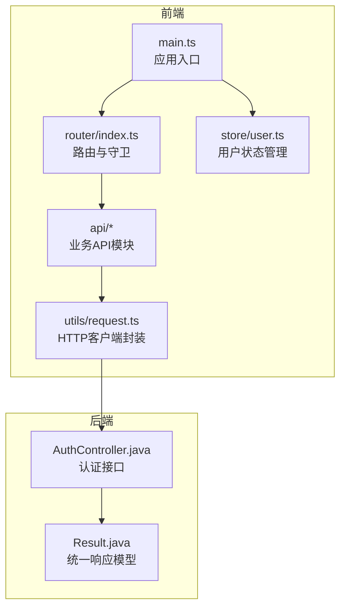
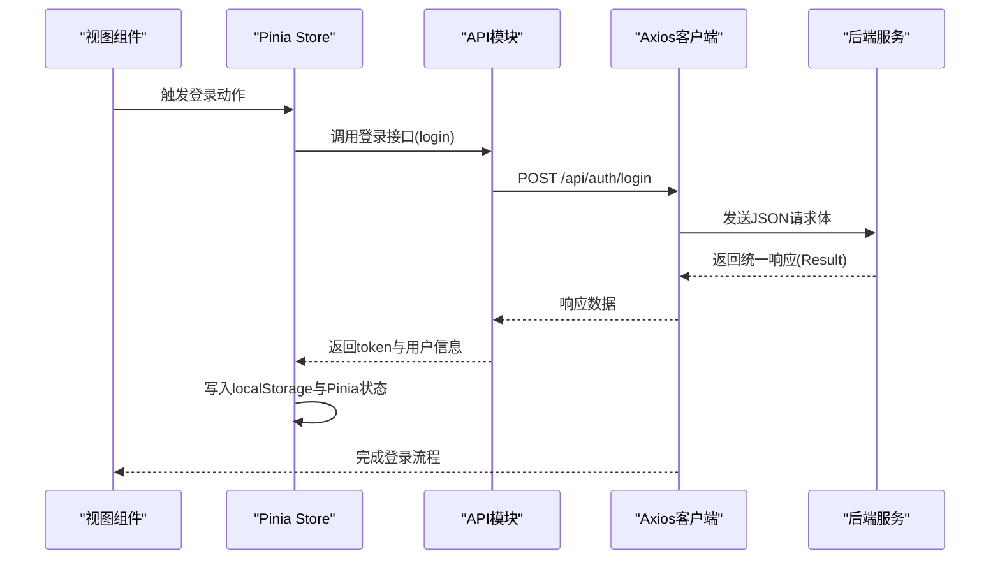
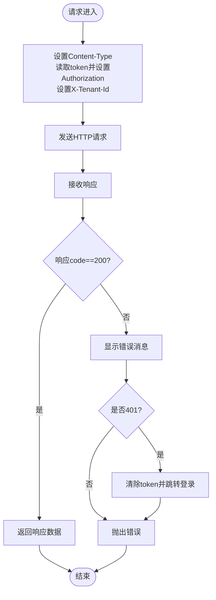
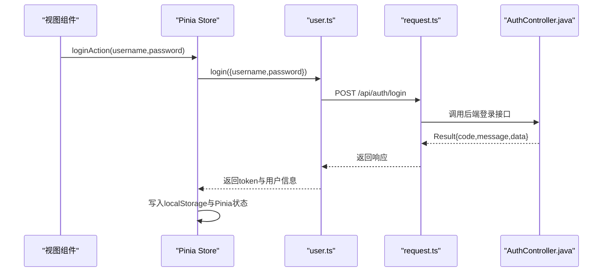
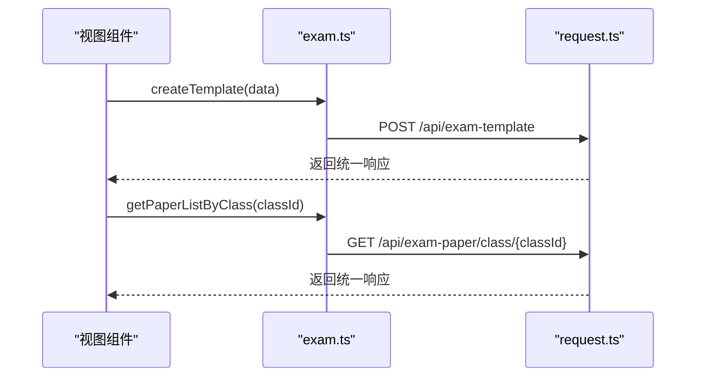
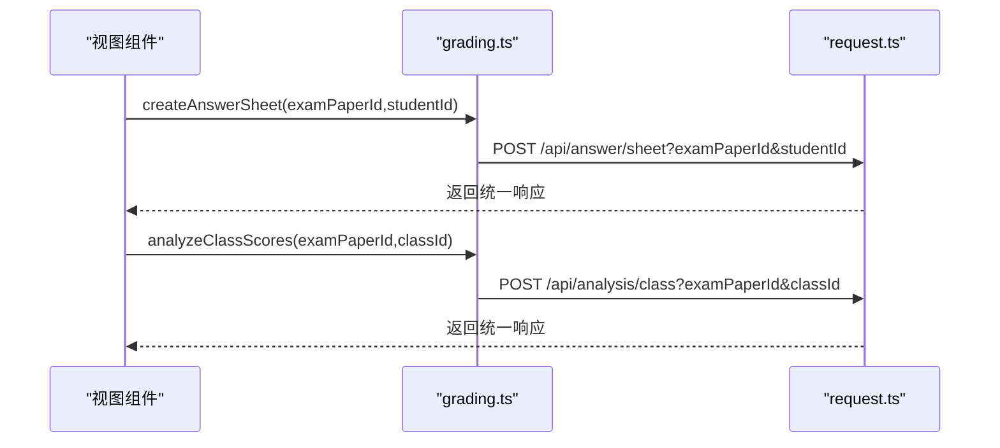
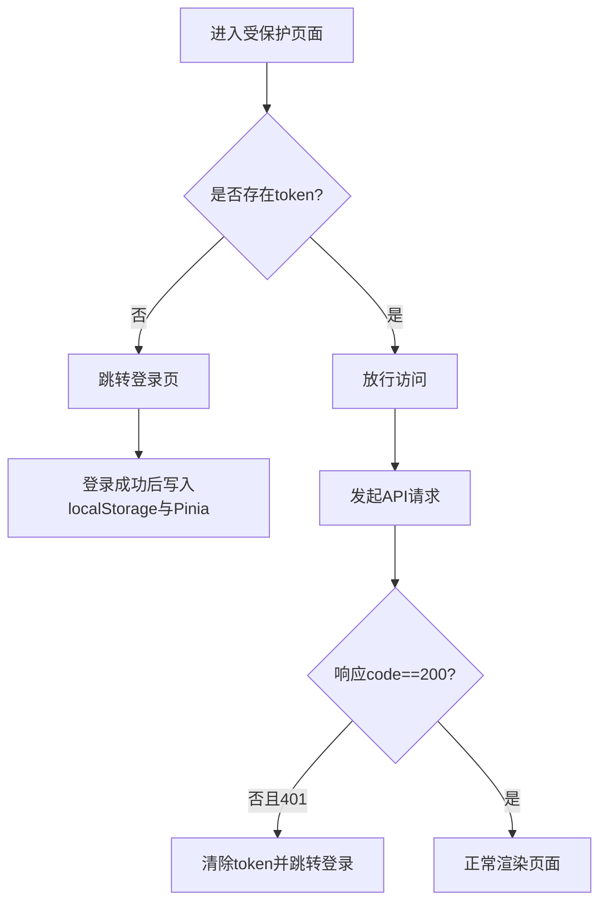
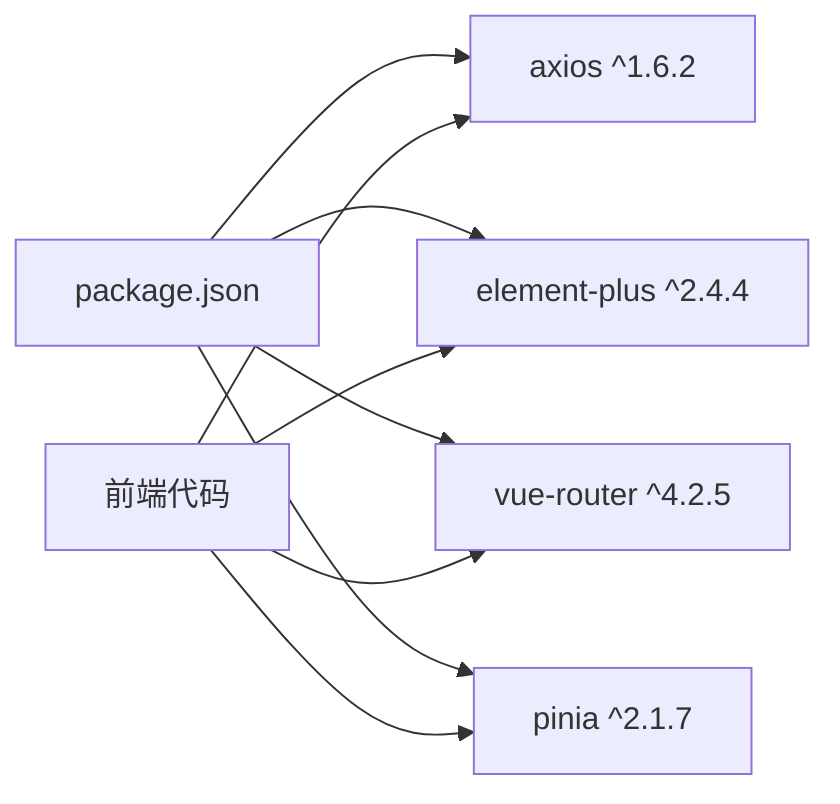

# API客户端

<cite>
**本文档引用的文件**
- [request.ts](file://frontend/src/utils/request.ts)
- [user.ts](file://frontend/src/api/user.ts)
- [exam.ts](file://frontend/src/api/exam.ts)
- [grading.ts](file://frontend/src/api/grading.ts)
- [question.ts](file://frontend/src/api/question.ts)
- [student.ts](file://frontend/src/api/student.ts)
- [ppt.ts](file://frontend/src/api/ppt.ts)
- [user.ts（Pinia Store）](file://frontend/src/store/user.ts)
- [index.ts（路由）](file://frontend/src/router/index.ts)
- [main.ts](file://frontend/src/main.ts)
- [package.json](file://frontend/package.json)
- [AuthController.java](file://backend/src/main/java/com/edu/user/controller/AuthController.java)
- [LoginRequest.java](file://backend/src/main/java/com/edu/user/dto/LoginRequest.java)
- [Result.java](file://backend/src/main/java/com/edu/common/entity/Result.java)
</cite>

## 目录
1. [简介](#简介)
2. [项目结构](#项目结构)
3. [核心组件](#核心组件)
4. [架构总览](#架构总览)
5. [详细组件分析](#详细组件分析)
6. [依赖关系分析](#依赖关系分析)
7. [性能考虑](#性能考虑)
8. [故障排除指南](#故障排除指南)
9. [结论](#结论)

## 简介
本文件面向前端开发者与集成工程师，系统性梳理该教育平台前端API客户端的设计与实现，重点覆盖：
- HTTP请求封装与拦截器机制
- 响应统一处理与错误处理策略
- 各模块API接口规范（用户管理、考试管理、批改分析、题库与题目、学生画像、PPT生成）
- 请求工具函数设计（参数处理、URL构建、数据序列化）
- 认证令牌管理与自动跳转逻辑
- 最佳实践（错误处理、重试机制、性能优化）

## 项目结构
前端采用Vite + Vue 3 + Pinia + Element Plus技术栈，API客户端通过Axios进行HTTP通信，并在全局拦截器中统一注入认证头、租户头以及错误处理逻辑。

图表来源
- [main.ts:1-21](file://frontend/src/main.ts#L1-L21)
- [index.ts（路由）:1-114](file://frontend/src/router/index.ts#L1-L114)
- [request.ts:1-53](file://frontend/src/utils/request.ts#L1-L53)
- [user.ts（Pinia Store）:1-44](file://frontend/src/store/user.ts#L1-L44)
- [AuthController.java:1-32](file://backend/src/main/java/com/edu/user/controller/AuthController.java#L1-L32)
- [Result.java:1-44](file://backend/src/main/java/com/edu/common/entity/Result.java#L1-L44)

章节来源
- [main.ts:1-21](file://frontend/src/main.ts#L1-L21)
- [index.ts（路由）:1-114](file://frontend/src/router/index.ts#L1-L114)
- [request.ts:1-53](file://frontend/src/utils/request.ts#L1-L53)
- [user.ts（Pinia Store）:1-44](file://frontend/src/store/user.ts#L1-L44)

## 核心组件
- HTTP客户端封装：基于Axios创建实例，设置基础路径、超时时间，并在请求/响应拦截器中完成通用逻辑（认证头、租户头、错误提示与跳转）。
- API模块：按功能域拆分，如用户、考试、批改、题库、学生画像、PPT等，每个模块导出对应的请求方法。
- 状态管理：使用Pinia管理用户登录态与基本信息，配合路由守卫实现访问控制。
- 路由守卫：未登录访问受保护页面时自动跳转至登录页。

章节来源
- [request.ts:1-53](file://frontend/src/utils/request.ts#L1-L53)
- [user.ts（Pinia Store）:1-44](file://frontend/src/store/user.ts#L1-L44)
- [index.ts（路由）:104-112](file://frontend/src/router/index.ts#L104-L112)

## 架构总览
前端通过统一的HTTP客户端向后端发起请求，后端返回统一响应模型，前端在拦截器中解析并根据状态码执行错误提示或自动登出跳转。

图表来源
- [user.ts（Pinia Store）:25-31](file://frontend/src/store/user.ts#L25-L31)
- [user.ts:4-10](file://frontend/src/api/user.ts#L4-L10)
- [request.ts:34-46](file://frontend/src/utils/request.ts#L34-L46)
- [AuthController.java:20-24](file://backend/src/main/java/com/edu/user/controller/AuthController.java#L20-L24)
- [Result.java:21-27](file://backend/src/main/java/com/edu/common/entity/Result.java#L21-L27)

## 详细组件分析

### HTTP客户端封装与拦截器
- 基础配置：设置基础路径为“/api”，超时时间为30秒。
- 请求拦截器：
  - 默认设置Content-Type为application/json。
  - 从localStorage读取token并注入Authorization头。
  - 固定注入租户ID头（X-Tenant-Id），便于多租户隔离。
- 响应拦截器：
  - 解析后端统一响应对象，当code不等于200时，弹出错误消息并判断是否为401（未授权），若是则清除本地token并跳转到登录页。
  - 对网络异常进行统一错误提示并抛出Promise错误，供上层捕获。

图表来源
- [request.ts:10-31](file://frontend/src/utils/request.ts#L10-L31)
- [request.ts:34-51](file://frontend/src/utils/request.ts#L34-L51)

章节来源
- [request.ts:1-53](file://frontend/src/utils/request.ts#L1-L53)

### 用户管理API
- 登录：POST /api/auth/login，携带用户名与密码，成功后返回包含token的统一响应。
- 注册：POST /api/auth/register，创建新用户。
- 当前用户：GET /api/user/me，获取当前登录用户信息。
- 用户列表：GET /api/user/list，获取用户列表。

图表来源
- [user.ts（Pinia Store）:25-31](file://frontend/src/store/user.ts#L25-L31)
- [user.ts:4-10](file://frontend/src/api/user.ts#L4-L10)
- [request.ts:34-46](file://frontend/src/utils/request.ts#L34-L46)
- [AuthController.java:20-24](file://backend/src/main/java/com/edu/user/controller/AuthController.java#L20-L24)

章节来源
- [user.ts:1-25](file://frontend/src/api/user.ts#L1-L25)
- [user.ts（Pinia Store）:1-44](file://frontend/src/store/user.ts#L1-L44)
- [AuthController.java:1-32](file://backend/src/main/java/com/edu/user/controller/AuthController.java#L1-L32)
- [LoginRequest.java:1-14](file://backend/src/main/java/com/edu/user/dto/LoginRequest.java#L1-L14)

### 考试管理API
- 模板管理：创建、查询、按学科过滤、详情、更新、删除。
- 试卷管理：创建、AI生成、查询、按班级过滤、详情、更新、发布、删除、添加题目。
- 参数传递方式：部分接口通过URL路径参数，部分通过查询参数，遵循REST风格。

图表来源
- [exam.ts:3-78](file://frontend/src/api/exam.ts#L3-L78)
- [request.ts:34-46](file://frontend/src/utils/request.ts#L34-L46)

章节来源
- [exam.ts:1-78](file://frontend/src/api/exam.ts#L1-L78)

### 批改分析API
- 答题卡：创建、提交、批改、详情、列表、答案列表。
- 成绩分析：按班级分析、获取分析结果。
- 错题管理：获取学生错题、标记已纠错、获取高频错题。

图表来源
- [grading.ts:1-63](file://frontend/src/api/grading.ts#L1-L63)
- [request.ts:34-46](file://frontend/src/utils/request.ts#L34-L46)

章节来源
- [grading.ts:1-63](file://frontend/src/api/grading.ts#L1-L63)

### 题库与题目API
- 题库：创建、查询、按学科过滤、详情、更新、删除。
- 题目：创建、按题库查询、条件查询（学科、类型、难度）、详情、更新、删除。

章节来源
- [question.ts:1-61](file://frontend/src/api/question.ts#L1-L61)

### 学生画像API
- 获取学生画像、按班级批量获取、知识点掌握、成绩趋势、更新兴趣爱好等。

章节来源
- [student.ts:1-26](file://frontend/src/api/student.ts#L1-L26)

### PPT生成API
- 生成PPT、获取列表、详情、删除。

章节来源
- [ppt.ts:1-21](file://frontend/src/api/ppt.ts#L1-L21)

### 认证与状态管理
- 登录成功后，Pinia Store将token写入localStorage并保存到状态；登出时清除token与用户信息。
- 路由守卫在访问受保护页面时检查token，缺失则跳转登录页。
- Axios响应拦截器在401时自动清理token并跳转登录页，保证全局一致性。

图表来源
- [index.ts（路由）:104-112](file://frontend/src/router/index.ts#L104-L112)
- [user.ts（Pinia Store）:38-42](file://frontend/src/store/user.ts#L38-L42)
- [request.ts:39-43](file://frontend/src/utils/request.ts#L39-L43)

章节来源
- [user.ts（Pinia Store）:1-44](file://frontend/src/store/user.ts#L1-L44)
- [index.ts（路由）:1-114](file://frontend/src/router/index.ts#L1-L114)
- [request.ts:1-53](file://frontend/src/utils/request.ts#L1-L53)

## 依赖关系分析
- Axios版本：1.6.2，用于HTTP请求。
- Element Plus：UI组件库与消息提示。
- Vue Router与Pinia：路由与状态管理。
- 统一响应模型：后端返回Result对象，前端在拦截器中解析并处理。

图表来源
- [package.json:11-24](file://frontend/package.json#L11-L24)

章节来源
- [package.json:1-25](file://frontend/package.json#L1-L25)

## 性能考虑
- 超时设置：30秒，避免长时间阻塞。
- 全局拦截器：集中处理认证头与错误，减少重复代码。
- 统一响应模型：简化前端分支处理。
- 建议优化方向：
  - 对频繁请求的接口增加缓存策略（如查询类接口）。
  - 在高并发场景下考虑引入重试与退避策略（需谨慎，避免放大后端压力）。
  - 对大列表分页加载，避免一次性传输过多数据。
  - 使用TypeScript严格类型约束，减少运行期错误。

## 故障排除指南
- 登录后仍被重定向到登录页
  - 检查localStorage中token是否存在且未过期。
  - 确认后端返回的统一响应code为200。
- 401未授权错误
  - 拦截器会自动清除token并跳转登录，请确认后端JWT签发与校验逻辑。
- 网络错误
  - 检查基础路径“/api”代理配置是否正确，确保与后端一致。
- 租户ID问题
  - 请求拦截器固定注入X-Tenant-Id，若多租户场景需要动态切换，建议在Store中维护并动态设置。

章节来源
- [request.ts:34-51](file://frontend/src/utils/request.ts#L34-L51)
- [index.ts（路由）:104-112](file://frontend/src/router/index.ts#L104-L112)

## 结论
该API客户端通过Axios统一封装HTTP请求，结合Pinia与路由守卫实现了完善的认证与访问控制；后端采用统一响应模型，使前端错误处理与状态管理更加一致。建议在现有基础上进一步完善缓存、重试与类型安全，以提升用户体验与系统稳定性。