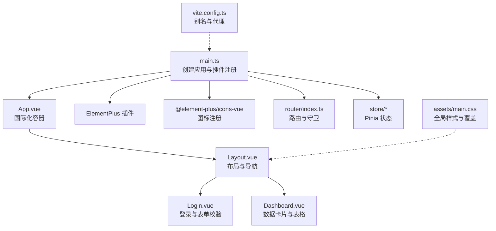
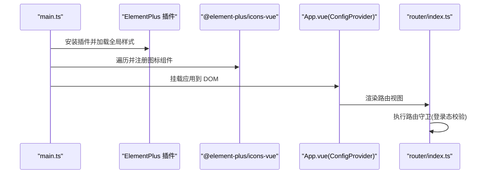
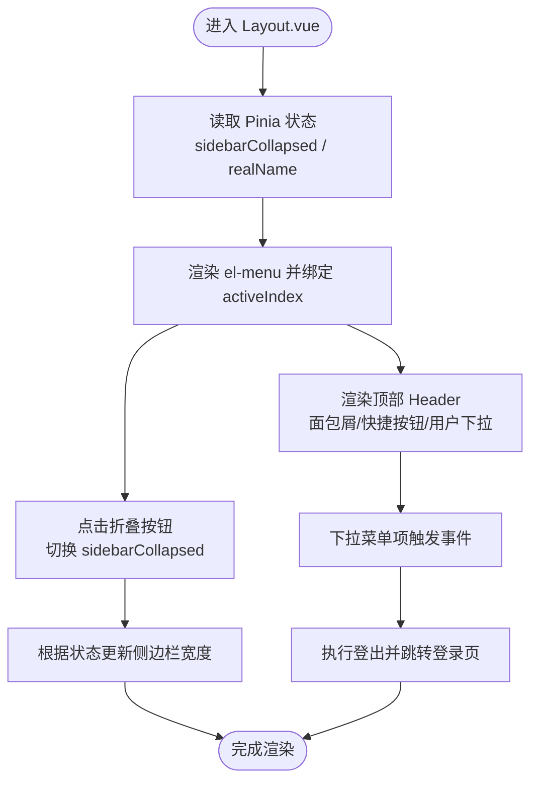
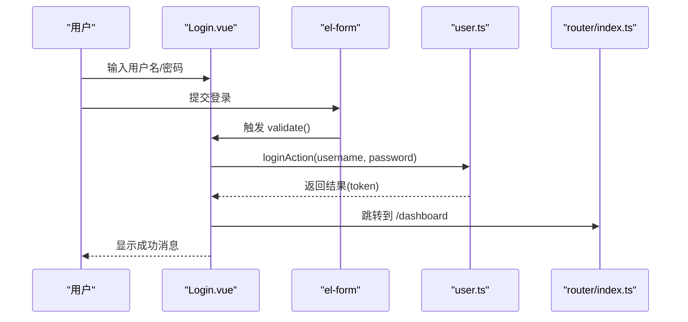
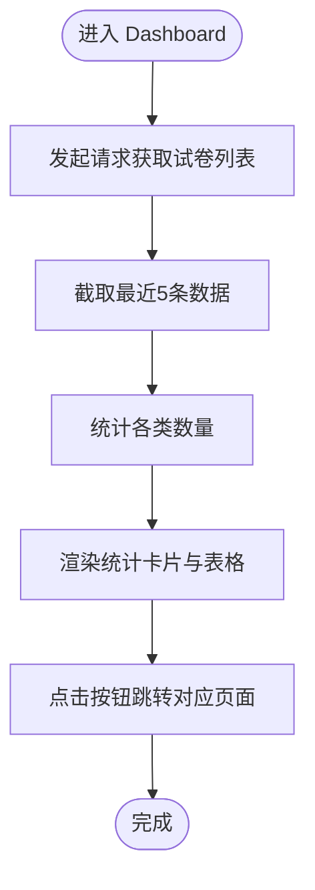
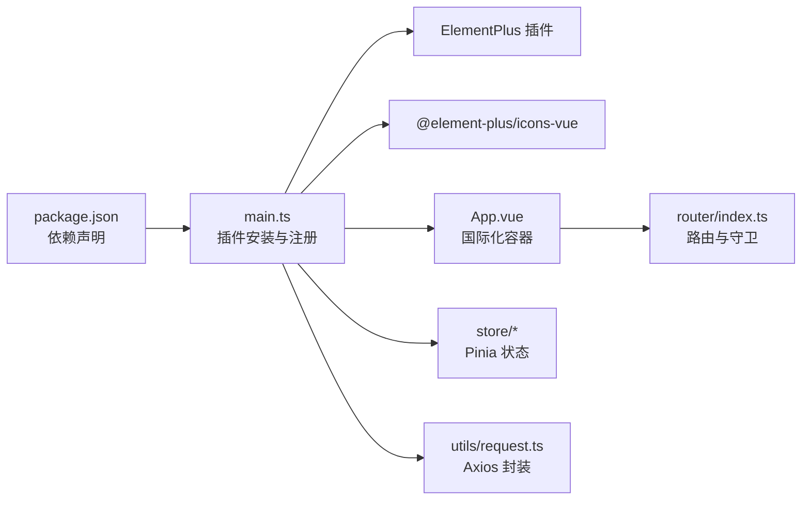

# UI库集成

<cite>
**本文引用的文件**
- [package.json](file://frontend/package.json)
- [vite.config.ts](file://frontend/vite.config.ts)
- [main.ts](file://frontend/src/main.ts)
- [App.vue](file://frontend/src/App.vue)
- [main.css](file://frontend/src/assets/main.css)
- [index.ts](file://frontend/src/router/index.ts)
- [app.ts](file://frontend/src/store/app.ts)
- [user.ts](file://frontend/src/store/user.ts)
- [Layout.vue](file://frontend/src/views/Layout.vue)
- [Login.vue](file://frontend/src/views/Login.vue)
- [Dashboard.vue](file://frontend/src/views/Dashboard.vue)
- [request.ts](file://frontend/src/utils/request.ts)
- [tsconfig.json](file://frontend/tsconfig.json)
</cite>

## 目录
1. [简介](#简介)
2. [项目结构](#项目结构)
3. [核心组件](#核心组件)
4. [架构总览](#架构总览)
5. [详细组件分析](#详细组件分析)
6. [依赖分析](#依赖分析)
7. [性能考虑](#性能考虑)
8. [故障排查指南](#故障排查指南)
9. [结论](#结论)
10. [附录](#附录)

## 简介
本文件面向前端与全栈开发者，系统化梳理本项目中 Element Plus 的集成与配置方式，涵盖主题定制思路、图标系统、组件样式覆盖策略；同时总结 UI 组件使用规范（表单验证、数据展示、交互反馈），并给出 CSS 样式管理与响应式设计建议、图标扩展方法以及可访问性、性能优化与浏览器兼容性最佳实践。

## 项目结构
前端采用 Vue 3 + Vite + TypeScript 架构，Element Plus 作为主要 UI 组件库，通过按需引入与全局注册结合的方式在应用中统一使用。项目关键入口与配置如下：
- 入口应用：创建 Vue 应用实例，注册 Element Plus、图标、路由与状态管理，并挂载根组件。
- 国际化：通过 ConfigProvider 挂载中文本地化资源。
- 图标：批量注册 Element Plus 内置图标组件，便于在模板中直接使用。
- 路由：集中定义页面级路由与导航守卫，控制登录态与页面跳转。
- 样式：全局重置与基础字体、菜单与表格样式覆盖。

图表来源
- [main.ts:1-21](file://frontend/src/main.ts#L1-L21)
- [App.vue:1-16](file://frontend/src/App.vue#L1-L16)
- [index.ts:1-114](file://frontend/src/router/index.ts#L1-L114)
- [Layout.vue:1-497](file://frontend/src/views/Layout.vue#L1-L497)
- [Login.vue:1-165](file://frontend/src/views/Login.vue#L1-L165)
- [Dashboard.vue:1-207](file://frontend/src/views/Dashboard.vue#L1-L207)
- [main.css:1-19](file://frontend/src/assets/main.css#L1-L19)
- [vite.config.ts:1-21](file://frontend/vite.config.ts#L1-L21)

章节来源
- [main.ts:1-21](file://frontend/src/main.ts#L1-L21)
- [App.vue:1-16](file://frontend/src/App.vue#L1-L16)
- [index.ts:1-114](file://frontend/src/router/index.ts#L1-L114)
- [main.css:1-19](file://frontend/src/assets/main.css#L1-L19)
- [vite.config.ts:1-21](file://frontend/vite.config.ts#L1-L21)

## 核心组件
- 应用入口与插件注册：在入口文件中完成 Element Plus、图标、路由、状态管理的安装与挂载。
- 国际化容器：通过 ConfigProvider 包裹整个应用，设置语言为简体中文。
- 路由与守卫：集中定义页面路由与登录态校验，未登录访问受保护路由将重定向至登录页。
- 全局样式与覆盖：统一字体、菜单边框与表格头部背景色等基础样式，确保一致的视觉体验。
- 图标系统：批量注册 Element Plus 图标，支持在模板中以组件形式直接使用。

章节来源
- [main.ts:1-21](file://frontend/src/main.ts#L1-L21)
- [App.vue:1-16](file://frontend/src/App.vue#L1-L16)
- [index.ts:104-112](file://frontend/src/router/index.ts#L104-L112)
- [main.css:13-19](file://frontend/src/assets/main.css#L13-L19)

## 架构总览
Element Plus 在本项目中的集成路径如下：
- 依赖声明：在依赖中引入 Element Plus 与图标包。
- 插件安装：在入口文件中安装 Element Plus 插件，加载全局样式。
- 图标注册：遍历图标集合，将所有图标组件注册为全局组件，便于模板中直接使用。
- 国际化：通过 ConfigProvider 设置语言为中文。
- 路由与状态：配合路由守卫与 Pinia 状态管理，实现登录态控制与页面切换。

图表来源
- [main.ts:3-19](file://frontend/src/main.ts#L3-L19)
- [App.vue:2-4](file://frontend/src/App.vue#L2-L4)
- [index.ts:104-112](file://frontend/src/router/index.ts#L104-L112)

章节来源
- [package.json:11-17](file://frontend/package.json#L11-L17)
- [main.ts:3-19](file://frontend/src/main.ts#L3-L19)
- [App.vue:2-4](file://frontend/src/App.vue#L2-L4)
- [index.ts:104-112](file://frontend/src/router/index.ts#L104-L112)

## 详细组件分析

### 布局与导航组件（Layout.vue）
- 功能要点
  - 侧边栏折叠/展开逻辑，基于 Pinia 状态控制宽度与菜单文本显示。
  - 顶部面包屑、快捷按钮与用户下拉菜单，集成图标、头像与下拉项。
  - 使用滚动条组件包裹菜单，避免溢出。
  - 使用 ConfigProvider 的本地化能力，确保日期选择等组件显示中文。
- 样式覆盖
  - 菜单右侧边框移除，统一侧边栏背景与阴影。
  - 菜单项激活态与悬停态颜色与渐变，提升交互反馈。
  - 表格头部背景色覆盖，保证数据展示一致性。
- 交互反馈
  - 通过 Element Plus 的 Tooltip、Dropdown、Avatar 等组件增强可用性。
  - 路由跳转与面包屑联动，保持导航清晰。

图表来源
- [Layout.vue:190-233](file://frontend/src/views/Layout.vue#L190-L233)
- [app.ts:14-22](file://frontend/src/store/app.ts#L14-L22)
- [user.ts:38-42](file://frontend/src/store/user.ts#L38-L42)

章节来源
- [Layout.vue:1-497](file://frontend/src/views/Layout.vue#L1-L497)
- [app.ts:1-23](file://frontend/src/store/app.ts#L1-L23)
- [user.ts:1-44](file://frontend/src/store/user.ts#L1-L44)

### 登录与表单校验（Login.vue）
- 功能要点
  - 登录表单：用户名、密码输入，前缀图标，密码可见切换。
  - 表单规则：必填校验，登录提交时进行异步校验。
  - 注册弹窗：包含用户名、密码、真实姓名的表单与提交逻辑。
  - 加载态：登录按钮使用 loading 属性，防止重复提交。
  - 反馈提示：使用消息提示组件进行成功/失败反馈。
- 交互流程
  - 登录：表单校验通过后调用用户 Store 执行登录动作，成功后跳转首页。
  - 注册：表单校验通过后调用注册接口，成功后关闭弹窗并回填用户名。

图表来源
- [Login.vue:108-122](file://frontend/src/views/Login.vue#L108-L122)
- [user.ts:24-31](file://frontend/src/store/user.ts#L24-L31)
- [index.ts:104-112](file://frontend/src/router/index.ts#L104-L112)

章节来源
- [Login.vue:1-165](file://frontend/src/views/Login.vue#L1-L165)
- [user.ts:1-44](file://frontend/src/store/user.ts#L1-L44)

### 数据展示与卡片（Dashboard.vue）
- 功能要点
  - 统计卡片：使用栅格布局展示题库数、试卷数、已批改数、学生数。
  - 快捷操作：四个功能按钮，点击跳转对应页面。
  - 最近试卷：表格展示试卷标题、学科、状态与创建时间，状态使用标签组件展示不同类型。
- 样式与交互
  - 卡片悬停提升与阴影变化，增强交互反馈。
  - 按钮弹性布局，适配小屏设备。

图表来源
- [Dashboard.vue:143-152](file://frontend/src/views/Dashboard.vue#L143-L152)

章节来源
- [Dashboard.vue:1-207](file://frontend/src/views/Dashboard.vue#L1-L207)

### 全局样式与覆盖策略（main.css）
- 全局重置：统一 margin/padding 与盒模型。
- 字体与尺寸：设置 html/body/#app 尺寸与字体族，保证整体一致。
- 组件覆盖：
  - 移除侧边栏菜单右侧边框，统一背景。
  - 表格头部背景色覆盖，提升可读性。

章节来源
- [main.css:1-19](file://frontend/src/assets/main.css#L1-L19)

### 图标系统与自定义图标
- 内置图标注册：在入口文件中遍历图标集合，注册为全局组件，模板中可直接使用。
- 使用方式：在组件模板中以组件形式引用图标，如菜单项、按钮、标签等。
- 自定义图标：可通过 SVG 或第三方图标库引入，注册为全局组件后即可复用。

章节来源
- [main.ts:12-15](file://frontend/src/main.ts#L12-L15)

### 路由与导航守卫
- 登录态控制：未登录访问受保护路由将被重定向至登录页。
- 页面标题：路由元信息中维护页面标题，用于面包屑与页面标题展示。

章节来源
- [index.ts:4-96](file://frontend/src/router/index.ts#L4-L96)
- [index.ts:104-112](file://frontend/src/router/index.ts#L104-L112)

## 依赖分析
- 依赖关系
  - main.ts 依赖 Element Plus 插件与图标包，负责应用初始化与插件安装。
  - App.vue 通过 ConfigProvider 提供语言环境。
  - 各页面组件依赖 Element Plus 组件与图标组件。
  - 路由与状态管理共同决定页面渲染与用户会话。
- 外部依赖
  - Element Plus：提供 UI 组件与样式。
  - Axios：封装请求拦截器与响应拦截器，统一处理鉴权与错误提示。
  - Vue Router / Pinia：路由与状态管理。

图表来源
- [package.json:11-17](file://frontend/package.json#L11-L17)
- [main.ts:3-19](file://frontend/src/main.ts#L3-L19)
- [App.vue:2-4](file://frontend/src/App.vue#L2-L4)
- [index.ts:1-114](file://frontend/src/router/index.ts#L1-L114)
- [request.ts:1-53](file://frontend/src/utils/request.ts#L1-L53)

章节来源
- [package.json:1-25](file://frontend/package.json#L1-L25)
- [main.ts:1-21](file://frontend/src/main.ts#L1-L21)
- [request.ts:1-53](file://frontend/src/utils/request.ts#L1-L53)

## 性能考虑
- 按需引入与 Tree Shaking
  - 通过构建工具与模块解析策略减少未使用代码体积。
- 组件懒加载
  - 路由级组件使用动态导入，降低首屏加载压力。
- 图标按需使用
  - 仅注册实际使用的图标，避免引入全部图标导致体积增大。
- 样式覆盖最小化
  - 优先使用 Element Plus 提供的属性与类名，必要时再进行局部覆盖，减少样式冲突与重绘。
- 缓存与请求节流
  - 对高频请求进行节流或缓存策略，减少不必要的网络开销。

## 故障排查指南
- 登录失败或频繁跳转登录页
  - 检查请求拦截器是否正确设置 Authorization 头与租户 ID。
  - 检查响应拦截器对 401 的处理逻辑与路由跳转。
- 表单校验不生效
  - 确认 el-form 的 ref 与 rules 是否正确绑定，提交时调用了 validate 方法。
- 图标不显示
  - 确认图标已在入口文件中注册为全局组件，模板中使用的是已注册的组件名。
- 国际化未生效
  - 确认 ConfigProvider 已包裹根组件且语言设置为中文。

章节来源
- [request.ts:10-31](file://frontend/src/utils/request.ts#L10-L31)
- [request.ts:33-51](file://frontend/src/utils/request.ts#L33-L51)
- [Login.vue:108-122](file://frontend/src/views/Login.vue#L108-L122)
- [main.ts:12-15](file://frontend/src/main.ts#L12-L15)
- [App.vue:2-4](file://frontend/src/App.vue#L2-L4)

## 结论
本项目通过在入口文件集中安装 Element Plus 插件与注册图标，结合 ConfigProvider 实现中文本地化，辅以全局样式覆盖与路由守卫，形成了统一、可维护的 UI 基础设施。在表单验证、数据展示与交互反馈方面，遵循了 Element Plus 的推荐用法，并通过 Pinia 与 Axios 将状态与请求进行解耦。后续可在主题定制、图标扩展与样式治理方面进一步沉淀规范，以提升团队协作效率与产品一致性。

## 附录

### 主题定制与样式管理建议
- 主题定制
  - 使用 CSS 变量覆盖 Element Plus 的设计变量，集中放置于全局样式文件中，便于统一管理与升级。
- 组件样式覆盖
  - 优先使用组件提供的属性与类名；对于需要覆盖的场景，尽量限定作用域，避免全局污染。
- 响应式设计
  - 使用栅格系统与断点属性，结合媒体查询实现移动端适配。
- 可访问性
  - 为交互元素提供语义化标签与键盘可达性；为图片与图标提供替代文本；确保对比度满足可读性要求。
- 浏览器兼容性
  - 关注现代浏览器特性与 polyfill 的使用；在构建配置中设置目标环境，确保编译后的代码在目标浏览器中正常运行。

### API 与配置参考
- Element Plus 插件安装与图标注册
  - 参考入口文件中的安装与注册逻辑。
- 国际化配置
  - 通过 ConfigProvider 设置语言为中文。
- 路由与守卫
  - 受保护路由访问需具备有效 token，否则重定向至登录页。
- 全局样式
  - 统一字体、尺寸与组件覆盖，确保视觉一致性。

章节来源
- [main.ts:3-19](file://frontend/src/main.ts#L3-L19)
- [App.vue:2-4](file://frontend/src/App.vue#L2-L4)
- [index.ts:104-112](file://frontend/src/router/index.ts#L104-L112)
- [main.css:1-19](file://frontend/src/assets/main.css#L1-L19)
- [tsconfig.json:18-20](file://frontend/tsconfig.json#L18-L20)
- [vite.config.ts:7-11](file://frontend/vite.config.ts#L7-L11)