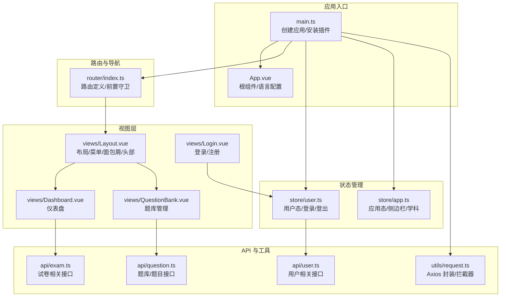
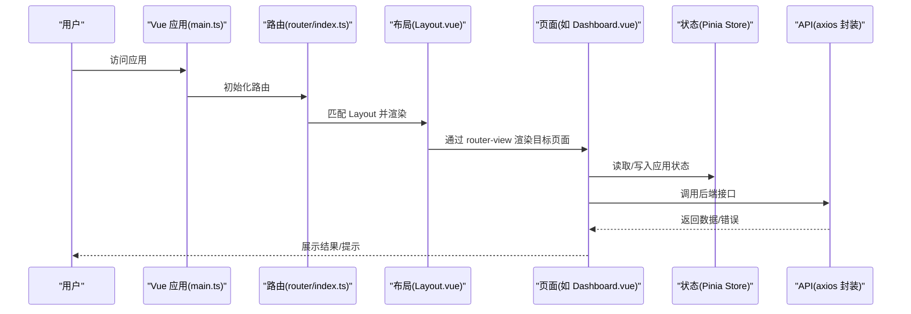
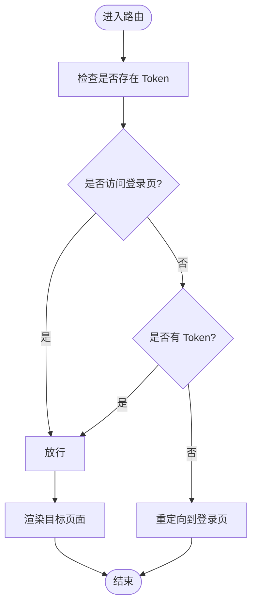
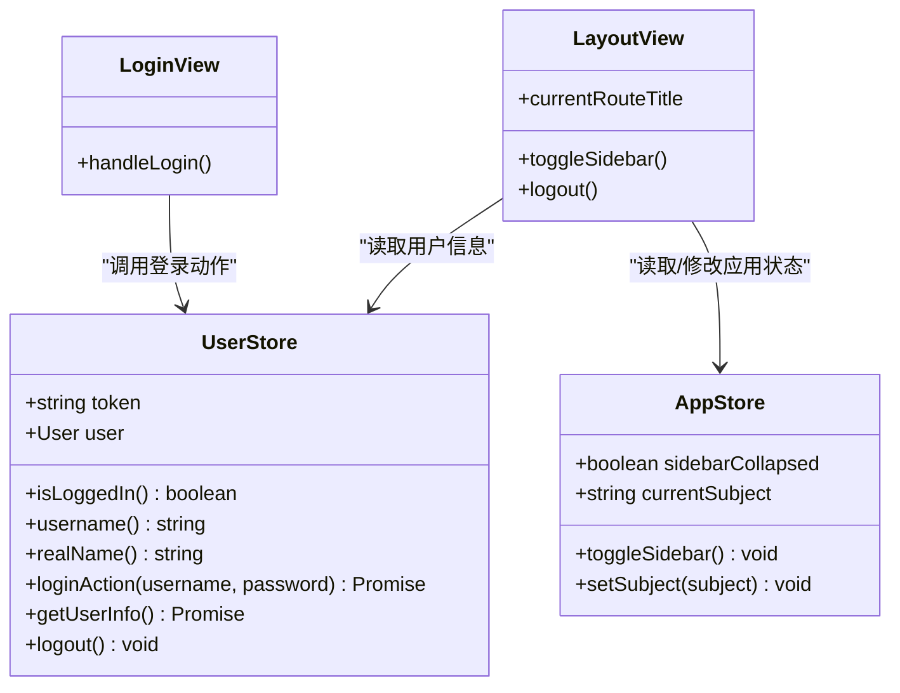
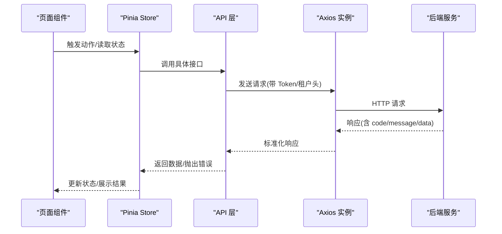
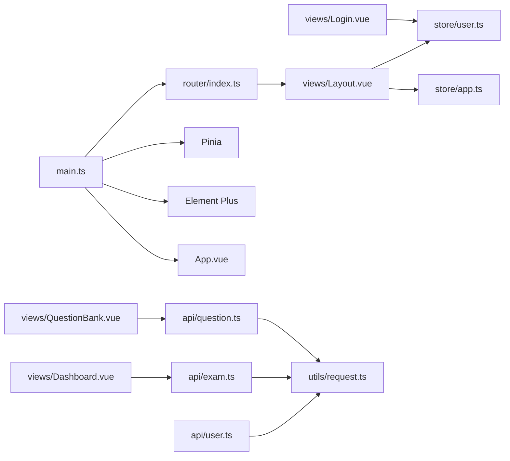

# 前端应用架构

<cite>
**本文引用的文件**
- [main.ts](file://frontend/src/main.ts)
- [App.vue](file://frontend/src/App.vue)
- [router/index.ts](file://frontend/src/router/index.ts)
- [store/app.ts](file://frontend/src/store/app.ts)
- [store/user.ts](file://frontend/src/store/user.ts)
- [views/Layout.vue](file://frontend/src/views/Layout.vue)
- [utils/request.ts](file://frontend/src/utils/request.ts)
- [package.json](file://frontend/package.json)
- [vite.config.ts](file://frontend/vite.config.ts)
- [tsconfig.json](file://frontend/tsconfig.json)
- [views/Dashboard.vue](file://frontend/src/views/Dashboard.vue)
- [views/Login.vue](file://frontend/src/views/Login.vue)
- [api/user.ts](file://frontend/src/api/user.ts)
- [api/exam.ts](file://frontend/src/api/exam.ts)
- [api/question.ts](file://frontend/src/api/question.ts)
- [views/QuestionBank.vue](file://frontend/src/views/QuestionBank.vue)
- [assets/main.css](file://frontend/src/assets/main.css)
</cite>

## 目录
1. [简介](#简介)
2. [项目结构](#项目结构)
3. [核心组件](#核心组件)
4. [架构总览](#架构总览)
5. [详细组件分析](#详细组件分析)
6. [依赖关系分析](#依赖关系分析)
7. [性能考虑](#性能考虑)
8. [故障排查指南](#故障排查指南)
9. [结论](#结论)
10. [附录](#附录)

## 简介
本文件面向“教师智能教学系统”前端应用，系统性阐述基于 Vue 3 的整体架构设计与实现要点，涵盖组件化开发、路由管理、状态管理、UI 组件库集成（Element Plus）、API 封装与拦截器、以及开发工具配置与调试技巧。文档同时总结了组件开发规范与最佳实践，帮助团队在保持一致性的同时提升可维护性与性能。

## 项目结构
前端采用 Vite + Vue 3 + TypeScript + Pinia + Element Plus 的现代技术栈，目录组织遵循“功能域 + 层次化”的方式：
- 根入口与应用初始化：main.ts、App.vue
- 路由：router/index.ts
- 状态管理：store 下的 app.ts、user.ts
- 视图层：views 下按业务模块划分的页面组件
- API 层：api 下按领域划分的接口封装
- 工具层：utils 下的请求封装与拦截器
- 构建与开发：package.json、vite.config.ts、tsconfig.json
- 全局样式：assets/main.css

图表来源
- [main.ts:1-21](file://frontend/src/main.ts#L1-L21)
- [App.vue:1-16](file://frontend/src/App.vue#L1-L16)
- [router/index.ts:1-114](file://frontend/src/router/index.ts#L1-L114)
- [store/user.ts:1-44](file://frontend/src/store/user.ts#L1-L44)
- [store/app.ts:1-23](file://frontend/src/store/app.ts#L1-L23)
- [views/Layout.vue:1-497](file://frontend/src/views/Layout.vue#L1-L497)
- [views/Login.vue:1-165](file://frontend/src/views/Login.vue#L1-L165)
- [views/Dashboard.vue:1-207](file://frontend/src/views/Dashboard.vue#L1-L207)
- [views/QuestionBank.vue:1-180](file://frontend/src/views/QuestionBank.vue#L1-L180)
- [api/user.ts:1-25](file://frontend/src/api/user.ts#L1-L25)
- [api/exam.ts:1-78](file://frontend/src/api/exam.ts#L1-L78)
- [api/question.ts:1-61](file://frontend/src/api/question.ts#L1-L61)
- [utils/request.ts:1-53](file://frontend/src/utils/request.ts#L1-L53)

章节来源
- [main.ts:1-21](file://frontend/src/main.ts#L1-L21)
- [App.vue:1-16](file://frontend/src/App.vue#L1-L16)
- [router/index.ts:1-114](file://frontend/src/router/index.ts#L1-L114)
- [store/app.ts:1-23](file://frontend/src/store/app.ts#L1-L23)
- [store/user.ts:1-44](file://frontend/src/store/user.ts#L1-L44)
- [views/Layout.vue:1-497](file://frontend/src/views/Layout.vue#L1-L497)
- [utils/request.ts:1-53](file://frontend/src/utils/request.ts#L1-L53)
- [package.json:1-25](file://frontend/package.json#L1-L25)
- [vite.config.ts:1-21](file://frontend/vite.config.ts#L1-L21)
- [tsconfig.json:1-24](file://frontend/tsconfig.json#L1-L24)

## 核心组件
- 应用启动与插件注册：在入口文件中完成 Vue 实例创建、Pinia、路由、Element Plus 的安装，并统一注册 Element Plus 图标组件。
- 根组件与本地化：根组件通过配置提供中文语言环境，保证 UI 文案与交互符合中文用户的习惯。
- 路由与导航：采用 history 模式，集中定义页面路由与子路由；通过前置守卫实现基础的登录鉴权。
- 状态管理：Pinia Store 分为用户态与应用态，分别处理登录态、用户信息与侧边栏折叠、当前学科等应用级状态。
- 视图层：Layout 作为主框架，承载菜单、面包屑、头部与主内容区；各业务页面以功能域划分，便于扩展与维护。
- API 与拦截器：统一的 Axios 实例封装，内置请求/响应拦截器，自动注入 Token、租户头与错误处理逻辑。

章节来源
- [main.ts:1-21](file://frontend/src/main.ts#L1-L21)
- [App.vue:7-9](file://frontend/src/App.vue#L7-L9)
- [router/index.ts:104-112](file://frontend/src/router/index.ts#L104-L112)
- [store/user.ts:12-44](file://frontend/src/store/user.ts#L12-L44)
- [store/app.ts:8-23](file://frontend/src/store/app.ts#L8-L23)
- [views/Layout.vue:180-185](file://frontend/src/views/Layout.vue#L180-L185)
- [utils/request.ts:5-53](file://frontend/src/utils/request.ts#L5-L53)

## 架构总览
前端应用采用“入口 -> 插件 -> 路由 -> 视图 -> API -> 状态”的清晰链路。Element Plus 提供丰富的 UI 组件，配合 Pinia 实现轻量级状态管理；Vite 提供高效的开发体验与构建能力；TypeScript 提升类型安全与开发效率。

图表来源
- [main.ts:10-21](file://frontend/src/main.ts#L10-L21)
- [router/index.ts:104-112](file://frontend/src/router/index.ts#L104-L112)
- [views/Layout.vue:180-185](file://frontend/src/views/Layout.vue#L180-L185)
- [views/Dashboard.vue:107-153](file://frontend/src/views/Dashboard.vue#L107-L153)
- [utils/request.ts:11-51](file://frontend/src/utils/request.ts#L11-L51)

## 详细组件分析

### 路由与导航机制
- 路由定义：采用函数式异步加载页面组件，减少首屏体积；根路径重定向至仪表盘；子路由集中于 Layout 容器。
- 导航与面包屑：Layout 中通过 el-breadcrumb 动态拼接“首页 + 当前路由标题”，标题映射表覆盖主要业务路径。
- 权限控制：前置守卫检查是否存在 Token，未登录访问非登录页则强制跳转登录页。

图表来源
- [router/index.ts:104-112](file://frontend/src/router/index.ts#L104-L112)
- [views/Layout.vue:142-145](file://frontend/src/views/Layout.vue#L142-L145)
- [views/Layout.vue:207-223](file://frontend/src/views/Layout.vue#L207-L223)

章节来源
- [router/index.ts:4-97](file://frontend/src/router/index.ts#L4-L97)
- [router/index.ts:104-112](file://frontend/src/router/index.ts#L104-L112)
- [views/Layout.vue:142-145](file://frontend/src/views/Layout.vue#L142-L145)
- [views/Layout.vue:207-223](file://frontend/src/views/Layout.vue#L207-L223)

### 状态管理策略（Pinia）
- 用户 Store（user.ts）：负责登录、获取用户信息、登出；持久化 Token 到本地存储；提供派生状态（是否登录、用户名、真实姓名）。
- 应用 Store（app.ts）：负责侧边栏折叠状态与当前学科；提供切换与设置方法。
- 数据流管理：页面通过 Store 读取状态，触发动作进行数据变更；组件间通过 Store 解耦，避免深层 props 传递。

图表来源
- [store/user.ts:12-44](file://frontend/src/store/user.ts#L12-L44)
- [store/app.ts:8-23](file://frontend/src/store/app.ts#L8-L23)
- [views/Login.vue:108-122](file://frontend/src/views/Login.vue#L108-L122)
- [views/Layout.vue:197-232](file://frontend/src/views/Layout.vue#L197-L232)

章节来源
- [store/user.ts:12-44](file://frontend/src/store/user.ts#L12-L44)
- [store/app.ts:8-23](file://frontend/src/store/app.ts#L8-L23)
- [views/Login.vue:70-136](file://frontend/src/views/Login.vue#L70-L136)
- [views/Layout.vue:190-233](file://frontend/src/views/Layout.vue#L190-L233)

### UI 组件库与主题定制（Element Plus）
- 集成方式：在入口文件全局安装 Element Plus，并批量注册图标组件，确保页面可直接使用图标。
- 布局与导航：Layout 使用 el-container、el-aside、el-header、el-main 构建三段式布局；el-menu 与 el-breadcrumb 实现菜单与面包屑。
- 表单与反馈：Login 页面使用 el-form、el-input、el-button 与 ElMessage、ElMessageBox 提升交互体验。
- 主题与样式：通过全局样式覆盖 Element Plus 默认样式，例如表格表头背景色与菜单边框去除。

章节来源
- [main.ts:13-19](file://frontend/src/main.ts#L13-L19)
- [views/Layout.vue:18-185](file://frontend/src/views/Layout.vue#L18-L185)
- [views/Login.vue:10-67](file://frontend/src/views/Login.vue#L10-L67)
- [assets/main.css:13-19](file://frontend/src/assets/main.css#L13-L19)

### API 封装与拦截器
- Axios 实例：统一 baseURL 为 /api，超时时间 30 秒；请求头统一设置 Content-Type 与 Authorization（若存在 Token），并固定 X-Tenant-Id。
- 响应拦截：校验后端返回 code，非 200 统一弹出错误消息；当 code 为 401 自动清理 Token 并跳转登录页；网络异常统一提示。
- 接口分层：按领域拆分 API 文件（user.ts、exam.ts、question.ts），每个文件导出对应 CRUD 方法，便于复用与测试。

图表来源
- [utils/request.ts:5-53](file://frontend/src/utils/request.ts#L5-L53)
- [api/user.ts:1-25](file://frontend/src/api/user.ts#L1-L25)
- [api/exam.ts:1-78](file://frontend/src/api/exam.ts#L1-L78)
- [api/question.ts:1-61](file://frontend/src/api/question.ts#L1-L61)

章节来源
- [utils/request.ts:5-53](file://frontend/src/utils/request.ts#L5-L53)
- [api/user.ts:1-25](file://frontend/src/api/user.ts#L1-L25)
- [api/exam.ts:1-78](file://frontend/src/api/exam.ts#L1-L78)
- [api/question.ts:1-61](file://frontend/src/api/question.ts#L1-L61)

### 开发工具与构建配置
- Vite：配置别名 @ 指向 src，开发服务器端口 3000，代理 /api 到后端 8080；启用 Vue 插件。
- TypeScript：严格模式、未使用变量/参数检测、路径映射 @/*，确保类型安全与可维护性。
- 依赖：Vue 3、Vue Router、Pinia、Axios、Element Plus 及其图标库。

章节来源
- [vite.config.ts:1-21](file://frontend/vite.config.ts#L1-L21)
- [tsconfig.json:18-20](file://frontend/tsconfig.json#L18-L20)
- [package.json:11-24](file://frontend/package.json#L11-L24)

### 组件开发规范与最佳实践
- 组件组织：按功能域划分 views 目录，每个页面组件独立文件，公共逻辑抽取为 Composables 或 Store 动作。
- 命名约定：组件文件使用帕斯卡命名，路由名称与路径语义一致；Store 使用 useXxx 前缀导出。
- 性能优化：异步懒加载路由组件；合理使用 v-if/v-show 控制渲染；在列表场景使用虚拟滚动（如需）；避免不必要的响应式穿透。
- 可维护性：统一的 API 封装与拦截器；明确的错误处理与用户提示；组件内尽量无副作用，状态集中在 Store。

章节来源
- [router/index.ts:4-97](file://frontend/src/router/index.ts#L4-L97)
- [store/user.ts:12-44](file://frontend/src/store/user.ts#L12-L44)
- [store/app.ts:8-23](file://frontend/src/store/app.ts#L8-L23)
- [utils/request.ts:11-51](file://frontend/src/utils/request.ts#L11-L51)

## 依赖关系分析
- 入口依赖：main.ts 依赖路由、Pinia、Element Plus 与 App 根组件。
- 路由依赖：router/index.ts 依赖 views 下的页面组件，形成页面级依赖。
- 状态依赖：views/Layout.vue 与 views/Login.vue 依赖 store/user.ts 与 store/app.ts。
- API 依赖：各页面依赖 api 下对应模块，api 依赖 utils/request.ts。
- 构建依赖：package.json 声明运行时与开发时依赖；vite.config.ts 与 tsconfig.json 影响打包与类型检查。

图表来源
- [main.ts:1-21](file://frontend/src/main.ts#L1-L21)
- [router/index.ts:1-114](file://frontend/src/router/index.ts#L1-L114)
- [views/Layout.vue:190-233](file://frontend/src/views/Layout.vue#L190-L233)
- [views/Login.vue:70-136](file://frontend/src/views/Login.vue#L70-L136)
- [views/Dashboard.vue:107-153](file://frontend/src/views/Dashboard.vue#L107-L153)
- [views/QuestionBank.vue:80-167](file://frontend/src/views/QuestionBank.vue#L80-L167)
- [api/user.ts:1-25](file://frontend/src/api/user.ts#L1-L25)
- [api/exam.ts:1-78](file://frontend/src/api/exam.ts#L1-L78)
- [api/question.ts:1-61](file://frontend/src/api/question.ts#L1-L61)
- [utils/request.ts:1-53](file://frontend/src/utils/request.ts#L1-L53)

章节来源
- [main.ts:1-21](file://frontend/src/main.ts#L1-L21)
- [router/index.ts:1-114](file://frontend/src/router/index.ts#L1-L114)
- [views/Layout.vue:190-233](file://frontend/src/views/Layout.vue#L190-L233)
- [views/Login.vue:70-136](file://frontend/src/views/Login.vue#L70-L136)
- [views/Dashboard.vue:107-153](file://frontend/src/views/Dashboard.vue#L107-L153)
- [views/QuestionBank.vue:80-167](file://frontend/src/views/QuestionBank.vue#L80-L167)
- [api/user.ts:1-25](file://frontend/src/api/user.ts#L1-L25)
- [api/exam.ts:1-78](file://frontend/src/api/exam.ts#L1-L78)
- [api/question.ts:1-61](file://frontend/src/api/question.ts#L1-L61)
- [utils/request.ts:1-53](file://frontend/src/utils/request.ts#L1-L53)

## 性能考虑
- 路由懒加载：通过动态导入页面组件，降低首屏资源体积。
- 状态最小化：仅在 Pinia 中存放跨页面共享的状态，避免在组件内重复缓存。
- 请求去抖与节流：在高频搜索或分页场景中，结合防抖/节流减少请求次数。
- 图标按需引入：当前批量注册图标，建议后续按需引入以进一步减小体积。
- 样式作用域：使用 scoped 样式，避免全局污染；必要时提取公共样式减少重复。

## 故障排查指南
- 登录后无法访问页面：检查路由前置守卫逻辑与 Token 是否正确写入 localStorage。
- 接口 401 错误：确认请求拦截器是否正确注入 Authorization 头；查看响应拦截器是否触发清理逻辑。
- 跨域问题：确认 Vite 代理配置 /api 指向后端地址；浏览器 Network 面板观察请求头与响应码。
- 类型错误：开启严格 TS 检查，关注未使用变量/参数与类型断言风险点。

章节来源
- [router/index.ts:104-112](file://frontend/src/router/index.ts#L104-L112)
- [utils/request.ts:11-51](file://frontend/src/utils/request.ts#L11-L51)
- [vite.config.ts:14-19](file://frontend/vite.config.ts#L14-L19)

## 结论
本前端应用以 Vue 3 为核心，结合 Pinia、Element Plus 与 Vite，构建了清晰的路由、状态与 UI 体系。通过统一的 API 封装与拦截器，实现了稳定的前后端交互；通过布局组件与面包屑导航，提供了良好的用户体验。建议在后续迭代中持续完善权限细化、国际化支持与组件库主题定制，以满足更复杂的业务需求。

## 附录
- 开发命令：dev/build/preview 由 package.json scripts 提供。
- 路径别名：@ 指向 src，便于统一导入。
- 本地开发：Vite 默认端口 3000，代理 /api 到后端 8080。

章节来源
- [package.json:6-10](file://frontend/package.json#L6-L10)
- [tsconfig.json:18-20](file://frontend/tsconfig.json#L18-L20)
- [vite.config.ts:12-20](file://frontend/vite.config.ts#L12-L20)