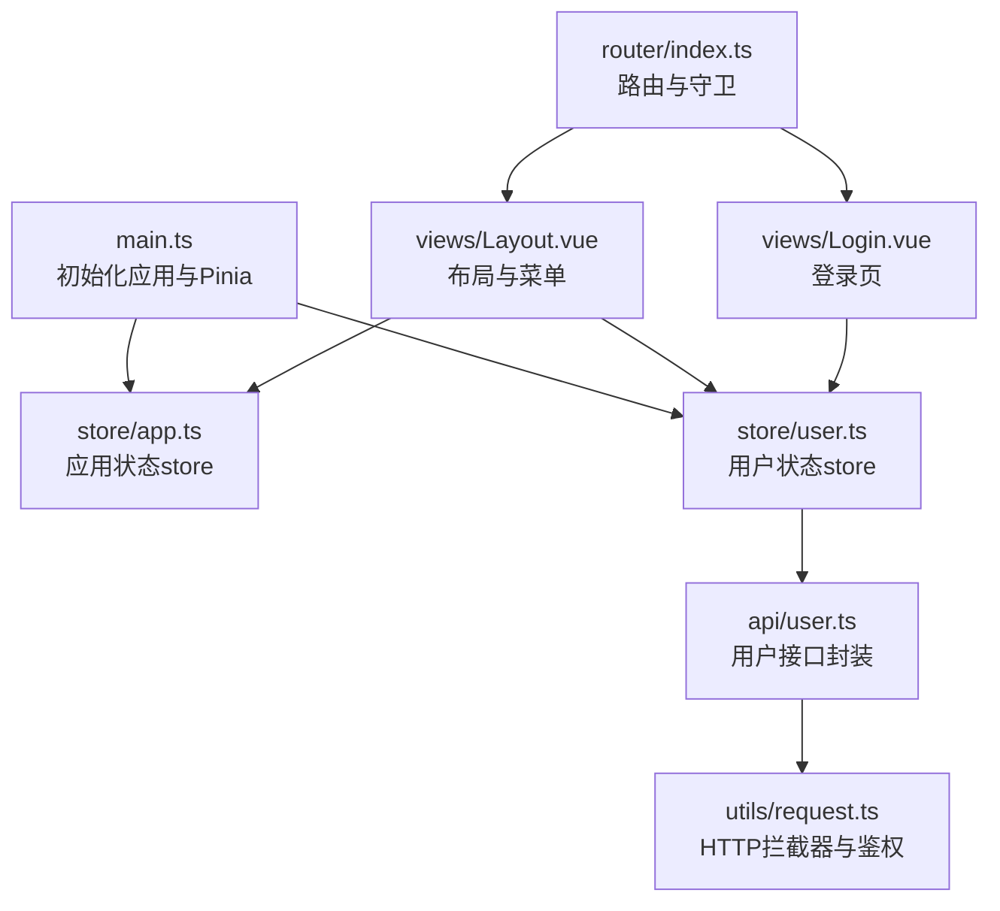
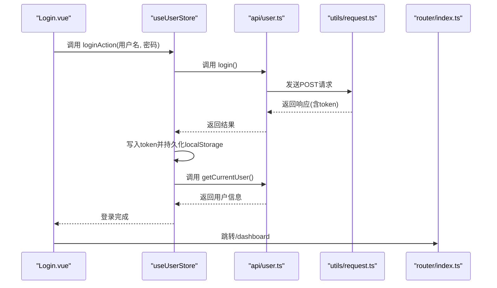
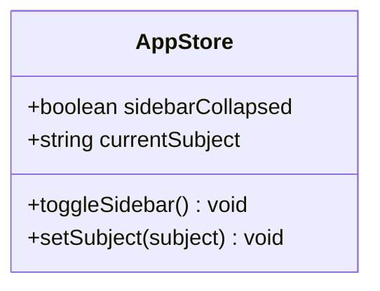
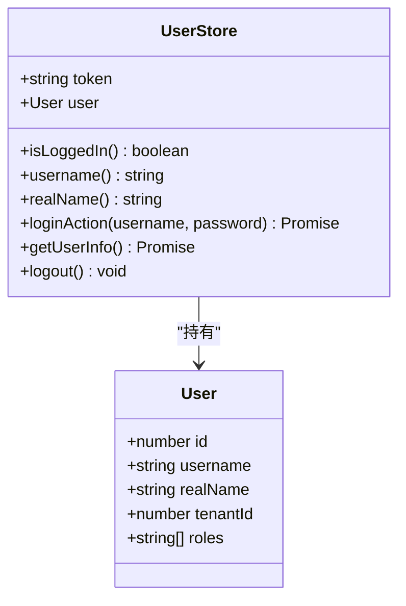
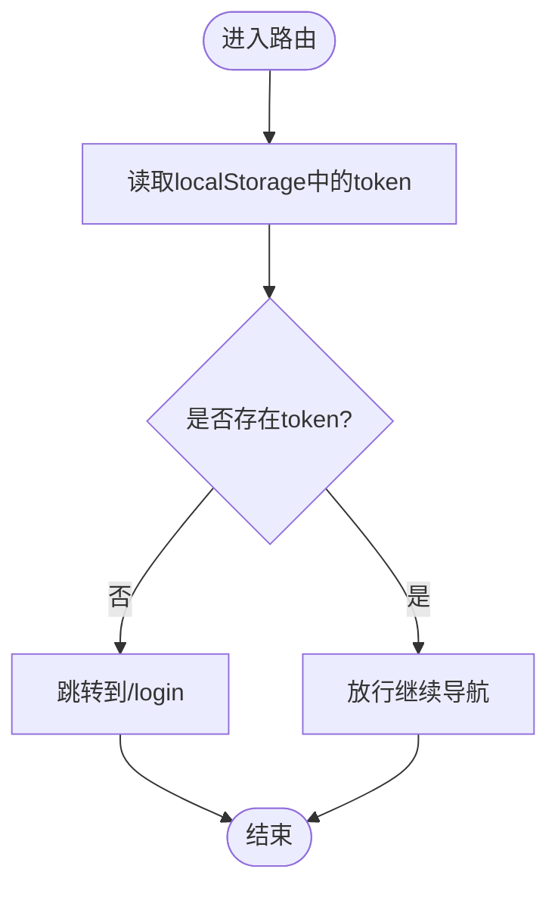
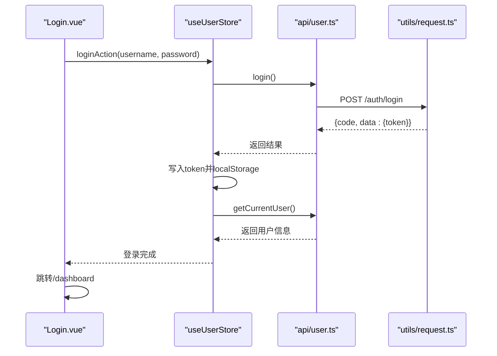
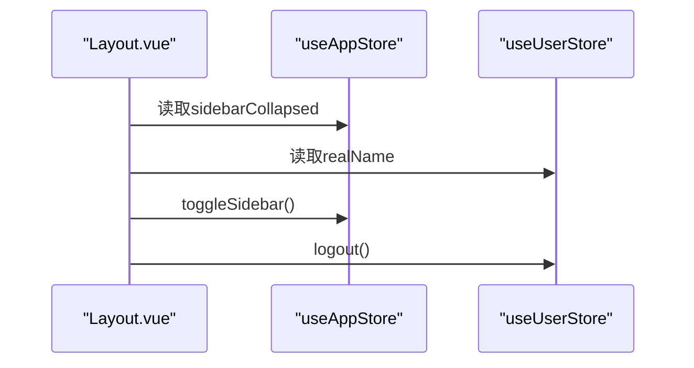
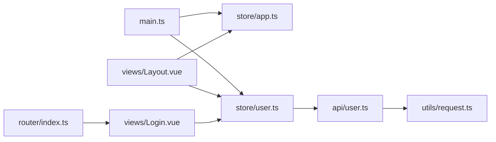

# 状态管理

<cite>
**本文引用的文件**
- [frontend/src/store/app.ts](file://frontend/src/store/app.ts)
- [frontend/src/store/user.ts](file://frontend/src/store/user.ts)
- [frontend/src/main.ts](file://frontend/src/main.ts)
- [frontend/package.json](file://frontend/package.json)
- [frontend/src/views/Layout.vue](file://frontend/src/views/Layout.vue)
- [frontend/src/views/Login.vue](file://frontend/src/views/Login.vue)
- [frontend/src/router/index.ts](file://frontend/src/router/index.ts)
- [frontend/src/utils/request.ts](file://frontend/src/utils/request.ts)
- [frontend/src/api/user.ts](file://frontend/src/api/user.ts)
- [frontend/src/views/Dashboard.vue](file://frontend/src/views/Dashboard.vue)
- [frontend/src/views/ExamGenerate.vue](file://frontend/src/views/ExamGenerate.vue)
</cite>

## 目录
1. [简介](#简介)
2. [项目结构](#项目结构)
3. [核心组件](#核心组件)
4. [架构总览](#架构总览)
5. [详细组件分析](#详细组件分析)
6. [依赖分析](#依赖分析)
7. [性能考虑](#性能考虑)
8. [故障排查指南](#故障排查指南)
9. [结论](#结论)
10. [附录](#附录)

## 简介
本文件围绕前端状态管理展开，基于仓库中的 Pinia 实现，系统性阐述 store 的定义、状态与 action 的组织方式，以及应用状态与用户状态的设计模式。重点覆盖以下方面：
- store 定义与类型约束
- 状态持久化与响应式更新
- 跨组件共享与数据流
- 状态管理最佳实践：设计原则、性能优化与调试技巧

## 项目结构
前端采用 Vue 3 + Pinia + Element Plus 技术栈，状态管理集中在 store 目录，通过 main.ts 初始化 Pinia，并在各页面组件中按需注入与使用。

**图表来源**
- [frontend/src/main.ts:1-21](file://frontend/src/main.ts#L1-L21)
- [frontend/src/store/app.ts:1-23](file://frontend/src/store/app.ts#L1-L23)
- [frontend/src/store/user.ts:1-44](file://frontend/src/store/user.ts#L1-L44)
- [frontend/src/router/index.ts:1-114](file://frontend/src/router/index.ts#L1-L114)
- [frontend/src/views/Layout.vue:190-233](file://frontend/src/views/Layout.vue#L190-L233)
- [frontend/src/views/Login.vue:70-136](file://frontend/src/views/Login.vue#L70-L136)
- [frontend/src/api/user.ts:1-25](file://frontend/src/api/user.ts#L1-L25)
- [frontend/src/utils/request.ts:1-53](file://frontend/src/utils/request.ts#L1-L53)

**章节来源**
- [frontend/src/main.ts:1-21](file://frontend/src/main.ts#L1-L21)
- [frontend/package.json:1-25](file://frontend/package.json#L1-L25)

## 核心组件
- 应用状态 store（app.ts）
  - 状态字段：侧边栏折叠状态、当前学科
  - 动作：切换侧边栏、设置学科
- 用户状态 store（user.ts）
  - 状态字段：token、用户信息
  - 计算属性：是否登录、用户名、真实姓名
  - 动作：登录、获取用户信息、登出
- 入口与插件（main.ts）
  - 创建并挂载 Pinia 实例
- 路由与守卫（router/index.ts）
  - 登录态校验与跳转
- HTTP 请求与拦截（utils/request.ts）
  - 统一设置 Content-Type、Authorization、租户头
  - 统一处理 401 与业务错误

**章节来源**
- [frontend/src/store/app.ts:1-23](file://frontend/src/store/app.ts#L1-L23)
- [frontend/src/store/user.ts:1-44](file://frontend/src/store/user.ts#L1-L44)
- [frontend/src/main.ts:1-21](file://frontend/src/main.ts#L1-L21)
- [frontend/src/router/index.ts:104-112](file://frontend/src/router/index.ts#L104-L112)
- [frontend/src/utils/request.ts:10-31](file://frontend/src/utils/request.ts#L10-L31)

## 架构总览
Pinia 在应用启动时被全局安装，随后在各视图组件中通过组合式 API 使用 store。用户登录流程贯穿 API 层、store 层与路由层，形成完整的状态流转闭环。

**图表来源**
- [frontend/src/views/Login.vue:108-122](file://frontend/src/views/Login.vue#L108-L122)
- [frontend/src/store/user.ts:24-31](file://frontend/src/store/user.ts#L24-L31)
- [frontend/src/api/user.ts:3-10](file://frontend/src/api/user.ts#L3-L10)
- [frontend/src/utils/request.ts:10-31](file://frontend/src/utils/request.ts#L10-L31)
- [frontend/src/router/index.ts:104-112](file://frontend/src/router/index.ts#L104-L112)

## 详细组件分析

### 应用状态 store（app.ts）
- 设计要点
  - 使用 defineStore 定义 store，返回可直接使用的 store 函数
  - state 使用函数返回对象，确保每次创建独立实例
  - 动作直接修改状态，保持简洁与可读
- 数据结构与复杂度
  - 状态字段为标量，访问与更新均为 O(1)
- 依赖关系
  - 无外部依赖，仅依赖 Pinia 类型系统
- 错误处理与边界
  - 当前未显式校验输入合法性；建议在动作中增加参数校验
- 性能影响
  - 状态粒度细、更新频率低，对性能影响可忽略

**图表来源**
- [frontend/src/store/app.ts:3-22](file://frontend/src/store/app.ts#L3-L22)

**章节来源**
- [frontend/src/store/app.ts:1-23](file://frontend/src/store/app.ts#L1-L23)

### 用户状态 store（user.ts）
- 设计要点
  - 状态包含 token 与用户对象，支持从本地存储恢复
  - getters 提供派生状态，避免重复计算
  - actions 封装异步流程：登录、获取用户信息、登出
- 数据结构与复杂度
  - 状态字段为标量与对象，访问与更新 O(1)
- 依赖关系
  - 依赖 api/user.ts 接口与 utils/request.ts 拦截器
- 错误处理与边界
  - 登录后写入 token 并持久化；登出清理 token 与用户信息
  - 未见显式的错误回滚或重试机制
- 性能影响
  - 派生状态通过 getters 缓存，减少重复计算

**图表来源**
- [frontend/src/store/user.ts:4-43](file://frontend/src/store/user.ts#L4-L43)

**章节来源**
- [frontend/src/store/user.ts:1-44](file://frontend/src/store/user.ts#L1-L44)
- [frontend/src/api/user.ts:1-25](file://frontend/src/api/user.ts#L1-L25)
- [frontend/src/utils/request.ts:1-53](file://frontend/src/utils/request.ts#L1-L53)

### 路由守卫与登录态控制（router/index.ts）
- 设计要点
  - beforeEach 中读取 localStorage 判断 token，未登录则跳转登录页
- 行为特征
  - 保护非登录页访问，保证用户态一致性
- 边界与风险
  - 仅检查 token 是否存在，未验证有效性；建议结合后端校验或本地 token 校验

**图表来源**
- [frontend/src/router/index.ts:104-112](file://frontend/src/router/index.ts#L104-L112)

**章节来源**
- [frontend/src/router/index.ts:104-112](file://frontend/src/router/index.ts#L104-L112)

### 登录流程（Login.vue → user.ts → api/user.ts → request.ts）
- 流程说明
  - 视图触发登录动作，调用 store 的 loginAction
  - store 调用 api 登录接口，写入 token 并持久化
  - 随后调用获取用户信息接口，填充用户数据
  - 最终跳转到仪表盘
- 关键交互点
  - 视图层：表单校验、加载态、消息提示
  - store 层：状态写入、本地存储
  - 接口层：统一 header（Authorization、X-Tenant-Id）
  - 拦截器层：统一错误处理与 401 处理

**图表来源**
- [frontend/src/views/Login.vue:108-122](file://frontend/src/views/Login.vue#L108-L122)
- [frontend/src/store/user.ts:24-36](file://frontend/src/store/user.ts#L24-L36)
- [frontend/src/api/user.ts:3-20](file://frontend/src/api/user.ts#L3-L20)
- [frontend/src/utils/request.ts:10-31](file://frontend/src/utils/request.ts#L10-L31)

**章节来源**
- [frontend/src/views/Login.vue:70-136](file://frontend/src/views/Login.vue#L70-L136)
- [frontend/src/store/user.ts:24-36](file://frontend/src/store/user.ts#L24-L36)
- [frontend/src/api/user.ts:1-25](file://frontend/src/api/user.ts#L1-L25)
- [frontend/src/utils/request.ts:10-31](file://frontend/src/utils/request.ts#L10-L31)

### 布局与菜单（Layout.vue）
- 设计要点
  - 从 app.ts 读取侧边栏折叠状态，从 user.ts 读取用户真实姓名
  - 提供切换侧边栏与退出登录的动作入口
- 数据流
  - computed 读取 store 状态，事件回调触发 store 动作
- 性能影响
  - 仅在菜单渲染与头部展示用户信息，开销极低

**图表来源**
- [frontend/src/views/Layout.vue:190-233](file://frontend/src/views/Layout.vue#L190-L233)
- [frontend/src/store/app.ts:14-22](file://frontend/src/store/app.ts#L14-L22)
- [frontend/src/store/user.ts:18-22](file://frontend/src/store/user.ts#L18-L22)

**章节来源**
- [frontend/src/views/Layout.vue:190-233](file://frontend/src/views/Layout.vue#L190-L233)

### 其他视图中的状态使用示例
- 仪表盘（Dashboard.vue）
  - 通过本地 ref 管理页面级状态，不涉及 store
  - 用于演示页面内响应式数据与表格渲染
- AI 试卷生成（ExamGenerate.vue）
  - 通过本地 ref/reactive 管理表单与生成参数
  - 通过 request 工具发起 API 请求，不直接依赖 store
  - 用于演示复杂表单与计算属性的组合使用

**章节来源**
- [frontend/src/views/Dashboard.vue:107-152](file://frontend/src/views/Dashboard.vue#L107-L152)
- [frontend/src/views/ExamGenerate.vue:218-461](file://frontend/src/views/ExamGenerate.vue#L218-L461)

## 依赖分析
- 组件耦合
  - Layout.vue 与 Login.vue 分别依赖 app.ts 与 user.ts
  - user.ts 依赖 api/user.ts 与 utils/request.ts
  - router/index.ts 依赖 localStorage 与路由元信息
- 外部依赖
  - Pinia、Vue Router、Element Plus、Axios
- 可能的循环依赖
  - 当前文件间不存在循环导入

**图表来源**
- [frontend/src/main.ts:17-17](file://frontend/src/main.ts#L17-L17)
- [frontend/src/store/app.ts:1-23](file://frontend/src/store/app.ts#L1-L23)
- [frontend/src/store/user.ts:1-44](file://frontend/src/store/user.ts#L1-L44)
- [frontend/src/api/user.ts:1-25](file://frontend/src/api/user.ts#L1-L25)
- [frontend/src/utils/request.ts:1-53](file://frontend/src/utils/request.ts#L1-L53)
- [frontend/src/views/Layout.vue:190-233](file://frontend/src/views/Layout.vue#L190-L233)
- [frontend/src/views/Login.vue:70-136](file://frontend/src/views/Login.vue#L70-L136)
- [frontend/src/router/index.ts:1-114](file://frontend/src/router/index.ts#L1-L114)

**章节来源**
- [frontend/package.json:11-17](file://frontend/package.json#L11-L17)

## 性能考虑
- 状态粒度
  - app.ts 与 user.ts 状态字段较少，读写成本低
- 响应式更新
  - 使用 computed 与 getters 缓存派生状态，避免重复计算
- 异步动作
  - loginAction 与 getUserInfo 串行调用，建议在高并发场景下评估合并或并发策略
- 本地存储
  - token 写入 localStorage，注意跨标签页同步与安全问题
- 资源释放
  - 登出时清理 token 与用户信息，避免内存泄漏

## 故障排查指南
- 登录后无法跳转
  - 检查 router.beforeEach 是否正确读取 token
  - 确认 loginAction 是否成功写入 token 并持久化
- 401 未登录
  - 检查 utils/request.ts 请求拦截器是否正确设置 Authorization
  - 确认后端路由是否要求 X-Tenant-Id
- 用户信息未显示
  - 确认 loginAction 后是否调用 getUserInfo
  - 检查 getCurrentUser 接口返回格式
- 侧边栏状态不同步
  - 确认 Layout.vue 是否从 app.ts 读取 sidebarCollapsed
  - 检查 toggleSidebar 动作是否正确修改状态

**章节来源**
- [frontend/src/router/index.ts:104-112](file://frontend/src/router/index.ts#L104-L112)
- [frontend/src/utils/request.ts:10-31](file://frontend/src/utils/request.ts#L10-L31)
- [frontend/src/store/user.ts:24-36](file://frontend/src/store/user.ts#L24-L36)
- [frontend/src/views/Layout.vue:202-227](file://frontend/src/views/Layout.vue#L202-L227)

## 结论
本项目以 Pinia 为核心实现了清晰的应用状态与用户状态管理，配合路由守卫与 HTTP 拦截器，构建了完整的登录态与数据流闭环。建议后续在以下方面持续优化：
- 在 store 动作中增加参数校验与错误回滚
- 对 token 进行更严格的校验与刷新策略
- 将页面级复杂表单状态迁移至 store，提升跨组件共享能力
- 引入状态快照与调试工具，增强可观测性

## 附录
- 状态设计原则
  - 单一职责：每个 store 聚焦单一领域
  - 明确边界：state、getters、actions 职责清晰
  - 可测试性：将副作用隔离在 actions 中
- 性能优化建议
  - 使用 getters 缓存派生状态
  - 合理拆分 store，避免过度聚合
  - 控制响应式数据规模，减少不必要的重渲染
- 调试技巧
  - 使用浏览器 Vue DevTools 查看 store 状态变化
  - 在 actions 中添加日志，追踪异步流程
  - 对关键状态变更进行单元测试