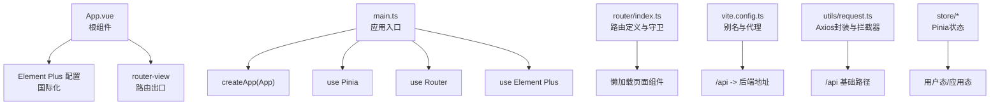
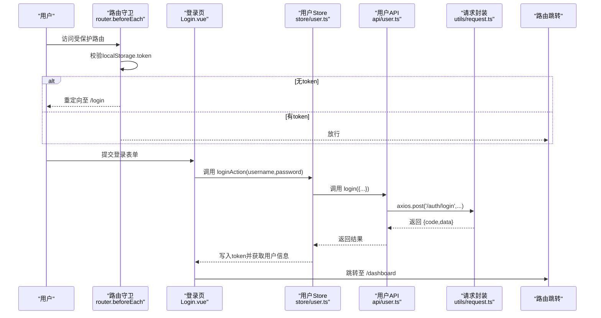
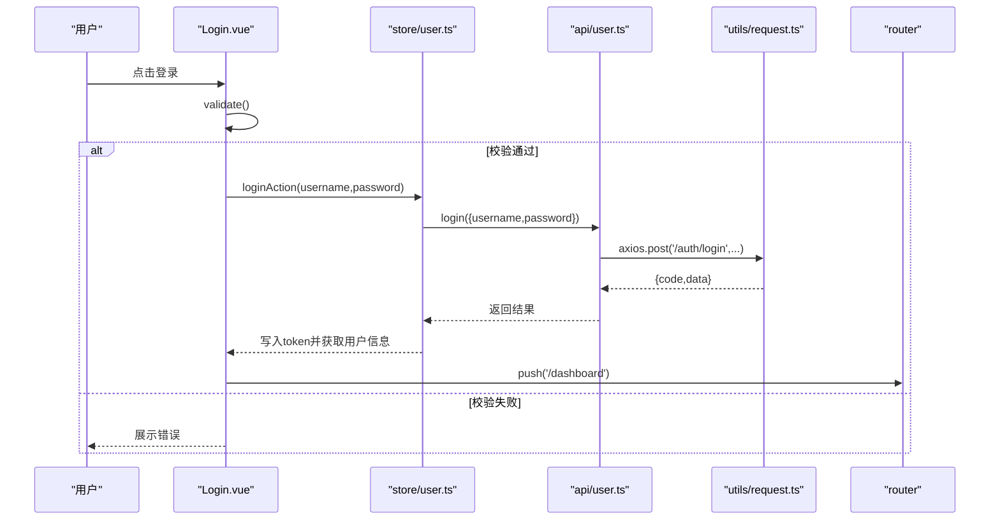
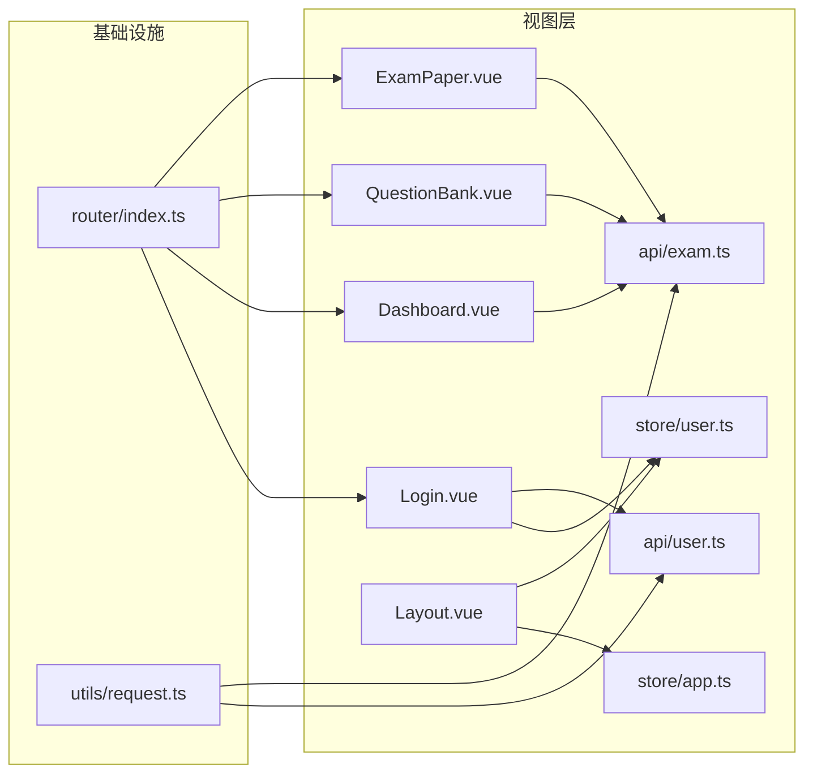

# 组件开发

<cite>
**本文引用的文件**
- [App.vue](file://frontend/src/App.vue)
- [main.ts](file://frontend/src/main.ts)
- [router/index.ts](file://frontend/src/router/index.ts)
- [package.json](file://frontend/package.json)
- [vite.config.ts](file://frontend/vite.config.ts)
- [Layout.vue](file://frontend/src/views/Layout.vue)
- [Dashboard.vue](file://frontend/src/views/Dashboard.vue)
- [Login.vue](file://frontend/src/views/Login.vue)
- [QuestionBank.vue](file://frontend/src/views/QuestionBank.vue)
- [ExamPaper.vue](file://frontend/src/views/ExamPaper.vue)
- [store/app.ts](file://frontend/src/store/app.ts)
- [store/user.ts](file://frontend/src/store/user.ts)
- [api/exam.ts](file://frontend/src/api/exam.ts)
- [api/user.ts](file://frontend/src/api/user.ts)
- [utils/request.ts](file://frontend/src/utils/request.ts)
</cite>

## 目录
1. [引言](#引言)
2. [项目结构](#项目结构)
3. [核心组件](#核心组件)
4. [架构总览](#架构总览)
5. [组件详解](#组件详解)
6. [依赖关系分析](#依赖关系分析)
7. [性能与优化](#性能与优化)
8. [故障排查指南](#故障排查指南)
9. [结论](#结论)
10. [附录](#附录)

## 引言
本文件面向前端开发者，系统性梳理基于 Vue 3 + Composition API 的组件开发方法论与最佳实践，覆盖响应式数据、计算属性与侦听器、页面组件开发规范、通用组件设计与复用策略（表单、表格、弹窗）、组件通信机制（父子、兄弟、跨层级），以及性能优化与故障排查建议。文档以实际仓库中的页面组件与基础设施为依据，提供可落地的指导。

## 项目结构
前端采用 Vite + Vue 3 + TypeScript + Pinia + Element Plus 技术栈，路由采用 vue-router，API 层通过 axios 封装统一请求与拦截器，状态管理使用 Pinia。页面组件集中在 views 目录，全局配置在 src 下，构建代理指向后端服务。

图示来源
- [App.vue:1-16](file://frontend/src/App.vue#L1-L16)
- [main.ts:1-21](file://frontend/src/main.ts#L1-L21)
- [router/index.ts:1-114](file://frontend/src/router/index.ts#L1-L114)
- [vite.config.ts:1-21](file://frontend/vite.config.ts#L1-L21)
- [utils/request.ts:1-53](file://frontend/src/utils/request.ts#L1-L53)

章节来源
- [package.json:1-25](file://frontend/package.json#L1-L25)
- [main.ts:1-21](file://frontend/src/main.ts#L1-L21)
- [router/index.ts:1-114](file://frontend/src/router/index.ts#L1-L114)
- [vite.config.ts:1-21](file://frontend/vite.config.ts#L1-L21)

## 核心组件
- 根组件与国际化：根组件包裹 Element Plus 并设置中文语言包，保证 UI 组件本地化一致。
- 应用入口：注册 Element Plus 图标、安装 Pinia、Router、Element Plus 插件，挂载应用。
- 路由系统：定义登录页与布局页，布局页内嵌子路由；全局前置守卫校验 token。
- 状态管理：用户态（token、用户信息）与应用态（侧边栏折叠、当前学科）。
- API 层：统一请求封装与拦截器，自动注入 Authorization 与租户头，集中处理鉴权失败跳转。

章节来源
- [App.vue:1-16](file://frontend/src/App.vue#L1-L16)
- [main.ts:1-21](file://frontend/src/main.ts#L1-L21)
- [router/index.ts:104-112](file://frontend/src/router/index.ts#L104-L112)
- [store/user.ts:1-44](file://frontend/src/store/user.ts#L1-L44)
- [store/app.ts:1-23](file://frontend/src/store/app.ts#L1-L23)
- [utils/request.ts:1-53](file://frontend/src/utils/request.ts#L1-L53)

## 架构总览
下图展示从入口到页面组件的数据流与交互链路，体现 Composition API 在页面中的典型用法：响应式数据、计算属性、生命周期钩子、事件处理与 API 调用。

图示来源
- [router/index.ts:104-112](file://frontend/src/router/index.ts#L104-L112)
- [Login.vue:108-122](file://frontend/src/views/Login.vue#L108-L122)
- [store/user.ts:24-31](file://frontend/src/store/user.ts#L24-L31)
- [api/user.ts:3-10](file://frontend/src/api/user.ts#L3-L10)
- [utils/request.ts:10-31](file://frontend/src/utils/request.ts#L10-L31)

## 组件详解

### 页面组件开发规范与Composition API实践
- 响应式数据
  - 使用 ref 定义本地状态（如 loading、dialog 显示控制、表单对象）。
  - 使用 reactive 定义复杂表单模型，便于与 Element Plus 表单校验结合。
- 计算属性
  - 使用 computed 对派生数据进行缓存与复用（如面包屑标题、用户信息 getter）。
- 生命周期与副作用
  - 使用 onMounted 触发首次数据加载；在异步操作中配合 v-loading 展示加载态。
- 事件处理
  - 统一在模板中绑定事件，避免在 setup 外部重复绑定；对确认类操作使用 ElMessageBox。
- 表单与校验
  - 结合 Element Plus Form 的 FormInstance.validate 实现提交前校验；rules 定义清晰的校验规则。
- API 调用
  - 通过 api/* 模块封装具体接口；在 utils/request.ts 中统一处理请求头与错误提示。

章节来源
- [Dashboard.vue:107-153](file://frontend/src/views/Dashboard.vue#L107-L153)
- [Login.vue:70-137](file://frontend/src/views/Login.vue#L70-L137)
- [QuestionBank.vue:80-168](file://frontend/src/views/QuestionBank.vue#L80-L168)
- [ExamPaper.vue:60-135](file://frontend/src/views/ExamPaper.vue#L60-L135)

### 通用组件设计与复用策略
- 表单组件
  - 设计：以 ref + reactive + FormRules 组合，支持新增/编辑切换、字段级校验、提交防抖。
  - 复用：将表单封装为可复用的弹窗卡片，通过 v-model 控制显示隐藏，通过事件或回调暴露提交逻辑。
- 表格组件
  - 设计：以 v-loading 包裹 el-table，列渲染通过作用域插槽实现标签映射与操作按钮。
  - 复用：将“查询条件 + 表格 + 分页”抽象为通用列表组件，通过 props 传入 API 方法与列配置。
- 弹窗组件
  - 设计：以 v-model 控制显隐，内部包含表单与操作按钮；确认删除等危险操作必须二次确认。
  - 复用：统一的 ElMessageBox 封装确认流程，减少重复代码。

章节来源
- [QuestionBank.vue:54-77](file://frontend/src/views/QuestionBank.vue#L54-L77)
- [ExamPaper.vue:39-57](file://frontend/src/views/ExamPaper.vue#L39-L57)
- [Login.vue:49-67](file://frontend/src/views/Login.vue#L49-L67)

### 组件通信机制
- 父子组件通信
  - 父传子：通过 props 传递只读数据（如学科映射、状态枚举）。
  - 子传父：通过 emits 或回调函数向上抛出事件，父组件负责刷新列表或关闭弹窗。
- 兄弟组件通信
  - 通过共同父组件协调；或通过全局状态（Pinia）共享临时状态（如当前选中行）。
- 跨层级通信
  - 通过 Pinia Store 共享应用态（如侧边栏折叠状态）；通过路由参数传递简单数据（如 bankId）。
- 事件与消息
  - 使用 ElMessage/ElMessageBox 统一提示与确认，提升一致性与可用性。

章节来源
- [Layout.vue:190-233](file://frontend/src/views/Layout.vue#L190-L233)
- [QuestionBank.vue:128-131](file://frontend/src/views/QuestionBank.vue#L128-L131)
- [store/app.ts:14-22](file://frontend/src/store/app.ts#L14-L22)

### 页面组件案例解析

#### 登录页（Login.vue）
- 响应式数据：登录表单、注册表单、加载状态、注册弹窗开关。
- 计算与校验：FormRules 定义必填规则；提交前 validate 校验。
- 事件处理：handleLogin 调用用户 Store 的登录动作，成功后跳转首页；handleRegister 调用注册接口。
- 状态与持久化：Store 写入 token 并缓存到 localStorage；路由守卫据此放行。

图示来源
- [Login.vue:108-122](file://frontend/src/views/Login.vue#L108-L122)
- [store/user.ts:24-31](file://frontend/src/store/user.ts#L24-L31)
- [api/user.ts:3-10](file://frontend/src/api/user.ts#L3-L10)
- [utils/request.ts:34-46](file://frontend/src/utils/request.ts#L34-L46)

章节来源
- [Login.vue:70-137](file://frontend/src/views/Login.vue#L70-L137)
- [store/user.ts:18-42](file://frontend/src/store/user.ts#L18-L42)
- [api/user.ts:1-25](file://frontend/src/api/user.ts#L1-L25)
- [utils/request.ts:10-51](file://frontend/src/utils/request.ts#L10-L51)

#### 仪表盘（Dashboard.vue）
- 响应式数据：统计聚合对象、最近试卷列表。
- 计算与映射：学科与状态的字典映射，用于表格列渲染。
- 生命周期：onMounted 加载试卷列表并统计数量，展示卡片与表格。
- 交互：点击按钮跳转对应功能页。

章节来源
- [Dashboard.vue:107-153](file://frontend/src/views/Dashboard.vue#L107-L153)

#### 题库管理（QuestionBank.vue）
- 响应式数据：题库列表、搜索学科、对话框状态、表单模型与校验规则。
- 事件处理：新增/编辑/删除、查看题目、保存表单。
- API 调用：按学科筛选或全量查询；创建/更新/删除题库；成功后刷新列表。

章节来源
- [QuestionBank.vue:80-168](file://frontend/src/views/QuestionBank.vue#L80-L168)

#### 试卷管理（ExamPaper.vue）
- 响应式数据：试卷列表、详情弹窗、当前试卷、状态与类型映射。
- 事件处理：查看详情、发布、删除；二次确认与消息提示。
- API 调用：获取列表、详情、发布、删除。

章节来源
- [ExamPaper.vue:60-135](file://frontend/src/views/ExamPaper.vue#L60-L135)

#### 布局与导航（Layout.vue）
- 响应式数据：侧边栏折叠状态、当前路由标题、用户真实姓名。
- 计算属性：activeMenu、currentRouteTitle。
- 事件处理：切换侧边栏、退出登录并跳转登录页。
- 状态共享：通过 useAppStore 与 useUserStore 管理应用态与用户态。

章节来源
- [Layout.vue:190-233](file://frontend/src/views/Layout.vue#L190-L233)
- [store/app.ts:14-22](file://frontend/src/store/app.ts#L14-L22)
- [store/user.ts:18-22](file://frontend/src/store/user.ts#L18-L22)

## 依赖关系分析
- 组件依赖
  - Login.vue 依赖 store/user.ts 与 api/user.ts；依赖 Element Plus 的表单、消息与对话框组件。
  - Dashboard.vue 依赖 api/exam.ts；依赖 Element Plus 的卡片、表格、标签组件。
  - QuestionBank.vue 与 ExamPaper.vue 依赖各自 API 模块与 Element Plus 组件。
- 状态依赖
  - Layout.vue 依赖 app.ts 与 user.ts；用于侧边栏状态与用户信息展示。
- 路由与守卫
  - router/index.ts 定义路由与全局前置守卫，确保未登录访问受保护路由被重定向。

图示来源
- [Login.vue:70-137](file://frontend/src/views/Login.vue#L70-L137)
- [Dashboard.vue:107-153](file://frontend/src/views/Dashboard.vue#L107-L153)
- [QuestionBank.vue:80-168](file://frontend/src/views/QuestionBank.vue#L80-L168)
- [ExamPaper.vue:60-135](file://frontend/src/views/ExamPaper.vue#L60-L135)
- [router/index.ts:1-114](file://frontend/src/router/index.ts#L1-L114)
- [utils/request.ts:1-53](file://frontend/src/utils/request.ts#L1-L53)

章节来源
- [router/index.ts:1-114](file://frontend/src/router/index.ts#L1-L114)
- [utils/request.ts:1-53](file://frontend/src/utils/request.ts#L1-L53)

## 性能与优化
- 渲染优化
  - 列表渲染使用 v-loading 展示加载态，避免空白闪烁；表格列使用作用域插槽减少重复逻辑。
  - 使用 Element Plus 的虚拟滚动组件（如需大数据量）降低 DOM 压力。
- 状态与计算
  - 将稳定映射（学科、状态）定义为常量或计算属性，避免重复计算。
  - 将频繁变更的 UI 状态（如弹窗显隐）放入局部 ref，减少全局状态抖动。
- 请求与缓存
  - 在 utils/request.ts 中统一设置超时与错误提示，减少重复错误处理。
  - 对于高频查询，考虑在组件内做轻量缓存或节流/防抖。
- 路由与懒加载
  - 路由组件采用动态导入，减少首屏体积；路由守卫仅做必要校验。
- 图标与主题
  - 仅注册需要的 Element Plus 图标，避免引入过多资源。

[本节为通用建议，不直接分析具体文件]

## 故障排查指南
- 登录失败或跳转登录页
  - 检查 utils/request.ts 的响应拦截器是否正确处理 401；确认 localStorage 中 token 是否存在。
- 接口调用异常
  - 检查 vite.config.ts 的代理配置是否正确指向后端；确认 utils/request.ts 的 baseURL 与后端路径一致。
- 表单校验不生效
  - 确认 Element Plus Form 的 ref 与 model 绑定一致；校验规则与字段名匹配。
- 侧边栏状态不同步
  - 确认 Layout.vue 中使用的 appStore 是否正确；检查 store/app.ts 的 actions 是否被调用。

章节来源
- [utils/request.ts:34-51](file://frontend/src/utils/request.ts#L34-L51)
- [router/index.ts:104-112](file://frontend/src/router/index.ts#L104-L112)
- [vite.config.ts:14-20](file://frontend/vite.config.ts#L14-L20)
- [store/app.ts:14-22](file://frontend/src/store/app.ts#L14-L22)

## 结论
本项目以 Vue 3 Composition API 为核心，结合 Pinia 状态管理与 Element Plus UI 组件，形成了清晰的页面组件开发范式。通过统一的 API 封装与路由守卫，实现了良好的用户体验与可维护性。建议在后续迭代中进一步抽象通用列表与表单组件，完善错误边界与加载策略，并持续优化交互细节与性能表现。

## 附录
- 开发环境
  - 使用 Vite + TypeScript + Vue 3 + Pinia + Element Plus。
  - 本地开发服务器端口 3000，/api 代理至后端 8080。
- 关键文件清单
  - 入口与配置：[main.ts](file://frontend/src/main.ts)、[App.vue](file://frontend/src/App.vue)、[vite.config.ts](file://frontend/vite.config.ts)、[router/index.ts](file://frontend/src/router/index.ts)
  - 状态管理：[store/user.ts](file://frontend/src/store/user.ts)、[store/app.ts](file://frontend/src/store/app.ts)
  - API 封装：[utils/request.ts](file://frontend/src/utils/request.ts)、[api/user.ts](file://frontend/src/api/user.ts)、[api/exam.ts](file://frontend/src/api/exam.ts)
  - 页面组件：[Login.vue](file://frontend/src/views/Login.vue)、[Dashboard.vue](file://frontend/src/views/Dashboard.vue)、[Layout.vue](file://frontend/src/views/Layout.vue)、[QuestionBank.vue](file://frontend/src/views/QuestionBank.vue)、[ExamPaper.vue](file://frontend/src/views/ExamPaper.vue)