# 路由系统

<cite>
**本文档引用的文件**
- [frontend/src/router/index.ts](file://frontend/src/router/index.ts)
- [frontend/src/main.ts](file://frontend/src/main.ts)
- [frontend/src/views/Layout.vue](file://frontend/src/views/Layout.vue)
- [frontend/src/views/Login.vue](file://frontend/src/views/Login.vue)
- [frontend/src/views/Dashboard.vue](file://frontend/src/views/Dashboard.vue)
- [frontend/src/views/ExamGenerate.vue](file://frontend/src/views/ExamGenerate.vue)
- [frontend/src/views/Grading.vue](file://frontend/src/views/Grading.vue)
- [frontend/src/store/user.ts](file://frontend/src/store/user.ts)
- [frontend/src/store/app.ts](file://frontend/src/store/app.ts)
- [frontend/src/utils/request.ts](file://frontend/src/utils/request.ts)
- [frontend/package.json](file://frontend/package.json)
- [frontend/vite.config.ts](file://frontend/vite.config.ts)
- [frontend/src/App.vue](file://frontend/src/App.vue)
</cite>

## 目录
1. [简介](#简介)
2. [项目结构](#项目结构)
3. [核心组件](#核心组件)
4. [架构概览](#架构概览)
5. [详细组件分析](#详细组件分析)
6. [依赖关系分析](#依赖关系分析)
7. [性能考虑](#性能考虑)
8. [故障排除指南](#故障排除指南)
9. [结论](#结论)

## 简介

本项目采用Vue 3 + Vue Router 4构建的单页应用路由系统，实现了完整的认证授权、嵌套路由管理和页面布局设计。系统基于Element Plus组件库，提供了现代化的教师智能教学平台界面，支持题库管理、试卷生成、批改分析、学生成绩管理等核心功能模块。

## 项目结构

前端路由系统主要由以下核心文件组成：

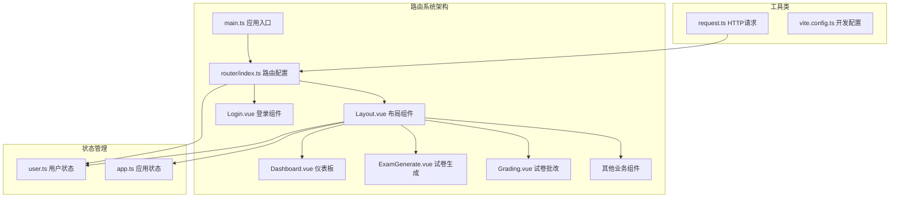

**图表来源**
- [frontend/src/main.ts:1-21](file://frontend/src/main.ts#L1-L21)
- [frontend/src/router/index.ts:1-114](file://frontend/src/router/index.ts#L1-L114)

**章节来源**
- [frontend/src/main.ts:1-21](file://frontend/src/main.ts#L1-L21)
- [frontend/src/router/index.ts:1-114](file://frontend/src/router/index.ts#L1-L114)
- [frontend/package.json:1-25](file://frontend/package.json#L1-L25)

## 核心组件

### 路由配置系统

路由系统采用Vue Router 4的声明式路由配置，支持嵌套路由和动态路由加载：

```mermaid
classDiagram
class RouterConfig {
+routes : RouteRecordRaw[]
+history : createWebHistory()
+beforeEach(to, from, next)
}
class LayoutRoutes {
+path : '/'
+name : 'Layout'
+component : Layout.vue
+redirect : '/dashboard'
+children : RouteRecordRaw[]
}
class LoginRoute {
+path : '/login'
+name : 'Login'
+component : Login.vue
+meta : { title : '登录' }
}
class DashboardRoute {
+path : 'dashboard'
+name : 'Dashboard'
+component : Dashboard.vue
+meta : { title : '首页' }
}
RouterConfig --> LayoutRoutes
RouterConfig --> LoginRoute
LayoutRoutes --> DashboardRoute
```

**图表来源**
- [frontend/src/router/index.ts:4-97](file://frontend/src/router/index.ts#L4-L97)

### 页面布局组件

Layout.vue作为核心布局组件，实现了完整的页面结构设计：

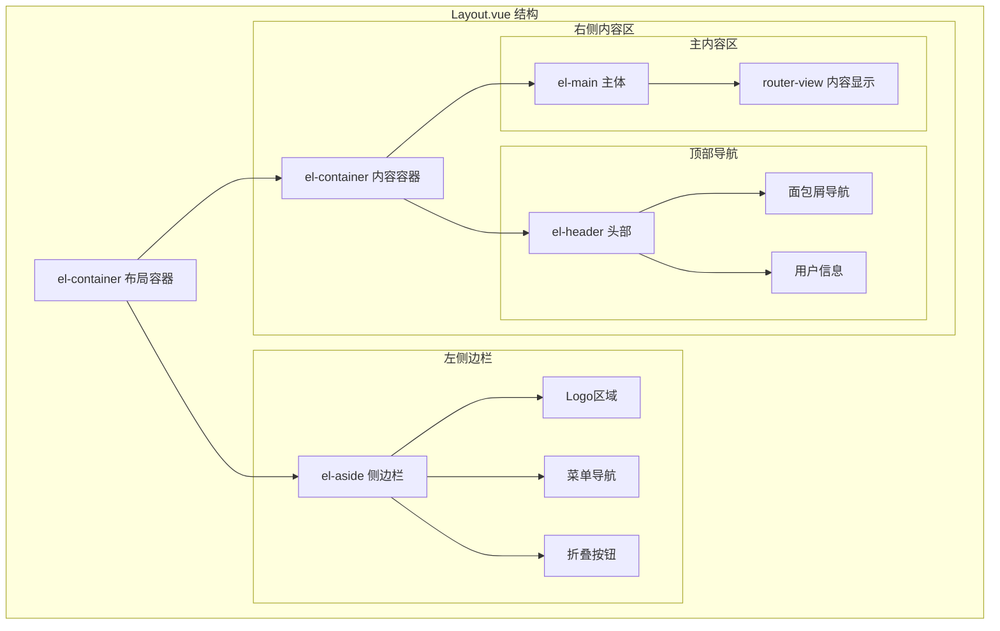

**图表来源**
- [frontend/src/views/Layout.vue:1-188](file://frontend/src/views/Layout.vue#L1-L188)

**章节来源**
- [frontend/src/router/index.ts:1-114](file://frontend/src/router/index.ts#L1-L114)
- [frontend/src/views/Layout.vue:1-497](file://frontend/src/views/Layout.vue#L1-L497)

## 架构概览

### 路由系统整体架构

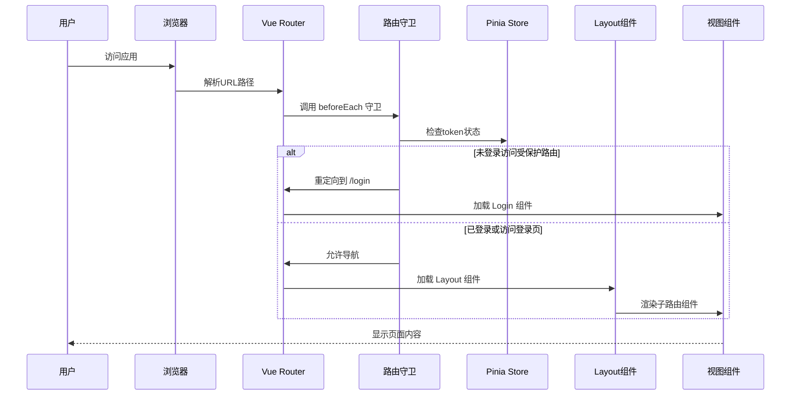

**图表来源**
- [frontend/src/router/index.ts:104-112](file://frontend/src/router/index.ts#L104-L112)
- [frontend/src/store/user.ts:12-44](file://frontend/src/store/user.ts#L12-L44)

### 路由守卫实现

系统实现了全局前置守卫，用于统一的权限验证和导航控制：

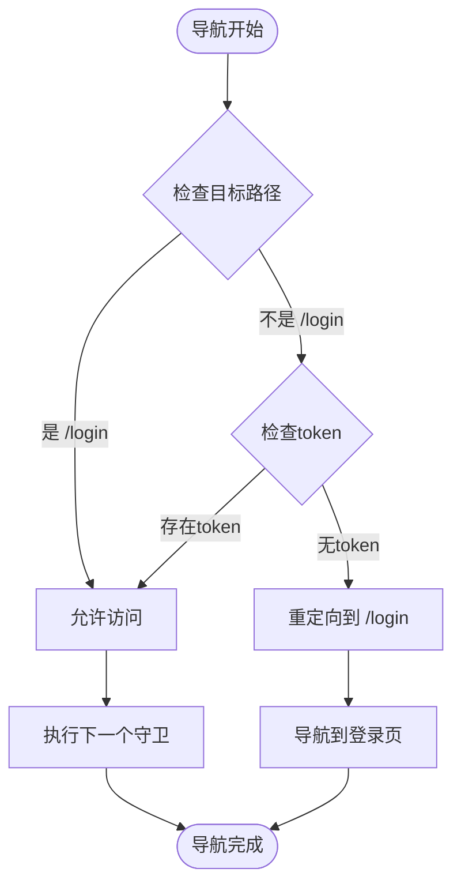

**图表来源**
- [frontend/src/router/index.ts:105-112](file://frontend/src/router/index.ts#L105-L112)

**章节来源**
- [frontend/src/router/index.ts:104-112](file://frontend/src/router/index.ts#L104-L112)
- [frontend/src/utils/request.ts:34-51](file://frontend/src/utils/request.ts#L34-L51)

## 详细组件分析

### 路由配置详解

#### 嵌套路由结构

系统采用嵌套路由设计，根路由指向Layout组件，所有业务路由作为子路由：

```mermaid
graph LR
subgraph "根路由"
A[/ 根路径]
end
subgraph "Layout 布局"
B[Layout.vue]
C[Dashboard 仪表板]
D[QuestionBank 题库管理]
E[Question 题目管理]
F[ExamTemplate 试卷模板]
G[ExamPaper 试卷管理]
H[ExamGenerate 试卷生成]
I[Grading 试卷批改]
J[ScoreAnalysis 成绩分析]
K[WrongQuestions 错题记录]
L[StudentProfile 学生画像]
M[PptMaker PPT制作]
N[UserManage 用户管理]
O[ClassManage 班级管理]
end
A --> B
B --> C
B --> D
B --> E
B --> F
B --> G
B --> H
B --> I
B --> J
B --> K
B --> L
B --> M
B --> N
B --> O
```

**图表来源**
- [frontend/src/router/index.ts:16-95](file://frontend/src/router/index.ts#L16-L95)

#### 动态路由加载

所有路由组件都采用动态导入实现懒加载：

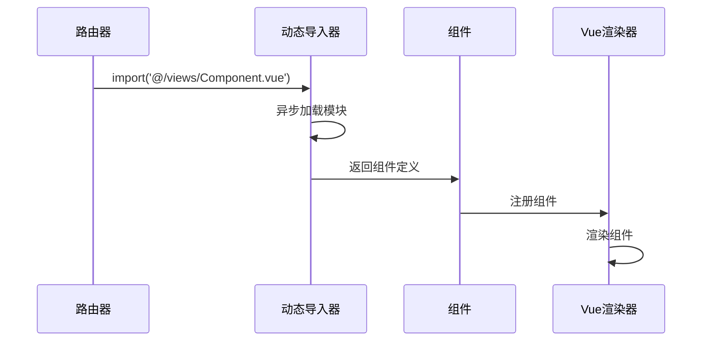

**图表来源**
- [frontend/src/router/index.ts:8-87](file://frontend/src/router/index.ts#L8-L87)

**章节来源**
- [frontend/src/router/index.ts:4-97](file://frontend/src/router/index.ts#L4-L97)

### 页面布局组件设计

#### 侧边栏导航系统

Layout.vue实现了响应式的侧边栏导航，支持折叠功能：

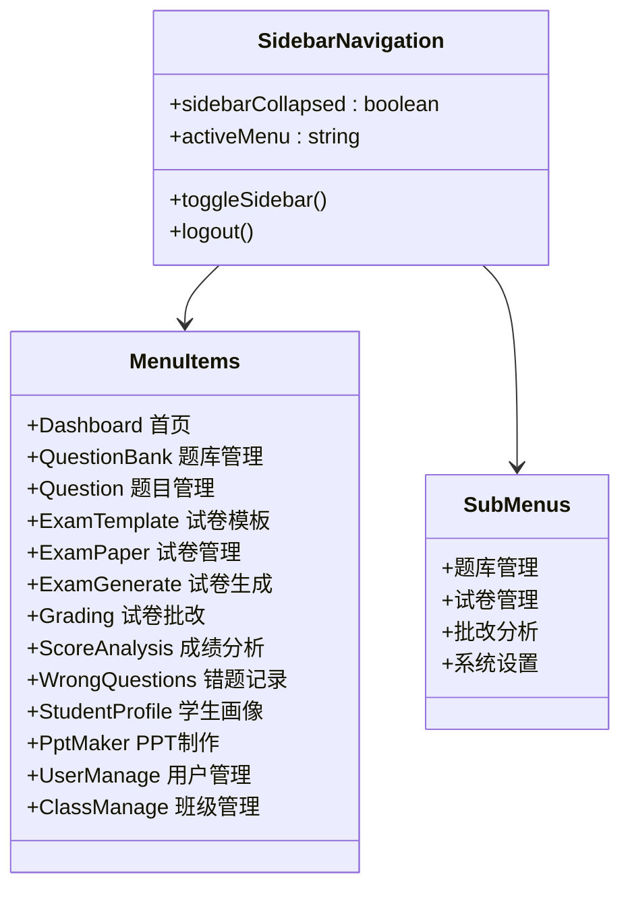

**图表来源**
- [frontend/src/views/Layout.vue:18-119](file://frontend/src/views/Layout.vue#L18-L119)

#### 顶部导航设计

顶部导航包含了面包屑导航、快捷操作和用户信息：

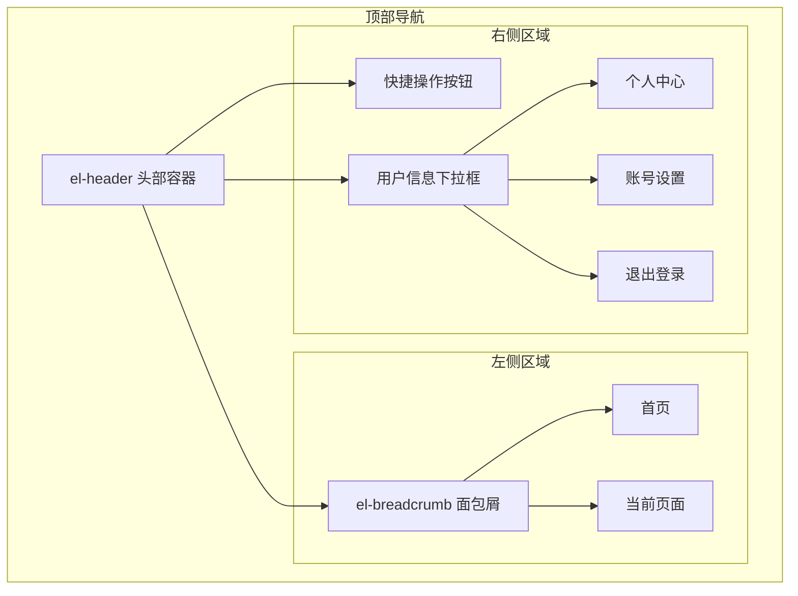

**图表来源**
- [frontend/src/views/Layout.vue:139-176](file://frontend/src/views/Layout.vue#L139-L176)

**章节来源**
- [frontend/src/views/Layout.vue:1-497](file://frontend/src/views/Layout.vue#L1-L497)

### 路由守卫实现

#### 全局前置守卫

系统实现了统一的路由守卫，确保只有认证用户才能访问受保护路由：

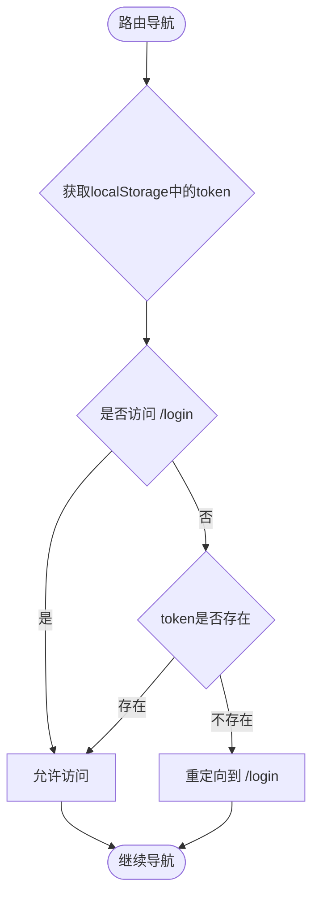

**图表来源**
- [frontend/src/router/index.ts:105-112](file://frontend/src/router/index.ts#L105-L112)

#### HTTP拦截器集成

HTTP请求拦截器与路由守卫协同工作，处理认证状态：

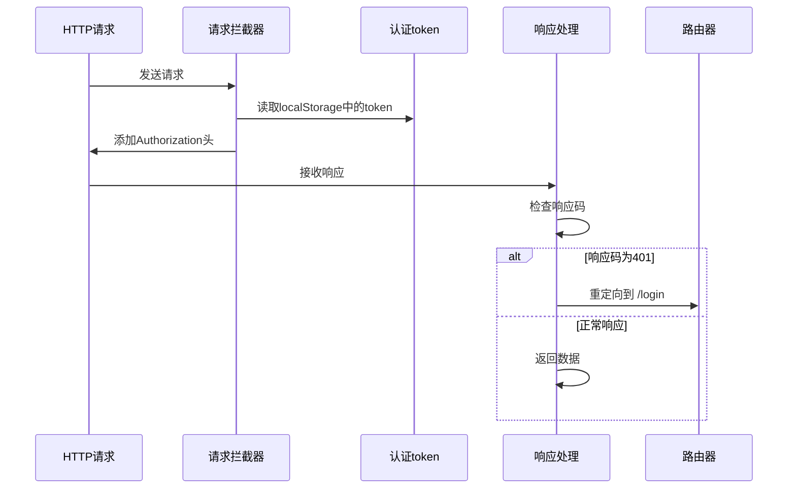

**图表来源**
- [frontend/src/utils/request.ts:11-31](file://frontend/src/utils/request.ts#L11-L31)
- [frontend/src/utils/request.ts:34-51](file://frontend/src/utils/request.ts#L34-L51)

**章节来源**
- [frontend/src/router/index.ts:104-112](file://frontend/src/router/index.ts#L104-L112)
- [frontend/src/utils/request.ts:1-53](file://frontend/src/utils/request.ts#L1-L53)

### 路由懒加载实现

#### 性能优化策略

系统采用多种策略优化路由加载性能：

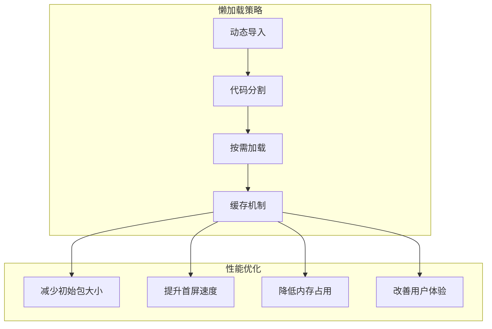

**图表来源**
- [frontend/src/router/index.ts:8-87](file://frontend/src/router/index.ts#L8-L87)

**章节来源**
- [frontend/src/router/index.ts:1-114](file://frontend/src/router/index.ts#L1-L114)

## 依赖关系分析

### 技术栈依赖

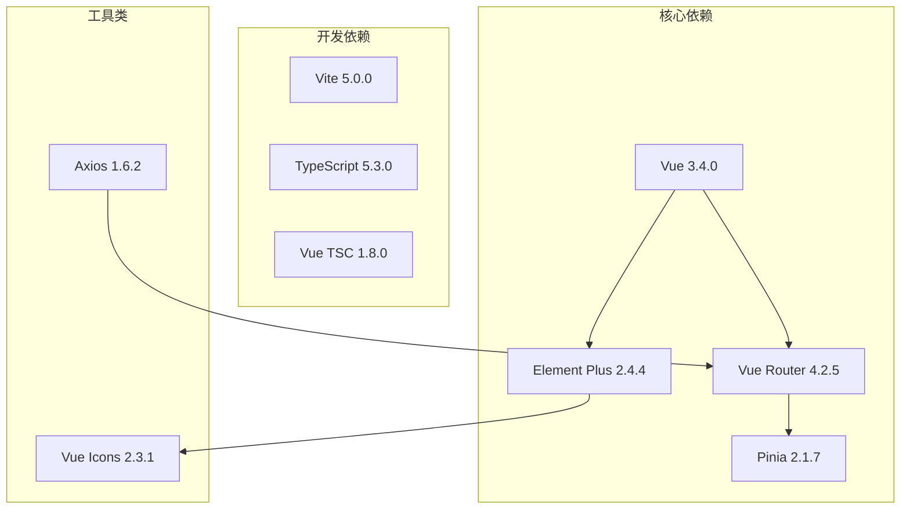

**图表来源**
- [frontend/package.json:11-24](file://frontend/package.json#L11-L24)

### 状态管理集成

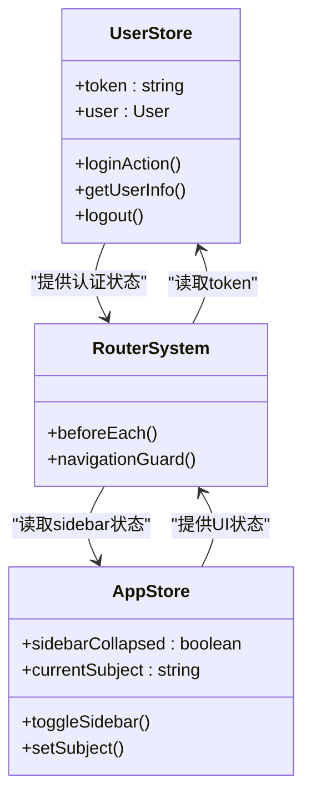

**图表来源**
- [frontend/src/store/user.ts:12-44](file://frontend/src/store/user.ts#L12-L44)
- [frontend/src/store/app.ts:8-23](file://frontend/src/store/app.ts#L8-L23)
- [frontend/src/router/index.ts:104-112](file://frontend/src/router/index.ts#L104-L112)

**章节来源**
- [frontend/package.json:1-25](file://frontend/package.json#L1-L25)
- [frontend/src/store/user.ts:1-44](file://frontend/src/store/user.ts#L1-L44)
- [frontend/src/store/app.ts:1-23](file://frontend/src/store/app.ts#L1-L23)

## 性能考虑

### 路由懒加载优化

1. **代码分割**: 使用动态导入实现按需加载，减少初始包体积
2. **缓存策略**: 浏览器自动缓存已加载的模块
3. **预加载**: 可以在用户可能访问的路由上实现预加载
4. **路由级别缓存**: 对于频繁访问的页面可以考虑缓存策略

### 内存管理

1. **组件卸载**: 确保路由切换时正确销毁组件实例
2. **事件监听**: 在组件卸载时移除事件监听器
3. **定时器清理**: 清理定时器和异步操作

### 网络优化

1. **HTTP缓存**: 利用浏览器缓存机制
2. **请求合并**: 合理设计API调用策略
3. **错误重试**: 实现合理的错误处理和重试机制

## 故障排除指南

### 常见问题及解决方案

#### 登录状态异常

**问题**: 用户已登录但仍被重定向到登录页

**解决方案**:
1. 检查localStorage中的token是否有效
2. 验证后端JWT token的过期时间
3. 确认HTTP拦截器正确添加Authorization头

#### 路由跳转失效

**问题**: 调用router.push无效

**解决方案**:
1. 确保在setup函数中使用useRouter
2. 检查路由配置中的path是否正确
3. 验证组件是否正确注册到路由系统

#### 布局显示异常

**问题**: 侧边栏或头部显示不正常

**解决方案**:
1. 检查CSS样式是否正确加载
2. 验证Element Plus组件的版本兼容性
3. 确认响应式断点设置

**章节来源**
- [frontend/src/router/index.ts:104-112](file://frontend/src/router/index.ts#L104-L112)
- [frontend/src/utils/request.ts:34-51](file://frontend/src/utils/request.ts#L34-L51)

## 结论

本路由系统通过精心设计的架构实现了以下目标：

1. **模块化设计**: 清晰的路由层次结构和组件分离
2. **性能优化**: 懒加载和代码分割策略
3. **用户体验**: 流畅的导航体验和响应式布局
4. **安全性**: 统一的认证授权机制
5. **可维护性**: 标准化的代码结构和最佳实践

系统支持完整的教学管理功能，包括题库管理、试卷生成、批改分析等核心业务模块，为教师提供了高效的教学辅助工具。通过合理的架构设计和性能优化，确保了良好的用户体验和系统的可扩展性。