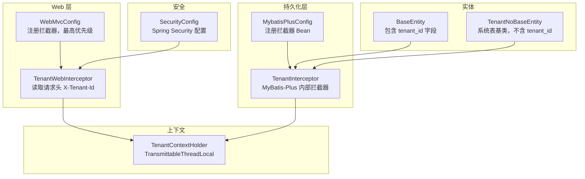
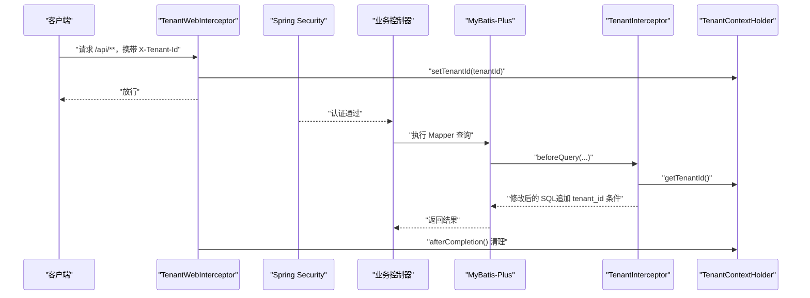
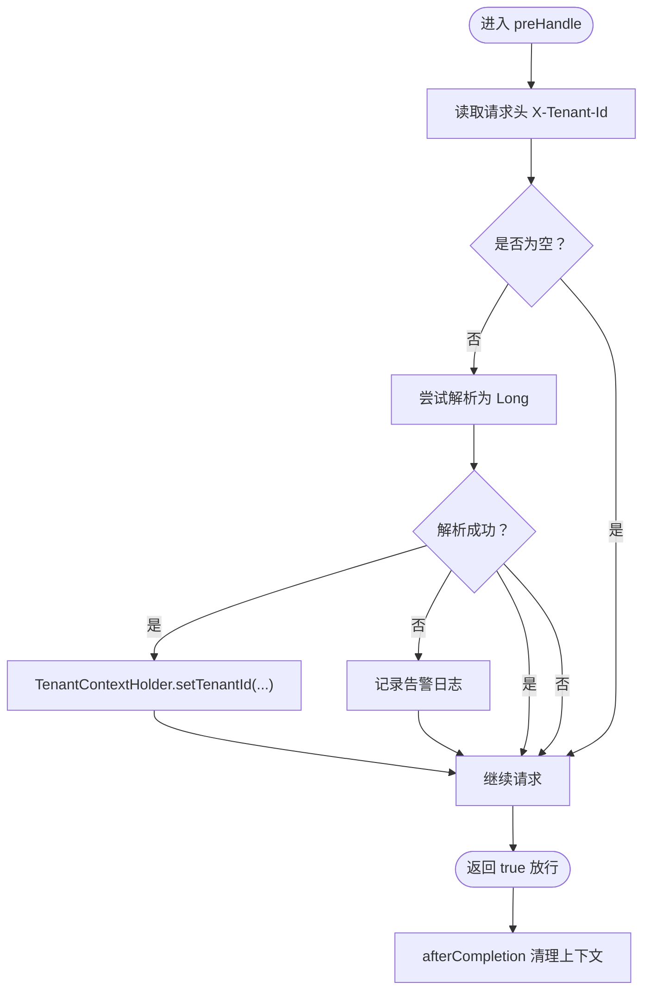
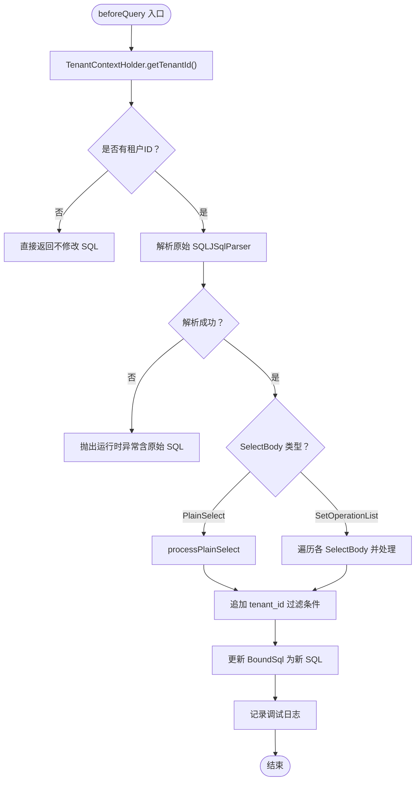
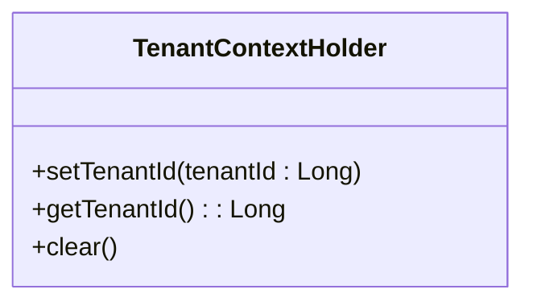
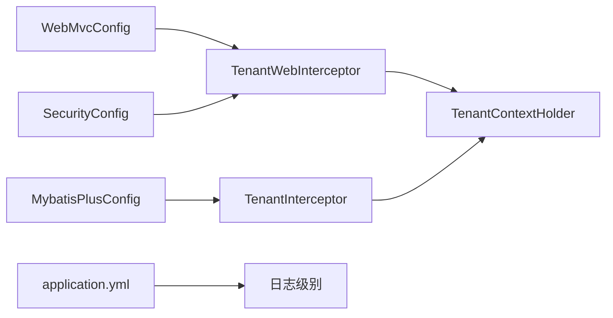

# 多租户拦截器

<cite>
**本文引用的文件**
- [TenantInterceptor.java](file://backend/src/main/java/com/edu/common/interceptor/TenantInterceptor.java)
- [TenantWebInterceptor.java](file://backend/src/main/java/com/edu/common/interceptor/TenantWebInterceptor.java)
- [TenantContextHolder.java](file://backend/src/main/java/com/edu/common/util/TenantContextHolder.java)
- [WebMvcConfig.java](file://backend/src/main/java/com/edu/common/config/WebMvcConfig.java)
- [MybatisPlusConfig.java](file://backend/src/main/java/com/edu/common/config/MybatisPlusConfig.java)
- [SecurityConfig.java](file://backend/src/main/java/com/edu/common/config/SecurityConfig.java)
- [BaseEntity.java](file://backend/src/main/java/com/edu/common/entity/BaseEntity.java)
- [TenantNoBaseEntity.java](file://backend/src/main/java/com/edu/common/entity/TenantNoBaseEntity.java)
- [TenantInterceptorTest.java](file://backend/src/test/java/com/edu/common/interceptor/TenantInterceptorTest.java)
- [TenantContextHolderTest.java](file://backend/src/test/java/com/edu/common/util/TenantContextHolderTest.java)
- [application.yml](file://backend/src/main/resources/application.yml)
</cite>

## 目录
1. [简介](#简介)
2. [项目结构](#项目结构)
3. [核心组件](#核心组件)
4. [架构总览](#架构总览)
5. [详细组件分析](#详细组件分析)
6. [依赖分析](#依赖分析)
7. [性能考虑](#性能考虑)
8. [故障排查指南](#故障排查指南)
9. [结论](#结论)
10. [附录](#附录)

## 简介
本文件系统性阐述本项目的多租户拦截器机制，重点覆盖以下方面：
- 请求拦截与租户识别：Web 层通过请求头注入租户上下文，持久化层在 SQL 查询前自动追加租户过滤条件。
- 上下文传递：基于 TransmittableThreadLocal 的线程安全上下文存储与跨线程传播。
- 数据隔离策略：通过 MyBatis-Plus 内置拦截器对 SQL 进行租户过滤；对特定“豁免表”进行例外处理；实体基类统一承载租户标识。
- 执行顺序与优先级：Web 拦截器最高优先级，确保在业务控制器与数据访问之前完成上下文设置；与 Spring Security 的集成点明确。
- 配置与调试：拦截器注册、日志级别、测试用例与验证要点。

## 项目结构
围绕多租户拦截器的相关模块分布如下：
- Web 层拦截器：负责从请求头读取租户 ID 并写入上下文。
- 持久化层拦截器：解析 SQL，自动追加租户过滤条件。
- 上下文工具：提供线程安全的租户 ID 存储与清理。
- 配置类：注册 Web 拦截器与 MyBatis-Plus 拦截器。
- 实体基类：统一承载租户字段，系统表实体不参与租户字段填充。
- 测试：验证 SQL 过滤、豁免表、异常路径与线程传播。

图表来源
- [TenantWebInterceptor.java:1-42](file://backend/src/main/java/com/edu/common/interceptor/TenantWebInterceptor.java#L1-L42)
- [WebMvcConfig.java:1-24](file://backend/src/main/java/com/edu/common/config/WebMvcConfig.java#L1-L24)
- [TenantInterceptor.java:1-142](file://backend/src/main/java/com/edu/common/interceptor/TenantInterceptor.java#L1-L142)
- [MybatisPlusConfig.java:1-23](file://backend/src/main/java/com/edu/common/config/MybatisPlusConfig.java#L1-L23)
- [TenantContextHolder.java:1-24](file://backend/src/main/java/com/edu/common/util/TenantContextHolder.java#L1-L24)
- [SecurityConfig.java:1-50](file://backend/src/main/java/com/edu/common/config/SecurityConfig.java#L1-L50)
- [BaseEntity.java:1-38](file://backend/src/main/java/com/edu/common/entity/BaseEntity.java#L1-L38)
- [TenantNoBaseEntity.java:1-23](file://backend/src/main/java/com/edu/common/entity/TenantNoBaseEntity.java#L1-L23)

章节来源
- [TenantWebInterceptor.java:1-42](file://backend/src/main/java/com/edu/common/interceptor/TenantWebInterceptor.java#L1-L42)
- [WebMvcConfig.java:1-24](file://backend/src/main/java/com/edu/common/config/WebMvcConfig.java#L1-L24)
- [TenantInterceptor.java:1-142](file://backend/src/main/java/com/edu/common/interceptor/TenantInterceptor.java#L1-L142)
- [MybatisPlusConfig.java:1-23](file://backend/src/main/java/com/edu/common/config/MybatisPlusConfig.java#L1-L23)
- [TenantContextHolder.java:1-24](file://backend/src/main/java/com/edu/common/util/TenantContextHolder.java#L1-L24)
- [SecurityConfig.java:1-50](file://backend/src/main/java/com/edu/common/config/SecurityConfig.java#L1-L50)
- [BaseEntity.java:1-38](file://backend/src/main/java/com/edu/common/entity/BaseEntity.java#L1-L38)
- [TenantNoBaseEntity.java:1-23](file://backend/src/main/java/com/edu/common/entity/TenantNoBaseEntity.java#L1-L23)

## 核心组件
- TenantWebInterceptor：从请求头 X-Tenant-Id 读取租户 ID，写入 TenantContextHolder；请求完成后清理上下文。
- TenantInterceptor：MyBatis-Plus 内部拦截器，在查询执行前解析 SQL，自动追加 tenant_id 过滤条件；支持 UNION 等集合操作；对“豁免表”跳过过滤。
- TenantContextHolder：基于 TransmittableThreadLocal 的线程上下文持有者，支持父子线程传播。
- WebMvcConfig：注册 TenantWebInterceptor，设置最高优先级，拦截 /api/** 路径。
- MybatisPlusConfig：注册 MyBatis-Plus 拦截器 Bean，注入 TenantInterceptor。
- 实体基类：BaseEntity 统一包含 tenant_id 字段；系统表实体继承 TenantNoBaseEntity，不包含 tenant_id。

章节来源
- [TenantWebInterceptor.java:1-42](file://backend/src/main/java/com/edu/common/interceptor/TenantWebInterceptor.java#L1-L42)
- [TenantInterceptor.java:1-142](file://backend/src/main/java/com/edu/common/interceptor/TenantInterceptor.java#L1-L142)
- [TenantContextHolder.java:1-24](file://backend/src/main/java/com/edu/common/util/TenantContextHolder.java#L1-L24)
- [WebMvcConfig.java:1-24](file://backend/src/main/java/com/edu/common/config/WebMvcConfig.java#L1-L24)
- [MybatisPlusConfig.java:1-23](file://backend/src/main/java/com/edu/common/config/MybatisPlusConfig.java#L1-L23)
- [BaseEntity.java:1-38](file://backend/src/main/java/com/edu/common/entity/BaseEntity.java#L1-L38)
- [TenantNoBaseEntity.java:1-23](file://backend/src/main/java/com/edu/common/entity/TenantNoBaseEntity.java#L1-L23)

## 架构总览
多租户拦截器的执行链路如下：
- Web 层：TenantWebInterceptor 在进入控制器前从请求头读取租户 ID，写入上下文。
- 安全层：Spring Security 在认证后放行到控制器。
- 数据层：TenantInterceptor 在 MyBatis-Plus 执行前解析 SQL，追加租户过滤条件。
- 上下文：TenantContextHolder 提供线程安全的租户 ID 存储与跨线程传播。

图表来源
- [TenantWebInterceptor.java:19-41](file://backend/src/main/java/com/edu/common/interceptor/TenantWebInterceptor.java#L19-L41)
- [WebMvcConfig.java:18-23](file://backend/src/main/java/com/edu/common/config/WebMvcConfig.java#L18-L23)
- [MybatisPlusConfig.java:16-21](file://backend/src/main/java/com/edu/common/config/MybatisPlusConfig.java#L16-L21)
- [TenantInterceptor.java:66-95](file://backend/src/main/java/com/edu/common/interceptor/TenantInterceptor.java#L66-L95)
- [TenantContextHolder.java:10-22](file://backend/src/main/java/com/edu/common/util/TenantContextHolder.java#L10-L22)
- [SecurityConfig.java:27-43](file://backend/src/main/java/com/edu/common/config/SecurityConfig.java#L27-L43)

## 详细组件分析

### TenantWebInterceptor 分析
- 请求头读取：从 X-Tenant-Id 获取租户 ID，转换为 Long 后写入上下文。
- 异常处理：非法格式记录告警日志，不影响后续流程。
- 生命周期：preHandle 设置上下文，afterCompletion 清理，避免线程泄漏。
- 优先级：在 WebMvcConfig 中设置 order(0)，确保最先执行。

图表来源
- [TenantWebInterceptor.java:19-41](file://backend/src/main/java/com/edu/common/interceptor/TenantWebInterceptor.java#L19-L41)

章节来源
- [TenantWebInterceptor.java:1-42](file://backend/src/main/java/com/edu/common/interceptor/TenantWebInterceptor.java#L1-L42)
- [WebMvcConfig.java:18-23](file://backend/src/main/java/com/edu/common/config/WebMvcConfig.java#L18-L23)

### TenantInterceptor 分析
- 触发时机：MyBatis-Plus 内部拦截器 beforeQuery 钩子。
- 上下文读取：从 TenantContextHolder 获取当前租户 ID。
- SQL 解析：使用 JSqlParser 解析原始 SQL，支持 PlainSelect 与 SetOperationList（如 UNION）。
- 过滤追加：若存在 WHERE 条件则以 AND 连接，否则直接设置 WHERE。
- 豁免表：内置默认豁免表集合，支持自定义扩展；从 FROM 子句提取真实表名并去别名判断。
- 错误处理：解析失败抛出运行时异常，消息包含原始 SQL，便于定位问题。

图表来源
- [TenantInterceptor.java:66-95](file://backend/src/main/java/com/edu/common/interceptor/TenantInterceptor.java#L66-L95)
- [TenantInterceptor.java:97-122](file://backend/src/main/java/com/edu/common/interceptor/TenantInterceptor.java#L97-L122)
- [TenantInterceptor.java:124-140](file://backend/src/main/java/com/edu/common/interceptor/TenantInterceptor.java#L124-L140)

章节来源
- [TenantInterceptor.java:1-142](file://backend/src/main/java/com/edu/common/interceptor/TenantInterceptor.java#L1-L142)

### TenantContextHolder 分析
- 存储结构：使用 TransmittableThreadLocal，支持父子线程间上下文传播。
- 方法接口：setTenantId、getTenantId、clear。
- 线程安全：每个线程独立副本，避免并发污染。
- 测试验证：提供跨线程传播的单元测试，确保异步场景可用。

图表来源
- [TenantContextHolder.java:8-23](file://backend/src/main/java/com/edu/common/util/TenantContextHolder.java#L8-L23)

章节来源
- [TenantContextHolder.java:1-24](file://backend/src/main/java/com/edu/common/util/TenantContextHolder.java#L1-L24)
- [TenantContextHolderTest.java:34-46](file://backend/src/test/java/com/edu/common/util/TenantContextHolderTest.java#L34-L46)

### 实体与数据隔离策略
- BaseEntity：统一包含 tenant_id 字段，配合拦截器实现自动过滤。
- TenantNoBaseEntity：系统表实体基类，不包含 tenant_id，避免冗余字段。
- 豁免表策略：在 TenantInterceptor 中维护默认豁免表集合，涵盖租户表、权限表、学校/班级/年级等关联表，减少不必要的过滤开销与复杂度。

章节来源
- [BaseEntity.java:10-38](file://backend/src/main/java/com/edu/common/entity/BaseEntity.java#L10-L38)
- [TenantNoBaseEntity.java:10-23](file://backend/src/main/java/com/edu/common/entity/TenantNoBaseEntity.java#L10-L23)
- [TenantInterceptor.java:31-51](file://backend/src/main/java/com/edu/common/interceptor/TenantInterceptor.java#L31-L51)

## 依赖分析
- Web 层依赖：TenantWebInterceptor 依赖 TenantContextHolder；WebMvcConfig 注册拦截器并设置最高优先级。
- 持久化层依赖：TenantInterceptor 依赖 TenantContextHolder；MybatisPlusConfig 注册拦截器 Bean。
- 安全层依赖：SecurityConfig 配置 Spring Security，与 JWT 过滤器集成，保证认证通过后再进入拦截器链。
- 日志与配置：application.yml 设置日志级别，便于调试多租户拦截器行为。

图表来源
- [WebMvcConfig.java:16-23](file://backend/src/main/java/com/edu/common/config/WebMvcConfig.java#L16-L23)
- [MybatisPlusConfig.java:16-21](file://backend/src/main/java/com/edu/common/config/MybatisPlusConfig.java#L16-L21)
- [TenantWebInterceptor.java:20-34](file://backend/src/main/java/com/edu/common/interceptor/TenantWebInterceptor.java#L20-L34)
- [TenantInterceptor.java:69-95](file://backend/src/main/java/com/edu/common/interceptor/TenantInterceptor.java#L69-L95)
- [SecurityConfig.java:27-43](file://backend/src/main/java/com/edu/common/config/SecurityConfig.java#L27-L43)
- [application.yml:61-65](file://backend/src/main/resources/application.yml#L61-L65)

章节来源
- [WebMvcConfig.java:1-24](file://backend/src/main/java/com/edu/common/config/WebMvcConfig.java#L1-L24)
- [MybatisPlusConfig.java:1-23](file://backend/src/main/java/com/edu/common/config/MybatisPlusConfig.java#L1-L23)
- [TenantWebInterceptor.java:1-42](file://backend/src/main/java/com/edu/common/interceptor/TenantWebInterceptor.java#L1-L42)
- [TenantInterceptor.java:1-142](file://backend/src/main/java/com/edu/common/interceptor/TenantInterceptor.java#L1-L142)
- [SecurityConfig.java:1-50](file://backend/src/main/java/com/edu/common/config/SecurityConfig.java#L1-L50)
- [application.yml:1-65](file://backend/src/main/resources/application.yml#L1-L65)

## 性能考虑
- SQL 解析成本：JSqlParser 在每次查询前解析 SQL，建议仅对必要查询启用，避免过度解析。
- 豁免表优化：合理维护豁免表列表，减少对系统表与关联表的过滤开销。
- 线程传播：TransmittableThreadLocal 支持异步任务上下文传递，降低额外参数传递成本。
- 日志级别：生产环境建议调整日志级别，避免频繁输出调试日志影响性能。

## 故障排查指南
- 未设置租户 ID：若 TenantContextHolder 为空，TenantInterceptor 不会修改 SQL。检查请求头 X-Tenant-Id 是否正确传递。
- 无效租户 ID：请求头非数字格式会记录告警日志，但不会阻止请求。请确认调用方传参。
- SQL 解析失败：当 SQL 非法或解析器无法识别时，会抛出运行时异常并包含原始 SQL。请检查 SQL 语法与表名。
- 豁免表误判：若某表应被过滤却被豁免，请检查 FROM 子句的真实表名与别名处理逻辑。
- 跨线程上下文丢失：确保使用 TransmittableThreadLocal，并在异步任务中正确传播上下文。
- 日志定位：开启 com.edu 包的日志级别，观察“租户SQL拦截”等调试信息。

章节来源
- [TenantInterceptorTest.java:96-115](file://backend/src/test/java/com/edu/common/interceptor/TenantInterceptorTest.java#L96-L115)
- [TenantInterceptorTest.java:131-141](file://backend/src/test/java/com/edu/common/interceptor/TenantInterceptorTest.java#L131-L141)
- [TenantContextHolderTest.java:34-46](file://backend/src/test/java/com/edu/common/util/TenantContextHolderTest.java#L34-L46)
- [application.yml:61-65](file://backend/src/main/resources/application.yml#L61-L65)

## 结论
本项目通过“Web 层设置上下文 + MyBatis-Plus 持久化层自动过滤”的双层设计，实现了透明、可靠的多租户数据隔离。TenantWebInterceptor 与 TenantInterceptor 协同工作，结合 TenantContextHolder 的线程安全与跨线程传播能力，满足了高并发与异步场景下的多租户需求。通过合理的豁免表策略与严格的错误处理，系统在功能完整性与性能之间取得了良好平衡。

## 附录
- 配置要点
  - Web 拦截器：在 WebMvcConfig 中注册，路径匹配 /api/**，优先级最高。
  - MyBatis-Plus 拦截器：在 MybatisPlusConfig 中注册，注入 TenantInterceptor。
  - 日志级别：在 application.yml 中设置 com.edu 为 debug，便于调试。
- 调试技巧
  - 使用单元测试验证 SQL 过滤、豁免表与异常路径。
  - 在异步任务中验证上下文传播。
  - 关注“租户SQL拦截”日志，核对最终 SQL 是否符合预期。