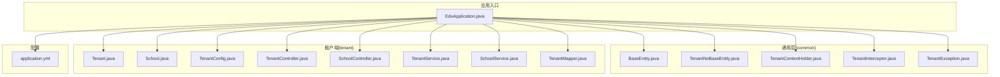
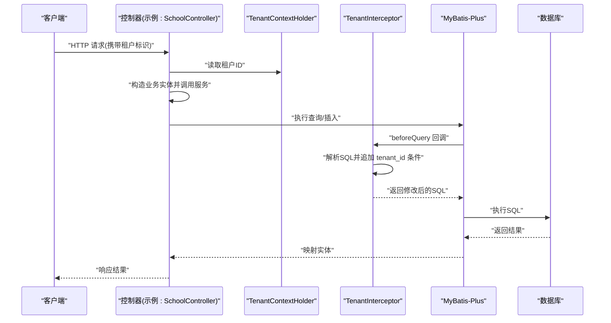
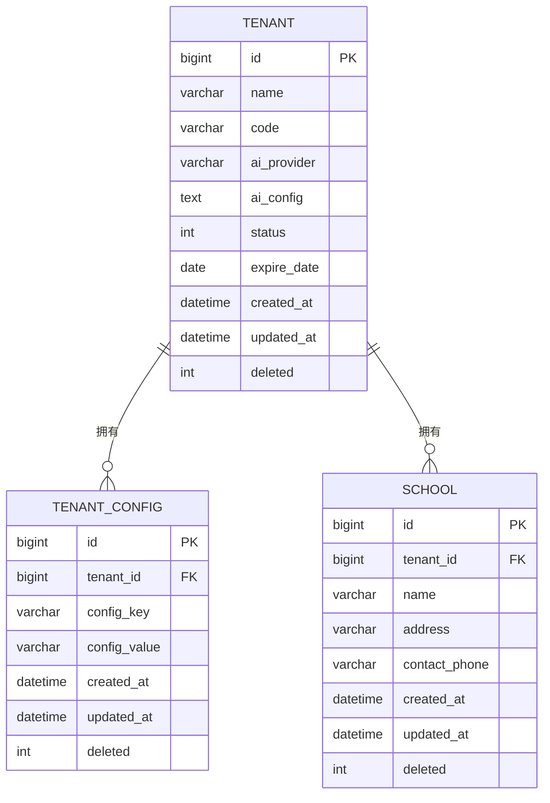
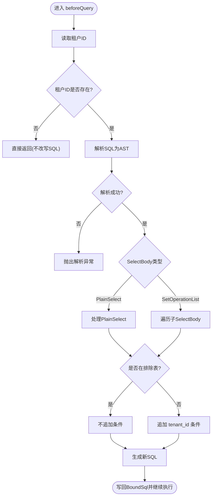
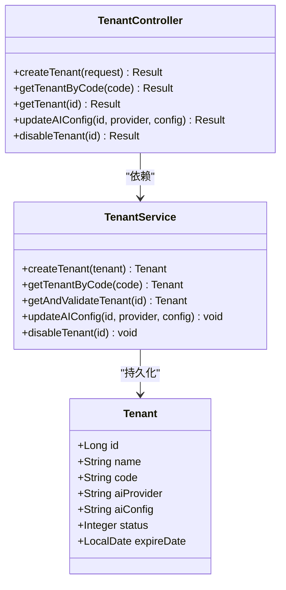
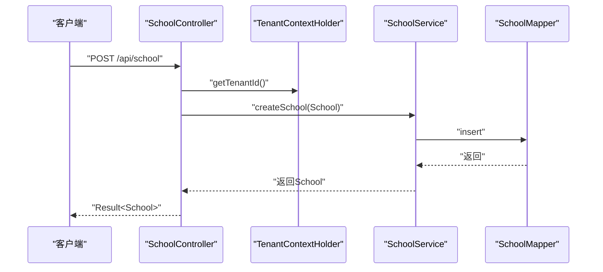
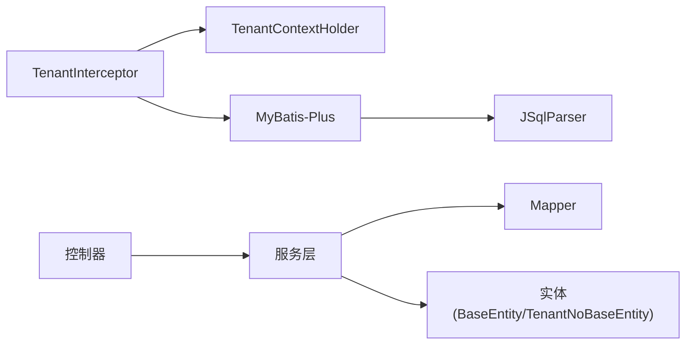

# 多租户管理

<cite>
**本文引用的文件**
- [EduApplication.java](file://backend/src/main/java/com/edu/EduApplication.java)
- [application.yml](file://backend/src/main/resources/application.yml)
- [BaseEntity.java](file://backend/src/main/java/com/edu/common/entity/BaseEntity.java)
- [TenantNoBaseEntity.java](file://backend/src/main/java/com/edu/common/entity/TenantNoBaseEntity.java)
- [TenantException.java](file://backend/src/main/java/com/edu/common/exception/TenantException.java)
- [TenantContextHolder.java](file://backend/src/main/java/com/edu/common/util/TenantContextHolder.java)
- [TenantInterceptor.java](file://backend/src/main/java/com/edu/common/interceptor/TenantInterceptor.java)
- [Tenant.java](file://backend/src/main/java/com/edu/tenant/entity/Tenant.java)
- [School.java](file://backend/src/main/java/com/edu/tenant/entity/School.java)
- [TenantConfig.java](file://backend/src/main/java/com/edu/tenant/entity/TenantConfig.java)
- [TenantMapper.java](file://backend/src/main/java/com/edu/tenant/mapper/TenantMapper.java)
- [TenantService.java](file://backend/src/main/java/com/edu/tenant/service/TenantService.java)
- [TenantController.java](file://backend/src/main/java/com/edu/tenant/controller/TenantController.java)
- [SchoolService.java](file://backend/src/main/java/com/edu/tenant/service/SchoolService.java)
- [SchoolController.java](file://backend/src/main/java/com/edu/tenant/controller/SchoolController.java)
</cite>

## 目录
1. [简介](#简介)
2. [项目结构](#项目结构)
3. [核心组件](#核心组件)
4. [架构总览](#架构总览)
5. [详细组件分析](#详细组件分析)
6. [依赖分析](#依赖分析)
7. [性能考虑](#性能考虑)
8. [故障排查指南](#故障排查指南)
9. [结论](#结论)
10. [附录](#附录)

## 简介
本文件系统性阐述教育平台的多租户管理模块，覆盖多租户架构设计原则（数据隔离、资源共享与安全边界）、租户实体模型与生命周期、学校管理能力、多租户拦截器工作机制、配置与最佳实践以及扩展新租户类型的开发指南。目标是帮助开发者与运维人员快速理解并正确使用多租户能力。

## 项目结构
后端采用分层与按功能域划分的结构：common（通用）、tenant（多租户）、user/exam/grading/ppt 等业务域。多租户相关代码集中在 tenant 包，通用能力位于 common 包，MyBatis-Plus 配置与全局异常处理在 common 下，应用入口在 EduApplication。

图表来源
- [EduApplication.java:1-15](file://backend/src/main/java/com/edu/EduApplication.java#L1-L15)
- [application.yml:1-65](file://backend/src/main/resources/application.yml#L1-L65)
- [BaseEntity.java:1-38](file://backend/src/main/java/com/edu/common/entity/BaseEntity.java#L1-L38)
- [TenantNoBaseEntity.java:1-23](file://backend/src/main/java/com/edu/common/entity/TenantNoBaseEntity.java#L1-L23)
- [TenantContextHolder.java:1-24](file://backend/src/main/java/com/edu/common/util/TenantContextHolder.java#L1-L24)
- [TenantInterceptor.java:1-142](file://backend/src/main/java/com/edu/common/interceptor/TenantInterceptor.java#L1-L142)
- [TenantException.java:1-28](file://backend/src/main/java/com/edu/common/exception/TenantException.java#L1-L28)
- [Tenant.java:1-21](file://backend/src/main/java/com/edu/tenant/entity/Tenant.java#L1-L21)
- [School.java:1-17](file://backend/src/main/java/com/edu/tenant/entity/School.java#L1-L17)
- [TenantConfig.java:1-17](file://backend/src/main/java/com/edu/tenant/entity/TenantConfig.java#L1-L17)
- [TenantController.java:1-76](file://backend/src/main/java/com/edu/tenant/controller/TenantController.java#L1-L76)
- [SchoolController.java:1-64](file://backend/src/main/java/com/edu/tenant/controller/SchoolController.java#L1-L64)
- [TenantService.java:1-81](file://backend/src/main/java/com/edu/tenant/service/TenantService.java#L1-L81)
- [SchoolService.java:1-47](file://backend/src/main/java/com/edu/tenant/service/SchoolService.java#L1-L47)
- [TenantMapper.java:1-9](file://backend/src/main/java/com/edu/tenant/mapper/TenantMapper.java#L1-L9)

章节来源
- [EduApplication.java:1-15](file://backend/src/main/java/com/edu/EduApplication.java#L1-L15)
- [application.yml:1-65](file://backend/src/main/resources/application.yml#L1-L65)

## 核心组件
- 实体基类与租户字段
  - BaseEntity 提供 tenant_id 字段及通用审计字段，所有业务实体继承以实现默认多租户隔离。
  - TenantNoBaseEntity 用于系统表（如 tenant、tenant_config），不参与租户隔离。
- 多租户上下文
  - TenantContextHolder 使用线程本地存储当前请求的租户ID，支持跨线程传递。
- 拦截器
  - TenantInterceptor 基于 MyBatis-Plus InnerInterceptor 与 JSqlParser，在查询前自动为 SELECT 添加 tenant_id 过滤条件；支持排除表白名单，避免对非租户表或通过父表关联的表重复加条件。
- 租户与学校管理
  - TenantController/TenantService 负责租户创建、查询、AI配置更新与禁用。
  - SchoolController/SchoolService 负责学校信息维护与默认校管理。
- 异常体系
  - TenantException 封装租户相关的业务异常（不存在、禁用、过期、越权）。

章节来源
- [BaseEntity.java:1-38](file://backend/src/main/java/com/edu/common/entity/BaseEntity.java#L1-L38)
- [TenantNoBaseEntity.java:1-23](file://backend/src/main/java/com/edu/common/entity/TenantNoBaseEntity.java#L1-L23)
- [TenantContextHolder.java:1-24](file://backend/src/main/java/com/edu/common/util/TenantContextHolder.java#L1-L24)
- [TenantInterceptor.java:1-142](file://backend/src/main/java/com/edu/common/interceptor/TenantInterceptor.java#L1-L142)
- [TenantController.java:1-76](file://backend/src/main/java/com/edu/tenant/controller/TenantController.java#L1-L76)
- [TenantService.java:1-81](file://backend/src/main/java/com/edu/tenant/service/TenantService.java#L1-L81)
- [SchoolController.java:1-64](file://backend/src/main/java/com/edu/tenant/controller/SchoolController.java#L1-L64)
- [SchoolService.java:1-47](file://backend/src/main/java/com/edu/tenant/service/SchoolService.java#L1-L47)
- [TenantException.java:1-28](file://backend/src/main/java/com/edu/common/exception/TenantException.java#L1-L28)

## 架构总览
多租户架构围绕“请求进入—上下文注入—SQL自动过滤—业务处理—返回结果”展开。核心流程如下：

图表来源
- [SchoolController.java:1-64](file://backend/src/main/java/com/edu/tenant/controller/SchoolController.java#L1-L64)
- [TenantContextHolder.java:1-24](file://backend/src/main/java/com/edu/common/util/TenantContextHolder.java#L1-L24)
- [TenantInterceptor.java:1-142](file://backend/src/main/java/com/edu/common/interceptor/TenantInterceptor.java#L1-L142)

## 详细组件分析

### 数据模型与实体设计
- 实体基类
  - BaseEntity：统一注入 tenant_id、createdAt、updatedAt、deleted，确保所有业务数据具备租户维度与审计能力。
  - TenantNoBaseEntity：仅包含审计字段，适用于系统级表（如 tenant、tenant_config）。
- 租户实体
  - Tenant：租户主表，包含名称、编码、AI提供商、AI配置、状态、到期日等。
  - TenantConfig：租户级配置键值对，便于按租户维度扩展配置。
  - School：学校信息，继承 BaseEntity，天然具备租户隔离。
- 关系图

图表来源
- [Tenant.java:1-21](file://backend/src/main/java/com/edu/tenant/entity/Tenant.java#L1-L21)
- [TenantConfig.java:1-17](file://backend/src/main/java/com/edu/tenant/entity/TenantConfig.java#L1-L17)
- [School.java:1-17](file://backend/src/main/java/com/edu/tenant/entity/School.java#L1-L17)
- [BaseEntity.java:1-38](file://backend/src/main/java/com/edu/common/entity/BaseEntity.java#L1-L38)
- [TenantNoBaseEntity.java:1-23](file://backend/src/main/java/com/edu/common/entity/TenantNoBaseEntity.java#L1-L23)

章节来源
- [Tenant.java:1-21](file://backend/src/main/java/com/edu/tenant/entity/Tenant.java#L1-L21)
- [School.java:1-17](file://backend/src/main/java/com/edu/tenant/entity/School.java#L1-L17)
- [TenantConfig.java:1-17](file://backend/src/main/java/com/edu/tenant/entity/TenantConfig.java#L1-L17)
- [BaseEntity.java:1-38](file://backend/src/main/java/com/edu/common/entity/BaseEntity.java#L1-L38)
- [TenantNoBaseEntity.java:1-23](file://backend/src/main/java/com/edu/common/entity/TenantNoBaseEntity.java#L1-L23)

### 多租户拦截器工作机制
- 工作原理
  - 在 MyBatis-Plus 查询前回调中，读取 TenantContextHolder 中的租户ID。
  - 使用 JSqlParser 解析原始 SQL，识别 SELECT 与集合操作（如 UNION），为目标表追加 tenant_id = ? 的 WHERE 条件。
  - 支持排除表白名单，避免对无 tenant_id 列或通过父表关联的表重复加条件。
- 流程图

图表来源
- [TenantInterceptor.java:1-142](file://backend/src/main/java/com/edu/common/interceptor/TenantInterceptor.java#L1-L142)
- [TenantContextHolder.java:1-24](file://backend/src/main/java/com/edu/common/util/TenantContextHolder.java#L1-L24)

章节来源
- [TenantInterceptor.java:1-142](file://backend/src/main/java/com/edu/common/interceptor/TenantInterceptor.java#L1-L142)
- [TenantContextHolder.java:1-24](file://backend/src/main/java/com/edu/common/util/TenantContextHolder.java#L1-L24)

### 租户实体的生命周期与控制
- 生命周期要点
  - 创建：校验编码唯一性，默认启用状态与默认AI提供商。
  - 查询：按编码/ID查询；校验状态与到期日。
  - 更新：支持更新AI提供商与配置。
  - 禁用：将状态置为禁用。
- 类图

图表来源
- [Tenant.java:1-21](file://backend/src/main/java/com/edu/tenant/entity/Tenant.java#L1-L21)
- [TenantService.java:1-81](file://backend/src/main/java/com/edu/tenant/service/TenantService.java#L1-L81)
- [TenantController.java:1-76](file://backend/src/main/java/com/edu/tenant/controller/TenantController.java#L1-L76)

章节来源
- [TenantController.java:1-76](file://backend/src/main/java/com/edu/tenant/controller/TenantController.java#L1-L76)
- [TenantService.java:1-81](file://backend/src/main/java/com/edu/tenant/service/TenantService.java#L1-L81)
- [Tenant.java:1-21](file://backend/src/main/java/com/edu/tenant/entity/Tenant.java#L1-L21)

### 学校管理功能
- 功能范围
  - 创建学校：基于当前租户上下文设置 tenant_id 并校验同租户下重名校验。
  - 列表查询：按租户过滤并按创建时间倒序。
  - 默认学校：返回最新创建的学校作为默认。
- 控制器与服务交互

图表来源
- [SchoolController.java:1-64](file://backend/src/main/java/com/edu/tenant/controller/SchoolController.java#L1-L64)
- [SchoolService.java:1-47](file://backend/src/main/java/com/edu/tenant/service/SchoolService.java#L1-L47)

章节来源
- [SchoolController.java:1-64](file://backend/src/main/java/com/edu/tenant/controller/SchoolController.java#L1-L64)
- [SchoolService.java:1-47](file://backend/src/main/java/com/edu/tenant/service/SchoolService.java#L1-L47)

### 配置与初始化
- 应用配置要点
  - 数据源与初始化：通过 application.yml 配置 MySQL 数据源与 schema 初始化。
  - MyBatis-Plus：扫描 mapper、开启下划线转驼峰、配置逻辑删除字段。
  - JWT：配置密钥与过期时间。
  - AI：默认提供商与云/私有AI服务参数。
- 初始化步骤建议
  - 启动前准备：确保数据库存在且可连接，初始化脚本已执行。
  - 租户初始化：通过接口创建租户并配置AI提供商与到期日。
  - 配置生效：重启或刷新相关配置（若后续引入动态配置中心）。

章节来源
- [application.yml:1-65](file://backend/src/main/resources/application.yml#L1-L65)
- [EduApplication.java:1-15](file://backend/src/main/java/com/edu/EduApplication.java#L1-L15)

## 依赖分析
- 组件耦合
  - TenantInterceptor 与 TenantContextHolder 强耦合，保证拦截器能读取到正确的租户上下文。
  - 所有业务实体继承 BaseEntity，形成统一的数据隔离基础。
  - 控制器依赖服务层，服务层依赖 Mapper，遵循分层职责。
- 外部依赖
  - MyBatis-Plus 与 JSqlParser：前者提供 ORM 能力，后者用于 SQL AST 解析。
  - Spring Boot：应用启动与配置加载。

图表来源
- [TenantInterceptor.java:1-142](file://backend/src/main/java/com/edu/common/interceptor/TenantInterceptor.java#L1-L142)
- [TenantContextHolder.java:1-24](file://backend/src/main/java/com/edu/common/util/TenantContextHolder.java#L1-L24)
- [SchoolController.java:1-64](file://backend/src/main/java/com/edu/tenant/controller/SchoolController.java#L1-L64)
- [TenantService.java:1-81](file://backend/src/main/java/com/edu/tenant/service/TenantService.java#L1-L81)
- [BaseEntity.java:1-38](file://backend/src/main/java/com/edu/common/entity/BaseEntity.java#L1-L38)
- [TenantNoBaseEntity.java:1-23](file://backend/src/main/java/com/edu/common/entity/TenantNoBaseEntity.java#L1-L23)

章节来源
- [TenantInterceptor.java:1-142](file://backend/src/main/java/com/edu/common/interceptor/TenantInterceptor.java#L1-L142)
- [TenantContextHolder.java:1-24](file://backend/src/main/java/com/edu/common/util/TenantContextHolder.java#L1-L24)
- [SchoolController.java:1-64](file://backend/src/main/java/com/edu/tenant/controller/SchoolController.java#L1-L64)
- [TenantService.java:1-81](file://backend/src/main/java/com/edu/tenant/service/TenantService.java#L1-L81)
- [BaseEntity.java:1-38](file://backend/src/main/java/com/edu/common/entity/BaseEntity.java#L1-L38)
- [TenantNoBaseEntity.java:1-23](file://backend/src/main/java/com/edu/common/entity/TenantNoBaseEntity.java#L1-L23)

## 性能考虑
- SQL 拦截开销
  - 拦截器在每次查询前进行 SQL 解析与 AST 修改，建议保持排除表清单最小化，避免对复杂 SQL 的频繁解析。
- 索引与查询
  - 对常用过滤字段（如 tenant_id、deleted）建立索引，减少全表扫描。
- 缓存策略
  - 对静态配置（如租户状态、到期日）可做短期缓存，降低数据库压力。
- 并发与线程安全
  - 使用 TransmittableThreadLocal 保障跨线程传递租户上下文，避免并发场景下的上下文泄漏。

## 故障排查指南
- 常见问题与定位
  - 无租户上下文：控制器侧返回 403，检查请求是否正确注入租户ID。
  - SQL 未自动追加 tenant_id：确认实体是否继承 BaseEntity、是否命中排除表、是否为 SELECT 语句。
  - 租户状态异常：租户不存在、禁用或已过期，查看 TenantException 抛出点。
- 排查步骤
  - 开启调试日志，观察拦截器输出的 SQL 变更。
  - 核对实体字段与表结构，确保 tenant_id 字段存在且命名一致。
  - 检查租户状态与到期日，必要时通过接口更新。

章节来源
- [SchoolController.java:1-64](file://backend/src/main/java/com/edu/tenant/controller/SchoolController.java#L1-L64)
- [TenantInterceptor.java:1-142](file://backend/src/main/java/com/edu/common/interceptor/TenantInterceptor.java#L1-L142)
- [TenantException.java:1-28](file://backend/src/main/java/com/edu/common/exception/TenantException.java#L1-L28)

## 结论
本多租户方案以实体基类统一注入租户维度、以拦截器自动追加过滤条件为核心，辅以清晰的异常体系与控制器/服务层协作，实现了数据隔离与安全边界。结合合理的初始化与配置策略，可在生产环境稳定运行。后续可按需引入动态配置中心与更细粒度的资源隔离策略。

## 附录

### 配置指南与最佳实践
- 租户初始化
  - 通过接口创建租户，设置编码、名称、到期日与默认AI提供商。
  - 初始状态建议启用，到期日按合同约定设定。
- 迁移策略
  - 新增租户：先创建租户记录，再初始化其业务数据。
  - 数据迁移：按租户维度进行，确保迁移过程中的事务一致性。
- 监控方案
  - 记录拦截器日志，监控 SQL 注入成功率与异常率。
  - 监控租户状态变更与到期预警。
- 安全边界
  - 严格限制对系统表（如 tenant、tenant_config）的访问。
  - 对敏感配置（如AI密钥）进行加密存储与最小暴露。

章节来源
- [TenantController.java:1-76](file://backend/src/main/java/com/edu/tenant/controller/TenantController.java#L1-L76)
- [TenantService.java:1-81](file://backend/src/main/java/com/edu/tenant/service/TenantService.java#L1-L81)
- [application.yml:1-65](file://backend/src/main/resources/application.yml#L1-L65)

### 扩展新租户类型的开发指南
- 步骤
  - 设计实体：新建实体类，继承 BaseEntity 以获得 tenant_id 字段。
  - 编写 Mapper：定义 CRUD 映射。
  - 编写 Service：封装业务逻辑，必要时加入租户校验。
  - 编写 Controller：暴露 REST 接口，读取租户上下文并调用服务。
  - 配置拦截排除：如新表无需 tenant_id 过滤，将其加入拦截器排除表清单。
- 注意事项
  - 保持字段命名与表结构一致。
  - 对涉及多表关联的查询，评估是否需要额外的 JOIN 条件或视图。
  - 对历史数据迁移，确保新增字段的默认值与业务规则一致。

章节来源
- [BaseEntity.java:1-38](file://backend/src/main/java/com/edu/common/entity/BaseEntity.java#L1-L38)
- [TenantInterceptor.java:1-142](file://backend/src/main/java/com/edu/common/interceptor/TenantInterceptor.java#L1-L142)
- [SchoolController.java:1-64](file://backend/src/main/java/com/edu/tenant/controller/SchoolController.java#L1-L64)
- [SchoolService.java:1-47](file://backend/src/main/java/com/edu/tenant/service/SchoolService.java#L1-L47)