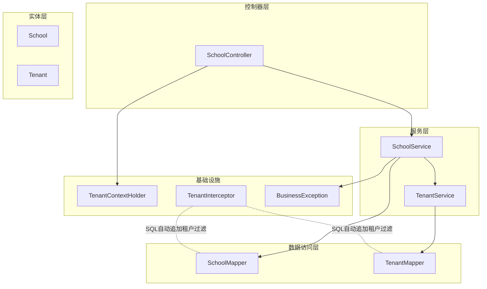
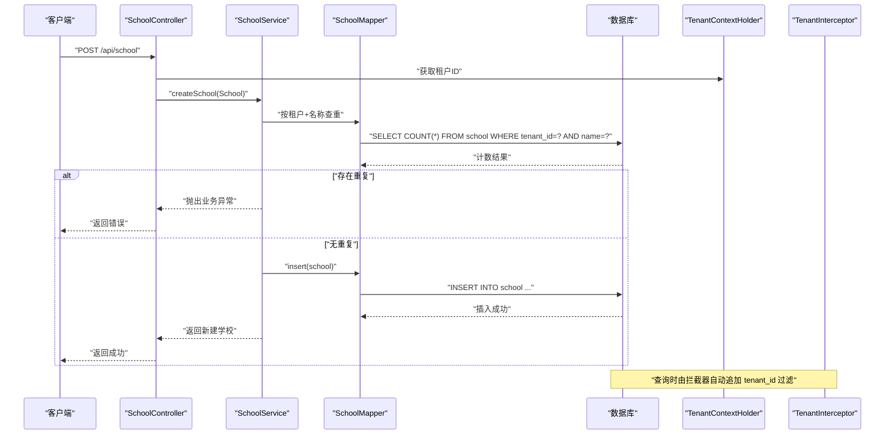
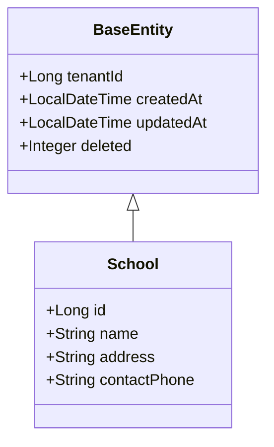
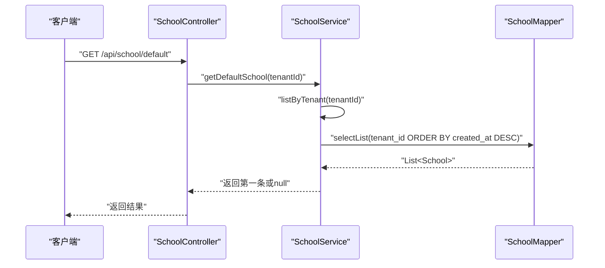
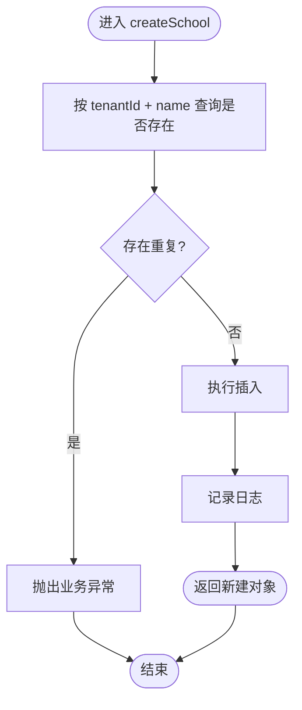
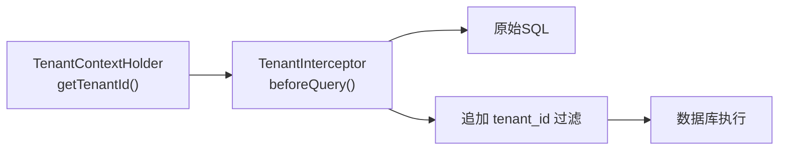
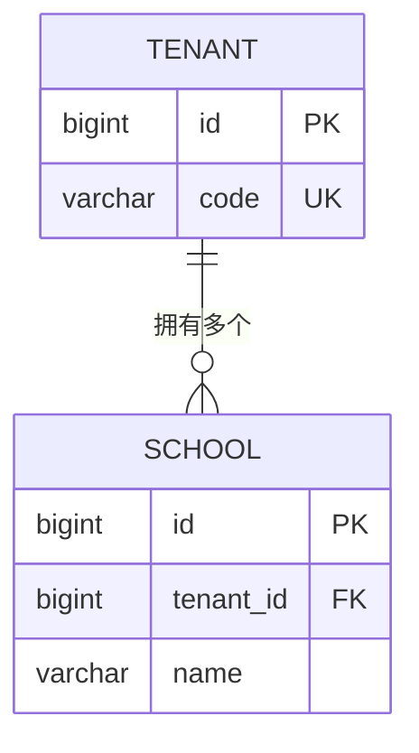
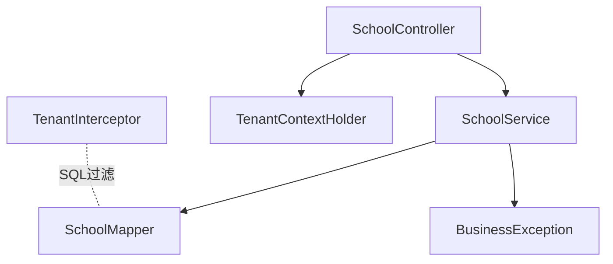

# 学校管理

<cite>
**本文引用的文件**
- [School.java](file://backend/src/main/java/com/edu/tenant/entity/School.java)
- [SchoolController.java](file://backend/src/main/java/com/edu/tenant/controller/SchoolController.java)
- [SchoolService.java](file://backend/src/main/java/com/edu/tenant/service/SchoolService.java)
- [SchoolMapper.java](file://backend/src/main/java/com/edu/tenant/mapper/SchoolMapper.java)
- [BaseEntity.java](file://backend/src/main/java/com/edu/common/entity/BaseEntity.java)
- [TenantContextHolder.java](file://backend/src/main/java/com/edu/common/util/TenantContextHolder.java)
- [Tenant.java](file://backend/src/main/java/com/edu/tenant/entity/Tenant.java)
- [TenantService.java](file://backend/src/main/java/com/edu/tenant/service/TenantService.java)
- [schema.sql](file://backend/src/main/resources/db/schema.sql)
- [TenantInterceptor.java](file://backend/src/main/java/com/edu/common/interceptor/TenantInterceptor.java)
- [BusinessException.java](file://backend/src/main/java/com/edu/common/exception/BusinessException.java)
- [TenantConfig.java](file://backend/src/main/java/com/edu/tenant/entity/TenantConfig.java)
- [TenantConfigService.java](file://backend/src/main/java/com/edu/tenant/service/TenantConfigService.java)
</cite>

## 目录
1. [简介](#简介)
2. [项目结构](#项目结构)
3. [核心组件](#核心组件)
4. [架构总览](#架构总览)
5. [详细组件分析](#详细组件分析)
6. [依赖分析](#依赖分析)
7. [性能考虑](#性能考虑)
8. [故障排查指南](#故障排查指南)
9. [结论](#结论)
10. [附录：CRUD 示例与最佳实践](#附录crud-示例与最佳实践)

## 简介
本文件围绕“学校管理”功能进行系统化技术文档整理，覆盖以下方面：
- School 实体的设计与实现：基本信息、与租户的关联、以及在数据库中的表结构映射。
- 学校控制器的 API 接口：创建、查询列表、查询默认学校等。
- 服务层业务逻辑：数据校验、租户上下文注入、重复性检查、默认学校策略。
- 与租户的关系映射：一对多（一个租户可拥有多个学校）。
- 最佳实践：数据一致性、性能优化、并发控制、错误处理与事务边界。
- 完整 CRUD 操作示例与常见问题排查。

## 项目结构
学校管理功能位于后端模块的租户子系统中，采用典型的分层架构：
- 控制器层：暴露 REST API，负责参数接收与响应封装。
- 服务层：实现业务规则，处理数据校验、权限与事务。
- 数据访问层：基于 MyBatis-Plus Mapper 进行数据库交互。
- 实体层：定义领域模型与数据库表映射。
- 基础设施：租户上下文、拦截器、异常体系、数据库脚本。

图表来源
- [SchoolController.java:1-64](file://backend/src/main/java/com/edu/tenant/controller/SchoolController.java#L1-L64)
- [SchoolService.java:1-47](file://backend/src/main/java/com/edu/tenant/service/SchoolService.java#L1-L47)
- [SchoolMapper.java:1-9](file://backend/src/main/java/com/edu/tenant/mapper/SchoolMapper.java#L1-L9)
- [TenantService.java:1-81](file://backend/src/main/java/com/edu/tenant/service/TenantService.java#L1-L81)
- [Tenant.java:1-21](file://backend/src/main/java/com/edu/tenant/entity/Tenant.java#L1-L21)
- [TenantContextHolder.java:1-24](file://backend/src/main/java/com/edu/common/util/TenantContextHolder.java#L1-L24)
- [TenantInterceptor.java:1-142](file://backend/src/main/java/com/edu/common/interceptor/TenantInterceptor.java#L1-L142)
- [BusinessException.java:1-28](file://backend/src/main/java/com/edu/common/exception/BusinessException.java#L1-L28)

章节来源
- [SchoolController.java:1-64](file://backend/src/main/java/com/edu/tenant/controller/SchoolController.java#L1-L64)
- [SchoolService.java:1-47](file://backend/src/main/java/com/edu/tenant/service/SchoolService.java#L1-L47)
- [SchoolMapper.java:1-9](file://backend/src/main/java/com/edu/tenant/mapper/SchoolMapper.java#L1-L9)
- [BaseEntity.java:1-38](file://backend/src/main/java/com/edu/common/entity/BaseEntity.java#L1-L38)
- [schema.sql:32-41](file://backend/src/main/resources/db/schema.sql#L32-L41)

## 核心组件
- School 实体：承载学校的基本信息，并继承通用租户隔离字段。
- SchoolController：提供学校创建、列表查询、默认学校查询的 API。
- SchoolService：实现业务规则，如名称唯一性检查、按租户查询、默认学校策略。
- SchoolMapper：MyBatis-Plus Mapper，提供基础 CRUD 能力。
- 租户上下文与拦截器：通过线程本地存储传递租户 ID，并在 SQL 层自动注入租户过滤条件。
- 异常体系：统一的业务异常包装，便于前端识别与处理。

章节来源
- [School.java:1-17](file://backend/src/main/java/com/edu/tenant/entity/School.java#L1-L17)
- [SchoolController.java:21-54](file://backend/src/main/java/com/edu/tenant/controller/SchoolController.java#L21-L54)
- [SchoolService.java:19-45](file://backend/src/main/java/com/edu/tenant/service/SchoolService.java#L19-L45)
- [SchoolMapper.java:1-9](file://backend/src/main/java/com/edu/tenant/mapper/SchoolMapper.java#L1-L9)
- [BaseEntity.java:10-38](file://backend/src/main/java/com/edu/common/entity/BaseEntity.java#L10-L38)
- [TenantContextHolder.java:8-24](file://backend/src/main/java/com/edu/common/util/TenantContextHolder.java#L8-L24)
- [TenantInterceptor.java:29-142](file://backend/src/main/java/com/edu/common/interceptor/TenantInterceptor.java#L29-L142)
- [BusinessException.java:9-27](file://backend/src/main/java/com/edu/common/exception/BusinessException.java#L9-L27)

## 架构总览
下图展示了学校管理的端到端调用链路，从控制器到服务、数据访问、数据库，以及租户上下文与拦截器的作用点。

图表来源
- [SchoolController.java:21-34](file://backend/src/main/java/com/edu/tenant/controller/SchoolController.java#L21-L34)
- [SchoolService.java:19-30](file://backend/src/main/java/com/edu/tenant/service/SchoolService.java#L19-L30)
- [SchoolMapper.java:1-9](file://backend/src/main/java/com/edu/tenant/mapper/SchoolMapper.java#L1-L9)
- [TenantInterceptor.java:66-95](file://backend/src/main/java/com/edu/common/interceptor/TenantInterceptor.java#L66-L95)

## 详细组件分析

### School 实体与数据库映射
- 字段设计：包含主键、租户标识、学校名称、地址、联系方式；继承通用字段（创建/更新时间、逻辑删除）。
- 表结构：对应数据库表 school，包含索引 tenant_id 以支持按租户快速过滤。
- 关系映射：通过注解映射到 school 表，配合 MyBatis-Plus 自动填充时间字段。

图表来源
- [BaseEntity.java:10-38](file://backend/src/main/java/com/edu/common/entity/BaseEntity.java#L10-L38)
- [School.java:11-16](file://backend/src/main/java/com/edu/tenant/entity/School.java#L11-L16)

章节来源
- [School.java:1-17](file://backend/src/main/java/com/edu/tenant/entity/School.java#L1-L17)
- [BaseEntity.java:10-38](file://backend/src/main/java/com/edu/common/entity/BaseEntity.java#L10-L38)
- [schema.sql:32-41](file://backend/src/main/resources/db/schema.sql#L32-L41)

### SchoolController API 设计
- 创建学校
  - 路径：POST /api/school
  - 参数：SchoolCreateRequest（名称必填，地址与电话选填）
  - 逻辑：从租户上下文获取 tenantId，组装 School 对象，调用服务创建
- 查询学校列表
  - 路径：GET /api/school
  - 逻辑：按租户查询，按创建时间倒序
- 获取默认学校
  - 路径：GET /api/school/default
  - 逻辑：取租户下最新创建的学校作为默认

图表来源
- [SchoolController.java:46-54](file://backend/src/main/java/com/edu/tenant/controller/SchoolController.java#L46-L54)
- [SchoolService.java:32-45](file://backend/src/main/java/com/edu/tenant/service/SchoolService.java#L32-L45)

章节来源
- [SchoolController.java:21-54](file://backend/src/main/java/com/edu/tenant/controller/SchoolController.java#L21-L54)
- [SchoolService.java:32-45](file://backend/src/main/java/com/edu/tenant/service/SchoolService.java#L32-L45)

### SchoolService 业务逻辑
- 创建学校
  - 重复性检查：按 tenantId + name 唯一性校验，避免同租户下重名
  - 插入与日志：插入成功后记录日志
- 列表查询
  - 按 tenantId 过滤，按创建时间倒序
- 默认学校
  - 取列表第一条作为默认学校，若为空则返回 null

图表来源
- [SchoolService.java:19-30](file://backend/src/main/java/com/edu/tenant/service/SchoolService.java#L19-L30)

章节来源
- [SchoolService.java:19-45](file://backend/src/main/java/com/edu/tenant/service/SchoolService.java#L19-L45)
- [BusinessException.java:9-27](file://backend/src/main/java/com/edu/common/exception/BusinessException.java#L9-L27)

### 数据访问层与租户隔离
- SchoolMapper：继承 MyBatis-Plus 基类，提供基础 CRUD
- 租户上下文：通过 TenantContextHolder 在线程内传递 tenantId
- SQL 拦截：TenantInterceptor 在查询前解析 SQL，自动追加 tenant_id 条件，排除特定表（如 school、tenant 等）

图表来源
- [TenantContextHolder.java:16-17](file://backend/src/main/java/com/edu/common/util/TenantContextHolder.java#L16-L17)
- [TenantInterceptor.java:66-95](file://backend/src/main/java/com/edu/common/interceptor/TenantInterceptor.java#L66-L95)
- [schema.sql:306-307](file://backend/src/main/resources/db/schema.sql#L306-L307)

章节来源
- [SchoolMapper.java:1-9](file://backend/src/main/java/com/edu/tenant/mapper/SchoolMapper.java#L1-L9)
- [TenantContextHolder.java:8-24](file://backend/src/main/java/com/edu/common/util/TenantContextHolder.java#L8-L24)
- [TenantInterceptor.java:29-142](file://backend/src/main/java/com/edu/common/interceptor/TenantInterceptor.java#L29-L142)
- [schema.sql:32-41](file://backend/src/main/resources/db/schema.sql#L32-L41)

### 与租户的关系映射
- 关系模型：一个租户可以拥有多个学校；学校属于租户。
- 映射依据：School 实体包含 tenant_id 字段；数据库表 school 的外键约束体现该关系。
- 查询隔离：通过拦截器自动追加 tenant_id 过滤，确保跨租户数据隔离。

图表来源
- [schema.sql:9-20](file://backend/src/main/resources/db/schema.sql#L9-L20)
- [schema.sql:32-41](file://backend/src/main/resources/db/schema.sql#L32-L41)

章节来源
- [schema.sql:9-20](file://backend/src/main/resources/db/schema.sql#L9-L20)
- [schema.sql:32-41](file://backend/src/main/resources/db/schema.sql#L32-L41)

## 依赖分析
- 控制器依赖服务：SchoolController 依赖 SchoolService 提供业务能力。
- 服务依赖数据访问：SchoolService 依赖 SchoolMapper 进行数据库操作。
- 上下文与拦截器：控制器通过 TenantContextHolder 获取租户 ID；TenantInterceptor 在 SQL 层自动注入过滤条件。
- 异常处理：服务层在重复性检查失败时抛出业务异常，由全局异常处理器统一处理。

图表来源
- [SchoolController.java:19-20](file://backend/src/main/java/com/edu/tenant/controller/SchoolController.java#L19-L20)
- [SchoolService.java:17-18](file://backend/src/main/java/com/edu/tenant/service/SchoolService.java#L17-L18)
- [SchoolMapper.java:1-9](file://backend/src/main/java/com/edu/tenant/mapper/SchoolMapper.java#L1-L9)
- [TenantContextHolder.java:16-17](file://backend/src/main/java/com/edu/common/util/TenantContextHolder.java#L16-L17)
- [BusinessException.java:9-27](file://backend/src/main/java/com/edu/common/exception/BusinessException.java#L9-L27)
- [TenantInterceptor.java:66-95](file://backend/src/main/java/com/edu/common/interceptor/TenantInterceptor.java#L66-L95)

章节来源
- [SchoolController.java:19-20](file://backend/src/main/java/com/edu/tenant/controller/SchoolController.java#L19-L20)
- [SchoolService.java:17-18](file://backend/src/main/java/com/edu/tenant/service/SchoolService.java#L17-L18)
- [SchoolMapper.java:1-9](file://backend/src/main/java/com/edu/tenant/mapper/SchoolMapper.java#L1-L9)
- [TenantContextHolder.java:16-17](file://backend/src/main/java/com/edu/common/util/TenantContextHolder.java#L16-L17)
- [BusinessException.java:9-27](file://backend/src/main/java/com/edu/common/exception/BusinessException.java#L9-L27)
- [TenantInterceptor.java:66-95](file://backend/src/main/java/com/edu/common/interceptor/TenantInterceptor.java#L66-L95)

## 性能考虑
- 索引优化：school 表对 tenant_id 建有索引，确保按租户查询高效。
- SQL 拦截：TenantInterceptor 自动追加过滤条件，避免漏过滤导致全表扫描。
- 事务边界：创建学校使用事务，保证唯一性检查与插入的一致性。
- 排序与分页：列表查询按创建时间倒序，建议结合分页参数以控制返回量。
- 缓存策略：对于默认学校这类热点数据，可在服务层增加缓存（需额外实现）。

章节来源
- [schema.sql:306-307](file://backend/src/main/resources/db/schema.sql#L306-L307)
- [TenantInterceptor.java:66-95](file://backend/src/main/java/com/edu/common/interceptor/TenantInterceptor.java#L66-L95)
- [SchoolService.java:19-30](file://backend/src/main/java/com/edu/tenant/service/SchoolService.java#L19-L30)

## 故障排查指南
- 租户上下文缺失
  - 现象：控制器返回 403 错误
  - 原因：未正确设置租户上下文
  - 处理：在网关或拦截器中设置 TenantContextHolder
- 学校名称重复
  - 现象：抛出业务异常
  - 原因：同租户下存在相同名称
  - 处理：修改名称或检查现有数据
- 查询不到默认学校
  - 现象：返回空
  - 原因：租户下无任何学校
  - 处理：先创建学校再调用默认接口
- SQL 过滤异常
  - 现象：查询不到数据或报解析错误
  - 原因：SQL 解析失败或拦截器未生效
  - 处理：确认拦截器配置与租户 ID 设置

章节来源
- [SchoolController.java:23-26](file://backend/src/main/java/com/edu/tenant/controller/SchoolController.java#L23-L26)
- [SchoolService.java:24-25](file://backend/src/main/java/com/edu/tenant/service/SchoolService.java#L24-L25)
- [BusinessException.java:9-27](file://backend/src/main/java/com/edu/common/exception/BusinessException.java#L9-L27)
- [TenantInterceptor.java:77-81](file://backend/src/main/java/com/edu/common/interceptor/TenantInterceptor.java#L77-L81)

## 结论
学校管理功能以清晰的分层架构实现，通过租户上下文与 SQL 拦截器保障了多租户隔离与数据安全。服务层在创建流程中实现了必要的唯一性校验与事务控制，控制器提供了简洁的 API 接口。建议后续在默认学校与热点数据上引入缓存，在查询侧增加分页与筛选参数，进一步提升性能与扩展性。

## 附录：CRUD 示例与最佳实践

### CRUD 操作示例（路径与要点）
- 创建学校
  - 方法：POST
  - 路径：/api/school
  - 请求体：包含名称（必填）、地址（选填）、电话（选填）
  - 业务要点：从租户上下文注入 tenantId，服务层按 tenantId+name 唯一性检查
  - 参考路径：[SchoolController.java:21-34](file://backend/src/main/java/com/edu/tenant/controller/SchoolController.java#L21-L34)，[SchoolService.java:19-30](file://backend/src/main/java/com/edu/tenant/service/SchoolService.java#L19-L30)
- 查询学校列表
  - 方法：GET
  - 路径：/api/school
  - 返回：按创建时间倒序的学校列表
  - 参考路径：[SchoolController.java:36-44](file://backend/src/main/java/com/edu/tenant/controller/SchoolController.java#L36-L44)，[SchoolService.java:32-37](file://backend/src/main/java/com/edu/tenant/service/SchoolService.java#L32-L37)
- 获取默认学校
  - 方法：GET
  - 路径：/api/school/default
  - 返回：租户下最新创建的学校，若无则返回空
  - 参考路径：[SchoolController.java:46-54](file://backend/src/main/java/com/edu/tenant/controller/SchoolController.java#L46-L54)，[SchoolService.java:39-45](file://backend/src/main/java/com/edu/tenant/service/SchoolService.java#L39-L45)

### 最佳实践
- 数据完整性
  - 使用唯一性约束（如 school 的 tenant_id+name）与服务层双重校验
  - 启用逻辑删除字段，避免物理删除造成数据不可追溯
- 性能优化
  - 为高频查询列建立索引（如 school.tenant_id）
  - 使用 SQL 拦截器自动注入过滤条件，减少手写过滤逻辑
  - 列表查询增加分页参数，限制单次返回量
- 并发控制
  - 在唯一性检查与插入之间使用数据库层面的唯一约束与服务层事务
  - 对热点数据（如默认学校）考虑缓存与失效策略
- 错误处理
  - 使用统一业务异常包装，便于前端识别与提示
  - 在控制器层对租户上下文缺失进行显式判断与返回