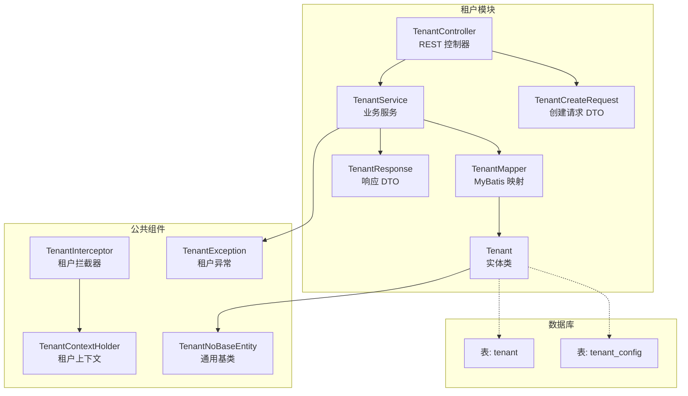
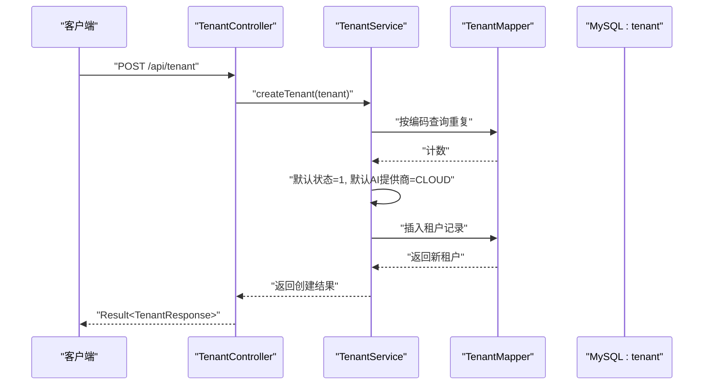
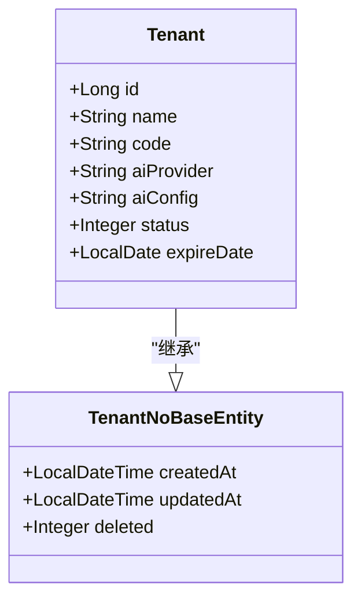
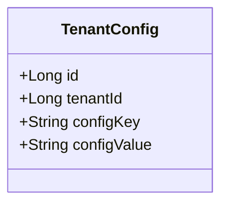
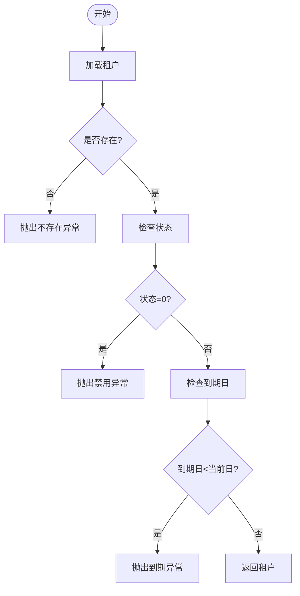
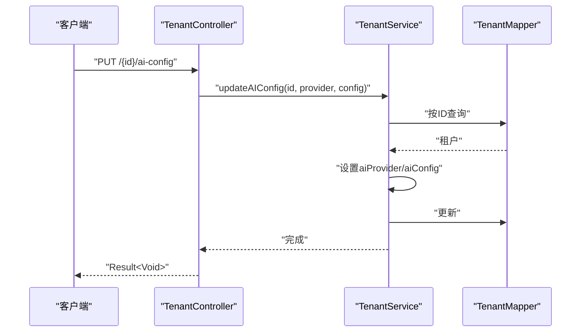
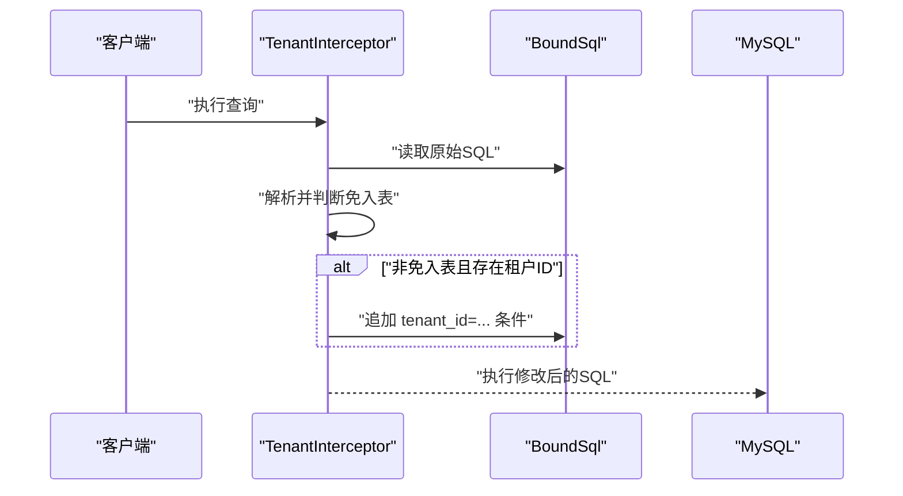
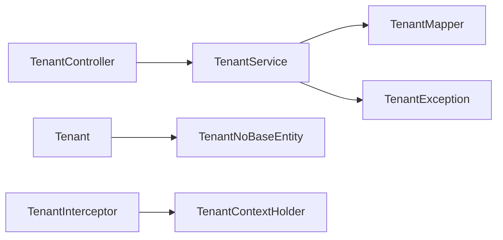

# 租户实体设计

<cite>
**本文引用的文件**
- [Tenant.java](file://backend/src/main/java/com/edu/tenant/entity/Tenant.java)
- [TenantConfig.java](file://backend/src/main/java/com/edu/tenant/entity/TenantConfig.java)
- [TenantCreateRequest.java](file://backend/src/main/java/com/edu/tenant/dto/TenantCreateRequest.java)
- [TenantResponse.java](file://backend/src/main/java/com/edu/tenant/dto/TenantResponse.java)
- [TenantMapper.java](file://backend/src/main/java/com/edu/tenant/mapper/TenantMapper.java)
- [TenantConfigMapper.java](file://backend/src/main/java/com/edu/tenant/mapper/TenantConfigMapper.java)
- [TenantService.java](file://backend/src/main/java/com/edu/tenant/service/TenantService.java)
- [TenantController.java](file://backend/src/main/java/com/edu/tenant/controller/TenantController.java)
- [TenantNoBaseEntity.java](file://backend/src/main/java/com/edu/common/entity/TenantNoBaseEntity.java)
- [schema.sql](file://backend/src/main/resources/db/schema.sql)
- [TenantException.java](file://backend/src/main/java/com/edu/common/exception/TenantException.java)
- [TenantInterceptor.java](file://backend/src/main/java/com/edu/common/interceptor/TenantInterceptor.java)
- [TenantContextHolder.java](file://backend/src/main/java/com/edu/common/util/TenantContextHolder.java)
</cite>

## 目录
1. [简介](#简介)
2. [项目结构](#项目结构)
3. [核心组件](#核心组件)
4. [架构概览](#架构概览)
5. [详细组件分析](#详细组件分析)
6. [依赖分析](#依赖分析)
7. [性能考虑](#性能考虑)
8. [故障排查指南](#故障排查指南)
9. [结论](#结论)
10. [附录](#附录)

## 简介
本文件围绕租户实体设计进行系统性说明，重点覆盖以下方面：
- Tenant 实体类的设计原理与字段语义（标识、编码、名称、AI 配置、状态、过期时间等）
- 租户状态管理机制（启用/禁用的业务逻辑与验证规则）
- 租户配置的存储格式与解析方式（AI 提供商配置的序列化与反序列化思路）
- 租户实体的完整生命周期（创建、更新、查询、删除）
- 实体关系图与字段约束说明，以及与租户配置表的关联关系
- 基于拦截器的多租户隔离策略与上下文传递

## 项目结构
租户模块位于后端工程的 com.edu.tenant 包下，采用典型的分层架构：控制器层负责对外接口；服务层承载业务逻辑；映射层对接数据库；实体与 DTO 定义数据模型。

图表来源
- [TenantController.java:1-76](file://backend/src/main/java/com/edu/tenant/controller/TenantController.java#L1-L76)
- [TenantService.java:1-81](file://backend/src/main/java/com/edu/tenant/service/TenantService.java#L1-L81)
- [TenantMapper.java:1-9](file://backend/src/main/java/com/edu/tenant/mapper/TenantMapper.java#L1-L9)
- [Tenant.java:1-21](file://backend/src/main/java/com/edu/tenant/entity/Tenant.java#L1-L21)
- [TenantCreateRequest.java:1-21](file://backend/src/main/java/com/edu/tenant/dto/TenantCreateRequest.java#L1-L21)
- [TenantResponse.java:1-18](file://backend/src/main/java/com/edu/tenant/dto/TenantResponse.java#L1-L18)
- [TenantInterceptor.java:1-142](file://backend/src/main/java/com/edu/common/interceptor/TenantInterceptor.java#L1-L142)
- [TenantContextHolder.java:1-24](file://backend/src/main/java/com/edu/common/util/TenantContextHolder.java#L1-L24)
- [TenantException.java:1-28](file://backend/src/main/java/com/edu/common/exception/TenantException.java#L1-L28)
- [TenantNoBaseEntity.java:1-23](file://backend/src/main/java/com/edu/common/entity/TenantNoBaseEntity.java#L1-L23)
- [schema.sql:9-31](file://backend/src/main/resources/db/schema.sql#L9-L31)

章节来源
- [TenantController.java:1-76](file://backend/src/main/java/com/edu/tenant/controller/TenantController.java#L1-L76)
- [TenantService.java:1-81](file://backend/src/main/java/com/edu/tenant/service/TenantService.java#L1-L81)
- [TenantMapper.java:1-9](file://backend/src/main/java/com/edu/tenant/mapper/TenantMapper.java#L1-L9)
- [Tenant.java:1-21](file://backend/src/main/java/com/edu/tenant/entity/Tenant.java#L1-L21)
- [TenantCreateRequest.java:1-21](file://backend/src/main/java/com/edu/tenant/dto/TenantCreateRequest.java#L1-L21)
- [TenantResponse.java:1-18](file://backend/src/main/java/com/edu/tenant/dto/TenantResponse.java#L1-L18)
- [schema.sql:9-31](file://backend/src/main/resources/db/schema.sql#L9-L31)

## 核心组件
- 实体类 Tenant：定义租户的核心属性与映射关系，继承通用基类以获得统一的时间戳与软删除字段。
- 实体类 TenantConfig：用于存储租户的键值型配置，支持 JSON 类型的配置值。
- DTO：TenantCreateRequest 用于创建租户的输入校验与参数接收；TenantResponse 用于对外返回租户信息。
- Mapper：TenantMapper 与 TenantConfigMapper 分别映射到 tenant 与 tenant_config 表。
- Service：TenantService 承载租户的业务逻辑，包括创建、查询、状态校验、AI 配置更新与禁用。
- Controller：TenantController 对外暴露 REST 接口，完成请求到服务层的编排。
- 异常：TenantException 封装租户相关的业务异常（不存在、禁用、到期、无权访问）。
- 拦截器与上下文：TenantInterceptor 通过 JSqlParser 自动注入租户过滤条件；TenantContextHolder 在线程间传递当前租户 ID。

章节来源
- [Tenant.java:1-21](file://backend/src/main/java/com/edu/tenant/entity/Tenant.java#L1-L21)
- [TenantConfig.java:1-17](file://backend/src/main/java/com/edu/tenant/entity/TenantConfig.java#L1-L17)
- [TenantCreateRequest.java:1-21](file://backend/src/main/java/com/edu/tenant/dto/TenantCreateRequest.java#L1-L21)
- [TenantResponse.java:1-18](file://backend/src/main/java/com/edu/tenant/dto/TenantResponse.java#L1-L18)
- [TenantMapper.java:1-9](file://backend/src/main/java/com/edu/tenant/mapper/TenantMapper.java#L1-L9)
- [TenantConfigMapper.java:1-9](file://backend/src/main/java/com/edu/tenant/mapper/TenantConfigMapper.java#L1-L9)
- [TenantService.java:1-81](file://backend/src/main/java/com/edu/tenant/service/TenantService.java#L1-L81)
- [TenantController.java:1-76](file://backend/src/main/java/com/edu/tenant/controller/TenantController.java#L1-L76)
- [TenantException.java:1-28](file://backend/src/main/java/com/edu/common/exception/TenantException.java#L1-L28)
- [TenantInterceptor.java:1-142](file://backend/src/main/java/com/edu/common/interceptor/TenantInterceptor.java#L1-L142)
- [TenantContextHolder.java:1-24](file://backend/src/main/java/com/edu/common/util/TenantContextHolder.java#L1-L24)

## 架构概览
租户实体设计遵循“实体-映射-服务-控制”的分层模式，并通过拦截器实现跨表的多租户隔离。整体流程如下：

图表来源
- [TenantController.java:20-32](file://backend/src/main/java/com/edu/tenant/controller/TenantController.java#L20-L32)
- [TenantService.java:20-36](file://backend/src/main/java/com/edu/tenant/service/TenantService.java#L20-L36)
- [TenantMapper.java:1-9](file://backend/src/main/java/com/edu/tenant/mapper/TenantMapper.java#L1-L9)
- [schema.sql:9-21](file://backend/src/main/resources/db/schema.sql#L9-L21)

## 详细组件分析

### 实体类 Tenant 设计
- 字段与语义
  - id：租户主键
  - name：租户名称（如学校/机构名），非空
  - code：租户编码，唯一标识，非空
  - aiProvider：AI 服务提供商，取值范围由业务约定（如 CLOUD/PRIVATE）
  - aiConfig：AI 配置，采用 JSON 存储（如 API 密钥、私有服务地址等）
  - status：租户状态，1-正常，0-禁用
  - expireDate：服务到期日期
  - createdAt/updatedAt：统一由基类提供
- 继承关系
  - 继承 TenantNoBaseEntity，获得统一的审计字段与软删除字段
- 数据库映射
  - 使用注解映射到 tenant 表，字段与表结构一一对应

图表来源
- [Tenant.java:1-21](file://backend/src/main/java/com/edu/tenant/entity/Tenant.java#L1-L21)
- [TenantNoBaseEntity.java:1-23](file://backend/src/main/java/com/edu/common/entity/TenantNoBaseEntity.java#L1-L23)

章节来源
- [Tenant.java:1-21](file://backend/src/main/java/com/edu/tenant/entity/Tenant.java#L1-L21)
- [TenantNoBaseEntity.java:1-23](file://backend/src/main/java/com/edu/common/entity/TenantNoBaseEntity.java#L1-L23)
- [schema.sql:9-21](file://backend/src/main/resources/db/schema.sql#L9-L21)

### 实体类 TenantConfig 设计
- 字段与语义
  - id：主键
  - tenantId：所属租户
  - configKey：配置键（唯一索引包含 tenantId）
  - configValue：配置值，采用 JSON 存储
- 关系
  - 与 Tenant 通过 tenant_id 关联，一对多或独立配置表

图表来源
- [TenantConfig.java:1-17](file://backend/src/main/java/com/edu/tenant/entity/TenantConfig.java#L1-L17)
- [schema.sql:22-31](file://backend/src/main/resources/db/schema.sql#L22-L31)

章节来源
- [TenantConfig.java:1-17](file://backend/src/main/java/com/edu/tenant/entity/TenantConfig.java#L1-L17)
- [schema.sql:22-31](file://backend/src/main/resources/db/schema.sql#L22-L31)

### DTO 设计
- TenantCreateRequest
  - 校验规则：name 与 code 的非空与长度限制；可选字段 aiProvider、aiConfig、expireDate
- TenantResponse
  - 输出字段：id、name、code、aiProvider、aiConfig、status、expireDate、createdAt

章节来源
- [TenantCreateRequest.java:1-21](file://backend/src/main/java/com/edu/tenant/dto/TenantCreateRequest.java#L1-L21)
- [TenantResponse.java:1-18](file://backend/src/main/java/com/edu/tenant/dto/TenantResponse.java#L1-L18)

### 状态管理机制
- 启用/禁用
  - 默认状态：创建时若未指定状态，默认启用（1）
  - 禁用：通过专用接口将状态置为 0
- 过期校验
  - 查询与访问时，若到期日早于当前日期，则视为过期
- 异常处理
  - 不存在、禁用、过期分别抛出对应的业务异常

图表来源
- [TenantService.java:44-56](file://backend/src/main/java/com/edu/tenant/service/TenantService.java#L44-L56)
- [TenantException.java:1-28](file://backend/src/main/java/com/edu/common/exception/TenantException.java#L1-L28)

章节来源
- [TenantService.java:27-56](file://backend/src/main/java/com/edu/tenant/service/TenantService.java#L27-L56)
- [TenantException.java:1-28](file://backend/src/main/java/com/edu/common/exception/TenantException.java#L1-L28)

### AI 配置存储与解析
- 存储格式
  - aiConfig 字段为 JSON，适合存放敏感或结构化配置（如密钥、服务地址等）
- 解析方式
  - 服务层直接接收字符串形式的配置（通常为 JSON），不做解析，交由上层或下游模块处理
  - 若需要强类型解析，可在服务层增加 JSON 到对象的转换逻辑（建议）

章节来源
- [Tenant.java:16-17](file://backend/src/main/java/com/edu/tenant/entity/Tenant.java#L16-L17)
- [schema.sql:14-15](file://backend/src/main/resources/db/schema.sql#L14-L15)
- [TenantController.java:49-55](file://backend/src/main/java/com/edu/tenant/controller/TenantController.java#L49-L55)

### 生命周期管理
- 创建
  - 控制器接收请求，填充实体，调用服务层创建
  - 服务层执行重复性校验、默认值填充与入库
- 更新
  - 支持单独更新 AI 配置（提供商与配置值）
- 查询
  - 支持按主键查询并进行状态与有效期校验
  - 支持按编码查询
- 删除
  - 实体基类提供软删除字段，可通过逻辑删除实现

图表来源
- [TenantController.java:49-55](file://backend/src/main/java/com/edu/tenant/controller/TenantController.java#L49-L55)
- [TenantService.java:58-68](file://backend/src/main/java/com/edu/tenant/service/TenantService.java#L58-L68)
- [TenantMapper.java:1-9](file://backend/src/main/java/com/edu/tenant/mapper/TenantMapper.java#L1-L9)

章节来源
- [TenantController.java:20-61](file://backend/src/main/java/com/edu/tenant/controller/TenantController.java#L20-L61)
- [TenantService.java:20-81](file://backend/src/main/java/com/edu/tenant/service/TenantService.java#L20-L81)

### 多租户隔离与上下文传递
- 上下文持有
  - TenantContextHolder 使用 TransmittableThreadLocal 存储当前租户 ID，便于拦截器与服务层使用
- SQL 拦截
  - TenantInterceptor 在查询前解析 SQL，自动为符合条件的表追加 tenant_id 过滤条件
  - 免入表清单：tenant、tenant_config、permission 等不强制追加 tenant_id
- 例外场景
  - sys_user、question、exam_question 等通过父表或关联表间接隔离，不在拦截范围内

图表来源
- [TenantInterceptor.java:66-95](file://backend/src/main/java/com/edu/common/interceptor/TenantInterceptor.java#L66-L95)
- [TenantContextHolder.java:1-24](file://backend/src/main/java/com/edu/common/util/TenantContextHolder.java#L1-L24)

章节来源
- [TenantInterceptor.java:1-142](file://backend/src/main/java/com/edu/common/interceptor/TenantInterceptor.java#L1-L142)
- [TenantContextHolder.java:1-24](file://backend/src/main/java/com/edu/common/util/TenantContextHolder.java#L1-L24)

## 依赖分析
- 组件耦合
  - 控制器仅依赖服务层接口，降低对具体实现的耦合
  - 服务层依赖映射层与异常类，职责清晰
  - 实体继承通用基类，复用审计与软删除能力
- 外部依赖
  - MyBatis-Plus 提供通用 Mapper 与逻辑删除
  - JSqlParser 用于 SQL 解析与条件拼接
  - Lombok 简化实体与 DTO 的样板代码

图表来源
- [TenantController.java:1-76](file://backend/src/main/java/com/edu/tenant/controller/TenantController.java#L1-L76)
- [TenantService.java:1-81](file://backend/src/main/java/com/edu/tenant/service/TenantService.java#L1-L81)
- [TenantMapper.java:1-9](file://backend/src/main/java/com/edu/tenant/mapper/TenantMapper.java#L1-L9)
- [Tenant.java:1-21](file://backend/src/main/java/com/edu/tenant/entity/Tenant.java#L1-L21)
- [TenantNoBaseEntity.java:1-23](file://backend/src/main/java/com/edu/common/entity/TenantNoBaseEntity.java#L1-L23)
- [TenantInterceptor.java:1-142](file://backend/src/main/java/com/edu/common/interceptor/TenantInterceptor.java#L1-L142)
- [TenantContextHolder.java:1-24](file://backend/src/main/java/com/edu/common/util/TenantContextHolder.java#L1-L24)

章节来源
- [TenantController.java:1-76](file://backend/src/main/java/com/edu/tenant/controller/TenantController.java#L1-L76)
- [TenantService.java:1-81](file://backend/src/main/java/com/edu/tenant/service/TenantService.java#L1-L81)
- [TenantMapper.java:1-9](file://backend/src/main/java/com/edu/tenant/mapper/TenantMapper.java#L1-L9)
- [Tenant.java:1-21](file://backend/src/main/java/com/edu/tenant/entity/Tenant.java#L1-L21)
- [TenantNoBaseEntity.java:1-23](file://backend/src/main/java/com/edu/common/entity/TenantNoBaseEntity.java#L1-L23)
- [TenantInterceptor.java:1-142](file://backend/src/main/java/com/edu/common/interceptor/TenantInterceptor.java#L1-L142)
- [TenantContextHolder.java:1-24](file://backend/src/main/java/com/edu/common/util/TenantContextHolder.java#L1-L24)

## 性能考虑
- 索引优化
  - tenant.code 唯一索引，确保编码查询高效
  - tenant_config(tenant_id, config_key) 唯一索引，避免重复键
- SQL 拦截开销
  - 仅对非免入表进行条件追加，减少不必要的 SQL 改写
- 事务边界
  - 创建与更新操作使用事务，保证一致性
- JSON 字段
  - aiConfig 与 tenant_config.config_value 采用 JSON 存储，便于扩展但需注意查询与索引限制

章节来源
- [schema.sql:12-13](file://backend/src/main/resources/db/schema.sql#L12-L13)
- [schema.sql:28-29](file://backend/src/main/resources/db/schema.sql#L28-L29)
- [TenantInterceptor.java:37-51](file://backend/src/main/java/com/edu/common/interceptor/TenantInterceptor.java#L37-L51)

## 故障排查指南
- 租户不存在
  - 现象：按主键查询返回空
  - 处理：检查租户 ID 是否正确，确认租户是否被逻辑删除
- 租户已禁用
  - 现象：状态=0
  - 处理：调用启用接口或联系管理员
- 租户服务已到期
  - 现象：expireDate 早于当前日期
  - 处理：续费或延长有效期
- 无权访问该租户数据
  - 现象：跨租户数据访问被拦截
  - 处理：确认租户上下文是否正确设置

章节来源
- [TenantException.java:1-28](file://backend/src/main/java/com/edu/common/exception/TenantException.java#L1-L28)
- [TenantService.java:44-56](file://backend/src/main/java/com/edu/tenant/service/TenantService.java#L44-L56)
- [TenantInterceptor.java:66-95](file://backend/src/main/java/com/edu/common/interceptor/TenantInterceptor.java#L66-L95)

## 结论
租户实体设计以简洁明确的字段与清晰的业务规则为核心，结合服务层的状态校验与拦截器的多租户隔离，形成了完整的租户生命周期管理方案。通过 JSON 存储 AI 配置提升了灵活性，配合 DTO 校验与异常体系保障了系统的健壮性与可维护性。

## 附录

### 字段约束与表结构对照
- tenant 表
  - id：主键
  - name：非空，最大长度 100
  - code：非空，唯一
  - ai_provider：默认 CLOUD
  - ai_config：JSON
  - status：默认 1（启用）
  - expire_date：可空
  - created_at/updated_at：自动维护
- tenant_config 表
  - tenant_id + config_key：唯一组合
  - config_value：JSON

章节来源
- [schema.sql:9-31](file://backend/src/main/resources/db/schema.sql#L9-L31)