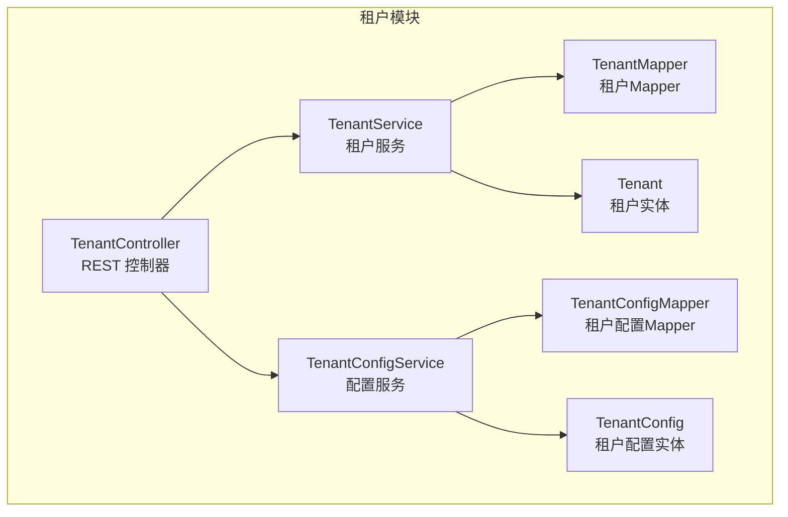
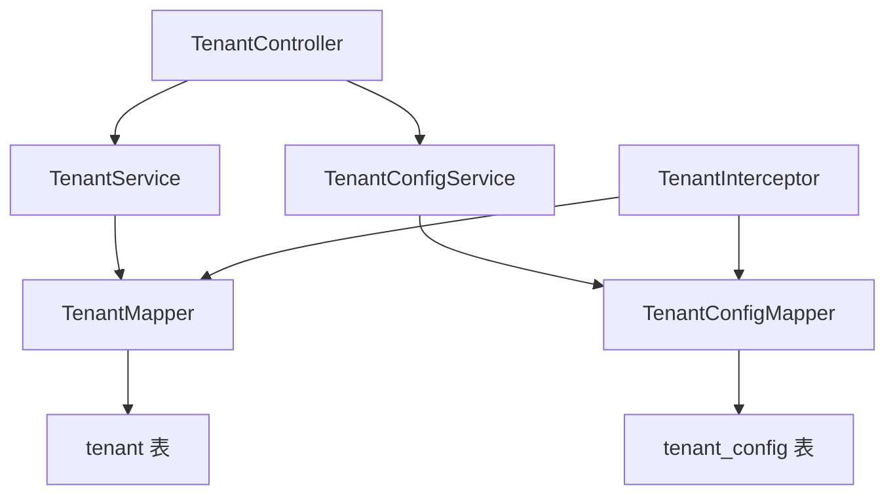
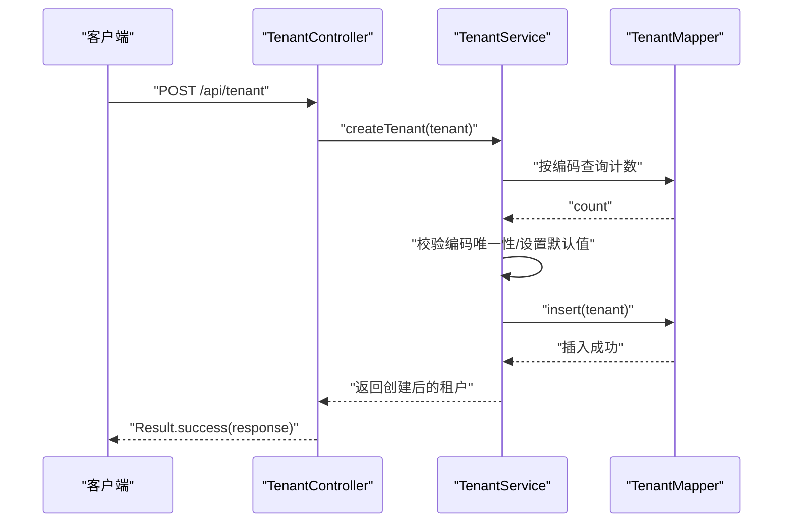
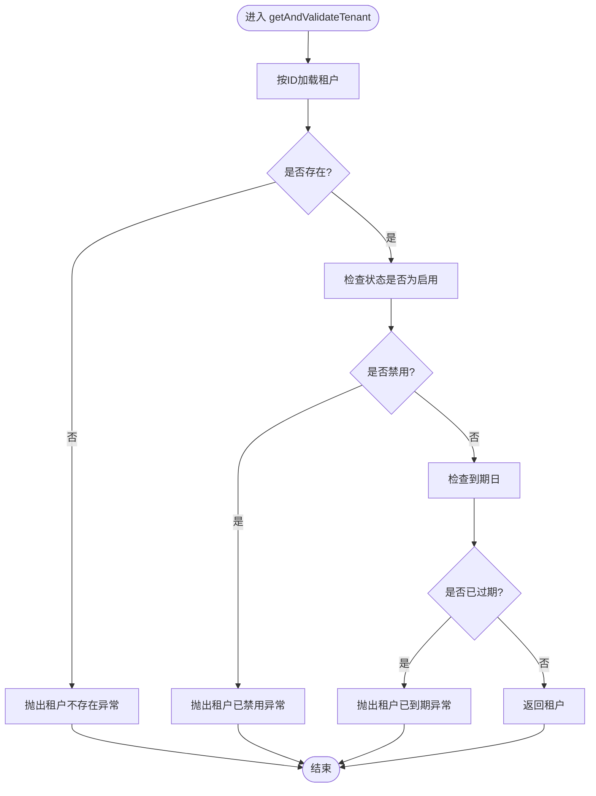
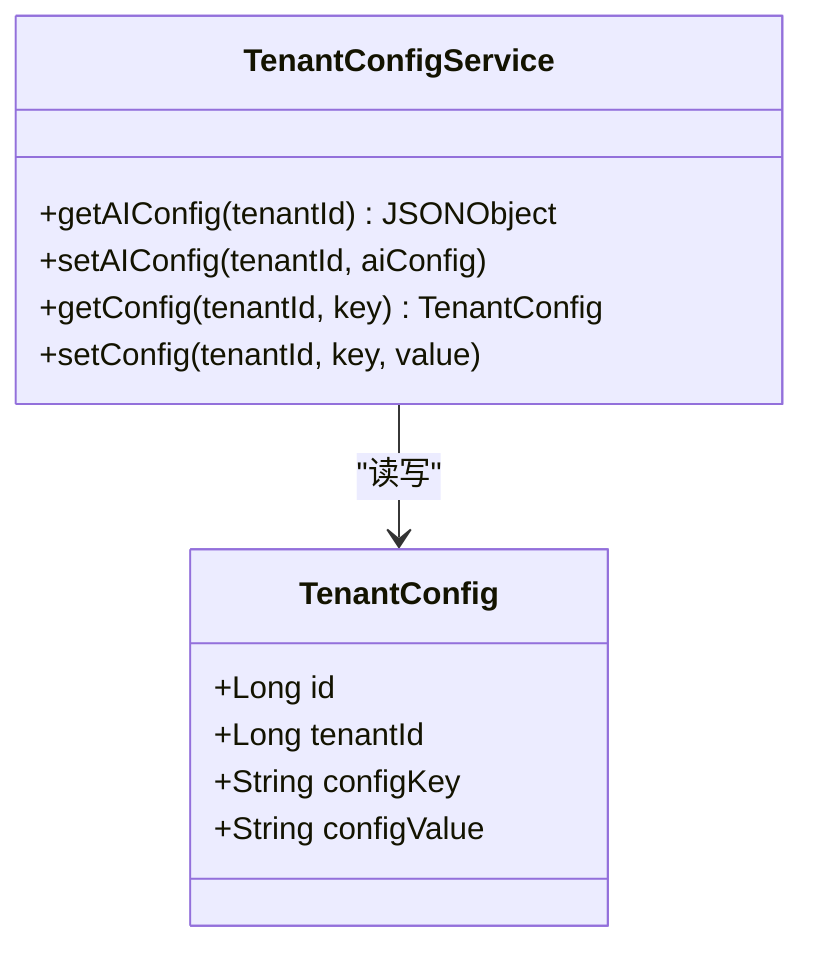
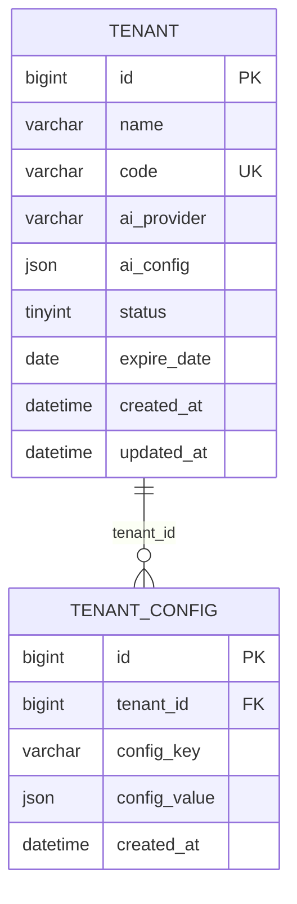
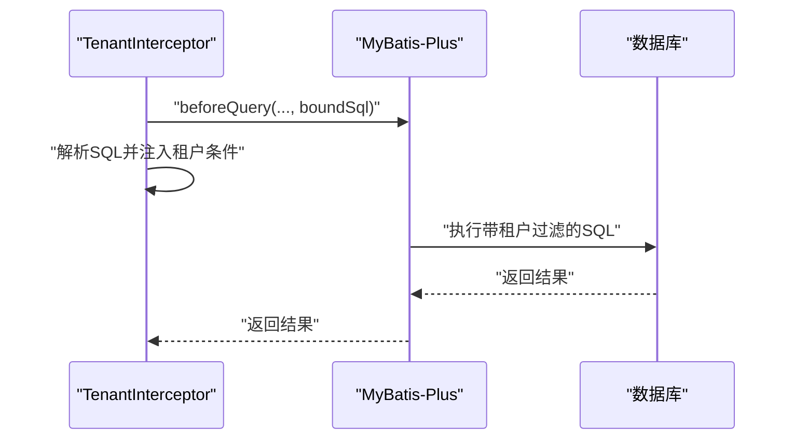
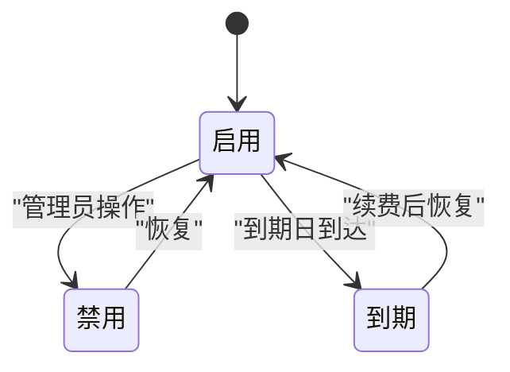
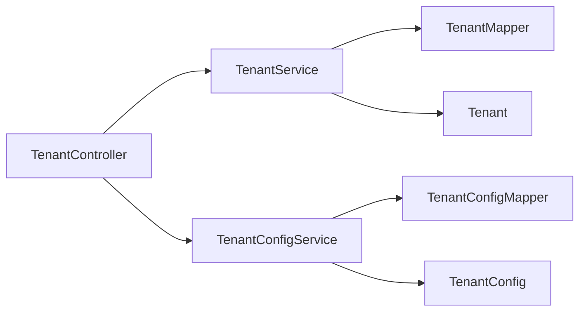

# 租户服务层

<cite>
**本文引用的文件**
- [TenantService.java](file://backend/src/main/java/com/edu/tenant/service/TenantService.java)
- [TenantConfigService.java](file://backend/src/main/java/com/edu/tenant/service/TenantConfigService.java)
- [Tenant.java](file://backend/src/main/java/com/edu/tenant/entity/Tenant.java)
- [TenantConfig.java](file://backend/src/main/java/com/edu/tenant/entity/TenantConfig.java)
- [TenantCreateRequest.java](file://backend/src/main/java/com/edu/tenant/dto/TenantCreateRequest.java)
- [TenantResponse.java](file://backend/src/main/java/com/edu/tenant/dto/TenantResponse.java)
- [TenantMapper.java](file://backend/src/main/java/com/edu/tenant/mapper/TenantMapper.java)
- [TenantConfigMapper.java](file://backend/src/main/java/com/edu/tenant/mapper/TenantConfigMapper.java)
- [TenantInterceptor.java](file://backend/src/main/java/com/edu/common/interceptor/TenantInterceptor.java)
- [TenantContextHolder.java](file://backend/src/main/java/com/edu/common/util/TenantContextHolder.java)
- [TenantException.java](file://backend/src/main/java/com/edu/common/exception/TenantException.java)
- [TenantController.java](file://backend/src/main/java/com/edu/tenant/controller/TenantController.java)
- [schema.sql](file://backend/src/main/resources/db/schema.sql)
- [TenantInterceptorTest.java](file://backend/src/test/java/com/edu/common/interceptor/TenantInterceptorTest.java)
</cite>

## 目录
1. [简介](#简介)
2. [项目结构](#项目结构)
3. [核心组件](#核心组件)
4. [架构概览](#架构概览)
5. [详细组件分析](#详细组件分析)
6. [依赖分析](#依赖分析)
7. [性能考虑](#性能考虑)
8. [故障排查指南](#故障排查指南)
9. [结论](#结论)
10. [附录](#附录)

## 简介
本文件聚焦于“租户服务层”，系统性阐述以下内容：
- TenantService 的核心业务逻辑：租户创建、租户验证（含状态与到期校验）、AI 配置更新、租户停用。
- TenantConfigService 的配置管理能力：租户配置的存储、检索与更新机制。
- 服务层与数据访问层的交互模式：MyBatis-Plus Mapper 使用、事务边界与异常处理策略。
- 租户生命周期管理：激活、停用与到期处理。
- 扩展指南：如何支持新的租户类型与新增配置项。
- 完整的业务流程图与错误处理示例。

## 项目结构
租户模块位于 backend/src/main/java/com/edu/tenant，采用按领域分层组织：
- controller：对外暴露 REST 接口
- service：业务服务层
- entity：实体模型
- mapper：MyBatis-Plus 映射接口
- dto：请求/响应数据传输对象

图表来源
- [TenantController.java:1-76](file://backend/src/main/java/com/edu/tenant/controller/TenantController.java#L1-L76)
- [TenantService.java:1-81](file://backend/src/main/java/com/edu/tenant/service/TenantService.java#L1-L81)
- [TenantConfigService.java:1-52](file://backend/src/main/java/com/edu/tenant/service/TenantConfigService.java#L1-L52)
- [Tenant.java:1-21](file://backend/src/main/java/com/edu/tenant/entity/Tenant.java#L1-L21)
- [TenantConfig.java:1-17](file://backend/src/main/java/com/edu/tenant/entity/TenantConfig.java#L1-L17)
- [TenantMapper.java:1-9](file://backend/src/main/java/com/edu/tenant/mapper/TenantMapper.java#L1-L9)
- [TenantConfigMapper.java:1-9](file://backend/src/main/java/com/edu/tenant/mapper/TenantConfigMapper.java#L1-L9)

章节来源
- [TenantController.java:1-76](file://backend/src/main/java/com/edu/tenant/controller/TenantController.java#L1-L76)
- [TenantService.java:1-81](file://backend/src/main/java/com/edu/tenant/service/TenantService.java#L1-L81)
- [TenantConfigService.java:1-52](file://backend/src/main/java/com/edu/tenant/service/TenantConfigService.java#L1-L52)

## 核心组件
- TenantService：负责租户生命周期关键操作，包括创建、查询与验证、AI 配置更新、停用。
- TenantConfigService：负责租户配置的统一存取，支持 JSON 结构化配置。
- 实体与映射：Tenant、TenantConfig 对应数据库表，Mapper 提供基础 CRUD 能力。
- 控制器：TenantController 将 DTO 转换为实体并调用服务层，返回 Result 包装结果。

章节来源
- [TenantService.java:1-81](file://backend/src/main/java/com/edu/tenant/service/TenantService.java#L1-L81)
- [TenantConfigService.java:1-52](file://backend/src/main/java/com/edu/tenant/service/TenantConfigService.java#L1-L52)
- [Tenant.java:1-21](file://backend/src/main/java/com/edu/tenant/entity/Tenant.java#L1-L21)
- [TenantConfig.java:1-17](file://backend/src/main/java/com/edu/tenant/entity/TenantConfig.java#L1-L17)
- [TenantMapper.java:1-9](file://backend/src/main/java/com/edu/tenant/mapper/TenantMapper.java#L1-L9)
- [TenantConfigMapper.java:1-9](file://backend/src/main/java/com/edu/tenant/mapper/TenantConfigMapper.java#L1-L9)
- [TenantController.java:1-76](file://backend/src/main/java/com/edu/tenant/controller/TenantController.java#L1-L76)

## 架构概览
租户服务层遵循“控制器-服务-数据访问”的分层架构，结合 MyBatis-Plus 的 ServiceImpl 提供基础 CRUD 能力，并通过注解声明事务边界。服务层对输入进行必要校验与默认值填充，确保数据一致性；同时通过 TenantInterceptor 在数据访问层自动注入租户过滤条件，保障多租户隔离。

图表来源
- [TenantController.java:1-76](file://backend/src/main/java/com/edu/tenant/controller/TenantController.java#L1-L76)
- [TenantService.java:1-81](file://backend/src/main/java/com/edu/tenant/service/TenantService.java#L1-L81)
- [TenantConfigService.java:1-52](file://backend/src/main/java/com/edu/tenant/service/TenantConfigService.java#L1-L52)
- [TenantMapper.java:1-9](file://backend/src/main/java/com/edu/tenant/mapper/TenantMapper.java#L1-L9)
- [TenantConfigMapper.java:1-9](file://backend/src/main/java/com/edu/tenant/mapper/TenantConfigMapper.java#L1-L9)
- [TenantInterceptor.java](file://backend/src/main/java/com/edu/common/interceptor/TenantInterceptor.java)

## 详细组件分析

### TenantService：租户核心服务
职责与流程
- 创建租户：校验租户编码唯一性，设置默认状态与 AI 提供商，写入数据库。
- 查询与验证：根据编码查询租户；根据 ID 获取并校验租户有效性（存在性、启用状态、未过期）。
- 更新 AI 配置：按租户 ID 更新 AI 提供商与配置 JSON。
- 停用租户：将租户状态置为禁用。

事务与异常
- 使用 @Transactional 标注关键写操作，保证一致性。
- 非法状态或过期场景抛出 TenantException，由全局异常处理器转换为 HTTP 错误。

图表来源
- [TenantController.java:20-32](file://backend/src/main/java/com/edu/tenant/controller/TenantController.java#L20-L32)
- [TenantService.java:20-36](file://backend/src/main/java/com/edu/tenant/service/TenantService.java#L20-L36)
- [TenantMapper.java:1-9](file://backend/src/main/java/com/edu/tenant/mapper/TenantMapper.java#L1-L9)

图表来源
- [TenantService.java:44-56](file://backend/src/main/java/com/edu/tenant/service/TenantService.java#L44-L56)
- [TenantException.java:1-28](file://backend/src/main/java/com/edu/common/exception/TenantException.java#L1-L28)

章节来源
- [TenantService.java:1-81](file://backend/src/main/java/com/edu/tenant/service/TenantService.java#L1-L81)
- [TenantController.java:1-76](file://backend/src/main/java/com/edu/tenant/controller/TenantController.java#L1-L76)
- [TenantException.java:1-28](file://backend/src/main/java/com/edu/common/exception/TenantException.java#L1-L28)

### TenantConfigService：租户配置管理
职责与流程
- 读取 AI 配置：按租户 ID 与固定键“ai_config”读取 JSON 配置，若为空则返回空对象。
- 设置 AI 配置：将 JSON 序列化后写入对应键位。
- 通用配置读写：按 tenant_id + config_key 查询或创建/更新配置值。

存储结构
- 配置以 JSON 文本形式存储，键空间通过 tenant_id + config_key 唯一约束，避免冲突。

图表来源
- [TenantConfigService.java:1-52](file://backend/src/main/java/com/edu/tenant/service/TenantConfigService.java#L1-L52)
- [TenantConfig.java:1-17](file://backend/src/main/java/com/edu/tenant/entity/TenantConfig.java#L1-L17)

章节来源
- [TenantConfigService.java:1-52](file://backend/src/main/java/com/edu/tenant/service/TenantConfigService.java#L1-L52)
- [TenantConfig.java:1-17](file://backend/src/main/java/com/edu/tenant/entity/TenantConfig.java#L1-L17)

### 数据模型与数据库结构
- tenant 表：保存租户基本信息、状态、到期日与 AI 配置 JSON。
- tenant_config 表：保存租户的键值配置，键空间唯一索引确保每个租户的每个配置键仅有一条记录。
- 索引覆盖：对多处外键字段建立索引，提升查询性能。

图表来源
- [schema.sql:9-31](file://backend/src/main/resources/db/schema.sql#L9-L31)

章节来源
- [schema.sql:1-379](file://backend/src/main/resources/db/schema.sql#L1-L379)

### 服务层与数据访问层交互模式
- 服务层继承 MyBatis-Plus 的 ServiceImpl，直接复用 baseMapper 进行基础 CRUD。
- 事务边界：通过 @Transactional 标注在写操作方法上，确保失败回滚。
- 多租户隔离：TenantInterceptor 在执行 SQL 前自动注入租户过滤条件，排除特定免检表（如 tenant、tenant_config、permission）。

图表来源
- [TenantInterceptor.java](file://backend/src/main/java/com/edu/common/interceptor/TenantInterceptor.java)
- [TenantInterceptorTest.java:1-142](file://backend/src/test/java/com/edu/common/interceptor/TenantInterceptorTest.java#L1-L142)

章节来源
- [TenantInterceptor.java](file://backend/src/main/java/com/edu/common/interceptor/TenantInterceptor.java)
- [TenantInterceptorTest.java:1-142](file://backend/src/test/java/com/edu/common/interceptor/TenantInterceptorTest.java#L1-L142)
- [TenantContextHolder.java:1-24](file://backend/src/main/java/com/edu/common/util/TenantContextHolder.java#L1-L24)

### 租户生命周期管理
- 激活：创建租户时默认状态为启用（1），到期日可选。
- 停用：通过禁用接口将状态置为禁用（0）。
- 到期处理：在租户验证阶段检查到期日，过期即拒绝访问。

图表来源
- [TenantService.java:44-56](file://backend/src/main/java/com/edu/tenant/service/TenantService.java#L44-L56)
- [TenantController.java:57-61](file://backend/src/main/java/com/edu/tenant/controller/TenantController.java#L57-L61)

章节来源
- [TenantService.java:1-81](file://backend/src/main/java/com/edu/tenant/service/TenantService.java#L1-L81)
- [TenantController.java:1-76](file://backend/src/main/java/com/edu/tenant/controller/TenantController.java#L1-L76)

### 扩展指南
- 支持新的租户类型
  - 在实体层新增枚举或常量表示新类型，并在服务层的创建逻辑中进行校验与默认值处理。
  - 若需要额外字段，可在数据库 schema 中增加列，并在实体与 Mapper 层同步。
- 新增配置项
  - 在 TenantConfigService 中新增专用读写方法，或沿用通用 setConfig/getConfig。
  - 在数据库 schema 中为新配置键预留存储位置（若需独立字段可扩展表结构）。
  - 在控制器层暴露对应的 API，保持请求/响应 DTO 与服务层一致。

章节来源
- [TenantConfigService.java:1-52](file://backend/src/main/java/com/edu/tenant/service/TenantConfigService.java#L1-L52)
- [schema.sql:9-31](file://backend/src/main/resources/db/schema.sql#L9-L31)

## 依赖分析
- 组件耦合
  - TenantService 与 TenantMapper 强耦合，TenantConfigService 与 TenantConfigMapper 强耦合。
  - 控制器仅依赖服务接口，降低对具体实现的耦合。
- 外部依赖
  - MyBatis-Plus 提供通用 CRUD 能力与分页支持。
  - Lombok 简化实体与服务类的样板代码。
  - FastJSON2 用于 JSON 配置的序列化与反序列化。

图表来源
- [TenantController.java:1-76](file://backend/src/main/java/com/edu/tenant/controller/TenantController.java#L1-L76)
- [TenantService.java:1-81](file://backend/src/main/java/com/edu/tenant/service/TenantService.java#L1-L81)
- [TenantConfigService.java:1-52](file://backend/src/main/java/com/edu/tenant/service/TenantConfigService.java#L1-L52)
- [TenantMapper.java:1-9](file://backend/src/main/java/com/edu/tenant/mapper/TenantMapper.java#L1-L9)
- [TenantConfigMapper.java:1-9](file://backend/src/main/java/com/edu/tenant/mapper/TenantConfigMapper.java#L1-L9)

章节来源
- [TenantController.java:1-76](file://backend/src/main/java/com/edu/tenant/controller/TenantController.java#L1-L76)
- [TenantService.java:1-81](file://backend/src/main/java/com/edu/tenant/service/TenantService.java#L1-L81)
- [TenantConfigService.java:1-52](file://backend/src/main/java/com/edu/tenant/service/TenantConfigService.java#L1-L52)

## 性能考虑
- 索引优化：对 tenant.code、tenant_config.tenant_id 与唯一键 uk_tenant_key 建立索引，减少查询与去重成本。
- JSON 字段：AI 配置与通用配置均以 JSON 存储，适合灵活扩展但需注意查询与更新的原子性。
- 事务范围：将写操作聚合在单个事务中，避免跨事务的数据不一致。
- 多租户拦截：在 SQL 层注入租户条件，避免应用层重复拼接过滤条件，提升可维护性。

章节来源
- [schema.sql:22-31](file://backend/src/main/resources/db/schema.sql#L22-L31)
- [TenantInterceptor.java](file://backend/src/main/java/com/edu/common/interceptor/TenantInterceptor.java)

## 故障排查指南
常见问题与处理
- 租户编码重复
  - 现象：创建租户时报错“租户编码已存在”。
  - 处理：更换唯一编码后重试。
- 租户不存在/已禁用/已到期
  - 现象：访问租户详情或执行业务操作时被拒绝。
  - 处理：确认租户 ID 是否正确；联系管理员启用租户或续费。
- 配置读取为空
  - 现象：读取 AI 配置返回空对象。
  - 处理：确认配置键是否存在且值非空；通过设置接口写入有效 JSON。
- SQL 注入租户条件失败
  - 现象：解析非法 SQL 导致运行时异常。
  - 处理：检查传入 SQL 的合法性；确保使用框架提供的查询方式。

章节来源
- [TenantService.java:20-36](file://backend/src/main/java/com/edu/tenant/service/TenantService.java#L20-L36)
- [TenantService.java:44-56](file://backend/src/main/java/com/edu/tenant/service/TenantService.java#L44-L56)
- [TenantConfigService.java:18-28](file://backend/src/main/java/com/edu/tenant/service/TenantConfigService.java#L18-L28)
- [TenantInterceptorTest.java:96-115](file://backend/src/test/java/com/edu/common/interceptor/TenantInterceptorTest.java#L96-L115)

## 结论
租户服务层通过清晰的分层设计与完善的异常处理，实现了租户全生命周期管理与配置的灵活扩展。配合多租户拦截器与数据库索引优化，既保证了业务正确性，也兼顾了性能与可维护性。后续可通过实体与配置键的扩展，平滑支持更多租户类型与业务场景。

## 附录
- 请求/响应对象
  - 创建请求：TenantCreateRequest
  - 响应对象：TenantResponse
- 关键实体
  - Tenant：租户主表
  - TenantConfig：租户配置表
- 数据库脚本
  - schema.sql 中定义了租户与配置表结构、索引与约束

章节来源
- [TenantCreateRequest.java:1-21](file://backend/src/main/java/com/edu/tenant/dto/TenantCreateRequest.java#L1-L21)
- [TenantResponse.java:1-18](file://backend/src/main/java/com/edu/tenant/dto/TenantResponse.java#L1-L18)
- [schema.sql:9-31](file://backend/src/main/resources/db/schema.sql#L9-L31)