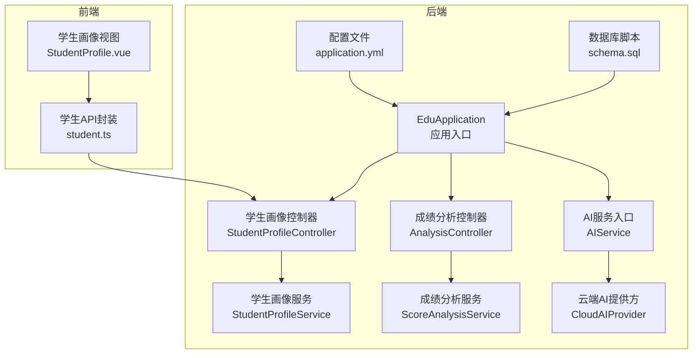
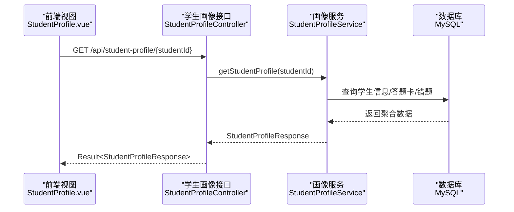
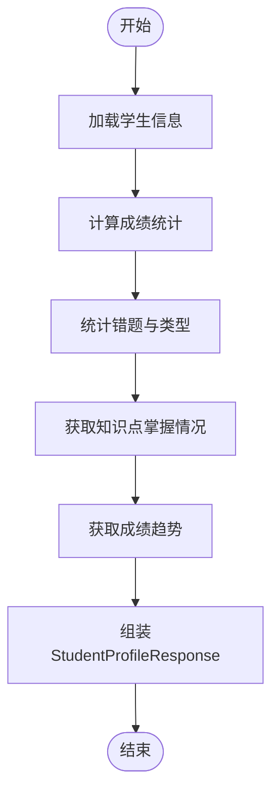
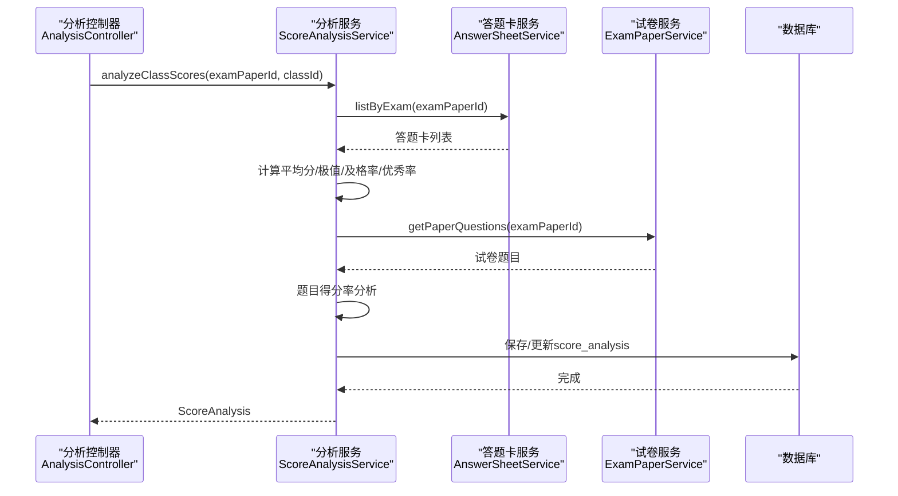
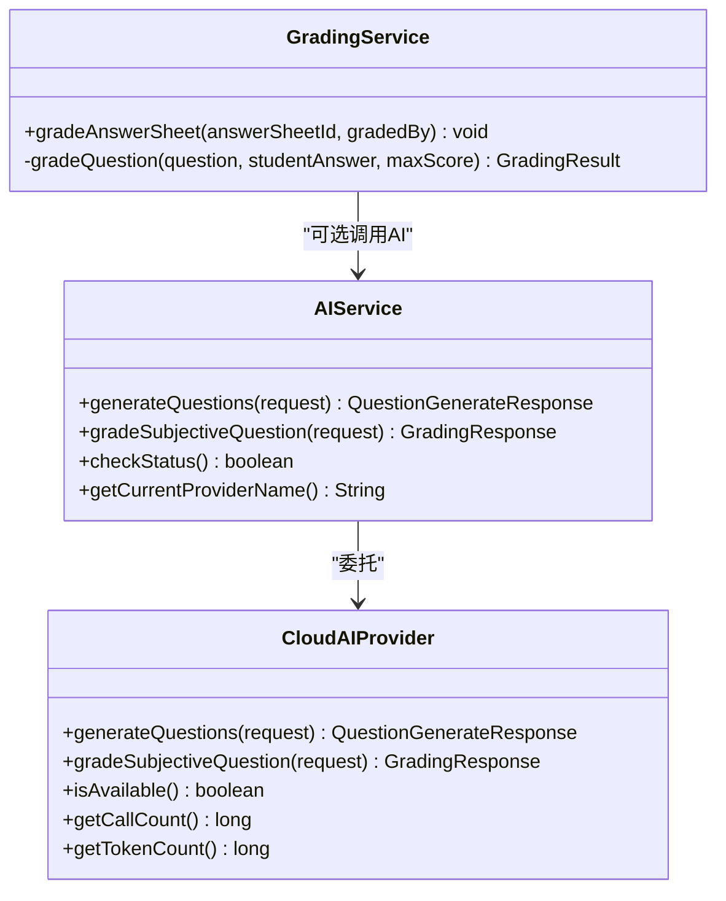
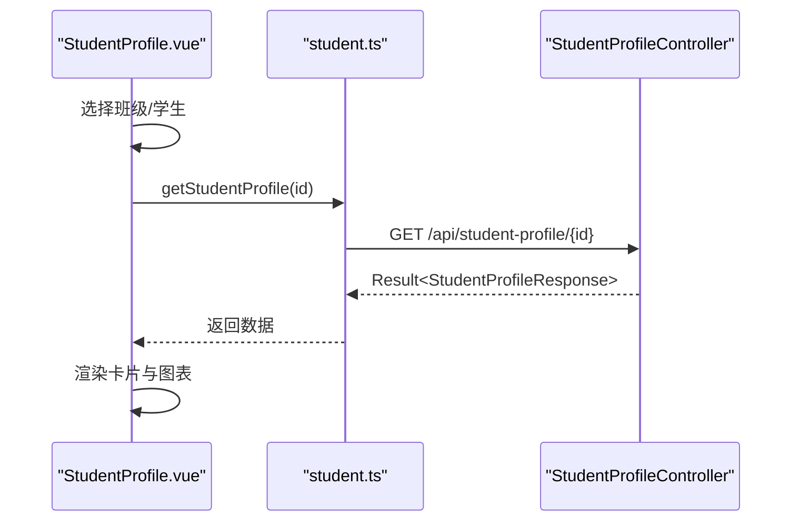
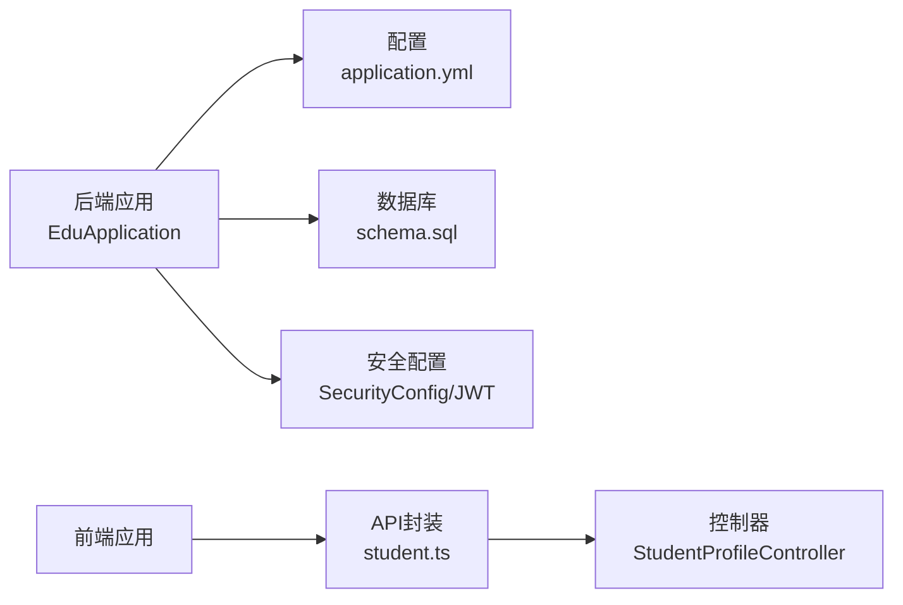
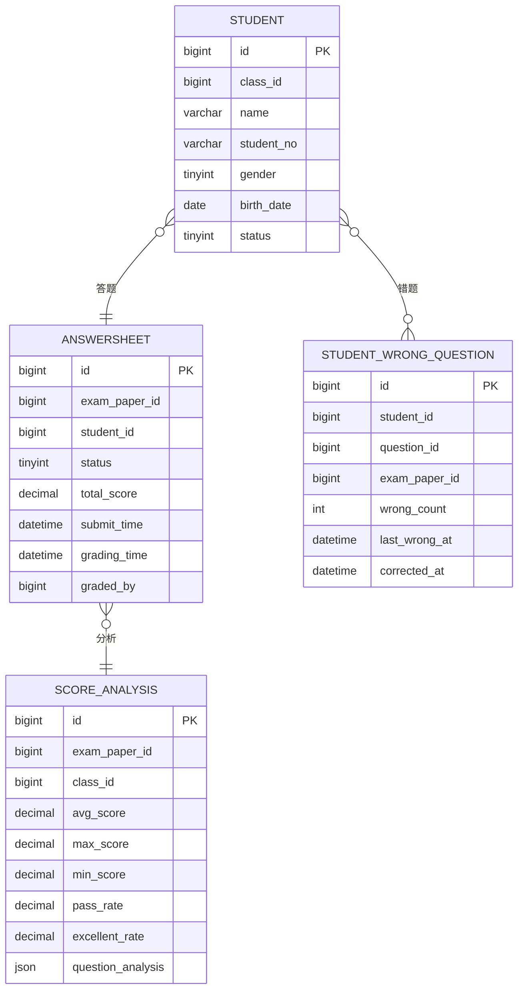

# 学生画像

<cite>
**本文引用的文件**
- [EduApplication.java](file://backend/src/main/java/com/edu/EduApplication.java)
- [application.yml](file://backend/src/main/resources/application.yml)
- [schema.sql](file://backend/src/main/resources/db/schema.sql)
- [StudentProfileController.java](file://backend/src/main/java/com/edu/user/controller/StudentProfileController.java)
- [StudentProfileService.java](file://backend/src/main/java/com/edu/user/service/StudentProfileService.java)
- [StudentProfileResponse.java](file://backend/src/main/java/com/edu/user/dto/StudentProfileResponse.java)
- [Student.java](file://backend/src/main/java/com/edu/user/entity/Student.java)
- [AnalysisController.java](file://backend/src/main/java/com/edu/grading/controller/AnalysisController.java)
- [ScoreAnalysisService.java](file://backend/src/main/java/com/edu/grading/service/ScoreAnalysisService.java)
- [ScoreAnalysisResponse.java](file://backend/src/main/java/com/edu/grading/dto/ScoreAnalysisResponse.java)
- [AnswerSheet.java](file://backend/src/main/java/com/edu/grading/entity/AnswerSheet.java)
- [StudentWrongQuestion.java](file://backend/src/main/java/com/edu/grading/entity/StudentWrongQuestion.java)
- [GradingService.java](file://backend/src/main/java/com/edu/grading/service/GradingService.java)
- [AIService.java](file://backend/src/main/java/com/edu/ai/service/AIService.java)
- [CloudAIProvider.java](file://backend/src/main/java/com/edu/ai/provider/CloudAIProvider.java)
- [StudentProfile.vue](file://frontend/src/views/StudentProfile.vue)
- [student.ts](file://frontend/src/api/student.ts)
</cite>

## 目录
1. [简介](#简介)
2. [项目结构](#项目结构)
3. [核心组件](#核心组件)
4. [架构总览](#架构总览)
5. [详细组件分析](#详细组件分析)
6. [依赖分析](#依赖分析)
7. [性能考虑](#性能考虑)
8. [故障排查指南](#故障排查指南)
9. [结论](#结论)
10. [附录](#附录)

## 简介
本模块围绕“学生画像”展开，目标是构建一个以数据驱动的学习分析与画像系统，覆盖以下能力：
- 学习行为追踪：基于答题卡与错题记录，统计考试次数、分数趋势、错题分布等。
- 知识掌握度评估：通过错题与知识点标签，量化知识点掌握率与等级。
- 能力水平预测：结合历史成绩趋势与班级均分对比，给出阶段性能力评价。
- 学生信息管理：提供基本信息、学习记录与成长轨迹的查询与维护。
- 个性化推荐机制：基于错题与知识点掌握度，规划学习资源与练习路径（当前为概念设计，具体实现需扩展）。
- 数据分析算法：统计分析（平均分、及格率、优秀率）、题目得分率分析、可视化展示。
- 数据模型与API：定义学生档案、学习记录与分析报告的数据结构，并提供REST接口。
- 隐私与安全：租户隔离、JWT鉴权、参数校验与异常处理。

## 项目结构
后端采用Spring Boot + MyBatis-Plus，数据库初始化脚本与基础配置位于resources目录；前端Vue3 + Element Plus提供可视化界面。

图表来源
- [EduApplication.java:1-15](file://backend/src/main/java/com/edu/EduApplication.java#L1-L15)
- [application.yml:1-65](file://backend/src/main/resources/application.yml#L1-L65)
- [schema.sql:1-379](file://backend/src/main/resources/db/schema.sql#L1-L379)
- [StudentProfileController.java:1-81](file://backend/src/main/java/com/edu/user/controller/StudentProfileController.java#L1-L81)
- [StudentProfileService.java:1-253](file://backend/src/main/java/com/edu/user/service/StudentProfileService.java#L1-L253)
- [AnalysisController.java:1-143](file://backend/src/main/java/com/edu/grading/controller/AnalysisController.java#L1-L143)
- [ScoreAnalysisService.java:1-171](file://backend/src/main/java/com/edu/grading/service/ScoreAnalysisService.java#L1-L171)
- [AIService.java:1-102](file://backend/src/main/java/com/edu/ai/service/AIService.java#L1-L102)
- [CloudAIProvider.java:1-267](file://backend/src/main/java/com/edu/ai/provider/CloudAIProvider.java#L1-L267)
- [StudentProfile.vue:1-343](file://frontend/src/views/StudentProfile.vue#L1-L343)
- [student.ts:1-26](file://frontend/src/api/student.ts#L1-L26)

章节来源
- [EduApplication.java:1-15](file://backend/src/main/java/com/edu/EduApplication.java#L1-L15)
- [application.yml:1-65](file://backend/src/main/resources/application.yml#L1-L65)
- [schema.sql:1-379](file://backend/src/main/resources/db/schema.sql#L1-L379)

## 核心组件
- 学生画像控制器与服务：负责聚合学生基本信息、成绩统计、知识点掌握、错题分析与成绩趋势。
- 成绩分析控制器与服务：负责班级维度的统计分析（平均分、最高/最低分、及格率、优秀率、题目得分率）。
- AI服务与提供方：统一接入云端AI，支持题目生成与主观题智能批改。
- 前端视图与API封装：提供学生画像页面、班级与学生选择、数据展示与交互。

章节来源
- [StudentProfileController.java:1-81](file://backend/src/main/java/com/edu/user/controller/StudentProfileController.java#L1-L81)
- [StudentProfileService.java:1-253](file://backend/src/main/java/com/edu/user/service/StudentProfileService.java#L1-L253)
- [AnalysisController.java:1-143](file://backend/src/main/java/com/edu/grading/controller/AnalysisController.java#L1-L143)
- [ScoreAnalysisService.java:1-171](file://backend/src/main/java/com/edu/grading/service/ScoreAnalysisService.java#L1-L171)
- [AIService.java:1-102](file://backend/src/main/java/com/edu/ai/service/AIService.java#L1-L102)
- [CloudAIProvider.java:1-267](file://backend/src/main/java/com/edu/ai/provider/CloudAIProvider.java#L1-L267)
- [StudentProfile.vue:1-343](file://frontend/src/views/StudentProfile.vue#L1-L343)
- [student.ts:1-26](file://frontend/src/api/student.ts#L1-L26)

## 架构总览
系统采用前后端分离架构，后端提供REST接口，前端通过HTTP请求获取数据并渲染可视化图表。

图表来源
- [StudentProfileController.java:24-31](file://backend/src/main/java/com/edu/user/controller/StudentProfileController.java#L24-L31)
- [StudentProfileService.java:37-71](file://backend/src/main/java/com/edu/user/service/StudentProfileService.java#L37-L71)
- [StudentProfileResponse.java:1-102](file://backend/src/main/java/com/edu/user/dto/StudentProfileResponse.java#L1-L102)

## 详细组件分析

### 学生画像模块
- 功能职责
  - 获取学生画像详情：基本信息、成绩统计、知识点掌握、错题分析、成绩趋势。
  - 获取班级学生画像列表：按班级过滤在读学生并生成画像。
  - 获取知识点掌握情况：基于错题统计与知识点标签，计算掌握率与等级。
  - 获取成绩趋势：最近N次考试的分数与时间序列。
  - 更新学生兴趣爱好：预留字段，便于后续扩展个性化推荐。

- 数据流与处理逻辑
  - 成绩统计：筛选已批改且总分非空的答题卡，计算考试次数、平均分、最高/最低分。
  - 错题统计：统计总错题数、已纠错数、错题类型分布。
  - 知识点掌握：当前返回模拟数据，实际应结合题目表的知识点标签进行统计。
  - 成绩趋势：按批改时间倒序取最近N次，组装考试名称、日期与分数。

图表来源
- [StudentProfileService.java:37-71](file://backend/src/main/java/com/edu/user/service/StudentProfileService.java#L37-L71)
- [StudentProfileService.java:192-227](file://backend/src/main/java/com/edu/user/service/StudentProfileService.java#L192-L227)
- [StudentProfileService.java:144-178](file://backend/src/main/java/com/edu/user/service/StudentProfileService.java#L144-L178)
- [StudentProfileService.java:92-114](file://backend/src/main/java/com/edu/user/service/StudentProfileService.java#L92-L114)
- [StudentProfileService.java:119-139](file://backend/src/main/java/com/edu/user/service/StudentProfileService.java#L119-L139)

章节来源
- [StudentProfileController.java:24-81](file://backend/src/main/java/com/edu/user/controller/StudentProfileController.java#L24-L81)
- [StudentProfileService.java:37-253](file://backend/src/main/java/com/edu/user/service/StudentProfileService.java#L37-L253)
- [StudentProfileResponse.java:1-102](file://backend/src/main/java/com/edu/user/dto/StudentProfileResponse.java#L1-L102)
- [Student.java:1-22](file://backend/src/main/java/com/edu/user/entity/Student.java#L1-L22)

### 成绩分析模块
- 功能职责
  - 分析班级成绩：计算平均分、最高/最低分、及格率、优秀率。
  - 题目得分率分析：按题统计平均得分与正确率。
  - 获取分析结果：按考试与班级维度查询缓存或历史分析。
  - 错题管理：获取学生错题列表、标记已纠错、高频错题统计。

- 处理流程
  - 从答题卡中筛选指定考试的答卷，过滤有效分数。
  - 计算平均分、极值、及格率（以平均分的60%为线）、优秀率（以平均分的90%为线）。
  - 遍历试卷题目，统计每题的得分分布并计算平均得分与正确率。
  - 将分析结果持久化到score_analysis表，供后续查询。

图表来源
- [AnalysisController.java:35-58](file://backend/src/main/java/com/edu/grading/controller/AnalysisController.java#L35-L58)
- [ScoreAnalysisService.java:40-97](file://backend/src/main/java/com/edu/grading/service/ScoreAnalysisService.java#L40-L97)
- [ScoreAnalysisService.java:143-170](file://backend/src/main/java/com/edu/grading/service/ScoreAnalysisService.java#L143-L170)

章节来源
- [AnalysisController.java:1-143](file://backend/src/main/java/com/edu/grading/controller/AnalysisController.java#L1-L143)
- [ScoreAnalysisService.java:1-171](file://backend/src/main/java/com/edu/grading/service/ScoreAnalysisService.java#L1-L171)
- [ScoreAnalysisResponse.java:1-44](file://backend/src/main/java/com/edu/grading/dto/ScoreAnalysisResponse.java#L1-L44)

### AI智能批改与推荐（概念设计）
- 当前实现
  - AIService作为统一入口，根据租户上下文选择AI提供方（云端或私有）。
  - CloudAIProvider对接云端模型，支持题目生成与主观题批改，返回JSON结构的结果。
  - GradingService提供规则引擎式批改（选择、填空、判断、计算），并与错题记录联动。

- 个性化推荐机制（概念）
  - 基于知识点掌握率与错题类型分布，推荐对应知识点的练习与讲解资源。
  - 基于成绩趋势与班级均分，动态调整练习难度与题量。
  - 结合学习风格（预留字段）与兴趣爱好，定制学习路径。

图表来源
- [AIService.java:27-50](file://backend/src/main/java/com/edu/ai/service/AIService.java#L27-L50)
- [CloudAIProvider.java:53-105](file://backend/src/main/java/com/edu/ai/provider/CloudAIProvider.java#L53-L105)
- [GradingService.java:34-80](file://backend/src/main/java/com/edu/grading/service/GradingService.java#L34-L80)

章节来源
- [AIService.java:1-102](file://backend/src/main/java/com/edu/ai/service/AIService.java#L1-L102)
- [CloudAIProvider.java:1-267](file://backend/src/main/java/com/edu/ai/provider/CloudAIProvider.java#L1-L267)
- [GradingService.java:1-232](file://backend/src/main/java/com/edu/grading/service/GradingService.java#L1-L232)

### 前端集成与可视化
- 页面逻辑
  - 加载班级列表与学生列表，支持按班级筛选学生。
  - 请求后端接口获取学生画像，渲染基本信息、成绩概览、错题统计、知识点掌握与成绩趋势。
  - 使用Element Plus组件与ECharts进行可视化展示。

图表来源
- [StudentProfile.vue:185-223](file://frontend/src/views/StudentProfile.vue#L185-L223)
- [student.ts:4-6](file://frontend/src/api/student.ts#L4-L6)

章节来源
- [StudentProfile.vue:1-343](file://frontend/src/views/StudentProfile.vue#L1-L343)
- [student.ts:1-26](file://frontend/src/api/student.ts#L1-L26)

## 依赖分析
- 后端依赖
  - Spring Boot、MyBatis-Plus、MySQL、Redis自动配置（可选）、JWT安全配置。
  - 租户上下文与拦截器用于多租户隔离。
- 前端依赖
  - Vue3、Element Plus、路由与状态管理、HTTP请求封装。

图表来源
- [EduApplication.java:1-15](file://backend/src/main/java/com/edu/EduApplication.java#L1-L15)
- [application.yml:1-65](file://backend/src/main/resources/application.yml#L1-L65)
- [schema.sql:1-379](file://backend/src/main/resources/db/schema.sql#L1-L379)

章节来源
- [EduApplication.java:1-15](file://backend/src/main/java/com/edu/EduApplication.java#L1-L15)
- [application.yml:1-65](file://backend/src/main/resources/application.yml#L1-L65)
- [schema.sql:1-379](file://backend/src/main/resources/db/schema.sql#L1-L379)

## 性能考虑
- 数据库索引
  - 对答题卡、答案、错题、分析表建立必要索引，提升查询效率。
- 分页与限制
  - 成绩趋势限制最近N次，避免大结果集。
- 缓存策略
  - 可引入Redis缓存热点画像与分析结果（当前配置中Redis自动配置被禁用，可按需启用）。
- 批量操作
  - 成绩分析批量统计题目得分，减少循环开销。
- 前端渲染
  - 图表按需渲染，避免不必要的重绘。

## 故障排查指南
- 常见问题
  - 学生不存在：接口返回错误提示，检查studentId与数据库记录。
  - 无答题数据：分析接口返回“无答题数据”，确认考试状态与答题卡是否已批改。
  - AI服务未配置：云端AI提供方返回不可用，检查配置文件中的API Key与模型参数。
- 日志定位
  - 后端开启调试日志，观察服务层与AI提供方的日志输出。
- 参数校验
  - 前端传参需包含必填项（如班级ID、学生ID），后端接口会进行参数校验与异常处理。

章节来源
- [StudentProfileController.java:27-30](file://backend/src/main/java/com/edu/user/controller/StudentProfileController.java#L27-L30)
- [AnalysisController.java:41-42](file://backend/src/main/java/com/edu/grading/controller/AnalysisController.java#L41-L42)
- [CloudAIProvider.java:108-110](file://backend/src/main/java/com/edu/ai/provider/CloudAIProvider.java#L108-L110)

## 结论
本模块以“学生画像”为核心，整合了学习行为追踪、知识掌握度评估与能力水平预测的基础能力，并提供了可扩展的AI智能批改与个性化推荐框架。通过清晰的数据模型与REST接口，配合前端可视化展示，能够为教师与管理者提供全面的学生学习分析视图。后续可在以下方面持续演进：
- 完善知识点统计与推荐算法，引入机器学习模型进行能力预测。
- 扩展学生兴趣与学习风格字段，构建更精准的个性化路径。
- 引入缓存与异步任务，优化大数据量场景下的性能表现。

## 附录

### 数据模型设计
- 学生表：包含基本信息、班级与状态。
- 答题卡表：记录考试、学生、状态、总分与批改信息。
- 错题记录表：记录学生错题、错误次数与纠错时间。
- 成绩分析表：记录班级维度的统计指标与题目分析。
- 题目与试卷：支撑题目内容、知识点与试卷结构。

图表来源
- [schema.sql:131-146](file://backend/src/main/resources/db/schema.sql#L131-L146)
- [schema.sql:235-250](file://backend/src/main/resources/db/schema.sql#L235-L250)
- [schema.sql:285-297](file://backend/src/main/resources/db/schema.sql#L285-L297)
- [schema.sql:269-283](file://backend/src/main/resources/db/schema.sql#L269-L283)

### API接口文档（节选）
- 获取学生画像详情
  - 方法：GET
  - 路径：/api/student-profile/{studentId}
  - 响应：Result<StudentProfileResponse>
- 获取班级学生画像列表
  - 方法：GET
  - 路径：/api/student-profile/class/{classId}
  - 响应：Result<List<StudentProfileResponse>>
- 获取学生知识点掌握情况
  - 方法：GET
  - 路径：/api/student-profile/{studentId}/knowledge-points
  - 响应：Result<List<KnowledgePointStats>>
- 获取学生成绩趋势
  - 方法：GET
  - 路径：/api/student-profile/{studentId}/score-trends
  - 响应：Result<List<ScoreTrend>>
- 更新学生兴趣爱好
  - 方法：PUT
  - 路径：/api/student-profile/{studentId}/interests
  - 参数：interests、talents、learningStyle
  - 响应：Result<Void>

章节来源
- [StudentProfileController.java:24-81](file://backend/src/main/java/com/edu/user/controller/StudentProfileController.java#L24-L81)
- [student.ts:4-26](file://frontend/src/api/student.ts#L4-L26)

### 隐私保护与数据安全
- 租户隔离：通过租户ID与上下文管理，确保数据与配置的隔离。
- JWT鉴权：登录认证与访问控制，防止未授权访问。
- 参数校验与异常处理：统一返回Result结构，避免敏感信息泄露。
- 逻辑删除：使用deleted字段进行软删除，保障数据可恢复性。

章节来源
- [application.yml:45-47](file://backend/src/main/resources/application.yml#L45-L47)
- [schema.sql:48-62](file://backend/src/main/resources/db/schema.sql#L48-L62)