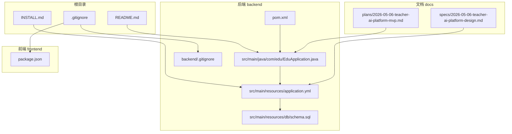
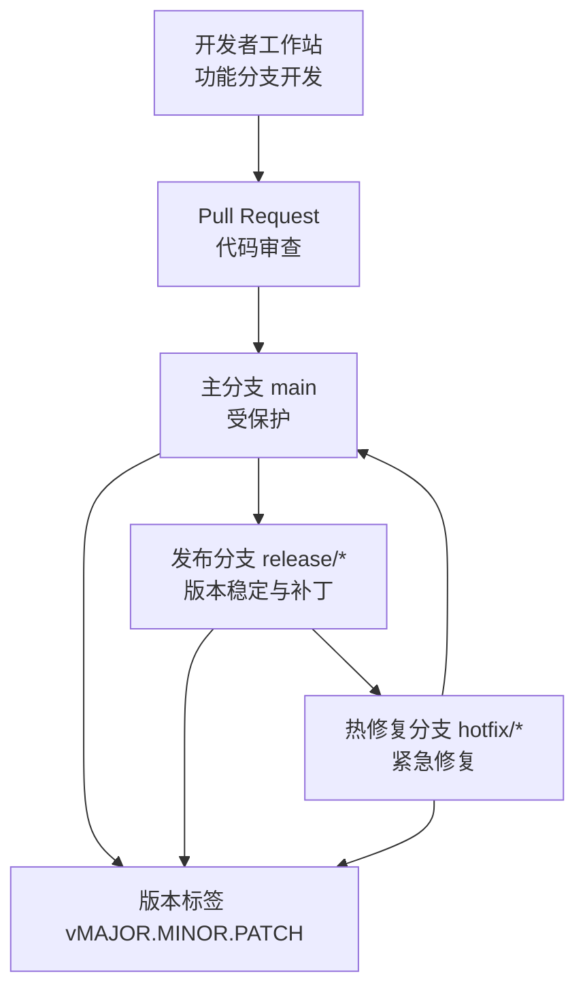
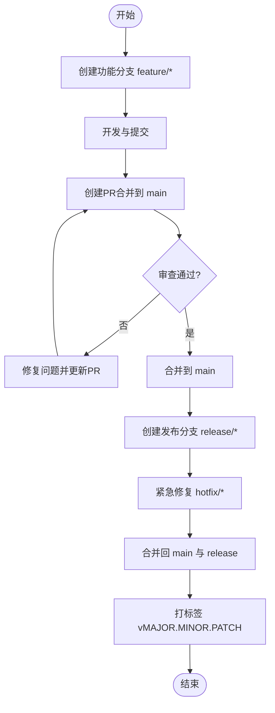
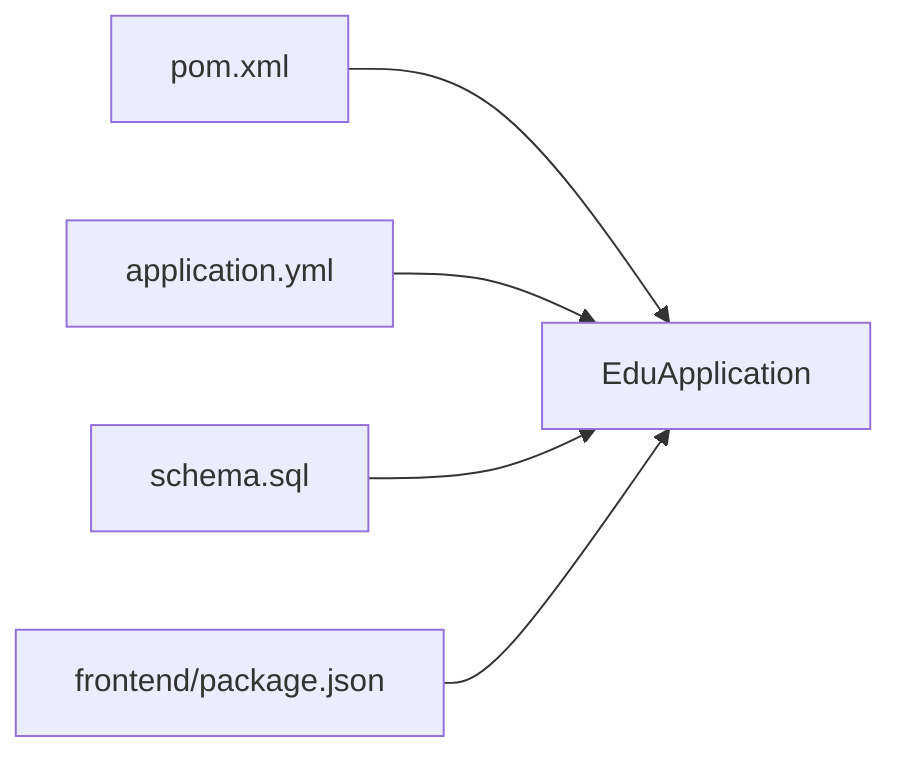

# Git工作流与代码审查

<cite>
**本文档引用的文件**
- [README.md](file://README.md)
- [INSTALL.md](file://INSTALL.md)
- [.gitignore](file://.gitignore)
- [backend/.gitignore](file://backend/.gitignore)
- [docs/superpowers/plans/2026-05-06-teacher-ai-platform-mvp.md](file://docs/superpowers/plans/2026-05-06-teacher-ai-platform-mvp.md)
- [docs/superpowers/specs/2026-05-06-teacher-ai-platform-design.md](file://docs/superpowers/specs/2026-05-06-teacher-ai-platform-design.md)
- [backend/pom.xml](file://backend/pom.xml)
- [backend/src/main/java/com/edu/EduApplication.java](file://backend/src/main/java/com/edu/EduApplication.java)
- [backend/src/main/resources/application.yml](file://backend/src/main/resources/application.yml)
- [backend/src/main/resources/db/schema.sql](file://backend/src/main/resources/db/schema.sql)
- [frontend/package.json](file://frontend/package.json)
</cite>

## 目录
1. [引言](#引言)
2. [项目结构](#项目结构)
3. [核心组件](#核心组件)
4. [架构总览](#架构总览)
5. [详细组件分析](#详细组件分析)
6. [依赖分析](#依赖分析)
7. [性能考虑](#性能考虑)
8. [故障排查指南](#故障排查指南)
9. [结论](#结论)
10. [附录](#附录)

## 引言
本指南面向“教师智能教学系统”项目团队，提供一套完整的Git工作流与代码审查实践方案。内容覆盖分支管理策略、提交规范、代码审查流程、冲突解决策略、版本标签与发布管理、常用Git工具技巧，以及团队协作与远程仓库管理建议。所有建议均结合项目现有结构与文档进行落地化设计，便于团队快速建立高效、可追溯、可审计的协作机制。

## 项目结构
项目采用前后端分离架构，后端为Spring Boot单体应用，前端为Vue 3 SPA，配合MySQL与可选Redis。根目录提供安装与启动说明，docs目录包含产品计划与系统设计文档，backend与frontend分别承载后端与前端源码。

**图表来源**
- [README.md:1-88](file://README.md#L1-L88)
- [INSTALL.md:1-134](file://INSTALL.md#L1-L134)
- [backend/src/main/java/com/edu/EduApplication.java:1-15](file://backend/src/main/java/com/edu/EduApplication.java#L1-L15)
- [backend/src/main/resources/application.yml:1-65](file://backend/src/main/resources/application.yml#L1-L65)
- [backend/src/main/resources/db/schema.sql:1-379](file://backend/src/main/resources/db/schema.sql#L1-L379)
- [backend/pom.xml:1-152](file://backend/pom.xml#L1-L152)
- [frontend/package.json:1-25](file://frontend/package.json#L1-L25)
- [docs/superpowers/plans/2026-05-06-teacher-ai-platform-mvp.md:1-2346](file://docs/superpowers/plans/2026-05-06-teacher-ai-platform-mvp.md#L1-L2346)
- [docs/superpowers/specs/2026-05-06-teacher-ai-platform-design.md:1-666](file://docs/superpowers/specs/2026-05-06-teacher-ai-platform-design.md#L1-L666)

**章节来源**
- [README.md:1-88](file://README.md#L1-L88)
- [INSTALL.md:1-134](file://INSTALL.md#L1-L134)
- [backend/src/main/java/com/edu/EduApplication.java:1-15](file://backend/src/main/java/com/edu/EduApplication.java#L1-L15)
- [backend/src/main/resources/application.yml:1-65](file://backend/src/main/resources/application.yml#L1-L65)
- [backend/src/main/resources/db/schema.sql:1-379](file://backend/src/main/resources/db/schema.sql#L1-L379)
- [backend/pom.xml:1-152](file://backend/pom.xml#L1-L152)
- [frontend/package.json:1-25](file://frontend/package.json#L1-L25)
- [docs/superpowers/plans/2026-05-06-teacher-ai-platform-mvp.md:1-2346](file://docs/superpowers/plans/2026-05-06-teacher-ai-platform-mvp.md#L1-L2346)
- [docs/superpowers/specs/2026-05-06-teacher-ai-platform-design.md:1-666](file://docs/superpowers/specs/2026-05-06-teacher-ai-platform-design.md#L1-L666)

## 核心组件
- 后端应用入口与配置：EduApplication负责启动Spring Boot应用；application.yml集中管理数据库、Redis、JWT、AI服务等配置。
- 数据库Schema：schema.sql定义了租户、用户、组织架构、试卷、批改、PPT等模块的表结构与索引。
- 文档与计划：MVP计划与系统设计文档明确了模块职责、数据模型与技术选型，为分支与任务拆分提供依据。
- 前端工程：package.json声明依赖与脚本，支撑开发与构建流程。
- 依赖管理：pom.xml定义后端依赖栈，含MyBatis-Plus、JWT、Redis、H2等。

**章节来源**
- [backend/src/main/java/com/edu/EduApplication.java:1-15](file://backend/src/main/java/com/edu/EduApplication.java#L1-L15)
- [backend/src/main/resources/application.yml:1-65](file://backend/src/main/resources/application.yml#L1-L65)
- [backend/src/main/resources/db/schema.sql:1-379](file://backend/src/main/resources/db/schema.sql#L1-L379)
- [docs/superpowers/plans/2026-05-06-teacher-ai-platform-mvp.md:1-2346](file://docs/superpowers/plans/2026-05-06-teacher-ai-platform-mvp.md#L1-L2346)
- [docs/superpowers/specs/2026-05-06-teacher-ai-platform-design.md:1-666](file://docs/superpowers/specs/2026-05-06-teacher-ai-platform-design.md#L1-L666)
- [frontend/package.json:1-25](file://frontend/package.json#L1-L25)
- [backend/pom.xml:1-152](file://backend/pom.xml#L1-L152)

## 架构总览
下图展示项目整体架构与Git工作流的关系：开发者在功能分支上迭代，通过Pull Request进行代码审查，主分支受保护，发布分支用于稳定版本管理与热修复。

[此图为概念性架构示意，不直接映射具体源文件，故无图表来源]

## 详细组件分析

### 分支管理策略
- 主分支保护
  - main分支应开启保护规则：禁止直接推送、强制启用管理员审批、要求至少一名审查者批准、必须通过CI检查。
  - 任何改动必须通过PR合并，避免绕过审查。
- 功能分支
  - 命名规范：feature/模块名/简短描述，例如feature/exam/question-bank。
  - 从main派生，完成开发后向main发起PR。
- 发布分支
  - 当准备发布候选版本时，从main创建release/vMAJOR.MINOR.X，仅允许紧急修复与文档更新。
  - 发布完成后合并回main与develop，并打上对应标签。
- 热修复分支
  - 从main或release分支创建hotfix/*，修复后立即合并回main与release，并打标签。

[此图为流程示意，不直接映射具体源文件，故无图表来源]

**章节来源**
- [docs/superpowers/plans/2026-05-06-teacher-ai-platform-mvp.md:1-2346](file://docs/superpowers/plans/2026-05-06-teacher-ai-platform-mvp.md#L1-L2346)
- [docs/superpowers/specs/2026-05-06-teacher-ai-platform-design.md:1-666](file://docs/superpowers/specs/2026-05-06-teacher-ai-platform-design.md#L1-L666)

### 提交规范与消息格式
- Conventional Commits规范
  - 类型：feat、fix、docs、style、refactor、perf、test、build、ci、chore、revert
  - 范围：可选，如ai、exam、grading、tenant、common
  - 描述：简洁明了，使用祈使句，不超过50字符
  - 举例：feat(ai): 支持私有AI服务切换；fix(exam): 修复模板生成分数计算错误
- 提交信息模板
  - 为团队统一提交风格，可在本地配置模板文件，包含类型/范围/描述/动机/变更影响等占位符。
- 与版本控制联动
  - feat与fix直接影响语义化版本的次版本与修订版本；重大重构可能触发主版本升级。

**章节来源**
- [docs/superpowers/plans/2026-05-06-teacher-ai-platform-mvp.md:308-316](file://docs/superpowers/plans/2026-05-06-teacher-ai-platform-mvp.md#L308-L316)

### 代码审查流程
- Pull Request模板
  - 标题：遵循Conventional Commits
  - 摘要：变更目的、影响范围、风险评估
  - 测试：自测清单、回归测试点
  - 截图/链接：UI变更附截图，API变更附接口文档链接
- 审查清单
  - 代码质量：命名规范、复杂度控制、重复逻辑
  - 安全性：敏感信息处理、输入校验、权限控制
  - 性能：数据库查询、缓存命中、第三方调用
  - 兼容性：破坏性变更、迁移脚本、降级策略
- 反馈处理
  - 使用“请求修改”明确指出问题；“批准”需在问题全部解决后进行
  - 合并前确保所有评论得到回复或修复

**章节来源**
- [docs/superpowers/specs/2026-05-06-teacher-ai-platform-design.md:450-492](file://docs/superpowers/specs/2026-05-06-teacher-ai-platform-design.md#L450-L492)

### 冲突解决策略
- 合并冲突
  - 优先使用rebase保持线性历史；若多人同时修改同一文件，先rebase到最新main再解决冲突
  - 解决冲突后，务必运行本地测试，确保功能与集成无误
- 变基最佳实践
  - 频繁rebase：在功能分支定期rebase main，降低冲突规模
  - 小步提交：便于定位与交互式变基（squash/reword）
  - 避免对已推送的公共提交执行rebase（除非团队达成一致）

**章节来源**
- [docs/superpowers/plans/2026-05-06-teacher-ai-platform-mvp.md:308-316](file://docs/superpowers/plans/2026-05-06-teacher-ai-platform-mvp.md#L308-L316)

### 版本标签与发布管理
- 语义化版本控制
  - MAJOR：破坏性变更
  - MINOR：新增功能且向后兼容
  - PATCH：向后兼容的问题修复
- 发布分支与标签
  - release/*用于稳定候选版本，hotfix/*用于紧急修复
  - 每个正式版本打上vMAJOR.MINOR.PATCH标签，便于追溯与回滚
- 变更日志维护
  - 基于PR与提交记录生成变更日志，按类别汇总（新增、修复、改进、废弃）

**章节来源**
- [docs/superpowers/specs/2026-05-06-teacher-ai-platform-design.md:547-592](file://docs/superpowers/specs/2026-05-06-teacher-ai-platform-design.md#L547-L592)

### Git工具使用技巧
- rebase
  - 交互式变基：整理提交历史，合并小提交，重写提交信息
  - 变基到最新main：减少合并冲突，保持线性历史
- cherry-pick
  - 将特定提交应用到其他分支，适用于紧急修复回滚到多个分支
- bisect
  - 二分查找引入bug的提交，快速定位问题引入点

**章节来源**
- [docs/superpowers/plans/2026-05-06-teacher-ai-platform-mvp.md:308-316](file://docs/superpowers/plans/2026-05-06-teacher-ai-platform-mvp.md#L308-L316)

### 团队协作规范与远程仓库管理
- 远程仓库
  - 使用中心化仓库（如GitHub/GitLab）作为唯一可信源
  - fork与上游仓库协作：fork仓库用于个人开发，上游仓库用于团队协作
- 分支策略
  - main受保护，仅允许通过PR合并
  - feature分支短期存在，完成即删除
- 代码审查
  - 至少一名审查者批准，CI通过后方可合并
- 文档同步
  - 设计文档与实现同步更新，PR需附带相关文档链接或变更说明

**章节来源**
- [docs/superpowers/specs/2026-05-06-teacher-ai-platform-design.md:450-492](file://docs/superpowers/specs/2026-05-06-teacher-ai-platform-design.md#L450-L492)

## 依赖分析
后端依赖栈与项目模块职责密切相关：MyBatis-Plus支撑多模块数据访问，JWT提供认证，Redis用于可选缓存，AI模块抽象云端与私有服务。前端依赖Vue 3、Element Plus、Pinia与Axios，支撑交互与API调用。

**图表来源**
- [backend/pom.xml:1-152](file://backend/pom.xml#L1-L152)
- [backend/src/main/java/com/edu/EduApplication.java:1-15](file://backend/src/main/java/com/edu/EduApplication.java#L1-L15)
- [backend/src/main/resources/application.yml:1-65](file://backend/src/main/resources/application.yml#L1-L65)
- [backend/src/main/resources/db/schema.sql:1-379](file://backend/src/main/resources/db/schema.sql#L1-L379)
- [frontend/package.json:1-25](file://frontend/package.json#L1-L25)

**章节来源**
- [backend/pom.xml:1-152](file://backend/pom.xml#L1-L152)
- [backend/src/main/java/com/edu/EduApplication.java:1-15](file://backend/src/main/java/com/edu/EduApplication.java#L1-L15)
- [backend/src/main/resources/application.yml:1-65](file://backend/src/main/resources/application.yml#L1-L65)
- [backend/src/main/resources/db/schema.sql:1-379](file://backend/src/main/resources/db/schema.sql#L1-L379)
- [frontend/package.json:1-25](file://frontend/package.json#L1-L25)

## 性能考虑
- 提交粒度：小而专注的提交更易审查与回滚
- 历史整洁：定期rebase与交互式变基，避免冗余提交
- CI加速：在PR阶段尽早暴露问题，减少合并后的返工
- 数据库变更：DDL变更需谨慎，尽量在发布分支进行，避免频繁破坏性变更

[本节为通用指导，不直接分析具体文件，故无章节来源]

## 故障排查指南
- 提交被拒绝
  - 检查是否遵循Conventional Commits规范
  - 确认PR模板填写完整并通过CI
- 合并冲突
  - 使用rebase到最新main后再解决冲突
  - 逐文件比对差异，确保业务逻辑正确
- 配置问题
  - application.yml中数据库、Redis、AI服务配置需与环境一致
  - 如禁用Redis，请确认相关自动配置排除生效

**章节来源**
- [backend/src/main/resources/application.yml:1-65](file://backend/src/main/resources/application.yml#L1-L65)
- [backend/src/main/resources/db/schema.sql:1-379](file://backend/src/main/resources/db/schema.sql#L1-L379)

## 结论
通过建立清晰的分支策略、严格的提交规范与代码审查流程、完善的冲突解决与发布管理机制，团队可以在保证质量的前提下持续交付价值。建议从主分支保护与PR模板入手，逐步完善CI与文档同步机制，确保项目长期可维护性与可扩展性。

[本节为总结性内容，不直接分析具体文件，故无章节来源]

## 附录
- 术语
  - PR：Pull Request
  - CI：持续集成
  - 主分支：main
  - 发布分支：release/*
  - 热修复分支：hotfix/*

[本节为附录性内容，不直接分析具体文件，故无章节来源]