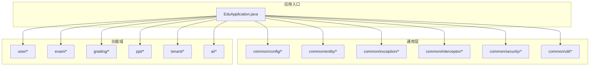
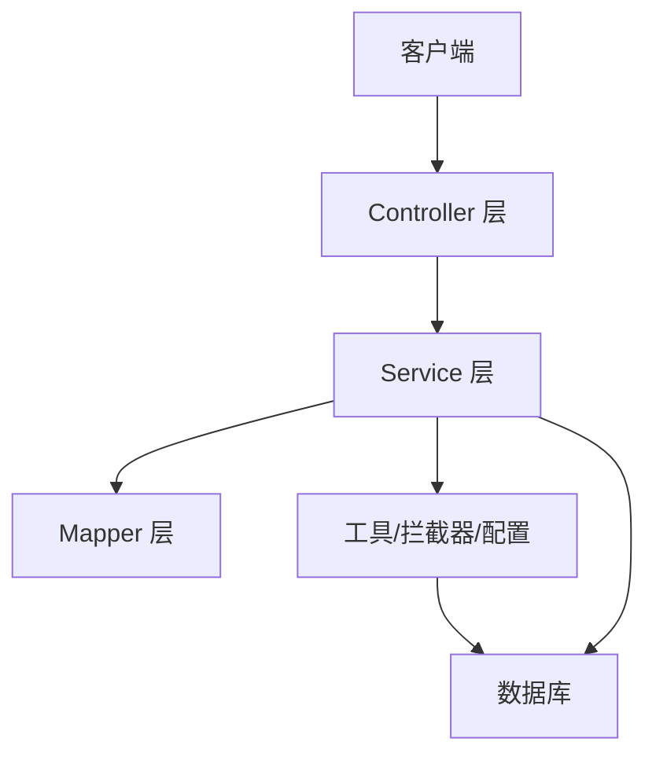
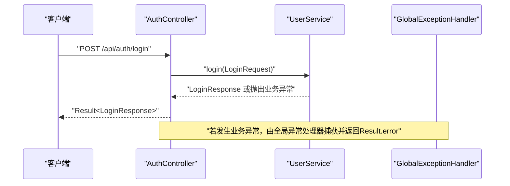
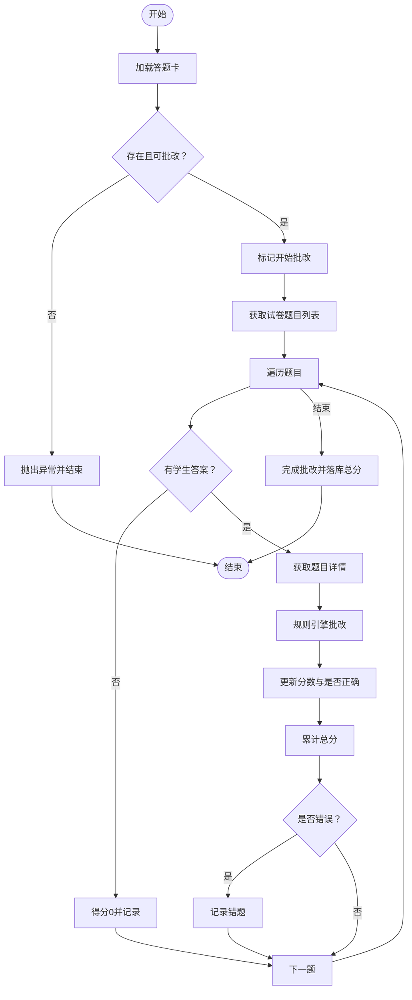

# 代码规范与编码标准

<cite>
**本文引用的文件**
- [EduApplication.java](file://backend/src/main/java/com/edu/EduApplication.java)
- [pom.xml](file://backend/pom.xml)
- [application.yml](file://backend/src/main/resources/application.yml)
- [BaseEntity.java](file://backend/src/main/java/com/edu/common/entity/BaseEntity.java)
- [Result.java](file://backend/src/main/java/com/edu/common/entity/Result.java)
- [AuthController.java](file://backend/src/main/java/com/edu/user/controller/AuthController.java)
- [ExamPaperService.java](file://backend/src/main/java/com/edu/exam/service/ExamPaperService.java)
- [GradingService.java](file://backend/src/main/java/com/edu/grading/service/GradingService.java)
- [AIProvider.java](file://backend/src/main/java/com/edu/ai/provider/AIProvider.java)
- [GlobalExceptionHandler.java](file://backend/src/main/java/com/edu/common/exception/GlobalExceptionHandler.java)
- [LoginRequest.java](file://backend/src/main/java/com/edu/user/dto/LoginRequest.java)
- [ExamPaper.java](file://backend/src/main/java/com/edu/exam/entity/ExamPaper.java)
- [GradingRequest.java](file://backend/src/main/java/com/edu/ai/dto/GradingRequest.java)
- [JwtUtil.java](file://backend/src/main/java/com/edu/common/util/JwtUtil.java)
- [MybatisPlusConfig.java](file://backend/src/main/java/com/edu/common/config/MybatisPlusConfig.java)
</cite>

## 目录
1. 引言
2. 项目结构
3. 核心组件
4. 架构总览
5. 详细组件分析
6. 依赖分析
7. 性能考虑
8. 故障排查指南
9. 结论
10. 附录

## 引言
本指南面向后端开发团队，基于现有代码库总结并提炼出一套统一的Java代码规范与编码标准，覆盖命名约定、缩进与格式化、注释规范、包结构与文件命名、IDE配置建议、代码格式化工具设置，以及Spring Boot项目中Controller、Service、Mapper层的特定规范。目标是提升代码一致性、可读性与可维护性，降低沟通成本与技术债。

## 项目结构
后端采用标准Maven多模块布局，核心源码位于 backend/src/main/java 下，按功能域划分包结构，典型层次如下：
- com.edu：根包
  - ai：AI相关能力（provider、dto）
  - common：通用组件（config、entity、exception、interceptor、security、util）
  - exam：考试模块（controller、dto、entity、mapper、service）
  - grading：批改模块（controller、dto、entity、mapper、service）
  - ppt：PPT生成模块（controller、dto、entity、mapper、service）
  - tenant：租户模块（controller、dto、entity、mapper、service）
  - user：用户模块（controller、dto、entity、mapper、service）
  - EduApplication.java：应用入口

图表来源
- [EduApplication.java:1-15](file://backend/src/main/java/com/edu/EduApplication.java#L1-L15)
- [MybatisPlusConfig.java:1-23](file://backend/src/main/java/com/edu/common/config/MybatisPlusConfig.java#L1-L23)

章节来源
- [EduApplication.java:1-15](file://backend/src/main/java/com/edu/EduApplication.java#L1-L15)
- [pom.xml:1-152](file://backend/pom.xml#L1-L152)
- [application.yml:1-65](file://backend/src/main/resources/application.yml#L1-L65)

## 核心组件
- 应用入口与扫描
  - 应用入口类使用Spring Boot注解启动，并通过MapperScan扫描各模块mapper包。
  - 参考路径：[EduApplication.java:7-8](file://backend/src/main/java/com/edu/EduApplication.java#L7-L8)

- 通用实体与响应封装
  - BaseEntity：统一注入租户ID、创建/更新时间、逻辑删除字段。
  - Result：统一API响应结构，提供成功与错误静态工厂方法。
  - 参考路径：
    - [BaseEntity.java:10-37](file://backend/src/main/java/com/edu/common/entity/BaseEntity.java#L10-L37)
    - [Result.java:10-43](file://backend/src/main/java/com/edu/common/entity/Result.java#L10-L43)

- 全局异常处理
  - RestControllerAdvice集中处理业务异常、参数校验异常、认证/授权异常与通用异常，统一返回Result结构。
  - 参考路径：[GlobalExceptionHandler.java:21-68](file://backend/src/main/java/com/edu/common/exception/GlobalExceptionHandler.java#L21-L68)

- MyBatis-Plus配置
  - 注册MybatisPlusInterceptor并注入TenantInterceptor，实现多租户过滤。
  - 参考路径：[MybatisPlusConfig.java:14-22](file://backend/src/main/java/com/edu/common/config/MybatisPlusConfig.java#L14-L22)

章节来源
- [EduApplication.java:7-8](file://backend/src/main/java/com/edu/EduApplication.java#L7-L8)
- [BaseEntity.java:10-37](file://backend/src/main/java/com/edu/common/entity/BaseEntity.java#L10-L37)
- [Result.java:10-43](file://backend/src/main/java/com/edu/common/entity/Result.java#L10-L43)
- [GlobalExceptionHandler.java:21-68](file://backend/src/main/java/com/edu/common/exception/GlobalExceptionHandler.java#L21-L68)
- [MybatisPlusConfig.java:14-22](file://backend/src/main/java/com/edu/common/config/MybatisPlusConfig.java#L14-L22)

## 架构总览
整体采用分层架构：Controller负责HTTP请求与响应封装；Service承载业务逻辑；Mapper访问数据库；通用层提供配置、异常、安全与工具能力。

图表来源
- [AuthController.java:13-31](file://backend/src/main/java/com/edu/user/controller/AuthController.java#L13-L31)
- [ExamPaperService.java:20-23](file://backend/src/main/java/com/edu/exam/service/ExamPaperService.java#L20-L23)
- [MybatisPlusConfig.java:16-21](file://backend/src/main/java/com/edu/common/config/MybatisPlusConfig.java#L16-L21)

## 详细组件分析

### 命名约定与包结构
- 包命名
  - 使用反向域名+功能域，如 com.edu.user、com.edu.exam、com.edu.common。
  - 保持层级清晰，避免跨域耦合。
  - 参考路径：[EduApplication.java:1](file://backend/src/main/java/com/edu/EduApplication.java#L1)

- 类与接口命名
  - 使用帕斯卡命名法，类名语义明确，如 ExamPaperService、GradingService、AIProvider。
  - 接口以名词或动词短语命名，体现职责，如 AIProvider。
  - 参考路径：
    - [ExamPaperService.java:1](file://backend/src/main/java/com/edu/exam/service/ExamPaperService.java#L1)
    - [GradingService.java:1](file://backend/src/main/java/com/edu/grading/service/GradingService.java#L1)
    - [AIProvider.java:11](file://backend/src/main/java/com/edu/ai/provider/AIProvider.java#L11)

- 方法命名
  - 动宾结构，语义清晰，如 createPaper、publishPaper、gradeAnswerSheet。
  - 参考路径：
    - [ExamPaperService.java:28](file://backend/src/main/java/com/edu/exam/service/ExamPaperService.java#L28)
    - [GradingService.java:35](file://backend/src/main/java/com/edu/grading/service/GradingService.java#L35)

- 变量命名
  - 小驼峰，简洁明确，如 paperId、questionId、maxScore。
  - 参考路径：
    - [ExamPaperService.java:89](file://backend/src/main/java/com/edu/exam/service/ExamPaperService.java#L89)
    - [GradingRequest.java:34](file://backend/src/main/java/com/edu/ai/dto/GradingRequest.java#L34)

- 常量命名
  - 全大写+下划线，如 DEFAULT_PROVIDER、STATUS_DRAFT。
  - 若无常量定义，不强制要求，但建议在枚举或配置类中统一管理。

- 文件命名
  - Java类文件与类名一致，如 ExamPaperService.java。
  - DTO类以 Request/Response 结尾，如 LoginRequest.java、LoginResponse.java。
  - 参考路径：
    - [LoginRequest.java:1](file://backend/src/main/java/com/edu/user/dto/LoginRequest.java#L1)
    - [GradingRequest.java:1](file://backend/src/main/java/com/edu/ai/dto/GradingRequest.java#L1)

- 控制器命名
  - 使用名词复数形式，如 UserController、ExamPaperController，统一前缀 /api/{resource}。
  - 参考路径：[AuthController.java:14](file://backend/src/main/java/com/edu/user/controller/AuthController.java#L14)

- 服务层命名
  - 使用动词+名词，如 ExamPaperService、GradingService，体现业务动作。
  - 参考路径：[ExamPaperService.java:23](file://backend/src/main/java/com/edu/exam/service/ExamPaperService.java#L23)

- Mapper层命名
  - 使用名词+Mapper，如 ExamPaperMapper、AnswerMapper。
  - 参考路径：[ExamPaperService.java:9](file://backend/src/main/java/com/edu/exam/service/ExamPaperService.java#L9)

章节来源
- [EduApplication.java:1](file://backend/src/main/java/com/edu/EduApplication.java#L1)
- [LoginRequest.java:1](file://backend/src/main/java/com/edu/user/dto/LoginRequest.java#L1)
- [GradingRequest.java:1](file://backend/src/main/java/com/edu/ai/dto/GradingRequest.java#L1)
- [AuthController.java:14](file://backend/src/main/java/com/edu/user/controller/AuthController.java#L14)
- [ExamPaperService.java:9](file://backend/src/main/java/com/edu/exam/service/ExamPaperService.java#L9)

### 缩进与格式化规则
- 缩进与空格
  - 统一使用4个空格缩进，不使用Tab。
  - 方法体、条件块、循环块前后花括号另起一行，保持一致风格。
  - 行宽不超过120字符，必要时换行并对齐。
- 导入排序
  - 按组排序：第三方库、项目内包，每组内字母序排列。
- 空行与分组
  - 类内部成员按职责分组，组间空行分隔；构造函数、静态块、实例块、方法之间适当空行。
- 注解与修饰符
  - 注解单独占行，修饰符顺序：@Component/@Service/@RestController 等在前，public/private等在后。
- 字段与局部变量
  - 字段与局部变量在同一作用域内按用途分组，避免分散声明。
- 运算符与逗号
  - 运算符两侧留空格，逗号后留空格，三元运算符分行或对齐。
- 参考路径（示例）
  - [ExamPaperService.java:20-23](file://backend/src/main/java/com/edu/exam/service/ExamPaperService.java#L20-L23)
  - [GradingService.java:17-23](file://backend/src/main/java/com/edu/grading/service/GradingService.java#L17-L23)

章节来源
- [ExamPaperService.java:20-23](file://backend/src/main/java/com/edu/exam/service/ExamPaperService.java#L20-L23)
- [GradingService.java:17-23](file://backend/src/main/java/com/edu/grading/service/GradingService.java#L17-L23)

### 注释规范
- 类注释
  - 类顶部使用块注释说明职责、关键字段与行为，如 BaseEntity 的“实体基类，包含租户ID和通用字段”。
  - 参考路径：[BaseEntity.java:7-10](file://backend/src/main/java/com/edu/common/entity/BaseEntity.java#L7-L10)

- 方法注释
  - 公共方法需注释说明用途、参数含义、返回值与异常情况，如 GradingService 中的“批改答题卡”“规则引擎批改单题”等。
  - 参考路径：
    - [GradingService.java:31-35](file://backend/src/main/java/com/edu/grading/service/GradingService.java#L31-L35)
    - [GradingService.java:82-84](file://backend/src/main/java/com/edu/grading/service/GradingService.java#L82-L84)

- 行内注释
  - 关键分支、复杂逻辑处使用行内注释解释原因或边界条件，如事务控制、日志记录点。
  - 参考路径：
    - [ExamPaperService.java:27](file://backend/src/main/java/com/edu/exam/service/ExamPaperService.java#L27)
    - [GradingService.java:48-54](file://backend/src/main/java/com/edu/grading/service/GradingService.java#L48-L54)

- TODO/FIXME
  - 使用 TODO/FIXME 标记临时或待完善逻辑，便于追踪。
  - 示例：在复杂规则扩展处标注 TODO，说明后续优化方向。

章节来源
- [BaseEntity.java:7-10](file://backend/src/main/java/com/edu/common/entity/BaseEntity.java#L7-L10)
- [GradingService.java:31-35](file://backend/src/main/java/com/edu/grading/service/GradingService.java#L31-L35)
- [GradingService.java:82-84](file://backend/src/main/java/com/edu/grading/service/GradingService.java#L82-L84)
- [ExamPaperService.java:27](file://backend/src/main/java/com/edu/exam/service/ExamPaperService.java#L27)
- [GradingService.java:48-54](file://backend/src/main/java/com/edu/grading/service/GradingService.java#L48-L54)

### 数据模型与DTO规范
- 实体类
  - 统一继承 BaseEntity，确保租户隔离与审计字段。
  - 字段命名遵循下划线转驼峰映射，如 created_at 对应 createdAt。
  - 参考路径：
    - [BaseEntity.java:16-29](file://backend/src/main/java/com/edu/common/entity/BaseEntity.java#L16-L29)
    - [ExamPaper.java:14-30](file://backend/src/main/java/com/edu/exam/entity/ExamPaper.java#L14-L30)

- DTO类
  - 请求DTO使用 @NotBlank 等校验注解，响应DTO仅承载数据。
  - 字段注释说明含义，如 questionType、maxScore。
  - 参考路径：
    - [LoginRequest.java:8-12](file://backend/src/main/java/com/edu/user/dto/LoginRequest.java#L8-L12)
    - [GradingRequest.java:11-39](file://backend/src/main/java/com/edu/ai/dto/GradingRequest.java#L11-L39)

章节来源
- [BaseEntity.java:16-29](file://backend/src/main/java/com/edu/common/entity/BaseEntity.java#L16-L29)
- [ExamPaper.java:14-30](file://backend/src/main/java/com/edu/exam/entity/ExamPaper.java#L14-L30)
- [LoginRequest.java:8-12](file://backend/src/main/java/com/edu/user/dto/LoginRequest.java#L8-L12)
- [GradingRequest.java:11-39](file://backend/src/main/java/com/edu/ai/dto/GradingRequest.java#L11-L39)

### Spring Boot层规范
- Controller
  - 统一前缀 /api/{resource}，返回类型统一为 Result<T>。
  - 参数校验使用 @Valid 与 @NotBlank 等，配合全局异常处理。
  - 参考路径：
    - [AuthController.java:14](file://backend/src/main/java/com/edu/user/controller/AuthController.java#L14)
    - [AuthController.java:21](file://backend/src/main/java/com/edu/user/controller/AuthController.java#L21)

- Service
  - 使用 @Service 与 @RequiredArgsConstructor，事务边界清晰，日志记录关键操作。
  - 参考路径：
    - [ExamPaperService.java:20-23](file://backend/src/main/java/com/edu/exam/service/ExamPaperService.java#L20-L23)
    - [GradingService.java:17-23](file://backend/src/main/java/com/edu/grading/service/GradingService.java#L17-L23)

- Mapper
  - Mapper接口与XML文件一一对应，查询条件使用LambdaQueryWrapper，保证类型安全。
  - 参考路径：[ExamPaperService.java:4](file://backend/src/main/java/com/edu/exam/service/ExamPaperService.java#L4)

- 配置
  - MyBatis-Plus配置启用下划线转驼峰、逻辑删除、日志输出等。
  - 参考路径：[application.yml:32-47](file://backend/src/main/resources/application.yml#L32-L47)

章节来源
- [AuthController.java:14](file://backend/src/main/java/com/edu/user/controller/AuthController.java#L14)
- [AuthController.java:21](file://backend/src/main/java/com/edu/user/controller/AuthController.java#L21)
- [ExamPaperService.java:4](file://backend/src/main/java/com/edu/exam/service/ExamPaperService.java#L4)
- [application.yml:32-47](file://backend/src/main/resources/application.yml#L32-L47)

### 错误处理流程

图表来源
- [AuthController.java:20-24](file://backend/src/main/java/com/edu/user/controller/AuthController.java#L20-L24)
- [GlobalExceptionHandler.java:23-28](file://backend/src/main/java/com/edu/common/exception/GlobalExceptionHandler.java#L23-L28)

章节来源
- [AuthController.java:20-24](file://backend/src/main/java/com/edu/user/controller/AuthController.java#L20-L24)
- [GlobalExceptionHandler.java:23-28](file://backend/src/main/java/com/edu/common/exception/GlobalExceptionHandler.java#L23-L28)

### 批改服务算法流程

图表来源
- [GradingService.java:34-80](file://backend/src/main/java/com/edu/grading/service/GradingService.java#L34-L80)

章节来源
- [GradingService.java:34-80](file://backend/src/main/java/com/edu/grading/service/GradingService.java#L34-L80)

## 依赖分析
- 技术栈与版本
  - Spring Boot 3.2.0、MyBatis-Plus 3.5.5、MySQL驱动、H2数据库、Redis Starter、JWT、Fastjson2、Lombok、JSqlParser、TransmittableThreadLocal。
  - 参考路径：[pom.xml:22-27](file://backend/pom.xml#L22-L27)

- 运行与配置
  - 应用端口、数据源、MyBatis-Plus、JWT、AI Provider等配置集中在 application.yml。
  - 参考路径：[application.yml:1-65](file://backend/src/main/resources/application.yml#L1-L65)

章节来源
- [pom.xml:22-27](file://backend/pom.xml#L22-L27)
- [application.yml:1-65](file://backend/src/main/resources/application.yml#L1-L65)

## 性能考虑
- 数据访问
  - 使用LambdaQueryWrapper进行类型安全查询，避免硬编码SQL。
  - 合理使用分页与索引，避免N+1查询。
- 事务边界
  - 在Service层明确事务范围，避免长事务占用连接池资源。
- 日志与监控
  - 仅在关键路径打点日志，避免高频日志影响性能。
- 缓存与异步
  - 对热点数据引入缓存，对耗时任务异步执行（如AI批改）。

## 故障排查指南
- 统一响应与异常
  - 所有异常通过全局异常处理器转换为 Result 结构，便于前端统一处理。
  - 参考路径：[GlobalExceptionHandler.java:23-68](file://backend/src/main/java/com/edu/common/exception/GlobalExceptionHandler.java#L23-L68)

- 参数校验
  - 使用 @Valid 与字段级校验注解，结合全局异常处理返回具体字段错误信息。
  - 参考路径：[LoginRequest.java:8-12](file://backend/src/main/java/com/edu/user/dto/LoginRequest.java#L8-L12)

- 安全与认证
  - JWT工具类提供签发、解析、校验与过期判断，确保令牌安全。
  - 参考路径：[JwtUtil.java:33-121](file://backend/src/main/java/com/edu/common/util/JwtUtil.java#L33-L121)

章节来源
- [GlobalExceptionHandler.java:23-68](file://backend/src/main/java/com/edu/common/exception/GlobalExceptionHandler.java#L23-L68)
- [LoginRequest.java:8-12](file://backend/src/main/java/com/edu/user/dto/LoginRequest.java#L8-L12)
- [JwtUtil.java:33-121](file://backend/src/main/java/com/edu/common/util/JwtUtil.java#L33-L121)

## 结论
本规范以现有代码库为依据，形成了一套可落地的Java编码标准，涵盖命名、格式、注释、包结构与Spring Boot分层规范。建议团队在评审与日常开发中严格遵循，持续改进以提升整体质量与协作效率。

## 附录

### IDE配置建议（IntelliJ IDEA）
- 代码风格
  - 设置缩进为4空格，勾选“Use tab character”关闭，确保一致性。
  - 代码样式模板：类/方法/接口/枚举等模板统一。
- 导入优化
  - 导入排序：按“第三方库优先、项目内包次之”，每组内字母序。
- 编码与换行
  - 文件编码统一为UTF-8，行尾统一为LF。
  - 行宽120字符，自动换行对齐。
- 注解与Lombok
  - 开启“Enable annotation processing”，确保Lombok注解生效。
- 插件推荐
  - Alibaba Java Coding Guidelines、SonarLint、MyBatis Log Plugin（可选）。

### 代码格式化工具设置
- Maven插件
  - 使用 spotless-maven-plugin 或 maven-checkstyle-plugin 进行格式检查与自动修复。
  - 在CI中强制执行，保证提交代码符合规范。
- VS Code/IntelliJ
  - 配置保存时自动格式化，避免手动格式化遗漏。

### 正确与错误示例（路径指引）
- 正确示例
  - 统一返回 Result：[AuthController.java:21-30](file://backend/src/main/java/com/edu/user/controller/AuthController.java#L21-L30)
  - 事务方法注释与日志：[ExamPaperService.java:27-37](file://backend/src/main/java/com/edu/exam/service/ExamPaperService.java#L27-L37)
  - DTO字段注释与校验：[LoginRequest.java:8-12](file://backend/src/main/java/com/edu/user/dto/LoginRequest.java#L8-L12)
  - AI接口注释与方法签名：[AIProvider.java:13-41](file://backend/src/main/java/com/edu/ai/provider/AIProvider.java#L13-L41)

- 错误示例（不应出现）
  - 返回原始对象而非 Result：避免直接返回业务对象而不包装统一响应。
  - 缺少方法注释：公共方法缺少用途、参数、返回值说明。
  - 混用Tab与空格：导致不同编辑器显示不一致。
  - 忽略参数校验：未使用 @Valid 与字段校验注解，导致运行期异常。