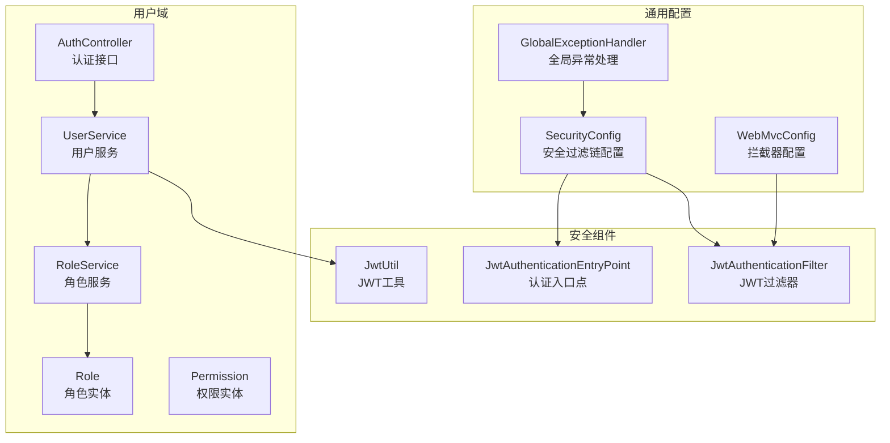
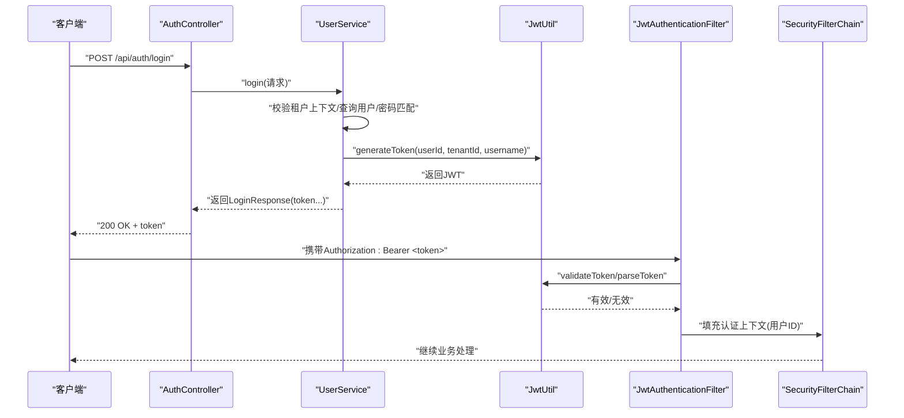
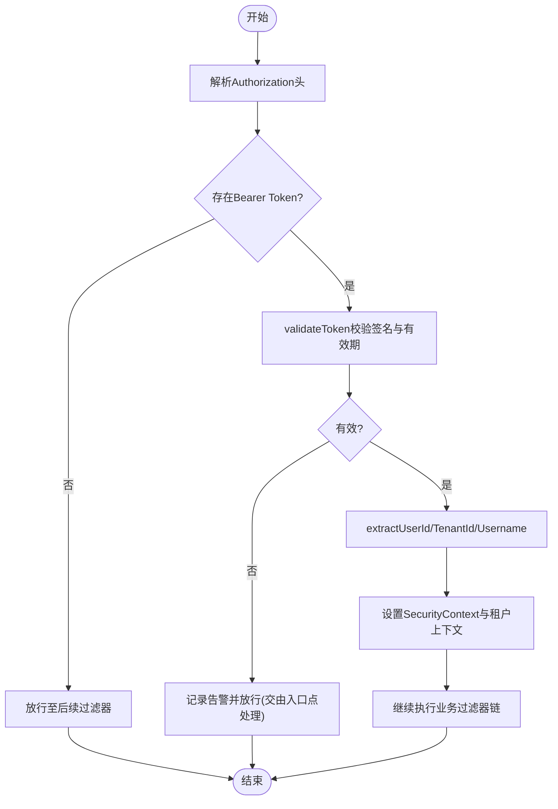
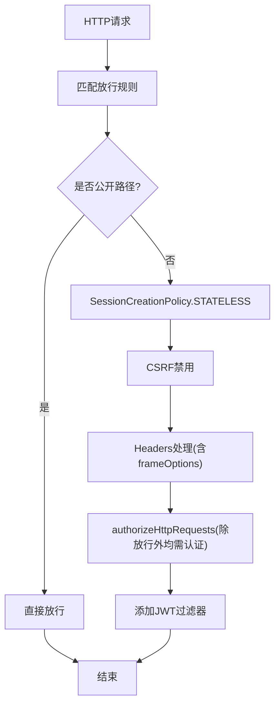
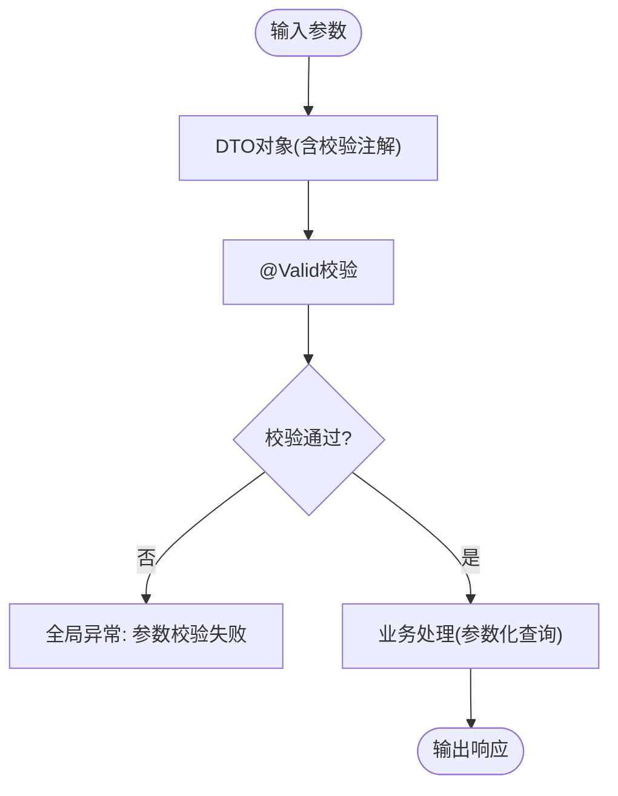
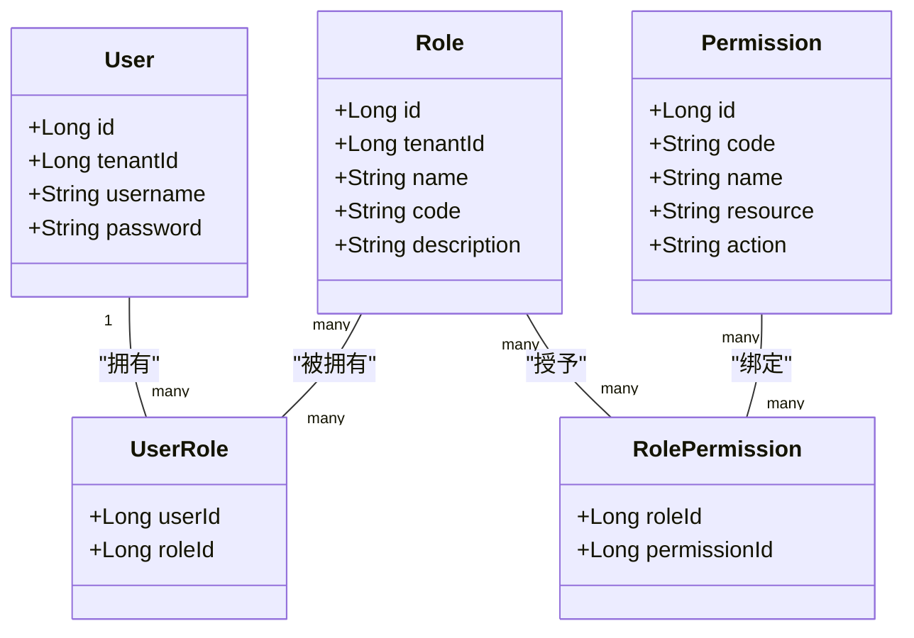
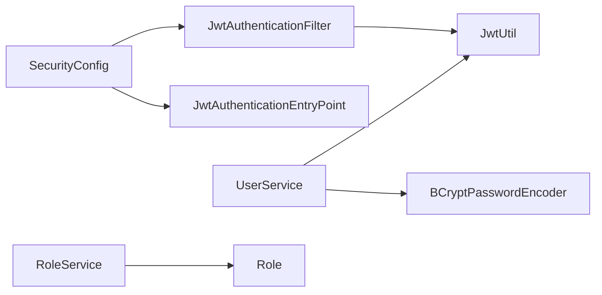

# 安全开发实践

<cite>
**本文引用的文件**
- [SecurityConfig.java](file://backend/src/main/java/com/edu/common/config/SecurityConfig.java)
- [JwtAuthenticationFilter.java](file://backend/src/main/java/com/edu/common/security/JwtAuthenticationFilter.java)
- [JwtAuthenticationEntryPoint.java](file://backend/src/main/java/com/edu/common/security/JwtAuthenticationEntryPoint.java)
- [JwtUtil.java](file://backend/src/main/java/com/edu/common/util/JwtUtil.java)
- [AuthController.java](file://backend/src/main/java/com/edu/user/controller/AuthController.java)
- [UserService.java](file://backend/src/main/java/com/edu/user/service/UserService.java)
- [WebMvcConfig.java](file://backend/src/main/java/com/edu/common/config/WebMvcConfig.java)
- [RoleService.java](file://backend/src/main/java/com/edu/user/service/RoleService.java)
- [Role.java](file://backend/src/main/java/com/edu/user/entity/Role.java)
- [Permission.java](file://backend/src/main/java/com/edu/user/entity/Permission.java)
- [GlobalExceptionHandler.java](file://backend/src/main/java/com/edu/common/exception/GlobalExceptionHandler.java)
- [application.yml](file://backend/src/main/resources/application.yml)
</cite>

## 目录
1. [引言](#引言)
2. [项目结构](#项目结构)
3. [核心组件](#核心组件)
4. [架构总览](#架构总览)
5. [详细组件分析](#详细组件分析)
6. [依赖分析](#依赖分析)
7. [性能考虑](#性能考虑)
8. [故障排查指南](#故障排查指南)
9. [结论](#结论)
10. [附录](#附录)

## 引言
本指南面向后端安全开发，围绕本项目的JWT认证与授权、Spring Security配置、输入验证与数据清理、权限控制机制、安全编码规范以及常见漏洞检测与修复展开。文档以代码为依据，结合架构图与流程图，帮助开发者在不直接阅读源码的情况下快速理解实现细节，并提供可操作的改进建议与最佳实践。

## 项目结构
后端采用分层架构：控制器层负责HTTP请求入口，服务层承载业务逻辑，持久层通过MyBatis-Plus访问数据库，通用模块提供安全、异常处理、拦截器等横切能力。安全相关的关键文件集中在common/config、common/security、common/util与user/service等包中。

**图表来源**
- [SecurityConfig.java:26-43](file://backend/src/main/java/com/edu/common/config/SecurityConfig.java#L26-L43)
- [JwtAuthenticationFilter.java:23-53](file://backend/src/main/java/com/edu/common/security/JwtAuthenticationFilter.java#L23-L53)
- [JwtAuthenticationEntryPoint.java:16-31](file://backend/src/main/java/com/edu/common/security/JwtAuthenticationEntryPoint.java#L16-L31)
- [JwtUtil.java:33-45](file://backend/src/main/java/com/edu/common/util/JwtUtil.java#L33-L45)
- [AuthController.java:16-31](file://backend/src/main/java/com/edu/user/controller/AuthController.java#L16-L31)
- [UserService.java:68-104](file://backend/src/main/java/com/edu/user/service/UserService.java#L68-L104)
- [RoleService.java:22-83](file://backend/src/main/java/com/edu/user/service/RoleService.java#L22-L83)
- [Role.java:11-17](file://backend/src/main/java/com/edu/user/entity/Role.java#L11-L17)
- [Permission.java:10-17](file://backend/src/main/java/com/edu/user/entity/Permission.java#L10-L17)
- [WebMvcConfig.java:14-23](file://backend/src/main/java/com/edu/common/config/WebMvcConfig.java#L14-L23)
- [GlobalExceptionHandler.java:21-68](file://backend/src/main/java/com/edu/common/exception/GlobalExceptionHandler.java#L21-L68)

**章节来源**
- [SecurityConfig.java:26-43](file://backend/src/main/java/com/edu/common/config/SecurityConfig.java#L26-L43)
- [WebMvcConfig.java:14-23](file://backend/src/main/java/com/edu/common/config/WebMvcConfig.java#L14-L23)

## 核心组件
- 安全过滤链与策略：通过SecurityFilterChain禁用CSRF、禁用frameOptions、设置无状态会话、统一认证入口点，并对公开路径放行。
- JWT认证过滤器：从Authorization头提取Bearer Token，校验有效性，解析用户与租户信息，填充Spring Security上下文。
- JWT工具：生成、解析、验证JWT，支持过期判断。
- 用户服务：登录时进行密码校验并签发JWT；注册时使用BCrypt加密密码。
- 角色与权限：基于角色的访问控制（RBAC），支持角色分配与查询。
- 全局异常处理：对认证、授权、参数校验等异常进行统一响应。

**章节来源**
- [SecurityConfig.java:26-48](file://backend/src/main/java/com/edu/common/config/SecurityConfig.java#L26-L48)
- [JwtAuthenticationFilter.java:23-68](file://backend/src/main/java/com/edu/common/security/JwtAuthenticationFilter.java#L23-L68)
- [JwtUtil.java:33-121](file://backend/src/main/java/com/edu/common/util/JwtUtil.java#L33-L121)
- [UserService.java:68-104](file://backend/src/main/java/com/edu/user/service/UserService.java#L68-L104)
- [RoleService.java:22-83](file://backend/src/main/java/com/edu/user/service/RoleService.java#L22-L83)
- [GlobalExceptionHandler.java:21-68](file://backend/src/main/java/com/edu/common/exception/GlobalExceptionHandler.java#L21-L68)

## 架构总览
下图展示认证与授权的整体流程：客户端发起登录请求，服务端验证凭据后签发JWT；后续请求由JWT过滤器解析并填充认证上下文，控制器方法根据业务需求进行授权决策。

**图表来源**
- [AuthController.java:20-24](file://backend/src/main/java/com/edu/user/controller/AuthController.java#L20-L24)
- [UserService.java:68-104](file://backend/src/main/java/com/edu/user/service/UserService.java#L68-L104)
- [JwtUtil.java:33-45](file://backend/src/main/java/com/edu/common/util/JwtUtil.java#L33-L45)
- [JwtAuthenticationFilter.java:32-50](file://backend/src/main/java/com/edu/common/security/JwtAuthenticationFilter.java#L32-L50)
- [SecurityConfig.java:27-42](file://backend/src/main/java/com/edu/common/config/SecurityConfig.java#L27-L42)

## 详细组件分析

### JWT认证机制
- Token生成：使用对称密钥签名，载荷包含用户ID、租户ID与用户名，设置签发时间与过期时间。
- Token验证：解析签名并校验有效期；失败时记录告警日志。
- 过滤器集成：在请求进入业务前执行，提取Authorization头中的Bearer Token，校验通过后将用户标识写入SecurityContext。
- 登录流程：控制器接收登录请求，服务层完成租户上下文校验、用户查询与密码校验，成功后生成JWT返回给客户端。

**图表来源**
- [JwtAuthenticationFilter.java:27-68](file://backend/src/main/java/com/edu/common/security/JwtAuthenticationFilter.java#L27-L68)
- [JwtUtil.java:66-77](file://backend/src/main/java/com/edu/common/util/JwtUtil.java#L66-L77)

**章节来源**
- [JwtUtil.java:33-121](file://backend/src/main/java/com/edu/common/util/JwtUtil.java#L33-L121)
- [JwtAuthenticationFilter.java:23-68](file://backend/src/main/java/com/edu/common/security/JwtAuthenticationFilter.java#L23-L68)
- [UserService.java:68-104](file://backend/src/main/java/com/edu/user/service/UserService.java#L68-L104)

### Spring Security配置与策略
- CSRF禁用：适用于前后端分离场景，避免同站请求伪造风险。
- 头部安全：禁用frameOptions，便于嵌入与调试；建议生产环境按需开启X-Frame-Options。
- 会话策略：STATELESS无状态会话，降低会话劫持风险。
- 认证入口：未认证时统一返回JSON错误响应，状态码401。
- 路由放行：对认证、租户、H2控制台与错误端点放行，其余请求均需认证。
- 密码编码：使用BCryptPasswordEncoder进行密码加密存储。

**图表来源**
- [SecurityConfig.java:27-42](file://backend/src/main/java/com/edu/common/config/SecurityConfig.java#L27-L42)

**章节来源**
- [SecurityConfig.java:26-48](file://backend/src/main/java/com/edu/common/config/SecurityConfig.java#L26-L48)

### 输入验证与数据清理
- 参数校验：控制器层使用@Valid对接口参数进行校验，全局异常处理器捕获校验异常并返回统一错误格式。
- 密码处理：注册与登录均使用BCrypt进行密码加密与匹配，避免明文存储与可逆加密。
- SQL注入防护：使用MyBatis-Plus的LambdaQueryWrapper进行参数化查询，避免字符串拼接。
- XSS与命令注入：当前实现未见专门的XSS与命令注入清理逻辑，建议在DTO/实体清洗与输出渲染阶段增加白名单过滤与转义策略。

**图表来源**
- [AuthController.java:9-10](file://backend/src/main/java/com/edu/user/controller/AuthController.java#L9-L10)
- [GlobalExceptionHandler.java:37-46](file://backend/src/main/java/com/edu/common/exception/GlobalExceptionHandler.java#L37-L46)
- [UserService.java:35-66](file://backend/src/main/java/com/edu/user/service/UserService.java#L35-L66)

**章节来源**
- [AuthController.java:9-10](file://backend/src/main/java/com/edu/user/controller/AuthController.java#L9-L10)
- [GlobalExceptionHandler.java:37-46](file://backend/src/main/java/com/edu/common/exception/GlobalExceptionHandler.java#L37-L46)
- [UserService.java:35-66](file://backend/src/main/java/com/edu/user/service/UserService.java#L35-L66)

### 权限控制机制（RBAC与资源级权限）
- 角色模型：角色实体包含租户维度字段，支持多租户隔离；角色与用户通过UserRole关联。
- 角色分配：注册/创建用户时分配默认角色；支持按角色代码分配。
- 权限查询：根据用户ID查询其角色列表，用于授权判断。
- 资源级权限：当前未见细粒度资源权限表与注解式授权（如@PreAuthorize），可在控制器或方法上引入基于角色/权限的访问控制。

**图表来源**
- [Role.java:11-17](file://backend/src/main/java/com/edu/user/entity/Role.java#L11-L17)
- [Permission.java:10-17](file://backend/src/main/java/com/edu/user/entity/Permission.java#L10-L17)
- [RoleService.java:57-74](file://backend/src/main/java/com/edu/user/service/RoleService.java#L57-L74)

**章节来源**
- [RoleService.java:22-83](file://backend/src/main/java/com/edu/user/service/RoleService.java#L22-L83)
- [Role.java:11-17](file://backend/src/main/java/com/edu/user/entity/Role.java#L11-L17)
- [Permission.java:10-17](file://backend/src/main/java/com/edu/user/entity/Permission.java#L10-L17)

### 安全编码规范
- 密码加密：使用BCryptPasswordEncoder进行密码加密与匹配，确保不可逆存储。
- 敏感数据保护：JWT密钥与过期时间通过配置文件管理；建议使用环境变量与密钥管理服务。
- 会话安全管理：无状态设计，避免服务端会话；Token过期后自动失效。
- 日志与审计：对认证失败、参数校验失败等进行日志记录，便于追踪与审计。

**章节来源**
- [SecurityConfig.java:45-48](file://backend/src/main/java/com/edu/common/config/SecurityConfig.java#L45-L48)
- [UserService.java:89-91](file://backend/src/main/java/com/edu/user/service/UserService.java#L89-L91)
- [application.yml:45-47](file://backend/src/main/resources/application.yml#L45-L47)

### 常见安全漏洞检测与修复
- 认证绕过：确认所有受保护路由均未被误放行；检查shouldNotFilter逻辑覆盖范围。
- 信息泄露：全局异常处理器已对认证失败与权限不足进行统一响应；建议避免在生产环境暴露内部堆栈。
- 参数篡改：依赖DTO校验与参数化查询；建议对关键参数增加白名单校验。
- CORS与CSRF：当前禁用CSRF，若未来启用CORS，需严格限定来源与方法。

**章节来源**
- [JwtAuthenticationFilter.java:63-68](file://backend/src/main/java/com/edu/common/security/JwtAuthenticationFilter.java#L63-L68)
- [GlobalExceptionHandler.java:48-60](file://backend/src/main/java/com/edu/common/exception/GlobalExceptionHandler.java#L48-L60)
- [SecurityConfig.java:29-39](file://backend/src/main/java/com/edu/common/config/SecurityConfig.java#L29-L39)

## 依赖分析
- 组件耦合：SecurityConfig依赖JwtAuthenticationFilter与JwtAuthenticationEntryPoint；JwtAuthenticationFilter依赖JwtUtil；UserService依赖JwtUtil与PasswordEncoder。
- 外部依赖：JWT工具使用JJWT；密码编码使用Spring Security的BCryptPasswordEncoder；MyBatis-Plus用于参数化查询。
- 可能的循环依赖：当前结构清晰，未发现循环依赖迹象。

**图表来源**
- [SecurityConfig.java:23-24](file://backend/src/main/java/com/edu/common/config/SecurityConfig.java#L23-L24)
- [JwtAuthenticationFilter.java:25](file://backend/src/main/java/com/edu/common/security/JwtAuthenticationFilter.java#L25)
- [JwtUtil.java:18](file://backend/src/main/java/com/edu/common/util/JwtUtil.java#L18)
- [UserService.java:31-32](file://backend/src/main/java/com/edu/user/service/UserService.java#L31-L32)
- [RoleService.java:22](file://backend/src/main/java/com/edu/user/service/RoleService.java#L22)

**章节来源**
- [SecurityConfig.java:23-24](file://backend/src/main/java/com/edu/common/config/SecurityConfig.java#L23-L24)
- [JwtAuthenticationFilter.java:25](file://backend/src/main/java/com/edu/common/security/JwtAuthenticationFilter.java#L25)
- [JwtUtil.java:18](file://backend/src/main/java/com/edu/common/util/JwtUtil.java#L18)
- [UserService.java:31-32](file://backend/src/main/java/com/edu/user/service/UserService.java#L31-L32)
- [RoleService.java:22](file://backend/src/main/java/com/edu/user/service/RoleService.java#L22)

## 性能考虑
- JWT解析成本：每次请求均需解析与校验签名，建议合理设置过期时间与缓存策略（如Redis）以减少重复计算。
- 数据库查询：参数化查询具备良好性能与安全性；建议对高频查询建立索引。
- 无状态设计：避免服务端会话存储，降低内存占用与扩展复杂度。

## 故障排查指南
- 401未认证：检查Authorization头格式是否为Bearer Token；确认JWT未过期；查看JwtAuthenticationEntryPoint日志。
- 参数校验失败：检查DTO注解与全局异常处理器返回的消息；定位具体字段错误。
- 权限不足：确认用户角色与目标资源的授权映射；检查控制器或方法级授权配置。
- 租户上下文缺失：确认租户拦截器是否正确设置租户ID；检查请求路径是否命中拦截器。

**章节来源**
- [JwtAuthenticationEntryPoint.java:18-30](file://backend/src/main/java/com/edu/common/security/JwtAuthenticationEntryPoint.java#L18-L30)
- [GlobalExceptionHandler.java:37-60](file://backend/src/main/java/com/edu/common/exception/GlobalExceptionHandler.java#L37-L60)
- [WebMvcConfig.java:18-23](file://backend/src/main/java/com/edu/common/config/WebMvcConfig.java#L18-L23)

## 结论
本项目在安全方面采用了JWT无状态认证、参数化查询与BCrypt密码加密等基础实践。建议进一步完善CORS配置、引入细粒度资源权限与方法级授权、增强XSS与命令注入防护，并在生产环境强化头部安全策略与密钥管理。通过持续的漏洞扫描与安全测试，可显著提升系统的整体安全性。

## 附录
- 配置要点：JWT密钥与过期时间通过配置文件管理；数据库连接与MyBatis-Plus配置位于同一文件。
- 开发建议：在控制器层增加基于角色/权限的访问控制注解；对敏感操作增加审计日志；定期轮换JWT密钥。

**章节来源**
- [application.yml:45-47](file://backend/src/main/resources/application.yml#L45-L47)
- [application.yml:15-19](file://backend/src/main/resources/application.yml#L15-L19)
- [application.yml:32-44](file://backend/src/main/resources/application.yml#L32-L44)