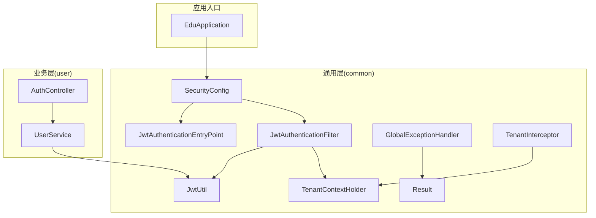
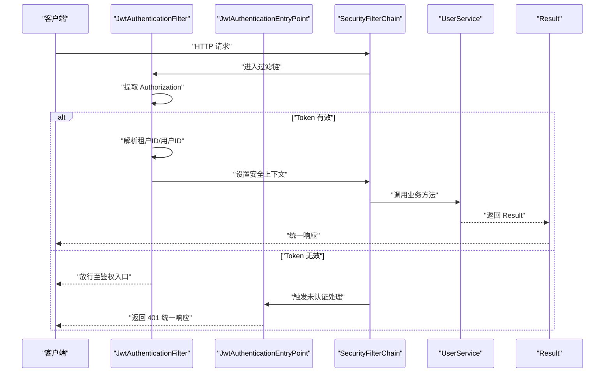
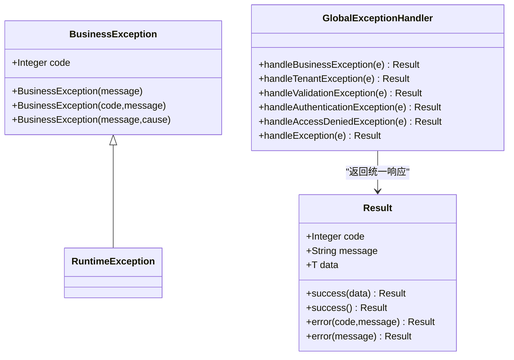
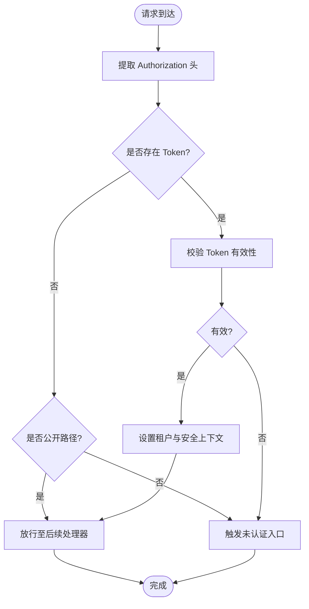
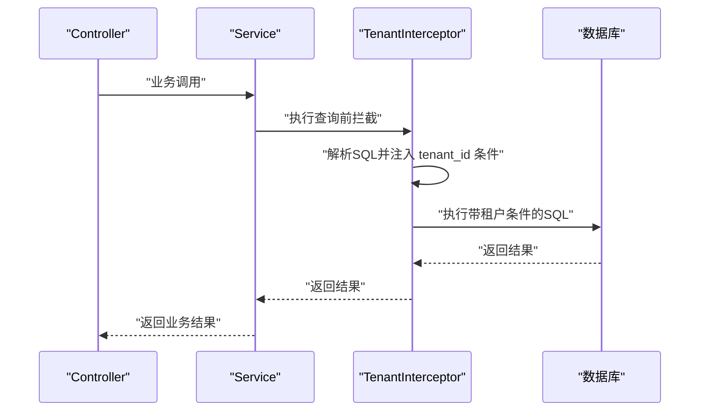
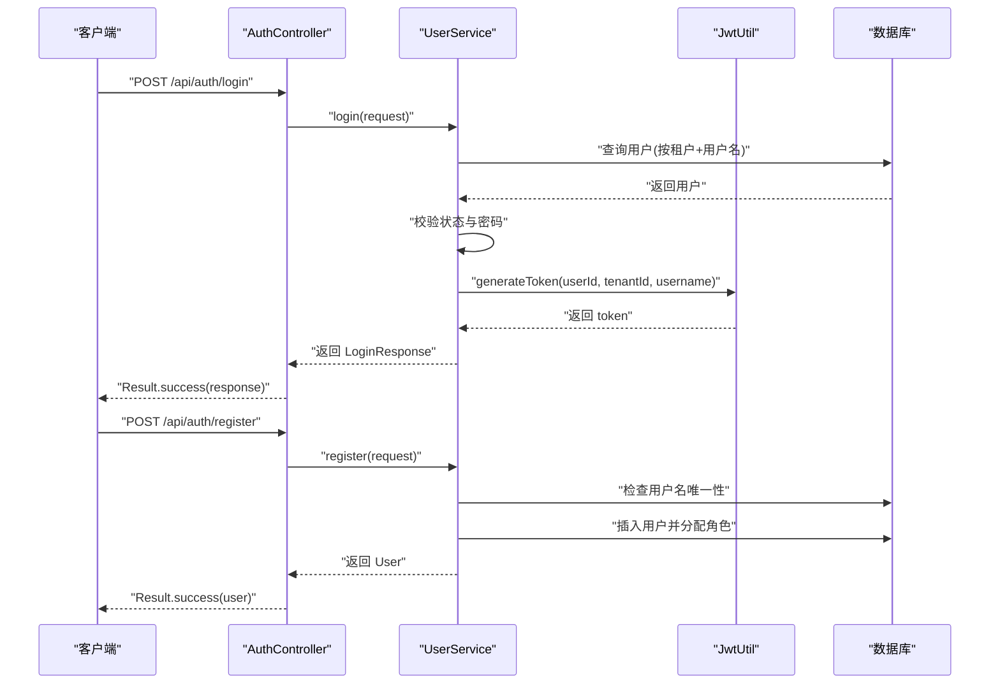
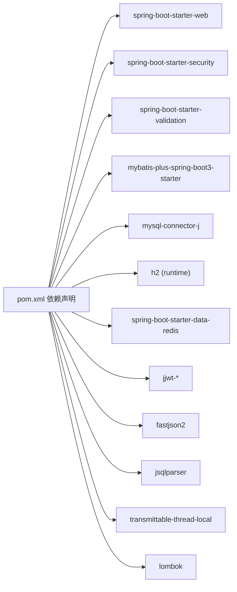

# 开发最佳实践

<cite>
**本文引用的文件**
- [EduApplication.java](file://backend/src/main/java/com/edu/EduApplication.java)
- [GlobalExceptionHandler.java](file://backend/src/main/java/com/edu/common/exception/GlobalExceptionHandler.java)
- [BusinessException.java](file://backend/src/main/java/com/edu/common/exception/BusinessException.java)
- [Result.java](file://backend/src/main/java/com/edu/common/entity/Result.java)
- [JwtAuthenticationFilter.java](file://backend/src/main/java/com/edu/common/security/JwtAuthenticationFilter.java)
- [JwtAuthenticationEntryPoint.java](file://backend/src/main/java/com/edu/common/security/JwtAuthenticationEntryPoint.java)
- [SecurityConfig.java](file://backend/src/main/java/com/edu/common/config/SecurityConfig.java)
- [JwtUtil.java](file://backend/src/main/java/com/edu/common/util/JwtUtil.java)
- [TenantInterceptor.java](file://backend/src/main/java/com/edu/common/interceptor/TenantInterceptor.java)
- [TenantContextHolder.java](file://backend/src/main/java/com/edu/common/util/TenantContextHolder.java)
- [UserService.java](file://backend/src/main/java/com/edu/user/service/UserService.java)
- [AuthController.java](file://backend/src/main/java/com/edu/user/controller/AuthController.java)
- [application.yml](file://backend/src/main/resources/application.yml)
- [pom.xml](file://backend/pom.xml)
- [README.md](file://README.md)
- [GlobalExceptionHandlerTest.java](file://backend/src/test/java/com/edu/common/exception/GlobalExceptionHandlerTest.java)
</cite>

## 目录
1. [引言](#引言)
2. [项目结构](#项目结构)
3. [核心组件](#核心组件)
4. [架构总览](#架构总览)
5. [详细组件分析](#详细组件分析)
6. [依赖分析](#依赖分析)
7. [性能考虑](#性能考虑)
8. [故障排查指南](#故障排查指南)
9. [结论](#结论)
10. [附录](#附录)

## 引言
本指南面向后端开发团队，基于现有代码库总结出一套可落地的开发最佳实践，覆盖代码规范与编码标准、异常处理策略、安全开发实践、性能优化技巧、Git 工作流与代码审查流程，以及重构与遗留代码处理建议。内容以仓库中的实际实现为依据，辅以可视化图示帮助理解。

## 项目结构
后端采用 Spring Boot + MyBatis-Plus 的分层架构：common（通用能力）、各业务模块（如 user、exam、grading 等）。核心特性包括：
- 统一响应包装 Result
- 全局异常处理 GlobalExceptionHandler
- 基于 JWT 的认证过滤链
- 租户隔离的 SQL 拦截器
- 标准化配置与依赖管理

图表来源
- [EduApplication.java:1-15](file://backend/src/main/java/com/edu/EduApplication.java#L1-L15)
- [SecurityConfig.java:1-50](file://backend/src/main/java/com/edu/common/config/SecurityConfig.java#L1-L50)
- [JwtAuthenticationFilter.java:1-70](file://backend/src/main/java/com/edu/common/security/JwtAuthenticationFilter.java#L1-L70)
- [JwtAuthenticationEntryPoint.java:1-32](file://backend/src/main/java/com/edu/common/security/JwtAuthenticationEntryPoint.java#L1-L32)
- [GlobalExceptionHandler.java:1-69](file://backend/src/main/java/com/edu/common/exception/GlobalExceptionHandler.java#L1-L69)
- [Result.java:1-44](file://backend/src/main/java/com/edu/common/entity/Result.java#L1-L44)
- [JwtUtil.java:1-123](file://backend/src/main/java/com/edu/common/util/JwtUtil.java#L1-L123)
- [TenantContextHolder.java:1-24](file://backend/src/main/java/com/edu/common/util/TenantContextHolder.java#L1-L24)
- [TenantInterceptor.java:1-142](file://backend/src/main/java/com/edu/common/interceptor/TenantInterceptor.java#L1-L142)
- [AuthController.java:1-32](file://backend/src/main/java/com/edu/user/controller/AuthController.java#L1-L32)
- [UserService.java:1-194](file://backend/src/main/java/com/edu/user/service/UserService.java#L1-L194)

章节来源
- [EduApplication.java:1-15](file://backend/src/main/java/com/edu/EduApplication.java#L1-L15)
- [application.yml:1-65](file://backend/src/main/resources/application.yml#L1-L65)
- [pom.xml:1-152](file://backend/pom.xml#L1-L152)

## 核心组件
- 统一响应 Result：封装 code、message、data，提供 success/error 工厂方法，保证前后端契约一致。
- 全局异常处理 GlobalExceptionHandler：集中捕获业务异常、参数校验异常、认证/授权异常及未知异常，返回统一 Result。
- 安全配置与 JWT：SecurityConfig 定义无状态过滤链；JwtAuthenticationFilter 提取并校验 Token，填充租户上下文与安全上下文；JwtAuthenticationEntryPoint 统一未认证响应。
- 租户隔离 TenantInterceptor：通过 JSqlParser 在 SQL 层自动注入 tenant_id 条件，TenantContextHolder 跨线程传递租户 ID。
- 用户服务 UserService：注册/登录等核心业务，配合密码加密与事务控制。

章节来源
- [Result.java:1-44](file://backend/src/main/java/com/edu/common/entity/Result.java#L1-L44)
- [GlobalExceptionHandler.java:1-69](file://backend/src/main/java/com/edu/common/exception/GlobalExceptionHandler.java#L1-L69)
- [SecurityConfig.java:1-50](file://backend/src/main/java/com/edu/common/config/SecurityConfig.java#L1-L50)
- [JwtAuthenticationFilter.java:1-70](file://backend/src/main/java/com/edu/common/security/JwtAuthenticationFilter.java#L1-L70)
- [JwtAuthenticationEntryPoint.java:1-32](file://backend/src/main/java/com/edu/common/security/JwtAuthenticationEntryPoint.java#L1-L32)
- [JwtUtil.java:1-123](file://backend/src/main/java/com/edu/common/util/JwtUtil.java#L1-L123)
- [TenantInterceptor.java:1-142](file://backend/src/main/java/com/edu/common/interceptor/TenantInterceptor.java#L1-L142)
- [TenantContextHolder.java:1-24](file://backend/src/main/java/com/edu/common/util/TenantContextHolder.java#L1-L24)
- [UserService.java:1-194](file://backend/src/main/java/com/edu/user/service/UserService.java#L1-L194)

## 架构总览
下图展示认证、异常处理与租户隔离的关键交互路径。

图表来源
- [JwtAuthenticationFilter.java:1-70](file://backend/src/main/java/com/edu/common/security/JwtAuthenticationFilter.java#L1-L70)
- [JwtAuthenticationEntryPoint.java:1-32](file://backend/src/main/java/com/edu/common/security/JwtAuthenticationEntryPoint.java#L1-L32)
- [SecurityConfig.java:1-50](file://backend/src/main/java/com/edu/common/config/SecurityConfig.java#L1-L50)
- [UserService.java:1-194](file://backend/src/main/java/com/edu/user/service/UserService.java#L1-L194)
- [Result.java:1-44](file://backend/src/main/java/com/edu/common/entity/Result.java#L1-L44)

## 详细组件分析

### 统一响应与异常处理
- 统一响应 Result：提供静态工厂方法，简化控制器返回。
- 全局异常处理 GlobalExceptionHandler：按异常类型映射 HTTP 状态码与错误码，记录日志并返回 Result。
- 业务异常 BusinessException：携带自定义 code 与 message，便于前端识别与提示。

图表来源
- [Result.java:1-44](file://backend/src/main/java/com/edu/common/entity/Result.java#L1-L44)
- [BusinessException.java:1-28](file://backend/src/main/java/com/edu/common/exception/BusinessException.java#L1-L28)
- [GlobalExceptionHandler.java:1-69](file://backend/src/main/java/com/edu/common/exception/GlobalExceptionHandler.java#L1-L69)

章节来源
- [Result.java:1-44](file://backend/src/main/java/com/edu/common/entity/Result.java#L1-L44)
- [BusinessException.java:1-28](file://backend/src/main/java/com/edu/common/exception/BusinessException.java#L1-L28)
- [GlobalExceptionHandler.java:1-69](file://backend/src/main/java/com/edu/common/exception/GlobalExceptionHandler.java#L1-L69)
- [GlobalExceptionHandlerTest.java:1-40](file://backend/src/test/java/com/edu/common/exception/GlobalExceptionHandlerTest.java#L1-L40)

### 安全与认证
- SecurityConfig：禁用 CSRF、无状态会话、开放部分公开接口、其余请求需认证。
- JwtAuthenticationFilter：从 Authorization 中提取 Bearer Token，校验后设置租户上下文与安全上下文。
- JwtAuthenticationEntryPoint：未认证时返回统一 JSON 响应。
- JwtUtil：生成与解析 JWT，提供用户/租户信息提取与过期判断。

图表来源
- [JwtAuthenticationFilter.java:1-70](file://backend/src/main/java/com/edu/common/security/JwtAuthenticationFilter.java#L1-L70)
- [SecurityConfig.java:1-50](file://backend/src/main/java/com/edu/common/config/SecurityConfig.java#L1-L50)
- [JwtAuthenticationEntryPoint.java:1-32](file://backend/src/main/java/com/edu/common/security/JwtAuthenticationEntryPoint.java#L1-L32)
- [JwtUtil.java:1-123](file://backend/src/main/java/com/edu/common/util/JwtUtil.java#L1-L123)

章节来源
- [SecurityConfig.java:1-50](file://backend/src/main/java/com/edu/common/config/SecurityConfig.java#L1-L50)
- [JwtAuthenticationFilter.java:1-70](file://backend/src/main/java/com/edu/common/security/JwtAuthenticationFilter.java#L1-L70)
- [JwtAuthenticationEntryPoint.java:1-32](file://backend/src/main/java/com/edu/common/security/JwtAuthenticationEntryPoint.java#L1-L32)
- [JwtUtil.java:1-123](file://backend/src/main/java/com/edu/common/util/JwtUtil.java#L1-L123)

### 租户隔离与多租户
- TenantContextHolder：使用 TransmittableThreadLocal 跨线程传递租户 ID。
- TenantInterceptor：解析 SQL，自动在查询中追加 tenant_id 条件，支持 PlainSelect 与 SetOperationList，排除特定表。
- UserService：在业务层读取租户上下文，确保业务数据隔离。

图表来源
- [TenantContextHolder.java:1-24](file://backend/src/main/java/com/edu/common/util/TenantContextHolder.java#L1-L24)
- [TenantInterceptor.java:1-142](file://backend/src/main/java/com/edu/common/interceptor/TenantInterceptor.java#L1-L142)
- [UserService.java:1-194](file://backend/src/main/java/com/edu/user/service/UserService.java#L1-L194)

章节来源
- [TenantContextHolder.java:1-24](file://backend/src/main/java/com/edu/common/util/TenantContextHolder.java#L1-L24)
- [TenantInterceptor.java:1-142](file://backend/src/main/java/com/edu/common/interceptor/TenantInterceptor.java#L1-L142)
- [UserService.java:1-194](file://backend/src/main/java/com/edu/user/service/UserService.java#L1-L194)

### 登录与注册流程
- AuthController：暴露 /api/auth/login 与 /api/auth/register 接口，参数校验由 Spring Validation 支持。
- UserService：注册时检查用户名唯一性并分配默认角色；登录时校验状态与密码并签发 JWT。

图表来源
- [AuthController.java:1-32](file://backend/src/main/java/com/edu/user/controller/AuthController.java#L1-L32)
- [UserService.java:1-194](file://backend/src/main/java/com/edu/user/service/UserService.java#L1-L194)
- [JwtUtil.java:1-123](file://backend/src/main/java/com/edu/common/util/JwtUtil.java#L1-L123)

章节来源
- [AuthController.java:1-32](file://backend/src/main/java/com/edu/user/controller/AuthController.java#L1-L32)
- [UserService.java:1-194](file://backend/src/main/java/com/edu/user/service/UserService.java#L1-L194)

## 依赖分析
- 运行时依赖：Spring Boot Web、Security、Validation、MyBatis-Plus、MySQL 驱动、H2（测试）、Redis Starter（可选）、JWT、Fastjson2、JSqlParser、TransmittableThreadLocal、Lombok。
- 构建插件：spring-boot-maven-plugin，排除 Lombok。

图表来源
- [pom.xml:1-152](file://backend/pom.xml#L1-L152)

章节来源
- [pom.xml:1-152](file://backend/pom.xml#L1-L152)

## 性能考虑
- 数据库连接池：HikariCP 已配置最小空闲与最大连接数，建议结合压测调整。
- MyBatis-Plus：开启下划线转驼峰映射，启用日志输出便于定位慢查询。
- SQL 注入防护：TenantInterceptor 通过 JSqlParser 动态注入 tenant_id，避免手写拼接。
- 缓存策略：Redis Starter 已引入，可在热点数据场景启用（当前配置为可选）。
- 并发处理：跨线程透传租户上下文使用 TransmittableThreadLocal，避免线程切换丢失上下文。

章节来源
- [application.yml:15-44](file://backend/src/main/resources/application.yml#L15-L44)
- [TenantInterceptor.java:1-142](file://backend/src/main/java/com/edu/common/interceptor/TenantInterceptor.java#L1-L142)
- [TenantContextHolder.java:1-24](file://backend/src/main/java/com/edu/common/util/TenantContextHolder.java#L1-L24)
- [pom.xml:69-73](file://backend/pom.xml#L69-L73)

## 故障排查指南
- 认证失败：检查 Authorization 头格式与 Token 有效期；查看 JwtAuthenticationEntryPoint 返回的 401 统一响应。
- 参数校验失败：MethodArgumentNotValidException 会被全局异常处理器收集字段级错误并返回。
- 业务异常：抛出 BusinessException，返回 400 及对应错误码与消息。
- 权限不足：AccessDeniedException 返回 403。
- 未知异常：Exception 统一返回 500。

章节来源
- [GlobalExceptionHandler.java:1-69](file://backend/src/main/java/com/edu/common/exception/GlobalExceptionHandler.java#L1-L69)
- [JwtAuthenticationEntryPoint.java:1-32](file://backend/src/main/java/com/edu/common/security/JwtAuthenticationEntryPoint.java#L1-L32)
- [BusinessException.java:1-28](file://backend/src/main/java/com/edu/common/exception/BusinessException.java#L1-L28)

## 结论
本项目在统一响应、全局异常处理、JWT 认证、租户隔离与 SQL 注入防护方面形成了清晰的工程化实践。建议在此基础上持续完善缓存策略、监控埋点与可观测性，并将本文档纳入团队知识库，作为日常开发与评审的参考。

## 附录

### 代码规范与编码标准（基于现有实现）
- 包与目录：按功能域划分（如 user、exam、grading），common 存放通用能力。
- 类命名：领域实体使用名词单数（如 User、ExamPaper），服务类以 Service 结尾（如 UserService）。
- 控制器：统一前缀 /api/{module}，返回 Result 包裹。
- 异常：业务异常 BusinessException，全局异常 GlobalExceptionHandler 统一处理。
- 日志：使用 Slf4j，区分 warn/error 等级。
- 配置：application.yml 集中管理数据库、Redis、JWT、MyBatis-Plus 等配置。

章节来源
- [AuthController.java:1-32](file://backend/src/main/java/com/edu/user/controller/AuthController.java#L1-L32)
- [UserService.java:1-194](file://backend/src/main/java/com/edu/user/service/UserService.java#L1-L194)
- [GlobalExceptionHandler.java:1-69](file://backend/src/main/java/com/edu/common/exception/GlobalExceptionHandler.java#L1-L69)
- [application.yml:1-65](file://backend/src/main/resources/application.yml#L1-L65)

### 安全开发实践
- 输入验证：使用 Spring Validation 对 DTO 字段进行约束校验。
- SQL 注入防护：TenantInterceptor 自动注入 tenant_id，避免手写 SQL 拼接。
- XSS 防范：当前未发现专门的 XSS 过滤器，建议在网关或过滤器层增加输入清洗与输出编码策略。
- 密钥与配置：JWT 密钥与数据库密码通过环境变量注入，避免硬编码。

章节来源
- [TenantInterceptor.java:1-142](file://backend/src/main/java/com/edu/common/interceptor/TenantInterceptor.java#L1-L142)
- [application.yml:45-47](file://backend/src/main/resources/application.yml#L45-L47)
- [README.md:1-88](file://README.md#L1-L88)

### Git 工作流与代码审查
- 分支管理：建议采用 Git Flow，主分支保护，功能分支从 develop 拉取并合并回 develop，发布前合并至 main。
- 提交规范：每条提交聚焦单一改动，标题简洁明确，正文说明动机与影响。
- 代码审查：PR 必须包含单元测试与集成测试，审查重点包括安全性、性能与可维护性。
- 合并策略：优先使用 squash merge 保持历史整洁，必要时使用 rebase 保持线性历史。

（本节为通用实践建议，不直接分析具体文件）

### 重构原则与遗留代码处理
- 重构原则：小步快跑、先测试后重构、保持对外接口稳定。
- 遗留代码：优先补齐单元测试，拆分大类为职责单一的小类，替换硬编码为配置项，逐步引入设计模式与中间件。

（本节为通用实践建议，不直接分析具体文件）