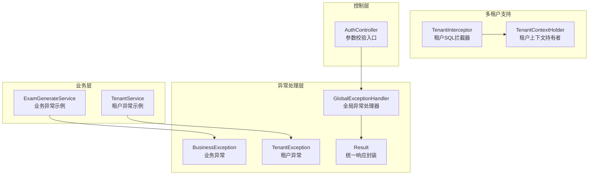
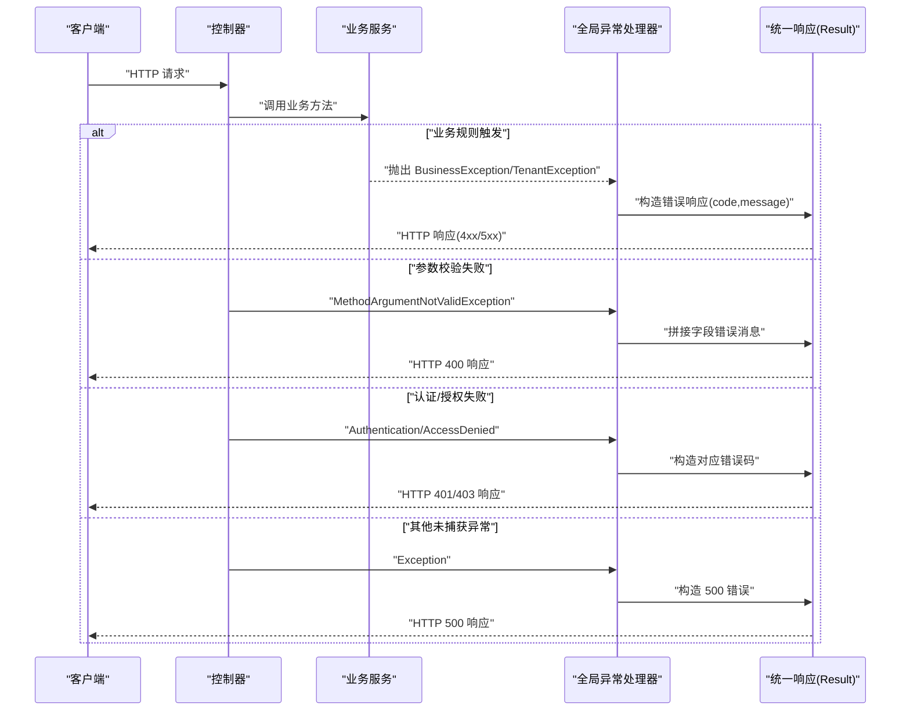
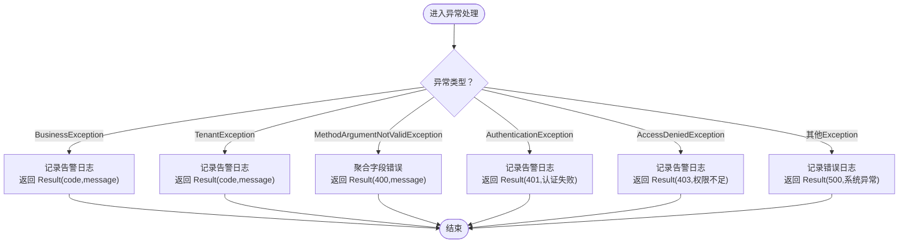
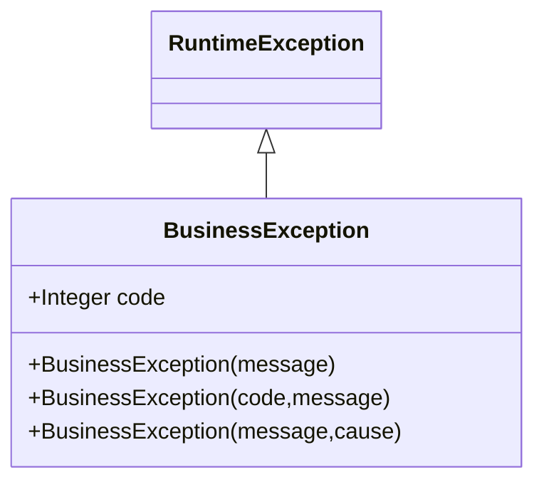
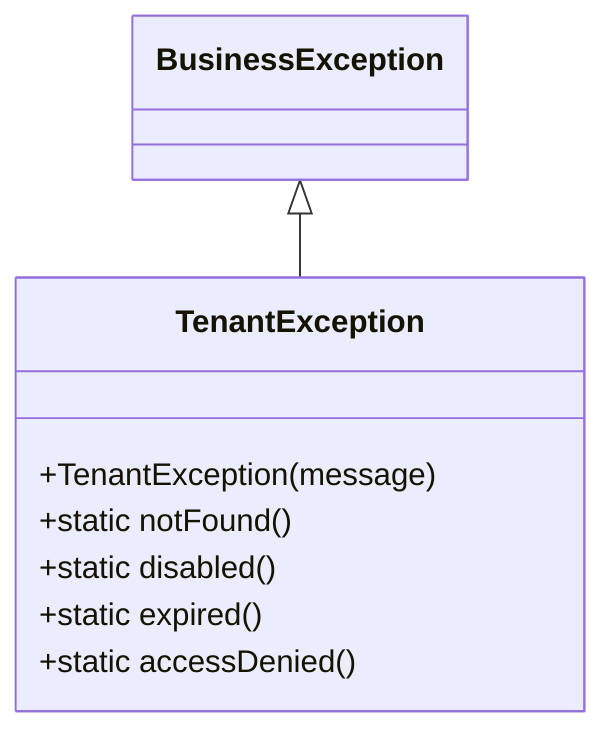
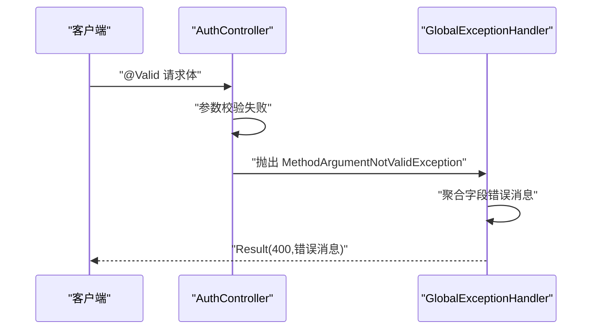
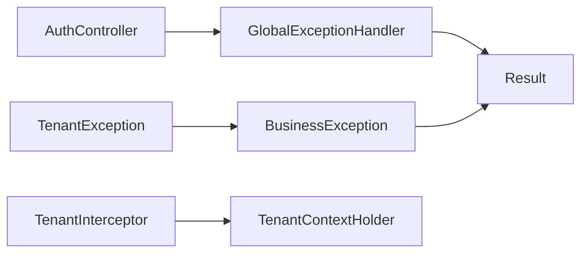

# 异常处理策略

<cite>
**本文引用的文件**
- [GlobalExceptionHandler.java](file://backend/src/main/java/com/edu/common/exception/GlobalExceptionHandler.java)
- [BusinessException.java](file://backend/src/main/java/com/edu/common/exception/BusinessException.java)
- [TenantException.java](file://backend/src/main/java/com/edu/common/exception/TenantException.java)
- [Result.java](file://backend/src/main/java/com/edu/common/entity/Result.java)
- [TenantInterceptor.java](file://backend/src/main/java/com/edu/common/interceptor/TenantInterceptor.java)
- [TenantContextHolder.java](file://backend/src/main/java/com/edu/common/util/TenantContextHolder.java)
- [AuthController.java](file://backend/src/main/java/com/edu/user/controller/AuthController.java)
- [ExamGenerateService.java](file://backend/src/main/java/com/edu/exam/service/ExamGenerateService.java)
- [TenantService.java](file://backend/src/main/java/com/edu/tenant/service/TenantService.java)
- [GlobalExceptionHandlerTest.java](file://backend/src/test/java/com/edu/common/exception/GlobalExceptionHandlerTest.java)
</cite>

## 目录
1. [引言](#引言)
2. [项目结构](#项目结构)
3. [核心组件](#核心组件)
4. [架构总览](#架构总览)
5. [详细组件分析](#详细组件分析)
6. [依赖分析](#依赖分析)
7. [性能考量](#性能考量)
8. [故障排查指南](#故障排查指南)
9. [结论](#结论)
10. [附录](#附录)

## 引言
本指南围绕全局异常处理器与业务异常体系，系统阐述异常分类、处理流程、最佳实践与多租户场景下的异常管理策略。重点包括：
- 全局异常处理器的设计与实现（含业务异常、租户异常、参数校验异常、认证/授权异常与通用异常）。
- 业务异常 BusinessException 的定义、异常码与错误信息设计原则。
- 租户异常 TenantException 的特殊处理逻辑与多租户场景下的异常管理。
- 参数校验异常 MethodArgumentNotValidException 的统一处理方式。
- 日志记录、错误响应格式与用户体验优化建议。
- 常见异常场景与处理方案示例。

## 项目结构
异常处理相关代码主要分布在以下模块：
- 异常定义与全局处理器：common.exception
- 统一响应封装：common.entity.Result
- 多租户拦截与上下文：common.interceptor 与 common.util
- 控制层参数校验：user.controller
- 业务服务中的异常抛出：exam.service、tenant.service 等

图表来源
- [GlobalExceptionHandler.java:1-69](file://backend/src/main/java/com/edu/common/exception/GlobalExceptionHandler.java#L1-L69)
- [BusinessException.java:1-28](file://backend/src/main/java/com/edu/common/exception/BusinessException.java#L1-L28)
- [TenantException.java:1-28](file://backend/src/main/java/com/edu/common/exception/TenantException.java#L1-L28)
- [Result.java:1-44](file://backend/src/main/java/com/edu/common/entity/Result.java#L1-L44)
- [TenantInterceptor.java:1-142](file://backend/src/main/java/com/edu/common/interceptor/TenantInterceptor.java#L1-L142)
- [TenantContextHolder.java:1-24](file://backend/src/main/java/com/edu/common/util/TenantContextHolder.java#L1-L24)
- [AuthController.java:1-32](file://backend/src/main/java/com/edu/user/controller/AuthController.java#L1-L32)
- [ExamGenerateService.java:140-339](file://backend/src/main/java/com/edu/exam/service/ExamGenerateService.java#L140-L339)
- [TenantService.java:20-81](file://backend/src/main/java/com/edu/tenant/service/TenantService.java#L20-L81)

章节来源
- [GlobalExceptionHandler.java:1-69](file://backend/src/main/java/com/edu/common/exception/GlobalExceptionHandler.java#L1-L69)
- [Result.java:1-44](file://backend/src/main/java/com/edu/common/entity/Result.java#L1-L44)

## 核心组件
- 全局异常处理器：通过@RestControllerAdvice集中捕获各类异常，返回统一的 Result 响应结构，确保前后端一致的错误语义与状态码。
- 业务异常 BusinessException：面向业务规则的异常，支持自定义异常码与消息，便于前端识别与提示。
- 租户异常 TenantException：继承 BusinessException，针对多租户场景的特定异常（不存在、禁用、过期、无权访问），统一返回 403 状态码。
- 统一响应 Result：封装 code、message、data 字段，提供 success 与 error 工厂方法，简化控制器返回值构造。
- 多租户拦截器 TenantInterceptor：在 SQL 层面自动注入租户过滤条件，配合 TenantContextHolder 实现租户隔离。
- 控制层参数校验：结合 @Valid 与全局异常处理器，统一处理参数校验失败。

章节来源
- [GlobalExceptionHandler.java:16-68](file://backend/src/main/java/com/edu/common/exception/GlobalExceptionHandler.java#L16-L68)
- [BusinessException.java:5-27](file://backend/src/main/java/com/edu/common/exception/BusinessException.java#L5-L27)
- [TenantException.java:3-27](file://backend/src/main/java/com/edu/common/exception/TenantException.java#L3-L27)
- [Result.java:6-43](file://backend/src/main/java/com/edu/common/entity/Result.java#L6-L43)
- [TenantInterceptor.java:25-141](file://backend/src/main/java/com/edu/common/interceptor/TenantInterceptor.java#L25-L141)
- [TenantContextHolder.java:5-23](file://backend/src/main/java/com/edu/common/util/TenantContextHolder.java#L5-L23)

## 架构总览
下图展示异常从产生到统一响应的关键路径，涵盖业务异常、租户异常、参数校验异常以及认证/授权异常的处理流程。

图表来源
- [GlobalExceptionHandler.java:23-67](file://backend/src/main/java/com/edu/common/exception/GlobalExceptionHandler.java#L23-L67)
- [Result.java:21-43](file://backend/src/main/java/com/edu/common/entity/Result.java#L21-L43)

## 详细组件分析

### 全局异常处理器（GlobalExceptionHandler）
- 设计要点
  - 使用@RestControllerAdvice对控制器层进行切面增强，集中处理异常。
  - 分类处理：业务异常、租户异常、参数校验异常、认证异常、权限异常、通用异常。
  - 返回统一 Result 结构，明确状态码与错误信息。
- 处理策略
  - 业务异常：BAD_REQUEST，使用异常码与消息。
  - 租户异常：FORBIDDEN，使用异常码与消息。
  - 参数校验异常：聚合字段级错误消息，统一 BAD_REQUEST。
  - 认证异常：UNAUTHORIZED，固定提示“认证失败”。
  - 权限异常：FORBIDDEN，固定提示“权限不足”。
  - 通用异常：INTERNAL_SERVER_ERROR，固定提示“系统异常，请联系管理员”。

图表来源
- [GlobalExceptionHandler.java:23-67](file://backend/src/main/java/com/edu/common/exception/GlobalExceptionHandler.java#L23-L67)

章节来源
- [GlobalExceptionHandler.java:16-68](file://backend/src/main/java/com/edu/common/exception/GlobalExceptionHandler.java#L16-L68)

### 业务异常（BusinessException）
- 定义与特性
  - 继承 RuntimeException，支持自定义异常码与消息，便于前端识别与国际化。
  - 默认异常码为 400，亦可传入自定义码。
- 使用场景
  - 业务规则不满足（如资源不存在、参数非法、操作不可执行等）。
  - 在多个业务服务中广泛使用，例如题库为空、学生不存在、用户名已存在等。
- 最佳实践
  - 异常码与消息需语义清晰、可读性强；避免泄露内部实现细节。
  - 对可预期的业务错误使用 BusinessException，提升用户体验与可观测性。

图表来源
- [BusinessException.java:8-27](file://backend/src/main/java/com/edu/common/exception/BusinessException.java#L8-L27)

章节来源
- [BusinessException.java:5-27](file://backend/src/main/java/com/edu/common/exception/BusinessException.java#L5-L27)
- [ExamGenerateService.java:140-339](file://backend/src/main/java/com/edu/exam/service/ExamGenerateService.java#L140-L339)

### 租户异常（TenantException）
- 特殊处理逻辑
  - 继承 BusinessException，强制使用 403 异常码，强调“无权访问”语义。
  - 提供静态工厂方法：notFound、disabled、expired、accessDenied，便于快速构建典型租户异常。
- 多租户场景下的异常管理
  - 与 TenantInterceptor 协作，在 SQL 层自动注入租户过滤条件，避免越权查询。
  - TenantContextHolder 存储当前请求的租户 ID，拦截器基于此动态拼接 WHERE 条件。
- 最佳实践
  - 对于涉及租户隔离的资源访问，优先检查租户状态与有效期，再抛出 TenantException。
  - 将“无权访问”与“资源不存在/禁用/过期”区分对待，便于前端精准提示。

图表来源
- [TenantException.java:6-27](file://backend/src/main/java/com/edu/common/exception/TenantException.java#L6-L27)
- [BusinessException.java:8-27](file://backend/src/main/java/com/edu/common/exception/BusinessException.java#L8-L27)

章节来源
- [TenantException.java:3-27](file://backend/src/main/java/com/edu/common/exception/TenantException.java#L3-L27)
- [TenantInterceptor.java:25-141](file://backend/src/main/java/com/edu/common/interceptor/TenantInterceptor.java#L25-L141)
- [TenantContextHolder.java:5-23](file://backend/src/main/java/com/edu/common/util/TenantContextHolder.java#L5-L23)
- [TenantService.java:44-56](file://backend/src/main/java/com/edu/tenant/service/TenantService.java#L44-L56)

### 参数校验异常处理（MethodArgumentNotValidException）
- 统一处理方式
  - 全局捕获 MethodArgumentNotValidException，聚合所有字段级错误消息，返回统一的 400 响应。
  - 与控制器层 @Valid/@Validated 配合，实现声明式参数校验。
- 示例入口
  - AuthController 中对登录与注册请求体进行参数校验，失败时由全局异常处理器统一返回。

图表来源
- [GlobalExceptionHandler.java:37-46](file://backend/src/main/java/com/edu/common/exception/GlobalExceptionHandler.java#L37-L46)
- [AuthController.java:20-30](file://backend/src/main/java/com/edu/user/controller/AuthController.java#L20-L30)

章节来源
- [GlobalExceptionHandler.java:37-46](file://backend/src/main/java/com/edu/common/exception/GlobalExceptionHandler.java#L37-L46)
- [AuthController.java:9-30](file://backend/src/main/java/com/edu/user/controller/AuthController.java#L9-L30)

### 统一响应封装（Result）
- 设计目标
  - 规范化 API 响应结构，统一 success/error 工厂方法，减少重复代码。
- 关键字段
  - code：状态码（200 成功；4xx/5xx 错误）。
  - message：消息文本。
  - data：泛型数据体。
- 使用建议
  - 成功场景使用 Result.success(...)；错误场景使用 Result.error(...)。
  - 与全局异常处理器配合，确保前后端一致的错误语义。

章节来源
- [Result.java:6-43](file://backend/src/main/java/com/edu/common/entity/Result.java#L6-L43)

## 依赖分析
- 全局异常处理器依赖 Spring MVC 的异常传播机制与统一响应封装。
- 业务异常与租户异常依赖统一响应封装以输出一致的错误结构。
- 多租户拦截器依赖租户上下文持有者，实现跨层的租户隔离。
- 控制层参数校验依赖 Bean Validation 与全局异常处理器协作。

图表来源
- [GlobalExceptionHandler.java:1-12](file://backend/src/main/java/com/edu/common/exception/GlobalExceptionHandler.java#L1-L12)
- [Result.java:1-5](file://backend/src/main/java/com/edu/common/entity/Result.java#L1-L5)
- [BusinessException.java:1-4](file://backend/src/main/java/com/edu/common/exception/BusinessException.java#L1-L4)
- [TenantException.java:1-2](file://backend/src/main/java/com/edu/common/exception/TenantException.java#L1-L2)
- [TenantInterceptor.java:1-24](file://backend/src/main/java/com/edu/common/interceptor/TenantInterceptor.java#L1-L24)
- [TenantContextHolder.java:1-4](file://backend/src/main/java/com/edu/common/util/TenantContextHolder.java#L1-L4)
- [AuthController.java:1-11](file://backend/src/main/java/com/edu/user/controller/AuthController.java#L1-L11)

章节来源
- [GlobalExceptionHandler.java:1-12](file://backend/src/main/java/com/edu/common/exception/GlobalExceptionHandler.java#L1-L12)
- [TenantInterceptor.java:1-24](file://backend/src/main/java/com/edu/common/interceptor/TenantInterceptor.java#L1-L24)

## 性能考量
- 异常处理开销
  - 全局异常处理器仅在异常发生时介入，正常路径零开销。
  - 参数校验异常聚合采用流式收集，复杂度与字段数线性相关。
- 日志级别
  - 业务异常与参数校验异常使用告警级别日志，便于问题定位。
  - 通用异常记录错误级别日志，保留堆栈以便排查。
- 响应一致性
  - 统一响应封装减少序列化差异，提升接口稳定性与缓存友好性。

## 故障排查指南
- 常见问题定位
  - 业务异常：检查 BusinessException 抛出位置与异常码是否符合预期。
  - 租户异常：确认 TenantContextHolder 是否正确设置租户 ID，TenantInterceptor 是否生效。
  - 参数校验异常：核对控制器上的 @Valid 注解与 DTO 字段约束。
  - 认证/授权异常：检查安全配置与用户会话状态。
- 单元测试参考
  - GlobalExceptionHandlerTest 验证业务异常与租户异常的响应码与消息。
- 排查步骤
  - 查看全局异常处理器日志输出（告警/错误级别）。
  - 核对 Result 响应结构与状态码映射。
  - 针对多租户场景，验证 SQL 拦截器是否正确注入 tenant_id 条件。

章节来源
- [GlobalExceptionHandlerTest.java:12-38](file://backend/src/test/java/com/edu/common/exception/GlobalExceptionHandlerTest.java#L12-L38)
- [GlobalExceptionHandler.java:23-67](file://backend/src/main/java/com/edu/common/exception/GlobalExceptionHandler.java#L23-L67)

## 结论
本异常处理策略通过全局异常处理器与统一响应封装，实现了业务异常、租户异常、参数校验异常与通用异常的一致化处理。结合多租户拦截器与上下文管理，既保证了数据隔离，又提升了用户体验与可观测性。建议在后续迭代中持续完善异常码与消息的语义化设计，并加强日志与监控联动，以进一步提升系统的稳定性与可维护性。

## 附录
- 异常处理最佳实践清单
  - 明确异常分类：业务异常（400）、租户异常（403）、认证异常（401）、权限异常（403）、通用异常（500）。
  - 统一响应格式：code、message、data，保持前后端一致。
  - 参数校验：控制器层使用 @Valid，配合全局异常处理器统一返回。
  - 多租户隔离：SQL 层自动注入 tenant_id，避免越权访问。
  - 日志记录：区分告警与错误级别，保留关键上下文信息。
  - 用户体验：错误消息简洁明确，必要时提供错误码便于前端国际化与定制提示。