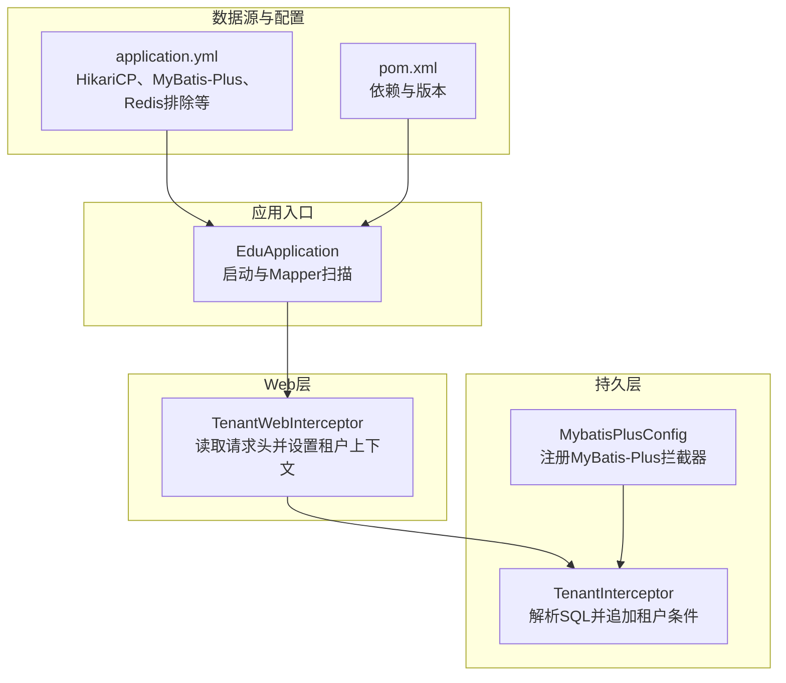
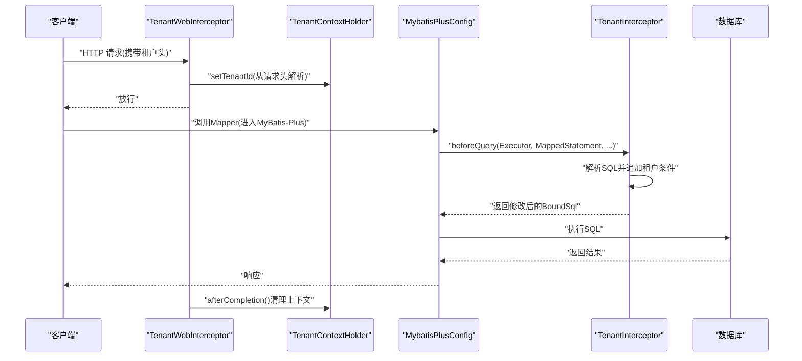
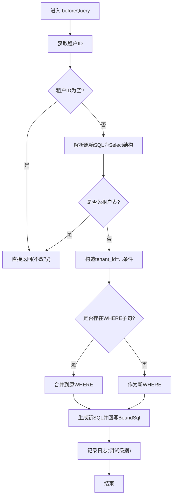
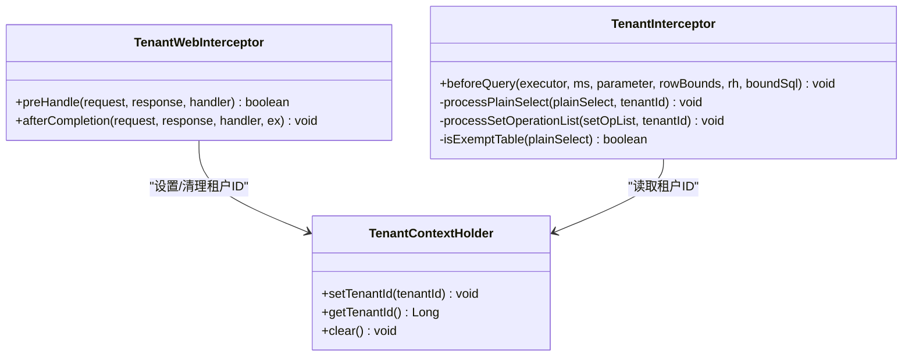
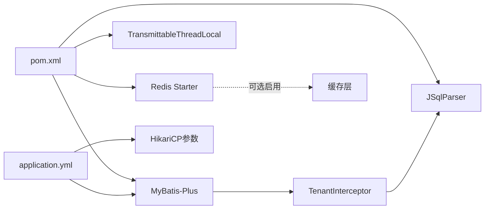

# 性能优化技巧

<cite>
**本文引用的文件**
- [EduApplication.java](file://backend/src/main/java/com/edu/EduApplication.java)
- [MybatisPlusConfig.java](file://backend/src/main/java/com/edu/common/config/MybatisPlusConfig.java)
- [TenantInterceptor.java](file://backend/src/main/java/com/edu/common/interceptor/TenantInterceptor.java)
- [TenantWebInterceptor.java](file://backend/src/main/java/com/edu/common/interceptor/TenantWebInterceptor.java)
- [TenantContextHolder.java](file://backend/src/main/java/com/edu/common/util/TenantContextHolder.java)
- [application.yml](file://backend/src/main/resources/application.yml)
- [pom.xml](file://backend/pom.xml)
</cite>

## 目录
1. [引言](#引言)
2. [项目结构](#项目结构)
3. [核心组件](#核心组件)
4. [架构总览](#架构总览)
5. [详细组件分析](#详细组件分析)
6. [依赖分析](#依赖分析)
7. [性能考量](#性能考量)
8. [故障排查指南](#故障排查指南)
9. [结论](#结论)
10. [附录](#附录)

## 引言
本指南聚焦于本项目的性能优化实践，围绕数据库查询优化（含 MyBatis-Plus 配置、分页与批量）、多租户拦截器的性能影响与线程安全、缓存策略设计（Redis 集成与失效策略）、并发处理（线程池、异步与锁优化）、内存管理与 GC 优化、以及性能监控与测试方法展开。内容以仓库现有实现为基础，结合最佳实践给出可操作的建议。

## 项目结构
后端采用 Spring Boot 3 + MyBatis-Plus 架构，核心入口类负责扫描 Mapper 并启动应用；数据库连接池通过 HikariCP 配置；多租户能力由拦截器链路实现，Web 层通过拦截器注入租户上下文，持久层通过 MyBatis-Plus 拦截器自动追加租户过滤条件。

图示来源
- [EduApplication.java:1-15](file://backend/src/main/java/com/edu/EduApplication.java#L1-L15)
- [MybatisPlusConfig.java:1-23](file://backend/src/main/java/com/edu/common/config/MybatisPlusConfig.java#L1-L23)
- [TenantInterceptor.java:1-142](file://backend/src/main/java/com/edu/common/interceptor/TenantInterceptor.java#L1-L142)
- [TenantWebInterceptor.java:1-42](file://backend/src/main/java/com/edu/common/interceptor/TenantWebInterceptor.java#L1-L42)
- [application.yml:1-65](file://backend/src/main/resources/application.yml#L1-L65)
- [pom.xml:1-152](file://backend/pom.xml#L1-L152)

章节来源
- [EduApplication.java:1-15](file://backend/src/main/java/com/edu/EduApplication.java#L1-L15)
- [application.yml:1-65](file://backend/src/main/resources/application.yml#L1-L65)
- [pom.xml:1-152](file://backend/pom.xml#L1-L152)

## 核心组件
- 应用入口：负责启动与 Mapper 扫描，确保持久层组件被正确加载。
- 数据库配置：HikariCP 连接池参数直接影响连接获取与复用效率。
- MyBatis-Plus 配置：注册拦截器链，承载多租户等插件能力。
- 多租户拦截器：在 SQL 解析阶段自动追加租户过滤条件，避免越权与全表扫描。
- Web 层租户拦截器：从请求头读取租户 ID，写入线程本地上下文。
- 线程上下文：基于 TransmittableThreadLocal 的租户上下文，支持线程池任务传递。

章节来源
- [EduApplication.java:1-15](file://backend/src/main/java/com/edu/EduApplication.java#L1-L15)
- [MybatisPlusConfig.java:1-23](file://backend/src/main/java/com/edu/common/config/MybatisPlusConfig.java#L1-L23)
- [TenantInterceptor.java:1-142](file://backend/src/main/java/com/edu/common/interceptor/TenantInterceptor.java#L1-L142)
- [TenantWebInterceptor.java:1-42](file://backend/src/main/java/com/edu/common/interceptor/TenantWebInterceptor.java#L1-L42)
- [TenantContextHolder.java:1-24](file://backend/src/main/java/com/edu/common/util/TenantContextHolder.java#L1-L24)
- [application.yml:15-29](file://backend/src/main/resources/application.yml#L15-L29)

## 架构总览
下图展示一次典型请求的性能路径：Web 层设置租户上下文 → MyBatis-Plus 拦截器解析 SQL → 自动追加租户条件 → 执行查询。

图示来源
- [TenantWebInterceptor.java:1-42](file://backend/src/main/java/com/edu/common/interceptor/TenantWebInterceptor.java#L1-L42)
- [TenantContextHolder.java:1-24](file://backend/src/main/java/com/edu/common/util/TenantContextHolder.java#L1-L24)
- [MybatisPlusConfig.java:1-23](file://backend/src/main/java/com/edu/common/config/MybatisPlusConfig.java#L1-L23)
- [TenantInterceptor.java:1-142](file://backend/src/main/java/com/edu/common/interceptor/TenantInterceptor.java#L1-L142)

## 详细组件分析

### 数据库查询优化（MyBatis-Plus）
- 插件注册：通过配置类注册 MyBatis-Plus 拦截器，承载多租户等能力。
- SQL 解析与改写：拦截器在 beforeQuery 阶段解析 SQL，对 PlainSelect 与 SetOperationList 分支处理，自动追加租户条件。
- 免租户表白名单：内置默认免租户表集合，避免对某些关联表或系统表重复追加过滤条件。
- 性能要点：
  - 使用 JSqlParser 解析 SQL，注意解析开销与异常处理成本。
  - 对免租户表跳过改写，减少不必要的字符串拼接与表达式构造。
  - 结合数据库索引（如按 tenant_id 建索引）提升过滤效率。

图示来源
- [TenantInterceptor.java:66-95](file://backend/src/main/java/com/edu/common/interceptor/TenantInterceptor.java#L66-L95)
- [TenantInterceptor.java:97-122](file://backend/src/main/java/com/edu/common/interceptor/TenantInterceptor.java#L97-L122)
- [TenantInterceptor.java:124-140](file://backend/src/main/java/com/edu/common/interceptor/TenantInterceptor.java#L124-L140)

章节来源
- [MybatisPlusConfig.java:16-21](file://backend/src/main/java/com/edu/common/config/MybatisPlusConfig.java#L16-L21)
- [TenantInterceptor.java:1-142](file://backend/src/main/java/com/edu/common/interceptor/TenantInterceptor.java#L1-L142)

### 分页查询优化
- 建议使用 MyBatis-Plus 的分页插件，避免一次性加载大结果集。
- 合理设置分页大小与边界校验，防止超大页码导致全表扫描。
- 在高频分页场景下，优先使用“游标翻页”或“基于索引”的范围分页，减少 offset 跳转成本。
- 为分页查询字段建立合适索引，避免排序与过滤引发的额外扫描。

（本节为通用优化建议，未直接分析具体文件）

### 批量操作处理
- 批量插入/更新/删除时，尽量使用 JDBC 批处理或 MyBatis-Plus 的批量接口，减少往返次数。
- 控制批大小，避免单次提交过大导致内存压力与事务时间过长。
- 对批量操作进行幂等性与原子性控制，必要时拆分为多个小批次并记录进度。

（本节为通用优化建议，未直接分析具体文件）

### 多租户拦截器的性能影响与优化
- 执行效率：
  - SQL 解析与表达式重写存在 CPU 成本，应避免对免租户表与简单 SQL 的过度改写。
  - 日志级别建议保持在调试级别，生产环境避免频繁打印大量 SQL。
- 线程安全：
  - 使用 TransmittableThreadLocal 存储租户 ID，支持线程池任务传递，避免跨线程丢失租户上下文。
  - 在请求完成后务必清理上下文，防止内存泄漏。
- 优化建议：
  - 将免租户表集合初始化为不可变集合，减少并发修改开销。
  - 对频繁访问的只读查询，可考虑缓存结果（见“缓存策略设计”）。

图示来源
- [TenantWebInterceptor.java:1-42](file://backend/src/main/java/com/edu/common/interceptor/TenantWebInterceptor.java#L1-L42)
- [TenantContextHolder.java:1-24](file://backend/src/main/java/com/edu/common/util/TenantContextHolder.java#L1-L24)
- [TenantInterceptor.java:1-142](file://backend/src/main/java/com/edu/common/interceptor/TenantInterceptor.java#L1-L142)

章节来源
- [TenantWebInterceptor.java:1-42](file://backend/src/main/java/com/edu/common/interceptor/TenantWebInterceptor.java#L1-L42)
- [TenantContextHolder.java:1-24](file://backend/src/main/java/com/edu/common/util/TenantContextHolder.java#L1-L24)
- [TenantInterceptor.java:1-142](file://backend/src/main/java/com/edu/common/interceptor/TenantInterceptor.java#L1-L142)

### 缓存策略设计（Redis 集成、失效策略、热点数据）
- Redis 集成现状：配置文件中已引入 Redis Starter，并显式排除了自动配置，便于按需启用。
- 建议策略：
  - 读多写少的数据使用本地缓存 + Redis 双层缓存，降低网络延迟。
  - 采用“热点键分散”与“多副本”策略，避免单点压力。
  - 设计合理的过期时间与主动失效机制，结合 LFU/LRU 策略淘汰冷数据。
  - 对热点列表使用布隆过滤器预判存在性，减少无效查询。
- 注意：当前仓库未包含 Redis 缓存实现代码，以上为通用设计建议。

章节来源
- [application.yml:26-30](file://backend/src/main/resources/application.yml#L26-L30)
- [pom.xml:69-73](file://backend/pom.xml#L69-L73)

### 并发处理优化（线程池、异步、锁）
- 线程池配置：根据 CPU 核数与 IO 密集度设置核心/最大线程数、队列容量与拒绝策略。
- 异步处理：对非关键路径（如日志、通知、统计）使用异步执行，避免阻塞主线程。
- 锁优化：优先使用无锁容器与原子变量；对热点资源使用分段锁或读写锁；避免长事务与死锁。
- 与多租户结合：使用 TransmittableThreadLocal 保证异步任务继承租户上下文。

（本节为通用优化建议，未直接分析具体文件）

### 内存管理与垃圾回收优化（对象池化、内存泄漏预防）
- 对象池化：对高并发下的临时对象（如 DTO、查询条件）使用对象池，减少 GC 压力。
- 内存泄漏预防：确保租户上下文在请求结束后清理；避免静态集合长期持有对象；及时释放大对象引用。
- GC 调优：关注 Full GC 频率与停顿时间，合理设置堆大小与新生代比例；使用 G1/ ZGC 等低停顿收集器。

（本节为通用优化建议，未直接分析具体文件）

## 依赖分析
- MyBatis-Plus 与 HikariCP：通过配置文件集中管理连接池参数，直接影响数据库访问性能。
- JSqlParser：用于 SQL 解析与改写，需评估解析成本与兼容性。
- TransmittableThreadLocal：保障多线程与线程池场景下的上下文传递。
- Redis Starter：预留缓存扩展能力，当前处于排除状态以便按需启用。

图示来源
- [pom.xml:48-113](file://backend/pom.xml#L48-L113)
- [application.yml:15-29](file://backend/src/main/resources/application.yml#L15-L29)
- [TenantInterceptor.java:1-142](file://backend/src/main/java/com/edu/common/interceptor/TenantInterceptor.java#L1-L142)

章节来源
- [pom.xml:1-152](file://backend/pom.xml#L1-L152)
- [application.yml:1-65](file://backend/src/main/resources/application.yml#L1-L65)

## 性能考量
- 数据库层
  - 连接池参数：minimum-idle、maximum-pool-size、idle-timeout、connection-timeout 需结合 QPS 与事务时长调优。
  - 索引策略：为 tenant_id、分页排序字段与过滤条件建立复合索引。
  - SQL 改写：仅对必要表追加租户条件，避免对免租户表与简单查询的过度改写。
- 拦截器链路
  - 解析成本：JSqlParser 解析与表达式构造有 CPU 开销，建议在高频路径上做缓存或降级。
  - 日志级别：生产环境避免打印大量 SQL，降低 IO 压力。
- 上下文管理
  - 清理时机：确保 afterCompletion 中清理租户上下文，防止线程复用导致的脏读。
  - 传递性：使用 TransmittableThreadLocal 保证异步任务继承租户信息。
- 缓存与并发
  - 缓存命中率：通过热点键分散与合理的过期策略提升命中率。
  - 并发控制：避免热点资源争用，使用无锁或细粒度锁。

（本节为通用优化建议，未直接分析具体文件）

## 故障排查指南
- SQL 改写失败
  - 现象：抛出解析异常或改写失败。
  - 排查：检查 SQL 是否符合 JSqlParser 支持语法；确认拦截器是否正确注入；查看日志级别是否足够。
  - 参考路径：[TenantInterceptor.java:77-81](file://backend/src/main/java/com/edu/common/interceptor/TenantInterceptor.java#L77-L81)
- 租户越权
  - 现象：查询结果包含其他租户数据。
  - 排查：确认请求头是否正确传递；检查免租户表白名单；验证数据库索引是否生效。
  - 参考路径：[TenantWebInterceptor.java:20-34](file://backend/src/main/java/com/edu/common/interceptor/TenantWebInterceptor.java#L20-L34)，[TenantInterceptor.java:97-110](file://backend/src/main/java/com/edu/common/interceptor/TenantInterceptor.java#L97-L110)
- 上下文泄漏
  - 现象：异步任务或线程池任务读取到错误的租户 ID。
  - 排查：确认 afterCompletion 是否被调用；检查线程池是否正确传递上下文。
  - 参考路径：[TenantWebInterceptor.java:36-41](file://backend/src/main/java/com/edu/common/interceptor/TenantWebInterceptor.java#L36-L41)，[TenantContextHolder.java:10-22](file://backend/src/main/java/com/edu/common/util/TenantContextHolder.java#L10-L22)
- 连接池问题
  - 现象：连接耗尽、超时或频繁创建销毁。
  - 排查：核对 minimum-idle、maximum-pool-size、idle-timeout、connection-timeout；观察慢查询与锁等待。
  - 参考路径：[application.yml:20-24](file://backend/src/main/resources/application.yml#L20-L24)

章节来源
- [TenantInterceptor.java:77-81](file://backend/src/main/java/com/edu/common/interceptor/TenantInterceptor.java#L77-L81)
- [TenantWebInterceptor.java:20-34](file://backend/src/main/java/com/edu/common/interceptor/TenantWebInterceptor.java#L20-L34)
- [TenantWebInterceptor.java:36-41](file://backend/src/main/java/com/edu/common/interceptor/TenantWebInterceptor.java#L36-L41)
- [TenantContextHolder.java:10-22](file://backend/src/main/java/com/edu/common/util/TenantContextHolder.java#L10-L22)
- [application.yml:20-24](file://backend/src/main/resources/application.yml#L20-L24)

## 结论
本项目的性能优化基础良好：通过 MyBatis-Plus 拦截器实现多租户过滤，配合 HikariCP 与合理的 SQL 改写策略，可在保证数据隔离的同时兼顾查询效率。后续建议围绕缓存层启用、热点数据治理、线程池与异步优化、以及 GC 调优等方面持续演进，形成完整的性能优化闭环。

## 附录
- 性能监控与诊断
  - JVM 指标：堆内存、GC 次数与停顿、线程数、打开文件句柄数。
  - 应用指标：QPS、P95/P99 延迟、错误率、慢查询数。
  - 数据库指标：连接池使用率、锁等待、全表扫描次数、索引使用率。
- 性能测试方法与指标
  - 压测工具：JMeter、Gatling、wrk。
  - 关键指标：吞吐量、响应时间分布、错误率、资源占用。
  - 场景设计：峰值 QPS、长时间稳定负载、突发流量、数据库慢查询回归测试。

（本节为通用指导，未直接分析具体文件）