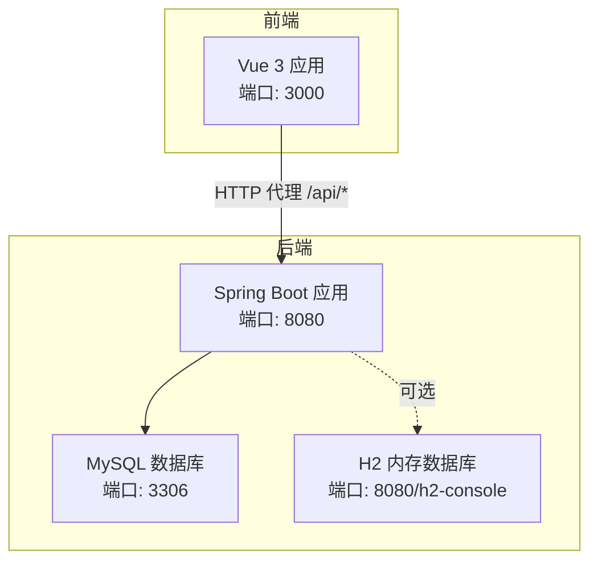
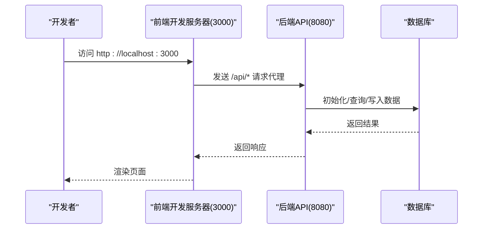
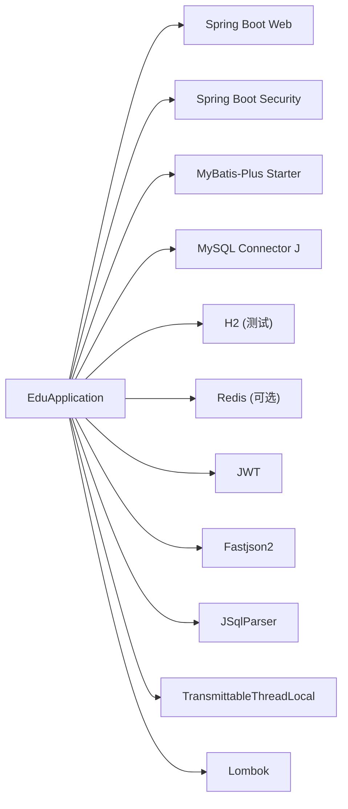

# 快速开始

<cite>
**本文引用的文件**
- [README.md](file://README.md)
- [INSTALL.md](file://INSTALL.md)
- [pom.xml](file://backend/pom.xml)
- [application.yml](file://backend/src/main/resources/application.yml)
- [application-simple.yml](file://backend/src/main/resources/application-simple.yml)
- [application-h2.yml](file://backend/src/main/resources/application-h2.yml)
- [schema.sql](file://backend/src/main/resources/db/schema.sql)
- [init-data.sql](file://backend/src/main/resources/db/init-data.sql)
- [EduApplication.java](file://backend/src/main/java/com/edu/EduApplication.java)
- [start-backend.bat](file://start-backend.bat)
- [start-h2.bat](file://start-h2.bat)
- [start-frontend.bat](file://start-frontend.bat)
- [package.json](file://frontend/package.json)
- [vite.config.ts](file://frontend/vite.config.ts)
- [install-env.bat](file://install-env.bat)
</cite>

## 目录
1. [简介](#简介)
2. [项目结构](#项目结构)
3. [核心组件](#核心组件)
4. [架构总览](#架构总览)
5. [详细组件分析](#详细组件分析)
6. [依赖分析](#依赖分析)
7. [性能考虑](#性能考虑)
8. [故障排查指南](#故障排查指南)
9. [结论](#结论)
10. [附录](#附录)

## 简介
本指南面向开发者，帮助你在最短时间内完成“教师智能教学系统”的环境准备、数据库初始化与前后端启动。你将获得：
- 完整的环境要求与安装步骤
- 数据库初始化与配置方法
- Windows 与 Linux/Mac 的不同操作方式
- 常见启动问题与解决方案
- 首次访问系统的操作指引与基础功能演示

## 项目结构
该仓库采用前后端分离架构：
- 后端基于 Spring Boot 3.x + MyBatis-Plus，使用 MySQL 作为主存储（可选 H2 内存库用于测试）
- 前端基于 Vue 3 + Vite，通过本地代理转发 API 请求至后端
- 提供多套启动脚本与配置文件，覆盖开发、测试与生产场景

图表来源
- [vite.config.ts:12-20](file://frontend/vite.config.ts#L12-L20)
- [application.yml:1-65](file://backend/src/main/resources/application.yml#L1-L65)
- [application-h2.yml:20-31](file://backend/src/main/resources/application-h2.yml#L20-L31)

章节来源
- [README.md:1-88](file://README.md#L1-L88)
- [INSTALL.md:1-134](file://INSTALL.md#L1-L134)

## 核心组件
- 后端应用入口与扫描路径
  - 入口类负责启动 Spring Boot 应用，并启用 MyBatis Mapper 扫描
  - 参考路径：[EduApplication.java:1-15](file://backend/src/main/java/com/edu/EduApplication.java#L1-L15)
- 配置文件
  - 生产配置：[application.yml:1-65](file://backend/src/main/resources/application.yml#L1-L65)
  - 简化配置（便于本地快速验证）：[application-simple.yml:1-64](file://backend/src/main/resources/application-simple.yml#L1-L64)
  - H2 内存库配置（无需安装 MySQL）：[application-h2.yml:1-76](file://backend/src/main/resources/application-h2.yml#L1-L76)
- 数据库脚本
  - 模式定义：[schema.sql:1-379](file://backend/src/main/resources/db/schema.sql#L1-L379)
  - 初始化数据：[init-data.sql:1-89](file://backend/src/main/resources/db/init-data.sql#L1-L89)
- 前端配置
  - 开发服务器端口与 API 代理：[vite.config.ts:1-21](file://frontend/vite.config.ts#L1-L21)
  - 依赖与脚本：[package.json:1-25](file://frontend/package.json#L1-L25)

章节来源
- [EduApplication.java:1-15](file://backend/src/main/java/com/edu/EduApplication.java#L1-L15)
- [application.yml:1-65](file://backend/src/main/resources/application.yml#L1-L65)
- [application-simple.yml:1-64](file://backend/src/main/resources/application-simple.yml#L1-L64)
- [application-h2.yml:1-76](file://backend/src/main/resources/application-h2.yml#L1-L76)
- [schema.sql:1-379](file://backend/src/main/resources/db/schema.sql#L1-L379)
- [init-data.sql:1-89](file://backend/src/main/resources/db/init-data.sql#L1-L89)
- [vite.config.ts:1-21](file://frontend/vite.config.ts#L1-L21)
- [package.json:1-25](file://frontend/package.json#L1-L25)

## 架构总览
系统采用前后端分离，前端通过本地代理将 /api 前缀的请求转发到后端；后端通过 Spring Boot 自带的 SQL 初始化机制加载数据库结构与默认数据。

图表来源
- [vite.config.ts:12-20](file://frontend/vite.config.ts#L12-L20)
- [application.yml:8-13](file://backend/src/main/resources/application.yml#L8-L13)

## 详细组件分析

### 环境要求与安装
- 后端
  - Java 17+、Maven 3.8+、MySQL 8.x、可选 Redis 7.x
  - 参考：[README.md:3-6](file://README.md#L3-L6)
- 前端
  - Node.js 18+、npm 9+
  - 参考：[README.md:5-6](file://README.md#L5-L6)
- 快速安装（Windows）
  - 使用 winget/scoop/chocolatey 安装 Java 17、Maven、MySQL
  - 参考：[INSTALL.md:5-20](file://INSTALL.md#L5-L20)
- 手动安装（跨平台）
  - Java 17：[INSTALL.md:84-93](file://INSTALL.md#L84-L93)
  - Maven 3.9：[INSTALL.md:89-93](file://INSTALL.md#L89-L93)
  - MySQL 8：[INSTALL.md:95-99](file://INSTALL.md#L95-L99)

章节来源
- [README.md:3-6](file://README.md#L3-L6)
- [INSTALL.md:5-20](file://INSTALL.md#L5-L20)
- [INSTALL.md:84-99](file://INSTALL.md#L84-L99)

### 数据库初始化
- 创建数据库
  - SQL 示例：[README.md:12-14](file://README.md#L12-L14)
- 执行初始化脚本
  - 执行顺序：先 schema.sql，再 init-data.sql
  - 参考：[README.md:16-20](file://README.md#L16-L20)，[schema.sql:1-379](file://backend/src/main/resources/db/schema.sql#L1-L379)，[init-data.sql:1-89](file://backend/src/main/resources/db/init-data.sql#L1-L89)
- 配置数据库连接
  - 环境变量优先：DB_PASSWORD
  - 参考：[README.md:22-35](file://README.md#L22-L35)，[application.yml:15-18](file://backend/src/main/resources/application.yml#L15-L18)
- 使用 H2 内存库（无需 MySQL）
  - 启动脚本会自动切换到 H2 配置
  - 参考：[start-h2.bat:32-38](file://start-h2.bat#L32-L38)，[application-h2.yml:20-31](file://backend/src/main/resources/application-h2.yml#L20-L31)

章节来源
- [README.md:8-35](file://README.md#L8-L35)
- [schema.sql:1-379](file://backend/src/main/resources/db/schema.sql#L1-L379)
- [init-data.sql:1-89](file://backend/src/main/resources/db/init-data.sql#L1-L89)
- [application.yml:15-18](file://backend/src/main/resources/application.yml#L15-L18)
- [start-h2.bat:32-38](file://start-h2.bat#L32-L38)
- [application-h2.yml:20-31](file://backend/src/main/resources/application-h2.yml#L20-L31)

### 启动后端
- 方式一：使用 Maven 直接运行
  - 参考：[README.md:39-52](file://README.md#L39-L52)
- 方式二：打包后运行
  - 参考：[README.md:46-52](file://README.md#L46-L52)，[pom.xml:135-150](file://backend/pom.xml#L135-L150)
- Windows 启动脚本
  - 标准模式：[start-backend.bat:34-39](file://start-backend.bat#L34-L39)
  - H2 模式：[start-h2.bat:32-38](file://start-h2.bat#L32-L38)
- 配置文件选择
  - 生产：application.yml（默认）
  - 简化：application-simple.yml
  - H2：application-h2.yml（通过 profile 切换）

章节来源
- [README.md:37-52](file://README.md#L37-L52)
- [pom.xml:135-150](file://backend/pom.xml#L135-L150)
- [start-backend.bat:34-39](file://start-backend.bat#L34-L39)
- [start-h2.bat:32-38](file://start-h2.bat#L32-L38)
- [application.yml:1-65](file://backend/src/main/resources/application.yml#L1-L65)
- [application-simple.yml:1-64](file://backend/src/main/resources/application-simple.yml#L1-L64)
- [application-h2.yml:1-76](file://backend/src/main/resources/application-h2.yml#L1-L76)

### 启动前端
- 安装依赖与开发启动
  - 参考：[README.md:54-69](file://README.md#L54-L69)，[package.json:6-10](file://frontend/package.json#L6-L10)
- 端口与代理
  - 前端端口：3000
  - 代理目标：http://localhost:8080
  - 参考：[vite.config.ts:12-20](file://frontend/vite.config.ts#L12-L20)
- Windows 启动脚本
  - 参考：[start-frontend.bat:29-33](file://start-frontend.bat#L29-L33)

章节来源
- [README.md:54-69](file://README.md#L54-L69)
- [package.json:6-10](file://frontend/package.json#L6-L10)
- [vite.config.ts:12-20](file://frontend/vite.config.ts#L12-L20)
- [start-frontend.bat:29-33](file://start-frontend.bat#L29-L33)

### 首次访问与基础功能演示
- 访问地址
  - 前端：http://localhost:3000
  - 后端 API：http://localhost:8080/api
  - 参考：[README.md:71-74](file://README.md#L71-L74)
- 默认登录账号
  - 用户名：admin
  - 密码：admin123
  - 参考：[INSTALL.md:113-116](file://INSTALL.md#L113-L116)，[init-data.sql:49-56](file://backend/src/main/resources/db/init-data.sql#L49-L56)
- 功能概览（基于初始化数据）
  - 管理员可进行用户、班级、题库、试卷、批改、成绩分析等操作
  - 参考：[init-data.sql:1-89](file://backend/src/main/resources/db/init-data.sql#L1-L89)

章节来源
- [README.md:71-74](file://README.md#L71-L74)
- [INSTALL.md:113-116](file://INSTALL.md#L113-L116)
- [init-data.sql:1-89](file://backend/src/main/resources/db/init-data.sql#L1-L89)

## 依赖分析
后端主要依赖包括 Web、Security、Validation、MyBatis-Plus、MySQL 驱动、H2、Redis、JWT、Fastjson2、JSqlParser、TransmittableThreadLocal、Lombok 等。

图表来源
- [pom.xml:29-132](file://backend/pom.xml#L29-L132)

章节来源
- [pom.xml:1-152](file://backend/pom.xml#L1-L152)

## 性能考虑
- 连接池参数
  - HikariCP 最小空闲、最大连接、空闲超时、连接超时已在配置中设定
  - 参考：[application.yml:20-24](file://backend/src/main/resources/application.yml#L20-L24)
- 日志与调试
  - 开启 MyBatis SQL 输出与模块调试日志，便于定位性能瓶颈
  - 参考：[application.yml:35-37](file://backend/src/main/resources/application.yml#L35-L37)，[application.yml:61-65](file://backend/src/main/resources/application.yml#L61-L65)
- Redis 可选
  - 若不使用缓存，可保持禁用状态以减少外部依赖
  - 参考：[application.yml:26-31](file://backend/src/main/resources/application.yml#L26-L31)

章节来源
- [application.yml:20-24](file://backend/src/main/resources/application.yml#L20-L24)
- [application.yml:35-37](file://backend/src/main/resources/application.yml#L35-L37)
- [application.yml:61-65](file://backend/src/main/resources/application.yml#L61-L65)
- [application.yml:26-31](file://backend/src/main/resources/application.yml#L26-L31)

## 故障排查指南
- Maven 命令找不到
  - 确保已安装 Maven 并添加到 PATH
  - 参考：[README.md:78-79](file://README.md#L78-L79)
- 数据库连接失败
  - 检查 MySQL 是否运行、用户名密码是否正确、数据库是否已创建
  - 参考：[README.md:81-82](file://README.md#L81-L82)
- 前端启动失败
  - 确保已执行 npm install 安装依赖
  - 参考：[README.md:84-85](file://README.md#L84-L85)
- Redis 连接失败
  - Redis 是可选的，可暂时注释掉相关自动装配或安装 Redis 服务
  - 参考：[README.md:87-88](file://README.md#L87-L88)，[application.yml:26-31](file://backend/src/main/resources/application.yml#L26-L31)
- 端口占用
  - 前端默认 3000，后端默认 8080，如被占用请调整配置
  - 参考：[vite.config.ts:12-20](file://frontend/vite.config.ts#L12-L20)，[application.yml:1-2](file://backend/src/main/resources/application.yml#L1-L2)
- 环境变量未生效
  - Windows 使用 set/PowerShell $env:，Linux/Mac 使用 export
  - 参考：[README.md:26-35](file://README.md#L26-L35)
- H2 模式下数据丢失
  - H2 内存库关闭即清空，适合测试，生产请使用 MySQL
  - 参考：[start-h2.bat:4-5](file://start-h2.bat#L4-L5)

章节来源
- [README.md:76-88](file://README.md#L76-L88)
- [application.yml:1-2](file://backend/src/main/resources/application.yml#L1-L2)
- [vite.config.ts:12-20](file://frontend/vite.config.ts#L12-L20)
- [start-h2.bat:4-5](file://start-h2.bat#L4-L5)

## 结论
按照本指南，你可以快速完成环境准备、数据库初始化与前后端启动。建议优先使用 H2 模式进行本地验证，再切换到 MySQL 进行完整功能测试。遇到问题时，优先检查环境变量、端口占用与数据库连通性。

## 附录

### 端口与默认账号
- 端口
  - 前端：3000
  - 后端：8080
  - MySQL：3306
  - H2 控制台：8080/h2-console
  - 参考：[INSTALL.md:103-109](file://INSTALL.md#L103-L109)，[start-h2.bat:34-36](file://start-h2.bat#L34-L36)
- 默认登录
  - 用户名：admin
  - 密码：admin123
  - 参考：[INSTALL.md:113-116](file://INSTALL.md#L113-L116)，[init-data.sql:49-56](file://backend/src/main/resources/db/init-data.sql#L49-L56)

### 快速命令清单（Windows）
- 启动后端（MySQL）
  - [start-backend.bat:34-39](file://start-backend.bat#L34-L39)
- 启动后端（H2）
  - [start-h2.bat:32-38](file://start-h2.bat#L32-L38)
- 启动前端
  - [start-frontend.bat:29-33](file://start-frontend.bat#L29-L33)
- 环境安装（Windows）
  - [install-env.bat:7-26](file://install-env.bat#L7-L26)

章节来源
- [INSTALL.md:103-116](file://INSTALL.md#L103-L116)
- [start-backend.bat:34-39](file://start-backend.bat#L34-L39)
- [start-h2.bat:32-38](file://start-h2.bat#L32-L38)
- [start-frontend.bat:29-33](file://start-frontend.bat#L29-L33)
- [install-env.bat:7-26](file://install-env.bat#L7-L26)