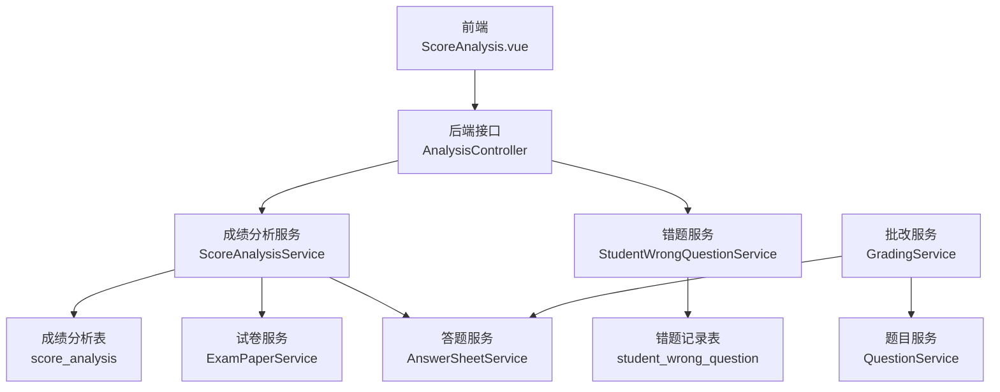
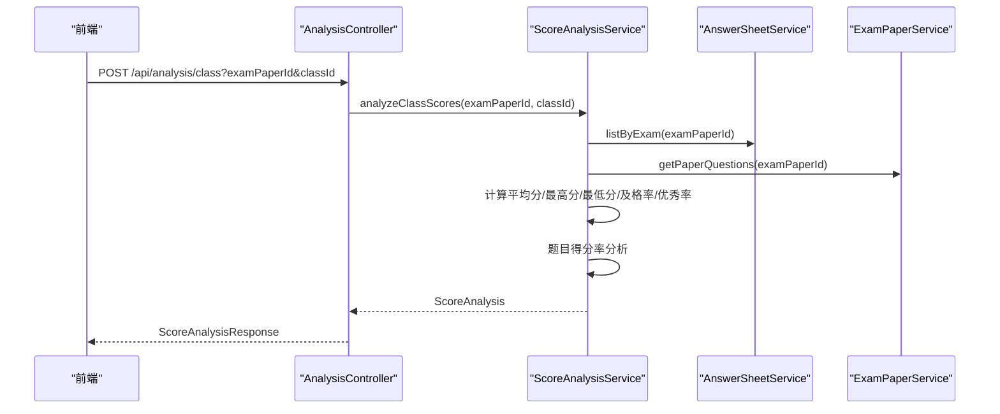
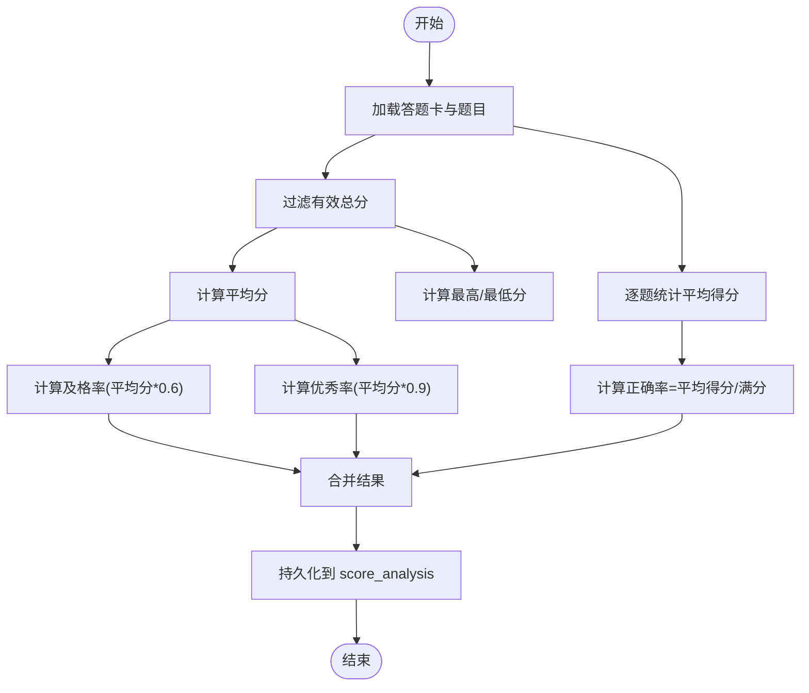
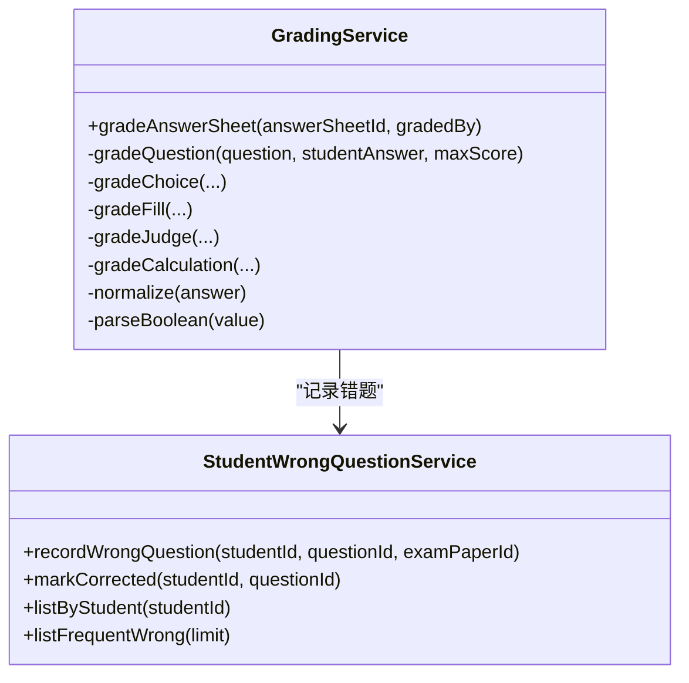
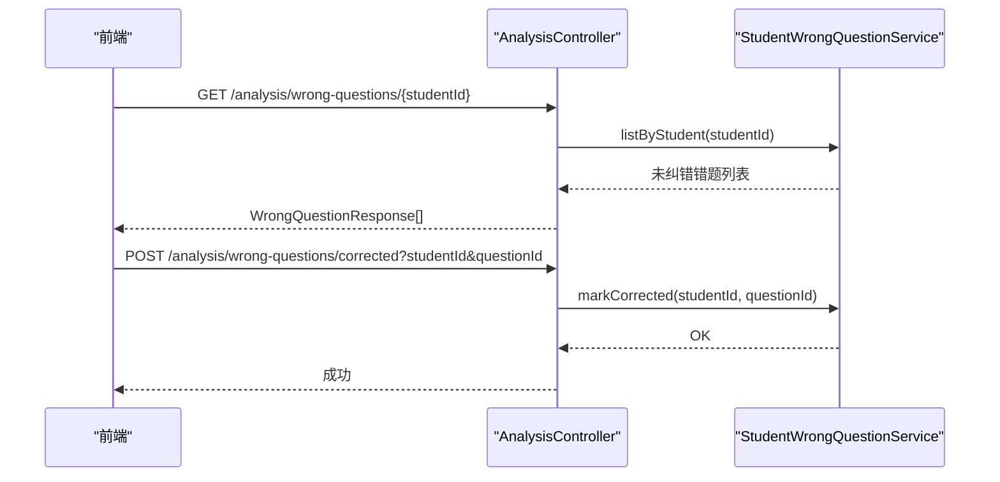
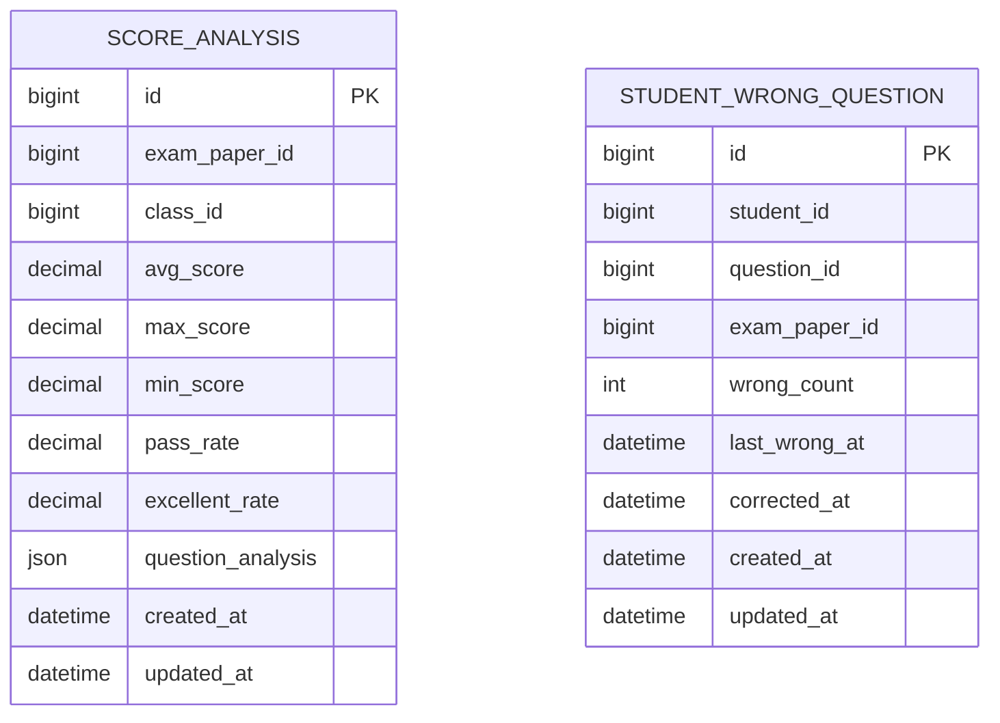
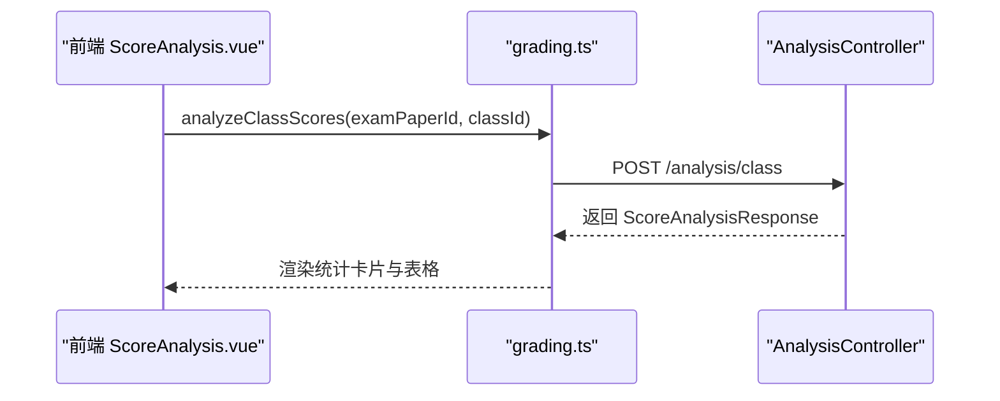
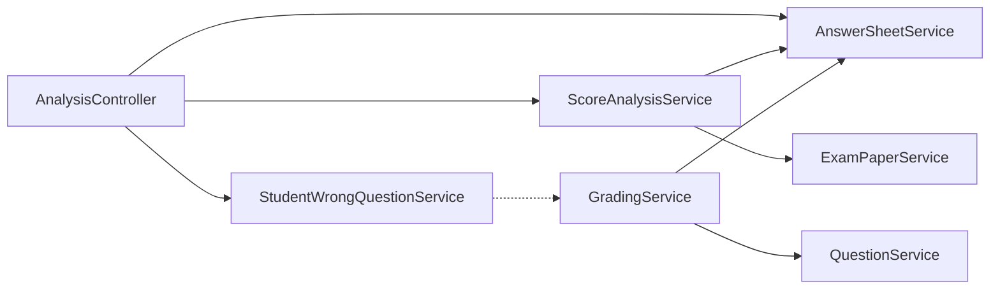

# 成绩分析系统

<cite>
**本文引用的文件**
- [ScoreAnalysisService.java](file://backend/src/main/java/com/edu/grading/service/ScoreAnalysisService.java)
- [ScoreAnalysisResponse.java](file://backend/src/main/java/com/edu/grading/dto/ScoreAnalysisResponse.java)
- [ScoreAnalysis.java](file://backend/src/main/java/com/edu/grading/entity/ScoreAnalysis.java)
- [AnalysisController.java](file://backend/src/main/java/com/edu/grading/controller/AnalysisController.java)
- [GradingService.java](file://backend/src/main/java/com/edu/grading/service/GradingService.java)
- [StudentWrongQuestionService.java](file://backend/src/main/java/com/edu/grading/service/StudentWrongQuestionService.java)
- [StudentWrongQuestion.java](file://backend/src/main/java/com/edu/grading/entity/StudentWrongQuestion.java)
- [WrongQuestionResponse.java](file://backend/src/main/java/com/edu/grading/dto/WrongQuestionResponse.java)
- [schema.sql](file://backend/src/main/resources/db/schema.sql)
- [ScoreAnalysis.vue](file://frontend/src/views/ScoreAnalysis.vue)
- [grading.ts](file://frontend/src/api/grading.ts)
- [exam.ts](file://frontend/src/api/exam.ts)
- [AnswerSheetService.java](file://backend/src/main/java/com/edu/grading/service/AnswerSheetService.java)
- [GradingServiceTest.java](file://backend/src/test/java/com/edu/grading/service/GradingServiceTest.java)
- [AnswerSheetServiceTest.java](file://backend/src/test/java/com/edu/grading/service/AnswerSheetServiceTest.java)
</cite>

## 目录
1. [引言](#引言)
2. [项目结构](#项目结构)
3. [核心组件](#核心组件)
4. [架构总览](#架构总览)
5. [详细组件分析](#详细组件分析)
6. [依赖分析](#依赖分析)
7. [性能考虑](#性能考虑)
8. [故障排查指南](#故障排查指南)
9. [结论](#结论)
10. [附录](#附录)

## 引言
本文件面向“成绩分析系统”的后端与前端实现，围绕统计分析算法、趋势分析、个性化学习报告、班级与年级对比、等级划分与预警、可视化展示以及完整指标定义进行系统化梳理。文档以代码为依据，辅以图示帮助非技术读者理解整体流程。

## 项目结构
系统采用前后端分离架构：前端使用 Vue3 + Element Plus 展示分析结果；后端基于 Spring Boot + MyBatis-Plus 提供 REST 接口与业务逻辑。数据库采用 MySQL，核心表包括答题卡、答案、成绩分析、错题记录等。

**图表来源**
- [AnalysisController.java:1-143](file://backend/src/main/java/com/edu/grading/controller/AnalysisController.java#L1-143)
- [ScoreAnalysisService.java:1-171](file://backend/src/main/java/com/edu/grading/service/ScoreAnalysisService.java#L1-171)
- [StudentWrongQuestionService.java:1-102](file://backend/src/main/java/com/edu/grading/service/StudentWrongQuestionService.java#L1-102)
- [schema.sql:269-297](file://backend/src/main/resources/db/schema.sql#L269-L297)

**章节来源**
- [ScoreAnalysis.vue:1-121](file://frontend/src/views/ScoreAnalysis.vue#L1-121)
- [grading.ts:1-63](file://frontend/src/api/grading.ts#L1-63)
- [schema.sql:1-379](file://backend/src/main/resources/db/schema.sql#L1-L379)

## 核心组件
- 成绩分析服务：负责按班级统计平均分、最高/最低分、及格率、优秀率，以及题目得分率分析。
- 批改服务：基于规则引擎对不同题型进行判分，记录错题。
- 错题服务：维护学生错题次数、最近错误时间、纠错标记与高频错题统计。
- 控制器：对外暴露分析接口，封装 DTO 响应与前端展示字段映射。
- 前端视图：提供试卷与班级筛选、分析触发、统计卡片与表格展示。

**章节来源**
- [ScoreAnalysisService.java:1-171](file://backend/src/main/java/com/edu/grading/service/ScoreAnalysisService.java#L1-171)
- [GradingService.java:1-232](file://backend/src/main/java/com/edu/grading/service/GradingService.java#L1-232)
- [StudentWrongQuestionService.java:1-102](file://backend/src/main/java/com/edu/grading/service/StudentWrongQuestionService.java#L1-102)
- [AnalysisController.java:1-143](file://backend/src/main/java/com/edu/grading/controller/AnalysisController.java#L1-143)

## 架构总览
后端通过控制器接收请求，调用服务层执行业务逻辑，服务层访问数据库持久化结果。前端通过 API 请求触发分析或获取结果，渲染统计卡片与表格。

**图表来源**
- [AnalysisController.java:35-44](file://backend/src/main/java/com/edu/grading/controller/AnalysisController.java#L35-L44)
- [ScoreAnalysisService.java:40-97](file://backend/src/main/java/com/edu/grading/service/ScoreAnalysisService.java#L40-L97)
- [AnswerSheetService.java:102-109](file://backend/src/main/java/com/edu/grading/service/AnswerSheetService.java#L102-L109)

## 详细组件分析

### 成绩分析服务（统计分析算法）
- 输入：考试试卷 ID、班级 ID
- 输出：平均分、最高分、最低分、及格率、优秀率、题目得分率分析
- 关键算法：
  - 平均分：所有有效总分求和后除以人数，保留两位小数
  - 最高/最低分：取集合极值
  - 及格率：以“平均分×0.6”为及格线，统计达标人数占比
  - 优秀率：以“平均分×0.9”为优秀线，统计达标人数占比
  - 题目得分率：按题统计平均得分，再除以该题满分得到正确率

**图表来源**
- [ScoreAnalysisService.java:106-170](file://backend/src/main/java/com/edu/grading/service/ScoreAnalysisService.java#L106-L170)

**章节来源**
- [ScoreAnalysisService.java:37-97](file://backend/src/main/java/com/edu/grading/service/ScoreAnalysisService.java#L37-L97)
- [ScoreAnalysisResponse.java:11-43](file://backend/src/main/java/com/edu/grading/dto/ScoreAnalysisResponse.java#L11-L43)
- [ScoreAnalysis.java:14-36](file://backend/src/main/java/com/edu/grading/entity/ScoreAnalysis.java#L14-L36)

### 批改服务（规则引擎与错题记录）
- 题型支持：选择题、填空题、判断题、计算题
- 判分策略：
  - 选择题：标准化后精确匹配
  - 填空题：支持多答案（|分隔）、去除多余空格后的模糊匹配
  - 判断题：统一转布尔值后比较
  - 计算题：数值比较，允许 0.01 的误差
- 错题记录：若判分为 0，则记录学生错题，包含错误次数、最近错误时间、来源试卷；纠错时标记 correctedAt

**图表来源**
- [GradingService.java:34-80](file://backend/src/main/java/com/edu/grading/service/GradingService.java#L34-L80)
- [StudentWrongQuestionService.java:26-51](file://backend/src/main/java/com/edu/grading/service/StudentWrongQuestionService.java#L26-L51)

**章节来源**
- [GradingService.java:85-206](file://backend/src/main/java/com/edu/grading/service/GradingService.java#L85-L206)
- [StudentWrongQuestionService.java:26-101](file://backend/src/main/java/com/edu/grading/service/StudentWrongQuestionService.java#L26-L101)

### 错题管理（高频错题与个性化报告）
- 未纠错错题：按最近错误时间倒序列出
- 高频错题：错误次数≥3 的错题，按错误次数倒序，支持限制数量
- 纠错标记：将 correctedAt 置为当前时间，表示已纠正

**图表来源**
- [AnalysisController.java:63-81](file://backend/src/main/java/com/edu/grading/controller/AnalysisController.java#L63-L81)
- [StudentWrongQuestionService.java:73-68](file://backend/src/main/java/com/edu/grading/service/StudentWrongQuestionService.java#L73-L68)

**章节来源**
- [StudentWrongQuestionService.java:73-101](file://backend/src/main/java/com/edu/grading/service/StudentWrongQuestionService.java#L73-L101)
- [WrongQuestionResponse.java:11-31](file://backend/src/main/java/com/edu/grading/dto/WrongQuestionResponse.java#L11-L31)

### 数据模型与持久化
- 成绩分析表 score_analysis：存储每张试卷在每个班级的统计结果与题目分析 JSON
- 学生错题记录表 student_wrong_question：记录错题次数、最近错误时间、纠错时间与来源试卷

**图表来源**
- [schema.sql:269-297](file://backend/src/main/resources/db/schema.sql#L269-L297)

**章节来源**
- [schema.sql:269-297](file://backend/src/main/resources/db/schema.sql#L269-L297)
- [ScoreAnalysis.java:14-36](file://backend/src/main/java/com/edu/grading/entity/ScoreAnalysis.java#L14-L36)
- [StudentWrongQuestion.java:13-31](file://backend/src/main/java/com/edu/grading/entity/StudentWrongQuestion.java#L13-L31)

### 可视化与前端展示
- 前端页面提供试卷与班级筛选、触发分析、展示平均分、最高/最低分、参考人数、及格率、优秀率、已批改人数与题目得分分析表格
- 前端通过 grading.ts 中的 API 与后端交互

**图表来源**
- [ScoreAnalysis.vue:89-106](file://frontend/src/views/ScoreAnalysis.vue#L89-L106)
- [grading.ts:38-46](file://frontend/src/api/grading.ts#L38-L46)

**章节来源**
- [ScoreAnalysis.vue:1-121](file://frontend/src/views/ScoreAnalysis.vue#L1-L121)
- [grading.ts:1-63](file://frontend/src/api/grading.ts#L1-L63)

## 依赖分析
- 控制器依赖服务层；服务层依赖 Mapper 与实体；控制器与服务层不直接依赖数据库，通过 MyBatis-Plus 抽象
- 批改服务依赖答题卡、题目与错题服务；错题服务独立于批改服务但被其调用
- 前端通过 API 文件与后端解耦

**图表来源**
- [AnalysisController.java:28-30](file://backend/src/main/java/com/edu/grading/controller/AnalysisController.java#L28-L30)
- [ScoreAnalysisService.java:33-35](file://backend/src/main/java/com/edu/grading/service/ScoreAnalysisService.java#L33-L35)
- [GradingService.java:25-29](file://backend/src/main/java/com/edu/grading/service/GradingService.java#L25-L29)

**章节来源**
- [AnalysisController.java:1-143](file://backend/src/main/java/com/edu/grading/controller/AnalysisController.java#L1-L143)
- [ScoreAnalysisService.java:1-171](file://backend/src/main/java/com/edu/grading/service/ScoreAnalysisService.java#L1-L171)
- [GradingService.java:1-232](file://backend/src/main/java/com/edu/grading/service/GradingService.java#L1-L232)

## 性能考虑
- 统计聚合：平均分、极值、比率计算均为 O(n) 流式处理，适合大样本
- 题目分析：逐题遍历答题记录，复杂度 O(n×m)，其中 n 为答题卡数，m 为题目数；建议在高并发场景下对答题卡与题目建立索引
- JSON 字段：题目分析以 JSON 存储，便于扩展但不利于复杂查询；如需频繁检索可考虑拆分表或增加二级索引
- 批改策略：字符串标准化与数值解析在计算题中可能带来额外开销，建议缓存常见标准化规则

[本节为通用指导，无需特定文件引用]

## 故障排查指南
- 答题卡状态异常：创建/提交/批改状态检查，确保状态流转正确
- 缺失租户上下文：创建答题卡时需设置租户 ID，否则抛出业务异常
- 未找到答题卡或试卷：批改前先确认实体存在性
- 错题未纠错：检查 correctedAt 是否为空；高频错题需错误次数≥3 且未纠错

**章节来源**
- [AnswerSheetServiceTest.java:47-147](file://backend/src/test/java/com/edu/grading/service/AnswerSheetServiceTest.java#L47-L147)
- [GradingServiceTest.java:86-216](file://backend/src/test/java/com/edu/grading/service/GradingServiceTest.java#L86-L216)
- [StudentWrongQuestionService.java:56-68](file://backend/src/main/java/com/edu/grading/service/StudentWrongQuestionService.java#L56-L68)

## 结论
本系统实现了从答题卡到成绩分析、错题管理与可视化的完整闭环。统计分析算法简洁可靠，规则引擎覆盖主流题型，错题机制支撑个性化学习报告。建议后续增强趋势分析与多维度对比能力，并优化大数据量下的查询性能。

[本节为总结性内容，无需特定文件引用]

## 附录

### 分析指标定义与计算公式
- 平均分：所有有效总分之和 ÷ 有效总分个数（保留两位小数）
- 最高分：有效总分集合的最大值
- 最低分：有效总分集合的最小值
- 及格率：达到“平均分×0.6”及以上的人数 ÷ 总人数（保留四位小数）
- 优秀率：达到“平均分×0.9”及以上的人数 ÷ 总人数（保留四位小数）
- 题目平均得分：该题所有得分之和 ÷ 该题作答人数
- 题目正确率：题目平均得分 ÷ 该题满分（保留四位小数）

**章节来源**
- [ScoreAnalysisService.java:106-141](file://backend/src/main/java/com/edu/grading/service/ScoreAnalysisService.java#L106-L141)
- [ScoreAnalysisService.java:143-170](file://backend/src/main/java/com/edu/grading/service/ScoreAnalysisService.java#L143-L170)

### 等级划分与预警机制
- 等级划分：以“平均分×0.6”为及格线，“平均分×0.9”为优秀线
- 预警机制：可基于以下信号触发：
  - 班级平均分显著下降
  - 题目正确率普遍低于阈值
  - 学生错题次数持续上升
  - 高频错题占比过高
- 实现建议：在现有统计基础上增加时间序列对比与阈值告警，前端可展示预警徽章或颜色提示

[本节为概念性建议，无需特定文件引用]