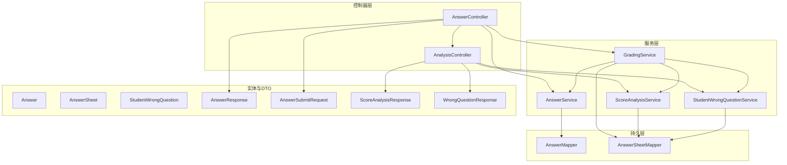
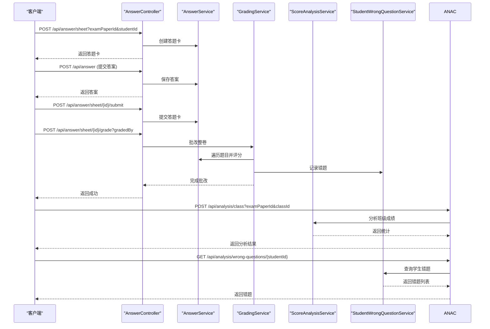
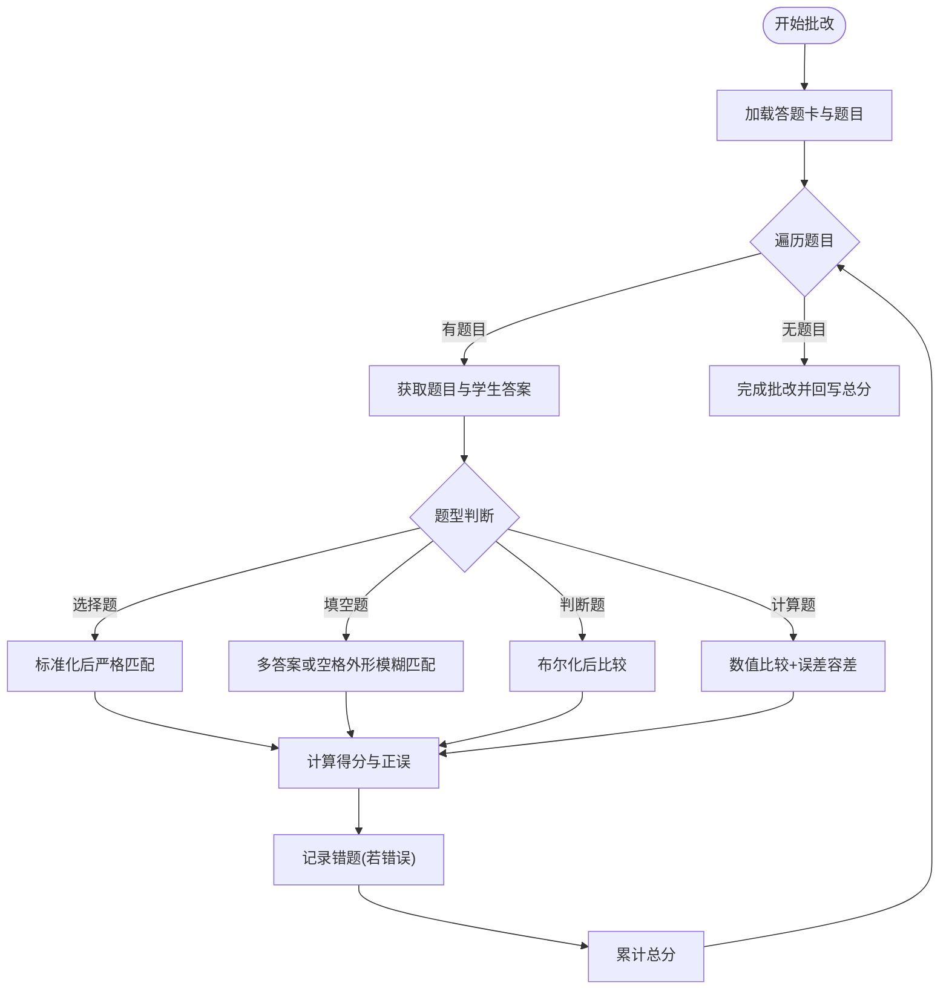
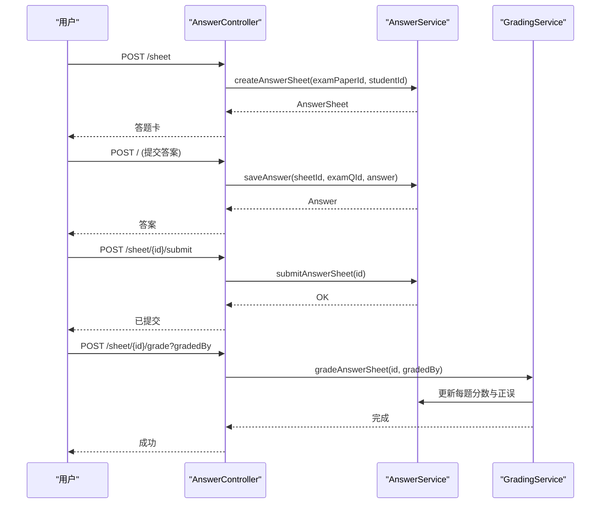
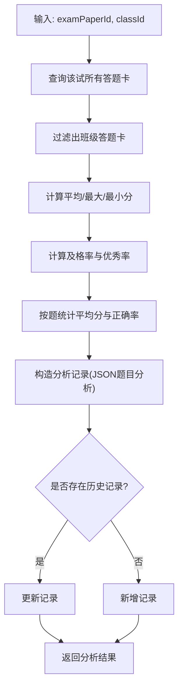
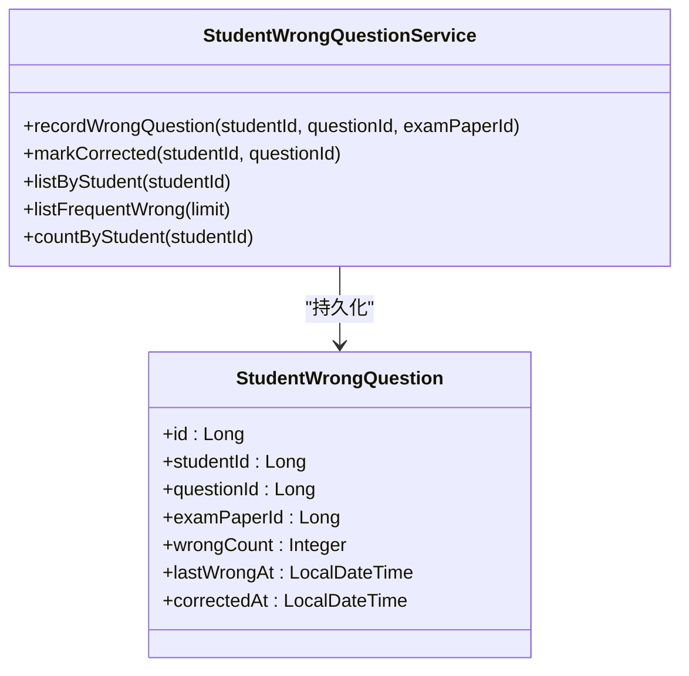
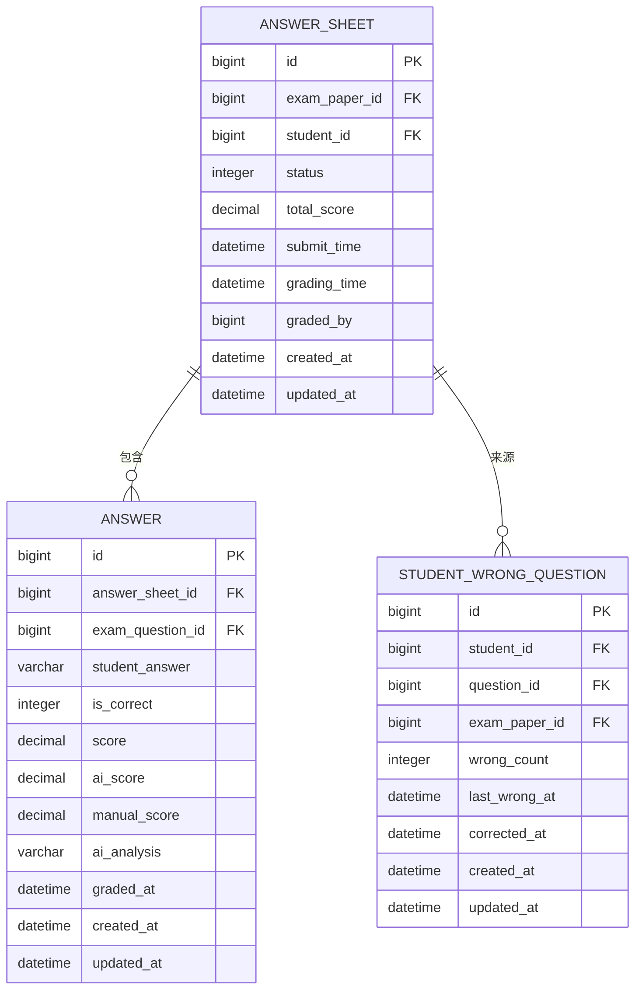
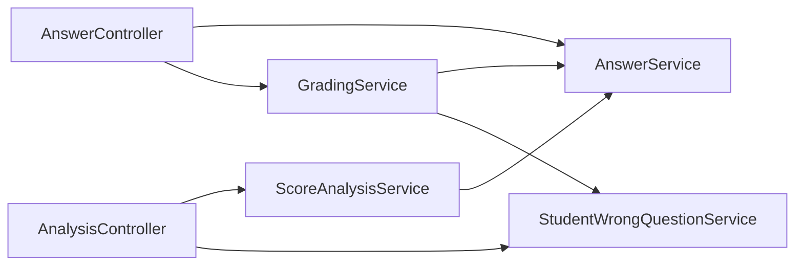

# 批改分析

<cite>
**本文引用的文件**
- [AnswerController.java](file://backend/src/main/java/com/edu/grading/controller/AnswerController.java)
- [AnalysisController.java](file://backend/src/main/java/com/edu/grading/controller/AnalysisController.java)
- [GradingService.java](file://backend/src/main/java/com/edu/grading/service/GradingService.java)
- [AnswerService.java](file://backend/src/main/java/com/edu/grading/service/AnswerService.java)
- [ScoreAnalysisService.java](file://backend/src/main/java/com/edu/grading/service/ScoreAnalysisService.java)
- [StudentWrongQuestionService.java](file://backend/src/main/java/com/edu/grading/service/StudentWrongQuestionService.java)
- [Answer.java](file://backend/src/main/java/com/edu/grading/entity/Answer.java)
- [AnswerSheet.java](file://backend/src/main/java/com/edu/grading/entity/AnswerSheet.java)
- [StudentWrongQuestion.java](file://backend/src/main/java/com/edu/grading/entity/StudentWrongQuestion.java)
- [AnswerSubmitRequest.java](file://backend/src/main/java/com/edu/grading/dto/AnswerSubmitRequest.java)
- [AnswerResponse.java](file://backend/src/main/java/com/edu/grading/dto/AnswerResponse.java)
- [ScoreAnalysisResponse.java](file://backend/src/main/java/com/edu/grading/dto/ScoreAnalysisResponse.java)
- [WrongQuestionResponse.java](file://backend/src/main/java/com/edu/grading/dto/WrongQuestionResponse.java)
- [AnswerMapper.java](file://backend/src/main/java/com/edu/grading/mapper/AnswerMapper.java)
- [AnswerSheetMapper.java](file://backend/src/main/java/com/edu/grading/mapper/AnswerSheetMapper.java)
</cite>

## 目录
1. [引言](#引言)
2. [项目结构](#项目结构)
3. [核心组件](#核心组件)
4. [架构总览](#架构总览)
5. [详细组件分析](#详细组件分析)
6. [依赖分析](#依赖分析)
7. [性能考虑](#性能考虑)
8. [故障排查指南](#故障排查指南)
9. [结论](#结论)
10. [附录：数据模型与API](#附录数据模型与api)

## 引言
本文件系统性阐述“批改分析模块”的实现与使用，覆盖自动批改引擎、评分规则、质量评估、成绩分析、错题分析、答案提交与处理流程、数据模型与API定义，并给出性能优化与准确性保障建议。目标是帮助开发者与产品人员快速理解并高效扩展该模块。

## 项目结构
批改分析模块位于后端工程的 grading 包下，采用按职责分层组织：
- 控制器层：AnswerController、AnalysisController
- 服务层：GradingService、AnswerService、ScoreAnalysisService、StudentWrongQuestionService
- 实体与DTO：Answer、AnswerSheet、StudentWrongQuestion、各类请求/响应DTO
- Mapper：AnswerMapper、AnswerSheetMapper

图表来源
- [AnswerController.java:1-140](file://backend/src/main/java/com/edu/grading/controller/AnswerController.java#L1-L140)
- [AnalysisController.java:1-143](file://backend/src/main/java/com/edu/grading/controller/AnalysisController.java#L1-L143)
- [GradingService.java:1-232](file://backend/src/main/java/com/edu/grading/service/GradingService.java#L1-L232)
- [AnswerService.java:1-105](file://backend/src/main/java/com/edu/grading/service/AnswerService.java#L1-L105)
- [ScoreAnalysisService.java:1-171](file://backend/src/main/java/com/edu/grading/service/ScoreAnalysisService.java#L1-L171)
- [StudentWrongQuestionService.java:1-102](file://backend/src/main/java/com/edu/grading/service/StudentWrongQuestionService.java#L1-L102)
- [Answer.java:1-39](file://backend/src/main/java/com/edu/grading/entity/Answer.java#L1-L39)
- [AnswerSheet.java:1-34](file://backend/src/main/java/com/edu/grading/entity/AnswerSheet.java#L1-L34)
- [StudentWrongQuestion.java:1-32](file://backend/src/main/java/com/edu/grading/entity/StudentWrongQuestion.java#L1-L32)
- [AnswerResponse.java:1-37](file://backend/src/main/java/com/edu/grading/dto/AnswerResponse.java#L1-L37)
- [AnswerSubmitRequest.java:1-19](file://backend/src/main/java/com/edu/grading/dto/AnswerSubmitRequest.java#L1-L19)
- [ScoreAnalysisResponse.java:1-44](file://backend/src/main/java/com/edu/grading/dto/ScoreAnalysisResponse.java#L1-L44)
- [WrongQuestionResponse.java:1-32](file://backend/src/main/java/com/edu/grading/dto/WrongQuestionResponse.java#L1-L32)
- [AnswerMapper.java:1-12](file://backend/src/main/java/com/edu/grading/mapper/AnswerMapper.java#L1-L12)
- [AnswerSheetMapper.java:1-12](file://backend/src/main/java/com/edu/grading/mapper/AnswerSheetMapper.java#L1-L12)

章节来源
- [AnswerController.java:1-140](file://backend/src/main/java/com/edu/grading/controller/AnswerController.java#L1-L140)
- [AnalysisController.java:1-143](file://backend/src/main/java/com/edu/grading/controller/AnalysisController.java#L1-L143)

## 核心组件
- 自动批改引擎：基于题型的规则引擎，支持选择题、填空题、判断题、计算题，内置标准化与容差逻辑。
- 答案提交与处理：答题卡创建、答案提交、整卷提交、整卷批改、状态流转与分数回写。
- 成绩分析：班级均分、最高/最低分、及格率、优秀率、题目得分率统计与持久化。
- 错题分析：错题记录、纠错标记、高频错题聚合、按学生维度查询。
- 数据模型与API：清晰的实体与DTO映射，REST接口定义明确。

章节来源
- [GradingService.java:1-232](file://backend/src/main/java/com/edu/grading/service/GradingService.java#L1-L232)
- [AnswerService.java:1-105](file://backend/src/main/java/com/edu/grading/service/AnswerService.java#L1-L105)
- [ScoreAnalysisService.java:1-171](file://backend/src/main/java/com/edu/grading/service/ScoreAnalysisService.java#L1-L171)
- [StudentWrongQuestionService.java:1-102](file://backend/src/main/java/com/edu/grading/service/StudentWrongQuestionService.java#L1-L102)

## 架构总览
批改分析模块遵循“控制器-服务-持久层”分层，控制器负责HTTP入口与DTO装配，服务层编排业务流程与规则，持久层通过MyBatis-Plus访问数据库。

图表来源
- [AnswerController.java:1-140](file://backend/src/main/java/com/edu/grading/controller/AnswerController.java#L1-L140)
- [AnalysisController.java:1-143](file://backend/src/main/java/com/edu/grading/controller/AnalysisController.java#L1-L143)
- [GradingService.java:1-232](file://backend/src/main/java/com/edu/grading/service/GradingService.java#L1-L232)
- [ScoreAnalysisService.java:1-171](file://backend/src/main/java/com/edu/grading/service/ScoreAnalysisService.java#L1-L171)
- [StudentWrongQuestionService.java:1-102](file://backend/src/main/java/com/edu/grading/service/StudentWrongQuestionService.java#L1-L102)

## 详细组件分析

### 自动批改引擎与评分规则
- 规则引擎入口：遍历试卷题目，逐题调用规则函数，汇总总分并记录错题。
- 题型规则：
  - 选择题：严格等价匹配（含大小写与空白标准化）。
  - 填空题：支持多标准答案（“|”分隔），允许空格差异的模糊匹配。
  - 判断题：统一布尔化后再比较。
  - 计算题：数值比较，允许小误差阈值；解析失败时回退到填空规则。
- 标准化与容差：
  - 统一转大写、去首尾空白、合并多余空白。
  - 计算题数值比较使用小范围误差。
- 错题记录：当某题判为错误时，写入错题表并累加错误次数。

图表来源
- [GradingService.java:34-80](file://backend/src/main/java/com/edu/grading/service/GradingService.java#L34-L80)
- [GradingService.java:85-206](file://backend/src/main/java/com/edu/grading/service/GradingService.java#L85-L206)

章节来源
- [GradingService.java:1-232](file://backend/src/main/java/com/edu/grading/service/GradingService.java#L1-L232)

### 答案提交与处理流程
- 创建答题卡：根据试卷与学生ID生成答题卡，初始状态为未提交。
- 提交答案：保存或更新单题答案，支持重复提交覆盖。
- 提交答题卡：将答题卡状态置为已提交。
- 批改整卷：启动批改流程，逐题评分，记录错题，回写总分与批改人。
- 状态管理：答题卡状态机包含未提交、已提交、批改中、已批改。

图表来源
- [AnswerController.java:34-73](file://backend/src/main/java/com/edu/grading/controller/AnswerController.java#L34-L73)
- [AnswerService.java:29-52](file://backend/src/main/java/com/edu/grading/service/AnswerService.java#L29-L52)
- [GradingService.java:34-80](file://backend/src/main/java/com/edu/grading/service/GradingService.java#L34-L80)

章节来源
- [AnswerController.java:1-140](file://backend/src/main/java/com/edu/grading/controller/AnswerController.java#L1-L140)
- [AnswerService.java:1-105](file://backend/src/main/java/com/edu/grading/service/AnswerService.java#L1-L105)

### 成绩分析系统
- 统计指标：班级平均分、最高/最低分、及格率（以平均分60%为线）、优秀率（以平均分90%为线）。
- 题目分析：按题统计平均得分与正确率，序列化为JSON存储于分析记录。
- 结果持久化：同一试卷+班级唯一键，存在则更新，否则插入。
- 辅助统计：返回应考人数与已阅人数。

图表来源
- [ScoreAnalysisService.java:40-97](file://backend/src/main/java/com/edu/grading/service/ScoreAnalysisService.java#L40-L97)
- [ScoreAnalysisService.java:143-170](file://backend/src/main/java/com/edu/grading/service/ScoreAnalysisService.java#L143-L170)

章节来源
- [ScoreAnalysisService.java:1-171](file://backend/src/main/java/com/edu/grading/service/ScoreAnalysisService.java#L1-L171)
- [AnalysisController.java:35-58](file://backend/src/main/java/com/edu/grading/controller/AnalysisController.java#L35-L58)

### 错题分析与个性化建议
- 错题记录：按学生+题目聚合，记录错误次数与最近错误时间，未纠错记录可筛选。
- 高频错题：筛选错误次数≥3且未纠错的题目，支持限制数量。
- 纠错标记：支持将某学生某题标记为已纠错，后续不再计入未纠错集合。
- 个性化建议：当前实现提供错题与高频错题查询，具体“学习路径建议”可基于错题内容在上层业务扩展。

图表来源
- [StudentWrongQuestion.java:1-32](file://backend/src/main/java/com/edu/grading/entity/StudentWrongQuestion.java#L1-L32)
- [StudentWrongQuestionService.java:26-51](file://backend/src/main/java/com/edu/grading/service/StudentWrongQuestionService.java#L26-L51)

章节来源
- [StudentWrongQuestionService.java:1-102](file://backend/src/main/java/com/edu/grading/service/StudentWrongQuestionService.java#L1-L102)
- [AnalysisController.java:63-94](file://backend/src/main/java/com/edu/grading/controller/AnalysisController.java#L63-L94)

### 数据模型设计

图表来源
- [Answer.java:14-39](file://backend/src/main/java/com/edu/grading/entity/Answer.java#L14-L39)
- [AnswerSheet.java:17-34](file://backend/src/main/java/com/edu/grading/entity/AnswerSheet.java#L17-L34)
- [StudentWrongQuestion.java:13-32](file://backend/src/main/java/com/edu/grading/entity/StudentWrongQuestion.java#L13-L32)

章节来源
- [Answer.java:1-39](file://backend/src/main/java/com/edu/grading/entity/Answer.java#L1-L39)
- [AnswerSheet.java:1-34](file://backend/src/main/java/com/edu/grading/entity/AnswerSheet.java#L1-L34)
- [StudentWrongQuestion.java:1-32](file://backend/src/main/java/com/edu/grading/entity/StudentWrongQuestion.java#L1-L32)

## 依赖分析
- 控制器依赖服务：AnswerController依赖AnswerService与GradingService；AnalysisController依赖ScoreAnalysisService与StudentWrongQuestionService。
- 服务间耦合：GradingService依赖AnswerService、AnswerSheetService、QuestionService、StudentWrongQuestionService；ScoreAnalysisService依赖AnswerSheetService、AnswerService、ExamPaperService。
- 持久层：AnswerMapper、AnswerSheetMapper分别操作对应实体。

图表来源
- [AnswerController.java:27-29](file://backend/src/main/java/com/edu/grading/controller/AnswerController.java#L27-L29)
- [AnalysisController.java:28-30](file://backend/src/main/java/com/edu/grading/controller/AnalysisController.java#L28-L30)
- [GradingService.java:25-29](file://backend/src/main/java/com/edu/grading/service/GradingService.java#L25-L29)
- [ScoreAnalysisService.java:33-35](file://backend/src/main/java/com/edu/grading/service/ScoreAnalysisService.java#L33-L35)

章节来源
- [AnswerController.java:1-140](file://backend/src/main/java/com/edu/grading/controller/AnswerController.java#L1-L140)
- [AnalysisController.java:1-143](file://backend/src/main/java/com/edu/grading/controller/AnalysisController.java#L1-L143)
- [GradingService.java:1-232](file://backend/src/main/java/com/edu/grading/service/GradingService.java#L1-L232)
- [ScoreAnalysisService.java:1-171](file://backend/src/main/java/com/edu/grading/service/ScoreAnalysisService.java#L1-L171)

## 性能考虑
- 批改流程批量化：整卷批改时按题目循环更新分数，建议在数据库层面批量更新以减少往返。
- 字符串标准化：统一预处理可避免重复计算，建议缓存常见标准化结果。
- 数值比较：计算题使用固定误差阈值，避免频繁异常分支。
- 查询优化：按答题卡ID与题目ID建立索引，提高答案查询效率。
- 并发控制：批改过程使用事务，确保一致性；高并发场景建议引入队列异步批改。

## 故障排查指南
- 答题卡不存在：批改入口会抛出异常提示，检查传入ID与关联关系。
- 答案为空：未作答题目直接计0分，确认前端是否正确提交。
- 题目缺失：找不到题目时跳过该题，检查试卷与题库关联。
- 人工评分优先：设置人工评分后会覆盖AI评分并回写最终分数。
- 错题未统计：确认是否为错误题且未被标记为已纠错。

章节来源
- [GradingService.java:36-59](file://backend/src/main/java/com/edu/grading/service/GradingService.java#L36-L59)
- [AnswerService.java:67-104](file://backend/src/main/java/com/edu/grading/service/AnswerService.java#L67-L104)
- [StudentWrongQuestionService.java:56-68](file://backend/src/main/java/com/edu/grading/service/StudentWrongQuestionService.java#L56-L68)

## 结论
该模块以规则引擎为核心，结合标准化与容差策略，实现了稳定高效的自动批改；通过答题卡状态机与批改流程，确保了答案提交与处理的完整性；成绩分析与错题分析提供了教学反馈与个性化学习的基础。建议在高并发场景引入异步批改与缓存策略，持续提升性能与用户体验。

## 附录：数据模型与API

### 数据模型
- 答题详情（Answer）
  - 关键字段：答题卡ID、试卷题目ID、学生答案、正误、分数、AI评分/AI分析、人工评分、批改时间
- 答题卡（AnswerSheet）
  - 关键字段：试卷ID、学生ID、状态、总分、提交/批改时间、批改人
- 错题记录（StudentWrongQuestion）
  - 关键字段：学生ID、题目ID、来源试卷、错误次数、最近错误时间、纠错时间

章节来源
- [Answer.java:14-39](file://backend/src/main/java/com/edu/grading/entity/Answer.java#L14-L39)
- [AnswerSheet.java:17-34](file://backend/src/main/java/com/edu/grading/entity/AnswerSheet.java#L17-L34)
- [StudentWrongQuestion.java:13-32](file://backend/src/main/java/com/edu/grading/entity/StudentWrongQuestion.java#L13-L32)

### API 接口定义
- 答题相关
  - POST /api/answer/sheet → 创建答题卡（参数：examPaperId, studentId）
  - POST /api/answer → 提交答案（请求体：AnswerSubmitRequest）
  - POST /api/answer/sheet/{id}/submit → 提交答题卡
  - POST /api/answer/sheet/{id}/grade?gradedBy → 批改整卷
  - GET /api/answer/sheet/{id} → 获取答题卡详情
  - GET /api/answer/sheet/list/{examPaperId} → 获取某试卷全部答题卡
  - GET /api/answer/list/{answerSheetId} → 获取某答题卡答案列表
- 成绩分析相关
  - POST /api/analysis/class?examPaperId&classId → 分析班级成绩
  - GET /api/analysis/class?examPaperId&classId → 获取班级分析
  - GET /api/analysis/wrong-questions/{studentId} → 获取学生错题列表
  - POST /api/analysis/wrong-questions/corrected → 标记错题已纠错
  - GET /api/analysis/wrong-questions/frequent?limit → 获取高频错题

章节来源
- [AnswerController.java:34-109](file://backend/src/main/java/com/edu/grading/controller/AnswerController.java#L34-L109)
- [AnalysisController.java:35-94](file://backend/src/main/java/com/edu/grading/controller/AnalysisController.java#L35-L94)

### DTO 结构
- 答题提交请求（AnswerSubmitRequest）
  - 字段：answerSheetId、examQuestionId、studentAnswer
- 答题响应（AnswerResponse）
  - 字段：id、answerSheetId、examQuestionId、studentAnswer、isCorrect、score、aiScore、manualScore、aiAnalysis、gradedAt、sequence、questionContent
- 成绩分析响应（ScoreAnalysisResponse）
  - 字段：id、examPaperId、classId、avgScore、maxScore、minScore、passRate、excellentRate、questionAnalysis（含题目级统计）、studentCount、gradedCount
- 错题响应（WrongQuestionResponse）
  - 字段：id、studentId、questionId、examPaperId、wrongCount、lastWrongAt、correctedAt、questionContent、subject、questionType

章节来源
- [AnswerSubmitRequest.java:10-19](file://backend/src/main/java/com/edu/grading/dto/AnswerSubmitRequest.java#L10-L19)
- [AnswerResponse.java:12-37](file://backend/src/main/java/com/edu/grading/dto/AnswerResponse.java#L12-L37)
- [ScoreAnalysisResponse.java:12-44](file://backend/src/main/java/com/edu/grading/dto/ScoreAnalysisResponse.java#L12-L44)
- [WrongQuestionResponse.java:11-32](file://backend/src/main/java/com/edu/grading/dto/WrongQuestionResponse.java#L11-L32)