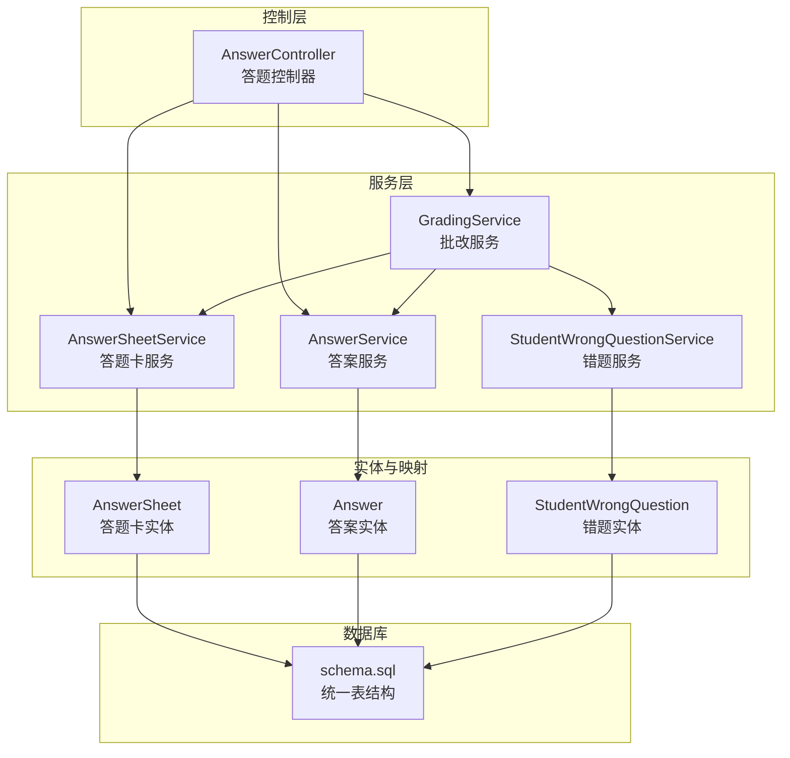
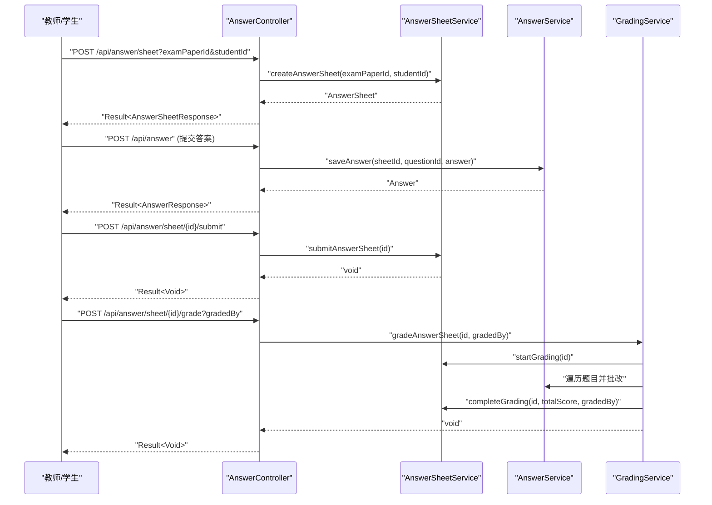
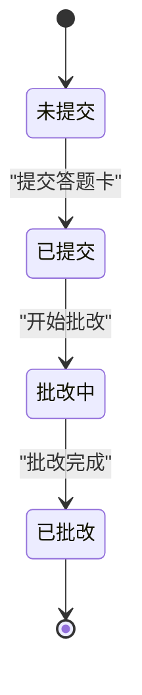
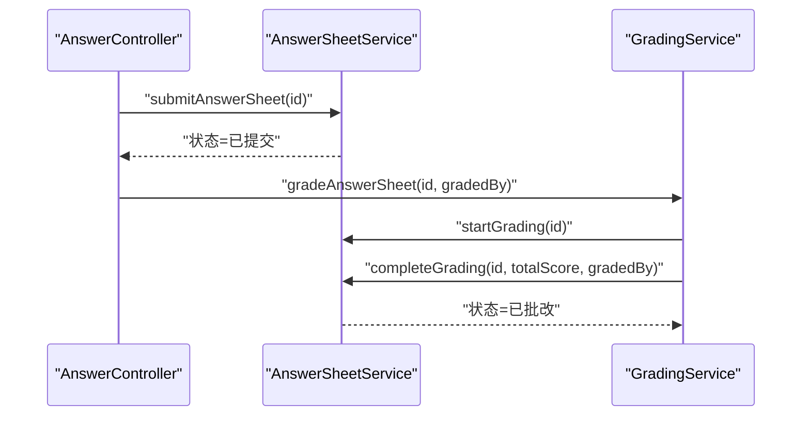
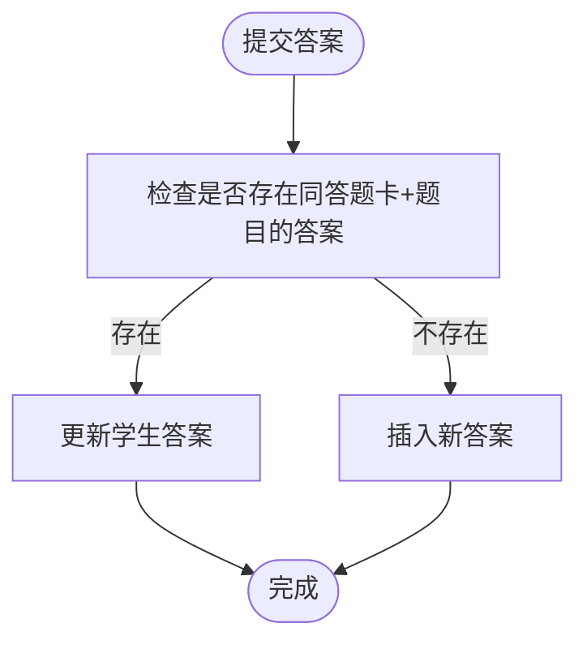
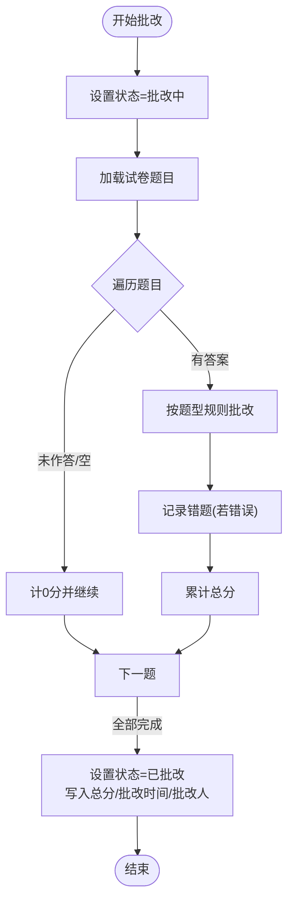
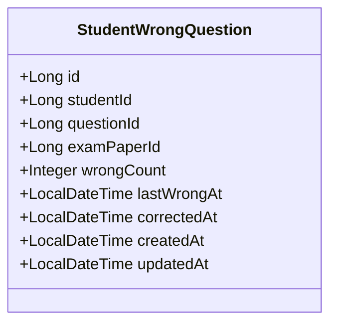
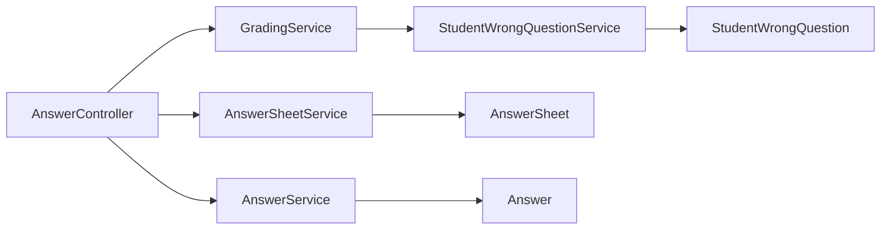

# 答题卡管理

<cite>
**本文引用的文件**
- [AnswerController.java](file://backend/src/main/java/com/edu/grading/controller/AnswerController.java)
- [AnswerService.java](file://backend/src/main/java/com/edu/grading/service/AnswerService.java)
- [AnswerSheetService.java](file://backend/src/main/java/com/edu/grading/service/AnswerSheetService.java)
- [GradingService.java](file://backend/src/main/java/com/edu/grading/service/GradingService.java)
- [AnswerSheet.java](file://backend/src/main/java/com/edu/grading/entity/AnswerSheet.java)
- [Answer.java](file://backend/src/main/java/com/edu/grading/entity/Answer.java)
- [AnswerSubmitRequest.java](file://backend/src/main/java/com/edu/grading/dto/AnswerSubmitRequest.java)
- [AnswerSheetResponse.java](file://backend/src/main/java/com/edu/grading/dto/AnswerSheetResponse.java)
- [AnswerResponse.java](file://backend/src/main/java/com/edu/grading/dto/AnswerResponse.java)
- [StudentWrongQuestionService.java](file://backend/src/main/java/com/edu/grading/service/StudentWrongQuestionService.java)
- [StudentWrongQuestion.java](file://backend/src/main/java/com/edu/grading/entity/StudentWrongQuestion.java)
- [BaseEntity.java](file://backend/src/main/java/com/edu/common/entity/BaseEntity.java)
- [schema.sql](file://backend/src/main/resources/db/schema.sql)
</cite>

## 目录
1. [简介](#简介)
2. [项目结构](#项目结构)
3. [核心组件](#核心组件)
4. [架构总览](#架构总览)
5. [详细组件分析](#详细组件分析)
6. [依赖分析](#依赖分析)
7. [性能考虑](#性能考虑)
8. [故障排查指南](#故障排查指南)
9. [结论](#结论)
10. [附录：API 接口文档](#附录api-接口文档)

## 简介
本系统围绕“答题卡管理”构建，覆盖答题卡全生命周期：创建、提交、批改与查询；提供答案收集与存储、状态管理、错题记录与分析、以及面向教师的批量操作能力。系统采用多租户隔离设计，基于 Spring Boot + MyBatis-Plus 的后端架构，数据库通过统一的 schema 定义各模块表结构。

## 项目结构
- 控制层：负责接收请求、封装响应，调用服务层处理业务。
- 服务层：封装业务规则与事务控制，协调实体与映射器。
- 实体与映射：定义持久化模型与 SQL 映射接口。
- 数据库：统一 schema 定义了答题卡、答案、错题等核心表。

图表来源
- [AnswerController.java:1-140](file://backend/src/main/java/com/edu/grading/controller/AnswerController.java#L1-L140)
- [AnswerSheetService.java:1-127](file://backend/src/main/java/com/edu/grading/service/AnswerSheetService.java#L1-L127)
- [AnswerService.java:1-105](file://backend/src/main/java/com/edu/grading/service/AnswerService.java#L1-L105)
- [GradingService.java:1-232](file://backend/src/main/java/com/edu/grading/service/GradingService.java#L1-L232)
- [StudentWrongQuestionService.java:1-102](file://backend/src/main/java/com/edu/grading/service/StudentWrongQuestionService.java#L1-L102)
- [AnswerSheet.java:1-34](file://backend/src/main/java/com/edu/grading/entity/AnswerSheet.java#L1-L34)
- [Answer.java:1-39](file://backend/src/main/java/com/edu/grading/entity/Answer.java#L1-L39)
- [StudentWrongQuestion.java:1-32](file://backend/src/main/java/com/edu/grading/entity/StudentWrongQuestion.java#L1-L32)
- [schema.sql:235-297](file://backend/src/main/resources/db/schema.sql#L235-L297)

章节来源
- [AnswerController.java:1-140](file://backend/src/main/java/com/edu/grading/controller/AnswerController.java#L1-L140)
- [AnswerSheetService.java:1-127](file://backend/src/main/java/com/edu/grading/service/AnswerSheetService.java#L1-L127)
- [AnswerService.java:1-105](file://backend/src/main/java/com/edu/grading/service/AnswerService.java#L1-L105)
- [GradingService.java:1-232](file://backend/src/main/java/com/edu/grading/service/GradingService.java#L1-L232)
- [StudentWrongQuestionService.java:1-102](file://backend/src/main/java/com/edu/grading/service/StudentWrongQuestionService.java#L1-L102)
- [schema.sql:235-297](file://backend/src/main/resources/db/schema.sql#L235-L297)

## 核心组件
- 答题卡实体：承载答题卡状态、分数、提交与批改时间等信息，并继承通用租户字段。
- 答案实体：承载每道题的答案、评分、AI/人工评分与分析、批改时间等。
- 控制器：提供创建答题卡、提交答案、提交答题卡、批改答题卡、查询答题卡与答案列表等接口。
- 服务层：
  - 答题卡服务：负责创建、提交、批改状态推进、按试卷查询答题卡等。
  - 答题服务：负责保存/更新答案、按答题卡查询答案、设置评分与分析等。
  - 批改服务：根据题型执行规则引擎批改，汇总总分，记录错题。
  - 错题服务：记录与统计错题，支持标记已纠错、高频错题查询等。

章节来源
- [AnswerSheet.java:1-34](file://backend/src/main/java/com/edu/grading/entity/AnswerSheet.java#L1-L34)
- [Answer.java:1-39](file://backend/src/main/java/com/edu/grading/entity/Answer.java#L1-L39)
- [AnswerController.java:1-140](file://backend/src/main/java/com/edu/grading/controller/AnswerController.java#L1-L140)
- [AnswerSheetService.java:1-127](file://backend/src/main/java/com/edu/grading/service/AnswerSheetService.java#L1-L127)
- [AnswerService.java:1-105](file://backend/src/main/java/com/edu/grading/service/AnswerService.java#L1-L105)
- [GradingService.java:1-232](file://backend/src/main/java/com/edu/grading/service/GradingService.java#L1-L232)
- [StudentWrongQuestionService.java:1-102](file://backend/src/main/java/com/edu/grading/service/StudentWrongQuestionService.java#L1-L102)

## 架构总览
系统采用典型的三层架构：控制层负责接口编排，服务层封装业务与事务，数据访问层由 MyBatis-Plus Mapper 实现。多租户通过基类字段与拦截器上下文注入实现，确保数据隔离。

图表来源
- [AnswerController.java:34-73](file://backend/src/main/java/com/edu/grading/controller/AnswerController.java#L34-L73)
- [AnswerSheetService.java:25-93](file://backend/src/main/java/com/edu/grading/service/AnswerSheetService.java#L25-L93)
- [AnswerService.java:29-58](file://backend/src/main/java/com/edu/grading/service/AnswerService.java#L29-L58)
- [GradingService.java:34-80](file://backend/src/main/java/com/edu/grading/service/GradingService.java#L34-L80)

## 详细组件分析

### 答题卡生命周期与状态管理
- 状态定义：
  - 0：未提交
  - 1：已提交
  - 2：批改中
  - 3：已批改
- 生命周期流转：
  - 创建：服务层检查重复后创建答题卡，默认状态为“未提交”。
  - 提交：将状态置为“已提交”，记录提交时间。
  - 批改：先置为“批改中”，逐题批改并汇总总分，完成后置为“已批改”，记录批改时间与批改人。
- 查询：
  - 单个详情：按 ID 查询答题卡。
  - 按试卷查询：返回该试卷下所有答题卡，按创建时间倒序。

图表来源
- [AnswerSheet.java:25](file://backend/src/main/java/com/edu/grading/entity/AnswerSheet.java#L25)
- [AnswerSheetService.java:52-93](file://backend/src/main/java/com/edu/grading/service/AnswerSheetService.java#L52-L93)

章节来源
- [AnswerSheet.java:25](file://backend/src/main/java/com/edu/grading/entity/AnswerSheet.java#L25)
- [AnswerSheetService.java:25-93](file://backend/src/main/java/com/edu/grading/service/AnswerSheetService.java#L25-L93)

### 答题卡状态转换序列

图表来源
- [AnswerController.java:58-73](file://backend/src/main/java/com/edu/grading/controller/AnswerController.java#L58-L73)
- [AnswerSheetService.java:52-93](file://backend/src/main/java/com/edu/grading/service/AnswerSheetService.java#L52-L93)
- [GradingService.java:34-80](file://backend/src/main/java/com/edu/grading/service/GradingService.java#L34-L80)

### 答案收集与存储机制
- 答案保存：
  - 若同一答题卡+题目已有答案，则更新学生答案；否则插入新记录。
  - 支持设置 AI/人工评分与分析，人工评分优先于 AI 评分。
- 答案格式标准化：
  - 统一大小写、去除多余空白、合并多个空格为单个空格，以提升匹配准确度。
- 数据完整性：
  - 答题卡与答案均继承通用实体，包含租户 ID、创建/更新时间与逻辑删除字段。
  - 数据库层面通过唯一索引约束答题卡与答案的组合唯一性，避免重复录入。

图表来源
- [AnswerService.java:29-58](file://backend/src/main/java/com/edu/grading/service/AnswerService.java#L29-L58)

章节来源
- [AnswerService.java:29-105](file://backend/src/main/java/com/edu/grading/service/AnswerService.java#L29-L105)
- [BaseEntity.java:11-37](file://backend/src/main/java/com/edu/common/entity/BaseEntity.java#L11-L37)
- [schema.sql:235-297](file://backend/src/main/resources/db/schema.sql#L235-L297)

### 批改服务与规则引擎
- 批改流程：
  - 设置答题卡为“批改中”，遍历试卷题目，逐题批改并累计总分。
  - 将未作答或为空的答案计为 0 分；记录错题（若为错误）。
  - 完成后设置答题卡为“已批改”，写入总分、批改时间与批改人。
- 题型规则：
  - 选择题：精确匹配标准化后的答案。
  - 填空题：支持多标准答案（“|”分隔）、模糊匹配（忽略空格差异）。
  - 判断题：统一布尔值解析（true/t/正确/对/1 等）。
  - 计算题：数值比较，允许小误差（示例为 0.01），无法解析时回退到填空规则。
- 错题记录：
  - 对错误题目进行错题登记，增加错误次数、更新最近错误时间，来源试卷与题目绑定。

图表来源
- [GradingService.java:34-80](file://backend/src/main/java/com/edu/grading/service/GradingService.java#L34-L80)
- [GradingService.java:85-223](file://backend/src/main/java/com/edu/grading/service/GradingService.java#L85-L223)

章节来源
- [GradingService.java:34-232](file://backend/src/main/java/com/edu/grading/service/GradingService.java#L34-L232)
- [StudentWrongQuestionService.java:26-51](file://backend/src/main/java/com/edu/grading/service/StudentWrongQuestionService.java#L26-L51)

### 错题管理与查询
- 错题记录：
  - 若同学生+题目已存在错题记录，则错误次数加 1，更新最近错误时间并重置纠错标记。
  - 否则新建错题记录，初始错误次数为 1。
- 错题标记：
  - 支持标记某学生某题为“已纠错”，更新纠错时间。
- 查询：
  - 未纠错错题列表（按最近错误时间倒序）。
  - 高频错题（错误次数≥3）列表，支持限制数量。
  - 统计某学生未纠错错题总数。

图表来源
- [StudentWrongQuestion.java:1-32](file://backend/src/main/java/com/edu/grading/entity/StudentWrongQuestion.java#L1-L32)

章节来源
- [StudentWrongQuestionService.java:26-102](file://backend/src/main/java/com/edu/grading/service/StudentWrongQuestionService.java#L26-L102)
- [StudentWrongQuestion.java:1-32](file://backend/src/main/java/com/edu/grading/entity/StudentWrongQuestion.java#L1-L32)

### 批量操作能力
- 批量提交：通过循环调用“提交答题卡”接口，逐张答题卡提交。
- 批量批改：通过循环调用“批改答题卡”接口，逐张答题卡执行批改。
- 批量查询：通过“按试卷查询答题卡”接口一次性获取该试卷下的所有答题卡，再在前端聚合展示。

章节来源
- [AnswerController.java:58-97](file://backend/src/main/java/com/edu/grading/controller/AnswerController.java#L58-L97)

## 依赖分析
- 控制器依赖服务层，服务层依赖实体与映射器，映射器依赖数据库表结构。
- 多租户通过基类字段与上下文注入实现，确保各模块数据隔离。
- 错题服务与批改服务协作，形成“批改—记录错题”的闭环。

图表来源
- [AnswerController.java:27-29](file://backend/src/main/java/com/edu/grading/controller/AnswerController.java#L27-L29)
- [AnswerSheetService.java:23](file://backend/src/main/java/com/edu/grading/service/AnswerSheetService.java#L23)
- [AnswerService.java:25](file://backend/src/main/java/com/edu/grading/service/AnswerService.java#L25)
- [GradingService.java:25-29](file://backend/src/main/java/com/edu/grading/service/GradingService.java#L25-L29)
- [StudentWrongQuestionService.java:21](file://backend/src/main/java/com/edu/grading/service/StudentWrongQuestionService.java#L21)

章节来源
- [BaseEntity.java:11-37](file://backend/src/main/java/com/edu/common/entity/BaseEntity.java#L11-L37)
- [schema.sql:235-297](file://backend/src/main/resources/db/schema.sql#L235-L297)

## 性能考虑
- 批量批改建议：
  - 使用异步批处理或队列（如消息中间件）降低请求堆积与超时风险。
  - 在批改前预热题库与评分规则缓存，减少重复解析成本。
- 数据库优化：
  - 确保索引覆盖常用查询（如答题卡按试卷/学生、答案按答题卡/题目）。
  - 对高并发场景启用连接池与读写分离，必要时对统计类查询做物化视图或缓存。
- 事务与锁：
  - 批改过程使用事务包裹，避免中间态数据不一致。
  - 对同一答题卡的并发批改应加互斥控制，防止重复批改。
- 缓存策略：
  - 对常见题型规则与标准化函数结果进行缓存，减少重复计算。
  - 对高频查询（如按试卷查询答题卡列表）可引入 Redis 缓存。

## 故障排查指南
- 常见错误与定位：
  - “答题卡不存在”：检查 ID 是否正确，确认租户上下文是否注入。
  - “该学生已提交答题卡”：避免重复创建同一学生在同一试卷的答题卡。
  - “租户上下文缺失”：确认登录流程与拦截器是否正确设置租户 ID。
- 日志与监控：
  - 关注批改服务日志，定位具体题号与异常原因。
  - 对批量操作设置重试与幂等控制，避免重复提交或批改。
- 数据一致性：
  - 人工评分优先策略需确保更新顺序正确，避免 AI 评分覆盖人工评分。
  - 错题记录更新需保证并发安全，避免错误次数统计偏差。

章节来源
- [AnswerSheetService.java:27-38](file://backend/src/main/java/com/edu/grading/service/AnswerSheetService.java#L27-L38)
- [AnswerService.java:67-104](file://backend/src/main/java/com/edu/grading/service/AnswerService.java#L67-L104)
- [GradingService.java:34-80](file://backend/src/main/java/com/edu/grading/service/GradingService.java#L34-L80)

## 结论
本系统提供了完整的答题卡生命周期管理能力，涵盖创建、提交、批改与查询，并通过规则引擎实现多题型自动批改与错题记录。多租户设计与统一实体基类保障了数据隔离与一致性。建议在生产环境中结合异步批处理、缓存与数据库索引优化，进一步提升吞吐与稳定性。

## 附录：API 接口文档

- 创建答题卡
  - 方法与路径：POST /api/answer/sheet
  - 请求参数：
    - examPaperId: Long（试卷ID，必填）
    - studentId: Long（学生ID，必填）
  - 响应：Result<AnswerSheetResponse>
  - 说明：默认状态为“未提交”

- 提交答案
  - 方法与路径：POST /api/answer
  - 请求体：AnswerSubmitRequest
    - answerSheetId: Long（答题卡ID，必填）
    - examQuestionId: Long（试卷题目ID，必填）
    - studentAnswer: String（学生答案）
  - 响应：Result<AnswerResponse>

- 提交答题卡
  - 方法与路径：POST /api/answer/sheet/{id}/submit
  - 路径参数：id: Long（答题卡ID）
  - 响应：Result<Void>

- 批改答题卡
  - 方法与路径：POST /api/answer/sheet/{id}/grade
  - 路径参数：id: Long（答题卡ID）
  - 查询参数：gradedBy: Long（批改人ID）
  - 响应：Result<Void>

- 获取答题卡详情
  - 方法与路径：GET /api/answer/sheet/{id}
  - 路径参数：id: Long（答题卡ID）
  - 响应：Result<AnswerSheetResponse>

- 按试卷查询答题卡列表
  - 方法与路径：GET /api/answer/sheet/list/{examPaperId}
  - 路径参数：examPaperId: Long（试卷ID）
  - 响应：Result<List<AnswerSheetResponse>>

- 查询答题卡答案列表
  - 方法与路径：GET /api/answer/list/{answerSheetId}
  - 路径参数：answerSheetId: Long（答题卡ID）
  - 响应：Result<List<AnswerResponse>>

- 返回体约定
  - 成功：Result.success(data)
  - 失败：Result.error(message)

章节来源
- [AnswerController.java:34-109](file://backend/src/main/java/com/edu/grading/controller/AnswerController.java#L34-L109)
- [AnswerSubmitRequest.java:10-19](file://backend/src/main/java/com/edu/grading/dto/AnswerSubmitRequest.java#L10-L19)
- [AnswerSheetResponse.java:12-35](file://backend/src/main/java/com/edu/grading/dto/AnswerSheetResponse.java#L12-L35)
- [AnswerResponse.java:12-37](file://backend/src/main/java/com/edu/grading/dto/AnswerResponse.java#L12-L37)