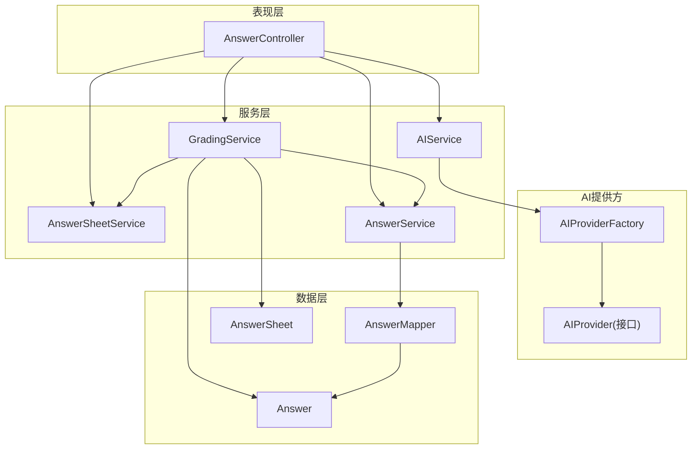
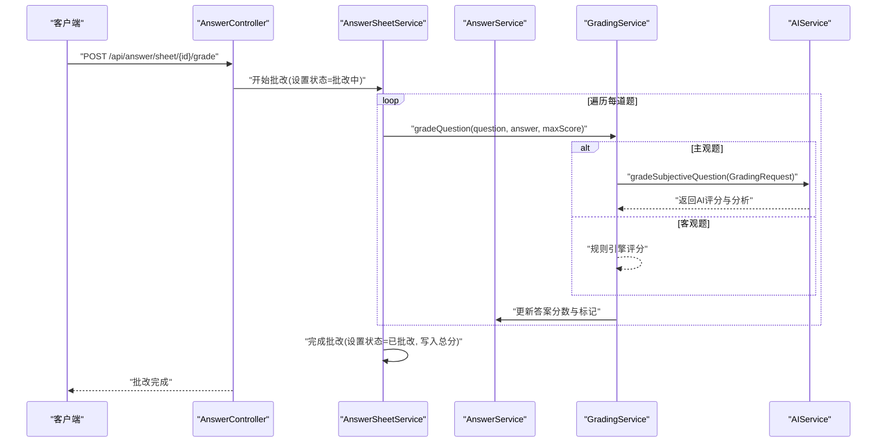
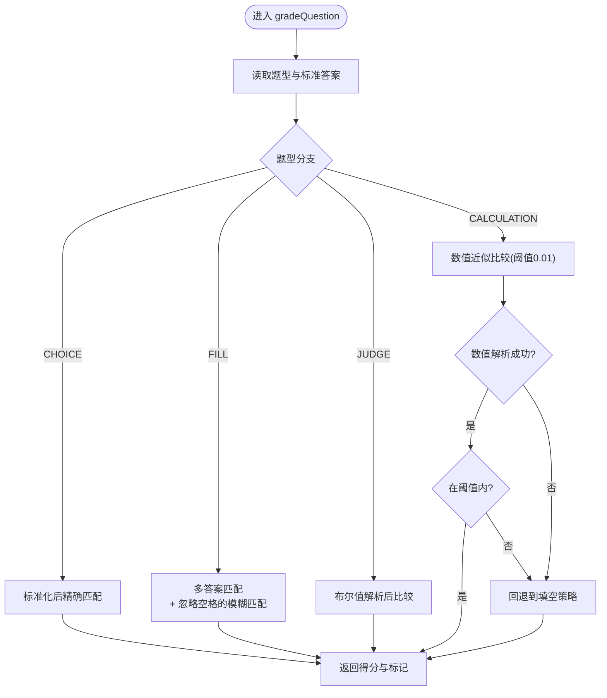
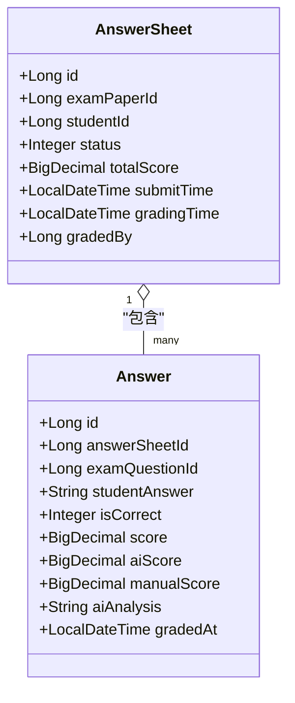
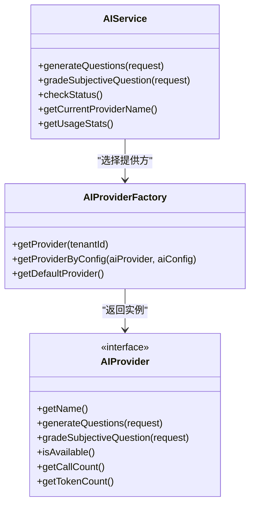
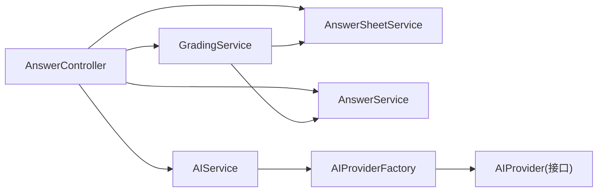

# 自动批改引擎

<cite>
**本文引用的文件**
- [GradingService.java](file://backend/src/main/java/com/edu/grading/service/GradingService.java)
- [AIService.java](file://backend/src/main/java/com/edu/ai/service/AIService.java)
- [AIProvider.java](file://backend/src/main/java/com/edu/ai/provider/AIProvider.java)
- [AIProviderFactory.java](file://backend/src/main/java/com/edu/ai/provider/AIProviderFactory.java)
- [GradingRequest.java](file://backend/src/main/java/com/edu/ai/dto/GradingRequest.java)
- [AnswerController.java](file://backend/src/main/java/com/edu/grading/controller/AnswerController.java)
- [AnswerService.java](file://backend/src/main/java/com/edu/grading/service/AnswerService.java)
- [AnswerSheetService.java](file://backend/src/main/java/com/edu/grading/service/AnswerSheetService.java)
- [Answer.java](file://backend/src/main/java/com/edu/grading/entity/Answer.java)
- [AnswerSheet.java](file://backend/src/main/java/com/edu/grading/entity/AnswerSheet.java)
- [AnswerSubmitRequest.java](file://backend/src/main/java/com/edu/grading/dto/AnswerSubmitRequest.java)
- [AnswerResponse.java](file://backend/src/main/java/com/edu/grading/dto/AnswerResponse.java)
- [AnswerMapper.java](file://backend/src/main/java/com/edu/grading/mapper/AnswerMapper.java)
</cite>

## 目录
1. [引言](#引言)
2. [项目结构](#项目结构)
3. [核心组件](#核心组件)
4. [架构总览](#架构总览)
5. [详细组件分析](#详细组件分析)
6. [依赖分析](#依赖分析)
7. [性能考虑](#性能考虑)
8. [故障排查指南](#故障排查指南)
9. [结论](#结论)
10. [附录：配置与参数说明](#附录配置与参数说明)

## 引言
本文件面向“自动批改引擎”的技术实现，聚焦AI驱动的批改算法与规则引擎的协同工作模式。系统支持多种题型（选择题、填空题、判断题、计算题）的自动化评分，并预留主观题的AI评分能力；同时提供人工评分优先的融合机制与质量控制流程。文档从架构、数据流、处理逻辑、性能优化到异常处理进行系统性阐述，并给出可操作的配置建议与排障指引。

## 项目结构
后端采用分层架构，自动批改相关模块主要位于 grading 与 ai 包中：
- 控制器层：AnswerController 提供答题卡与答案的提交、查询与批改触发接口
- 服务层：AnswerSheetService、AnswerService、GradingService 实现答题卡生命周期管理、答案持久化与评分规则
- AI集成层：AIService 作为统一入口，通过 AIProviderFactory 动态选择云端或私有 AI 提供商
- 数据模型：Answer、AnswerSheet 及其 Mapper 负责持久化

图表来源
- [AnswerController.java:1-140](file://backend/src/main/java/com/edu/grading/controller/AnswerController.java#L1-L140)
- [AnswerSheetService.java:1-127](file://backend/src/main/java/com/edu/grading/service/AnswerSheetService.java#L1-L127)
- [AnswerService.java:1-105](file://backend/src/main/java/com/edu/grading/service/AnswerService.java#L1-L105)
- [GradingService.java:1-232](file://backend/src/main/java/com/edu/grading/service/GradingService.java#L1-L232)
- [AIService.java:1-102](file://backend/src/main/java/com/edu/ai/service/AIService.java#L1-L102)
- [AIProviderFactory.java:1-67](file://backend/src/main/java/com/edu/ai/provider/AIProviderFactory.java#L1-L67)
- [AIProvider.java:1-42](file://backend/src/main/java/com/edu/ai/provider/AIProvider.java#L1-L42)
- [AnswerMapper.java:1-12](file://backend/src/main/java/com/edu/grading/mapper/AnswerMapper.java#L1-L12)
- [Answer.java:1-39](file://backend/src/main/java/com/edu/grading/entity/Answer.java#L1-L39)
- [AnswerSheet.java:1-34](file://backend/src/main/java/com/edu/grading/entity/AnswerSheet.java#L1-L34)

章节来源
- [AnswerController.java:1-140](file://backend/src/main/java/com/edu/grading/controller/AnswerController.java#L1-L140)
- [AnswerSheetService.java:1-127](file://backend/src/main/java/com/edu/grading/service/AnswerSheetService.java#L1-L127)
- [AnswerService.java:1-105](file://backend/src/main/java/com/edu/grading/service/AnswerService.java#L1-L105)
- [GradingService.java:1-232](file://backend/src/main/java/com/edu/grading/service/GradingService.java#L1-L232)
- [AIService.java:1-102](file://backend/src/main/java/com/edu/ai/service/AIService.java#L1-L102)
- [AIProviderFactory.java:1-67](file://backend/src/main/java/com/edu/ai/provider/AIProviderFactory.java#L1-L67)
- [AIProvider.java:1-42](file://backend/src/main/java/com/edu/ai/provider/AIProvider.java#L1-L42)
- [AnswerMapper.java:1-12](file://backend/src/main/java/com/edu/grading/mapper/AnswerMapper.java#L1-L12)
- [Answer.java:1-39](file://backend/src/main/java/com/edu/grading/entity/Answer.java#L1-L39)
- [AnswerSheet.java:1-34](file://backend/src/main/java/com/edu/grading/entity/AnswerSheet.java#L1-L34)

## 核心组件
- 规则引擎批改器（GradingService）：按题型执行精确匹配、多答案容差、布尔值匹配与数值近似等策略，支持标准化与异常回退
- 答题卡服务（AnswerSheetService）：管理答题卡生命周期（创建、提交、批改中、完成），记录总分与批改人
- 答案服务（AnswerService）：保存/更新答案，写入分数与人工/AI评分标记，支持人工评分优先覆盖
- AI服务（AIService + AIProviderFactory + AIProvider）：统一接入云端/私有AI，提供主观题AI评分与状态统计
- 控制器（AnswerController）：对外暴露答题卡与答案的REST接口，触发批改流程

章节来源
- [GradingService.java:1-232](file://backend/src/main/java/com/edu/grading/service/GradingService.java#L1-L232)
- [AnswerSheetService.java:1-127](file://backend/src/main/java/com/edu/grading/service/AnswerSheetService.java#L1-L127)
- [AnswerService.java:1-105](file://backend/src/main/java/com/edu/grading/service/AnswerService.java#L1-L105)
- [AIService.java:1-102](file://backend/src/main/java/com/edu/ai/service/AIService.java#L1-L102)
- [AIProviderFactory.java:1-67](file://backend/src/main/java/com/edu/ai/provider/AIProviderFactory.java#L1-L67)
- [AIProvider.java:1-42](file://backend/src/main/java/com/edu/ai/provider/AIProvider.java#L1-L42)
- [AnswerController.java:1-140](file://backend/src/main/java/com/edu/grading/controller/AnswerController.java#L1-L140)

## 架构总览
自动批改引擎由“规则引擎 + AI评分”双通道构成：
- 客户端提交答案后，服务端持久化答案并进入批改流程
- 规则引擎对客观题（选择、填空、判断、计算）进行自动评分
- 对主观题，通过AIService调用AIProvider进行评分与分析
- 人工评分具有最高优先级，可覆盖AI/规则评分
- 批改完成后汇总总分并更新答题卡状态

图表来源
- [AnswerController.java:67-73](file://backend/src/main/java/com/edu/grading/controller/AnswerController.java#L67-L73)
- [AnswerSheetService.java:67-93](file://backend/src/main/java/com/edu/grading/service/AnswerSheetService.java#L67-L93)
- [GradingService.java:34-80](file://backend/src/main/java/com/edu/grading/service/GradingService.java#L34-L80)
- [AIService.java:37-42](file://backend/src/main/java/com/edu/ai/service/AIService.java#L37-L42)
- [GradingRequest.java:1-40](file://backend/src/main/java/com/edu/ai/dto/GradingRequest.java#L1-L40)

## 详细组件分析

### 规则引擎批改器（GradingService）
- 输入：题目信息（题型、标准答案）、学生答案、满分
- 输出：单题得分、正确标记、是否计入错题
- 关键策略
  - 选择题：精确匹配（大小写归一、空白归一）
  - 填空题：多答案（|分隔）、模糊匹配（忽略多余空格）
  - 判断题：布尔值解析（支持英文/中文/数字）
  - 计算题：数值近似（阈值0.01），失败时回退到填空策略
- 标准化与容错
  - 统一转大写、去除首尾空白、合并多余空白
  - 数值解析异常回退到填空策略
- 错题记录：当isCorrect为0时，记录错题以便后续分析

图表来源
- [GradingService.java:85-206](file://backend/src/main/java/com/edu/grading/service/GradingService.java#L85-L206)

章节来源
- [GradingService.java:1-232](file://backend/src/main/java/com/edu/grading/service/GradingService.java#L1-L232)

### 答题卡与答案服务
- 答题卡服务（AnswerSheetService）
  - 生命周期：未提交 → 已提交 → 批改中 → 已批改
  - 写入提交时间、批改时间、总分、批改人
- 答案服务（AnswerService）
  - 保存/更新答案，写入规则/AI评分与人工评分
  - 人工评分优先覆盖AI/规则评分
  - 提供按答题卡查询答案列表

图表来源
- [AnswerSheet.java:1-34](file://backend/src/main/java/com/edu/grading/entity/AnswerSheet.java#L1-L34)
- [Answer.java:1-39](file://backend/src/main/java/com/edu/grading/entity/Answer.java#L1-L39)

章节来源
- [AnswerSheetService.java:1-127](file://backend/src/main/java/com/edu/grading/service/AnswerSheetService.java#L1-L127)
- [AnswerService.java:1-105](file://backend/src/main/java/com/edu/grading/service/AnswerService.java#L1-L105)
- [Answer.java:1-39](file://backend/src/main/java/com/edu/grading/entity/Answer.java#L1-L39)
- [AnswerSheet.java:1-34](file://backend/src/main/java/com/edu/grading/entity/AnswerSheet.java#L1-L34)

### AI评分与提供方选择
- AIService
  - 统一入口：生成题目、主观题批改、状态检查、用量统计
  - 租户维度选择AI提供方：通过租户上下文获取租户ID，再由工厂选择云端或私有提供方
- AIProviderFactory
  - 根据租户配置返回对应AIProvider实例
  - 默认回退到云端提供方
- AIProvider 接口
  - 定义统一能力：生成题目、主观题批改、可用性检查、用量统计

图表来源
- [AIService.java:1-102](file://backend/src/main/java/com/edu/ai/service/AIService.java#L1-L102)
- [AIProviderFactory.java:1-67](file://backend/src/main/java/com/edu/ai/provider/AIProviderFactory.java#L1-L67)
- [AIProvider.java:1-42](file://backend/src/main/java/com/edu/ai/provider/AIProvider.java#L1-L42)

章节来源
- [AIService.java:1-102](file://backend/src/main/java/com/edu/ai/service/AIService.java#L1-L102)
- [AIProviderFactory.java:1-67](file://backend/src/main/java/com/edu/ai/provider/AIProviderFactory.java#L1-L67)
- [AIProvider.java:1-42](file://backend/src/main/java/com/edu/ai/provider/AIProvider.java#L1-L42)

### 控制器与数据传输对象
- AnswerController
  - 提供答题卡创建、答案提交、答题卡提交、批改触发、查询等接口
- DTO
  - AnswerSubmitRequest：提交答案的请求体
  - AnswerResponse：答案详情响应（含AI评分、人工评分、AI分析）

章节来源
- [AnswerController.java:1-140](file://backend/src/main/java/com/edu/grading/controller/AnswerController.java#L1-L140)
- [AnswerSubmitRequest.java:1-19](file://backend/src/main/java/com/edu/grading/dto/AnswerSubmitRequest.java#L1-L19)
- [AnswerResponse.java:1-37](file://backend/src/main/java/com/edu/grading/dto/AnswerResponse.java#L1-L37)

## 依赖分析
- 组件耦合
  - GradingService 依赖 AnswerService、AnswerSheetService、QuestionService（间接）
  - AnswerController 依赖 AnswerSheetService、AnswerService、GradingService
  - AIService 依赖 AIProviderFactory，后者依赖具体提供方与租户服务
- 数据依赖
  - AnswerMapper/Answer 与 AnswerSheet 之间存在一对多关系
- 外部依赖
  - 租户上下文（TenantContextHolder）用于提供方选择
  - MyBatis-Plus 进行数据访问

图表来源
- [AnswerController.java:1-140](file://backend/src/main/java/com/edu/grading/controller/AnswerController.java#L1-L140)
- [AnswerSheetService.java:1-127](file://backend/src/main/java/com/edu/grading/service/AnswerSheetService.java#L1-L127)
- [AnswerService.java:1-105](file://backend/src/main/java/com/edu/grading/service/AnswerService.java#L1-L105)
- [GradingService.java:1-232](file://backend/src/main/java/com/edu/grading/service/GradingService.java#L1-L232)
- [AIService.java:1-102](file://backend/src/main/java/com/edu/ai/service/AIService.java#L1-L102)
- [AIProviderFactory.java:1-67](file://backend/src/main/java/com/edu/ai/provider/AIProviderFactory.java#L1-L67)
- [AIProvider.java:1-42](file://backend/src/main/java/com/edu/ai/provider/AIProvider.java#L1-L42)

章节来源
- [AnswerController.java:1-140](file://backend/src/main/java/com/edu/grading/controller/AnswerController.java#L1-L140)
- [AnswerSheetService.java:1-127](file://backend/src/main/java/com/edu/grading/service/AnswerSheetService.java#L1-L127)
- [AnswerService.java:1-105](file://backend/src/main/java/com/edu/grading/service/AnswerService.java#L1-L105)
- [GradingService.java:1-232](file://backend/src/main/java/com/edu/grading/service/GradingService.java#L1-L232)
- [AIService.java:1-102](file://backend/src/main/java/com/edu/ai/service/AIService.java#L1-L102)
- [AIProviderFactory.java:1-67](file://backend/src/main/java/com/edu/ai/provider/AIProviderFactory.java#L1-L67)
- [AIProvider.java:1-42](file://backend/src/main/java/com/edu/ai/provider/AIProvider.java#L1-L42)

## 性能考虑
- 并发与事务
  - 批改流程在事务中执行，避免中间状态不一致
  - 建议对批量批改场景引入队列异步化，降低长事务占用
- 缓存策略
  - 对常见题型的标准化规则与答案集合进行本地缓存，减少重复解析成本
  - 对租户AI配置进行短期缓存，降低工厂选择开销
- I/O优化
  - 使用MyBatis-Plus批量插入/更新接口，减少数据库往返
  - 合理分页查询答题卡列表，避免一次性加载过多数据
- AI调用节流
  - 通过AIService的用量统计监控调用次数与Token消耗，必要时增加限流与重试策略
- CPU热点
  - 数值比较与字符串标准化为热点，建议预编译正则或使用更高效的归一化方法

## 故障排查指南
- 常见问题
  - 答题卡不存在：批改前先校验答题卡是否存在
  - 答案为空：未作答按0分处理，确保前端必填校验
  - 题目不存在：规则引擎跳过该题，需检查题库数据一致性
  - 数值解析异常：计算题解析失败会回退到填空策略，检查输入格式
  - AI不可用：检查租户配置与提供方可用性，必要时切换到备用提供方
- 日志定位
  - 控制器与服务层均输出关键操作日志，便于追踪批改链路
- 人工干预
  - 人工评分优先覆盖AI/规则评分，确保最终分数准确
  - 建议对AI评分与规则评分差异较大的题目进行抽样复核

章节来源
- [GradingService.java:34-80](file://backend/src/main/java/com/edu/grading/service/GradingService.java#L34-L80)
- [AnswerSheetService.java:52-93](file://backend/src/main/java/com/edu/grading/service/AnswerSheetService.java#L52-L93)
- [AnswerService.java:67-104](file://backend/src/main/java/com/edu/grading/service/AnswerService.java#L67-L104)
- [AIService.java:47-50](file://backend/src/main/java/com/edu/ai/service/AIService.java#L47-L50)

## 结论
本自动批改引擎以“规则引擎 + AI评分”双通道为核心，既保证了客观题的高一致性与高性能，又为主观题提供了可扩展的AI评分能力。通过人工评分优先与错题记录机制，实现了AI与人工的协同治理。建议在生产环境中配合异步批改、缓存与限流策略，持续优化吞吐与稳定性。

## 附录：配置与参数说明
- 主观题AI批改请求参数（GradingRequest）
  - 字段：questionContent（题目内容）、questionType（题型）、correctAnswer（标准答案）、studentAnswer（学生答案）、maxScore（满分）、needAnalysis（是否需要详细分析）
  - 用途：向AI提供方发起主观题评分请求
- 答题提交请求（AnswerSubmitRequest）
  - 字段：answerSheetId（答题卡ID）、examQuestionId（试卷题目ID）、studentAnswer（学生答案）
  - 用途：提交单题答案
- 答案详情响应（AnswerResponse）
  - 字段：id、answerSheetId、examQuestionId、studentAnswer、isCorrect、score、aiScore、manualScore、aiAnalysis、gradedAt、sequence、questionContent
  - 用途：返回带评分与分析的答题详情
- AI使用统计（AIService.AIUsageStats）
  - 字段：providerName、callCount、tokenCount、available
  - 用途：查看当前提供方的调用统计与可用性

章节来源
- [GradingRequest.java:1-40](file://backend/src/main/java/com/edu/ai/dto/GradingRequest.java#L1-L40)
- [AnswerSubmitRequest.java:1-19](file://backend/src/main/java/com/edu/grading/dto/AnswerSubmitRequest.java#L1-L19)
- [AnswerResponse.java:1-37](file://backend/src/main/java/com/edu/grading/dto/AnswerResponse.java#L1-L37)
- [AIService.java:87-101](file://backend/src/main/java/com/edu/ai/service/AIService.java#L87-L101)