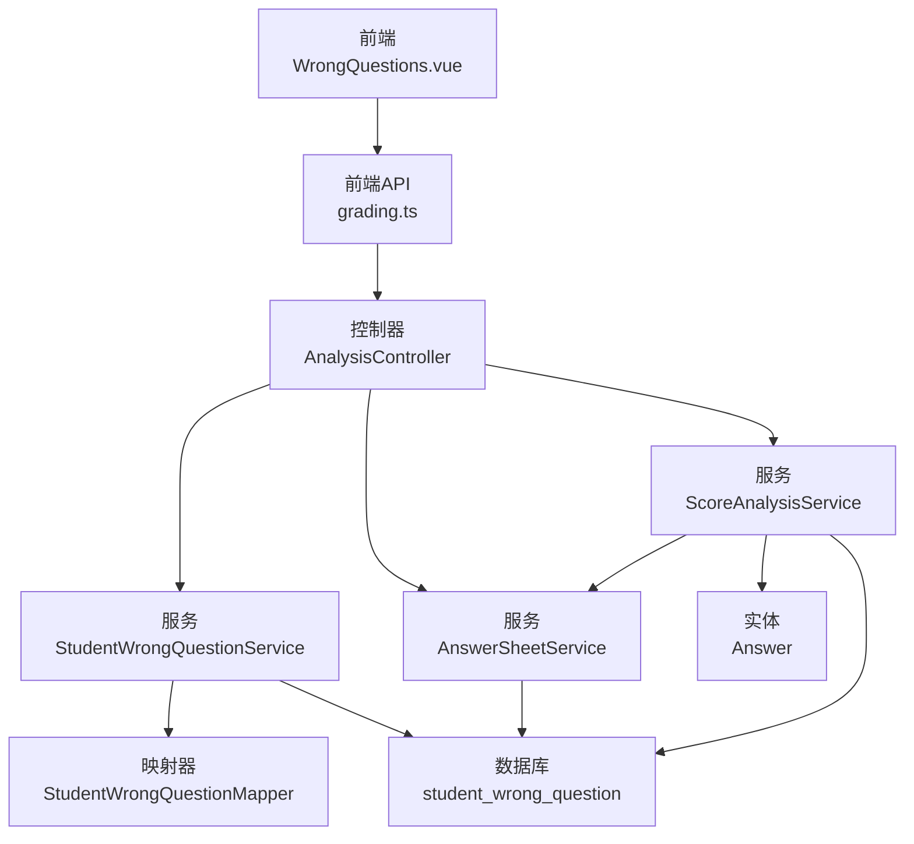
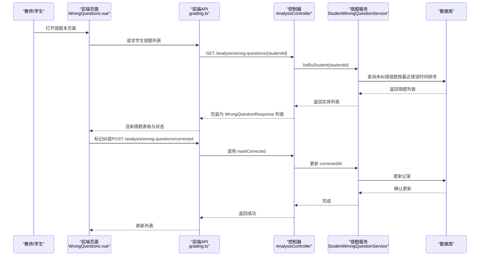
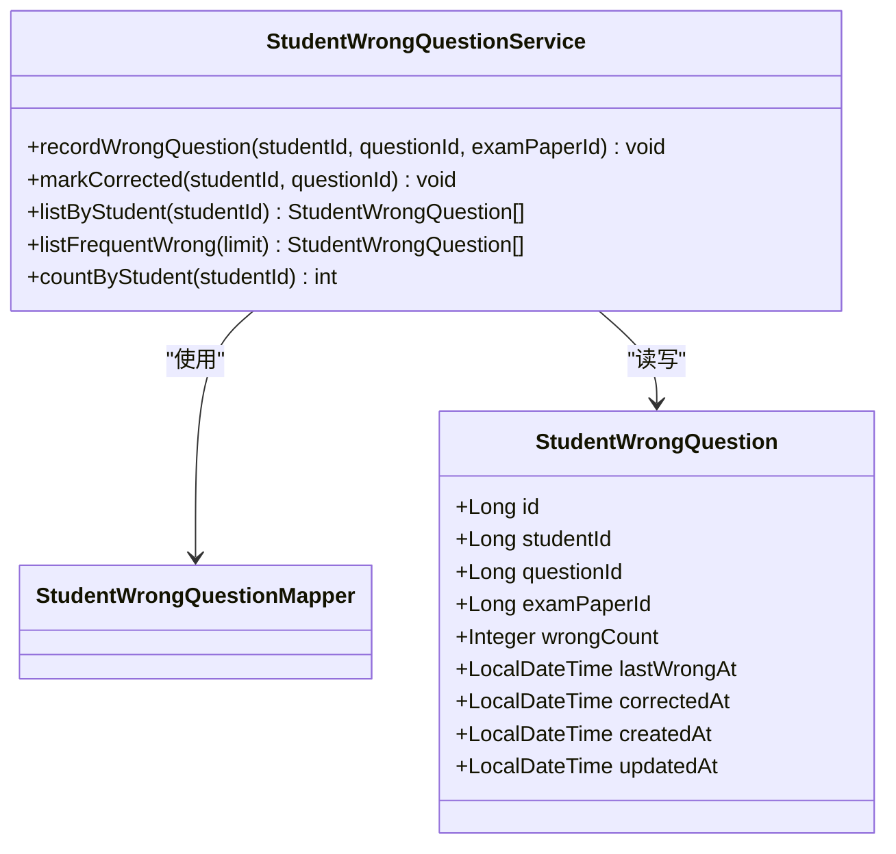
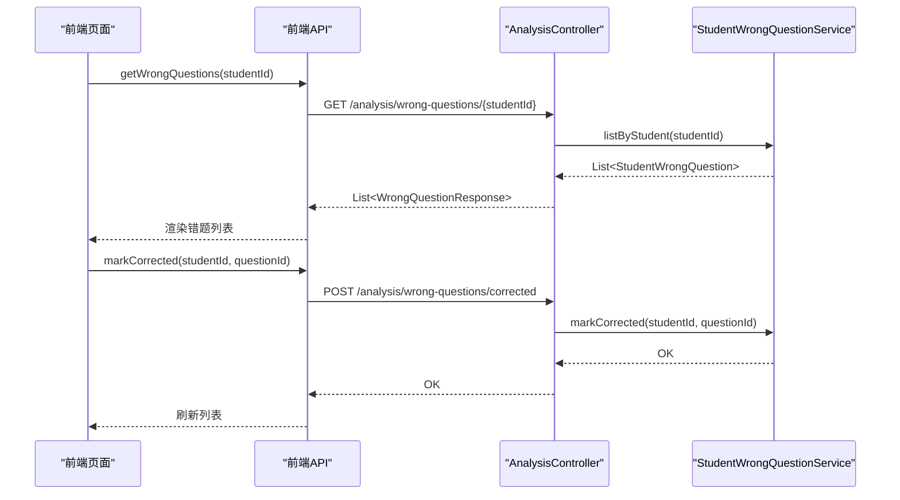
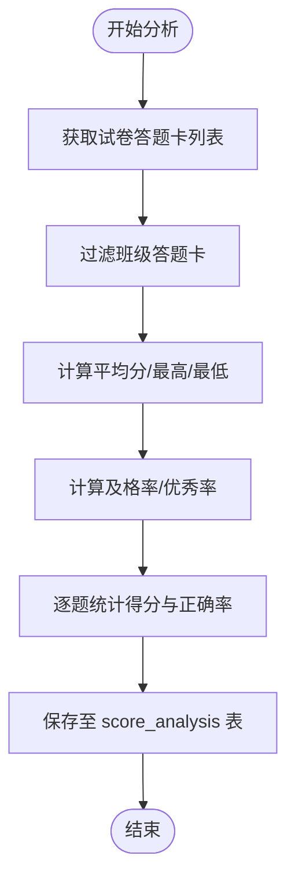
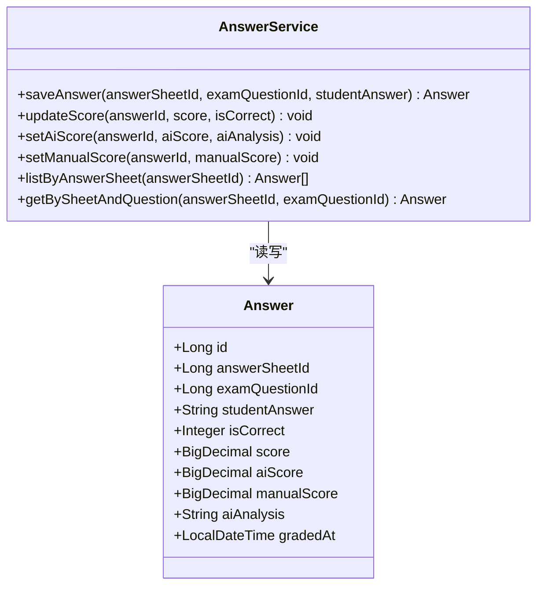
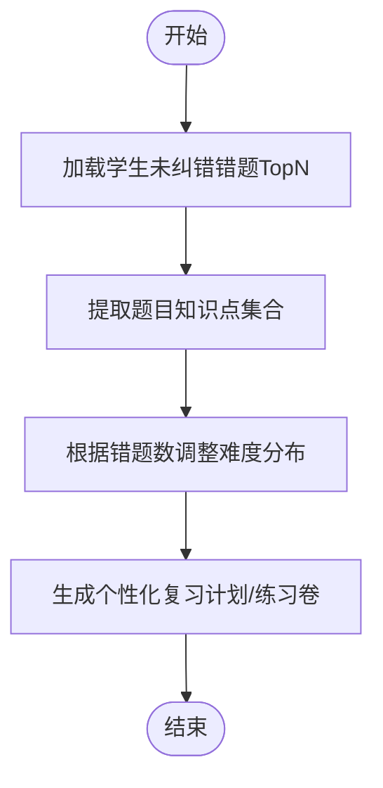
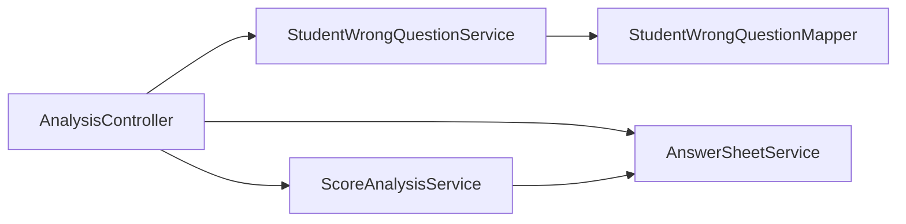

# 错题分析

<cite>
**本文引用的文件**
- [StudentWrongQuestion.java](file://backend/src/main/java/com/edu/grading/entity/StudentWrongQuestion.java)
- [StudentWrongQuestionService.java](file://backend/src/main/java/com/edu/grading/service/StudentWrongQuestionService.java)
- [StudentWrongQuestionMapper.java](file://backend/src/main/java/com/edu/grading/mapper/StudentWrongQuestionMapper.java)
- [WrongQuestionResponse.java](file://backend/src/main/java/com/edu/grading/dto/WrongQuestionResponse.java)
- [AnalysisController.java](file://backend/src/main/java/com/edu/grading/controller/AnalysisController.java)
- [AnswerSheetService.java](file://backend/src/main/java/com/edu/grading/service/AnswerSheetService.java)
- [ScoreAnalysisService.java](file://backend/src/main/java/com/edu/grading/service/ScoreAnalysisService.java)
- [ScoreAnalysis.java](file://backend/src/main/java/com/edu/grading/entity/ScoreAnalysis.java)
- [ScoreAnalysisResponse.java](file://backend/src/main/java/com/edu/grading/dto/ScoreAnalysisResponse.java)
- [Answer.java](file://backend/src/main/java/com/edu/grading/entity/Answer.java)
- [AnswerService.java](file://backend/src/main/java/com/edu/grading/service/AnswerService.java)
- [schema.sql](file://backend/src/main/resources/db/schema.sql)
- [WrongQuestions.vue](file://frontend/src/views/WrongQuestions.vue)
- [grading.ts](file://frontend/src/api/grading.ts)
- [index.ts](file://frontend/src/router/index.ts)
- [ExamGenerateService.java](file://backend/src/main/java/com/edu/exam/service/ExamGenerateService.java)
</cite>

## 目录
1. [简介](#简介)
2. [项目结构](#项目结构)
3. [核心组件](#核心组件)
4. [架构总览](#架构总览)
5. [详细组件分析](#详细组件分析)
6. [依赖分析](#依赖分析)
7. [性能考虑](#性能考虑)
8. [故障排查指南](#故障排查指南)
9. [结论](#结论)
10. [附录](#附录)

## 简介
本文件围绕“错题分析”能力进行系统化说明，覆盖以下方面：
- 错题识别与记录：基于答题行为自动采集错题，维护错题计数与时间戳。
- 错题分类与知识点关联：通过题目实体中的知识点字段，提取错题涉及的知识点集合。
- 学习路径建议生成：结合错题数量与知识点薄弱项，动态调整题目难度分布，辅助个性化练习。
- 错题本功能：提供错题列表、高频错题、纠错标记与统计视图。
- 知识点掌握度评估：以错题为依据，推导知识点掌握情况，支撑教学评估。
- 统计与趋势分析：提供班级维度的分数分布与题目得分率，辅助教学改进。
- 数据存储与查询优化：基于数据库索引与查询封装，保障性能与可维护性。
- 报告模板与展示格式：提供可复用的分析报告结构与前端展示方案。

## 项目结构
后端采用分层架构，错题分析相关模块主要位于 grading 子模块；前端提供错题本页面与接口调用；数据库层面提供错题记录表与相关索引。

图表来源
- [AnalysisController.java:23-94](file://backend/src/main/java/com/edu/grading/controller/AnalysisController.java#L23-L94)
- [StudentWrongQuestionService.java:21-101](file://backend/src/main/java/com/edu/grading/service/StudentWrongQuestionService.java#L21-L101)
- [ScoreAnalysisService.java:31-96](file://backend/src/main/java/com/edu/grading/service/ScoreAnalysisService.java#L31-L96)
- [AnswerSheetService.java:23-126](file://backend/src/main/java/com/edu/grading/service/AnswerSheetService.java#L23-L126)
- [StudentWrongQuestionMapper.java:10-11](file://backend/src/main/java/com/edu/grading/mapper/StudentWrongQuestionMapper.java#L10-L11)
- [schema.sql:285-297](file://backend/src/main/resources/db/schema.sql#L285-L297)

章节来源
- [AnalysisController.java:23-94](file://backend/src/main/java/com/edu/grading/controller/AnalysisController.java#L23-L94)
- [schema.sql:285-297](file://backend/src/main/resources/db/schema.sql#L285-L297)

## 核心组件
- 错题实体与服务
  - 实体：记录学生错题、错误次数、最近错误时间、纠错时间等。
  - 服务：提供记录错题、标记纠错、按学生查询、高频错题查询、统计数量等方法。
- 控制器：暴露错题本相关接口，包括获取学生错题、标记纠错、获取高频错题。
- 成绩分析服务：计算班级平均分、最高/最低分、及格率、优秀率以及题目得分率。
- 答题服务：维护学生答案、AI/人工评分、正确性标记与批改时间。
- 前端页面与API：提供错题本页面、高频错题展示、纠错标记交互。
- 生成服务：从错题提取知识点，调整难度分布，用于个性化练习生成。

章节来源
- [StudentWrongQuestion.java:13-31](file://backend/src/main/java/com/edu/grading/entity/StudentWrongQuestion.java#L13-L31)
- [StudentWrongQuestionService.java:21-101](file://backend/src/main/java/com/edu/grading/service/StudentWrongQuestionService.java#L21-L101)
- [AnalysisController.java:63-94](file://backend/src/main/java/com/edu/grading/controller/AnalysisController.java#L63-L94)
- [ScoreAnalysisService.java:31-96](file://backend/src/main/java/com/edu/grading/service/ScoreAnalysisService.java#L31-L96)
- [AnswerService.java:25-104](file://backend/src/main/java/com/edu/grading/service/AnswerService.java#L25-L104)
- [WrongQuestions.vue:1-104](file://frontend/src/views/WrongQuestions.vue#L1-L104)
- [grading.ts:48-63](file://frontend/src/api/grading.ts#L48-L63)
- [ExamGenerateService.java:300-374](file://backend/src/main/java/com/edu/exam/service/ExamGenerateService.java#L300-L374)

## 架构总览
错题分析贯穿“前端展示—接口—服务—持久层”的完整链路，并与成绩分析、答题流程协同工作。

图表来源
- [AnalysisController.java:63-81](file://backend/src/main/java/com/edu/grading/controller/AnalysisController.java#L63-L81)
- [StudentWrongQuestionService.java:73-68](file://backend/src/main/java/com/edu/grading/service/StudentWrongQuestionService.java#L73-L68)
- [WrongQuestions.vue:64-92](file://frontend/src/views/WrongQuestions.vue#L64-L92)
- [grading.ts:48-58](file://frontend/src/api/grading.ts#L48-L58)

## 详细组件分析

### 错题实体与服务
- 实体属性：包含学生ID、题目ID、来源试卷、错误次数、最近错误时间、纠错时间等。
- 服务方法：
  - 记录错题：若已存在则累加错误次数并更新最近错误时间，否则新增记录。
  - 标记纠错：将纠错时间置为当前时间。
  - 按学生查询：返回未纠错错题，按最近错误时间倒序。
  - 高频错题：筛选错误次数≥3的未纠错错题，限制条数。
  - 统计数量：统计某学生的未纠错错题总数。

图表来源
- [StudentWrongQuestion.java:13-31](file://backend/src/main/java/com/edu/grading/entity/StudentWrongQuestion.java#L13-L31)
- [StudentWrongQuestionService.java:21-101](file://backend/src/main/java/com/edu/grading/service/StudentWrongQuestionService.java#L21-L101)
- [StudentWrongQuestionMapper.java:10-11](file://backend/src/main/java/com/edu/grading/mapper/StudentWrongQuestionMapper.java#L10-L11)

章节来源
- [StudentWrongQuestion.java:13-31](file://backend/src/main/java/com/edu/grading/entity/StudentWrongQuestion.java#L13-L31)
- [StudentWrongQuestionService.java:26-101](file://backend/src/main/java/com/edu/grading/service/StudentWrongQuestionService.java#L26-L101)

### 控制器与前端交互
- 接口定义：
  - GET /analysis/wrong-questions/{studentId}：返回该学生未纠错错题列表。
  - POST /analysis/wrong-questions/corrected：标记某学生某题已纠错。
  - GET /analysis/wrong-questions/frequent：返回高频错题列表。
- 前端页面：
  - 提供“我的错题”和“高频错题”两个标签页。
  - 支持按学生ID查询、标记纠错、加载中状态与错误提示。

图表来源
- [AnalysisController.java:63-94](file://backend/src/main/java/com/edu/grading/controller/AnalysisController.java#L63-L94)
- [WrongQuestions.vue:64-92](file://frontend/src/views/WrongQuestions.vue#L64-L92)
- [grading.ts:48-58](file://frontend/src/api/grading.ts#L48-L58)

章节来源
- [AnalysisController.java:63-94](file://backend/src/main/java/com/edu/grading/controller/AnalysisController.java#L63-L94)
- [WrongQuestions.vue:1-104](file://frontend/src/views/WrongQuestions.vue#L1-L104)
- [grading.ts:48-63](file://frontend/src/api/grading.ts#L48-L63)

### 成绩分析与统计
- 成绩分析服务：
  - 计算平均分、最高/最低分、及格率（以平均分60%为线）、优秀率（以平均分90%为线）。
  - 对每道题统计平均得分与正确率，形成题目分析JSON。
  - 将分析结果持久化到 score_analysis 表，支持按试卷+班级查询。
- 响应DTO：封装分析结果与题目分析项，包含题目ID、序号、满分、均分、正确率等。

图表来源
- [ScoreAnalysisService.java:40-96](file://backend/src/main/java/com/edu/grading/service/ScoreAnalysisService.java#L40-L96)
- [ScoreAnalysis.java:14-36](file://backend/src/main/java/com/edu/grading/entity/ScoreAnalysis.java#L14-L36)
- [ScoreAnalysisResponse.java:12-43](file://backend/src/main/java/com/edu/grading/dto/ScoreAnalysisResponse.java#L12-L43)

章节来源
- [ScoreAnalysisService.java:31-171](file://backend/src/main/java/com/edu/grading/service/ScoreAnalysisService.java#L31-L171)
- [ScoreAnalysis.java:14-36](file://backend/src/main/java/com/edu/grading/entity/ScoreAnalysis.java#L14-L36)
- [ScoreAnalysisResponse.java:12-43](file://backend/src/main/java/com/edu/grading/dto/ScoreAnalysisResponse.java#L12-L43)

### 答题与评分
- 答题服务：
  - 保存/更新学生答案，支持AI评分与人工评分。
  - 设置正确性标记与批改时间；人工评分优先于AI评分。
- 答题实体：包含学生答案、AI评分/分析、人工评分、得分、正确性标记与批改时间等。

图表来源
- [Answer.java:14-38](file://backend/src/main/java/com/edu/grading/entity/Answer.java#L14-L38)
- [AnswerService.java:25-104](file://backend/src/main/java/com/edu/grading/service/AnswerService.java#L25-L104)

章节来源
- [AnswerService.java:25-104](file://backend/src/main/java/com/edu/grading/service/AnswerService.java#L25-L104)
- [Answer.java:14-38](file://backend/src/main/java/com/edu/grading/entity/Answer.java#L14-L38)

### 学习路径建议生成机制
- 基于错题的薄弱知识点提取：遍历学生未纠错错题，读取题目知识点字段，聚合形成知识点集合。
- 难度分布调整：根据错题数量动态调整简单/中等/困难题的比例，错题越多，适当提高简单题比例，帮助巩固基础。
- 与个性化练习生成结合：在生成服务中使用上述结果，指导生成符合学生当前水平的练习卷。

图表来源
- [ExamGenerateService.java:300-374](file://backend/src/main/java/com/edu/exam/service/ExamGenerateService.java#L300-L374)

章节来源
- [ExamGenerateService.java:300-374](file://backend/src/main/java/com/edu/exam/service/ExamGenerateService.java#L300-L374)

### 知识点掌握度评估
- 评估思路：
  - 以错题为负样本，未纠错错题数量越多，对应知识点掌握越弱。
  - 结合高频错题，识别共性薄弱点。
  - 与题目知识点字段联动，形成知识点维度的掌握度画像。
- 教学应用：
  - 教师可据此调整教学重点与讲评方向。
  - 为个性化辅导提供依据。

章节来源
- [StudentWrongQuestionService.java:84-91](file://backend/src/main/java/com/edu/grading/service/StudentWrongQuestionService.java#L84-L91)
- [ExamGenerateService.java:312-333](file://backend/src/main/java/com/edu/exam/service/ExamGenerateService.java#L312-L333)

### 错题统计与趋势分析
- 班级维度统计：平均分、最高/最低分、及格率、优秀率。
- 题目维度统计：每道题的平均得分与正确率，便于分析易错题与难点。
- 前端展示：在“成绩分析”页面呈现，支持按试卷与班级筛选。

章节来源
- [ScoreAnalysisService.java:106-170](file://backend/src/main/java/com/edu/grading/service/ScoreAnalysisService.java#L106-L170)
- [ScoreAnalysisResponse.java:12-43](file://backend/src/main/java/com/edu/grading/dto/ScoreAnalysisResponse.java#L12-L43)

## 依赖分析
- 控制器依赖服务：AnalysisController 依赖 ScoreAnalysisService、StudentWrongQuestionService、AnswerSheetService。
- 服务间耦合：ScoreAnalysisService 依赖 AnswerSheetService 与 AnswerService，间接依赖答题与答案实体。
- 映射器依赖：StudentWrongQuestionService 依赖 StudentWrongQuestionMapper。
- 前端路由与页面：路由配置包含错题本页面，API封装与控制器接口一一对应。

图表来源
- [AnalysisController.java:28-30](file://backend/src/main/java/com/edu/grading/controller/AnalysisController.java#L28-L30)
- [ScoreAnalysisService.java:33-35](file://backend/src/main/java/com/edu/grading/service/ScoreAnalysisService.java#L33-L35)
- [StudentWrongQuestionService.java:3-6](file://backend/src/main/java/com/edu/grading/service/StudentWrongQuestionService.java#L3-L6)

章节来源
- [index.ts:66-69](file://frontend/src/router/index.ts#L66-L69)
- [grading.ts:48-63](file://frontend/src/api/grading.ts#L48-L63)

## 性能考虑
- 数据库索引
  - 错题表：按 student_id 与 question_id 建立索引，支持快速查找与去重。
  - 答题卡与答案表：按 exam_paper_id、student_id、answer_sheet_id 等建立索引，提升统计与查询效率。
- 查询封装
  - 服务层使用条件构造器与排序、分页限制，避免全表扫描。
- 缓存与批量处理
  - 高频错题查询可配合缓存策略，减少重复统计开销。
- 前端渲染
  - 使用加载态与分页，避免大数据量一次性渲染导致的卡顿。

章节来源
- [schema.sql:353-356](file://backend/src/main/resources/db/schema.sql#L353-L356)
- [StudentWrongQuestionService.java:73-91](file://backend/src/main/java/com/edu/grading/service/StudentWrongQuestionService.java#L73-L91)
- [AnswerSheetService.java:102-126](file://backend/src/main/java/com/edu/grading/service/AnswerSheetService.java#L102-L126)

## 故障排查指南
- 错题未显示或统计异常
  - 检查学生ID是否正确，确认未纠错条件与排序逻辑。
  - 查看高频错题阈值与限制条数设置。
- 标记纠错无效
  - 确认请求参数 studentId 与 questionId 是否匹配现有记录。
  - 检查数据库中 correctedAt 字段是否更新。
- 成绩分析为空
  - 确认是否存在该班级的答题卡数据，检查答题卡状态与批改完成情况。
- 前端无法访问接口
  - 检查路由配置与 API 请求路径是否一致，确认跨域与鉴权设置。

章节来源
- [AnalysisController.java:63-94](file://backend/src/main/java/com/edu/grading/controller/AnalysisController.java#L63-L94)
- [StudentWrongQuestionService.java:56-68](file://backend/src/main/java/com/edu/grading/service/StudentWrongQuestionService.java#L56-L68)
- [AnswerSheetService.java:95-100](file://backend/src/main/java/com/edu/grading/service/AnswerSheetService.java#L95-L100)

## 结论
本系统通过“答题—错题记录—分析—个性化练习—统计反馈”的闭环，实现了从数据采集到教学改进的全流程支持。错题本功能直观易用，成绩分析提供量化依据，学习路径建议结合知识点与难度分布，有助于提升教学与学习效果。后续可在缓存、指标监控与报表可视化方面进一步增强。

## 附录

### 错题数据存储结构
- 错题记录表：包含学生ID、题目ID、来源试卷、错误次数、最近错误时间、纠错时间等关键字段。
- 索引设计：按 student_id 与 question_id 建立联合唯一索引，确保同一学生同一题目的唯一性与高效查询。

章节来源
- [schema.sql:285-297](file://backend/src/main/resources/db/schema.sql#L285-L297)
- [StudentWrongQuestion.java:13-31](file://backend/src/main/java/com/edu/grading/entity/StudentWrongQuestion.java#L13-L31)

### 错题分析报告模板与展示格式
- 报告维度
  - 学生维度：错题总数、纠错进度、错题类型分布、高频错题TopN。
  - 知识点维度：薄弱知识点清单、掌握度评估、建议复习顺序。
  - 班级维度：平均分、最高/最低分、及格率、优秀率、题目得分率。
- 展示建议
  - 前端卡片式布局，错题统计使用进度条与数值组合展示。
  - 高频错题表格支持按错误次数与最近错误时间排序。
  - 成绩分析以图表形式呈现，支持切换试卷与班级。

章节来源
- [WrongQuestionResponse.java:11-31](file://backend/src/main/java/com/edu/grading/dto/WrongQuestionResponse.java#L11-L31)
- [ScoreAnalysisResponse.java:12-43](file://backend/src/main/java/com/edu/grading/dto/ScoreAnalysisResponse.java#L12-L43)
- [WrongQuestions.vue:19-47](file://frontend/src/views/WrongQuestions.vue#L19-L47)