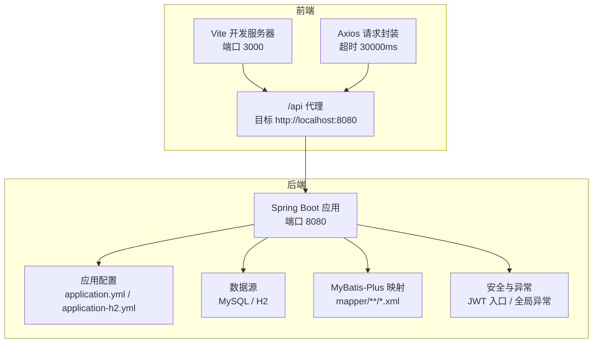
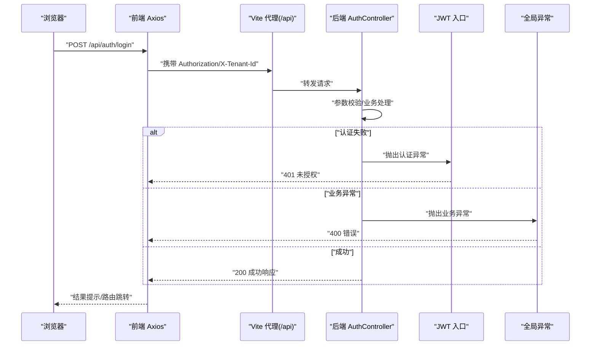
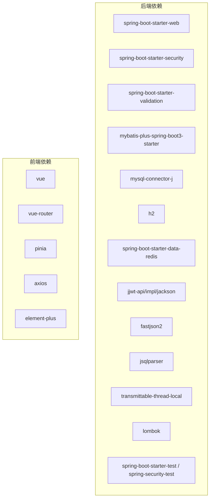

# 故障排除与FAQ

<cite>
**本文引用的文件**
- [application.yml](file://backend/src/main/resources/application.yml)
- [application-h2.yml](file://backend/src/main/resources/application-h2.yml)
- [pom.xml](file://backend/pom.xml)
- [GlobalExceptionHandler.java](file://backend/src/main/java/com/edu/common/exception/GlobalExceptionHandler.java)
- [BusinessException.java](file://backend/src/main/java/com/edu/common/exception/BusinessException.java)
- [JwtAuthenticationEntryPoint.java](file://backend/src/main/java/com/edu/common/security/JwtAuthenticationEntryPoint.java)
- [AuthController.java](file://backend/src/main/java/com/edu/user/controller/AuthController.java)
- [EduApplication.java](file://backend/src/main/java/com/edu/EduApplication.java)
- [schema.sql](file://backend/src/main/resources/db/schema.sql)
- [request.ts](file://frontend/src/utils/request.ts)
- [vite.config.ts](file://frontend/vite.config.ts)
- [package.json](file://frontend/package.json)
- [INSTALL.md](file://INSTALL.md)
- [start.bat](file://backend/start.bat)
</cite>

## 目录
1. [简介](#简介)
2. [项目结构](#项目结构)
3. [核心组件](#核心组件)
4. [架构总览](#架构总览)
5. [详细组件分析](#详细组件分析)
6. [依赖分析](#依赖分析)
7. [性能考虑](#性能考虑)
8. [故障排除指南](#故障排除指南)
9. [结论](#结论)
10. [附录](#附录)

## 简介
本文件面向开发者与运维人员，系统化梳理开发、部署与运行阶段的常见问题与解决方案，覆盖环境配置、数据库连接、API 调用、前端显示、日志分析、网络检查与性能优化等方面。同时提供错误信息解读、启动失败排查、连接超时与权限错误处理、以及社区支持与问题反馈流程。

## 项目结构
后端采用 Spring Boot 3 + MyBatis-Plus，前端采用 Vue 3 + Vite，通过代理将 /api 前缀转发至后端 8080 端口；数据库默认使用 MySQL，亦支持 H2 内存数据库用于本地快速验证。

图表来源
- [vite.config.ts:12-20](file://frontend/vite.config.ts#L12-L20)
- [request.ts:5-8](file://frontend/src/utils/request.ts#L5-L8)
- [application.yml:1-65](file://backend/src/main/resources/application.yml#L1-L65)
- [application-h2.yml:1-76](file://backend/src/main/resources/application-h2.yml#L1-L76)
- [EduApplication.java:1-15](file://backend/src/main/java/com/edu/EduApplication.java#L1-L15)

章节来源
- [INSTALL.md:103-117](file://INSTALL.md#L103-L117)
- [pom.xml:22-27](file://backend/pom.xml#L22-L27)

## 核心组件
- 后端配置与数据源
  - 默认使用 MySQL，Hikari 连接池参数可调；Redis 自动装配可按需禁用。
  - H2 模式下内置控制台，便于本地验证。
- 安全与异常
  - 全局异常处理器统一返回 Result 结构；JWT 认证失败统一返回 401。
- 前端请求封装
  - Axios 实例设置 baseURL 为 /api，自动注入 Authorization 与 X-Tenant-Id 头部；响应拦截器对非 200 错误进行提示与路由跳转。
- 启动与打包
  - Maven 插件负责打包；Windows 启动脚本指定激活 profile 并指向 EduApplication。

章节来源
- [application.yml:15-29](file://backend/src/main/resources/application.yml#L15-L29)
- [application-h2.yml:20-30](file://backend/src/main/resources/application-h2.yml#L20-L30)
- [GlobalExceptionHandler.java:23-67](file://backend/src/main/java/com/edu/common/exception/GlobalExceptionHandler.java#L23-L67)
- [JwtAuthenticationEntryPoint.java:18-30](file://backend/src/main/java/com/edu/common/security/JwtAuthenticationEntryPoint.java#L18-L30)
- [request.ts:5-27](file://frontend/src/utils/request.ts#L5-L27)
- [start.bat](file://backend/start.bat#L15)

## 架构总览
以下序列图展示登录流程的关键交互，涵盖前端请求、后端鉴权与异常处理。

图表来源
- [AuthController.java:20-24](file://backend/src/main/java/com/edu/user/controller/AuthController.java#L20-L24)
- [JwtAuthenticationEntryPoint.java:18-30](file://backend/src/main/java/com/edu/common/security/JwtAuthenticationEntryPoint.java#L18-L30)
- [GlobalExceptionHandler.java:48-67](file://backend/src/main/java/com/edu/common/exception/GlobalExceptionHandler.java#L48-L67)
- [request.ts:33-51](file://frontend/src/utils/request.ts#L33-L51)

## 详细组件分析

### 后端配置与数据源
- 关键点
  - MySQL 连接串、用户名/密码、时区与字符集；Hikari 连接池最小空闲、最大连接、空闲超时与连接超时。
  - MyBatis-Plus 映射路径、类型别名包、驼峰映射与日志实现。
  - JWT 密钥与过期时间；AI 提供商默认配置与私有服务地址。
  - 日志级别对 com.edu 与 Spring Security 的细化。
- 排查要点
  - 确认 DB_PASSWORD 环境变量或配置文件中的密码正确。
  - 检查 MySQL 服务状态与端口 3306 可达性。
  - 如切换 H2，确认激活了正确的 profile，并访问 /h2-console 进行验证。

章节来源
- [application.yml:15-65](file://backend/src/main/resources/application.yml#L15-L65)
- [application-h2.yml:20-30](file://backend/src/main/resources/application-h2.yml#L20-L30)

### 安全与异常处理
- 关键点
  - 全局异常处理器捕获业务异常、参数校验异常、认证异常、权限不足与通用异常，统一封装为 Result。
  - JWT 认证入口在未登录时返回 401，并写入 JSON 响应。
- 排查要点
  - 401：检查 Authorization 头是否携带 Bearer Token，Token 是否过期或签名错误。
  - 403：检查租户拦截器与权限策略是否拒绝访问。
  - 400：检查请求体字段与校验规则；关注响应 message 中的具体提示。

章节来源
- [GlobalExceptionHandler.java:23-67](file://backend/src/main/java/com/edu/common/exception/GlobalExceptionHandler.java#L23-L67)
- [JwtAuthenticationEntryPoint.java:18-30](file://backend/src/main/java/com/edu/common/security/JwtAuthenticationEntryPoint.java#L18-L30)
- [BusinessException.java:13-26](file://backend/src/main/java/com/edu/common/exception/BusinessException.java#L13-L26)

### 前端请求与代理
- 关键点
  - baseURL 为 /api，Vite 代理将 /api 转发到后端 8080。
  - 请求拦截器统一设置 Content-Type、Authorization 与 X-Tenant-Id。
  - 响应拦截器对非 200 错误弹窗提示，并在 401 时清除本地 token 并跳转登录。
- 排查要点
  - 确认 Vite 代理配置与后端端口一致。
  - 确认本地存储存在有效 token，且未被清理。
  - 若跨域或代理失败，检查浏览器 Network 面板与后端 CORS 配置。

章节来源
- [vite.config.ts:12-20](file://frontend/vite.config.ts#L12-L20)
- [request.ts:5-27](file://frontend/src/utils/request.ts#L5-L27)
- [request.ts:33-51](file://frontend/src/utils/request.ts#L33-L51)

### 启动与打包
- 关键点
  - Maven 插件负责打包；Windows 启动脚本激活 H2 profile 并运行 EduApplication。
- 排查要点
  - 确认 JAVA_HOME/MAVEN_HOME 正确，PATH 包含它们。
  - 确认端口 8080/3000 未被占用。
  - 如需切换数据库，修改 profile 或配置文件。

章节来源
- [pom.xml:135-150](file://backend/pom.xml#L135-L150)
- [start.bat:1-15](file://backend/start.bat#L1-L15)
- [EduApplication.java:1-15](file://backend/src/main/java/com/edu/EduApplication.java#L1-L15)

## 依赖分析
后端依赖包括 Web、Security、Validation、MyBatis-Plus、MySQL/H2、Redis、JWT、Fastjson2、JSqlParser、TransmittableThreadLocal、Lombok 与测试依赖。前端依赖 Vue、Vue Router、Pinia、Axios、Element Plus 与 Vite。

图表来源
- [pom.xml:29-132](file://backend/pom.xml#L29-L132)
- [package.json:11-24](file://frontend/package.json#L11-L24)

章节来源
- [pom.xml:29-132](file://backend/pom.xml#L29-L132)
- [package.json:11-24](file://frontend/package.json#L11-L24)

## 性能考虑
- 数据库连接池
  - 调整最小空闲、最大连接、空闲超时与连接超时，避免连接泄漏与抖动。
- 查询与索引
  - 对外键列与常用查询列建立索引，减少慢查询。
- 缓存与异步
  - 对热点读取引入缓存；对耗时任务采用异步处理。
- 日志与监控
  - 生产关闭冗余日志，保留必要级别；接入指标监控与链路追踪。
- 前端体验
  - 合理拆分代码块，启用懒加载；压缩静态资源。

## 故障排除指南

### 环境配置问题
- 症状
  - 启动失败、端口占用、命令不可用。
- 排查步骤
  - 检查 Java 17 与 Maven 版本是否满足要求。
  - 确认环境变量 JAVA_HOME/MAVEN_HOME/PATH 正确。
  - 关闭占用 8080/3000 的进程或调整端口。
  - 使用安装指南中的验证命令检查工具版本。
- 相关文件
  - [INSTALL.md:120-134](file://INSTALL.md#L120-L134)

章节来源
- [INSTALL.md:103-117](file://INSTALL.md#L103-L117)
- [INSTALL.md:120-134](file://INSTALL.md#L120-L134)

### 数据库连接问题
- 症状
  - 启动报连接超时、驱动找不到、初始化失败。
- 排查步骤
  - 确认 MySQL 服务已启动，端口 3306 可达。
  - 校验 application.yml 中的 JDBC URL、用户名、密码与时区。
  - 如使用 H2，确认激活了 H2 profile，并访问 /h2-console。
  - 检查 schema.sql 初始化是否成功，确认数据库字符集与排序规则。
- 相关文件
  - [application.yml:15-29](file://backend/src/main/resources/application.yml#L15-L29)
  - [application-h2.yml:20-30](file://backend/src/main/resources/application-h2.yml#L20-L30)
  - [schema.sql:1-30](file://backend/src/main/resources/db/schema.sql#L1-L30)

章节来源
- [application.yml:15-29](file://backend/src/main/resources/application.yml#L15-L29)
- [application-h2.yml:20-30](file://backend/src/main/resources/application-h2.yml#L20-L30)
- [schema.sql:1-30](file://backend/src/main/resources/db/schema.sql#L1-L30)

### API 调用问题
- 症状
  - 401 未授权、400 参数错误、403 权限不足、500 系统异常。
- 排查步骤
  - 401：确认前端已从本地存储读取 token 并附加 Authorization 头；后端 JWT 入口是否正确处理。
  - 400：检查请求体字段与校验注解；查看响应 message 获取具体提示。
  - 403：检查租户拦截器与权限策略；确认 X-Tenant-Id 是否正确。
  - 500：查看后端日志定位异常堆栈，确认全局异常处理器是否捕获。
- 相关文件
  - [request.ts:16-23](file://frontend/src/utils/request.ts#L16-L23)
  - [request.ts:33-51](file://frontend/src/utils/request.ts#L33-L51)
  - [JwtAuthenticationEntryPoint.java:18-30](file://backend/src/main/java/com/edu/common/security/JwtAuthenticationEntryPoint.java#L18-L30)
  - [GlobalExceptionHandler.java:23-67](file://backend/src/main/java/com/edu/common/exception/GlobalExceptionHandler.java#L23-L67)

章节来源
- [request.ts:16-23](file://frontend/src/utils/request.ts#L16-L23)
- [request.ts:33-51](file://frontend/src/utils/request.ts#L33-L51)
- [JwtAuthenticationEntryPoint.java:18-30](file://backend/src/main/java/com/edu/common/security/JwtAuthenticationEntryPoint.java#L18-L30)
- [GlobalExceptionHandler.java:23-67](file://backend/src/main/java/com/edu/common/exception/GlobalExceptionHandler.java#L23-L67)

### 前端显示问题
- 症状
  - 页面空白、接口 404、跨域错误、登录后无法跳转。
- 排查步骤
  - 确认 Vite 代理配置将 /api 转发到后端 8080。
  - 检查浏览器 Network 面板，确认 /api 请求已转发且响应码正常。
  - 确认本地存储存在 token；401 时前端会自动清理并跳转登录。
  - 检查 Element Plus 消息提示是否正常触发。
- 相关文件
  - [vite.config.ts:12-20](file://frontend/vite.config.ts#L12-L20)
  - [request.ts:33-51](file://frontend/src/utils/request.ts#L33-L51)

章节来源
- [vite.config.ts:12-20](file://frontend/vite.config.ts#L12-L20)
- [request.ts:33-51](file://frontend/src/utils/request.ts#L33-L51)

### 日志分析
- 建议
  - 后端开启 com.edu 与 Spring Security 日志，定位业务与安全相关问题。
  - 前端在开发模式下观察控制台输出，结合 Network 面板分析请求细节。
- 相关文件
  - [application.yml:61-65](file://backend/src/main/resources/application.yml#L61-L65)
  - [application-h2.yml:73-76](file://backend/src/main/resources/application-h2.yml#L73-L76)

章节来源
- [application.yml:61-65](file://backend/src/main/resources/application.yml#L61-L65)
- [application-h2.yml:73-76](file://backend/src/main/resources/application-h2.yml#L73-L76)

### 网络检查与代理
- 建议
  - 使用 curl 或 Postman 测试 /api 路由是否可达。
  - 在浏览器开发者工具中检查代理是否生效、CORS 是否允许。
  - 如需跨主机访问，确保后端允许来源或调整代理配置。
- 相关文件
  - [vite.config.ts:14-19](file://frontend/vite.config.ts#L14-L19)
  - [request.ts:5-8](file://frontend/src/utils/request.ts#L5-L8)

章节来源
- [vite.config.ts:14-19](file://frontend/vite.config.ts#L14-L19)
- [request.ts:5-8](file://frontend/src/utils/request.ts#L5-L8)

### 性能调优与资源优化
- 建议
  - 数据库：为高频查询列加索引；优化慢查询日志；合理设置连接池大小。
  - 应用：开启必要的缓存；对大对象分页查询；减少 N+1 查询。
  - 前端：启用代码分割与懒加载；压缩与 CDN 加速静态资源。
- 相关文件
  - [application.yml:20-25](file://backend/src/main/resources/application.yml#L20-L25)
  - [schema.sql:300-379](file://backend/src/main/resources/db/schema.sql#L300-L379)

章节来源
- [application.yml:20-25](file://backend/src/main/resources/application.yml#L20-L25)
- [schema.sql:300-379](file://backend/src/main/resources/db/schema.sql#L300-L379)

### 常见错误信息与修复
- 启动失败
  - 端口冲突：更换端口或释放端口。
  - 依赖缺失：执行 mvn clean install，确保本地仓库完整。
- 连接超时
  - 检查数据库服务状态、防火墙与网络连通性。
- 权限错误
  - 401：检查 token 是否存在、是否过期。
  - 403：检查租户与权限策略配置。
- 参数校验失败
  - 查看响应 message，修正请求体字段。

章节来源
- [GlobalExceptionHandler.java:37-46](file://backend/src/main/java/com/edu/common/exception/GlobalExceptionHandler.java#L37-L46)
- [JwtAuthenticationEntryPoint.java:18-30](file://backend/src/main/java/com/edu/common/security/JwtAuthenticationEntryPoint.java#L18-L30)

### 社区支持与问题反馈流程
- 建议
  - 优先查阅安装与配置文档，确保环境符合要求。
  - 收集前后端日志与网络抓包，定位问题范围。
  - 在社区渠道提交问题时，附带：
    - 环境信息（Java/Maven/MySQL/Vite 版本）
    - 关键配置片段（application.yml、vite.config.ts）
    - 复现步骤与错误截图/日志
  - 问题解决后补充到知识库，帮助他人。

章节来源
- [INSTALL.md:1-134](file://INSTALL.md#L1-L134)

## 结论
通过规范的环境准备、清晰的配置管理、完善的异常与安全处理、以及系统化的日志与网络检查，大多数问题可在短时间内定位与修复。建议团队在开发与运维流程中固化这些排障步骤，持续优化性能与稳定性。

## 附录

### 端口与默认凭据
- 端口
  - 前端：3000（Vite 开发服务器）
  - 后端：8080（Spring Boot）
  - MySQL：3306
- 默认登录
  - 用户名：admin
  - 密码：admin123

章节来源
- [INSTALL.md:103-117](file://INSTALL.md#L103-L117)