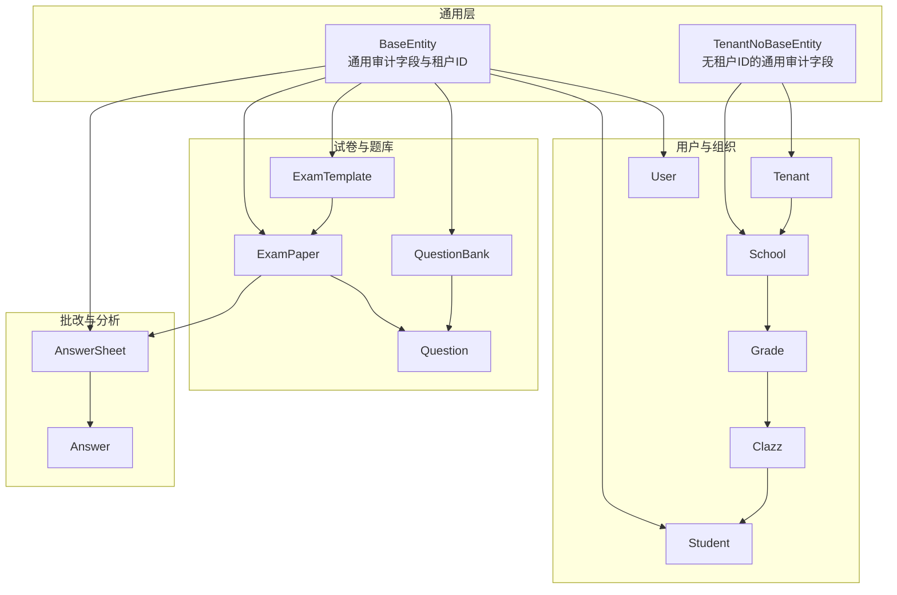
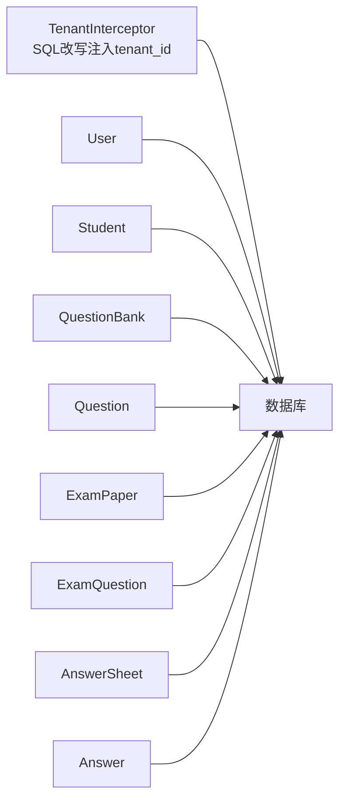

# 实体关系设计

<cite>
**本文引用的文件**
- [BaseEntity.java](file://backend/src/main/java/com/edu/common/entity/BaseEntity.java)
- [TenantNoBaseEntity.java](file://backend/src/main/java/com/edu/common/entity/TenantNoBaseEntity.java)
- [TenantInterceptor.java](file://backend/src/main/java/com/edu/common/interceptor/TenantInterceptor.java)
- [User.java](file://backend/src/main/java/com/edu/user/entity/User.java)
- [Clazz.java](file://backend/src/main/java/com/edu/user/entity/Clazz.java)
- [Student.java](file://backend/src/main/java/com/edu/user/entity/Student.java)
- [Grade.java](file://backend/src/main/java/com/edu/user/entity/Grade.java)
- [School.java](file://backend/src/main/java/com/edu/tenant/entity/School.java)
- [Tenant.java](file://backend/src/main/java/com/edu/tenant/entity/Tenant.java)
- [Question.java](file://backend/src/main/java/com/edu/exam/entity/Question.java)
- [QuestionBank.java](file://backend/src/main/java/com/edu/exam/entity/QuestionBank.java)
- [ExamTemplate.java](file://backend/src/main/java/com/edu/exam/entity/ExamTemplate.java)
- [ExamPaper.java](file://backend/src/main/java/com/edu/exam/entity/ExamPaper.java)
- [AnswerSheet.java](file://backend/src/main/java/com/edu/grading/entity/AnswerSheet.java)
- [Answer.java](file://backend/src/main/java/com/edu/grading/entity/Answer.java)
- [schema.sql](file://backend/src/main/resources/db/schema.sql)
</cite>

## 目录
1. [引言](#引言)
2. [项目结构](#项目结构)
3. [核心组件](#核心组件)
4. [架构总览](#架构总览)
5. [详细组件分析](#详细组件分析)
6. [依赖分析](#依赖分析)
7. [性能考量](#性能考量)
8. [故障排查指南](#故障排查指南)
9. [结论](#结论)
10. [附录](#附录)

## 引言
本文件系统性梳理教育平台的实体关系设计，覆盖用户、班级、学生、题目、试卷、答题与批改等核心业务实体，并基于数据库脚本与实体类映射，明确一对一、一对多、多对多关系的实现方式；阐述外键约束与索引策略，解释多租户环境下的租户隔离与数据访问控制；最后给出最佳实践与性能优化建议。

## 项目结构
后端采用按功能域分层的包结构：common（通用）、user（用户组织）、exam（试卷题库）、grading（批改分析）、tenant（租户学校）、ppt（演示文稿）等。实体类通过注解映射到数据库表，统一继承通用基类以支持租户字段与通用审计字段。



图表来源
- [BaseEntity.java:11-37](file://backend/src/main/java/com/edu/common/entity/BaseEntity.java#L11-L37)
- [TenantNoBaseEntity.java:11-22](file://backend/src/main/java/com/edu/common/entity/TenantNoBaseEntity.java#L11-L22)
- [User.java:11-20](file://backend/src/main/java/com/edu/user/entity/User.java#L11-L20)
- [Student.java:12-21](file://backend/src/main/java/com/edu/user/entity/Student.java#L12-L21)
- [QuestionBank.java:11-19](file://backend/src/main/java/com/edu/exam/entity/QuestionBank.java#L11-L19)
- [ExamTemplate.java:16-25](file://backend/src/main/java/com/edu/exam/entity/ExamTemplate.java#L16-L25)
- [ExamPaper.java:17-30](file://backend/src/main/java/com/edu/exam/entity/ExamPaper.java#L17-L30)
- [AnswerSheet.java:17-34](file://backend/src/main/java/com/edu/grading/entity/AnswerSheet.java#L17-L34)
- [Question.java:9-24](file://backend/src/main/java/com/edu/exam/entity/Question.java#L9-L24)

章节来源
- [BaseEntity.java:11-37](file://backend/src/main/java/com/edu/common/entity/BaseEntity.java#L11-L37)
- [TenantNoBaseEntity.java:11-22](file://backend/src/main/java/com/edu/common/entity/TenantNoBaseEntity.java#L11-L22)
- [schema.sql:48-146](file://backend/src/main/resources/db/schema.sql#L48-L146)
- [schema.sql:152-297](file://backend/src/main/resources/db/schema.sql#L152-L297)

## 核心组件
- 通用基类
  - BaseEntity：统一注入 tenant_id、创建/更新时间、逻辑删除字段，支撑多租户与审计。
  - TenantNoBaseEntity：系统级表（如租户、权限）不参与租户隔离，仅含审计字段。
- 用户与组织
  - User：系统用户，归属租户。
  - Grade：年级，归属学校。
  - Clazz：班级，归属年级，可关联班主任用户。
  - Student：学生，归属班级，可关联用户账号。
  - School：学校，归属租户。
  - Tenant：租户，系统级主数据。
- 试卷与题库
  - QuestionBank：题库，归属租户，可公开给租户内共享。
  - Question：题目，归属题库。
  - ExamTemplate：试卷模板，归属租户。
  - ExamPaper：试卷，可关联模板，限定适用年级/班级，归属租户。
- 批改与分析
  - AnswerSheet：答题卡，记录学生作答状态、分数与批改信息，归属租户。
  - Answer：答题详情，记录每题得分与AI/人工评分。

章节来源
- [BaseEntity.java:11-37](file://backend/src/main/java/com/edu/common/entity/BaseEntity.java#L11-L37)
- [TenantNoBaseEntity.java:11-22](file://backend/src/main/java/com/edu/common/entity/TenantNoBaseEntity.java#L11-L22)
- [User.java:11-20](file://backend/src/main/java/com/edu/user/entity/User.java#L11-L20)
- [Clazz.java:9-17](file://backend/src/main/java/com/edu/user/entity/Clazz.java#L9-L17)
- [Student.java:12-21](file://backend/src/main/java/com/edu/user/entity/Student.java#L12-L21)
- [Grade.java:9-16](file://backend/src/main/java/com/edu/user/entity/Grade.java#L9-L16)
- [School.java:11-16](file://backend/src/main/java/com/edu/tenant/entity/School.java#L11-L16)
- [Tenant.java:12-20](file://backend/src/main/java/com/edu/tenant/entity/Tenant.java#L12-L20)
- [QuestionBank.java:11-19](file://backend/src/main/java/com/edu/exam/entity/QuestionBank.java#L11-L19)
- [Question.java:9-24](file://backend/src/main/java/com/edu/exam/entity/Question.java#L9-L24)
- [ExamTemplate.java:16-25](file://backend/src/main/java/com/edu/exam/entity/ExamTemplate.java#L16-L25)
- [ExamPaper.java:17-30](file://backend/src/main/java/com/edu/exam/entity/ExamPaper.java#L17-L30)
- [AnswerSheet.java:17-34](file://backend/src/main/java/com/edu/grading/entity/AnswerSheet.java#L17-L34)
- [Answer.java:14-39](file://backend/src/main/java/com/edu/grading/entity/Answer.java#L14-L39)

## 架构总览
下图展示实体间的一对一、一对多与多对多关系，以及外键约束与索引策略如何保障引用完整性与查询性能。

```mermaid
erDiagram
tenant ||--o{ school : "拥有"
school ||--o{ grade : "拥有"
grade ||--o{ class : "拥有"
class ||--o{ student : "拥有"
student ||--|| user : "可关联"
tenant ||--o{ question_bank : "拥有"
question_bank ||--o{ question : "包含"
tenant ||--o{ exam_template : "拥有"
tenant ||--o{ exam_paper : "拥有"
exam_template ||--o{ exam_paper : "生成"
exam_paper ||--o{ exam_question : "包含"
exam_question ||--|| question : "引用"
tenant ||--o{ answer_sheet : "拥有"
class ||--o{ answer_sheet : "产生"
student ||--o{ answer_sheet : "提交"
exam_paper ||--o{ answer_sheet : "承载"
answer_sheet ||--o{ answer : "包含"
exam_question ||--o{ answer : "对应"
```

图表来源
- [schema.sql:9-41](file://backend/src/main/resources/db/schema.sql#L9-L41)
- [schema.sql:110-146](file://backend/src/main/resources/db/schema.sql#L110-L146)
- [schema.sql:152-184](file://backend/src/main/resources/db/schema.sql#L152-L184)
- [schema.sql:186-218](file://backend/src/main/resources/db/schema.sql#L186-L218)
- [schema.sql:220-229](file://backend/src/main/resources/db/schema.sql#L220-L229)
- [schema.sql:235-250](file://backend/src/main/resources/db/schema.sql#L235-L250)
- [schema.sql:252-267](file://backend/src/main/resources/db/schema.sql#L252-L267)

## 详细组件分析

### 用户与组织实体关系
- 一对一
  - Student → User：学生可关联一个用户账号，便于登录与权限管理。
- 一对多
  - School → Grade：一所学校包含多个年级。
  - Grade → Class：一个年级包含多个班级。
  - Class → Student：一个班级包含多名学生。
- 外键与索引
  - class.teacher_id 指向 sys_user.id。
  - student.class_id 指向 class.id。
  - grade.school_id 指向 school.id。
  - 建议索引：idx_class_teacher_id、idx_student_class_id、idx_grade_school_id。

章节来源
- [schema.sql:120-146](file://backend/src/main/resources/db/schema.sql#L120-L146)
- [schema.sql:318-324](file://backend/src/main/resources/db/schema.sql#L318-L324)

### 试卷与题库实体关系
- 一对一
  - ExamPaper → ExamTemplate：可选关联模板生成试卷。
- 一对多
  - QuestionBank → Question：一个题库包含多道题目。
  - ExamPaper → ExamQuestion：一张试卷包含多道题目。
- 多对多
  - 通过中间表 exam_question 实现：ExamPaper ↔ Question 多对多。
- 外键与索引
  - question.bank_id → question_bank.id
  - exam_paper.template_id → exam_template.id
  - exam_question.exam_paper_id → exam_paper.id
  - exam_question.question_id → question.id
  - 建议索引：idx_question_bank_id、idx_exam_paper_template_id、idx_exam_question_exam_paper_id、idx_exam_question_question_id。

章节来源
- [schema.sql:152-218](file://backend/src/main/resources/db/schema.sql#L152-L218)
- [schema.sql:220-229](file://backend/src/main/resources/db/schema.sql#L220-L229)
- [schema.sql:326-339](file://backend/src/main/resources/db/schema.sql#L326-L339)

### 批改与分析实体关系
- 一对一
  - AnswerSheet → Student：一份答题卡对应一位学生。
  - AnswerSheet → ExamPaper：一份答题卡对应一张试卷。
- 一对多
  - AnswerSheet → Answer：一份答题卡包含多道题目的答题详情。
  - ExamQuestion → Answer：一个试卷题目对应多份答题详情（不同学生）。
- 外键与索引
  - answer_sheet.student_id → student.id
  - answer_sheet.exam_paper_id → exam_paper.id
  - answer.answer_sheet_id → answer_sheet.id
  - answer.exam_question_id → exam_question.id
  - 建议索引：idx_answer_sheet_student_id、idx_answer_sheet_exam_paper_id、idx_answer_answer_sheet_id、idx_answer_exam_question_id。

章节来源
- [schema.sql:235-267](file://backend/src/main/resources/db/schema.sql#L235-L267)
- [schema.sql:340-347](file://backend/src/main/resources/db/schema.sql#L340-L347)

### 多租户隔离与引用完整性
- 设计原则
  - 所有业务表均包含 tenant_id 字段，确保跨租户数据隔离。
  - 系统级表（如 permission）不参与租户隔离，避免循环依赖。
  - 通过租户拦截器在查询前自动注入 tenant_id 过滤条件，保证默认查询不越权。
- 引用完整性
  - 通过外键约束与唯一索引（如 uk_tenant_username、uk_tenant_student_no、uk_exam_student、uk_sheet_question 等）保障引用完整性和业务唯一性。
  - 对高频过滤列建立索引（如 tenant_id、class_id、student_id、question_id 等），提升查询性能与并发安全性。

章节来源
- [BaseEntity.java:16](file://backend/src/main/java/com/edu/common/entity/BaseEntity.java#L16)
- [TenantNoBaseEntity.java:13-21](file://backend/src/main/java/com/edu/common/entity/TenantNoBaseEntity.java#L13-L21)
- [TenantInterceptor.java:37-64](file://backend/src/main/java/com/edu/common/interceptor/TenantInterceptor.java#L37-L64)
- [schema.sql:61](file://backend/src/main/resources/db/schema.sql#L61)
- [schema.sql:145](file://backend/src/main/resources/db/schema.sql#L145)
- [schema.sql:249](file://backend/src/main/resources/db/schema.sql#L249)
- [schema.sql:266](file://backend/src/main/resources/db/schema.sql#L266)
- [schema.sql:303-355](file://backend/src/main/resources/db/schema.sql#L303-L355)

### 关系设计最佳实践
- 明确主外键关系，避免循环依赖；对跨层级引用（如 class → student 通过 grade → school）保持清晰的单向链路。
- 使用唯一索引约束业务唯一性（如用户名、学号、答题卡唯一组合）。
- 在高并发场景下，优先使用复合索引与覆盖索引减少回表。
- 对频繁过滤的列（tenant_id、class_id、student_id、question_id）建立索引，平衡写入成本与查询性能。

章节来源
- [schema.sql:61](file://backend/src/main/resources/db/schema.sql#L61)
- [schema.sql:145](file://backend/src/main/resources/db/schema.sql#L145)
- [schema.sql:249](file://backend/src/main/resources/db/schema.sql#L249)
- [schema.sql:266](file://backend/src/main/resources/db/schema.sql#L266)
- [schema.sql:303-355](file://backend/src/main/resources/db/schema.sql#L303-L355)

## 依赖分析
- 组件耦合
  - 用户与组织模块之间存在清晰的层级依赖（School → Grade → Class → Student）。
  - 试卷与题库模块通过中间表 exam_question 解耦，支持灵活组卷。
  - 批改模块以答题卡为纽带串联学生、试卷与题目，形成闭环。
- 外部依赖
  - 租户拦截器依赖 JSqlParser 动态改写 SQL，自动注入 tenant_id 条件，降低业务侵入性。
  - MyBatis-Plus 提供逻辑删除与字段填充能力，简化审计与隔离逻辑。



图表来源
- [TenantInterceptor.java:66-95](file://backend/src/main/java/com/edu/common/interceptor/TenantInterceptor.java#L66-L95)
- [schema.sql:48-297](file://backend/src/main/resources/db/schema.sql#L48-L297)

章节来源
- [TenantInterceptor.java:37-64](file://backend/src/main/java/com/edu/common/interceptor/TenantInterceptor.java#L37-L64)
- [schema.sql:48-297](file://backend/src/main/resources/db/schema.sql#L48-L297)

## 性能考量
- 索引策略
  - 为 tenant_id 建立索引，确保多租户查询高效。
  - 为高频过滤列（如 class_id、student_id、question_id、exam_paper_id）建立索引，减少全表扫描。
  - 联合唯一索引（如答题卡唯一组合、学号唯一组合）避免重复与并发冲突。
- 写入优化
  - 合理拆分表与分区（如按时间或租户分区）以降低写放大。
  - 控制索引数量，平衡写入与查询性能。
- 查询优化
  - 使用覆盖索引减少回表。
  - 避免 N+1 查询，批量加载关联数据。
  - 利用租户拦截器统一过滤，避免业务层遗漏租户条件。

章节来源
- [schema.sql:303-355](file://backend/src/main/resources/db/schema.sql#L303-L355)
- [TenantInterceptor.java:66-95](file://backend/src/main/java/com/edu/common/interceptor/TenantInterceptor.java#L66-L95)

## 故障排查指南
- 常见问题
  - 数据越权：确认租户拦截器是否生效，检查 SQL 是否被自动注入 tenant_id 条件。
  - 外键约束失败：检查插入顺序与引用完整性，确保父表先于子表写入。
  - 唯一约束冲突：核对唯一索引（如学号、答题卡组合）是否被重复使用。
- 排查步骤
  - 开启 SQL 日志，定位最终执行的 SQL。
  - 核对实体类字段与数据库表结构一致性。
  - 检查索引是否存在且有效，必要时重建或调整。

章节来源
- [TenantInterceptor.java:66-95](file://backend/src/main/java/com/edu/common/interceptor/TenantInterceptor.java#L66-L95)
- [schema.sql:61](file://backend/src/main/resources/db/schema.sql#L61)
- [schema.sql:145](file://backend/src/main/resources/db/schema.sql#L145)
- [schema.sql:249](file://backend/src/main/resources/db/schema.sql#L249)
- [schema.sql:266](file://backend/src/main/resources/db/schema.sql#L266)

## 结论
该系统通过统一的租户基类、明确的实体关系与完善的索引策略，实现了清晰的业务建模与可靠的多租户隔离。借助租户拦截器与外键约束，既保证了数据一致性，又降低了业务侵入性。遵循本文的最佳实践与性能建议，可在高并发场景下获得稳定、可扩展的数据层表现。

## 附录
- ER 图（与数据库脚本一致）
```mermaid
erDiagram
tenant ||--o{ school : "拥有"
school ||--o{ grade : "拥有"
grade ||--o{ class : "拥有"
class ||--o{ student : "拥有"
student ||--|| user : "可关联"
tenant ||--o{ question_bank : "拥有"
question_bank ||--o{ question : "包含"
tenant ||--o{ exam_template : "拥有"
tenant ||--o{ exam_paper : "拥有"
exam_template ||--o{ exam_paper : "生成"
exam_paper ||--o{ exam_question : "包含"
exam_question ||--|| question : "引用"
tenant ||--o{ answer_sheet : "拥有"
class ||--o{ answer_sheet : "产生"
student ||--o{ answer_sheet : "提交"
exam_paper ||--o{ answer_sheet : "承载"
answer_sheet ||--o{ answer : "包含"
exam_question ||--o{ answer : "对应"
```

图表来源
- [schema.sql:9-41](file://backend/src/main/resources/db/schema.sql#L9-L41)
- [schema.sql:110-146](file://backend/src/main/resources/db/schema.sql#L110-L146)
- [schema.sql:152-184](file://backend/src/main/resources/db/schema.sql#L152-L184)
- [schema.sql:186-218](file://backend/src/main/resources/db/schema.sql#L186-L218)
- [schema.sql:220-229](file://backend/src/main/resources/db/schema.sql#L220-L229)
- [schema.sql:235-267](file://backend/src/main/resources/db/schema.sql#L235-L267)