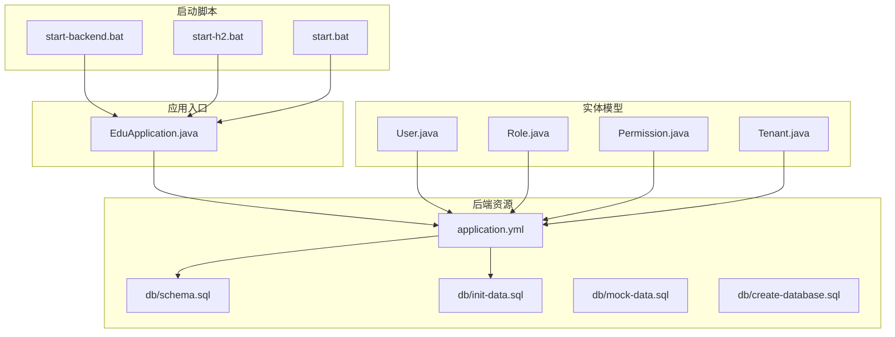
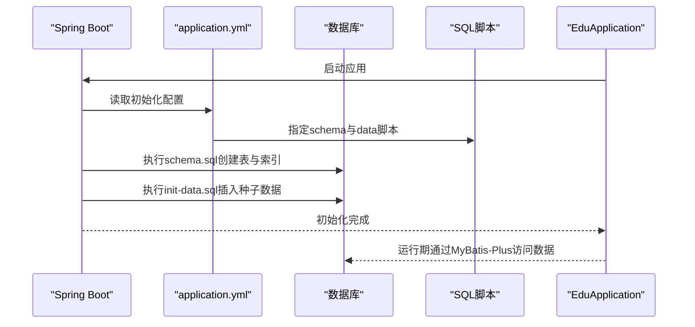
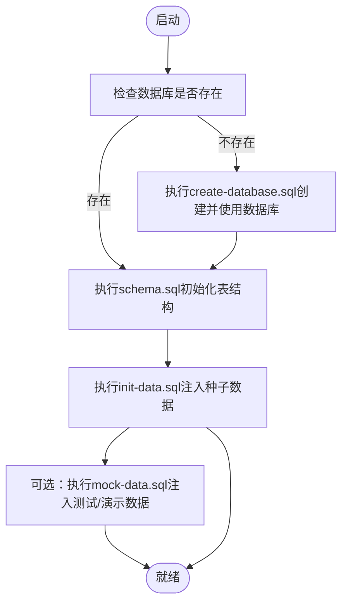
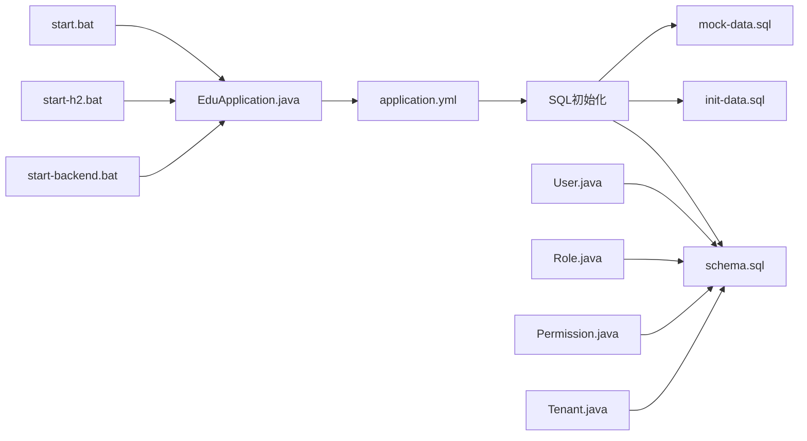

# 数据初始化与管理

<cite>
**本文引用的文件**
- [schema.sql](file://backend/src/main/resources/db/schema.sql)
- [init-data.sql](file://backend/src/main/resources/db/init-data.sql)
- [mock-data.sql](file://backend/src/main/resources/db/mock-data.sql)
- [create-database.sql](file://backend/src/main/resources/db/create-database.sql)
- [application.yml](file://backend/src/main/resources/application.yml)
- [EduApplication.java](file://backend/src/main/java/com/edu/EduApplication.java)
- [User.java](file://backend/src/main/java/com/edu/user/entity/User.java)
- [Role.java](file://backend/src/main/java/com/edu/user/entity/Role.java)
- [Permission.java](file://backend/src/main/java/com/edu/user/entity/Permission.java)
- [Tenant.java](file://backend/src/main/java/com/edu/tenant/entity/Tenant.java)
- [pom.xml](file://backend/pom.xml)
- [INSTALL.md](file://INSTALL.md)
- [start-backend.bat](file://start-backend.bat)
- [start-h2.bat](file://backend/start-h2.bat)
- [start.bat](file://backend/start.bat)
</cite>

## 目录
1. [简介](#简介)
2. [项目结构](#项目结构)
3. [核心组件](#核心组件)
4. [架构总览](#架构总览)
5. [详细组件分析](#详细组件分析)
6. [依赖分析](#依赖分析)
7. [性能考虑](#性能考虑)
8. [故障排查指南](#故障排查指南)
9. [结论](#结论)
10. [附录](#附录)

## 简介
本文件系统性阐述本教育平台的数据初始化与管理策略，覆盖数据库初始化、基础/测试/演示数据管理、数据种子设计与维护、迁移与版本管理、备份恢复与同步方案，以及数据质量与一致性保障方法。文档基于仓库中的数据库脚本、Spring Boot 配置与实体模型进行归纳总结，并提供可视化图示帮助理解。

## 项目结构
后端通过 Spring Boot 的 SQL 初始化机制加载数据库结构与种子数据；数据库脚本位于 resources/db 目录，应用配置位于 application.yml。启动脚本支持本地 MySQL 与 H2 内嵌数据库两种模式。

**图表来源**
- [application.yml:1-65](file://backend/src/main/resources/application.yml#L1-L65)
- [schema.sql:1-379](file://backend/src/main/resources/db/schema.sql#L1-L379)
- [init-data.sql:1-89](file://backend/src/main/resources/db/init-data.sql#L1-L89)
- [mock-data.sql:1-86](file://backend/src/main/resources/db/mock-data.sql#L1-L86)
- [create-database.sql:1-7](file://backend/src/main/resources/db/create-database.sql#L1-L7)
- [EduApplication.java:1-15](file://backend/src/main/java/com/edu/EduApplication.java#L1-L15)
- [User.java:1-21](file://backend/src/main/java/com/edu/user/entity/User.java#L1-L21)
- [Role.java:1-18](file://backend/src/main/java/com/edu/user/entity/Role.java#L1-L18)
- [Permission.java:1-18](file://backend/src/main/java/com/edu/user/entity/Permission.java#L1-L18)
- [Tenant.java:1-21](file://backend/src/main/java/com/edu/tenant/entity/Tenant.java#L1-L21)
- [start-backend.bat:1-40](file://start-backend.bat#L1-L40)
- [start-h2.bat:1-12](file://backend/start-h2.bat#L1-L12)
- [start.bat:1-15](file://backend/start.bat#L1-L15)

**章节来源**
- [application.yml:1-65](file://backend/src/main/resources/application.yml#L1-L65)
- [schema.sql:1-379](file://backend/src/main/resources/db/schema.sql#L1-L379)
- [init-data.sql:1-89](file://backend/src/main/resources/db/init-data.sql#L1-L89)
- [mock-data.sql:1-86](file://backend/src/main/resources/db/mock-data.sql#L1-L86)
- [create-database.sql:1-7](file://backend/src/main/resources/db/create-database.sql#L1-L7)
- [EduApplication.java:1-15](file://backend/src/main/java/com/edu/EduApplication.java#L1-L15)
- [start-backend.bat:1-40](file://start-backend.bat#L1-L40)
- [start-h2.bat:1-12](file://backend/start-h2.bat#L1-L12)
- [start.bat:1-15](file://backend/start.bat#L1-L15)

## 核心组件
- 数据库初始化策略
  - 结构初始化：通过 schema.sql 在应用启动时创建所有表与索引。
  - 数据初始化：通过 init-data.sql 注入默认租户、学校、年级、班级、角色、权限、管理员账户、题库、示例题目、模板与示例学生等。
  - 测试/演示数据：通过 mock-data.sql 提供多租户、多学校、多年级、多班级与大量学生数据，便于功能与性能验证。
  - 数据库创建：create-database.sql 负责创建数据库与切换使用。
- Spring Boot 初始化配置
  - application.yml 中启用 SQL 初始化，指定 schema 与 data 脚本位置，失败即停止，确保环境一致性。
- 实体模型映射
  - User/Role/Permission/Tenant 等实体映射至对应表，支撑权限与租户体系的初始化与运行期使用。
- 启动与运行模式
  - 支持 MySQL 与 H2 两种模式，H2 模式便于本地开发与测试，MySQL 模式用于生产或集成测试。

**章节来源**
- [schema.sql:1-379](file://backend/src/main/resources/db/schema.sql#L1-L379)
- [init-data.sql:1-89](file://backend/src/main/resources/db/init-data.sql#L1-L89)
- [mock-data.sql:1-86](file://backend/src/main/resources/db/mock-data.sql#L1-L86)
- [create-database.sql:1-7](file://backend/src/main/resources/db/create-database.sql#L1-L7)
- [application.yml:8-14](file://backend/src/main/resources/application.yml#L8-L14)
- [User.java:1-21](file://backend/src/main/java/com/edu/user/entity/User.java#L1-L21)
- [Role.java:1-18](file://backend/src/main/java/com/edu/user/entity/Role.java#L1-L18)
- [Permission.java:1-18](file://backend/src/main/java/com/edu/user/entity/Permission.java#L1-L18)
- [Tenant.java:1-21](file://backend/src/main/java/com/edu/tenant/entity/Tenant.java#L1-L21)
- [start-h2.bat:1-12](file://backend/start-h2.bat#L1-L12)

## 架构总览
下图展示从应用启动到数据库初始化、数据注入与实体映射的整体流程。

**图表来源**
- [application.yml:8-14](file://backend/src/main/resources/application.yml#L8-L14)
- [schema.sql:1-379](file://backend/src/main/resources/db/schema.sql#L1-L379)
- [init-data.sql:1-89](file://backend/src/main/resources/db/init-data.sql#L1-L89)
- [EduApplication.java:1-15](file://backend/src/main/java/com/edu/EduApplication.java#L1-L15)

## 详细组件分析

### 数据库初始化策略
- 结构初始化
  - schema.sql 定义了租户、学校、用户、角色、权限、组织架构、题库、试卷、批改、PPT 等完整业务表结构与索引，确保运行期查询效率与约束完整性。
- 数据初始化
  - init-data.sql 注入默认租户、学校、年级、班级、角色、权限、管理员账户、题库、示例题目、模板与示例学生，形成最小可用系统。
- 测试/演示数据
  - mock-data.sql 提供多租户、多学校、多年级、多班级与大量学生数据，便于性能与功能验证。
- 数据库创建
  - create-database.sql 负责创建数据库并切换到该库，避免手动干预。

**图表来源**
- [create-database.sql:1-7](file://backend/src/main/resources/db/create-database.sql#L1-L7)
- [schema.sql:1-379](file://backend/src/main/resources/db/schema.sql#L1-L379)
- [init-data.sql:1-89](file://backend/src/main/resources/db/init-data.sql#L1-L89)
- [mock-data.sql:1-86](file://backend/src/main/resources/db/mock-data.sql#L1-L86)

**章节来源**
- [schema.sql:1-379](file://backend/src/main/resources/db/schema.sql#L1-L379)
- [init-data.sql:1-89](file://backend/src/main/resources/db/init-data.sql#L1-L89)
- [mock-data.sql:1-86](file://backend/src/main/resources/db/mock-data.sql#L1-L86)
- [create-database.sql:1-7](file://backend/src/main/resources/db/create-database.sql#L1-L7)

### 数据种子文件设计与维护策略
- 设计原则
  - 唯一性：通过唯一索引与编码确保租户、角色、权限等关键对象不重复。
  - 可扩展性：为不同租户保留独立命名空间，避免冲突。
  - 可追溯性：记录创建人、创建时间、更新时间，便于审计。
- 维护建议
  - 版本化：每次变更在脚本中添加注释与版本标记，便于回溯。
  - 分层注入：先结构后数据，先基础后演示，保证依赖顺序。
  - 安全性：敏感信息（如密码）采用安全存储策略，避免明文泄露。
  - 自动化：结合 CI/CD 在新环境自动执行初始化脚本。

**章节来源**
- [schema.sql:1-379](file://backend/src/main/resources/db/schema.sql#L1-L379)
- [init-data.sql:1-89](file://backend/src/main/resources/db/init-data.sql#L1-L89)
- [mock-data.sql:1-86](file://backend/src/main/resources/db/mock-data.sql#L1-L86)

### 数据迁移与版本管理策略
- 结构变更
  - 建议将结构变更拆分为增量脚本，按版本号命名，按顺序执行。
  - 在 schema.sql 中仅保留最新稳定结构，历史变更保留在独立脚本目录。
- 数据迁移
  - 大规模数据迁移应分批次执行，配合事务与回滚点，确保一致性。
  - 迁移前备份，迁移后校验，记录迁移日志与影响范围。
- 最佳实践
  - 引入数据库版本控制工具（如 Flyway/Liquibase），实现可追踪、可回滚的迁移。
  - 在测试环境先行验证，再推广到预生产与生产。

[本节为通用实践指导，无需特定文件引用]

### 备份、恢复与同步实施方案
- 备份
  - 全量备份：定期导出数据库快照，保存到安全位置。
  - 增量备份：针对高频变更表进行增量备份，缩短恢复时间。
- 恢复
  - 恢复流程需包含：停止服务、导入备份、执行结构/数据补丁、启动服务、健康检查。
  - 验证数据一致性与完整性，确保业务功能正常。
- 同步
  - 跨环境同步：通过标准化脚本与自动化工具，确保开发、测试、生产环境一致。
  - 跨实例同步：使用数据库主从复制或集群方案，保证高可用与灾备。

[本节为通用实践指导，无需特定文件引用]

### 数据质量保证与一致性维护
- 约束与索引
  - 利用唯一索引、外键与非空约束，从底层保证数据完整性。
  - 合理建立索引，平衡查询性能与写入开销。
- 业务规则
  - 在实体层与服务层增加校验逻辑，防止脏数据进入数据库。
- 日志与监控
  - 记录关键操作日志，结合监控告警，及时发现异常。
- 定期巡检
  - 定期清理无效数据、重建索引、优化慢查询。

**章节来源**
- [schema.sql:300-379](file://backend/src/main/resources/db/schema.sql#L300-L379)

## 依赖分析
- Spring Boot 初始化链路
  - application.yml 指定 SQL 初始化模式与脚本位置，确保 schema 与 data 有序执行。
- 实体与表映射
  - User/Role/Permission/Tenant 等实体映射到 sys_user、role、permission、tenant 等表，支撑权限与租户体系。
- 启动脚本与运行模式
  - start-backend.bat 依赖本地 MySQL；start-h2.bat 与 start.bat 通过 H2 Profile 进行本地开发与测试。

**图表来源**
- [application.yml:8-14](file://backend/src/main/resources/application.yml#L8-L14)
- [schema.sql:1-379](file://backend/src/main/resources/db/schema.sql#L1-L379)
- [init-data.sql:1-89](file://backend/src/main/resources/db/init-data.sql#L1-L89)
- [mock-data.sql:1-86](file://backend/src/main/resources/db/mock-data.sql#L1-L86)
- [EduApplication.java:1-15](file://backend/src/main/java/com/edu/EduApplication.java#L1-L15)
- [User.java:1-21](file://backend/src/main/java/com/edu/user/entity/User.java#L1-L21)
- [Role.java:1-18](file://backend/src/main/java/com/edu/user/entity/Role.java#L1-L18)
- [Permission.java:1-18](file://backend/src/main/java/com/edu/user/entity/Permission.java#L1-L18)
- [Tenant.java:1-21](file://backend/src/main/java/com/edu/tenant/entity/Tenant.java#L1-L21)
- [start-backend.bat:1-40](file://start-backend.bat#L1-L40)
- [start-h2.bat:1-12](file://backend/start-h2.bat#L1-L12)
- [start.bat:1-15](file://backend/start.bat#L1-L15)

**章节来源**
- [application.yml:8-14](file://backend/src/main/resources/application.yml#L8-L14)
- [EduApplication.java:1-15](file://backend/src/main/java/com/edu/EduApplication.java#L1-L15)
- [User.java:1-21](file://backend/src/main/java/com/edu/user/entity/User.java#L1-L21)
- [Role.java:1-18](file://backend/src/main/java/com/edu/user/entity/Role.java#L1-L18)
- [Permission.java:1-18](file://backend/src/main/java/com/edu/user/entity/Permission.java#L1-L18)
- [Tenant.java:1-21](file://backend/src/main/java/com/edu/tenant/entity/Tenant.java#L1-L21)
- [start-backend.bat:1-40](file://start-backend.bat#L1-L40)
- [start-h2.bat:1-12](file://backend/start-h2.bat#L1-L12)
- [start.bat:1-15](file://backend/start.bat#L1-L15)

## 性能考虑
- 索引策略
  - schema.sql 已为关键字段建立索引，建议根据实际查询模式持续优化。
- 查询与写入
  - 对高频查询字段建立复合索引，减少全表扫描。
- 连接池
  - application.yml 中配置了 Hikari 连接池参数，可根据并发需求调整。
- 测试数据规模
  - mock-data.sql 提供大规模数据，可用于性能压测与索引优化验证。

**章节来源**
- [schema.sql:300-379](file://backend/src/main/resources/db/schema.sql#L300-L379)
- [application.yml:20-25](file://backend/src/main/resources/application.yml#L20-L25)
- [mock-data.sql:1-86](file://backend/src/main/resources/db/mock-data.sql#L1-L86)

## 故障排查指南
- 初始化失败
  - 检查 application.yml 中 SQL 初始化配置是否正确，确认 schema-locations 与 data-locations 指向的脚本路径。
  - 若 continue-on-error: false，任一脚本报错会导致初始化中断，需逐个修复。
- 数据库连接问题
  - 确认数据库服务已启动，连接参数（URL、用户名、密码）正确。
  - 如使用 H2 模式，确保启动脚本正确激活 h2 profile。
- 启动脚本问题
  - start-backend.bat 依赖本地 MySQL；若未准备数据库，先执行 create-database.sql 与 schema.sql，再执行 init-data.sql。
  - start-h2.bat 与 start.bat 适用于本地开发与测试场景。

**章节来源**
- [application.yml:8-14](file://backend/src/main/resources/application.yml#L8-L14)
- [create-database.sql:1-7](file://backend/src/main/resources/db/create-database.sql#L1-L7)
- [start-backend.bat:1-40](file://start-backend.bat#L1-L40)
- [start-h2.bat:1-12](file://backend/start-h2.bat#L1-L12)
- [start.bat:1-15](file://backend/start.bat#L1-L15)

## 结论
本项目通过标准化的数据库脚本与 Spring Boot 初始化机制，实现了从零到一的快速可用部署。结合实体模型映射与多环境启动脚本，既满足本地开发需求，也便于在生产环境落地。建议在后续演进中引入数据库版本控制工具与自动化运维流程，进一步提升数据治理能力与交付效率。

## 附录
- 安装与启动参考
  - INSTALL.md 提供了完整的安装步骤、数据库初始化命令与默认登录信息，可作为部署参考。
- 依赖与构建
  - pom.xml 定义了项目依赖与构建插件，确保编译与打包流程稳定。

**章节来源**
- [INSTALL.md:1-134](file://INSTALL.md#L1-L134)
- [pom.xml:1-152](file://backend/pom.xml#L1-L152)