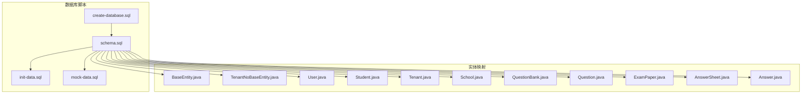
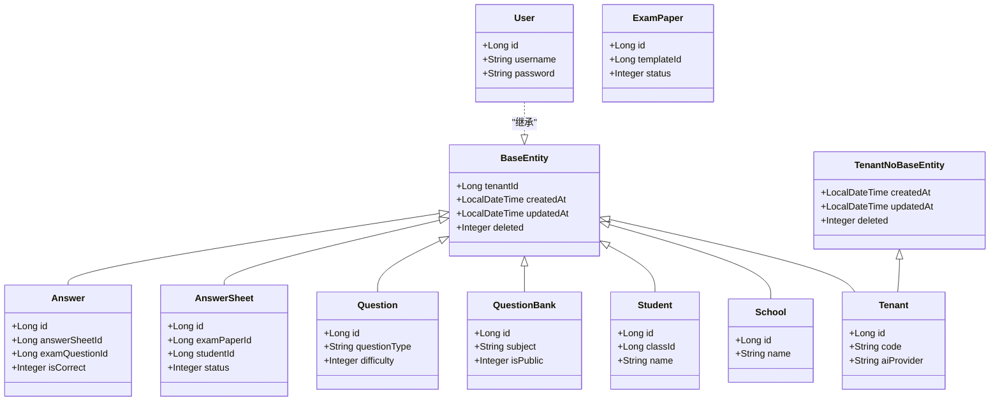

# 数据库设计

<cite>
**本文引用的文件**
- [schema.sql](file://backend/src/main/resources/db/schema.sql)
- [init-data.sql](file://backend/src/main/resources/db/init-data.sql)
- [mock-data.sql](file://backend/src/main/resources/db/mock-data.sql)
- [create-database.sql](file://backend/src/main/resources/db/create-database.sql)
- [BaseEntity.java](file://backend/src/main/java/com/edu/common/entity/BaseEntity.java)
- [TenantNoBaseEntity.java](file://backend/src/main/java/com/edu/common/entity/TenantNoBaseEntity.java)
- [User.java](file://backend/src/main/java/com/edu/user/entity/User.java)
- [Student.java](file://backend/src/main/java/com/edu/user/entity/Student.java)
- [Tenant.java](file://backend/src/main/java/com/edu/tenant/entity/Tenant.java)
- [School.java](file://backend/src/main/java/com/edu/tenant/entity/School.java)
- [QuestionBank.java](file://backend/src/main/java/com/edu/exam/entity/QuestionBank.java)
- [Question.java](file://backend/src/main/java/com/edu/exam/entity/Question.java)
- [ExamPaper.java](file://backend/src/main/java/com/edu/exam/entity/ExamPaper.java)
- [AnswerSheet.java](file://backend/src/main/java/com/edu/grading/entity/AnswerSheet.java)
- [Answer.java](file://backend/src/main/java/com/edu/grading/entity/Answer.java)
</cite>

## 目录
1. [简介](#简介)
2. [项目结构](#项目结构)
3. [核心组件](#核心组件)
4. [架构总览](#架构总览)
5. [详细组件分析](#详细组件分析)
6. [依赖分析](#依赖分析)
7. [性能考虑](#性能考虑)
8. [故障排查指南](#故障排查指南)
9. [结论](#结论)
10. [附录](#附录)

## 简介
本文件系统化梳理教育平台项目的数据库设计，覆盖数据库架构、表结构与字段定义、核心实体关系、索引与约束策略、数据初始化与迁移方案，并提供完整的ER图与表结构文档，帮助开发者与运维人员快速理解并维护数据库。

## 项目结构
数据库相关资源集中于后端资源目录的db子目录，包含数据库创建脚本、模式定义、初始化数据与模拟数据；同时，Java实体类映射到对应数据库表，体现ORM层的字段与注解约定。



**图表来源**
- [create-database.sql:1-7](file://backend/src/main/resources/db/create-database.sql#L1-L7)
- [schema.sql:1-379](file://backend/src/main/resources/db/schema.sql#L1-L379)
- [init-data.sql:1-89](file://backend/src/main/resources/db/init-data.sql#L1-L89)
- [mock-data.sql:1-86](file://backend/src/main/resources/db/mock-data.sql#L1-L86)
- [BaseEntity.java:1-38](file://backend/src/main/java/com/edu/common/entity/BaseEntity.java#L1-L38)
- [TenantNoBaseEntity.java:1-23](file://backend/src/main/java/com/edu/common/entity/TenantNoBaseEntity.java#L1-L23)
- [User.java:1-21](file://backend/src/main/java/com/edu/user/entity/User.java#L1-L21)
- [Student.java:1-22](file://backend/src/main/java/com/edu/user/entity/Student.java#L1-L22)
- [Tenant.java:1-21](file://backend/src/main/java/com/edu/tenant/entity/Tenant.java#L1-L21)
- [School.java:1-17](file://backend/src/main/java/com/edu/tenant/entity/School.java#L1-L17)
- [QuestionBank.java:1-20](file://backend/src/main/java/com/edu/exam/entity/QuestionBank.java#L1-L20)
- [Question.java:1-25](file://backend/src/main/java/com/edu/exam/entity/Question.java#L1-L25)
- [ExamPaper.java:1-31](file://backend/src/main/java/com/edu/exam/entity/ExamPaper.java#L1-L31)
- [AnswerSheet.java:1-34](file://backend/src/main/java/com/edu/grading/entity/AnswerSheet.java#L1-L34)
- [Answer.java:1-39](file://backend/src/main/java/com/edu/grading/entity/Answer.java#L1-L39)

**章节来源**
- [create-database.sql:1-7](file://backend/src/main/resources/db/create-database.sql#L1-L7)
- [schema.sql:1-379](file://backend/src/main/resources/db/schema.sql#L1-L379)
- [init-data.sql:1-89](file://backend/src/main/resources/db/init-data.sql#L1-L89)
- [mock-data.sql:1-86](file://backend/src/main/resources/db/mock-data.sql#L1-L86)

## 核心组件
本节从数据库角度概述各模块表及其职责边界：
- 租户模块：tenant、tenant_config、school，负责多租户隔离与学校组织信息。
- 用户模块：sys_user、role、permission、user_role、role_permission，负责用户身份、角色与权限体系。
- 组织架构：grade、class、student，负责年级、班级与学生信息。
- 试卷模块：question_bank、question、exam_template、exam_paper、exam_question，负责题库、题目、模板与试卷编排。
- 批改模块：answer_sheet、answer、score_analysis、student_wrong_question，负责答题卡、答案明细、成绩分析与错题记录。
- PPT模块：ppt_document，负责生成的PPT文档存储。

**章节来源**
- [schema.sql:9-379](file://backend/src/main/resources/db/schema.sql#L9-L379)

## 架构总览
下图展示数据库层面的实体关系与关键外键约束，体现“租户-学校-年级-班级-学生”、“题库-题目”、“模板-试卷-题目-答题卡-答案”的业务闭环。

```mermaid
erDiagram
TENANT {
bigint id PK
varchar code UK
}
SCHOOL {
bigint id PK
bigint tenant_id FK
}
GRADE {
bigint id PK
bigint school_id FK
}
CLASS {
bigint id PK
bigint grade_id FK
}
STUDENT {
bigint id PK
bigint class_id FK
bigint tenant_id FK
}
SYS_USER {
bigint id PK
bigint tenant_id FK
}
ROLE {
bigint id PK
bigint tenant_id FK
}
PERMISSION {
bigint id PK
}
USER_ROLE {
bigint id PK
bigint user_id FK
bigint role_id FK
}
ROLE_PERMISSION {
bigint id PK
bigint role_id FK
bigint permission_id FK
}
QUESTION_BANK {
bigint id PK
bigint tenant_id FK
}
QUESTION {
bigint id PK
bigint bank_id FK
}
EXAM_TEMPLATE {
bigint id PK
bigint tenant_id FK
}
EXAM_PAPER {
bigint id PK
bigint tenant_id FK
bigint template_id FK
}
EXAM_QUESTION {
bigint id PK
bigint exam_paper_id FK
bigint question_id FK
}
ANSWER_SHEET {
bigint id PK
bigint tenant_id FK
bigint exam_paper_id FK
bigint student_id FK
}
ANSWER {
bigint id PK
bigint answer_sheet_id FK
bigint exam_question_id FK
}
SCORE_ANALYSIS {
bigint id PK
bigint exam_paper_id FK
bigint class_id FK
}
STUDENT_WRONG_QUESTION {
bigint id PK
bigint student_id FK
bigint question_id FK
}
PPT_DOCUMENT {
bigint id PK
bigint tenant_id FK
}
TENANT ||--o{ SCHOOL : "拥有"
SCHOOL ||--o{ GRADE : "拥有"
GRADE ||--o{ CLASS : "拥有"
CLASS ||--o{ STUDENT : "拥有"
TENANT ||--o{ SYS_USER : "拥有"
TENANT ||--o{ ROLE : "拥有"
TENANT ||--o{ QUESTION_BANK : "拥有"
TENANT ||--o{ EXAM_TEMPLATE : "拥有"
TENANT ||--o{ EXAM_PAPER : "拥有"
TENANT ||--o{ ANSWER_SHEET : "拥有"
TENANT ||--o{ PPT_DOCUMENT : "拥有"
QUESTION_BANK ||--o{ QUESTION : "包含"
EXAM_TEMPLATE ||--o{ EXAM_PAPER : "生成"
EXAM_PAPER ||--o{ EXAM_QUESTION : "包含"
EXAM_QUESTION ||--o{ QUESTION : "引用"
STUDENT ||--o{ ANSWER_SHEET : "作答"
EXAM_PAPER ||--o{ ANSWER_SHEET : "发布"
ANSWER_SHEET ||--o{ ANSWER : "包含"
ANSWER ||--|| EXAM_QUESTION : "对应"
STUDENT ||--o{ STUDENT_WRONG_QUESTION : "产生"
QUESTION ||--o{ STUDENT_WRONG_QUESTION : "被错"
```

**图表来源**
- [schema.sql:9-379](file://backend/src/main/resources/db/schema.sql#L9-L379)

## 详细组件分析

### 表：租户与组织（tenant、school、grade、class、student）
- 设计要点
  - 多租户隔离：所有业务表均包含tenant_id字段，配合实体基类统一处理。
  - 组织层级：school → grade → class → student，逐级细化。
  - 学生扩展：student支持user_id关联系统用户，实现账号与档案分离。
- 字段与约束
  - 唯一性：tenant.code、sys_user.username、student.student_no。
  - 约束：status、deleted（逻辑删除）、created_at/updated_at自动填充。
- 索引策略
  - 对外键列建立普通索引，支撑查询与连接性能。

**章节来源**
- [schema.sql:9-146](file://backend/src/main/resources/db/schema.sql#L9-L146)
- [BaseEntity.java:11-37](file://backend/src/main/java/com/edu/common/entity/BaseEntity.java#L11-L37)
- [TenantNoBaseEntity.java:11-22](file://backend/src/main/java/com/edu/common/entity/TenantNoBaseEntity.java#L11-L22)
- [Student.java:12-21](file://backend/src/main/java/com/edu/user/entity/Student.java#L12-L21)
- [User.java:10-20](file://backend/src/main/java/com/edu/user/entity/User.java#L10-L20)

### 表：用户与权限（sys_user、role、permission、user_role、role_permission）
- 设计要点
  - 用户-角色-权限三层模型，支持细粒度授权。
  - 系统级权限不绑定租户，便于跨租户控制。
- 字段与约束
  - 唯一性：uk_tenant_username、uk_code、uk_user_role、uk_role_perm。
  - 安全：密码采用BCrypt加密存储。
- 索引策略
  - 对user_id、role_id建立唯一索引，避免重复绑定。

**章节来源**
- [schema.sql:47-104](file://backend/src/main/resources/db/schema.sql#L47-L104)
- [init-data.sql:49-56](file://backend/src/main/resources/db/init-data.sql#L49-L56)

### 表：题库与题目（question_bank、question）
- 设计要点
  - 题库按学科与年级划分，支持公开/私有策略。
  - 题目支持多种题型、难度、知识点标签与来源标记。
- 字段与约束
  - JSON字段存储options、knowledge_points，便于灵活扩展。
  - created_by追踪创建者。
- 索引策略
  - bank_id建立索引，支撑题库维度查询。

**章节来源**
- [schema.sql:152-184](file://backend/src/main/resources/db/schema.sql#L152-L184)
- [QuestionBank.java:10-19](file://backend/src/main/java/com/edu/exam/entity/QuestionBank.java#L10-L19)
- [Question.java:8-24](file://backend/src/main/java/com/edu/exam/entity/Question.java#L8-L24)

### 表：模板与试卷（exam_template、exam_paper、exam_question）
- 设计要点
  - exam_template定义试卷结构与分值配置，支持JSON结构化描述。
  - exam_paper基于模板生成具体试卷，记录状态与发布时间。
  - exam_question维护试卷与题目的关联与顺序、分值。
- 字段与约束
  - 唯一性：uk_exam_question（同一试卷内题目序号唯一）。
  - 状态机：exam_paper.status表示草稿/发布/考试中/结束/批改完成。
- 索引策略
  - 多列组合索引支撑模板-试卷、试卷-题目的高效检索。

**章节来源**
- [schema.sql:186-229](file://backend/src/main/resources/db/schema.sql#L186-L229)
- [ExamPaper.java:16-30](file://backend/src/main/java/com/edu/exam/entity/ExamPaper.java#L16-L30)

### 表：答题与批改（answer_sheet、answer、score_analysis、student_wrong_question）
- 设计要点
  - answer_sheet记录学生作答状态、总分与批改信息。
  - answer记录每题得分，支持AI评分与人工评分双通道。
  - score_analysis按班级统计平均分、及格率等指标。
  - student_wrong_question记录错题与纠错时间。
- 字段与约束
  - 唯一性：uk_exam_student、uk_sheet_question、uk_exam_class、uk_student_question。
  - 时间戳：submit_time、graded_at、last_wrong_at等。
- 索引策略
  - 覆盖答题卡与答案的高频查询路径。

**章节来源**
- [schema.sql:235-297](file://backend/src/main/resources/db/schema.sql#L235-L297)
- [AnswerSheet.java:16-33](file://backend/src/main/java/com/edu/grading/entity/AnswerSheet.java#L16-L33)
- [Answer.java:13-38](file://backend/src/main/java/com/edu/grading/entity/Answer.java#L13-L38)

### 表：PPT文档（ppt_document）
- 设计要点
  - 支持JSON内容存储与文件路径记录，便于生成与回放。
- 索引策略
  - tenant_id索引支撑租户维度查询。

**章节来源**
- [schema.sql:361-375](file://backend/src/main/resources/db/schema.sql#L361-L375)

### 索引与约束策略
- 主键与自增：所有表主键为自增BIGINT，确保全局唯一。
- 外键：通过逻辑外键与业务约束保证参照完整性（如exam_paper.template_id）。
- 唯一约束：多处uk_前缀唯一键保障业务唯一性。
- 性能索引：对所有外键列建立普通索引，覆盖高频查询路径。
- 逻辑删除：统一deleted字段，结合MyBatis-Plus逻辑删除插件。

**章节来源**
- [schema.sql:9-379](file://backend/src/main/resources/db/schema.sql#L9-L379)
- [BaseEntity.java:34-36](file://backend/src/main/java/com/edu/common/entity/BaseEntity.java#L34-L36)

### 数据初始化策略
- 默认租户与学校：创建默认租户与学校，便于本地开发环境快速启动。
- 角色与权限：内置ADMIN/TEACHER/STUDENT角色与常用权限，支持快速授权。
- 示例数据：题库、题目、模板、学生与错题记录，支撑功能演示与测试。
- 模拟数据：批量生成多租户、学校、年级、班级与学生数据，满足压力测试与演示场景。

**章节来源**
- [init-data.sql:5-89](file://backend/src/main/resources/db/init-data.sql#L5-L89)
- [mock-data.sql:10-85](file://backend/src/main/resources/db/mock-data.sql#L10-L85)

### 数据迁移与版本管理
- 迁移流程建议
  - 数据库：以create-database.sql创建数据库，schema.sql定义完整结构，后续变更以ALTER语句补充。
  - 初始化：先执行schema.sql，再执行init-data.sql或mock-data.sql。
  - 版本控制：将每次结构变更与数据变更脚本纳入版本管理，命名规范如 v1.0.0_schema.sql、v1.0.0_init.sql。
- 安全与回滚
  - 变更前备份，变更后验证索引与约束有效性。
  - 逻辑删除与软删除策略确保历史数据可追溯。

**章节来源**
- [create-database.sql:1-7](file://backend/src/main/resources/db/create-database.sql#L1-L7)
- [schema.sql:1-379](file://backend/src/main/resources/db/schema.sql#L1-L379)
- [init-data.sql:1-89](file://backend/src/main/resources/db/init-data.sql#L1-L89)
- [mock-data.sql:1-86](file://backend/src/main/resources/db/mock-data.sql#L1-L86)

## 依赖分析
- ORM映射关系
  - 实体类通过@TableName标注与数据库表一一对应，字段命名遵循驼峰与下划线映射规则。
  - BaseEntity与TenantNoBaseEntity提供统一的租户隔离、时间戳与逻辑删除能力。
- 外键依赖链
  - 组织链：school → grade → class → student
  - 业务链：question_bank → question；exam_template → exam_paper → exam_question → answer_sheet → answer
  - 权限链：role → role_permission → permission；user → user_role → role



**图表来源**
- [BaseEntity.java:11-37](file://backend/src/main/java/com/edu/common/entity/BaseEntity.java#L11-L37)
- [TenantNoBaseEntity.java:11-22](file://backend/src/main/java/com/edu/common/entity/TenantNoBaseEntity.java#L11-L22)
- [Tenant.java:12-20](file://backend/src/main/java/com/edu/tenant/entity/Tenant.java#L12-L20)
- [School.java:11-16](file://backend/src/main/java/com/edu/tenant/entity/School.java#L11-L16)
- [User.java:10-20](file://backend/src/main/java/com/edu/user/entity/User.java#L10-L20)
- [Student.java:12-21](file://backend/src/main/java/com/edu/user/entity/Student.java#L12-L21)
- [QuestionBank.java:10-19](file://backend/src/main/java/com/edu/exam/entity/QuestionBank.java#L10-L19)
- [Question.java:8-24](file://backend/src/main/java/com/edu/exam/entity/Question.java#L8-L24)
- [ExamPaper.java:16-30](file://backend/src/main/java/com/edu/exam/entity/ExamPaper.java#L16-L30)
- [AnswerSheet.java:16-33](file://backend/src/main/java/com/edu/grading/entity/AnswerSheet.java#L16-L33)
- [Answer.java:13-38](file://backend/src/main/java/com/edu/grading/entity/Answer.java#L13-L38)

**章节来源**
- [BaseEntity.java:11-37](file://backend/src/main/java/com/edu/common/entity/BaseEntity.java#L11-L37)
- [TenantNoBaseEntity.java:11-22](file://backend/src/main/java/com/edu/common/entity/TenantNoBaseEntity.java#L11-L22)
- [User.java:10-20](file://backend/src/main/java/com/edu/user/entity/User.java#L10-L20)
- [Student.java:12-21](file://backend/src/main/java/com/edu/user/entity/Student.java#L12-L21)
- [QuestionBank.java:10-19](file://backend/src/main/java/com/edu/exam/entity/QuestionBank.java#L10-L19)
- [Question.java:8-24](file://backend/src/main/java/com/edu/exam/entity/Question.java#L8-L24)
- [ExamPaper.java:16-30](file://backend/src/main/java/com/edu/exam/entity/ExamPaper.java#L16-L30)
- [AnswerSheet.java:16-33](file://backend/src/main/java/com/edu/grading/entity/AnswerSheet.java#L16-L33)
- [Answer.java:13-38](file://backend/src/main/java/com/edu/grading/entity/Answer.java#L13-L38)

## 性能考虑
- 索引覆盖
  - 对外键列建立普通索引，减少连接与过滤成本。
  - 联合唯一索引uk_exam_question、uk_exam_student、uk_sheet_question、uk_exam_class、uk_student_question，避免重复与提升查询稳定性。
- 查询路径
  - 典型路径：题库-题目、模板-试卷-题目-答题卡-答案，围绕这些路径建立索引与限制JOIN深度。
- 写入优化
  - 使用逻辑删除替代物理删除，降低碎片化与锁竞争。
- 存储格式
  - JSON字段用于灵活结构（如options、knowledge_points），注意查询时避免全表扫描，必要时引入虚拟列或二级索引。

[本节为通用指导，无需列出具体文件来源]

## 故障排查指南
- 常见问题
  - 重复唯一键冲突：检查uk_tenant_username、uk_user_role、uk_role_perm、uk_exam_question、uk_exam_student、uk_sheet_question、uk_exam_class、uk_student_question。
  - 外键无效：确认关联表数据存在且未被逻辑删除。
  - 索引缺失导致慢查询：针对高频WHERE/JOIN列补充索引。
- 排查步骤
  - 使用EXPLAIN分析SQL执行计划，定位索引使用情况。
  - 核对初始化数据是否完整加载（租户、角色、权限、题库、题目、模板、学生）。
  - 检查逻辑删除字段deleted是否影响查询结果。

**章节来源**
- [schema.sql:29-379](file://backend/src/main/resources/db/schema.sql#L29-L379)
- [init-data.sql:5-89](file://backend/src/main/resources/db/init-data.sql#L5-L89)

## 结论
该数据库设计以多租户为核心，围绕“组织-题库-试卷-答题-批改”形成完整闭环，通过统一的实体基类与逻辑删除策略实现租户隔离与数据安全，配合完善的索引与约束保障性能与一致性。初始化与模拟数据脚本降低了环境搭建与测试门槛，迁移与版本管理策略确保演进可控。

[本节为总结性内容，无需列出具体文件来源]

## 附录

### 表结构与字段说明（按模块）

- 租户模块
  - tenant
    - 字段：id、name、code（唯一）、ai_provider、ai_config、status、expire_date、created_at、updated_at
    - 业务含义：多租户根实体，标识学校/机构
  - tenant_config
    - 字段：id、tenant_id、config_key、config_value、created_at
    - 业务含义：租户配置项，键值对存储
  - school
    - 字段：id、tenant_id、name、address、contact_phone、created_at、updated_at
    - 业务含义：学校实体，归属租户

- 用户模块
  - sys_user
    - 字段：id、tenant_id、username（唯一）、password、real_name、email、phone、avatar、status、deleted、created_at、updated_at
    - 业务含义：系统用户，支持账号登录
  - role
    - 字段：id、tenant_id、name、code（唯一）、description、created_at、updated_at、deleted
    - 业务含义：角色定义
  - permission
    - 字段：id、code（唯一）、name、resource、action、created_at
    - 业务含义：系统级权限
  - user_role
    - 字段：id、user_id、role_id、created_at
    - 业务含义：用户-角色关联
  - role_permission
    - 字段：id、role_id、permission_id、created_at
    - 业务含义：角色-权限关联

- 组织架构
  - grade
    - 字段：id、school_id、name、level、sequence、created_at
    - 业务含义：年级，归属学校
  - class
    - 字段：id、grade_id、name、teacher_id、student_count、created_at、updated_at
    - 业务含义：班级，归属年级
  - student
    - 字段：id、tenant_id、class_id、user_id、name、student_no（唯一）、gender、birth_date、status、deleted、created_at、updated_at
    - 业务含义：学生档案，可关联用户账号

- 试卷模块
  - question_bank
    - 字段：id、tenant_id、name、subject、grade_level、description、is_public、deleted、created_by、created_at、updated_at
    - 业务含义：题库，按学科与年级划分
  - question
    - 字段：id、bank_id、subject、question_type、difficulty、content、options（JSON）、answer、answer_analysis、knowledge_points（JSON）、source、deleted、created_by、created_at、updated_at
    - 业务含义：题目，支持多种题型与知识点
  - exam_template
    - 字段：id、tenant_id、name、subject、total_score、time_limit、structure（JSON）、deleted、created_by、created_at、updated_at
    - 业务含义：试卷模板，结构化配置
  - exam_paper
    - 字段：id、tenant_id、template_id、title、subject、grade_id、class_id、total_score、time_limit、status、deleted、created_by、created_at、published_at、updated_at
    - 业务含义：具体试卷，状态机驱动
  - exam_question
    - 字段：id、exam_paper_id、question_id、sequence、score、created_at
    - 业务含义：试卷-题目关联，记录顺序与分值

- 批改模块
  - answer_sheet
    - 字段：id、tenant_id、exam_paper_id、student_id、status、total_score、submit_time、grading_time、graded_by、deleted、created_at、updated_at
    - 业务含义：答题卡，记录作答与批改状态
  - answer
    - 字段：id、answer_sheet_id、exam_question_id、student_answer、is_correct、score、ai_score、manual_score、ai_analysis、graded_at、created_at、updated_at
    - 业务含义：答题详情，支持AI与人工评分
  - score_analysis
    - 字段：id、exam_paper_id、class_id、avg_score、max_score、min_score、pass_rate、excellent_rate、question_analysis（JSON）、created_at、updated_at
    - 业务含义：班级维度成绩分析
  - student_wrong_question
    - 字段：id、student_id、question_id、exam_paper_id、wrong_count、last_wrong_at、corrected_at、created_at、updated_at
    - 业务含义：错题记录，支持纠错追踪

- PPT模块
  - ppt_document
    - 字段：id、tenant_id、title、subject、template_type、content_json（JSON）、file_path、page_count、created_by、deleted、created_at、updated_at
    - 业务含义：生成的PPT文档

**章节来源**
- [schema.sql:9-379](file://backend/src/main/resources/db/schema.sql#L9-L379)
- [User.java:10-20](file://backend/src/main/java/com/edu/user/entity/User.java#L10-L20)
- [Student.java:12-21](file://backend/src/main/java/com/edu/user/entity/Student.java#L12-L21)
- [Tenant.java:12-20](file://backend/src/main/java/com/edu/tenant/entity/Tenant.java#L12-L20)
- [School.java:11-16](file://backend/src/main/java/com/edu/tenant/entity/School.java#L11-L16)
- [QuestionBank.java:10-19](file://backend/src/main/java/com/edu/exam/entity/QuestionBank.java#L10-L19)
- [Question.java:8-24](file://backend/src/main/java/com/edu/exam/entity/Question.java#L8-L24)
- [ExamPaper.java:16-30](file://backend/src/main/java/com/edu/exam/entity/ExamPaper.java#L16-L30)
- [AnswerSheet.java:16-33](file://backend/src/main/java/com/edu/grading/entity/AnswerSheet.java#L16-L33)
- [Answer.java:13-38](file://backend/src/main/java/com/edu/grading/entity/Answer.java#L13-L38)