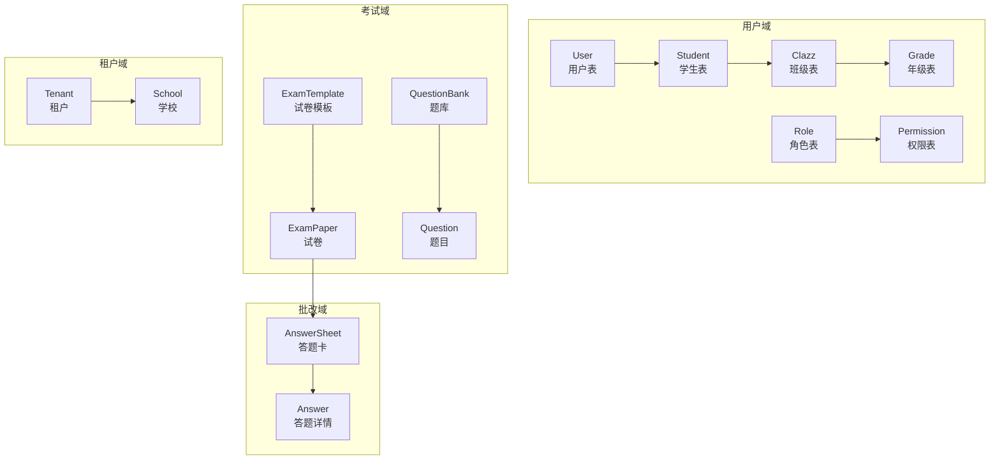
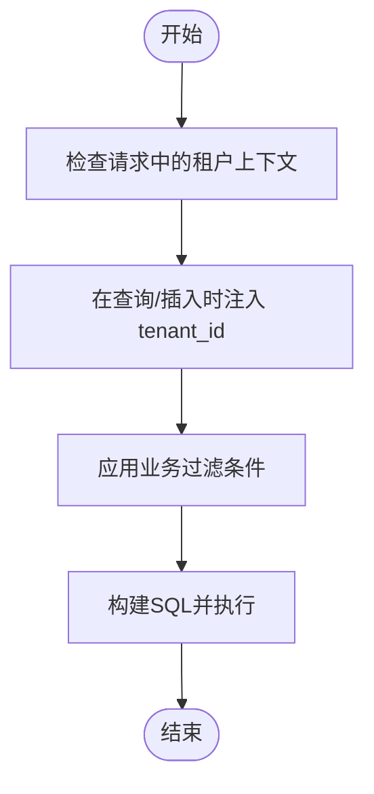

# 核心业务表结构

<cite>
**本文引用的文件**
- [User.java](file://backend/src/main/java/com/edu/user/entity/User.java)
- [Student.java](file://backend/src/main/java/com/edu/user/entity/Student.java)
- [Clazz.java](file://backend/src/main/java/com/edu/user/entity/Clazz.java)
- [Grade.java](file://backend/src/main/java/com/edu/user/entity/Grade.java)
- [Role.java](file://backend/src/main/java/com/edu/user/entity/Role.java)
- [Permission.java](file://backend/src/main/java/com/edu/user/entity/Permission.java)
- [ExamTemplate.java](file://backend/src/main/java/com/edu/exam/entity/ExamTemplate.java)
- [ExamPaper.java](file://backend/src/main/java/com/edu/exam/entity/ExamPaper.java)
- [Question.java](file://backend/src/main/java/com/edu/exam/entity/Question.java)
- [QuestionBank.java](file://backend/src/main/java/com/edu/exam/entity/QuestionBank.java)
- [AnswerSheet.java](file://backend/src/main/java/com/edu/grading/entity/AnswerSheet.java)
- [Answer.java](file://backend/src/main/java/com/edu/grading/entity/Answer.java)
- [Tenant.java](file://backend/src/main/java/com/edu/tenant/entity/Tenant.java)
- [School.java](file://backend/src/main/java/com/edu/tenant/entity/School.java)
- [BaseEntity.java](file://backend/src/main/java/com/edu/common/entity/BaseEntity.java)
- [TenantNoBaseEntity.java](file://backend/src/main/java/com/edu/common/entity/TenantNoBaseEntity.java)
</cite>

## 目录
1. [简介](#简介)
2. [项目结构](#项目结构)
3. [核心组件](#核心组件)
4. [架构总览](#架构总览)
5. [详细组件分析](#详细组件分析)
6. [依赖分析](#依赖分析)
7. [性能考虑](#性能考虑)
8. [故障排查指南](#故障排查指南)
9. [结论](#结论)
10. [附录](#附录)

## 简介
本文件聚焦于系统核心业务表结构设计，覆盖用户管理、考试管理与批改分析三大模块，并阐述多租户架构下的表设计模式与数据隔离机制。文档对每个核心表的字段定义、数据类型选择、业务含义、主键设计、外键关系与约束进行逐项说明；同时给出表间关联关系图与典型业务场景使用示例，帮助读者快速理解并正确使用数据库结构。

## 项目结构
围绕“用户”“考试”“批改”“租户”四大领域，实体类采用按功能域分层组织，便于维护与扩展。公共基类统一处理租户隔离与审计字段，确保跨模块一致性。



图表来源
- [User.java:1-21](file://backend/src/main/java/com/edu/user/entity/User.java#L1-L21)
- [Student.java:1-22](file://backend/src/main/java/com/edu/user/entity/Student.java#L1-L22)
- [Clazz.java:1-18](file://backend/src/main/java/com/edu/user/entity/Clazz.java#L1-L18)
- [Grade.java:1-17](file://backend/src/main/java/com/edu/user/entity/Grade.java#L1-L17)
- [Role.java:1-18](file://backend/src/main/java/com/edu/user/entity/Role.java#L1-L18)
- [Permission.java:1-18](file://backend/src/main/java/com/edu/user/entity/Permission.java#L1-L18)
- [ExamTemplate.java:1-26](file://backend/src/main/java/com/edu/exam/entity/ExamTemplate.java#L1-L26)
- [ExamPaper.java:1-31](file://backend/src/main/java/com/edu/exam/entity/ExamPaper.java#L1-L31)
- [QuestionBank.java:1-20](file://backend/src/main/java/com/edu/exam/entity/QuestionBank.java#L1-L20)
- [Question.java:1-25](file://backend/src/main/java/com/edu/exam/entity/Question.java#L1-L25)
- [AnswerSheet.java:1-34](file://backend/src/main/java/com/edu/grading/entity/AnswerSheet.java#L1-L34)
- [Answer.java:1-39](file://backend/src/main/java/com/edu/grading/entity/Answer.java#L1-L39)
- [Tenant.java:1-21](file://backend/src/main/java/com/edu/tenant/entity/Tenant.java#L1-L21)
- [School.java:1-17](file://backend/src/main/java/com/edu/tenant/entity/School.java#L1-L17)

章节来源
- [User.java:1-21](file://backend/src/main/java/com/edu/user/entity/User.java#L1-L21)
- [Student.java:1-22](file://backend/src/main/java/com/edu/user/entity/Student.java#L1-L22)
- [Clazz.java:1-18](file://backend/src/main/java/com/edu/user/entity/Clazz.java#L1-L18)
- [Grade.java:1-17](file://backend/src/main/java/com/edu/user/entity/Grade.java#L1-L17)
- [Role.java:1-18](file://backend/src/main/java/com/edu/user/entity/Role.java#L1-L18)
- [Permission.java:1-18](file://backend/src/main/java/com/edu/user/entity/Permission.java#L1-L18)
- [ExamTemplate.java:1-26](file://backend/src/main/java/com/edu/exam/entity/ExamTemplate.java#L1-L26)
- [ExamPaper.java:1-31](file://backend/src/main/java/com/edu/exam/entity/ExamPaper.java#L1-L31)
- [QuestionBank.java:1-20](file://backend/src/main/java/com/edu/exam/entity/QuestionBank.java#L1-L20)
- [Question.java:1-25](file://backend/src/main/java/com/edu/exam/entity/Question.java#L1-L25)
- [AnswerSheet.java:1-34](file://backend/src/main/java/com/edu/grading/entity/AnswerSheet.java#L1-L34)
- [Answer.java:1-39](file://backend/src/main/java/com/edu/grading/entity/Answer.java#L1-L39)
- [Tenant.java:1-21](file://backend/src/main/java/com/edu/tenant/entity/Tenant.java#L1-L21)
- [School.java:1-17](file://backend/src/main/java/com/edu/tenant/entity/School.java#L1-L17)

## 核心组件
本节概述各核心表的职责与关键字段，强调业务语义与数据类型选择理由。

- 用户与组织
  - sys_user：用户登录与基本信息，支持状态字段控制启用/禁用。
  - student：学生档案，包含班级、学号、性别、出生日期、在读状态等。
  - class：班级信息，包含所属年级、班主任、学生人数等。
  - grade：年级信息，包含学段层级与排序序号。
  - role/permission：基于租户隔离的角色与权限资源定义。

- 考试与题库
  - exam_template：试卷模板，包含科目、总分、时长、结构等。
  - exam_paper：具体试卷，绑定模板、年级、班级、发布状态与发布时间。
  - question_bank：题库，包含科目、适用年级、是否公开、创建者等。
  - question：题目，包含题型、难度、内容、选项、标准答案、解析、知识点标签、来源等。

- 批改与分析
  - answer_sheet：答题卡，记录学生作答、提交与批改状态、得分与时点。
  - answer：答题详情，记录每道题的作答、AI/人工评分与分析、批改时间。

- 多租户与学校
  - tenant：租户主体，包含AI提供商配置、到期日、状态等。
  - school：学校信息，作为租户下的一级组织实体。

章节来源
- [User.java:1-21](file://backend/src/main/java/com/edu/user/entity/User.java#L1-L21)
- [Student.java:1-22](file://backend/src/main/java/com/edu/user/entity/Student.java#L1-L22)
- [Clazz.java:1-18](file://backend/src/main/java/com/edu/user/entity/Clazz.java#L1-L18)
- [Grade.java:1-17](file://backend/src/main/java/com/edu/user/entity/Grade.java#L1-L17)
- [Role.java:1-18](file://backend/src/main/java/com/edu/user/entity/Role.java#L1-L18)
- [Permission.java:1-18](file://backend/src/main/java/com/edu/user/entity/Permission.java#L1-L18)
- [ExamTemplate.java:1-26](file://backend/src/main/java/com/edu/exam/entity/ExamTemplate.java#L1-L26)
- [ExamPaper.java:1-31](file://backend/src/main/java/com/edu/exam/entity/ExamPaper.java#L1-L31)
- [QuestionBank.java:1-20](file://backend/src/main/java/com/edu/exam/entity/QuestionBank.java#L1-L20)
- [Question.java:1-25](file://backend/src/main/java/com/edu/exam/entity/Question.java#L1-L25)
- [AnswerSheet.java:1-34](file://backend/src/main/java/com/edu/grading/entity/AnswerSheet.java#L1-L34)
- [Answer.java:1-39](file://backend/src/main/java/com/edu/grading/entity/Answer.java#L1-L39)
- [Tenant.java:1-21](file://backend/src/main/java/com/edu/tenant/entity/Tenant.java#L1-L21)
- [School.java:1-17](file://backend/src/main/java/com/edu/tenant/entity/School.java#L1-L17)

## 架构总览
多租户通过统一的租户字段实现数据隔离，公共基类自动注入租户标识与审计字段，避免重复编码。系统采用“模板-实例”的考试设计：模板定义结构与规则，实例化为具体试卷并下发给班级/学生。

```mermaid
erDiagram
SYS_USER {
bigint id PK
varchar username
varchar password
varchar real_name
varchar email
varchar phone
varchar avatar
int status
}
STUDENT {
bigint id PK
bigint class_id FK
bigint user_id FK
varchar name
varchar student_no
int gender
date birth_date
int status
}
CLASS {
bigint id PK
bigint grade_id FK
varchar name
bigint teacher_id
int student_count
datetime created_at
datetime updated_at
}
GRADE {
bigint id PK
bigint school_id FK
varchar name
int level
int sequence
datetime created_at
}
ROLE {
bigint id PK
bigint tenant_id
varchar name
varchar code
varchar description
}
PERMISSION {
bigint id PK
varchar code
varchar name
varchar resource
varchar action
}
TENANT {
bigint id PK
varchar name
varchar code
varchar ai_provider
varchar ai_config
int status
date expire_date
}
SCHOOL {
bigint id PK
varchar name
varchar address
varchar contact_phone
}
EXAM_TEMPLATE {
bigint id PK
varchar name
varchar subject
decimal total_score
int time_limit
varchar structure
bigint created_by
}
EXAM_PAPER {
bigint id PK
bigint template_id FK
varchar title
varchar subject
bigint grade_id FK
bigint class_id FK
decimal total_score
int time_limit
int status
bigint created_by
datetime published_at
}
QUESTION_BANK {
bigint id PK
varchar name
varchar subject
int grade_level
varchar description
int is_public
bigint created_by
}
QUESTION {
bigint id PK
bigint bank_id FK
varchar subject
varchar question_type
int difficulty
text content
text options
text answer
text answer_analysis
varchar knowledge_points
varchar source
bigint created_by
datetime created_at
datetime updated_at
}
ANSWER_SHEET {
bigint id PK
bigint exam_paper_id FK
bigint student_id FK
int status
decimal total_score
datetime submit_time
datetime grading_time
bigint graded_by
}
ANSWER {
bigint id PK
bigint answer_sheet_id FK
bigint exam_question_id FK
text student_answer
int is_correct
decimal score
decimal ai_score
decimal manual_score
text ai_analysis
datetime graded_at
datetime created_at
datetime updated_at
}
SYS_USER ||--o{ STUDENT : "user_id"
CLASS ||--o{ STUDENT : "class_id"
GRADE ||--o{ CLASS : "grade_id"
TENANT ||--o{ ROLE : "tenant_id"
EXAM_TEMPLATE ||--o{ EXAM_PAPER : "template_id"
GRADE ||--o{ EXAM_PAPER : "grade_id"
CLASS ||--o{ EXAM_PAPER : "class_id"
QUESTION_BANK ||--o{ QUESTION : "bank_id"
EXAM_PAPER ||--o{ ANSWER_SHEET : "exam_paper_id"
STUDENT ||--o{ ANSWER_SHEET : "student_id"
ANSWER_SHEET ||--o{ ANSWER : "answer_sheet_id"
```

图表来源
- [User.java:1-21](file://backend/src/main/java/com/edu/user/entity/User.java#L1-L21)
- [Student.java:1-22](file://backend/src/main/java/com/edu/user/entity/Student.java#L1-L22)
- [Clazz.java:1-18](file://backend/src/main/java/com/edu/user/entity/Clazz.java#L1-L18)
- [Grade.java:1-17](file://backend/src/main/java/com/edu/user/entity/Grade.java#L1-L17)
- [Role.java:1-18](file://backend/src/main/java/com/edu/user/entity/Role.java#L1-L18)
- [Permission.java:1-18](file://backend/src/main/java/com/edu/user/entity/Permission.java#L1-L18)
- [Tenant.java:1-21](file://backend/src/main/java/com/edu/tenant/entity/Tenant.java#L1-L21)
- [School.java:1-17](file://backend/src/main/java/com/edu/tenant/entity/School.java#L1-L17)
- [ExamTemplate.java:1-26](file://backend/src/main/java/com/edu/exam/entity/ExamTemplate.java#L1-L26)
- [ExamPaper.java:1-31](file://backend/src/main/java/com/edu/exam/entity/ExamPaper.java#L1-L31)
- [QuestionBank.java:1-20](file://backend/src/main/java/com/edu/exam/entity/QuestionBank.java#L1-L20)
- [Question.java:1-25](file://backend/src/main/java/com/edu/exam/entity/Question.java#L1-L25)
- [AnswerSheet.java:1-34](file://backend/src/main/java/com/edu/grading/entity/AnswerSheet.java#L1-L34)
- [Answer.java:1-39](file://backend/src/main/java/com/edu/grading/entity/Answer.java#L1-L39)

## 详细组件分析

### 用户与组织表结构
- sys_user（用户）
  - 字段要点：用户名、密码、实名、邮箱、电话、头像、状态。
  - 主键：自增整型id。
  - 审计：继承公共基类，含租户字段与创建/更新时间、逻辑删除。
  - 约束：唯一性建议（用户名）。
  - 使用示例：登录认证、个人资料维护。
- student（学生）
  - 字段要点：class_id、user_id、姓名、学号、性别、出生日期、状态。
  - 主键：自增整型id。
  - 外键：class_id关联class，user_id关联sys_user（可空）。
  - 约束：学号唯一性建议；状态枚举（在读/离校）。
  - 使用示例：班级分配、学籍管理。
- class（班级）
  - 字段要点：grade_id、名称、班主任、学生人数。
  - 主键：自增整型id。
  - 外键：grade_id关联grade。
  - 约束：默认值与非负校验。
  - 使用示例：排课、布置考试。
- grade（年级）
  - 字段要点：school_id、名称、学段level、排序sequence。
  - 主键：自增整型id。
  - 外键：school_id关联school。
  - 约束：level枚举（小学/初中/高中）。
  - 使用示例：按学段生成题库与试卷模板。

章节来源
- [User.java:1-21](file://backend/src/main/java/com/edu/user/entity/User.java#L1-L21)
- [Student.java:1-22](file://backend/src/main/java/com/edu/user/entity/Student.java#L1-L22)
- [Clazz.java:1-18](file://backend/src/main/java/com/edu/user/entity/Clazz.java#L1-L18)
- [Grade.java:1-17](file://backend/src/main/java/com/edu/user/entity/Grade.java#L1-L17)
- [BaseEntity.java:1-38](file://backend/src/main/java/com/edu/common/entity/BaseEntity.java#L1-L38)

### 角色与权限表结构
- role（角色）
  - 字段要点：tenant_id、name、code、description。
  - 主键：自增整型id。
  - 约束：code唯一性建议；tenant_id实现租户隔离。
  - 使用示例：为不同租户定义独立角色体系。
- permission（权限）
  - 字段要点：code、name、resource、action。
  - 主键：自增整型id。
  - 约束：code唯一性建议；资源与动作组合唯一性建议。
  - 使用示例：细粒度接口权限控制。

章节来源
- [Role.java:1-18](file://backend/src/main/java/com/edu/user/entity/Role.java#L1-L18)
- [Permission.java:1-18](file://backend/src/main/java/com/edu/user/entity/Permission.java#L1-L18)
- [TenantNoBaseEntity.java:1-23](file://backend/src/main/java/com/edu/common/entity/TenantNoBaseEntity.java#L1-L23)

### 考试管理表结构
- exam_template（试卷模板）
  - 字段要点：name、subject、total_score、time_limit、structure、created_by。
  - 主键：自增整型id。
  - 约束：total_score非负；time_limit分钟单位。
  - 使用示例：按学科与难度生成标准化模板。
- exam_paper（试卷）
  - 字段要点：template_id、title、subject、grade_id、class_id、total_score、time_limit、status、created_by、published_at。
  - 主键：自增整型id。
  - 外键：template_id、grade_id、class_id。
  - 约束：status枚举（草稿/发布等）；published_at仅在发布时填充。
  - 使用示例：将模板实例化为具体班级考试。
- question_bank（题库）
  - 字段要点：name、subject、grade_level、description、is_public、created_by。
  - 主键：自增整型id。
  - 约束：is_public枚举（私有/租户内公开）。
  - 使用示例：共享或私有题库策略。
- question（题目）
  - 字段要点：bank_id、subject、question_type、difficulty、content、options、answer、answer_analysis、knowledge_points、source、created_by、createdAt、updatedAt。
  - 主键：自增整型id。
  - 外键：bank_id。
  - 约束：question_type枚举（CHOICE/FILL/JUDGE/CALCULATION）；difficulty枚举（1/2/3）；source枚举（MANUAL/AI_GENERATED）。
  - 使用示例：AI生成题目与人工审核结合。

章节来源
- [ExamTemplate.java:1-26](file://backend/src/main/java/com/edu/exam/entity/ExamTemplate.java#L1-L26)
- [ExamPaper.java:1-31](file://backend/src/main/java/com/edu/exam/entity/ExamPaper.java#L1-L31)
- [QuestionBank.java:1-20](file://backend/src/main/java/com/edu/exam/entity/QuestionBank.java#L1-L20)
- [Question.java:1-25](file://backend/src/main/java/com/edu/exam/entity/Question.java#L1-L25)

### 批改分析表结构
- answer_sheet（答题卡）
  - 字段要点：exam_paper_id、student_id、status、total_score、submit_time、grading_time、graded_by。
  - 主键：自增整型id。
  - 外键：exam_paper_id、student_id。
  - 约束：status枚举（未提交/已提交/批改中/已批改）；submit_time与grading_time时序校验。
  - 使用示例：跟踪学生交卷与批改进度。
- answer（答题详情）
  - 字段要点：answer_sheet_id、exam_question_id、student_answer、is_correct、score、ai_score、manual_score、ai_analysis、graded_at、createdAt、updatedAt。
  - 主键：自增整型id。
  - 外键：answer_sheet_id、exam_question_id。
  - 约束：is_correct枚举（错误/正确/部分正确）；分数字段非负且合计等于答题卡总分。
  - 使用示例：AI评分与人工复核对比分析。

章节来源
- [AnswerSheet.java:1-34](file://backend/src/main/java/com/edu/grading/entity/AnswerSheet.java#L1-L34)
- [Answer.java:1-39](file://backend/src/main/java/com/edu/grading/entity/Answer.java#L1-L39)

### 多租户与学校表结构
- tenant（租户）
  - 字段要点：name、code、ai_provider、ai_config、status、expire_date。
  - 主键：自增整型id。
  - 约束：code唯一性建议；状态与到期日控制服务可用性。
  - 使用示例：为不同学校/机构提供独立运行空间。
- school（学校）
  - 字段要点：name、address、contact_phone。
  - 主键：自增整型id。
  - 约束：基础信息完整性。
  - 使用示例：租户下的一级组织归属。

章节来源
- [Tenant.java:1-21](file://backend/src/main/java/com/edu/tenant/entity/Tenant.java#L1-L21)
- [School.java:1-17](file://backend/src/main/java/com/edu/tenant/entity/School.java#L1-L17)
- [TenantNoBaseEntity.java:1-23](file://backend/src/main/java/com/edu/common/entity/TenantNoBaseEntity.java#L1-L23)

## 依赖分析
- 继承关系
  - 用户域实体普遍继承通用基类，自动获得租户字段与审计字段。
  - 角色与权限继承无租户基类，用于系统级表单。
- 外键关系
  - 学生属于班级，班级属于年级；年级属于学校。
  - 试卷来源于模板，面向特定年级与班级；答题卡对应具体试卷与学生。
  - 题目来源于题库，答题详情对应答题卡与具体题目。
- 约束与索引建议
  - 唯一性：用户名、角色code、权限code、租户code。
  - 枚举：状态、难度、题型、性别、学段level等。
  - 索引：tenant_id（多租户查询）、exam_paper_id/学生id、bank_id、created_by等高频过滤字段。



图表来源
- [BaseEntity.java:1-38](file://backend/src/main/java/com/edu/common/entity/BaseEntity.java#L1-L38)
- [TenantNoBaseEntity.java:1-23](file://backend/src/main/java/com/edu/common/entity/TenantNoBaseEntity.java#L1-L23)

章节来源
- [BaseEntity.java:1-38](file://backend/src/main/java/com/edu/common/entity/BaseEntity.java#L1-L38)
- [TenantNoBaseEntity.java:1-23](file://backend/src/main/java/com/edu/common/entity/TenantNoBaseEntity.java#L1-L23)

## 性能考虑
- 查询优化
  - 为tenant_id建立索引，确保多租户隔离查询高效。
  - 对高频过滤字段（如exam_paper_id、student_id、bank_id、created_by）建立复合索引以减少回表。
- 写入优化
  - 批量导入题库与题目时，合理分页与事务边界控制，避免长事务锁竞争。
  - 审计字段自动填充，减少应用层重复赋值。
- 存储与归档
  - 历史答题卡与答案可按时间分区归档，降低热数据膨胀。
  - 逻辑删除配合定期清理，保持表规模可控。

## 故障排查指南
- 多租户隔离异常
  - 症状：查不到数据或越权访问。
  - 排查：确认租户上下文是否正确设置；检查SQL是否注入tenant_id；核对拦截器生效情况。
- 数据不一致
  - 症状：答题卡总分与明细之和不符。
  - 排查：核对answer表的score与is_correct计算逻辑；检查AI/人工评分字段更新顺序。
- 外键约束失败
  - 症状：插入/更新报外键错误。
  - 排查：确认被引用对象是否存在且状态有效；检查级联策略与业务流程。

## 结论
该表结构设计以“模板-实例”“答题卡-详情”为主线，结合多租户基类实现租户隔离与审计统一。通过清晰的枚举与约束定义，保证了业务一致性与可维护性。建议在生产环境中完善索引策略与分区归档方案，持续监控查询性能与数据质量。

## 附录
- 字段命名规范
  - 采用下划线命名法，布尔/枚举使用语义明确的整型字段。
- 业务枚举参考
  - 状态：未提交/已提交/批改中/已批改；在读/离校；草稿/发布。
  - 难度：1/2/3；题型：CHOICE/FILL/JUDGE/CALCULATION；性别：1/2；学段：1/2/3。
- 典型业务场景
  - 生成班级考试：从exam_template复制为exam_paper，下发到指定class_id与grade_id。
  - 学生作答：创建answer_sheet，批量写入answer，完成后更新状态与总分。
  - AI批改：调用AI评分后写入ai_score与ai_analysis，人工复核后写入manual_score。