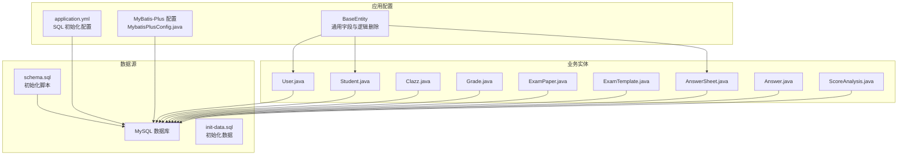
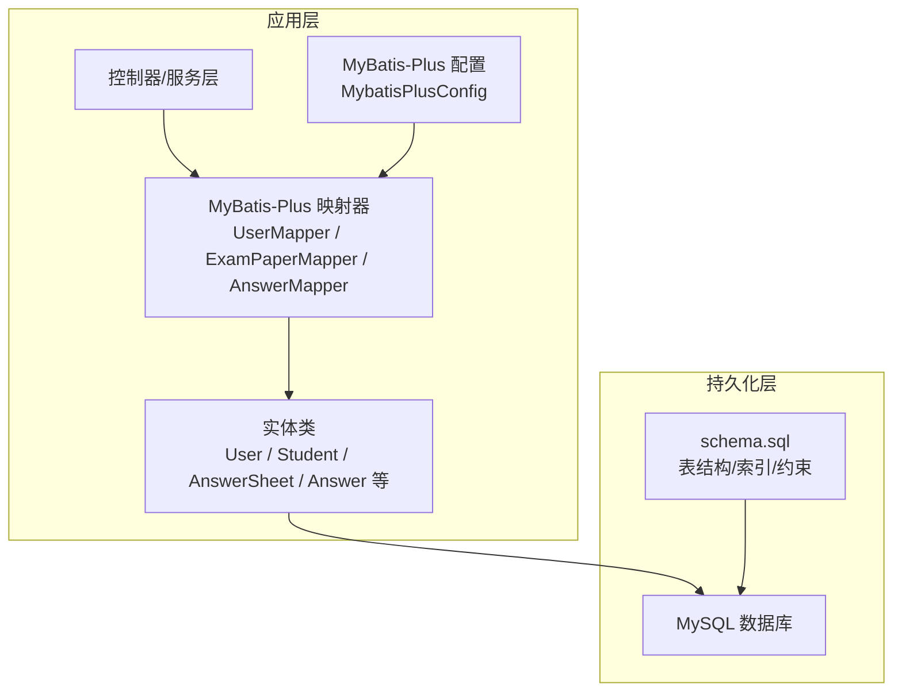
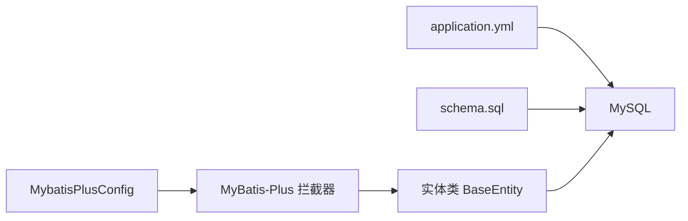

# 索引与约束策略

<cite>
**本文引用的文件**
- [schema.sql](file://backend/src/main/resources/db/schema.sql)
- [create-database.sql](file://backend/src/main/resources/db/create-database.sql)
- [application.yml](file://backend/src/main/resources/application.yml)
- [MybatisPlusConfig.java](file://backend/src/main/java/com/edu/common/config/MybatisPlusConfig.java)
- [BaseEntity.java](file://backend/src/main/java/com/edu/common/entity/BaseEntity.java)
- [User.java](file://backend/src/main/java/com/edu/user/entity/User.java)
- [Student.java](file://backend/src/main/java/com/edu/user/entity/Student.java)
- [Clazz.java](file://backend/src/main/java/com/edu/user/entity/Clazz.java)
- [Grade.java](file://backend/src/main/java/com/edu/user/entity/Grade.java)
- [ExamPaper.java](file://backend/src/main/java/com/edu/exam/entity/ExamPaper.java)
- [ExamTemplate.java](file://backend/src/main/java/com/edu/exam/entity/ExamTemplate.java)
- [AnswerSheet.java](file://backend/src/main/java/com/edu/grading/entity/AnswerSheet.java)
- [Answer.java](file://backend/src/main/java/com/edu/grading/entity/Answer.java)
- [ScoreAnalysis.java](file://backend/src/main/java/com/edu/grading/entity/ScoreAnalysis.java)
- [UserMapper.java](file://backend/src/main/java/com/edu/user/mapper/UserMapper.java)
- [ExamPaperMapper.java](file://backend/src/main/java/com/edu/exam/mapper/ExamPaperMapper.java)
- [AnswerMapper.java](file://backend/src/main/java/com/edu/grading/mapper/AnswerMapper.java)
</cite>

## 目录
1. [简介](#简介)
2. [项目结构](#项目结构)
3. [核心组件](#核心组件)
4. [架构总览](#架构总览)
5. [详细组件分析](#详细组件分析)
6. [依赖分析](#依赖分析)
7. [性能考量](#性能考量)
8. [故障排查指南](#故障排查指南)
9. [结论](#结论)
10. [附录](#附录)

## 简介
本文件聚焦于数据库索引与约束策略，结合后端代码库中的数据库模式定义与实体映射，系统阐述以下主题：
- 单列索引、复合索引与唯一索引的选择原则与落地实践
- 主键、外键、唯一、检查约束的使用场景与最佳实践
- 查询性能、写入性能与存储空间的平衡策略
- 索引使用建议与性能监控方法
- 常见陷阱与规避策略

## 项目结构
该工程采用 Spring Boot + MyBatis-Plus 的典型分层架构，数据库初始化脚本集中于 schema.sql，应用通过 application.yml 指定 SQL 初始化策略；实体类通过注解映射到对应表，统一继承 BaseEntity 以实现多租户与逻辑删除。

图表来源
- [schema.sql:1-379](file://backend/src/main/resources/db/schema.sql#L1-L379)
- [application.yml:8-13](file://backend/src/main/resources/application.yml#L8-L13)
- [MybatisPlusConfig.java:1-23](file://backend/src/main/java/com/edu/common/config/MybatisPlusConfig.java#L1-L23)
- [BaseEntity.java:1-38](file://backend/src/main/java/com/edu/common/entity/BaseEntity.java#L1-L38)
- [User.java:1-21](file://backend/src/main/java/com/edu/user/entity/User.java#L1-L21)
- [Student.java:1-22](file://backend/src/main/java/com/edu/user/entity/Student.java#L1-L22)
- [Clazz.java:1-18](file://backend/src/main/java/com/edu/user/entity/Clazz.java#L1-L18)
- [Grade.java:1-17](file://backend/src/main/java/com/edu/user/entity/Grade.java#L1-L17)
- [ExamPaper.java:1-31](file://backend/src/main/java/com/edu/exam/entity/ExamPaper.java#L1-L31)
- [ExamTemplate.java:1-26](file://backend/src/main/java/com/edu/exam/entity/ExamTemplate.java#L1-L26)
- [AnswerSheet.java:1-34](file://backend/src/main/java/com/edu/grading/entity/AnswerSheet.java#L1-L34)
- [Answer.java:1-39](file://backend/src/main/java/com/edu/grading/entity/Answer.java#L1-L39)
- [ScoreAnalysis.java:1-37](file://backend/src/main/java/com/edu/grading/entity/ScoreAnalysis.java#L1-L37)

章节来源
- [application.yml:8-13](file://backend/src/main/resources/application.yml#L8-L13)
- [schema.sql:1-379](file://backend/src/main/resources/db/schema.sql#L1-L379)
- [MybatisPlusConfig.java:1-23](file://backend/src/main/java/com/edu/common/config/MybatisPlusConfig.java#L1-L23)
- [BaseEntity.java:1-38](file://backend/src/main/java/com/edu/common/entity/BaseEntity.java#L1-L38)

## 核心组件
- 数据库初始化：通过 application.yml 的 spring.sql.init 指令加载 schema.sql 完成建表与索引创建。
- 约束与索引：schema.sql 明确声明了主键、唯一键与大量单列/复合索引，覆盖多租户隔离、外键关联查询与统计分析场景。
- 实体映射：各实体类通过 @TableName 注解映射至具体表，并继承 BaseEntity 获取通用字段与逻辑删除能力。
- 多租户与逻辑删除：MyBatis-Plus 全局配置启用逻辑删除字段 deleted，并在 BaseEntity 中统一注入 tenant_id、created_at、updated_at 字段。

章节来源
- [application.yml:8-13](file://backend/src/main/resources/application.yml#L8-L13)
- [schema.sql:1-379](file://backend/src/main/resources/db/schema.sql#L1-L379)
- [BaseEntity.java:1-38](file://backend/src/main/java/com/edu/common/entity/BaseEntity.java#L1-L38)
- [MybatisPlusConfig.java:1-23](file://backend/src/main/java/com/edu/common/config/MybatisPlusConfig.java#L1-L23)

## 架构总览
下图展示数据库层与应用层的交互关系，以及索引与约束如何支撑查询与写入性能。

图表来源
- [application.yml:32-43](file://backend/src/main/resources/application.yml#L32-L43)
- [MybatisPlusConfig.java:1-23](file://backend/src/main/java/com/edu/common/config/MybatisPlusConfig.java#L1-L23)
- [UserMapper.java:1-9](file://backend/src/main/java/com/edu/user/mapper/UserMapper.java#L1-L9)
- [ExamPaperMapper.java:1-13](file://backend/src/main/java/com/edu/exam/mapper/ExamPaperMapper.java#L1-L13)
- [AnswerMapper.java:1-12](file://backend/src/main/java/com/edu/grading/mapper/AnswerMapper.java#L1-L12)
- [schema.sql:1-379](file://backend/src/main/resources/db/schema.sql#L1-L379)

## 详细组件分析

### 约束与索引设计总览
- 主键约束：所有表均以自增主键作为唯一标识，确保每条记录的稳定定位。
- 唯一约束：多处使用唯一键保障业务唯一性，如租户编码、用户-租户+用户名、角色-租户+编码、题号-租户+学号、答题卡-试卷+学生、题目-试卷题目组合等。
- 外键关系：通过大量单列索引支撑外键关联查询，如 class.teacher_id、answer.answer_sheet_id 等。
- 检查约束：当前 schema.sql 未显式声明 CHECK 约束，可通过应用层或触发器实现业务规则校验。

章节来源
- [schema.sql:10-20](file://backend/src/main/resources/db/schema.sql#L10-L20)
- [schema.sql:22-30](file://backend/src/main/resources/db/schema.sql#L22-L30)
- [schema.sql:47-62](file://backend/src/main/resources/db/schema.sql#L47-L62)
- [schema.sql:64-75](file://backend/src/main/resources/db/schema.sql#L64-L75)
- [schema.sql:131-146](file://backend/src/main/resources/db/schema.sql#L131-L146)
- [schema.sql:235-250](file://backend/src/main/resources/db/schema.sql#L235-L250)
- [schema.sql:252-267](file://backend/src/main/resources/db/schema.sql#L252-L267)
- [schema.sql:269-283](file://backend/src/main/resources/db/schema.sql#L269-L283)
- [schema.sql:285-297](file://backend/src/main/resources/db/schema.sql#L285-L297)
- [schema.sql:300-379](file://backend/src/main/resources/db/schema.sql#L300-L379)

### 单列索引策略
- 用途：加速外键关联查询、过滤与范围扫描，降低全表扫描概率。
- 典型场景：
  - 多租户隔离：tenant_config.tenant_id、school.tenant_id、sys_user.tenant_id、role.tenant_id、student.tenant_id、ppt_document.tenant_id
  - 层级关系：grade.school_id、class.grade_id、class.teacher_id、student.class_id
  - 关联表：question.bank_id、exam_template.tenant_id、exam_paper.tenant_id、exam_paper.template_id、exam_question.exam_paper_id、exam_question.question_id、answer_sheet.tenant_id、answer_sheet.exam_paper_id、answer_sheet.student_id、answer.answer_sheet_id、answer.exam_question_id、score_analysis.exam_paper_id、score_analysis.class_id、student_wrong_question.student_id、student_wrong_question.question_id

章节来源
- [schema.sql:303-379](file://backend/src/main/resources/db/schema.sql#L303-L379)

### 复合索引策略
- 用途：减少回表成本、提升范围查询与等值组合查询效率。
- 典型场景：
  - 用户-租户唯一：uk_tenant_username(sys_user)
  - 角色-租户唯一：uk_tenant_code(role)
  - 题号-租户唯一：uk_tenant_student_no(student)
  - 答题卡-试卷+学生唯一：uk_exam_student(answer_sheet)
  - 题目-答题卡+题目唯一：uk_sheet_question(answer)
  - 试卷+班级唯一：uk_exam_class(score_analysis)
  - 错题-学生+题目唯一：uk_student_question(student_wrong_question)
  - 试卷题目顺序唯一：uk_exam_question(exam_question)

章节来源
- [schema.sql](file://backend/src/main/resources/db/schema.sql#L61)
- [schema.sql](file://backend/src/main/resources/db/schema.sql#L74)
- [schema.sql](file://backend/src/main/resources/db/schema.sql#L145)
- [schema.sql](file://backend/src/main/resources/db/schema.sql#L249)
- [schema.sql](file://backend/src/main/resources/db/schema.sql#L266)
- [schema.sql](file://backend/src/main/resources/db/schema.sql#L282)
- [schema.sql](file://backend/src/main/resources/db/schema.sql#L296)
- [schema.sql](file://backend/src/main/resources/db/schema.sql#L228)

### 唯一索引与业务语义
- 唯一索引承载强一致的业务约束，避免重复与歧义。
- 设计要点：
  - 将“业务键”直接建为唯一索引，如租户编码、用户名、角色编码、学号等。
  - 对组合业务键使用复合唯一索引，如用户-租户、角色-租户、题号-租户等。
  - 注意空值处理：唯一索引允许 NULL，但多个 NULL 会违反唯一性，需配合 NOT NULL 或应用层约束。

章节来源
- [schema.sql](file://backend/src/main/resources/db/schema.sql#L13)
- [schema.sql:51-61](file://backend/src/main/resources/db/schema.sql#L51-L61)
- [schema.sql:69-74](file://backend/src/main/resources/db/schema.sql#L69-L74)
- [schema.sql:157-160](file://backend/src/main/resources/db/schema.sql#L157-L160)
- [schema.sql:138-145](file://backend/src/main/resources/db/schema.sql#L138-L145)
- [schema.sql:241-249](file://backend/src/main/resources/db/schema.sql#L241-L249)
- [schema.sql:257-266](file://backend/src/main/resources/db/schema.sql#L257-L266)
- [schema.sql:272-282](file://backend/src/main/resources/db/schema.sql#L272-L282)
- [schema.sql:288-296](file://backend/src/main/resources/db/schema.sql#L288-L296)
- [schema.sql:224-228](file://backend/src/main/resources/db/schema.sql#L224-L228)

### 外键关系与索引匹配
- 外键通常通过单列索引实现高效连接，避免隐式锁升级与全表扫描。
- 建议：
  - 为所有外键列建立单列索引，如 class.teacher_id、answer.answer_sheet_id、answer.exam_question_id 等。
  - 对频繁出现在 WHERE 与 JOIN 条件中的列优先建立索引。
  - 避免在高并发写入场景下对同一列反复重建索引。

章节来源
- [schema.sql:319-347](file://backend/src/main/resources/db/schema.sql#L319-L347)

### 主键与自增策略
- 所有表采用自增主键，具备插入性能优势与全局唯一性。
- 注意：
  - 自增主键不暴露业务含义，适合内部标识。
  - 在跨库分片或分布式场景，应评估雪花算法或 UUID 等替代方案。

章节来源
- [schema.sql:10-20](file://backend/src/main/resources/db/schema.sql#L10-L20)
- [schema.sql:168-184](file://backend/src/main/resources/db/schema.sql#L168-L184)
- [schema.sql:202-218](file://backend/src/main/resources/db/schema.sql#L202-L218)

### 检查约束与应用层校验
- 当前 schema.sql 未显式声明 CHECK 约束，建议通过应用层或触发器补充业务规则（如状态枚举、数值范围、字符串长度等）。
- 建议：
  - 对枚举字段（如状态、难度、性别）在实体层进行校验。
  - 对金额、分数等数值字段设置上下界与精度控制。

章节来源
- [Answer.java:24-30](file://backend/src/main/java/com/edu/grading/entity/Answer.java#L24-L30)
- [AnswerSheet.java:25-26](file://backend/src/main/java/com/edu/grading/entity/AnswerSheet.java#L25-L26)
- [Student.java:18-19](file://backend/src/main/java/com/edu/user/entity/Student.java#L18-L19)

### 多租户与逻辑删除
- 多租户：通过 tenant_id 字段隔离不同租户数据，配合唯一索引保证租户内唯一性。
- 逻辑删除：deleted 字段统一管理软删，MyBatis-Plus 全局配置启用逻辑删除。
- 建议：
  - 所有查询默认加上逻辑删除过滤条件。
  - 在聚合统计场景注意排除已删除记录。

章节来源
- [BaseEntity.java:16-36](file://backend/src/main/java/com/edu/common/entity/BaseEntity.java#L16-L36)
- [application.yml:40-43](file://backend/src/main/resources/application.yml#L40-L43)

### 实体类与表结构映射
- 各实体类通过 @TableName 映射到对应表，继承 BaseEntity 获得多租户与时间戳字段。
- 建议：
  - 新增字段时保持命名与注解一致性，避免大小写与下划线差异导致的映射问题。
  - 对高频查询字段在实体层保留注释说明其用途与索引策略。

章节来源
- [User.java:10-20](file://backend/src/main/java/com/edu/user/entity/User.java#L10-L20)
- [Student.java:11-21](file://backend/src/main/java/com/edu/user/entity/Student.java#L11-L21)
- [Clazz.java:8-17](file://backend/src/main/java/com/edu/user/entity/Clazz.java#L8-L17)
- [Grade.java:8-16](file://backend/src/main/java/com/edu/user/entity/Grade.java#L8-L16)
- [ExamPaper.java:16-29](file://backend/src/main/java/com/edu/exam/entity/ExamPaper.java#L16-L29)
- [ExamTemplate.java:15-24](file://backend/src/main/java/com/edu/exam/entity/ExamTemplate.java#L15-L24)
- [AnswerSheet.java:16-33](file://backend/src/main/java/com/edu/grading/entity/AnswerSheet.java#L16-L33)
- [Answer.java:13-38](file://backend/src/main/java/com/edu/grading/entity/Answer.java#L13-L38)
- [ScoreAnalysis.java:13-36](file://backend/src/main/java/com/edu/grading/entity/ScoreAnalysis.java#L13-L36)

## 依赖分析
- 应用配置依赖数据库初始化脚本，确保表结构与索引在启动时就绪。
- 实体类依赖 MyBatis-Plus 的自动填充与逻辑删除配置，统一生成 SQL 并过滤软删数据。
- 多租户拦截器通过 MyBatis-Plus Interceptor 注入，自动为查询追加 tenant_id 过滤条件。

图表来源
- [application.yml:8-13](file://backend/src/main/resources/application.yml#L8-L13)
- [schema.sql:1-379](file://backend/src/main/resources/db/schema.sql#L1-L379)
- [MybatisPlusConfig.java:17-21](file://backend/src/main/java/com/edu/common/config/MybatisPlusConfig.java#L17-L21)
- [BaseEntity.java:16-36](file://backend/src/main/java/com/edu/common/entity/BaseEntity.java#L16-L36)

章节来源
- [application.yml:8-13](file://backend/src/main/resources/application.yml#L8-L13)
- [MybatisPlusConfig.java:1-23](file://backend/src/main/java/com/edu/common/config/MybatisPlusConfig.java#L1-L23)
- [BaseEntity.java:1-38](file://backend/src/main/java/com/edu/common/entity/BaseEntity.java#L1-L38)

## 性能考量
- 查询性能
  - 为高频过滤与连接列建立单列索引，如 tenant_id、parent_id、关联主键等。
  - 复合索引优先考虑选择性高的列，遵循“最左前缀”原则。
  - 对 ORDER BY/JOIN/LIMIT 组合场景，评估覆盖索引减少回表。
- 写入性能
  - 控制索引数量，避免过多索引导致 INSERT/UPDATE/DELETE 放慢。
  - 分批写入与批量 DML 优化，减少事务粒度与锁竞争。
- 存储空间
  - 唯一索引占用额外空间，需权衡唯一性需求与存储成本。
  - 对大文本字段（如 JSON/TEXT）谨慎建立索引，优先考虑应用层缓存或二级索引。
- 监控与诊断
  - 使用 EXPLAIN 分析慢查询计划，识别缺少索引或索引失效点。
  - 结合慢日志与性能分析工具（如 MySQL 慢查询日志、APM）定位热点表与列。
  - 定期评估索引使用率，清理长期未使用的索引。

## 故障排查指南
- 索引缺失导致慢查询
  - 症状：WHERE/JOIN 列未命中索引，执行计划出现全表扫描。
  - 排查：确认目标列是否存在单列/复合索引，检查查询谓词是否满足最左前缀。
  - 处理：按查询模式补充索引，必要时调整复合索引列顺序。
- 唯一约束冲突
  - 症状：插入/更新时报唯一键冲突。
  - 排查：核对唯一索引定义与业务键是否重复。
  - 处理：在应用层增加幂等校验，或调整唯一键范围（如引入租户域）。
- 逻辑删除与统计偏差
  - 症状：统计结果包含已删除记录。
  - 排查：确认查询是否过滤 deleted 字段。
  - 处理：统一在查询层加入逻辑删除过滤，或在视图/物化视图中封装。
- 多租户隔离失效
  - 症状：跨租户数据泄露。
  - 排查：确认 MyBatis-Plus 拦截器是否生效，查询是否遗漏 tenant_id 条件。
  - 处理：启用全局拦截器，强制追加租户过滤。

章节来源
- [application.yml:40-43](file://backend/src/main/resources/application.yml#L40-L43)
- [MybatisPlusConfig.java:17-21](file://backend/src/main/java/com/edu/common/config/MybatisPlusConfig.java#L17-L21)
- [BaseEntity.java:34-36](file://backend/src/main/java/com/edu/common/entity/BaseEntity.java#L34-L36)

## 结论
本项目在数据库层面通过完善的约束与索引设计，有效支撑了多租户隔离、组织架构与教学流程的复杂查询需求。建议在现有基础上持续：
- 基于实际查询模式优化索引组合，减少冗余索引
- 强化应用层与数据库层的约束协同，补齐缺失的 CHECK 约束
- 建立索引健康度与慢查询监控机制，动态调整索引策略

## 附录
- 数据库初始化脚本位置与数据库名
  - 数据库创建与使用：[create-database.sql:1-7](file://backend/src/main/resources/db/create-database.sql#L1-L7)
  - 表结构与索引：[schema.sql:1-379](file://backend/src/main/resources/db/schema.sql#L1-L379)
- 应用配置与 MyBatis-Plus
  - SQL 初始化与数据源：[application.yml:8-19](file://backend/src/main/resources/application.yml#L8-L19)
  - MyBatis-Plus 全局配置与逻辑删除：[application.yml:32-43](file://backend/src/main/resources/application.yml#L32-L43)
  - 多租户拦截器注入：[MybatisPlusConfig.java:17-21](file://backend/src/main/java/com/edu/common/config/MybatisPlusConfig.java#L17-L21)
- 实体类与表映射
  - 用户与学生：[User.java:10-20](file://backend/src/main/java/com/edu/user/entity/User.java#L10-L20)、[Student.java:11-21](file://backend/src/main/java/com/edu/user/entity/Student.java#L11-L21)
  - 班级与年级：[Clazz.java:8-17](file://backend/src/main/java/com/edu/user/entity/Clazz.java#L8-L17)、[Grade.java:8-16](file://backend/src/main/java/com/edu/user/entity/Grade.java#L8-L16)
  - 试卷与模板：[ExamPaper.java:16-29](file://backend/src/main/java/com/edu/exam/entity/ExamPaper.java#L16-L29)、[ExamTemplate.java:15-24](file://backend/src/main/java/com/edu/exam/entity/ExamTemplate.java#L15-L24)
  - 答题卡与答案：[AnswerSheet.java:16-33](file://backend/src/main/java/com/edu/grading/entity/AnswerSheet.java#L16-L33)、[Answer.java:13-38](file://backend/src/main/java/com/edu/grading/entity/Answer.java#L13-L38)
  - 成绩分析：[ScoreAnalysis.java:13-36](file://backend/src/main/java/com/edu/grading/entity/ScoreAnalysis.java#L13-L36)
- Mapper 接口
  - 用户与试卷、答案：[UserMapper.java:1-9](file://backend/src/main/java/com/edu/user/mapper/UserMapper.java#L1-L9)、[ExamPaperMapper.java:1-13](file://backend/src/main/java/com/edu/exam/mapper/ExamPaperMapper.java#L1-L13)、[AnswerMapper.java:1-12](file://backend/src/main/java/com/edu/grading/mapper/AnswerMapper.java#L1-L12)