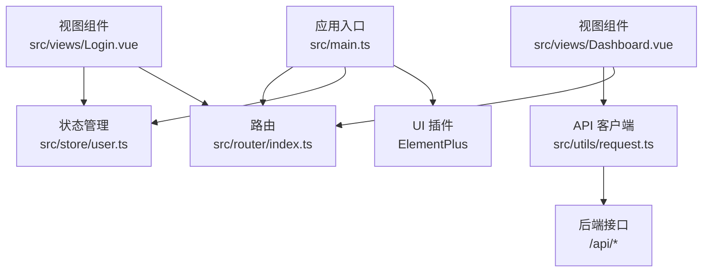
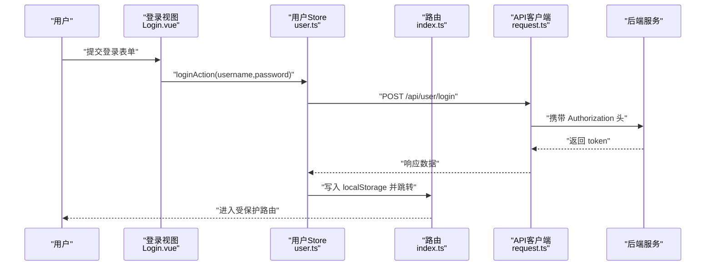
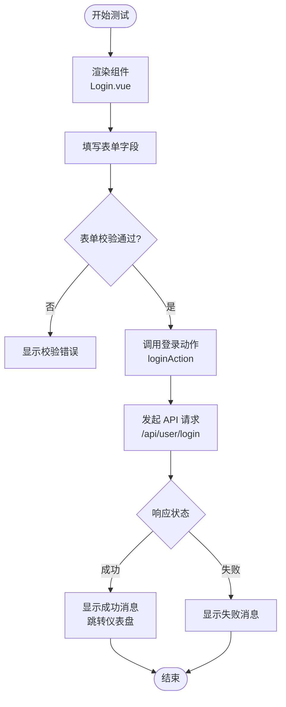
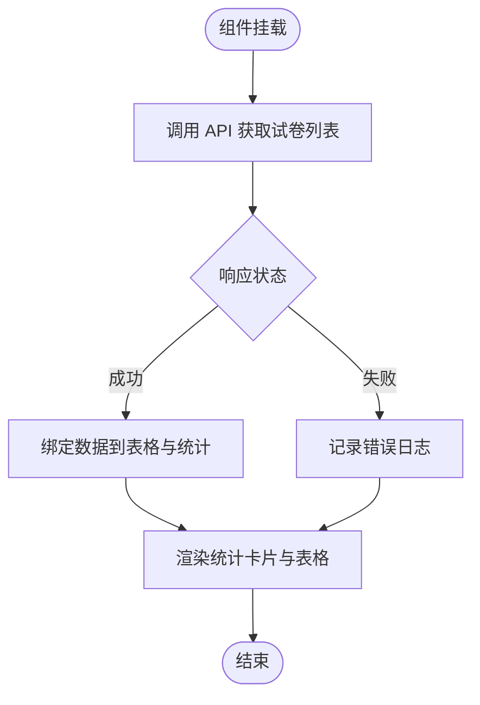
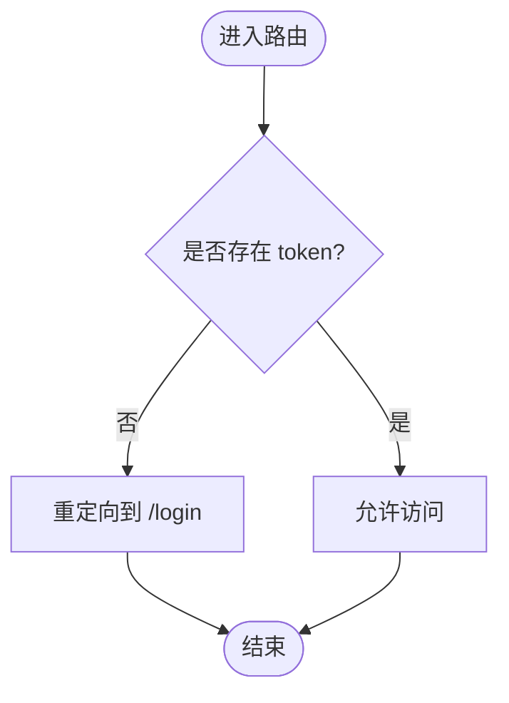
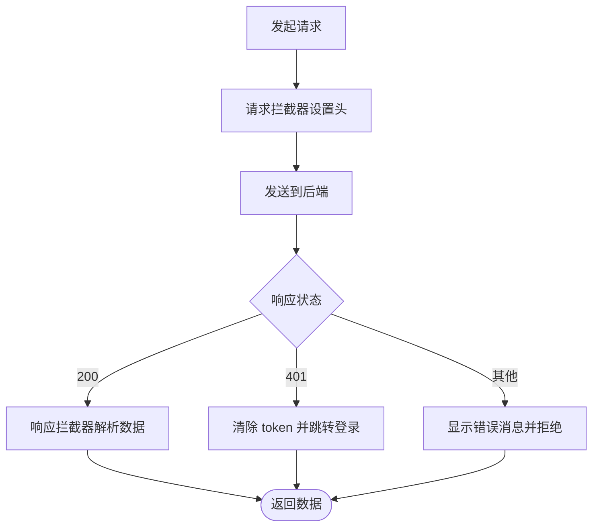
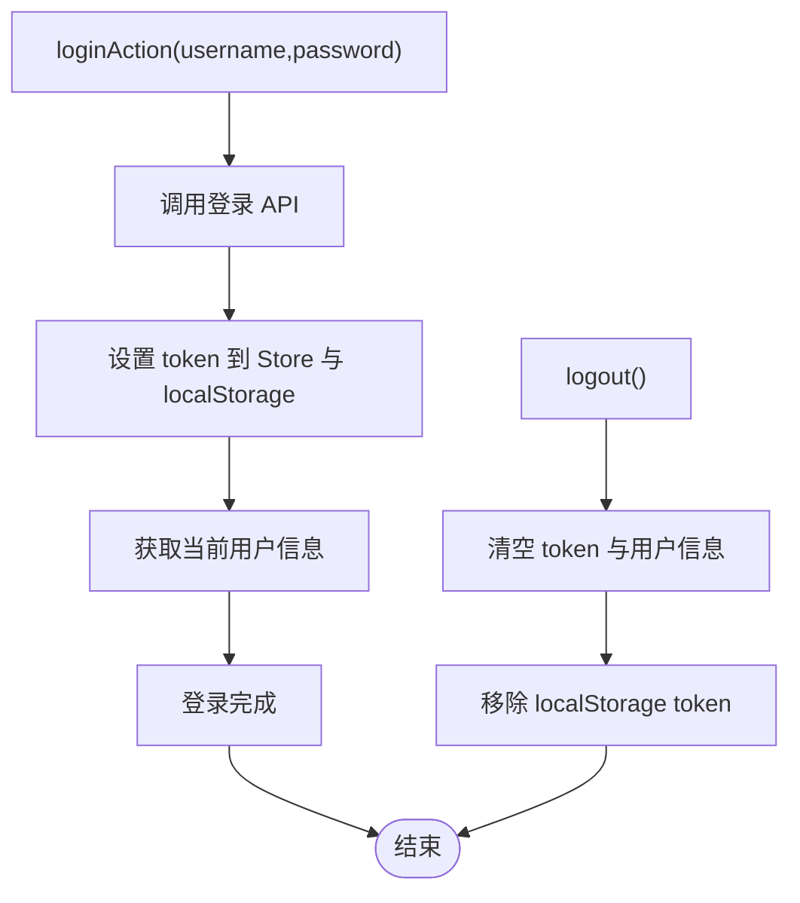
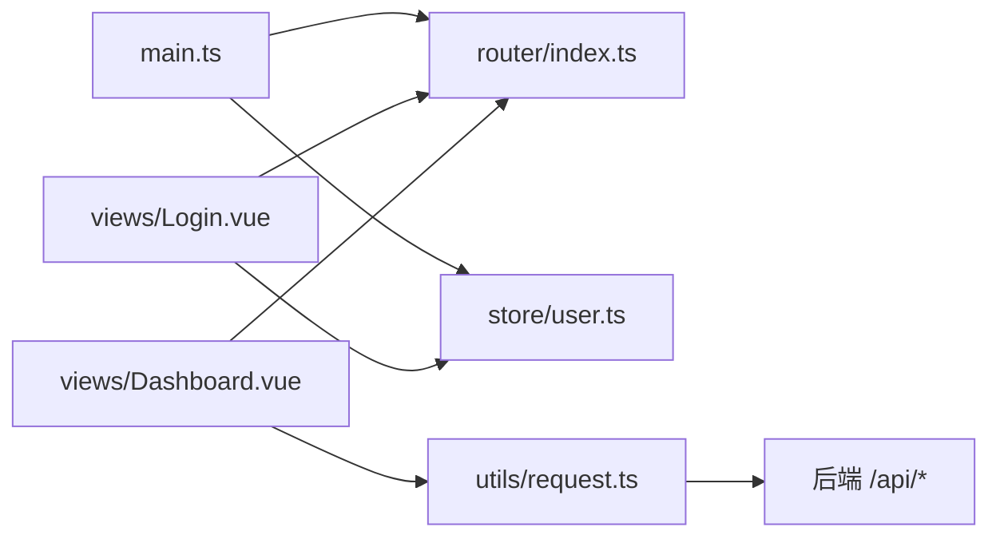

# 前端测试

<cite>
**本文引用的文件**
- [frontend/package.json](file://frontend/package.json)
- [frontend/vite.config.ts](file://frontend/vite.config.ts)
- [frontend/src/main.ts](file://frontend/src/main.ts)
- [frontend/src/App.vue](file://frontend/src/App.vue)
- [frontend/src/utils/request.ts](file://frontend/src/utils/request.ts)
- [frontend/src/router/index.ts](file://frontend/src/router/index.ts)
- [frontend/src/store/user.ts](file://frontend/src/store/user.ts)
- [frontend/src/views/Login.vue](file://frontend/src/views/Login.vue)
- [frontend/src/views/Dashboard.vue](file://frontend/src/views/Dashboard.vue)
</cite>

## 目录
1. [简介](#简介)
2. [项目结构](#项目结构)
3. [核心组件](#核心组件)
4. [架构总览](#架构总览)
5. [详细组件分析](#详细组件分析)
6. [依赖分析](#依赖分析)
7. [性能考虑](#性能考虑)
8. [故障排查指南](#故障排查指南)
9. [结论](#结论)
10. [附录](#附录)

## 简介
本文件面向前端测试场景，围绕 Vue 3 应用的组件测试、单元测试与端到端测试提供系统化方案。结合当前代码库中的应用入口、路由、状态管理、API 客户端与视图组件，给出可落地的测试策略与最佳实践，覆盖用户认证流程、仪表盘功能与 API 调用等关键路径。

## 项目结构
前端采用 Vite + Vue 3 + TypeScript 构建，核心模块包括：
- 应用入口与插件注册：在入口文件中注册 Pinia、路由与 UI 组件库，并挂载应用。
- 路由与导航：定义页面路由与全局前置守卫，实现登录态校验。
- 状态管理：基于 Pinia 的用户状态 Store，封装登录、登出与用户信息获取。
- API 客户端：基于 Axios 的请求实例，内置请求/响应拦截器与鉴权头注入。
- 视图组件：登录页与仪表盘等页面组件，承载业务交互与数据展示。

图表来源
- [frontend/src/main.ts:1-21](file://frontend/src/main.ts#L1-L21)
- [frontend/src/router/index.ts:1-114](file://frontend/src/router/index.ts#L1-L114)
- [frontend/src/store/user.ts:1-44](file://frontend/src/store/user.ts#L1-L44)
- [frontend/src/utils/request.ts:1-53](file://frontend/src/utils/request.ts#L1-L53)
- [frontend/src/views/Login.vue:1-165](file://frontend/src/views/Login.vue#L1-L165)
- [frontend/src/views/Dashboard.vue:1-207](file://frontend/src/views/Dashboard.vue#L1-L207)

章节来源
- [frontend/src/main.ts:1-21](file://frontend/src/main.ts#L1-L21)
- [frontend/vite.config.ts:1-21](file://frontend/vite.config.ts#L1-L21)

## 核心组件
- 应用入口与插件注册：负责初始化应用、注册路由与状态管理、引入 UI 组件库。
- 路由与守卫：定义页面路由与全局前置守卫，未登录访问受保护路由时重定向至登录页。
- 用户状态 Store：封装登录、登出与用户信息获取，持久化 token。
- API 客户端：统一请求实例，自动注入 Content-Type、Authorization 与租户头；响应拦截器处理错误码与 401 自动跳转。
- 登录视图：表单校验、登录与注册流程、消息提示与路由跳转。
- 仪表盘视图：统计卡片、快捷操作按钮与最近试卷列表，依赖 API 获取数据。

章节来源
- [frontend/src/router/index.ts:104-112](file://frontend/src/router/index.ts#L104-L112)
- [frontend/src/store/user.ts:24-42](file://frontend/src/store/user.ts#L24-L42)
- [frontend/src/utils/request.ts:10-51](file://frontend/src/utils/request.ts#L10-L51)
- [frontend/src/views/Login.vue:108-136](file://frontend/src/views/Login.vue#L108-L136)
- [frontend/src/views/Dashboard.vue:143-152](file://frontend/src/views/Dashboard.vue#L143-L152)

## 架构总览
下图展示了从用户操作到后端 API 的典型调用链路，以及登录态与路由守卫的作用点。

图表来源
- [frontend/src/views/Login.vue:108-122](file://frontend/src/views/Login.vue#L108-L122)
- [frontend/src/store/user.ts:25-31](file://frontend/src/store/user.ts#L25-L31)
- [frontend/src/utils/request.ts:17-23](file://frontend/src/utils/request.ts#L17-L23)
- [frontend/src/router/index.ts:105-112](file://frontend/src/router/index.ts#L105-L112)

## 详细组件分析

### 登录组件测试策略
目标
- 验证表单校验规则与交互反馈。
- 模拟登录成功/失败，断言消息提示、路由跳转与本地存储。
- 验证注册流程与对话框行为。

建议测试要点
- 渲染与属性：组件渲染、按钮禁用状态、输入框占位符。
- 事件触发：点击登录按钮、表单校验失败与通过、注册对话框开关。
- 行为验证：登录成功后跳转、失败时错误提示、注册成功后的提示与表单填充。
- 异步处理：等待 Promise 完成、避免时序问题导致的断言失败。
- Mock 数据：使用伪造的用户 API 返回值，确保可重复性。

图表来源
- [frontend/src/views/Login.vue:108-122](file://frontend/src/views/Login.vue#L108-L122)
- [frontend/src/store/user.ts:25-31](file://frontend/src/store/user.ts#L25-L31)

章节来源
- [frontend/src/views/Login.vue:108-136](file://frontend/src/views/Login.vue#L108-L136)
- [frontend/src/store/user.ts:24-31](file://frontend/src/store/user.ts#L24-L31)

### 仪表盘组件测试策略
目标
- 验证统计卡片与快捷操作按钮渲染。
- 验证最近试卷表格的数据绑定与状态标签映射。
- 验证生命周期内 API 调用与异常处理。

建议测试要点
- 渲染与属性：统计数值、状态标签类型、按钮点击跳转。
- 数据绑定：表格列渲染、学科与状态映射正确性。
- 异步处理：等待 onMounted 中的 API 调用完成。
- 错误边界：模拟网络错误或空数据，验证组件不崩溃且有降级提示。

图表来源
- [frontend/src/views/Dashboard.vue:143-152](file://frontend/src/views/Dashboard.vue#L143-L152)

章节来源
- [frontend/src/views/Dashboard.vue:143-152](file://frontend/src/views/Dashboard.vue#L143-L152)

### 路由守卫与登录态测试策略
目标
- 验证未登录访问受保护路由被重定向至登录页。
- 验证已登录访问登录页被允许或根据需要重定向。
- 验证 token 存取与路由切换。

建议测试要点
- 环境准备：在测试前清理 localStorage，确保初始状态一致。
- 场景一：无 token 访问受保护路由，断言跳转至登录页。
- 场景二：有 token 访问受保护路由，断言放行。
- 场景三：登录成功后，localStorage 中存在 token，后续访问受保护路由放行。

图表来源
- [frontend/src/router/index.ts:105-112](file://frontend/src/router/index.ts#L105-L112)

章节来源
- [frontend/src/router/index.ts:104-112](file://frontend/src/router/index.ts#L104-L112)

### API 客户端测试策略
目标
- 验证请求拦截器：Content-Type、Authorization 与租户头注入。
- 验证响应拦截器：业务错误码处理、401 自动清除 token 并跳转登录。
- 验证超时与网络错误提示。

建议测试要点
- Mock axios 实例，构造不同响应场景（200 成功、401 未授权、业务错误）。
- 断言请求头是否正确设置。
- 断言错误分支的行为（消息提示、路由跳转、本地存储清理）。

图表来源
- [frontend/src/utils/request.ts:10-51](file://frontend/src/utils/request.ts#L10-L51)

章节来源
- [frontend/src/utils/request.ts:10-51](file://frontend/src/utils/request.ts#L10-L51)

### 状态管理（Pinia）测试策略
目标
- 验证登录动作：token 写入、用户信息获取、本地存储同步。
- 验证登出动作：token 与用户信息清空、本地存储移除。
- 验证 getter：登录态、用户名、真实姓名。

建议测试要点
- 使用内存模式运行 Store，避免持久化影响。
- 断言状态变更与副作用（如 API 调用次数）。
- 对异步 action 进行等待，确保断言在异步完成后执行。

图表来源
- [frontend/src/store/user.ts:24-42](file://frontend/src/store/user.ts#L24-L42)

章节来源
- [frontend/src/store/user.ts:24-42](file://frontend/src/store/user.ts#L24-L42)

## 依赖分析
- 应用入口依赖路由与状态管理，二者共同决定页面渲染与用户状态。
- API 客户端作为统一数据通道，被视图组件与 Store 调用。
- 路由守卫依赖 localStorage 中的 token，形成“登录态 → 导航权限”的控制闭环。

图表来源
- [frontend/src/main.ts:1-21](file://frontend/src/main.ts#L1-L21)
- [frontend/src/router/index.ts:1-114](file://frontend/src/router/index.ts#L1-L114)
- [frontend/src/store/user.ts:1-44](file://frontend/src/store/user.ts#L1-L44)
- [frontend/src/utils/request.ts:1-53](file://frontend/src/utils/request.ts#L1-L53)
- [frontend/src/views/Login.vue:1-165](file://frontend/src/views/Login.vue#L1-L165)
- [frontend/src/views/Dashboard.vue:1-207](file://frontend/src/views/Dashboard.vue#L1-L207)

章节来源
- [frontend/src/main.ts:1-21](file://frontend/src/main.ts#L1-L21)
- [frontend/src/router/index.ts:1-114](file://frontend/src/router/index.ts#L1-L114)
- [frontend/src/store/user.ts:1-44](file://frontend/src/store/user.ts#L1-L44)
- [frontend/src/utils/request.ts:1-53](file://frontend/src/utils/request.ts#L1-L53)
- [frontend/src/views/Login.vue:1-165](file://frontend/src/views/Login.vue#L1-L165)
- [frontend/src/views/Dashboard.vue:1-207](file://frontend/src/views/Dashboard.vue#L1-L207)

## 性能考虑
- 组件渲染性能：对高频更新的统计卡片与表格，优先使用响应式数据与最小化重渲染。
- 异步加载优化：在仪表盘中对 API 调用进行节流与缓存，避免重复请求。
- 路由懒加载：当前路由已采用动态导入，有助于首屏加载性能。
- 测试性能：在单元测试中尽量减少真实网络请求，使用 Mock 提升执行速度。

## 故障排查指南
常见问题与定位
- 登录后无法进入受保护页面：检查路由守卫逻辑与 localStorage 中 token 是否存在。
- 仪表盘数据为空：确认 API 返回格式与 onMounted 中的数据绑定逻辑。
- 请求失败或 401：检查请求拦截器头设置与响应拦截器的错误处理分支。
- 路由跳转异常：核对路由配置与 beforeEach 的条件判断。

章节来源
- [frontend/src/router/index.ts:105-112](file://frontend/src/router/index.ts#L105-L112)
- [frontend/src/utils/request.ts:34-51](file://frontend/src/utils/request.ts#L34-L51)
- [frontend/src/views/Dashboard.vue:143-152](file://frontend/src/views/Dashboard.vue#L143-L152)

## 结论
本项目前端具备清晰的分层结构：入口负责装配，路由与守卫保障导航安全，状态管理封装用户会话，API 客户端统一处理请求与响应。围绕这些模块制定测试策略，可有效覆盖用户认证、仪表盘与 API 调用等关键路径。建议在现有基础上补充单元测试与端到端测试，完善 Mock 与覆盖率收集，持续提升质量与稳定性。

## 附录
- 测试环境配置建议
  - 单元测试：使用 Vite 与 Vitest（与现有 Vite 配置兼容），在测试环境中模拟浏览器 DOM 与全局对象。
  - 端到端测试：可选 Cypress 或 Playwright，结合 Vite 开发服务器进行集成测试。
  - 覆盖率：启用覆盖率收集，重点关注路由守卫、API 客户端与状态管理的关键分支。
- Mock 数据与拦截
  - 使用 Mock 适配器拦截 axios 请求，返回稳定的数据集，便于断言与回归测试。
  - 对 localStorage 进行沙箱隔离，确保测试间互不影响。
- 最佳实践清单
  - 异步测试：使用 await 与合理的超时设置，避免竞态条件。
  - 错误边界：对异常路径进行显式断言，保证组件健壮性。
  - 性能测试：对关键交互与数据加载进行基准测试，识别瓶颈。