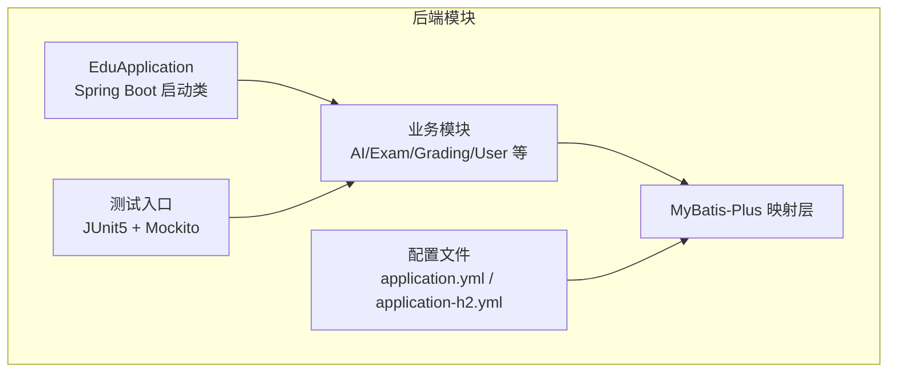
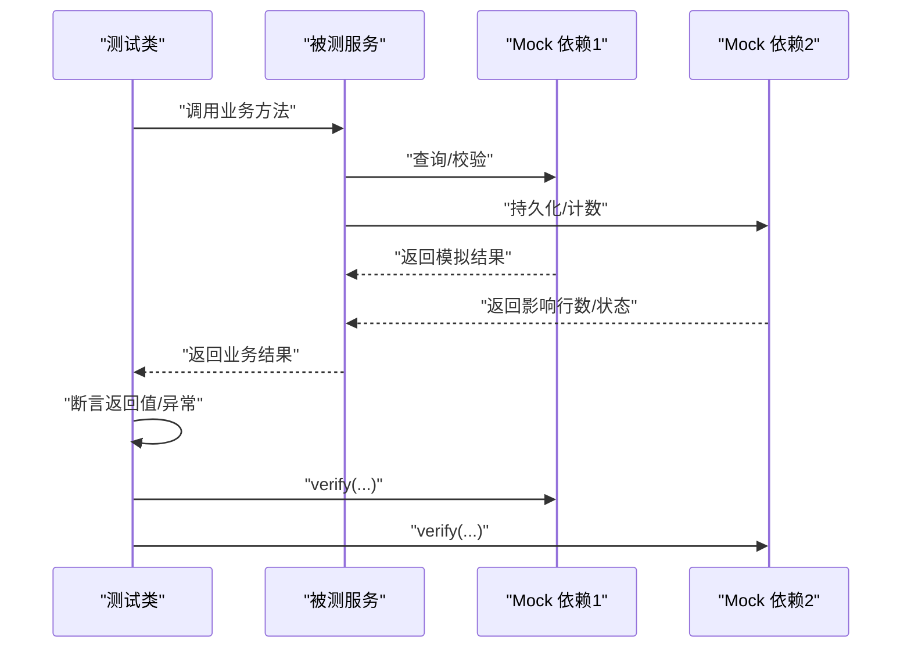
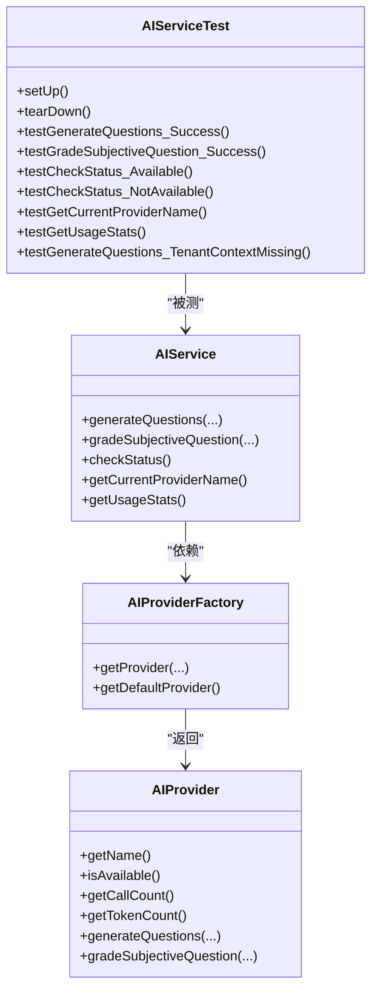
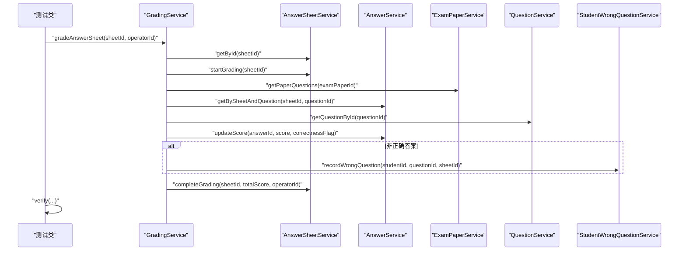

# 后端测试

<cite>
**本文引用的文件**
- [EduApplication.java](file://backend/src/main/java/com/edu/EduApplication.java)
- [pom.xml](file://backend/pom.xml)
- [application.yml](file://backend/src/main/resources/application.yml)
- [application-h2.yml](file://backend/src/main/resources/application-h2.yml)
- [AIServiceTest.java](file://backend/src/test/java/com/edu/ai/service/AIServiceTest.java)
- [PromptBuilderServiceTest.java](file://backend/src/test/java/com/edu/ai/service/PromptBuilderServiceTest.java)
- [GradingServiceTest.java](file://backend/src/test/java/com/edu/grading/service/GradingServiceTest.java)
- [ExamPaperServiceTest.java](file://backend/src/test/java/com/edu/exam/service/ExamPaperServiceTest.java)
- [ExamGenerateServiceTest.java](file://backend/src/test/java/com/edu/exam/service/ExamGenerateServiceTest.java)
- [AnswerSheetServiceTest.java](file://backend/src/test/java/com/edu/grading/service/AnswerSheetServiceTest.java)
- [JwtUtilTest.java](file://backend/src/test/java/com/edu/common/util/JwtUtilTest.java)
- [GlobalExceptionHandlerTest.java](file://backend/src/test/java/com/edu/common/exception/GlobalExceptionHandlerTest.java)
- [TenantInterceptorTest.java](file://backend/src/test/java/com/edu/common/interceptor/TenantInterceptorTest.java)
- [TenantContextHolderTest.java](file://backend/src/test/java/com/edu/common/util/TenantContextHolderTest.java)
</cite>

## 目录
1. [引言](#引言)
2. [项目结构](#项目结构)
3. [核心组件](#核心组件)
4. [架构总览](#架构总览)
5. [详细组件分析](#详细组件分析)
6. [依赖分析](#依赖分析)
7. [性能考虑](#性能考虑)
8. [故障排查指南](#故障排查指南)
9. [结论](#结论)
10. [附录](#附录)

## 引言
本文件面向后端测试实践，系统梳理Spring Boot测试配置与注解使用、Mockito框架在单元测试中的应用、单元测试编写规范、集成测试策略（含H2内存数据库、租户隔离与事务控制）、以及针对AI服务、批改服务、考试服务等核心业务的测试用例设计思路与最佳实践。文档同时提供测试数据准备、测试夹具与工具类的使用建议，帮助读者快速上手并高质量完成测试工作。

## 项目结构
后端模块采用Spring Boot标准目录组织，测试代码位于backend/src/test/java下，按功能域分包，覆盖AI、批改、考试、通用工具与拦截器等模块。核心启动类为EduApplication，测试依赖通过Maven集中管理，数据库初始化配置分别支持MySQL与H2内存数据库。

**图表来源**
- [EduApplication.java:1-15](file://backend/src/main/java/com/edu/EduApplication.java#L1-L15)
- [pom.xml:1-152](file://backend/pom.xml#L1-L152)
- [application.yml:1-65](file://backend/src/main/resources/application.yml#L1-L65)
- [application-h2.yml:1-76](file://backend/src/main/resources/application-h2.yml#L1-L76)

**章节来源**
- [EduApplication.java:1-15](file://backend/src/main/java/com/edu/EduApplication.java#L1-L15)
- [pom.xml:1-152](file://backend/pom.xml#L1-L152)
- [application.yml:1-65](file://backend/src/main/resources/application.yml#L1-L65)
- [application-h2.yml:1-76](file://backend/src/main/resources/application-h2.yml#L1-L76)

## 核心组件
- 测试运行环境
  - JUnit 5：统一的测试框架，提供断言、参数化与扩展机制。
  - Mockito：模拟对象与桩函数，支撑高内聚的单元测试。
  - Spring Boot Test：自动装配与条件加载，结合测试专用配置。
- 测试配置要点
  - 通过application-h2.yml启用H2内存数据库，便于快速集成测试与隔离。
  - 通过@ExtendWith(MockitoExtension.class)启用Mockito对字段注入的支持。
  - 使用@Mock/@InjectMocks/@Spy等注解管理测试夹具与被测对象生命周期。
- 数据库与租户隔离
  - application.yml默认连接MySQL；application-h2.yml切换至H2内存库。
  - 租户上下文通过TenantContextHolder在测试中设置/清理，确保多租户逻辑可验证。

**章节来源**
- [pom.xml:122-132](file://backend/pom.xml#L122-L132)
- [application.yml:15-25](file://backend/src/main/resources/application.yml#L15-L25)
- [application-h2.yml:20-26](file://backend/src/main/resources/application-h2.yml#L20-L26)
- [AIServiceTest.java:26-46](file://backend/src/test/java/com/edu/ai/service/AIServiceTest.java#L26-L46)
- [ExamPaperServiceTest.java:42-50](file://backend/src/test/java/com/edu/exam/service/ExamPaperServiceTest.java#L42-L50)
- [AnswerSheetServiceTest.java:37-45](file://backend/src/test/java/com/edu/grading/service/AnswerSheetServiceTest.java#L37-L45)

## 架构总览
下图展示了测试执行的关键路径：测试类通过Mockito扩展注入Mock对象，调用被测服务，断言行为与结果，并验证交互次数与参数匹配。

**图表来源**
- [AIServiceTest.java:48-100](file://backend/src/test/java/com/edu/ai/service/AIServiceTest.java#L48-L100)
- [GradingServiceTest.java:86-103](file://backend/src/test/java/com/edu/grading/service/GradingServiceTest.java#L86-L103)
- [ExamPaperServiceTest.java:52-69](file://backend/src/test/java/com/edu/exam/service/ExamPaperServiceTest.java#L52-L69)

## 详细组件分析

### AI服务测试（AIService）
- 目标与范围
  - 验证问题生成、主观题批改、提供商可用性检查、用量统计与租户上下文缺失时的降级行为。
- 关键点
  - 使用@Mock模拟AIProviderFactory与AIProvider；@InjectMocks注入到AIService。
  - 通过when(...).thenReturn(...)配置桩行为；通过verify(..., times(n))验证交互次数。
  - 在@BeforeEach设置租户ID，在@AfterEach清理，保证多租户上下文隔离。
- 断言与异常
  - 使用assertNotNull/assertTrue/assertEquals等基础断言；在租户缺失场景断言默认提供商路径被触发。

**图表来源**
- [AIServiceTest.java:26-154](file://backend/src/test/java/com/edu/ai/service/AIServiceTest.java#L26-L154)

**章节来源**
- [AIServiceTest.java:26-154](file://backend/src/test/java/com/edu/ai/service/AIServiceTest.java#L26-L154)

### Prompt构建服务测试（PromptBuilderService）
- 目标与范围
  - 验证不同学科、题型、难度与知识点组合下的提示词构建是否符合预期。
- 关键点
  - 该类为纯函数式工具，无需Mock；通过构造请求对象并断言输出字符串包含关键片段。
  - 对批改提示词也进行正则式语义关键词断言，确保评分字段与分析字段存在。

**章节来源**
- [PromptBuilderServiceTest.java:1-105](file://backend/src/test/java/com/edu/ai/service/PromptBuilderServiceTest.java#L1-L105)

### 批改服务测试（GradingService）
- 目标与范围
  - 验证答题卡批改流程：开始批改、按题型评分（选择、计算、填空、判断）、错题记录与完成批改。
- 关键点
  - Mock AnswerSheetService、AnswerService、ExamPaperService、QuestionService、StudentWrongQuestionService。
  - 针对不同题型与答案一致性进行断言，如计算题允许一定误差、填空题允许多答案、判断题“对/正确”等价。
  - 使用doNothing().when(...).xxx()模拟副作用操作，避免真实持久化。

**图表来源**
- [GradingServiceTest.java:86-103](file://backend/src/test/java/com/edu/grading/service/GradingServiceTest.java#L86-L103)
- [GradingServiceTest.java:112-143](file://backend/src/test/java/com/edu/grading/service/GradingServiceTest.java#L112-L143)

**章节来源**
- [GradingServiceTest.java:1-217](file://backend/src/test/java/com/edu/grading/service/GradingServiceTest.java#L1-L217)

### 试卷服务测试（ExamPaperService）
- 目标与范围
  - 验证试卷创建、发布、删除、添加题目、查询题目列表与按租户查询等核心流程。
- 关键点
  - Mock ExamPaperMapper与ExamQuestionMapper；使用LambdaQueryWrapper进行条件查询。
  - 在租户上下文缺失时断言抛出业务异常；成功场景断言状态变更与时间戳填充。

**章节来源**
- [ExamPaperServiceTest.java:1-166](file://backend/src/test/java/com/edu/exam/service/ExamPaperServiceTest.java#L1-L166)

### 试卷生成服务测试（ExamGenerateService）
- 目标与范围
  - 验证根据请求结构生成多节次试卷、按题型与数量抽取题目、不足时兜底等逻辑。
- 关键点
  - Mock QuestionService、ExamPaperService、QuestionBankService。
  - 断言创建试卷一次、按题型查询多次、向试卷添加题目N次。

**章节来源**
- [ExamGenerateServiceTest.java:1-153](file://backend/src/test/java/com/edu/exam/service/ExamGenerateServiceTest.java#L1-L153)

### 答题卡服务测试（AnswerSheetService）
- 目标与范围
  - 验证答题卡创建（重复性校验、租户上下文）、提交、完成批改、按考试统计等。
- 关键点
  - Mock AnswerSheetMapper；断言状态流转与时间戳更新。

**章节来源**
- [AnswerSheetServiceTest.java:1-148](file://backend/src/test/java/com/edu/grading/service/AnswerSheetServiceTest.java#L1-L148)

### 通用工具与异常处理测试
- JWT工具测试（JwtUtilTest）
  - 通过反射设置密钥与过期时间，验证令牌生成、校验、解析用户ID/租户ID/用户名与过期判断。
- 全局异常处理器测试（GlobalExceptionHandlerTest）
  - 验证业务异常与租户异常的HTTP语义码与消息体。
- 租户上下文测试（TenantContextHolderTest）
  - 验证线程本地存储的设置、清理、默认为空、子线程传播。
- 租户拦截器测试（TenantInterceptorTest）
  - 验证SQL拦截与追加租户条件、免拦截表、解析失败抛异常、无租户ID跳过拦截等。

**章节来源**
- [JwtUtilTest.java:1-56](file://backend/src/test/java/com/edu/common/util/JwtUtilTest.java#L1-L56)
- [GlobalExceptionHandlerTest.java:1-40](file://backend/src/test/java/com/edu/common/exception/GlobalExceptionHandlerTest.java#L1-L40)
- [TenantContextHolderTest.java:1-48](file://backend/src/test/java/com/edu/common/util/TenantContextHolderTest.java#L1-L48)
- [TenantInterceptorTest.java:1-142](file://backend/src/test/java/com/edu/common/interceptor/TenantInterceptorTest.java#L1-L142)

## 依赖分析
- 测试依赖
  - spring-boot-starter-test：提供Spring Boot测试支持与自动配置。
  - spring-security-test：用于安全相关测试。
  - H2数据库：在测试环境下替换MySQL，提升执行效率与隔离性。
- 组件耦合
  - 测试类通过@Mock注入外部依赖，被测服务保持纯净，降低耦合度。
  - Mapper层通过Mock返回期望结果，避免真实数据库副作用。

**图表来源**
- [pom.xml:122-132](file://backend/pom.xml#L122-L132)
- [application-h2.yml:20-26](file://backend/src/main/resources/application-h2.yml#L20-L26)

**章节来源**
- [pom.xml:122-132](file://backend/pom.xml#L122-L132)
- [application-h2.yml:20-26](file://backend/src/main/resources/application-h2.yml#L20-L26)

## 性能考虑
- 单元测试优先：通过Mock减少IO与网络调用，保证测试执行速度与稳定性。
- H2内存库：在集成测试中使用内存数据库，避免磁盘IO与连接池开销。
- 并发与线程：利用TenantContextHolder的线程传播特性，确保多线程场景下租户上下文一致。
- 断言与验证：合理使用verify(times(n))，避免过度断言导致脆弱测试。

## 故障排查指南
- 常见问题
  - 租户上下文缺失：在需要租户ID的业务中未设置TenantContextHolder，导致断言或异常不符合预期。
  - Mock未生效：忘记在测试类上添加@ExtendWith(MockitoExtension.class)，或未使用@Mock/@InjectMocks。
  - SQL拦截异常：TenantInterceptor对非法SQL解析失败会抛出运行时异常，需检查原始SQL格式。
- 排查步骤
  - 确认测试配置文件是否加载正确（application-h2.yml）。
  - 在被测方法前后打印关键入参与返回值，定位Mock返回与实际调用不一致的问题。
  - 使用verify(..., atLeastOnce())替代times(1)以降低脆弱性。

**章节来源**
- [TenantInterceptorTest.java:96-115](file://backend/src/test/java/com/edu/common/interceptor/TenantInterceptorTest.java#L96-L115)
- [ExamPaperServiceTest.java:72-78](file://backend/src/test/java/com/edu/exam/service/ExamPaperServiceTest.java#L72-L78)
- [AnswerSheetServiceTest.java:60-64](file://backend/src/test/java/com/edu/grading/service/AnswerSheetServiceTest.java#L60-L64)

## 结论
本测试体系以JUnit5与Mockito为核心，结合Spring Boot Test与H2内存数据库，实现了对AI服务、批改服务、考试服务等核心业务的高效验证。通过严格的租户上下文隔离、清晰的断言与交互验证，确保了测试的可靠性与可维护性。建议在后续迭代中持续补充边界与异常场景测试，进一步完善测试覆盖率。

## 附录

### Spring Boot测试注解与配置要点
- @ExtendWith(MockitoExtension.class)：启用Mockito对字段注入的支持，简化测试夹具搭建。
- @Mock：创建被测对象的依赖桩，避免真实调用。
- @InjectMocks：将@Mock创建的依赖注入到被测对象中。
- @Spy：对真实对象进行部分Mock（只对指定方法打桩），适合复杂对象或需要保留部分真实行为的场景。
- @BeforeEach/@AfterEach：在每个测试方法执行前/后设置/清理上下文（如租户ID）。
- application-h2.yml：在测试环境中切换至H2内存数据库，提升执行效率与隔离性。

**章节来源**
- [AIServiceTest.java:13-46](file://backend/src/test/java/com/edu/ai/service/AIServiceTest.java#L13-L46)
- [ExamPaperServiceTest.java:42-50](file://backend/src/test/java/com/edu/exam/service/ExamPaperServiceTest.java#L42-L50)
- [AnswerSheetServiceTest.java:37-45](file://backend/src/test/java/com/edu/grading/service/AnswerSheetServiceTest.java#L37-L45)
- [application-h2.yml:20-26](file://backend/src/main/resources/application-h2.yml#L20-L26)

### 单元测试编写规范
- 命名约定
  - 方法名采用“功能_输入_期望”的结构，例如：testCreatePaper_Success、testGradeChoice_CorrectAnswer。
- 断言使用
  - 使用assertNotNull/assertTrue/assertEquals等基础断言；对异常场景使用assertThrows。
- 异常处理测试
  - 针对业务异常（如BusinessException）与权限异常（如TenantException）分别断言状态码与消息。
- Mock策略
  - 仅Mock必要依赖；对纯函数工具类直接实例化并断言输出。
  - 使用verify(..., times(n))验证交互次数，避免过度断言。

**章节来源**
- [GradingServiceTest.java:86-103](file://backend/src/test/java/com/edu/grading/service/GradingServiceTest.java#L86-L103)
- [GlobalExceptionHandlerTest.java:12-38](file://backend/src/test/java/com/edu/common/exception/GlobalExceptionHandlerTest.java#L12-L38)

### 集成测试策略与H2内存数据库
- 数据库测试隔离
  - 使用application-h2.yml在测试环境中切换至H2内存库，避免与开发/生产数据冲突。
- 初始化脚本
  - 通过spring.sql.init配置schema与初始数据，确保测试环境具备一致的数据结构与种子数据。
- 事务回滚
  - 在测试类上添加@Commit或使用@TestExecutionListeners配合事务管理器，确保测试后回滚。
  - 若需真实持久化验证，可在单测中显式开启事务并在结束后回滚，或使用H2内存库+每次重启隔离。

**章节来源**
- [application.yml:8-13](file://backend/src/main/resources/application.yml#L8-L13)
- [application-h2.yml:32-37](file://backend/src/main/resources/application-h2.yml#L32-L37)

### 测试数据准备、夹具与工具类
- 测试夹具
  - 在@BeforeEach中构造实体对象（如AnswerSheet、Question、ExamQuestion、Answer），并设置Mock返回值。
- 工具类
  - TenantContextHolder：设置/清理租户ID，确保多租户逻辑可验证。
  - JwtUtil：通过反射设置密钥与过期时间，便于生成与校验令牌。
- 最佳实践
  - 将公共构造方法抽取为私有方法，减少重复代码。
  - 对复杂场景（如多节次试卷生成）拆分为多个测试方法，覆盖不同分支。

**章节来源**
- [ExamPaperServiceTest.java:58-79](file://backend/src/test/java/com/edu/exam/service/ExamPaperServiceTest.java#L58-L79)
- [ExamGenerateServiceTest.java:47-66](file://backend/src/test/java/com/edu/exam/service/ExamGenerateServiceTest.java#L47-L66)
- [TenantContextHolderTest.java:14-46](file://backend/src/test/java/com/edu/common/util/TenantContextHolderTest.java#L14-L46)
- [JwtUtilTest.java:13-19](file://backend/src/test/java/com/edu/common/util/JwtUtilTest.java#L13-L19)