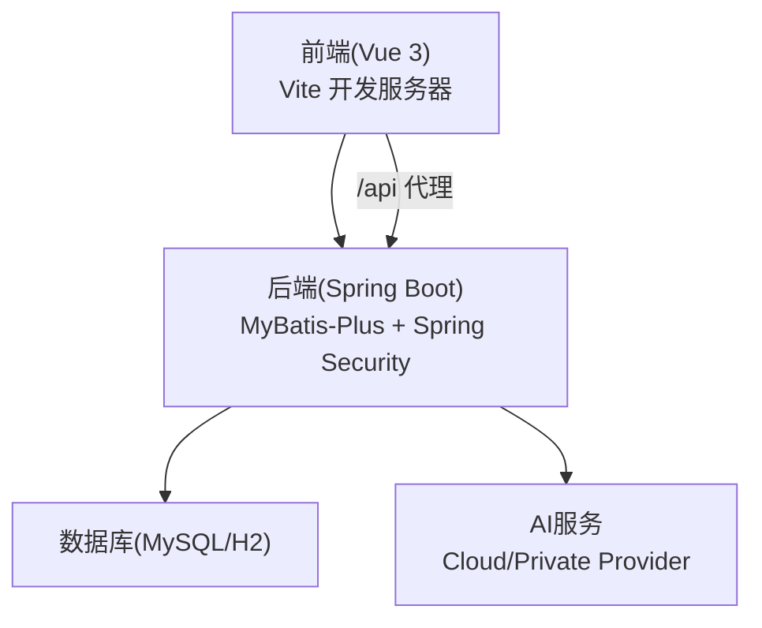
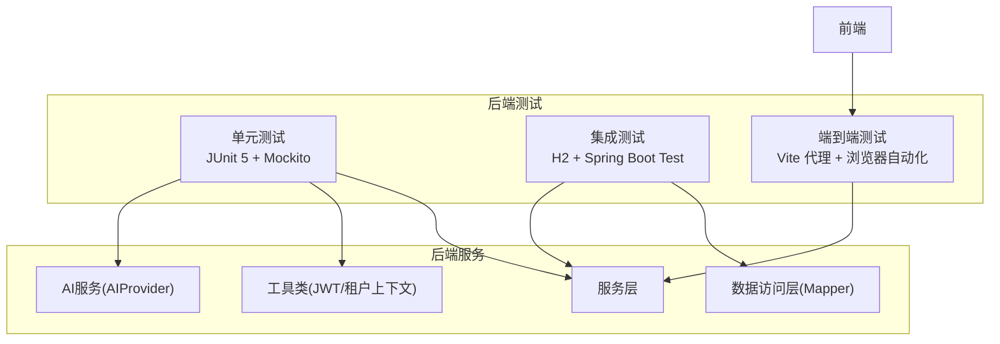
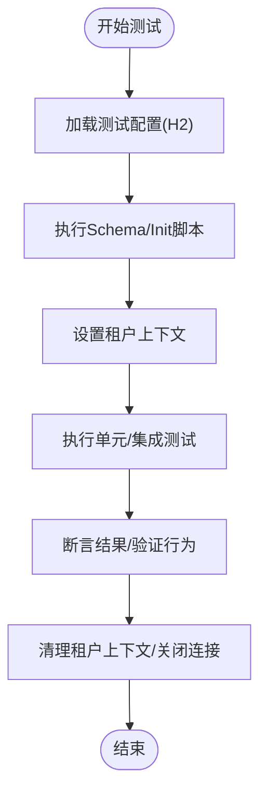
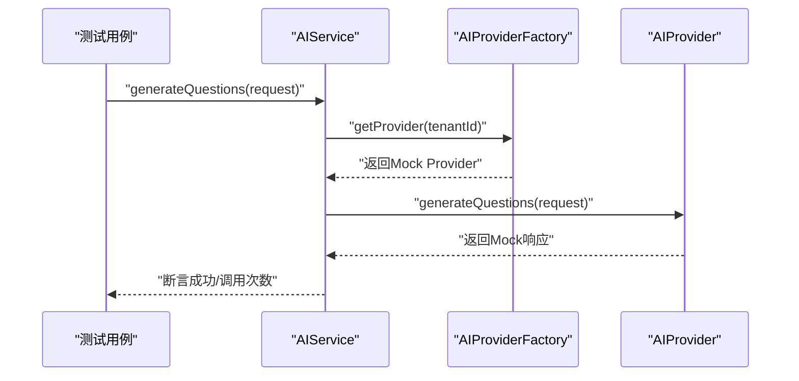
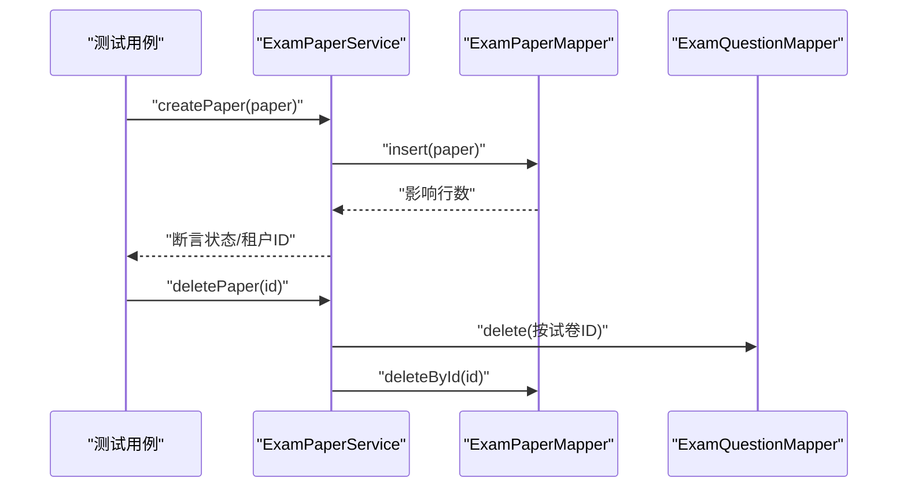
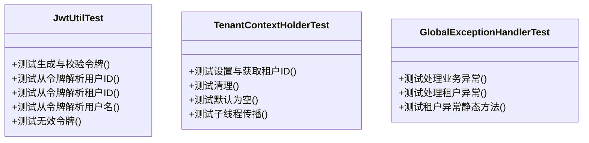
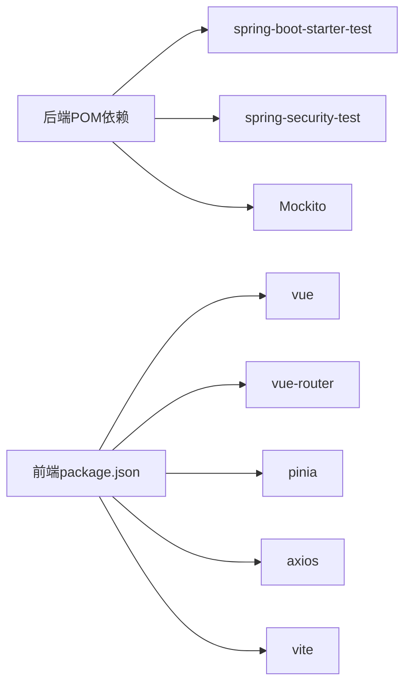

# 测试策略

<cite>
**本文引用的文件**
- [pom.xml](file://backend/pom.xml)
- [application.yml](file://backend/src/main/resources/application.yml)
- [application-h2.yml](file://backend/src/main/resources/application-h2.yml)
- [AIServiceTest.java](file://backend/src/test/java/com/edu/ai/service/AIServiceTest.java)
- [PromptBuilderServiceTest.java](file://backend/src/test/java/com/edu/ai/service/PromptBuilderServiceTest.java)
- [ExamPaperServiceTest.java](file://backend/src/test/java/com/edu/exam/service/ExamPaperServiceTest.java)
- [GradingServiceTest.java](file://backend/src/test/java/com/edu/grading/service/GradingServiceTest.java)
- [GlobalExceptionHandlerTest.java](file://backend/src/test/java/com/edu/common/exception/GlobalExceptionHandlerTest.java)
- [JwtUtilTest.java](file://backend/src/test/java/com/edu/common/util/JwtUtilTest.java)
- [TenantContextHolderTest.java](file://backend/src/test/java/com/edu/common/util/TenantContextHolderTest.java)
- [package.json](file://frontend/package.json)
- [vite.config.ts](file://frontend/vite.config.ts)
- [README.md](file://README.md)
</cite>

## 目录
1. [引言](#引言)
2. [项目结构](#项目结构)
3. [核心组件](#核心组件)
4. [架构总览](#架构总览)
5. [详细组件分析](#详细组件分析)
6. [依赖关系分析](#依赖关系分析)
7. [性能考量](#性能考量)
8. [故障排查指南](#故障排查指南)
9. [结论](#结论)
10. [附录](#附录)

## 引言
本文件面向“教师智能教学系统”项目，系统化阐述测试策略与实践，覆盖测试金字塔（单元测试、集成测试、端到端测试）、后端测试配置与隔离、前端测试方案、AI服务测试的特殊考虑、测试覆盖率与质量门禁、以及持续集成中的测试自动化与报告生成建议。目标是在保障功能正确性的同时，提升系统的稳定性与可维护性。

## 项目结构
项目采用前后端分离架构：后端基于 Spring Boot 3 + MyBatis-Plus，前端基于 Vue 3 + Vite。测试覆盖后端服务层与工具类、AI服务模块、以及前端组件与路由层。后端通过 H2 内存数据库支持快速测试与隔离，同时保留 MySQL 生产配置；前端通过 Vite 的开发服务器与代理配置对接后端 API。

图示来源
- [application.yml:1-65](file://backend/src/main/resources/application.yml#L1-L65)
- [application-h2.yml:1-76](file://backend/src/main/resources/application-h2.yml#L1-L76)
- [vite.config.ts:1-21](file://frontend/vite.config.ts#L1-L21)

章节来源
- [README.md:1-88](file://README.md#L1-L88)
- [pom.xml:1-152](file://backend/pom.xml#L1-L152)
- [application.yml:1-65](file://backend/src/main/resources/application.yml#L1-L65)
- [application-h2.yml:1-76](file://backend/src/main/resources/application-h2.yml#L1-L76)
- [vite.config.ts:1-21](file://frontend/vite.config.ts#L1-L21)

## 核心组件
- 单元测试：广泛使用 JUnit 5 + Mockito 进行服务层与工具类测试，覆盖业务逻辑、异常处理、租户上下文传播与AI服务调用链。
- 集成测试：通过 H2 内存数据库与 Spring Boot 测试配置，验证数据库初始化、Mapper 行为与事务边界。
- 端到端测试：前端通过 Vite 代理访问后端 API，结合浏览器自动化工具进行用户交互与路由测试（建议在 CI 中以 Cypress/Puppeteer 实施）。
- AI 服务测试：重点验证提示词构建、外部 Provider 调用与可用性检测，采用 Mock 对外部依赖进行隔离。
- 质量门禁：建议在 CI 中引入覆盖率检查与静态分析，确保关键路径与异常分支均被覆盖。

章节来源
- [pom.xml:122-132](file://backend/pom.xml#L122-L132)
- [AIServiceTest.java:1-154](file://backend/src/test/java/com/edu/ai/service/AIServiceTest.java#L1-L154)
- [PromptBuilderServiceTest.java:1-105](file://backend/src/test/java/com/edu/ai/service/PromptBuilderServiceTest.java#L1-L105)
- [ExamPaperServiceTest.java:1-166](file://backend/src/test/java/com/edu/exam/service/ExamPaperServiceTest.java#L1-L166)
- [GradingServiceTest.java:1-217](file://backend/src/test/java/com/edu/grading/service/GradingServiceTest.java#L1-L217)
- [GlobalExceptionHandlerTest.java:1-40](file://backend/src/test/java/com/edu/common/exception/GlobalExceptionHandlerTest.java#L1-L40)
- [JwtUtilTest.java:1-56](file://backend/src/test/java/com/edu/common/util/JwtUtilTest.java#L1-L56)
- [TenantContextHolderTest.java:1-48](file://backend/src/test/java/com/edu/common/util/TenantContextHolderTest.java#L1-L48)

## 架构总览
后端测试围绕三层结构展开：控制器层（HTTP 接口）由集成测试覆盖，服务层与工具类由单元测试覆盖，AI 服务通过 Mock Provider 进行行为验证。前端通过 Vite 代理与后端联调，形成端到端闭环。

图示来源
- [pom.xml:122-132](file://backend/pom.xml#L122-L132)
- [application-h2.yml:20-42](file://backend/src/main/resources/application-h2.yml#L20-L42)
- [AIServiceTest.java:26-46](file://backend/src/test/java/com/edu/ai/service/AIServiceTest.java#L26-L46)
- [ExamPaperServiceTest.java:30-50](file://backend/src/test/java/com/edu/exam/service/ExamPaperServiceTest.java#L30-L50)
- [GradingServiceTest.java:32-84](file://backend/src/test/java/com/edu/grading/service/GradingServiceTest.java#L32-L84)
- [JwtUtilTest.java:9-19](file://backend/src/test/java/com/edu/common/util/JwtUtilTest.java#L9-L19)
- [TenantContextHolderTest.java:12-31](file://backend/src/test/java/com/edu/common/util/TenantContextHolderTest.java#L12-L31)
- [vite.config.ts:12-20](file://frontend/vite.config.ts#L12-L20)

## 详细组件分析

### 后端测试配置与隔离
- 测试依赖：后端使用 Spring Boot Starter Test 与 Spring Security Test，便于在测试中注入安全上下文与模拟认证场景。
- 数据库隔离：通过 application-h2.yml 将数据源切换至 H2 内存数据库，并启用 SQL 初始化脚本，确保每次测试在干净状态运行。
- 租户上下文：通过 TenantContextHolder 在测试前设置租户 ID，在测试后清理，避免跨测试污染。

图示来源
- [application-h2.yml:20-42](file://backend/src/main/resources/application-h2.yml#L20-L42)
- [ExamPaperServiceTest.java:42-50](file://backend/src/test/java/com/edu/exam/service/ExamPaperServiceTest.java#L42-L50)
- [TenantContextHolderTest.java:14-31](file://backend/src/test/java/com/edu/common/util/TenantContextHolderTest.java#L14-L31)

章节来源
- [pom.xml:122-132](file://backend/pom.xml#L122-L132)
- [application.yml:15-31](file://backend/src/main/resources/application.yml#L15-L31)
- [application-h2.yml:20-42](file://backend/src/main/resources/application-h2.yml#L20-L42)
- [ExamPaperServiceTest.java:42-50](file://backend/src/test/java/com/edu/exam/service/ExamPaperServiceTest.java#L42-L50)
- [TenantContextHolderTest.java:14-31](file://backend/src/test/java/com/edu/common/util/TenantContextHolderTest.java#L14-L31)

### AI 服务测试
- 提示词构建：验证不同学科、题型、难度与知识点组合下的提示词输出，确保格式与内容符合预期。
- 外部 Provider 模拟：通过 Mock Provider 工厂与具体 Provider，验证调用链、可用性检测与用量统计。
- 租户上下文缺失时的行为：验证默认 Provider 的回退逻辑。

图示来源
- [AIServiceTest.java:48-90](file://backend/src/test/java/com/edu/ai/service/AIServiceTest.java#L48-L90)
- [PromptBuilderServiceTest.java:15-33](file://backend/src/test/java/com/edu/ai/service/PromptBuilderServiceTest.java#L15-L33)

章节来源
- [AIServiceTest.java:1-154](file://backend/src/test/java/com/edu/ai/service/AIServiceTest.java#L1-L154)
- [PromptBuilderServiceTest.java:1-105](file://backend/src/test/java/com/edu/ai/service/PromptBuilderServiceTest.java#L1-L105)

### 服务层与数据访问层测试
- 服务层：验证业务流程、错误处理与外部依赖交互，如发布试卷、添加题目、批改答题卡等。
- 数据访问层：通过 Mock Mapper 验证查询条件、插入/更新行为与级联删除逻辑。

图示来源
- [ExamPaperServiceTest.java:52-112](file://backend/src/test/java/com/edu/exam/service/ExamPaperServiceTest.java#L52-L112)

章节来源
- [ExamPaperServiceTest.java:1-166](file://backend/src/test/java/com/edu/exam/service/ExamPaperServiceTest.java#L1-L166)
- [GradingServiceTest.java:1-217](file://backend/src/test/java/com/edu/grading/service/GradingServiceTest.java#L1-L217)

### 工具类与异常处理测试
- JWT 工具：验证令牌生成、解析与过期判断。
- 租户上下文：验证线程传播与默认值。
- 全局异常处理器：验证业务异常与租户异常的统一响应码与消息。

图示来源
- [JwtUtilTest.java:1-56](file://backend/src/test/java/com/edu/common/util/JwtUtilTest.java#L1-L56)
- [TenantContextHolderTest.java:1-48](file://backend/src/test/java/com/edu/common/util/TenantContextHolderTest.java#L1-L48)
- [GlobalExceptionHandlerTest.java:1-40](file://backend/src/test/java/com/edu/common/exception/GlobalExceptionHandlerTest.java#L1-L40)

章节来源
- [JwtUtilTest.java:1-56](file://backend/src/test/java/com/edu/common/util/JwtUtilTest.java#L1-L56)
- [TenantContextHolderTest.java:1-48](file://backend/src/test/java/com/edu/common/util/TenantContextHolderTest.java#L1-L48)
- [GlobalExceptionHandlerTest.java:1-40](file://backend/src/test/java/com/edu/common/exception/GlobalExceptionHandlerTest.java#L1-L40)

### 前端测试方案
- 组件测试：针对 Vue 组件的渲染、属性传递与事件触发进行单元测试。
- 路由测试：验证路由守卫、参数解析与页面跳转。
- 用户交互测试：通过浏览器自动化工具模拟登录、导航与表单提交等端到端流程。
- 开发与调试：前端通过 Vite 代理将 /api 请求转发至后端，便于联调与 E2E 场景复现。

章节来源
- [package.json:1-25](file://frontend/package.json#L1-L25)
- [vite.config.ts:12-20](file://frontend/vite.config.ts#L12-L20)

## 依赖关系分析
后端测试依赖主要集中在 Spring Boot 测试起步依赖与 Spring Security 测试依赖，配合 Mockito 进行行为模拟与断言。前端依赖 Vue 3、Vue Router、Pinia 与 Axios，开发脚本通过 Vite 启动。

图示来源
- [pom.xml:122-132](file://backend/pom.xml#L122-L132)
- [package.json:1-25](file://frontend/package.json#L1-L25)

章节来源
- [pom.xml:122-132](file://backend/pom.xml#L122-L132)
- [package.json:1-25](file://frontend/package.json#L1-L25)

## 性能考量
- 单元测试优先：通过 Mock 与内存数据库减少 IO 开销，保证测试执行速度。
- 并行执行：合理拆分测试套件，避免共享资源竞争；对需要真实数据库的集成测试进行分组执行。
- 覆盖率监控：在 CI 中引入覆盖率工具，识别未覆盖的关键分支与热点代码。
- 响应时间与吞吐：对 AI 服务调用进行超时与重试策略设计，并在测试中模拟慢响应与失败场景。

## 故障排查指南
- 数据库初始化失败：确认 H2 配置与 SQL 脚本路径正确，检查字符集与编码设置。
- 租户上下文缺失：确保测试前置设置 TenantContextHolder，并在 AfterEach 清理。
- JWT 解析异常：核对密钥与过期时间配置，确保测试中使用一致的密钥与时间戳。
- 前端代理不通：检查 Vite 代理配置与后端端口，确认 /api 前缀匹配。

章节来源
- [application-h2.yml:20-42](file://backend/src/main/resources/application-h2.yml#L20-L42)
- [TenantContextHolderTest.java:14-31](file://backend/src/test/java/com/edu/common/util/TenantContextHolderTest.java#L14-L31)
- [JwtUtilTest.java:13-19](file://backend/src/test/java/com/edu/common/util/JwtUtilTest.java#L13-L19)
- [vite.config.ts:12-20](file://frontend/vite.config.ts#L12-L20)

## 结论
本项目已具备完善的单元测试与部分集成测试基础，覆盖服务层、工具类与 AI 服务关键路径。建议在现有基础上补充端到端测试与覆盖率门禁，并在 CI 中自动化执行，以进一步提升质量与交付效率。

## 附录
- 测试金字塔建议
  - 单元测试：占 70%，重点覆盖服务层与工具类，使用 Mockito 与 H2。
  - 集成测试：占 20%，验证数据库初始化、Mapper 行为与外部依赖交互。
  - 端到端测试：占 10%，通过浏览器自动化验证用户流程与接口连通性。
- 质量门禁建议
  - 行为覆盖率：关键业务路径不低于 80%，异常分支不低于 90%。
  - 技术债阈值：未修复阻塞性缺陷数量为 0，高危缺陷清零。
  - CI 触发：PR 自动触发全量测试，主干合并前强制通过覆盖率与静态分析。
- 持续集成建议
  - 使用 Maven 插件执行后端测试，前端通过 npm scripts 运行测试脚本。
  - 生成测试报告（JUnit XML、HTML），并在制品库中归档。
  - 对 AI 服务调用增加超时与熔断策略，并在测试中模拟失败与降级。