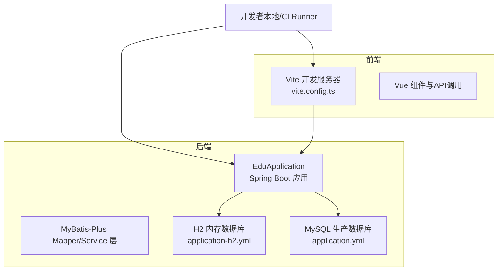
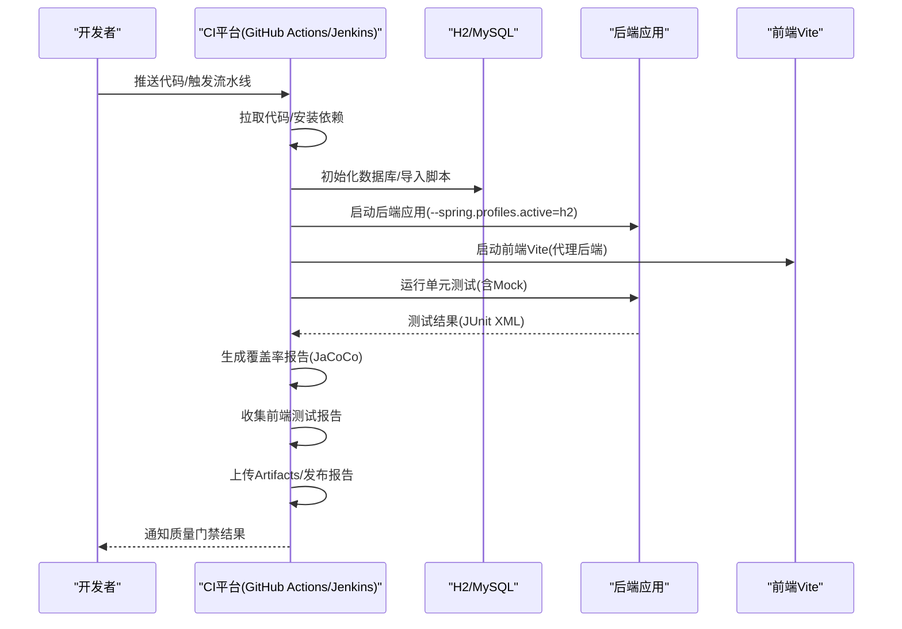
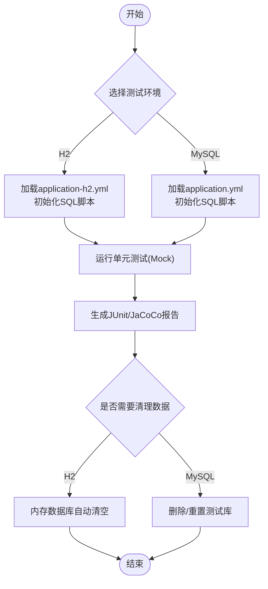
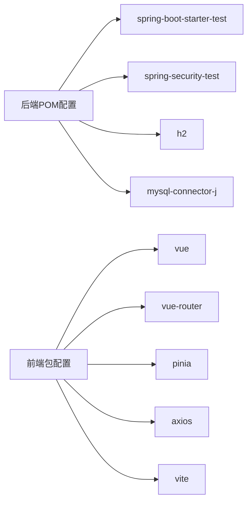

# 测试自动化与CI

<cite>
**本文引用的文件**
- [后端POM配置](file://backend/pom.xml)
- [后端应用配置(application.yml)](file://backend/src/main/resources/application.yml)
- [后端应用配置(application-h2.yml)](file://backend/src/main/resources/application-h2.yml)
- [数据库脚本(create-database.sql)](file://backend/src/main/resources/db/create-database.sql)
- [数据库脚本(schema.sql)](file://backend/src/main/resources/db/schema.sql)
- [数据库脚本(init-data.sql)](file://backend/src/main/resources/db/init-data.sql)
- [后端启动脚本(start-h2.bat)](file://backend/start-h2.bat)
- [后端启动脚本(start.bat)](file://backend/start.bat)
- [前端Vite配置(vite.config.ts)](file://frontend/vite.config.ts)
- [前端包配置(package.json)](file://frontend/package.json)
- [AI服务测试(AIServiceTest.java)](file://backend/src/test/java/com/edu/ai/service/AIServiceTest.java)
- [试卷服务测试(ExamPaperServiceTest.java)](file://backend/src/test/java/com/edu/exam/service/ExamPaperServiceTest.java)
- [.gitignore(根目录)](file://.gitignore)
- [.gitignore(后端)](file://backend/.gitignore)
</cite>

## 目录
1. [简介](#简介)
2. [项目结构](#项目结构)
3. [核心组件](#核心组件)
4. [架构总览](#架构总览)
5. [详细组件分析](#详细组件分析)
6. [依赖分析](#依赖分析)
7. [性能考虑](#性能考虑)
8. [故障排查指南](#故障排查指南)
9. [结论](#结论)
10. [附录](#附录)

## 简介
本文件面向测试自动化与持续集成（CI/CD）场景，结合当前仓库中的后端与前端测试现状，给出测试自动化配置、测试报告生成与发布、测试环境管理、测试质量门禁、并行化策略、资源管理与结果分析、以及测试维护与重构建议。由于仓库未包含CI配置文件，本文提供通用且可落地的配置思路与最佳实践，便于在GitHub Actions、Jenkins或其他CI平台上实施。

## 项目结构
- 后端采用Spring Boot + MyBatis-Plus，使用H2内存数据库进行本地测试，同时支持MySQL生产环境。
- 前端采用Vue 3 + Vite，通过代理访问后端API。
- 测试覆盖AI服务、业务服务（如试卷）、异常处理与工具类等模块，广泛使用Mockito进行单元测试。

图表来源
- [后端应用配置(application.yml):1-65](file://backend/src/main/resources/application.yml#L1-L65)
- [后端应用配置(application-h2.yml):1-76](file://backend/src/main/resources/application-h2.yml#L1-L76)
- [前端Vite配置(vite.config.ts):1-21](file://frontend/vite.config.ts#L1-L21)

章节来源
- [后端应用配置(application.yml):1-65](file://backend/src/main/resources/application.yml#L1-L65)
- [后端应用配置(application-h2.yml):1-76](file://backend/src/main/resources/application-h2.yml#L1-L76)
- [前端Vite配置(vite.config.ts):1-21](file://frontend/vite.config.ts#L1-L21)

## 核心组件
- 单元测试与Mock：广泛使用JUnit 5 + Mockito，对服务层进行隔离测试，模拟外部依赖（如AI Provider）。
- 数据库初始化：通过SQL脚本创建数据库、表结构与基础数据；H2模式下自动执行初始化。
- 前端开发与代理：Vite本地开发服务器，代理到后端8080端口，便于端到端联调。
- 构建与运行：Maven构建后端，批处理脚本启动应用；前端使用npm/yarn脚本进行构建与预览。

章节来源
- [后端POM配置:122-132](file://backend/pom.xml#L122-L132)
- [数据库脚本(schema.sql):1-379](file://backend/src/main/resources/db/schema.sql#L1-L379)
- [数据库脚本(init-data.sql):1-89](file://backend/src/main/resources/db/init-data.sql#L1-L89)
- [后端启动脚本(start-h2.bat):1-12](file://backend/start-h2.bat#L1-L12)
- [前端包配置(package.json):1-25](file://frontend/package.json#L1-L25)

## 架构总览
下图展示测试自动化在CI中的典型流程：拉取代码 → 安装依赖 → 启动数据库/H2 → 运行单元测试 → 生成报告 → 发布Artifacts → 质量门禁判定。

## 详细组件分析

### 测试自动化配置（CI/CD）
- GitHub Actions（示例思路）
  - 作业拆分：安装JDK/Maven/Node → 缓存依赖 → 后端测试与覆盖率 → 前端测试与构建 → 上传报告与Artifacts。
  - 关键步骤要点
    - 使用actions/setup-java与actions/setup-node。
    - 使用cache缓存Maven/Node依赖以提升速度。
    - 后端使用Maven命令执行测试，配合Surefire/Failsafe插件输出JUnit XML。
    - 使用Jacoco插件生成覆盖率报告，上传到CI平台或覆盖率服务。
    - 前端使用npm/yarn执行测试与构建，收集测试报告。
    - 使用部署/发布动作上传Artifacts或发布制品。
- Jenkins（示例思路）
  - Pipeline阶段：Checkout → Install JDK/Maven/Node → Cache/Restore → Backend Test + Jacoco → Frontend Test + Build → Publish Reports → Quality Gate。
  - 插件建议：JUnit、JaCoCo、Artifact Archiving、Warnings Next Generation。
- 其他CI工具（GitLab CI/Azure DevOps）
  - 步骤与上述类似：多阶段并行执行、报告聚合、质量门禁。

说明：以上为通用配置思路，具体YAML/Jenkinsfile请按各平台官方文档编写。

### 测试报告生成与发布
- JUnit XML报告
  - 后端：Maven Surefire/Failsafe插件默认生成JUnit XML报告，可在CI中归档。
  - 前端：Vitest/Jest等测试框架可输出JUnit格式报告，供CI归档。
- JaCoCo覆盖率报告
  - 后端：Maven Jacoco插件生成覆盖率报告，CI中上传至覆盖率服务或作为制品。
  - 前端：Istanbul/NYC等工具生成覆盖率报告，供CI归档。
- 前端测试报告
  - 前端测试框架（如Vitest/Jest）输出HTML/XML报告，CI中统一归档。

### 测试环境管理
- 测试数据库初始化
  - H2内存数据库：通过application-h2.yml启用内存数据库与SQL初始化，适合快速本地与CI测试。
  - MySQL：通过application.yml连接本地或CI专用MySQL实例，配合schema.sql与init-data.sql初始化。
- 外部服务Mock
  - 单元测试中广泛使用Mockito对AI Provider、Mapper等外部依赖进行Mock，确保测试稳定与可重复。
- 测试数据清理
  - H2内存数据库每次重启即清空，适合短生命周期测试。
  - MySQL测试库建议在CI任务结束后执行DROP DATABASE或TRUNCATE表，避免污染。

图表来源
- [后端应用配置(application-h2.yml):20-37](file://backend/src/main/resources/application-h2.yml#L20-L37)
- [后端应用配置(application.yml):8-13](file://backend/src/main/resources/application.yml#L8-L13)
- [数据库脚本(schema.sql):1-379](file://backend/src/main/resources/db/schema.sql#L1-L379)
- [数据库脚本(init-data.sql):1-89](file://backend/src/main/resources/db/init-data.sql#L1-L89)

章节来源
- [后端应用配置(application-h2.yml):1-76](file://backend/src/main/resources/application-h2.yml#L1-L76)
- [后端应用配置(application.yml):1-65](file://backend/src/main/resources/application.yml#L1-L65)
- [数据库脚本(schema.sql):1-379](file://backend/src/main/resources/db/schema.sql#L1-L379)
- [数据库脚本(init-data.sql):1-89](file://backend/src/main/resources/db/init-data.sql#L1-L89)

### 测试质量门禁
- 代码覆盖率阈值（示例）
  - 行覆盖率/分支覆盖率不低于80%，关键路径不低于90%。
  - 通过CI插件或覆盖率服务设定阈值，失败则阻断合并。
- 测试通过率要求
  - 必须全部通过，否则阻断合并；允许特定测试跳过（需明确标注）。
- 性能回归检测（建议）
  - 对关键接口添加基准测试（如JMH），监控响应时间与吞吐量。
  - CI中对比历史数据，超过阈值则告警。

### 测试并行化策略与资源管理
- 并行化
  - 后端：按模块拆分测试套件（AI、Exam、Grading、Common等），在CI中并行执行。
  - 前端：不同页面/功能域测试并行，注意共享资源（如代理端口）冲突。
- 资源管理
  - 数据库：H2单实例；MySQL使用独立测试库或容器化实例。
  - 代理端口：前端Vite端口与后端端口分离，避免冲突。
  - 缓存与依赖：利用CI缓存机制减少下载时间。

### 测试结果分析
- 报告聚合：将JUnit XML与JaCoCo报告上传至CI平台，生成趋势图与差异对比。
- 失败定位：结合日志与堆栈，优先修复高影响失败用例。
- 回归验证：每次修复后重新运行相关模块测试，确保不引入新问题。

### 测试维护策略与重构指南
- 保持测试独立性：每个测试只关注单一行为，避免相互依赖。
- Mock策略：对外部依赖尽量Mock，减少对网络与数据库的依赖。
- 数据驱动：对相似场景使用参数化测试，提高覆盖面。
- 可读性：测试命名清晰表达意图，断言信息明确。
- 重构原则：当被测代码重构时，同步更新测试；删除无意义的测试，补充缺失场景。

## 依赖分析
- 后端依赖
  - Spring Boot Starter Test与Spring Security Test用于测试支撑。
  - H2数据库用于测试环境，MySQL驱动用于生产环境。
- 前端依赖
  - Vue 3、Vite、Vue Router、Pinia、Axios等，开发与构建工具链完善。
- 构建与运行
  - Maven负责后端打包与测试；批处理脚本用于本地启动；Vite负责前端开发与代理。

图表来源
- [后端POM配置:29-132](file://backend/pom.xml#L29-L132)
- [前端包配置(package.json):1-25](file://frontend/package.json#L1-L25)

章节来源
- [后端POM配置:29-132](file://backend/pom.xml#L29-L132)
- [前端包配置(package.json):1-25](file://frontend/package.json#L1-L25)

## 性能考虑
- 测试执行时间
  - 将大模块测试拆分为多个Job并行执行，缩短整体耗时。
  - 使用缓存加速依赖下载，避免重复构建。
- 资源占用
  - 控制并发度，避免数据库与CPU争用。
  - 使用容器化数据库，按需启停，降低资源消耗。

## 故障排查指南
- 数据库初始化失败
  - 检查application.yml与application-h2.yml中的SQL初始化配置与脚本路径。
  - 确认数据库驱动与连接参数正确。
- 测试超时或不稳定
  - 检查Mock配置是否完整，必要时增加超时与重试策略。
  - 分析测试间是否存在共享状态或竞态条件。
- 前端代理问题
  - 确认Vite代理目标与端口与后端一致，避免跨域与端口冲突。
- CI缓存失效
  - 检查缓存键是否包含依赖版本信息，避免脏缓存导致的问题。

章节来源
- [后端应用配置(application.yml):15-19](file://backend/src/main/resources/application.yml#L15-L19)
- [后端应用配置(application-h2.yml):21-25](file://backend/src/main/resources/application-h2.yml#L21-L25)
- [前端Vite配置(vite.config.ts):12-20](file://frontend/vite.config.ts#L12-L20)

## 结论
本项目具备良好的测试基础（Mock、SQL初始化、前后端分离），结合本文提供的CI配置思路与质量门禁建议，可快速搭建稳定高效的测试自动化流水线。建议优先在CI中启用并行化与覆盖率统计，持续优化测试稳定性与执行效率。

## 附录
- 启动与运行参考
  - 后端H2模式启动：使用批处理脚本启动应用并激活H2配置。
  - 前端开发：使用Vite代理访问后端API，便于联调。
- 文件与目录
  - .gitignore已忽略后端target与前端dist，避免无关文件进入版本控制。

章节来源
- [后端启动脚本(start-h2.bat):1-12](file://backend/start-h2.bat#L1-L12)
- [后端启动脚本(start.bat):1-15](file://backend/start.bat#L1-L15)
- [前端Vite配置(vite.config.ts):1-21](file://frontend/vite.config.ts#L1-L21)
- [.gitignore(根目录):1-32](file://.gitignore#L1-L32)
- [.gitignore(后端):1-44](file://backend/.gitignore#L1-L44)