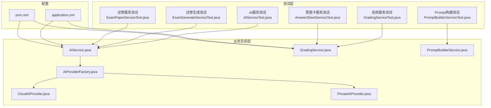
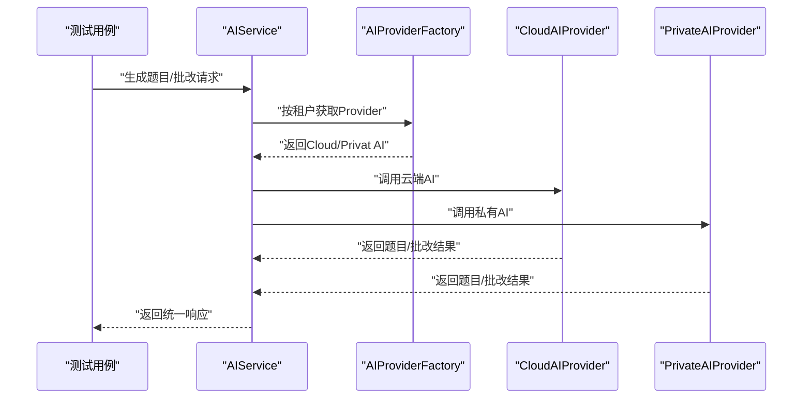
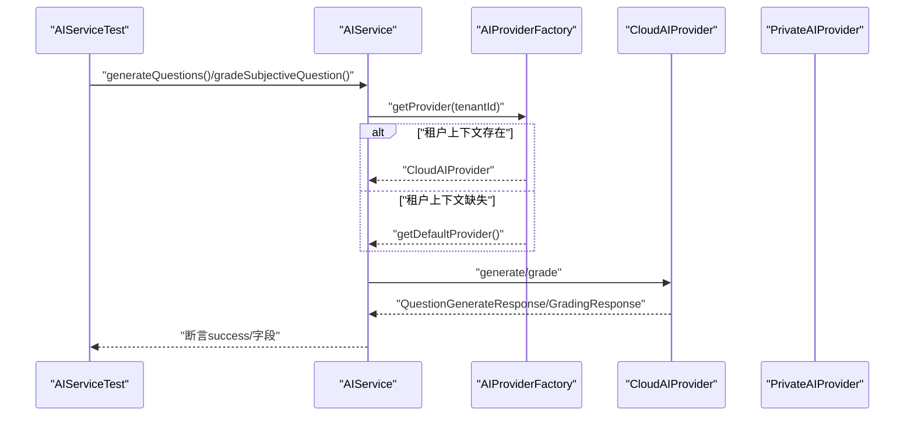
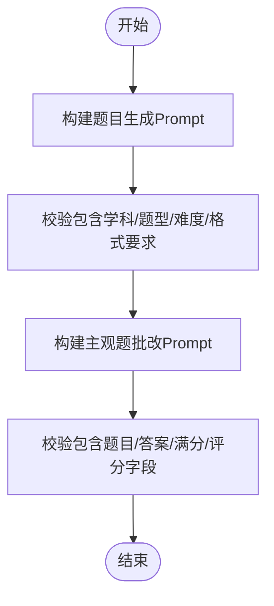
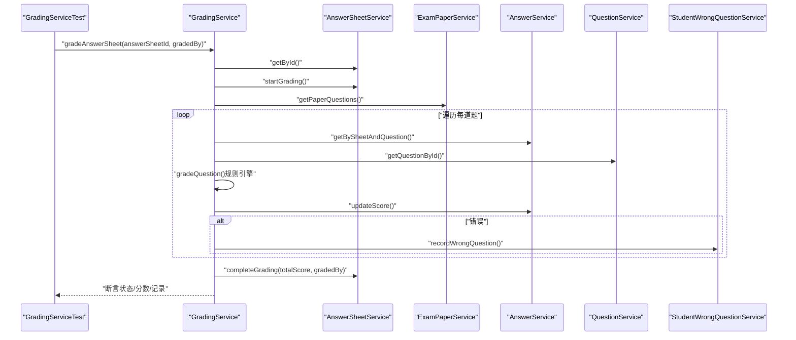
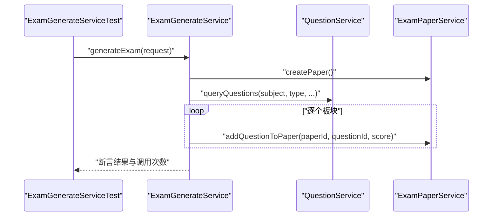
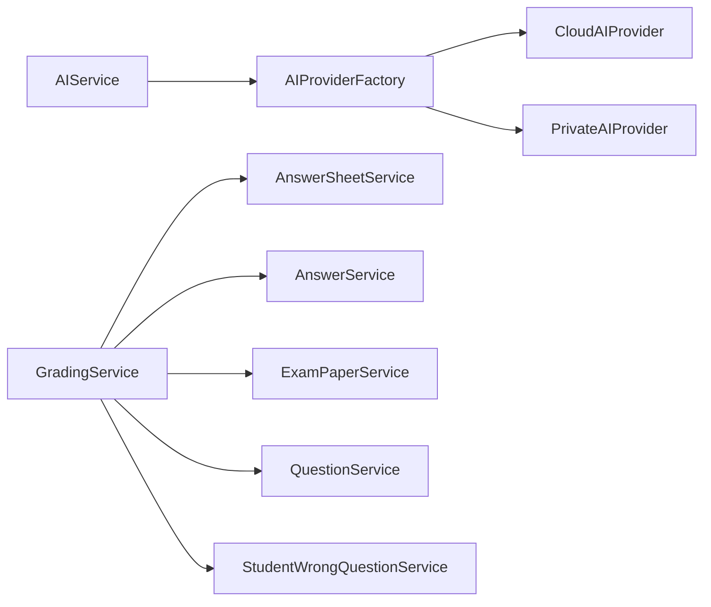

# 集成测试

<cite>
**本文引用的文件**
- [AIServiceTest.java](file://backend/src/test/java/com/edu/ai/service/AIServiceTest.java)
- [PromptBuilderServiceTest.java](file://backend/src/test/java/com/edu/ai/service/PromptBuilderServiceTest.java)
- [GradingServiceTest.java](file://backend/src/test/java/com/edu/grading/service/GradingServiceTest.java)
- [ExamGenerateServiceTest.java](file://backend/src/test/java/com/edu/exam/service/ExamGenerateServiceTest.java)
- [ExamPaperServiceTest.java](file://backend/src/test/java/com/edu/exam/service/ExamPaperServiceTest.java)
- [AnswerSheetServiceTest.java](file://backend/src/test/java/com/edu/grading/service/AnswerSheetServiceTest.java)
- [AIService.java](file://backend/src/main/java/com/edu/ai/service/AIService.java)
- [GradingService.java](file://backend/src/main/java/com/edu/grading/service/GradingService.java)
- [AIProviderFactory.java](file://backend/src/main/java/com/edu/ai/provider/AIProviderFactory.java)
- [CloudAIProvider.java](file://backend/src/main/java/com/edu/ai/provider/CloudAIProvider.java)
- [PrivateAIProvider.java](file://backend/src/main/java/com/edu/ai/provider/PrivateAIProvider.java)
- [PromptBuilderService.java](file://backend/src/main/java/com/edu/ai/service/PromptBuilderService.java)
- [application.yml](file://backend/src/main/resources/application.yml)
- [pom.xml](file://backend/pom.xml)
</cite>

## 目录
1. [引言](#引言)
2. [项目结构](#项目结构)
3. [核心组件](#核心组件)
4. [架构总览](#架构总览)
5. [详细组件分析](#详细组件分析)
6. [依赖分析](#依赖分析)
7. [性能考虑](#性能考虑)
8. [故障排查指南](#故障排查指南)
9. [结论](#结论)
10. [附录](#附录)

## 引言
本文件面向后端系统集成测试，聚焦于模块间接口测试、服务组合测试与数据流测试。文档覆盖三大场景：
- AI服务集成测试：云端AI提供商切换、响应格式校验与错误处理
- 批改服务集成测试：答案提交流程、评分算法验证与分析结果生成
- 考试管理集成测试：试卷生成流程、发布机制与状态流转
同时提供测试环境搭建指南、执行策略、失败排查与性能监控建议。

## 项目结构
后端采用Spring Boot工程，测试集中在backend/src/test目录下，分别覆盖AI、批改、考试与通用工具模块。核心配置位于application.yml，依赖在pom.xml中声明。

**图表来源**
- [AIServiceTest.java:1-154](file://backend/src/test/java/com/edu/ai/service/AIServiceTest.java#L1-L154)
- [GradingServiceTest.java:1-217](file://backend/src/test/java/com/edu/grading/service/GradingServiceTest.java#L1-L217)
- [ExamGenerateServiceTest.java:1-153](file://backend/src/test/java/com/edu/exam/service/ExamGenerateServiceTest.java#L1-L153)
- [ExamPaperServiceTest.java:1-166](file://backend/src/test/java/com/edu/exam/service/ExamPaperServiceTest.java#L1-L166)
- [AnswerSheetServiceTest.java:1-148](file://backend/src/test/java/com/edu/grading/service/AnswerSheetServiceTest.java#L1-L148)
- [PromptBuilderServiceTest.java:1-105](file://backend/src/test/java/com/edu/ai/service/PromptBuilderServiceTest.java#L1-L105)
- [AIService.java:1-102](file://backend/src/main/java/com/edu/ai/service/AIService.java#L1-L102)
- [GradingService.java:1-232](file://backend/src/main/java/com/edu/grading/service/GradingService.java#L1-L232)
- [AIProviderFactory.java:1-67](file://backend/src/main/java/com/edu/ai/provider/AIProviderFactory.java#L1-L67)
- [CloudAIProvider.java:1-267](file://backend/src/main/java/com/edu/ai/provider/CloudAIProvider.java#L1-L267)
- [PrivateAIProvider.java:1-195](file://backend/src/main/java/com/edu/ai/provider/PrivateAIProvider.java#L1-L195)
- [PromptBuilderService.java:1-121](file://backend/src/main/java/com/edu/ai/service/PromptBuilderService.java#L1-L121)
- [application.yml:1-65](file://backend/src/main/resources/application.yml#L1-L65)
- [pom.xml:1-152](file://backend/pom.xml#L1-L152)

**章节来源**
- [AIServiceTest.java:1-154](file://backend/src/test/java/com/edu/ai/service/AIServiceTest.java#L1-L154)
- [GradingServiceTest.java:1-217](file://backend/src/test/java/com/edu/grading/service/GradingServiceTest.java#L1-L217)
- [ExamGenerateServiceTest.java:1-153](file://backend/src/test/java/com/edu/exam/service/ExamGenerateServiceTest.java#L1-L153)
- [ExamPaperServiceTest.java:1-166](file://backend/src/test/java/com/edu/exam/service/ExamPaperServiceTest.java#L1-L166)
- [AnswerSheetServiceTest.java:1-148](file://backend/src/test/java/com/edu/grading/service/AnswerSheetServiceTest.java#L1-L148)
- [PromptBuilderServiceTest.java:1-105](file://backend/src/test/java/com/edu/ai/service/PromptBuilderServiceTest.java#L1-L105)
- [AIService.java:1-102](file://backend/src/main/java/com/edu/ai/service/AIService.java#L1-L102)
- [GradingService.java:1-232](file://backend/src/main/java/com/edu/grading/service/GradingService.java#L1-L232)
- [AIProviderFactory.java:1-67](file://backend/src/main/java/com/edu/ai/provider/AIProviderFactory.java#L1-L67)
- [CloudAIProvider.java:1-267](file://backend/src/main/java/com/edu/ai/provider/CloudAIProvider.java#L1-L267)
- [PrivateAIProvider.java:1-195](file://backend/src/main/java/com/edu/ai/provider/PrivateAIProvider.java#L1-L195)
- [PromptBuilderService.java:1-121](file://backend/src/main/java/com/edu/ai/service/PromptBuilderService.java#L1-L121)
- [application.yml:1-65](file://backend/src/main/resources/application.yml#L1-L65)
- [pom.xml:1-152](file://backend/pom.xml#L1-L152)

## 核心组件
- AI服务统一入口：负责根据租户上下文选择AI提供商，封装题目生成与主观题批改能力，并提供状态与用量查询。
- 批改服务：基于规则引擎对不同题型进行评分，记录错题并更新答题卡状态。
- 试卷服务：负责试卷创建、发布、删除、题目添加与查询。
- 答题卡服务：负责答题卡生命周期管理（创建、提交、批改完成）。
- Prompt构建服务：为云端/私有AI提供标准化提示词模板。
- AI提供商工厂：依据租户配置动态选择云端或私有AI服务。
- 云端/私有AI提供商：实现对外部AI服务的HTTP调用、响应解析与用量统计。

**章节来源**
- [AIService.java:1-102](file://backend/src/main/java/com/edu/ai/service/AIService.java#L1-L102)
- [GradingService.java:1-232](file://backend/src/main/java/com/edu/grading/service/GradingService.java#L1-L232)
- [AIProviderFactory.java:1-67](file://backend/src/main/java/com/edu/ai/provider/AIProviderFactory.java#L1-L67)
- [CloudAIProvider.java:1-267](file://backend/src/main/java/com/edu/ai/provider/CloudAIProvider.java#L1-L267)
- [PrivateAIProvider.java:1-195](file://backend/src/main/java/com/edu/ai/provider/PrivateAIProvider.java#L1-L195)
- [PromptBuilderService.java:1-121](file://backend/src/main/java/com/edu/ai/service/PromptBuilderService.java#L1-L121)

## 架构总览
下图展示AI服务与批改服务在集成测试中的交互路径，以及与外部AI提供商的关系。

**图表来源**
- [AIService.java:27-82](file://backend/src/main/java/com/edu/ai/service/AIService.java#L27-L82)
- [AIProviderFactory.java:27-44](file://backend/src/main/java/com/edu/ai/provider/AIProviderFactory.java#L27-L44)
- [CloudAIProvider.java:53-105](file://backend/src/main/java/com/edu/ai/provider/CloudAIProvider.java#L53-L105)
- [PrivateAIProvider.java:44-172](file://backend/src/main/java/com/edu/ai/provider/PrivateAIProvider.java#L44-L172)

## 详细组件分析

### AI服务集成测试
- 测试目标
  - 云端AI提供商切换：通过租户上下文与默认Provider路径验证。
  - 响应格式验证：题目生成与主观题批改返回结构的正确性。
  - 错误处理测试：Provider不可用、参数缺失时的行为。
- 关键测试点
  - 生成题目成功路径、批改成功路径、状态检查、Provider名称与用量统计。
  - 租户上下文缺失时回退至默认Provider。
- 数据流与接口
  - AIService依赖AIProviderFactory；Factory根据租户配置选择Cloud或Private Provider；Provider通过HTTP调用外部AI并解析JSON响应。

**图表来源**
- [AIServiceTest.java:48-153](file://backend/src/test/java/com/edu/ai/service/AIServiceTest.java#L48-L153)
- [AIService.java:27-82](file://backend/src/main/java/com/edu/ai/service/AIService.java#L27-L82)
- [AIProviderFactory.java:27-66](file://backend/src/main/java/com/edu/ai/provider/AIProviderFactory.java#L27-L66)
- [CloudAIProvider.java:53-105](file://backend/src/main/java/com/edu/ai/provider/CloudAIProvider.java#L53-L105)

**章节来源**
- [AIServiceTest.java:1-154](file://backend/src/test/java/com/edu/ai/service/AIServiceTest.java#L1-L154)
- [AIService.java:1-102](file://backend/src/main/java/com/edu/ai/service/AIService.java#L1-L102)
- [AIProviderFactory.java:1-67](file://backend/src/main/java/com/edu/ai/provider/AIProviderFactory.java#L1-L67)
- [CloudAIProvider.java:1-267](file://backend/src/main/java/com/edu/ai/provider/CloudAIProvider.java#L1-L267)
- [PrivateAIProvider.java:1-195](file://backend/src/main/java/com/edu/ai/provider/PrivateAIProvider.java#L1-L195)

### Prompt构建服务测试
- 测试目标
  - 题目生成Prompt：学科、题型、难度、知识点、附加要求与JSON格式约束。
  - 主观题批改Prompt：题目、标准答案、学生答案、满分与评分字段。
- 关键测试点
  - 构建后的Prompt包含预期关键词与格式要求。
- 实现要点
  - PromptBuilderService提供模板化构建方法，保证与AI服务期望的输入一致。

**图表来源**
- [PromptBuilderServiceTest.java:16-104](file://backend/src/test/java/com/edu/ai/service/PromptBuilderServiceTest.java#L16-L104)
- [PromptBuilderService.java:17-90](file://backend/src/main/java/com/edu/ai/service/PromptBuilderService.java#L17-L90)

**章节来源**
- [PromptBuilderServiceTest.java:1-105](file://backend/src/test/java/com/edu/ai/service/PromptBuilderServiceTest.java#L1-L105)
- [PromptBuilderService.java:1-121](file://backend/src/main/java/com/edu/ai/service/PromptBuilderService.java#L1-L121)

### 批改服务集成测试
- 测试目标
  - 答题卡生命周期：创建、提交、批改完成。
  - 评分算法验证：选择题、填空题、判断题、计算题的计分逻辑。
  - 分析结果生成：错题记录与总分更新。
- 关键测试点
  - 正确答案与错误答案的得分与是否正确标记。
  - 填空题多答案与模糊匹配、计算题数值近似匹配。
  - 未作答场景的0分处理与错题记录。
- 数据流与接口
  - GradingService协调AnswerSheetService、AnswerService、ExamPaperService、QuestionService与StudentWrongQuestionService。

**图表来源**
- [GradingServiceTest.java:86-216](file://backend/src/test/java/com/edu/grading/service/GradingServiceTest.java#L86-L216)
- [GradingService.java:34-80](file://backend/src/main/java/com/edu/grading/service/GradingService.java#L34-L80)

**章节来源**
- [GradingServiceTest.java:1-217](file://backend/src/test/java/com/edu/grading/service/GradingServiceTest.java#L1-L217)
- [GradingService.java:1-232](file://backend/src/main/java/com/edu/grading/service/GradingService.java#L1-L232)

### 考试管理集成测试
- 测试目标
  - 试卷生成：按结构配置从题库抽取题目并组装试卷。
  - 发布机制：状态变更与发布时间设置。
  - 状态流转：创建、发布、删除、查询等状态与关联操作。
- 关键测试点
  - 单/多板块生成、题目数量不足时的降级策略。
  - 发布前状态校验、发布后的状态与时间字段。
  - 删除试卷时联动删除题目关系。

**图表来源**
- [ExamGenerateServiceTest.java:68-141](file://backend/src/test/java/com/edu/exam/service/ExamGenerateServiceTest.java#L68-L141)
- [ExamPaperServiceTest.java:80-121](file://backend/src/test/java/com/edu/exam/service/ExamPaperServiceTest.java#L80-L121)

**章节来源**
- [ExamGenerateServiceTest.java:1-153](file://backend/src/test/java/com/edu/exam/service/ExamGenerateServiceTest.java#L1-L153)
- [ExamPaperServiceTest.java:1-166](file://backend/src/test/java/com/edu/exam/service/ExamPaperServiceTest.java#L1-L166)

### 答题卡服务集成测试
- 测试目标
  - 答题卡创建：重复性校验与租户上下文校验。
  - 提交与批改完成：状态变更与时间戳更新。
  - 查询统计：按考试分页与计数。
- 关键测试点
  - 重复创建抛出业务异常。
  - 缺失租户上下文时创建失败。
  - 状态机：草稿→已提交→批改中→已完成。

**章节来源**
- [AnswerSheetServiceTest.java:1-148](file://backend/src/test/java/com/edu/grading/service/AnswerSheetServiceTest.java#L1-L148)

## 依赖分析
- 组件耦合
  - AIService高内聚地封装Provider选择与调用，降低上层对具体Provider的感知。
  - GradingService通过多个Service协作完成批改，职责清晰。
- 外部依赖
  - AI服务：云端/私有HTTP调用；配置来源于application.yml。
  - 数据持久化：MyBatis-Plus映射器由测试层通过Mock替代真实数据库。
- 潜在循环依赖
  - 当前未见直接循环依赖；Provider工厂与具体Provider通过接口解耦。

**图表来源**
- [AIService.java:22-29](file://backend/src/main/java/com/edu/ai/service/AIService.java#L22-L29)
- [AIProviderFactory.java:20-22](file://backend/src/main/java/com/edu/ai/provider/AIProviderFactory.java#L20-L22)
- [GradingService.java:25-29](file://backend/src/main/java/com/edu/grading/service/GradingService.java#L25-L29)

**章节来源**
- [AIService.java:1-102](file://backend/src/main/java/com/edu/ai/service/AIService.java#L1-L102)
- [GradingService.java:1-232](file://backend/src/main/java/com/edu/grading/service/GradingService.java#L1-L232)
- [AIProviderFactory.java:1-67](file://backend/src/main/java/com/edu/ai/provider/AIProviderFactory.java#L1-L67)

## 性能考虑
- 并发与事务
  - 批改服务使用事务包裹整张答题卡的批改过程，避免中间态写入。
- 调用链路
  - AIService仅做薄调度，实际耗时取决于外部AI服务；建议在测试中对Provider进行Mock以隔离网络抖动。
- 日志与可观测性
  - AIService与Provider均输出关键日志，便于定位耗时环节。
- 配置优化
  - application.yml中定义了数据库连接池与MyBatis配置，建议在测试环境中适当调整以提升并发。

[本节为通用指导，不直接分析具体文件]

## 故障排查指南
- AI服务不可用
  - 现象：生成/批改返回错误消息或失败标志。
  - 排查：确认apiKey配置、Provider健康检查、网络连通性。
  - 参考：CloudAIProvider与PrivateAIProvider的可用性检查与错误分支。
- 租户上下文缺失
  - 现象：创建试卷/答题卡抛出业务异常。
  - 排查：确认TenantContextHolder设置与测试初始化。
  - 参考：ExamPaperServiceTest与AnswerSheetServiceTest中对应断言。
- 评分异常
  - 现象：填空/计算题得分与预期不符。
  - 排查：核对normalize与parseBoolean逻辑、数值精度与容差。
  - 参考：GradingServiceTest中多场景断言与GradingService规则引擎实现。
- 试卷生成不足
  - 现象：按结构生成的题目数量少于需求。
  - 排查：确认题库查询条件与Mock数据规模。
  - 参考：ExamGenerateServiceTest中“题目数量不足”用例。

**章节来源**
- [CloudAIProvider.java:108-120](file://backend/src/main/java/com/edu/ai/provider/CloudAIProvider.java#L108-L120)
- [PrivateAIProvider.java:174-184](file://backend/src/main/java/com/edu/ai/provider/PrivateAIProvider.java#L174-L184)
- [ExamPaperServiceTest.java:72-78](file://backend/src/test/java/com/edu/exam/service/ExamPaperServiceTest.java#L72-L78)
- [AnswerSheetServiceTest.java:60-64](file://backend/src/test/java/com/edu/grading/service/AnswerSheetServiceTest.java#L60-L64)
- [GradingServiceTest.java:146-180](file://backend/src/test/java/com/edu/grading/service/GradingServiceTest.java#L146-L180)
- [ExamGenerateServiceTest.java:121-141](file://backend/src/test/java/com/edu/exam/service/ExamGenerateServiceTest.java#L121-L141)

## 结论
本文梳理了AI服务、批改服务与考试管理在集成测试层面的关键路径与验证点，明确了模块间接口契约、数据流与错误处理策略。通过Mock外部依赖与强约束的断言，可在不依赖真实外部服务的情况下稳定验证核心业务流程。建议在持续集成中引入上述测试集，并结合日志与配置优化保障系统稳定性与性能。

[本节为总结性内容，不直接分析具体文件]

## 附录

### 测试环境搭建指南
- 数据库
  - 使用MySQL或H2（测试专用）。H2脚本位于resources/db，可通过启动脚本快速初始化。
- 外部服务Mock
  - 在测试中使用Mockito替换AI Provider与Mapper，避免真实HTTP调用与数据库写入。
- 测试数据准备
  - 使用测试类中的Mock对象构造典型场景（如答题卡、试卷、题目），覆盖边界条件。
- 配置
  - application.yml中定义了AI提供商、数据库连接、Redis自动装配排除等，测试时可按需覆盖。

**章节来源**
- [application.yml:15-65](file://backend/src/main/resources/application.yml#L15-L65)
- [pom.xml:62-67](file://backend/pom.xml#L62-L67)

### 执行策略与失败排查
- 执行策略
  - 将AI、批改、考试与通用工具测试分别运行，优先验证核心流程再扩展边界场景。
  - 对AI相关测试，建议先验证Prompt构建与Provider选择，再验证完整调用链。
- 失败排查
  - 优先查看日志与断言失败点，结合图表定位调用链路。
  - 对评分异常，重点核对normalize与parseBoolean逻辑及数值比较容差。

[本节为通用指导，不直接分析具体文件]