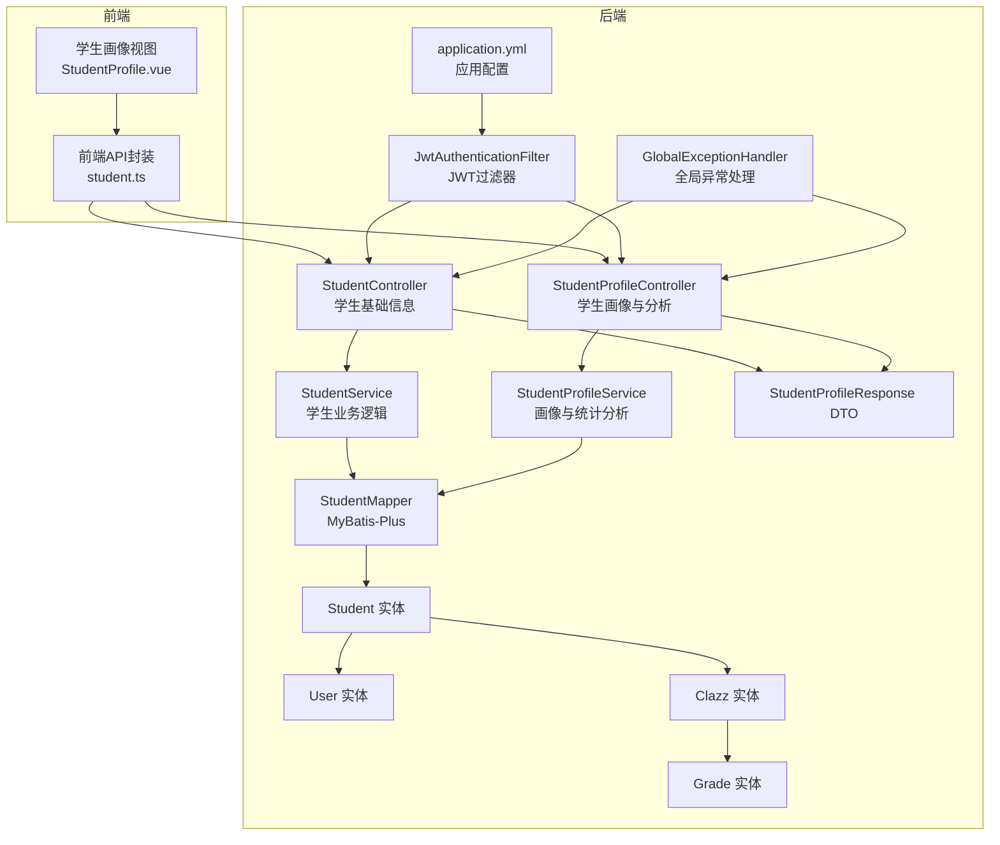
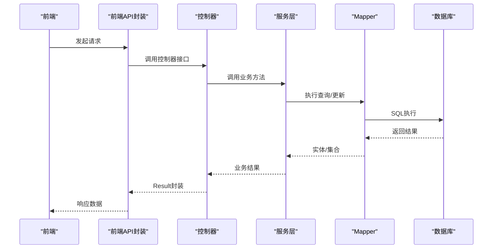
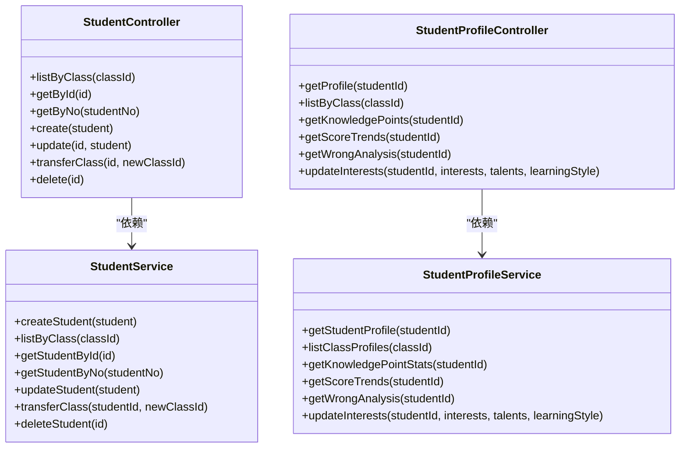
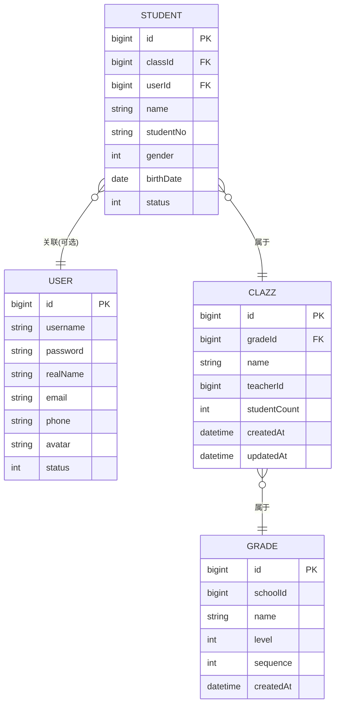
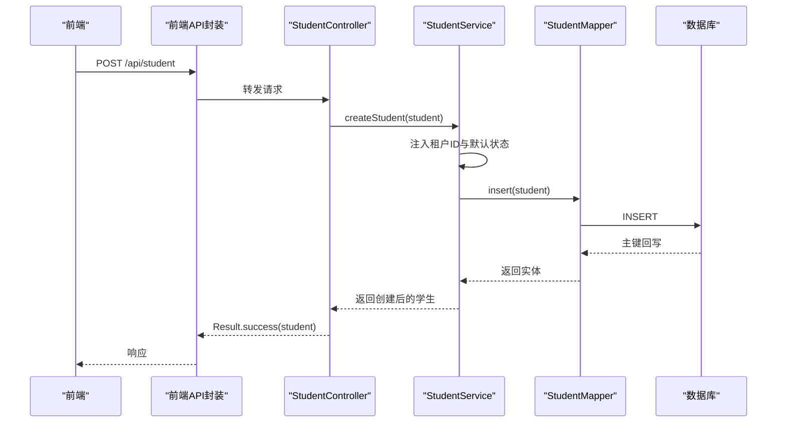
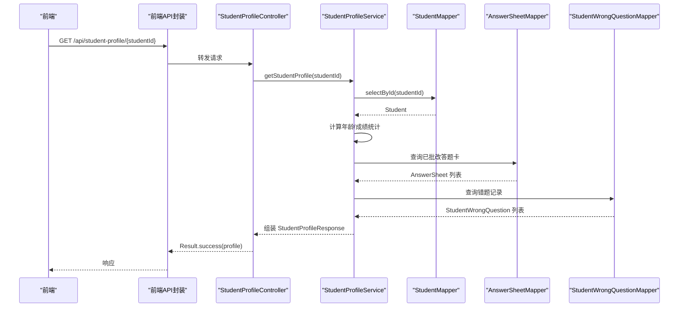
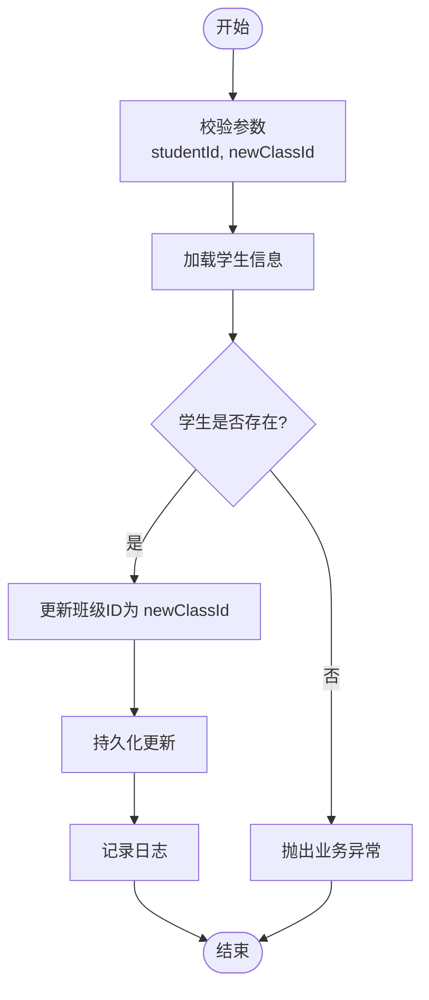
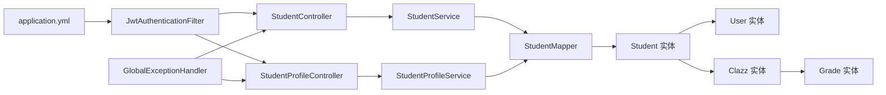

# 学生信息管理

<cite>
**本文引用的文件**
- [StudentController.java](file://backend/src/main/java/com/edu/user/controller/StudentController.java)
- [StudentProfileController.java](file://backend/src/main/java/com/edu/user/controller/StudentProfileController.java)
- [StudentService.java](file://backend/src/main/java/com/edu/user/service/StudentService.java)
- [StudentProfileService.java](file://backend/src/main/java/com/edu/user/service/StudentProfileService.java)
- [Student.java](file://backend/src/main/java/com/edu/user/entity/Student.java)
- [User.java](file://backend/src/main/java/com/edu/user/entity/User.java)
- [Clazz.java](file://backend/src/main/java/com/edu/user/entity/Clazz.java)
- [Grade.java](file://backend/src/main/java/com/edu/user/entity/Grade.java)
- [StudentMapper.java](file://backend/src/main/java/com/edu/user/mapper/StudentMapper.java)
- [StudentProfileResponse.java](file://backend/src/main/java/com/edu/user/dto/StudentProfileResponse.java)
- [GlobalExceptionHandler.java](file://backend/src/main/java/com/edu/common/exception/GlobalExceptionHandler.java)
- [JwtAuthenticationFilter.java](file://backend/src/main/java/com/edu/common/security/JwtAuthenticationFilter.java)
- [application.yml](file://backend/src/main/resources/application.yml)
- [student.ts](file://frontend/src/api/student.ts)
- [StudentProfile.vue](file://frontend/src/views/StudentProfile.vue)
</cite>

## 目录
1. [简介](#简介)
2. [项目结构](#项目结构)
3. [核心组件](#核心组件)
4. [架构总览](#架构总览)
5. [详细组件分析](#详细组件分析)
6. [依赖分析](#依赖分析)
7. [性能考虑](#性能考虑)
8. [故障排查指南](#故障排查指南)
9. [结论](#结论)
10. [附录](#附录)

## 简介
本文件为“学生信息管理模块”的综合技术文档，覆盖学生档案的全生命周期管理，包括基础信息的创建、更新、查询与转班操作，以及学习档案的统计分析与个性化配置入口。文档重点阐述以下内容：
- 控制器职责划分：StudentController 负责学生基础信息与班级关联管理；StudentProfileController 提供学习画像与分析能力。
- 实体模型设计：Student 与 User、Clazz、Grade 的关联关系与字段语义。
- 完整 API 接口清单：涵盖学生列表、详情、更新、转班、画像详情、知识点掌握、成绩趋势、错题分析与兴趣更新等。
- 数据隐私与安全：基于 JWT 的认证鉴权、租户隔离、全局异常处理与错误响应规范。
- 数据同步策略：通过服务层事务与租户上下文保障数据一致性。

## 项目结构
后端采用按功能域分层的组织方式，学生模块位于 user 功能域下，包含控制器、服务、实体、映射器与 DTO。前端通过统一的 API 封装调用后端接口。

图表来源
- [StudentController.java:1-66](file://backend/src/main/java/com/edu/user/controller/StudentController.java#L1-L66)
- [StudentProfileController.java:1-81](file://backend/src/main/java/com/edu/user/controller/StudentProfileController.java#L1-L81)
- [StudentService.java:1-78](file://backend/src/main/java/com/edu/user/service/StudentService.java#L1-L78)
- [StudentProfileService.java:1-253](file://backend/src/main/java/com/edu/user/service/StudentProfileService.java#L1-L253)
- [StudentMapper.java:1-9](file://backend/src/main/java/com/edu/user/mapper/StudentMapper.java#L1-L9)
- [Student.java:1-22](file://backend/src/main/java/com/edu/user/entity/Student.java#L1-L22)
- [User.java:1-21](file://backend/src/main/java/com/edu/user/entity/User.java#L1-L21)
- [Clazz.java:1-18](file://backend/src/main/java/com/edu/user/entity/Clazz.java#L1-L18)
- [Grade.java:1-17](file://backend/src/main/java/com/edu/user/entity/Grade.java#L1-L17)
- [StudentProfileResponse.java:1-102](file://backend/src/main/java/com/edu/user/dto/StudentProfileResponse.java#L1-L102)
- [JwtAuthenticationFilter.java:1-70](file://backend/src/main/java/com/edu/common/security/JwtAuthenticationFilter.java#L1-L70)
- [GlobalExceptionHandler.java:1-69](file://backend/src/main/java/com/edu/common/exception/GlobalExceptionHandler.java#L1-L69)
- [application.yml:1-65](file://backend/src/main/resources/application.yml#L1-L65)

章节来源
- [StudentController.java:1-66](file://backend/src/main/java/com/edu/user/controller/StudentController.java#L1-L66)
- [StudentProfileController.java:1-81](file://backend/src/main/java/com/edu/user/controller/StudentProfileController.java#L1-L81)
- [application.yml:1-65](file://backend/src/main/resources/application.yml#L1-L65)

## 核心组件
- 控制器层
  - StudentController：提供学生基础信息的增删改查与转班操作，路径前缀 /api/student。
  - StudentProfileController：提供学生画像详情、班级画像列表、知识点掌握、成绩趋势、错题分析与兴趣更新，路径前缀 /api/student-profile。
- 服务层
  - StudentService：封装学生实体的持久化与查询，包含租户上下文注入与事务控制。
  - StudentProfileService：聚合答题卡、错题等数据，计算成绩统计、知识点掌握、错题分布与成绩趋势。
- 数据访问层
  - StudentMapper：基于 MyBatis-Plus 的通用 Mapper。
- 数据传输对象
  - StudentProfileResponse：画像响应 DTO，包含基本信息、成绩统计、知识点掌握、学科成绩、错题统计、学习趋势与兴趣爱好等字段。
- 安全与异常
  - JwtAuthenticationFilter：从请求头提取 JWT，解析用户与租户信息，设置安全上下文与租户上下文。
  - GlobalExceptionHandler：集中处理业务异常、参数校验、认证与权限异常，统一返回 Result 结构。

章节来源
- [StudentController.java:1-66](file://backend/src/main/java/com/edu/user/controller/StudentController.java#L1-L66)
- [StudentProfileController.java:1-81](file://backend/src/main/java/com/edu/user/controller/StudentProfileController.java#L1-L81)
- [StudentService.java:1-78](file://backend/src/main/java/com/edu/user/service/StudentService.java#L1-L78)
- [StudentProfileService.java:1-253](file://backend/src/main/java/com/edu/user/service/StudentProfileService.java#L1-L253)
- [StudentProfileResponse.java:1-102](file://backend/src/main/java/com/edu/user/dto/StudentProfileResponse.java#L1-L102)
- [JwtAuthenticationFilter.java:1-70](file://backend/src/main/java/com/edu/common/security/JwtAuthenticationFilter.java#L1-L70)
- [GlobalExceptionHandler.java:1-69](file://backend/src/main/java/com/edu/common/exception/GlobalExceptionHandler.java#L1-L69)

## 架构总览
学生信息管理遵循典型的三层架构：前端通过 API 封装调用后端控制器，控制器委派给服务层，服务层通过 Mapper 访问数据库。安全层由 JWT 过滤器负责认证与授权，并结合全局异常处理保证错误响应一致。

图表来源
- [StudentController.java:1-66](file://backend/src/main/java/com/edu/user/controller/StudentController.java#L1-L66)
- [StudentProfileController.java:1-81](file://backend/src/main/java/com/edu/user/controller/StudentProfileController.java#L1-L81)
- [StudentService.java:1-78](file://backend/src/main/java/com/edu/user/service/StudentService.java#L1-L78)
- [StudentProfileService.java:1-253](file://backend/src/main/java/com/edu/user/service/StudentProfileService.java#L1-L253)
- [StudentMapper.java:1-9](file://backend/src/main/java/com/edu/user/mapper/StudentMapper.java#L1-L9)

## 详细组件分析

### 控制器职责分工
- StudentController
  - 职责：学生基础信息管理与班级关联变更。
  - 关键接口：按班级查询、按主键/学号查询、创建、更新、转班、删除。
- StudentProfileController
  - 职责：学习档案维护与个性化配置入口。
  - 关键接口：学生画像详情、班级画像列表、知识点掌握、成绩趋势、错题分析、兴趣更新。

图表来源
- [StudentController.java:1-66](file://backend/src/main/java/com/edu/user/controller/StudentController.java#L1-L66)
- [StudentProfileController.java:1-81](file://backend/src/main/java/com/edu/user/controller/StudentProfileController.java#L1-L81)
- [StudentService.java:1-78](file://backend/src/main/java/com/edu/user/service/StudentService.java#L1-L78)
- [StudentProfileService.java:1-253](file://backend/src/main/java/com/edu/user/service/StudentProfileService.java#L1-L253)

章节来源
- [StudentController.java:1-66](file://backend/src/main/java/com/edu/user/controller/StudentController.java#L1-L66)
- [StudentProfileController.java:1-81](file://backend/src/main/java/com/edu/user/controller/StudentProfileController.java#L1-L81)

### 数据模型设计与关联关系
- Student 实体
  - 字段：id、classId、userId、name、studentNo、gender、birthDate、status。
  - 关联：与 User 通过 userId 关联（可选），与 Clazz 通过 classId 关联。
- User 实体
  - 字段：id、username、password、realName、email、phone、avatar、status。
- Clazz 实体
  - 字段：id、gradeId、name、teacherId、studentCount、createdAt、updatedAt。
- Grade 实体
  - 字段：id、schoolId、name、level、sequence、createdAt。
- 关系图

图表来源
- [Student.java:1-22](file://backend/src/main/java/com/edu/user/entity/Student.java#L1-L22)
- [User.java:1-21](file://backend/src/main/java/com/edu/user/entity/User.java#L1-L21)
- [Clazz.java:1-18](file://backend/src/main/java/com/edu/user/entity/Clazz.java#L1-L18)
- [Grade.java:1-17](file://backend/src/main/java/com/edu/user/entity/Grade.java#L1-L17)

章节来源
- [Student.java:1-22](file://backend/src/main/java/com/edu/user/entity/Student.java#L1-L22)
- [User.java:1-21](file://backend/src/main/java/com/edu/user/entity/User.java#L1-L21)
- [Clazz.java:1-18](file://backend/src/main/java/com/edu/user/entity/Clazz.java#L1-L18)
- [Grade.java:1-17](file://backend/src/main/java/com/edu/user/entity/Grade.java#L1-L17)

### API 接口文档
- 学生基础信息接口（StudentController）
  - GET /api/student/class/{classId}：按班级查询学生列表
  - GET /api/student/{id}：按主键查询学生详情
  - GET /api/student/no/{studentNo}：按学号查询学生详情
  - POST /api/student：创建学生（自动注入租户ID与状态）
  - PUT /api/student/{id}：更新学生信息
  - PUT /api/student/{id}/transfer?newClassId={...}：转班
  - DELETE /api/student/{id}：删除学生
- 学生画像与分析接口（StudentProfileController）
  - GET /api/student-profile/{studentId}：获取学生画像详情
  - GET /api/student-profile/class/{classId}：获取班级所有学生画像列表
  - GET /api/student-profile/{studentId}/knowledge-points：获取学生知识点掌握情况
  - GET /api/student-profile/{studentId}/score-trends：获取学生成绩趋势（最近10次）
  - GET /api/student-profile/{studentId}/wrong-analysis：获取学生错题分析
  - PUT /api/student-profile/{studentId}/interests?interests=...&talents=...&learningStyle=...：更新学生特长爱好（预留）

前端调用示例（对应后端接口）
- 获取学生画像详情：GET /student-profile/{studentId}
- 获取班级学生画像列表：GET /student-profile/class/{classId}
- 获取知识点掌握情况：GET /student-profile/{studentId}/knowledge-points
- 获取成绩趋势：GET /student-profile/{studentId}/score-trends
- 更新兴趣爱好：PUT /student-profile/{studentId}/interests

章节来源
- [StudentController.java:1-66](file://backend/src/main/java/com/edu/user/controller/StudentController.java#L1-L66)
- [StudentProfileController.java:1-81](file://backend/src/main/java/com/edu/user/controller/StudentProfileController.java#L1-L81)
- [student.ts:1-26](file://frontend/src/api/student.ts#L1-L26)

### 处理流程与时序

#### 创建学生流程

图表来源
- [StudentController.java:42-46](file://backend/src/main/java/com/edu/user/controller/StudentController.java#L42-L46)
- [StudentService.java:21-32](file://backend/src/main/java/com/edu/user/service/StudentService.java#L21-L32)
- [StudentMapper.java:1-9](file://backend/src/main/java/com/edu/user/mapper/StudentMapper.java#L1-L9)

#### 获取学生画像流程

图表来源
- [StudentProfileController.java:24-31](file://backend/src/main/java/com/edu/user/controller/StudentProfileController.java#L24-L31)
- [StudentProfileService.java:37-71](file://backend/src/main/java/com/edu/user/service/StudentProfileService.java#L37-L71)
- [StudentProfileResponse.java:1-102](file://backend/src/main/java/com/edu/user/dto/StudentProfileResponse.java#L1-L102)

#### 转班流程

图表来源
- [StudentController.java:55-59](file://backend/src/main/java/com/edu/user/controller/StudentController.java#L55-L59)
- [StudentService.java:61-70](file://backend/src/main/java/com/edu/user/service/StudentService.java#L61-L70)

### 错误处理与异常流程
- 全局异常处理
  - 业务异常：返回 400，携带错误码与消息。
  - 租户异常：返回 403，禁止访问。
  - 参数校验失败：返回 400，汇总字段错误。
  - 认证失败：返回 401。
  - 权限不足：返回 403。
  - 未捕获异常：返回 500。
- JWT 过滤器
  - 从 Authorization 头解析 Bearer Token。
  - 校验通过后设置租户上下文与 Spring Security 上下文。
  - 对公开接口放行（如 /api/auth/, /api/tenant/）。

章节来源
- [GlobalExceptionHandler.java:1-69](file://backend/src/main/java/com/edu/common/exception/GlobalExceptionHandler.java#L1-L69)
- [JwtAuthenticationFilter.java:1-70](file://backend/src/main/java/com/edu/common/security/JwtAuthenticationFilter.java#L1-L70)

## 依赖分析
- 控制器到服务：StudentController 与 StudentProfileController 分别依赖各自的服务类。
- 服务到映射器：StudentService 与 StudentProfileService 通过 MyBatis-Plus Mapper 访问数据库。
- 实体关联：Student 与 User、Clazz、Grade 形成清晰的一对多/多对一关系。
- 安全与配置：JwtAuthenticationFilter 在请求进入控制器前完成认证与租户注入；application.yml 提供数据源、MyBatis-Plus、JWT 等配置。

图表来源
- [StudentController.java:1-66](file://backend/src/main/java/com/edu/user/controller/StudentController.java#L1-L66)
- [StudentProfileController.java:1-81](file://backend/src/main/java/com/edu/user/controller/StudentProfileController.java#L1-L81)
- [StudentService.java:1-78](file://backend/src/main/java/com/edu/user/service/StudentService.java#L1-L78)
- [StudentProfileService.java:1-253](file://backend/src/main/java/com/edu/user/service/StudentProfileService.java#L1-L253)
- [StudentMapper.java:1-9](file://backend/src/main/java/com/edu/user/mapper/StudentMapper.java#L1-L9)
- [JwtAuthenticationFilter.java:1-70](file://backend/src/main/java/com/edu/common/security/JwtAuthenticationFilter.java#L1-L70)
- [GlobalExceptionHandler.java:1-69](file://backend/src/main/java/com/edu/common/exception/GlobalExceptionHandler.java#L1-L69)
- [application.yml:1-65](file://backend/src/main/resources/application.yml#L1-L65)

章节来源
- [StudentService.java:1-78](file://backend/src/main/java/com/edu/user/service/StudentService.java#L1-L78)
- [StudentProfileService.java:1-253](file://backend/src/main/java/com/edu/user/service/StudentProfileService.java#L1-L253)
- [application.yml:1-65](file://backend/src/main/resources/application.yml#L1-L65)

## 性能考虑
- 查询优化
  - 使用 LambdaQueryWrapper 进行条件查询，避免 N+1 查询。
  - 对常用查询（按班级、按学号）添加排序与限制（如最近10次成绩趋势）。
- 事务边界
  - 创建、更新、转班、删除均使用 @Transactional，确保一致性。
- 缓存策略
  - 当前未启用 Redis 缓存（配置项已注释），建议对热点画像数据进行缓存以降低数据库压力。
- 日志与监控
  - 服务层关键操作记录日志，便于审计与问题定位。

## 故障排查指南
- 401 未认证
  - 检查请求头是否包含有效的 Bearer Token。
  - 核对 JWT 密钥与过期时间配置。
- 403 权限不足/租户异常
  - 确认 Token 中的租户 ID 是否正确。
  - 检查用户角色与资源访问权限。
- 400 参数校验失败
  - 查看返回的字段错误信息，修正请求体或查询参数。
- 业务异常
  - 如“学生不存在”，检查传入的主键或学号是否正确。
- 前端调用失败
  - 确认前端 API 封装路径与后端控制器路径一致。
  - 检查跨域与代理配置。

章节来源
- [GlobalExceptionHandler.java:1-69](file://backend/src/main/java/com/edu/common/exception/GlobalExceptionHandler.java#L1-L69)
- [JwtAuthenticationFilter.java:1-70](file://backend/src/main/java/com/edu/common/security/JwtAuthenticationFilter.java#L1-L70)
- [student.ts:1-26](file://frontend/src/api/student.ts#L1-L26)

## 结论
学生信息管理模块通过清晰的控制器职责划分、稳健的服务层实现与完善的异常处理机制，提供了从基础信息到学习画像的全链路能力。配合 JWT 认证与租户上下文，确保了数据隔离与访问安全。后续可在缓存、指标监控与更细粒度的权限控制方面持续优化。

## 附录

### 前端集成要点
- 使用前端 API 封装统一调用后端接口。
- 在学生画像页面中，先加载班级列表与学生列表，再按需加载画像详情与趋势数据。
- 对空数据场景提供友好提示。

章节来源
- [student.ts:1-26](file://frontend/src/api/student.ts#L1-L26)
- [StudentProfile.vue:1-343](file://frontend/src/views/StudentProfile.vue#L1-L343)