# 班级与年级管理

<cite>
**本文引用的文件**
- [ClassController.java](file://backend/src/main/java/com/edu/user/controller/ClassController.java)
- [GradeController.java](file://backend/src/main/java/com/edu/user/controller/GradeController.java)
- [ClassService.java](file://backend/src/main/java/com/edu/user/service/ClassService.java)
- [GradeService.java](file://backend/src/main/java/com/edu/user/service/GradeService.java)
- [ClassMapper.java](file://backend/src/main/java/com/edu/user/mapper/ClassMapper.java)
- [GradeMapper.java](file://backend/src/main/java/com/edu/user/mapper/GradeMapper.java)
- [Clazz.java](file://backend/src/main/java/com/edu/user/entity/Clazz.java)
- [Grade.java](file://backend/src/main/java/com/edu/user/entity/Grade.java)
- [Student.java](file://backend/src/main/java/com/edu/user/entity/Student.java)
- [StudentController.java](file://backend/src/main/java/com/edu/user/controller/StudentController.java)
- [StudentService.java](file://backend/src/main/java/com/edu/user/service/StudentService.java)
- [BaseEntity.java](file://backend/src/main/java/com/edu/common/entity/BaseEntity.java)
- [schema.sql](file://backend/src/main/resources/db/schema.sql)
</cite>

## 目录
1. [简介](#简介)
2. [项目结构](#项目结构)
3. [核心组件](#核心组件)
4. [架构总览](#架构总览)
5. [详细组件分析](#详细组件分析)
6. [依赖分析](#依赖分析)
7. [性能考虑](#性能考虑)
8. [故障排查指南](#故障排查指南)
9. [结论](#结论)
10. [附录](#附录)

## 简介
本文件聚焦于“班级与年级管理”模块，系统性阐述教育组织结构的层级管理体系：以年级为顶层、班级为中间层、学生为底层的三级组织关系；同时覆盖教师与班级的管理关系。文档从实体设计、控制层API、服务层业务逻辑、数据一致性与事务处理、批量操作与报表生成机制等方面进行深入说明，并提供完整管理操作流程与可视化图示。

## 项目结构
该模块位于后端工程的用户域下，采用典型的分层架构：
- 控制器层：提供REST接口，负责请求接入与响应封装
- 服务层：承载业务逻辑，处理事务与领域规则
- 数据访问层：MyBatis-Plus Mapper接口，负责数据库交互
- 实体层：对应数据库表结构，标注映射注解
- 公共层：统一返回体、异常处理、多租户上下文与逻辑删除

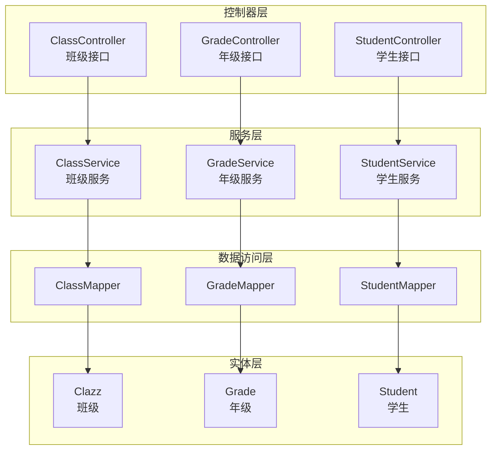

图表来源
- [ClassController.java:12-64](file://backend/src/main/java/com/edu/user/controller/ClassController.java#L12-L64)
- [GradeController.java:11-38](file://backend/src/main/java/com/edu/user/controller/GradeController.java#L11-L38)
- [StudentController.java:11-66](file://backend/src/main/java/com/edu/user/controller/StudentController.java#L11-L66)
- [ClassService.java:15-71](file://backend/src/main/java/com/edu/user/service/ClassService.java#L15-L71)
- [GradeService.java:15-50](file://backend/src/main/java/com/edu/user/service/GradeService.java#L15-L50)
- [StudentService.java:16-78](file://backend/src/main/java/com/edu/user/service/StudentService.java#L16-L78)
- [ClassMapper.java:1-10](file://backend/src/main/java/com/edu/user/mapper/ClassMapper.java#L1-L10)
- [GradeMapper.java:1-9](file://backend/src/main/java/com/edu/user/mapper/GradeMapper.java#L1-L9)
- [Clazz.java:1-18](file://backend/src/main/java/com/edu/user/entity/Clazz.java#L1-L18)
- [Grade.java:1-17](file://backend/src/main/java/com/edu/user/entity/Grade.java#L1-L17)
- [Student.java:1-22](file://backend/src/main/java/com/edu/user/entity/Student.java#L1-L22)

章节来源
- [ClassController.java:12-64](file://backend/src/main/java/com/edu/user/controller/ClassController.java#L12-L64)
- [GradeController.java:11-38](file://backend/src/main/java/com/edu/user/controller/GradeController.java#L11-L38)
- [StudentController.java:11-66](file://backend/src/main/java/com/edu/user/controller/StudentController.java#L11-L66)

## 核心组件
- 班级实体(Clazz)：包含年级ID、班级名称、班主任ID、学生人数、创建/更新时间等字段，映射到class表
- 年级实体(Grade)：包含学校ID、年级名称、学段(level)、排序序号(sequence)、创建时间等字段，映射到grade表
- 学生实体(Student)：继承BaseEntity，包含班级ID、用户ID、学号、性别、出生日期、状态等字段，映射到student表
- 控制器(ClassController/GradeController/StudentController)：提供REST接口，封装Result统一响应
- 服务(ClassService/GradeService/StudentService)：实现业务逻辑，使用@Transactional保证事务一致性
- Mapper(ClassMapper/GradeMapper)：基于MyBatis-Plus的BaseMapper，提供基础CRUD能力

章节来源
- [Clazz.java:1-18](file://backend/src/main/java/com/edu/user/entity/Clazz.java#L1-L18)
- [Grade.java:1-17](file://backend/src/main/java/com/edu/user/entity/Grade.java#L1-L17)
- [Student.java:1-22](file://backend/src/main/java/com/edu/user/entity/Student.java#L1-L22)
- [ClassController.java:12-64](file://backend/src/main/java/com/edu/user/controller/ClassController.java#L12-L64)
- [GradeController.java:11-38](file://backend/src/main/java/com/edu/user/controller/GradeController.java#L11-L38)
- [StudentController.java:11-66](file://backend/src/main/java/com/edu/user/controller/StudentController.java#L11-L66)
- [ClassService.java:15-71](file://backend/src/main/java/com/edu/user/service/ClassService.java#L15-L71)
- [GradeService.java:15-50](file://backend/src/main/java/com/edu/user/service/GradeService.java#L15-L50)
- [StudentService.java:16-78](file://backend/src/main/java/com/edu/user/service/StudentService.java#L16-L78)
- [ClassMapper.java:1-10](file://backend/src/main/java/com/edu/user/mapper/ClassMapper.java#L1-L10)
- [GradeMapper.java:1-9](file://backend/src/main/java/com/edu/user/mapper/GradeMapper.java#L1-L9)

## 架构总览
班级与年级管理遵循“控制器-服务-数据访问-实体”的分层架构，配合数据库索引与外键约束，确保数据一致性与查询效率。多租户通过BaseEntity与TenantContextHolder贯穿学生相关操作，保障数据隔离。

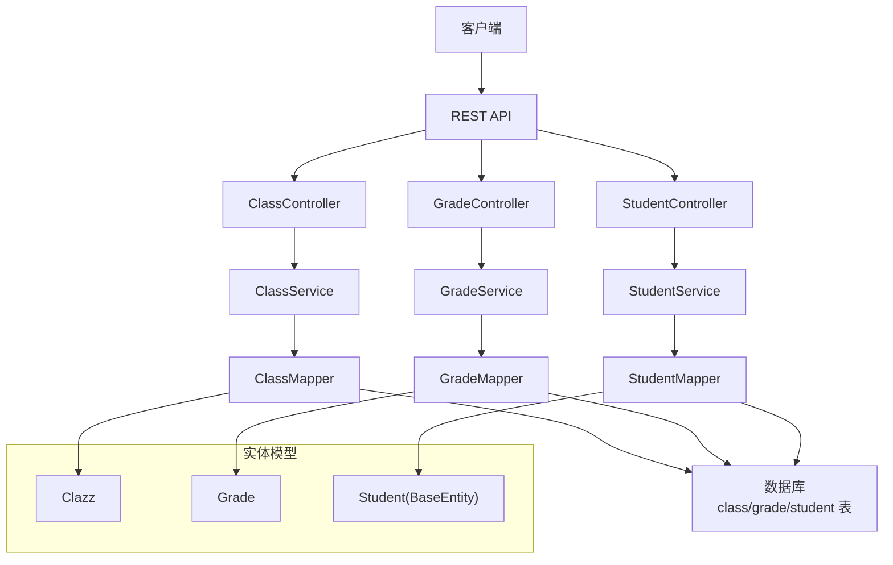

图表来源
- [ClassController.java:12-64](file://backend/src/main/java/com/edu/user/controller/ClassController.java#L12-L64)
- [GradeController.java:11-38](file://backend/src/main/java/com/edu/user/controller/GradeController.java#L11-L38)
- [StudentController.java:11-66](file://backend/src/main/java/com/edu/user/controller/StudentController.java#L11-L66)
- [ClassService.java:15-71](file://backend/src/main/java/com/edu/user/service/ClassService.java#L15-L71)
- [GradeService.java:15-50](file://backend/src/main/java/com/edu/user/service/GradeService.java#L15-L50)
- [StudentService.java:16-78](file://backend/src/main/java/com/edu/user/service/StudentService.java#L16-L78)
- [ClassMapper.java:1-10](file://backend/src/main/java/com/edu/user/mapper/ClassMapper.java#L1-L10)
- [GradeMapper.java:1-9](file://backend/src/main/java/com/edu/user/mapper/GradeMapper.java#L1-L9)
- [Student.java:1-22](file://backend/src/main/java/com/edu/user/entity/Student.java#L1-L22)
- [BaseEntity.java:1-38](file://backend/src/main/java/com/edu/common/entity/BaseEntity.java#L1-L38)
- [schema.sql:110-146](file://backend/src/main/resources/db/schema.sql#L110-L146)

## 详细组件分析

### 班级实体与控制器
- 实体设计要点
  - 班级(Clazz)与数据库class表映射，关键字段包括gradeId、name、teacherId、studentCount等
  - 支持按年级排序查询，便于前端展示与管理
- 控制器接口
  - 列表查询：按年级或全量查询，支持排序
  - 单个查询：根据ID查询
  - 新增/更新/删除：标准CRUD接口
- 服务层扩展
  - 分配班主任(assignTeacher)与更新学生人数(updateStudentCount)等业务方法

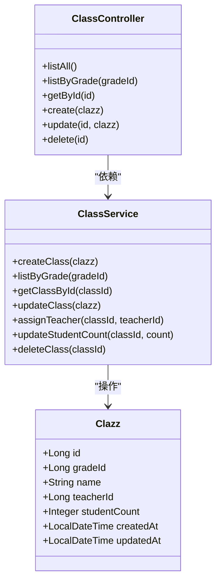

图表来源
- [Clazz.java:1-18](file://backend/src/main/java/com/edu/user/entity/Clazz.java#L1-L18)
- [ClassController.java:12-64](file://backend/src/main/java/com/edu/user/controller/ClassController.java#L12-L64)
- [ClassService.java:15-71](file://backend/src/main/java/com/edu/user/service/ClassService.java#L15-L71)

章节来源
- [Clazz.java:1-18](file://backend/src/main/java/com/edu/user/entity/Clazz.java#L1-L18)
- [ClassController.java:12-64](file://backend/src/main/java/com/edu/user/controller/ClassController.java#L12-L64)
- [ClassService.java:15-71](file://backend/src/main/java/com/edu/user/service/ClassService.java#L15-L71)

### 年级实体与控制器
- 实体设计要点
  - 年级(Grade)与数据库grade表映射，关键字段包括schoolId、name、level、sequence等
  - 按sequence升序排列，体现年级的自然顺序
- 控制器接口
  - 列表查询：按学校过滤，支持全量查询
  - 单个查询：根据ID查询
- 服务层扩展
  - 提供创建、更新、删除与按学校查询等方法

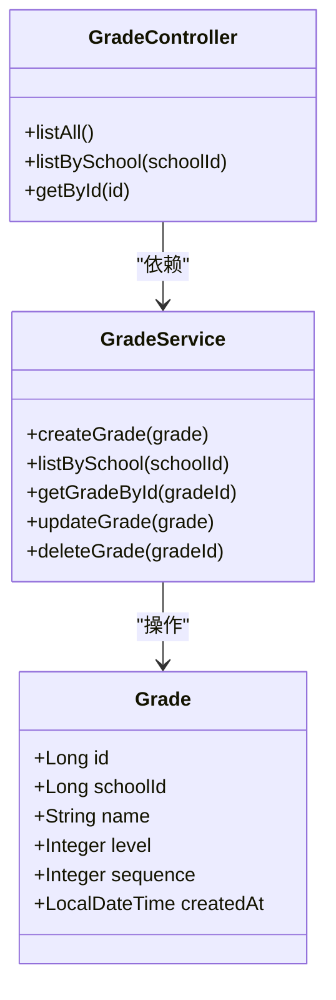

图表来源
- [Grade.java:1-17](file://backend/src/main/java/com/edu/user/entity/Grade.java#L1-L17)
- [GradeController.java:11-38](file://backend/src/main/java/com/edu/user/controller/GradeController.java#L11-L38)
- [GradeService.java:15-50](file://backend/src/main/java/com/edu/user/service/GradeService.java#L15-L50)

章节来源
- [Grade.java:1-17](file://backend/src/main/java/com/edu/user/entity/Grade.java#L1-L17)
- [GradeController.java:11-38](file://backend/src/main/java/com/edu/user/controller/GradeController.java#L11-L38)
- [GradeService.java:15-50](file://backend/src/main/java/com/edu/user/service/GradeService.java#L15-L50)

### 学生实体与控制器
- 实体设计要点
  - 学生(Student)继承BaseEntity，具备租户隔离能力
  - 关键字段包括classId、userId、studentNo、gender、birthDate、status等
- 控制器接口
  - 按班级查询、按学号查询、新增、更新、转班、删除等
- 服务层扩展
  - 转班(transferClass)与创建时自动填充租户ID、状态等

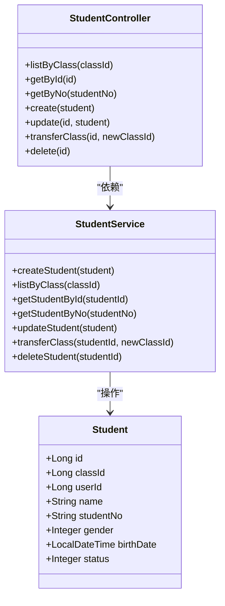

图表来源
- [Student.java:1-22](file://backend/src/main/java/com/edu/user/entity/Student.java#L1-L22)
- [StudentController.java:11-66](file://backend/src/main/java/com/edu/user/controller/StudentController.java#L11-L66)
- [StudentService.java:16-78](file://backend/src/main/java/com/edu/user/service/StudentService.java#L16-L78)
- [BaseEntity.java:1-38](file://backend/src/main/java/com/edu/common/entity/BaseEntity.java#L1-L38)

章节来源
- [Student.java:1-22](file://backend/src/main/java/com/edu/user/entity/Student.java#L1-L22)
- [StudentController.java:11-66](file://backend/src/main/java/com/edu/user/controller/StudentController.java#L11-L66)
- [StudentService.java:16-78](file://backend/src/main/java/com/edu/user/service/StudentService.java#L16-L78)
- [BaseEntity.java:1-38](file://backend/src/main/java/com/edu/common/entity/BaseEntity.java#L1-L38)

### 数据模型与关系
- 数据模型
  - 年级表(grade)：school_id外键，level与sequence字段
  - 班级表(class)：grade_id外键，teacher_id外键，student_count字段
  - 学生表(student)：class_id外键，tenant_id外键，student_no唯一
- 关系图

```mermaid
erDiagram
SCHOOL ||--o{ GRADE : "拥有"
GRADE ||--o{ CLASS : "包含"
CLASS ||--o{ STUDENT : "容纳"
SYS_USER ||--o{ CLASS : "管理(班主任)"
```

图表来源
- [schema.sql:110-146](file://backend/src/main/resources/db/schema.sql#L110-L146)

章节来源
- [schema.sql:110-146](file://backend/src/main/resources/db/schema.sql#L110-L146)

### API 接口与调用序列

#### 班级管理流程（创建/分配/统计）
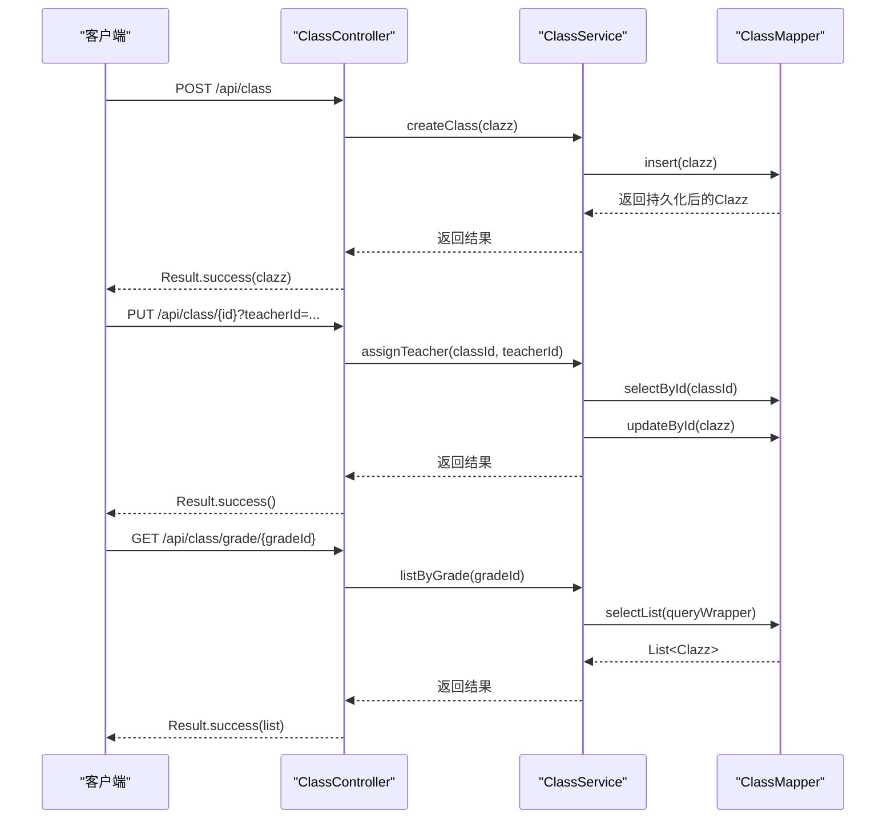

图表来源
- [ClassController.java:12-64](file://backend/src/main/java/com/edu/user/controller/ClassController.java#L12-L64)
- [ClassService.java:15-71](file://backend/src/main/java/com/edu/user/service/ClassService.java#L15-L71)
- [ClassMapper.java:1-10](file://backend/src/main/java/com/edu/user/mapper/ClassMapper.java#L1-L10)

章节来源
- [ClassController.java:12-64](file://backend/src/main/java/com/edu/user/controller/ClassController.java#L12-L64)
- [ClassService.java:15-71](file://backend/src/main/java/com/edu/user/service/ClassService.java#L15-L71)

#### 年级管理流程（创建/查询/删除）
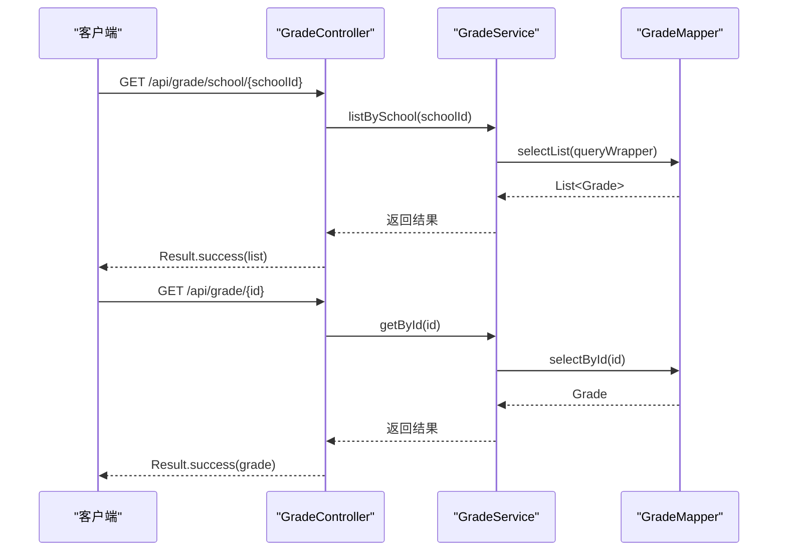

图表来源
- [GradeController.java:11-38](file://backend/src/main/java/com/edu/user/controller/GradeController.java#L11-L38)
- [GradeService.java:15-50](file://backend/src/main/java/com/edu/user/service/GradeService.java#L15-L50)
- [GradeMapper.java:1-9](file://backend/src/main/java/com/edu/user/mapper/GradeMapper.java#L1-L9)

章节来源
- [GradeController.java:11-38](file://backend/src/main/java/com/edu/user/controller/GradeController.java#L11-L38)
- [GradeService.java:15-50](file://backend/src/main/java/com/edu/user/service/GradeService.java#L15-L50)

#### 学生管理流程（转班/查询/创建）
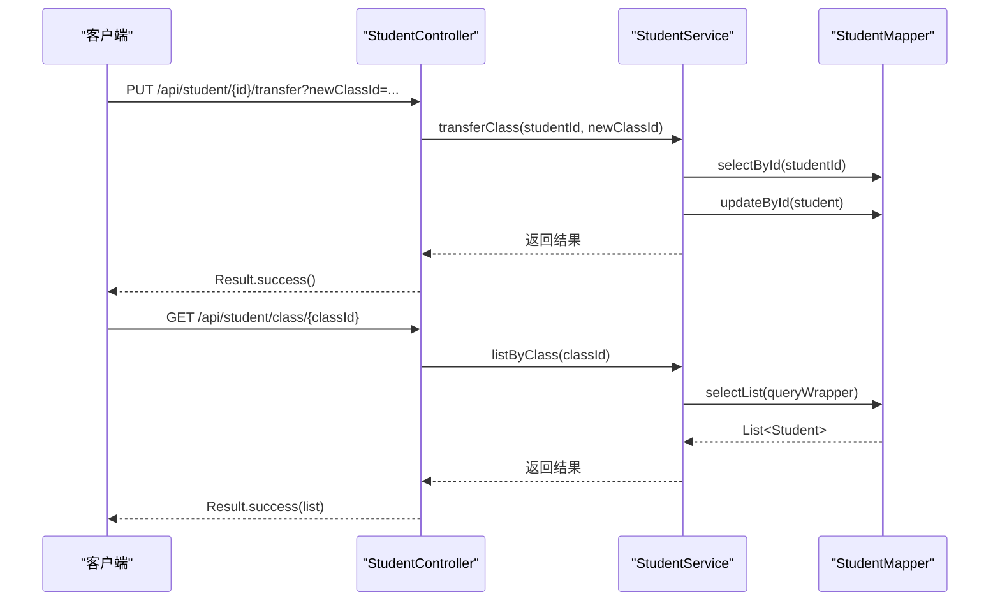

图表来源
- [StudentController.java:11-66](file://backend/src/main/java/com/edu/user/controller/StudentController.java#L11-L66)
- [StudentService.java:16-78](file://backend/src/main/java/com/edu/user/service/StudentService.java#L16-L78)
- [StudentMapper.java](file://backend/src/main/java/com/edu/user/mapper/StudentMapper.java)

章节来源
- [StudentController.java:11-66](file://backend/src/main/java/com/edu/user/controller/StudentController.java#L11-L66)
- [StudentService.java:16-78](file://backend/src/main/java/com/edu/user/service/StudentService.java#L16-L78)

### 复杂逻辑流程（学生转班）
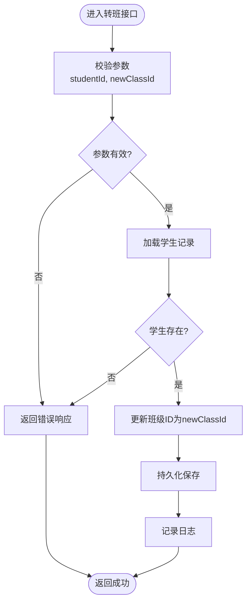

图表来源
- [StudentService.java:61-70](file://backend/src/main/java/com/edu/user/service/StudentService.java#L61-L70)

章节来源
- [StudentService.java:61-70](file://backend/src/main/java/com/edu/user/service/StudentService.java#L61-L70)

## 依赖分析
- 控制器与服务
  - ClassController依赖ClassService
  - GradeController依赖GradeService
  - StudentController依赖StudentService
- 服务与Mapper
  - ClassService依赖ClassMapper
  - GradeService依赖GradeMapper
  - StudentService依赖StudentMapper
- 实体与表
  - Clazz映射class表
  - Grade映射grade表
  - Student映射student表

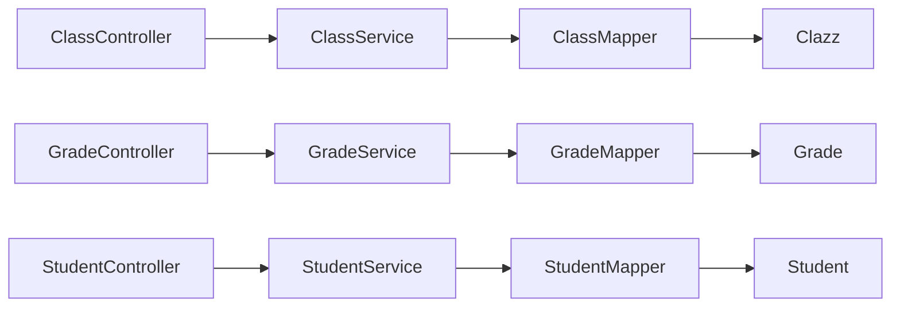

图表来源
- [ClassController.java:12-64](file://backend/src/main/java/com/edu/user/controller/ClassController.java#L12-L64)
- [GradeController.java:11-38](file://backend/src/main/java/com/edu/user/controller/GradeController.java#L11-L38)
- [StudentController.java:11-66](file://backend/src/main/java/com/edu/user/controller/StudentController.java#L11-L66)
- [ClassService.java:15-71](file://backend/src/main/java/com/edu/user/service/ClassService.java#L15-L71)
- [GradeService.java:15-50](file://backend/src/main/java/com/edu/user/service/GradeService.java#L15-L50)
- [StudentService.java:16-78](file://backend/src/main/java/com/edu/user/service/StudentService.java#L16-L78)
- [ClassMapper.java:1-10](file://backend/src/main/java/com/edu/user/mapper/ClassMapper.java#L1-L10)
- [GradeMapper.java:1-9](file://backend/src/main/java/com/edu/user/mapper/GradeMapper.java#L1-L9)
- [Clazz.java:1-18](file://backend/src/main/java/com/edu/user/entity/Clazz.java#L1-L18)
- [Grade.java:1-17](file://backend/src/main/java/com/edu/user/entity/Grade.java#L1-L17)
- [Student.java:1-22](file://backend/src/main/java/com/edu/user/entity/Student.java#L1-L22)

章节来源
- [ClassController.java:12-64](file://backend/src/main/java/com/edu/user/controller/ClassController.java#L12-L64)
- [GradeController.java:11-38](file://backend/src/main/java/com/edu/user/controller/GradeController.java#L11-L38)
- [StudentController.java:11-66](file://backend/src/main/java/com/edu/user/controller/StudentController.java#L11-L66)
- [ClassService.java:15-71](file://backend/src/main/java/com/edu/user/service/ClassService.java#L15-L71)
- [GradeService.java:15-50](file://backend/src/main/java/com/edu/user/service/GradeService.java#L15-L50)
- [StudentService.java:16-78](file://backend/src/main/java/com/edu/user/service/StudentService.java#L16-L78)

## 性能考虑
- 查询优化
  - 年级按sequence排序，班级按gradeId+name排序，利用索引提升查询效率
  - 学生按学号排序，便于快速定位
- 事务边界
  - 班主任分配、转班、创建/删除均在@Transactional中执行，保证原子性
- 批量操作建议
  - 当前接口为单条操作，如需批量，可在服务层聚合多次调用或引入批量插入/更新策略
- 报表生成
  - 可结合现有班级与学生数据，按班级维度统计平均分、及格率等指标，形成报表

## 故障排查指南
- 常见问题
  - 班级/年级不存在：控制器返回错误提示，服务层抛出业务异常
  - 学生不存在：转班时抛出业务异常
  - 租户上下文缺失：创建学生时抛出异常
- 定位步骤
  - 检查控制器返回码与消息
  - 查看服务层日志输出（创建/更新/删除均有日志）
  - 核对数据库记录是否存在
- 建议
  - 在接口层统一捕获业务异常并返回Result.error
  - 对关键操作增加幂等性校验（如重复创建）

章节来源
- [ClassController.java:36-43](file://backend/src/main/java/com/edu/user/controller/ClassController.java#L36-L43)
- [GradeController.java:30-37](file://backend/src/main/java/com/edu/user/controller/GradeController.java#L30-L37)
- [StudentController.java:24-40](file://backend/src/main/java/com/edu/user/controller/StudentController.java#L24-L40)
- [ClassService.java:46-54](file://backend/src/main/java/com/edu/user/service/ClassService.java#L46-L54)
- [StudentService.java:61-70](file://backend/src/main/java/com/edu/user/service/StudentService.java#L61-L70)

## 结论
本模块以清晰的三层架构实现了教育组织结构的班级与年级管理，通过实体映射、控制器接口与服务层事务处理，构建了稳定的数据一致性保障。结合数据库索引与多租户设计，满足日常编班、分班、人员分配与统计分析需求。后续可在批量操作与报表生成方面进一步增强，以支撑更大规模的教育管理场景。

## 附录

### 管理操作流程总览
- 编班流程
  - 创建年级 → 创建班级 → 分配班主任 → 统计班级人数
- 分班流程
  - 按年级查询班级 → 选择目标班级 → 将学生转入新班级
- 人员分配
  - 为班级指定班主任（teacherId）
- 数据统计
  - 基于班级与学生数据计算平均分、人数等指标

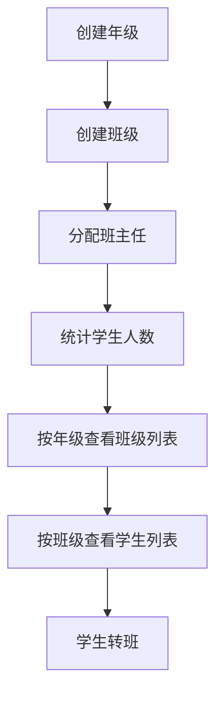

图表来源
- [GradeController.java:11-38](file://backend/src/main/java/com/edu/user/controller/GradeController.java#L11-L38)
- [ClassController.java:12-64](file://backend/src/main/java/com/edu/user/controller/ClassController.java#L12-L64)
- [StudentController.java:11-66](file://backend/src/main/java/com/edu/user/controller/StudentController.java#L11-L66)
- [ClassService.java:15-71](file://backend/src/main/java/com/edu/user/service/ClassService.java#L15-L71)
- [StudentService.java:16-78](file://backend/src/main/java/com/edu/user/service/StudentService.java#L16-L78)