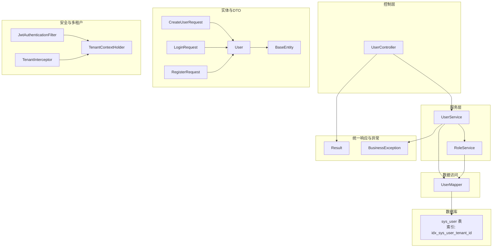
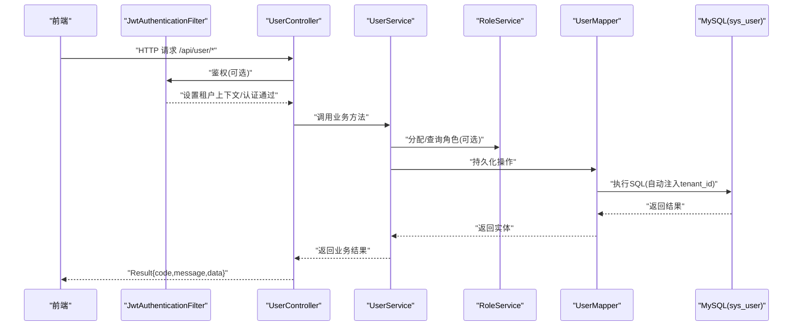
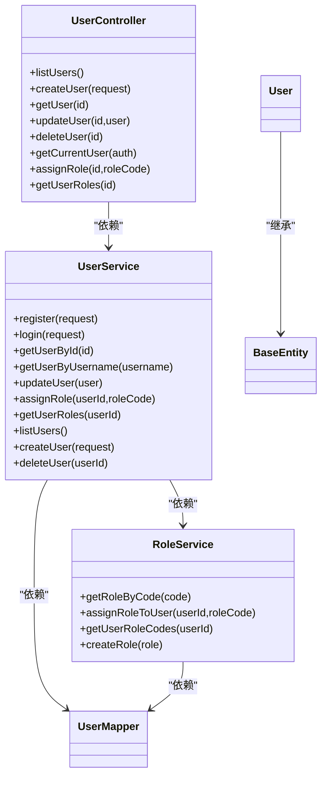

# 用户CRUD操作

<cite>
**本文引用的文件**
- [UserController.java](file://backend/src/main/java/com/edu/user/controller/UserController.java)
- [UserService.java](file://backend/src/main/java/com/edu/user/service/UserService.java)
- [User.java](file://backend/src/main/java/com/edu/user/entity/User.java)
- [CreateUserRequest.java](file://backend/src/main/java/com/edu/user/dto/CreateUserRequest.java)
- [LoginRequest.java](file://backend/src/main/java/com/edu/user/dto/LoginRequest.java)
- [RegisterRequest.java](file://backend/src/main/java/com/edu/user/dto/RegisterRequest.java)
- [UserMapper.java](file://backend/src/main/java/com/edu/user/mapper/UserMapper.java)
- [BaseEntity.java](file://backend/src/main/java/com/edu/common/entity/BaseEntity.java)
- [Result.java](file://backend/src/main/java/com/edu/common/entity/Result.java)
- [BusinessException.java](file://backend/src/main/java/com/edu/common/exception/BusinessException.java)
- [TenantInterceptor.java](file://backend/src/main/java/com/edu/common/interceptor/TenantInterceptor.java)
- [JwtAuthenticationFilter.java](file://backend/src/main/java/com/edu/common/security/JwtAuthenticationFilter.java)
- [TenantContextHolder.java](file://backend/src/main/java/com/edu/common/util/TenantContextHolder.java)
- [RoleService.java](file://backend/src/main/java/com/edu/user/service/RoleService.java)
- [schema.sql](file://backend/src/main/resources/db/schema.sql)
- [user.ts](file://frontend/src/api/user.ts)
</cite>

## 目录
1. [简介](#简介)
2. [项目结构](#项目结构)
3. [核心组件](#核心组件)
4. [架构总览](#架构总览)
5. [详细组件分析](#详细组件分析)
6. [依赖分析](#依赖分析)
7. [性能考虑](#性能考虑)
8. [故障排查指南](#故障排查指南)
9. [结论](#结论)
10. [附录](#附录)

## 简介
本文件聚焦于用户模块的完整CRUD操作与生命周期管理，覆盖以下方面：
- RESTful API 设计与端点说明：GET /list、POST、/{id}、PUT、DELETE、GET /me、PUT /{id}/role、GET /{id}/roles
- 请求参数、响应格式与业务逻辑
- 业务验证规则、数据转换与异常处理
- 安全与多租户隔离机制：JWT 认证、租户上下文、MyBatis-Plus 租户拦截器
- 完整的 API 调用示例与错误码说明

## 项目结构
用户CRUD相关的核心文件分布如下：
- 控制层：UserController 提供 REST 接口
- 服务层：UserService 实现业务逻辑；RoleService 管理角色分配
- 数据访问：UserMapper 基于 MyBatis-Plus
- 数据模型：User 继承 BaseEntity（含 tenantId、逻辑删除、时间戳）
- DTO：CreateUserRequest、LoginRequest、RegisterRequest
- 统一响应：Result
- 异常：BusinessException
- 安全与多租户：JwtAuthenticationFilter、TenantInterceptor、TenantContextHolder
- 数据库：schema.sql 定义 sys_user 表及索引

图表来源
- [UserController.java:1-79](file://backend/src/main/java/com/edu/user/controller/UserController.java#L1-L79)
- [UserService.java:1-194](file://backend/src/main/java/com/edu/user/service/UserService.java#L1-L194)
- [RoleService.java:1-83](file://backend/src/main/java/com/edu/user/service/RoleService.java#L1-L83)
- [UserMapper.java:1-9](file://backend/src/main/java/com/edu/user/mapper/UserMapper.java#L1-L9)
- [User.java:1-21](file://backend/src/main/java/com/edu/user/entity/User.java#L1-L21)
- [BaseEntity.java:1-38](file://backend/src/main/java/com/edu/common/entity/BaseEntity.java#L1-L38)
- [CreateUserRequest.java:1-19](file://backend/src/main/java/com/edu/user/dto/CreateUserRequest.java#L1-L19)
- [LoginRequest.java:1-14](file://backend/src/main/java/com/edu/user/dto/LoginRequest.java#L1-L14)
- [RegisterRequest.java:1-19](file://backend/src/main/java/com/edu/user/dto/RegisterRequest.java#L1-L19)
- [Result.java:1-44](file://backend/src/main/java/com/edu/common/entity/Result.java#L1-L44)
- [BusinessException.java:1-28](file://backend/src/main/java/com/edu/common/exception/BusinessException.java#L1-L28)
- [JwtAuthenticationFilter.java:1-70](file://backend/src/main/java/com/edu/common/security/JwtAuthenticationFilter.java#L1-L70)
- [TenantInterceptor.java:1-142](file://backend/src/main/java/com/edu/common/interceptor/TenantInterceptor.java#L1-L142)
- [TenantContextHolder.java:1-24](file://backend/src/main/java/com/edu/common/util/TenantContextHolder.java#L1-L24)
- [schema.sql:48-62](file://backend/src/main/resources/db/schema.sql#L48-L62)

章节来源
- [UserController.java:1-79](file://backend/src/main/java/com/edu/user/controller/UserController.java#L1-L79)
- [UserService.java:1-194](file://backend/src/main/java/com/edu/user/service/UserService.java#L1-L194)
- [UserMapper.java:1-9](file://backend/src/main/java/com/edu/user/mapper/UserMapper.java#L1-L9)
- [User.java:1-21](file://backend/src/main/java/com/edu/user/entity/User.java#L1-L21)
- [BaseEntity.java:1-38](file://backend/src/main/java/com/edu/common/entity/BaseEntity.java#L1-L38)
- [CreateUserRequest.java:1-19](file://backend/src/main/java/com/edu/user/dto/CreateUserRequest.java#L1-L19)
- [LoginRequest.java:1-14](file://backend/src/main/java/com/edu/user/dto/LoginRequest.java#L1-L14)
- [RegisterRequest.java:1-19](file://backend/src/main/java/com/edu/user/dto/RegisterRequest.java#L1-L19)
- [Result.java:1-44](file://backend/src/main/java/com/edu/common/entity/Result.java#L1-L44)
- [BusinessException.java:1-28](file://backend/src/main/java/com/edu/common/exception/BusinessException.java#L1-L28)
- [JwtAuthenticationFilter.java:1-70](file://backend/src/main/java/com/edu/common/security/JwtAuthenticationFilter.java#L1-L70)
- [TenantInterceptor.java:1-142](file://backend/src/main/java/com/edu/common/interceptor/TenantInterceptor.java#L1-L142)
- [TenantContextHolder.java:1-24](file://backend/src/main/java/com/edu/common/util/TenantContextHolder.java#L1-L24)
- [RoleService.java:1-83](file://backend/src/main/java/com/edu/user/service/RoleService.java#L1-L83)
- [schema.sql:48-62](file://backend/src/main/resources/db/schema.sql#L48-L62)

## 核心组件
- 控制器 UserController：暴露 /api/user 下的用户管理 REST 接口，返回统一 Result 结构
- 服务 UserService：实现用户创建、查询、更新、删除、角色分配与查询、登录/注册等业务逻辑
- 实体 User：继承 BaseEntity，包含 tenantId、逻辑删除、时间戳字段
- DTO：CreateUserRequest、LoginRequest、RegisterRequest 用于参数校验与数据传输
- 统一响应 Result：封装 code、message、data
- 异常 BusinessException：业务异常，携带 code 与 message
- 安全与多租户：JwtAuthenticationFilter 解析 JWT 设置租户上下文；TenantInterceptor 自动注入 tenant_id 过滤条件；TenantContextHolder 保存当前租户ID

章节来源
- [UserController.java:1-79](file://backend/src/main/java/com/edu/user/controller/UserController.java#L1-L79)
- [UserService.java:1-194](file://backend/src/main/java/com/edu/user/service/UserService.java#L1-L194)
- [User.java:1-21](file://backend/src/main/java/com/edu/user/entity/User.java#L1-L21)
- [BaseEntity.java:1-38](file://backend/src/main/java/com/edu/common/entity/BaseEntity.java#L1-L38)
- [CreateUserRequest.java:1-19](file://backend/src/main/java/com/edu/user/dto/CreateUserRequest.java#L1-L19)
- [LoginRequest.java:1-14](file://backend/src/main/java/com/edu/user/dto/LoginRequest.java#L1-L14)
- [RegisterRequest.java:1-19](file://backend/src/main/java/com/edu/user/dto/RegisterRequest.java#L1-L19)
- [Result.java:1-44](file://backend/src/main/java/com/edu/common/entity/Result.java#L1-L44)
- [BusinessException.java:1-28](file://backend/src/main/java/com/edu/common/exception/BusinessException.java#L1-L28)
- [JwtAuthenticationFilter.java:1-70](file://backend/src/main/java/com/edu/common/security/JwtAuthenticationFilter.java#L1-L70)
- [TenantInterceptor.java:1-142](file://backend/src/main/java/com/edu/common/interceptor/TenantInterceptor.java#L1-L142)
- [TenantContextHolder.java:1-24](file://backend/src/main/java/com/edu/common/util/TenantContextHolder.java#L1-L24)

## 架构总览
用户CRUD的端到端流程如下：

图表来源
- [UserController.java:1-79](file://backend/src/main/java/com/edu/user/controller/UserController.java#L1-L79)
- [UserService.java:1-194](file://backend/src/main/java/com/edu/user/service/UserService.java#L1-L194)
- [RoleService.java:1-83](file://backend/src/main/java/com/edu/user/service/RoleService.java#L1-L83)
- [UserMapper.java:1-9](file://backend/src/main/java/com/edu/user/mapper/UserMapper.java#L1-L9)
- [JwtAuthenticationFilter.java:1-70](file://backend/src/main/java/com/edu/common/security/JwtAuthenticationFilter.java#L1-L70)
- [TenantInterceptor.java:1-142](file://backend/src/main/java/com/edu/common/interceptor/TenantInterceptor.java#L1-L142)
- [schema.sql:48-62](file://backend/src/main/resources/db/schema.sql#L48-L62)

## 详细组件分析

### RESTful API 接口清单与行为
- GET /api/user/list
  - 功能：列出当前租户下的用户（逻辑未删除），按创建时间倒序
  - 参数：无
  - 返回：Result<List<User>>
  - 业务要点：基于租户上下文过滤；使用逻辑删除字段过滤
  - 章节来源
    - [UserController.java:21-25](file://backend/src/main/java/com/edu/user/controller/UserController.java#L21-L25)
    - [UserService.java:133-140](file://backend/src/main/java/com/edu/user/service/UserService.java#L133-L140)

- POST /api/user
  - 功能：创建用户
  - 请求体：CreateUserRequest（用户名、密码必填；可选真实姓名、邮箱、电话、角色编码，默认 TEACHER）
  - 返回：Result<User>
  - 业务要点：检查用户名唯一性（同租户）、密码加密、分配角色（默认 TEACHER）
  - 章节来源
    - [UserController.java:27-31](file://backend/src/main/java/com/edu/user/controller/UserController.java#L27-L31)
    - [UserService.java:142-174](file://backend/src/main/java/com/edu/user/service/UserService.java#L142-L174)
    - [CreateUserRequest.java:1-19](file://backend/src/main/java/com/edu/user/dto/CreateUserRequest.java#L1-L19)

- GET /api/user/{id}
  - 功能：按ID获取用户
  - 路径参数：id
  - 返回：Result<User>，若不存在返回错误
  - 章节来源
    - [UserController.java:33-40](file://backend/src/main/java/com/edu/user/controller/UserController.java#L33-L40)
    - [UserService.java:106-108](file://backend/src/main/java/com/edu/user/service/UserService.java#L106-L108)

- PUT /api/user/{id}
  - 功能：更新用户信息
  - 路径参数：id
  - 请求体：User（仅允许更新非主键字段；服务端会回写 tenantId）
  - 返回：Result<Void>
  - 业务要点：先查询是否存在，存在则更新；保持原租户ID不变
  - 章节来源
    - [UserController.java:42-52](file://backend/src/main/java/com/edu/user/controller/UserController.java#L42-L52)
    - [UserService.java:118-122](file://backend/src/main/java/com/edu/user/service/UserService.java#L118-L122)

- DELETE /api/user/{id}
  - 功能：删除用户（逻辑删除）
  - 路径参数：id
  - 返回：Result<Void>
  - 业务要点：删除用户并清理用户角色关联
  - 章节来源
    - [UserController.java:54-58](file://backend/src/main/java/com/edu/user/controller/UserController.java#L54-L58)
    - [UserService.java:176-192](file://backend/src/main/java/com/edu/user/service/UserService.java#L176-L192)

- GET /api/user/me
  - 功能：获取当前登录用户信息
  - 认证：需要有效 JWT
  - 返回：Result<User>
  - 章节来源
    - [UserController.java:60-65](file://backend/src/main/java/com/edu/user/controller/UserController.java#L60-L65)

- PUT /api/user/{id}/role
  - 功能：给用户分配角色
  - 路径参数：id
  - 查询参数：roleCode
  - 返回：Result<Void>
  - 章节来源
    - [UserController.java:67-71](file://backend/src/main/java/com/edu/user/controller/UserController.java#L67-L71)
    - [UserService.java:124-127](file://backend/src/main/java/com/edu/user/service/UserService.java#L124-L127)
    - [RoleService.java:34-55](file://backend/src/main/java/com/edu/user/service/RoleService.java#L34-L55)

- GET /api/user/{id}/roles
  - 功能：查询用户的角色编码列表
  - 路径参数：id
  - 返回：Result<List<String>>
  - 章节来源
    - [UserController.java:73-77](file://backend/src/main/java/com/edu/user/controller/UserController.java#L73-L77)
    - [UserService.java:129-131](file://backend/src/main/java/com/edu/user/service/UserService.java#L129-L131)
    - [RoleService.java:57-74](file://backend/src/main/java/com/edu/user/service/RoleService.java#L57-L74)

### 请求参数与响应格式
- 请求体与参数
  - CreateUserRequest：username、password 必填；realName、email、phone 可选；roleCode 默认 TEACHER
  - LoginRequest：username、password 必填
  - RegisterRequest：username、password 必填；realName、email、phone、roleCode 可选
  - PUT /api/user/{id}：User 对象（不包含 id 字段，服务端会回填）
  - PUT /api/user/{id}/role：roleCode 查询参数
- 统一响应 Result
  - 成功：code=200，message="success"，data=具体数据
  - 失败：code=400，message=错误信息
  - 章节来源
    - [Result.java:21-42](file://backend/src/main/java/com/edu/common/entity/Result.java#L21-L42)
    - [UserController.java:21-79](file://backend/src/main/java/com/edu/user/controller/UserController.java#L21-L79)

### 业务验证规则与数据转换
- 用户名唯一性：同一租户内 username 唯一
- 密码处理：注册/创建时使用 PasswordEncoder 加密存储
- 状态与禁用：登录时检查用户状态；列表查询排除逻辑删除
- 角色分配：默认分配 TEACHER，支持指定 roleCode；支持查询用户角色编码列表
- 数据转换：控制器接收 DTO，服务层映射为实体；更新时回写 tenantId 以确保租户一致性
- 章节来源
  - [UserService.java:41-47](file://backend/src/main/java/com/edu/user/service/UserService.java#L41-L47)
  - [UserService.java:149-155](file://backend/src/main/java/com/edu/user/service/UserService.java#L149-L155)
  - [UserService.java:53-57](file://backend/src/main/java/com/edu/user/service/UserService.java#L53-L57)
  - [UserService.java:161-166](file://backend/src/main/java/com/edu/user/service/UserService.java#L161-L166)
  - [RoleService.java:35-55](file://backend/src/main/java/com/edu/user/service/RoleService.java#L35-L55)

### 异常处理机制
- 业务异常 BusinessException：抛出时由全局异常处理器包装为 Result.error(code, message)
- 常见场景：租户上下文缺失、用户名已存在、用户不存在、密码错误、用户已禁用、角色不存在
- 章节来源
  - [BusinessException.java:1-28](file://backend/src/main/java/com/edu/common/exception/BusinessException.java#L1-L28)
  - [UserService.java:37-39](file://backend/src/main/java/com/edu/user/service/UserService.java#L37-L39)
  - [UserService.java:46-47](file://backend/src/main/java/com/edu/user/service/UserService.java#L46-L47)
  - [UserService.java:80-86](file://backend/src/main/java/com/edu/user/service/UserService.java#L80-L86)
  - [UserService.java:179-181](file://backend/src/main/java/com/edu/user/service/UserService.java#L179-L181)
  - [RoleService.java:37-39](file://backend/src/main/java/com/edu/user/service/RoleService.java#L37-L39)

### API 调用示例
- 列表查询
  - 方法：GET
  - 路径：/api/user/list
  - 示例响应：Result<List<User>>，data 为用户数组
  - 章节来源
    - [UserController.java:21-25](file://backend/src/main/java/com/edu/user/controller/UserController.java#L21-L25)
    - [Result.java:21-31](file://backend/src/main/java/com/edu/common/entity/Result.java#L21-L31)

- 创建用户
  - 方法：POST
  - 路径：/api/user
  - 请求体：CreateUserRequest（username、password 必填；可选 realName、email、phone、roleCode）
  - 示例响应：Result<User>
  - 章节来源
    - [UserController.java:27-31](file://backend/src/main/java/com/edu/user/controller/UserController.java#L27-L31)
    - [CreateUserRequest.java:1-19](file://backend/src/main/java/com/edu/user/dto/CreateUserRequest.java#L1-L19)

- 获取单个用户
  - 方法：GET
  - 路径：/api/user/{id}
  - 示例响应：存在返回 Result<User>，不存在返回 Result.error
  - 章节来源
    - [UserController.java:33-40](file://backend/src/main/java/com/edu/user/controller/UserController.java#L33-L40)

- 更新用户
  - 方法：PUT
  - 路径：/api/user/{id}
  - 请求体：User（不包含 id）
  - 示例响应：Result<Void>
  - 章节来源
    - [UserController.java:42-52](file://backend/src/main/java/com/edu/user/controller/UserController.java#L42-L52)

- 删除用户
  - 方法：DELETE
  - 路径：/api/user/{id}
  - 示例响应：Result<Void>
  - 章节来源
    - [UserController.java:54-58](file://backend/src/main/java/com/edu/user/controller/UserController.java#L54-L58)

- 当前用户
  - 方法：GET
  - 路径：/api/user/me
  - 示例响应：Result<User>
  - 章节来源
    - [UserController.java:60-65](file://backend/src/main/java/com/edu/user/controller/UserController.java#L60-L65)

- 分配角色
  - 方法：PUT
  - 路径：/api/user/{id}/role?roleCode=...
  - 示例响应：Result<Void>
  - 章节来源
    - [UserController.java:67-71](file://backend/src/main/java/com/edu/user/controller/UserController.java#L67-L71)

- 查询角色
  - 方法：GET
  - 路径：/api/user/{id}/roles
  - 示例响应：Result<List<String>>
  - 章节来源
    - [UserController.java:73-77](file://backend/src/main/java/com/edu/user/controller/UserController.java#L73-L77)

### 错误码说明
- 成功：200，message="success"
- 业务错误：400，message=具体错误信息
- 常见错误：
  - 租户上下文缺失
  - 用户名已存在
  - 用户不存在
  - 密码错误
  - 用户已禁用
  - 角色不存在
- 章节来源
  - [Result.java:33-42](file://backend/src/main/java/com/edu/common/entity/Result.java#L33-L42)
  - [BusinessException.java:13-26](file://backend/src/main/java/com/edu/common/exception/BusinessException.java#L13-L26)
  - [UserService.java:37-39](file://backend/src/main/java/com/edu/user/service/UserService.java#L37-L39)
  - [UserService.java:46-47](file://backend/src/main/java/com/edu/user/service/UserService.java#L46-L47)
  - [UserService.java:80-86](file://backend/src/main/java/com/edu/user/service/UserService.java#L80-L86)
  - [UserService.java:179-181](file://backend/src/main/java/com/edu/user/service/UserService.java#L179-L181)
  - [RoleService.java:37-39](file://backend/src/main/java/com/edu/user/service/RoleService.java#L37-L39)

### 安全与多租户隔离
- JWT 认证：JwtAuthenticationFilter 从 Authorization 头解析 Bearer Token，校验后设置租户上下文与 Spring Security 认证
- 租户上下文：TenantContextHolder 在请求线程内保存 tenantId，供服务层与拦截器使用
- 租户过滤：TenantInterceptor 使用 JSqlParser 解析 SQL，在 SELECT 中自动追加 tenant_id 条件（除例外表）
- 数据模型：BaseEntity 统一包含 tenantId、逻辑删除与时间戳字段
- 章节来源
  - [JwtAuthenticationFilter.java:27-53](file://backend/src/main/java/com/edu/common/security/JwtAuthenticationFilter.java#L27-L53)
  - [TenantContextHolder.java:12-22](file://backend/src/main/java/com/edu/common/util/TenantContextHolder.java#L12-L22)
  - [TenantInterceptor.java:66-95](file://backend/src/main/java/com/edu/common/interceptor/TenantInterceptor.java#L66-L95)
  - [BaseEntity.java:16-36](file://backend/src/main/java/com/edu/common/entity/BaseEntity.java#L16-L36)
  - [schema.sql:48-62](file://backend/src/main/resources/db/schema.sql#L48-L62)

### 数据模型与数据库设计
- 用户表 sys_user：包含 tenant_id、username、password、real_name、email、phone、status、deleted、时间戳
- 索引：idx_sys_user_tenant_id 支持按租户快速过滤
- 章节来源
  - [User.java:1-21](file://backend/src/main/java/com/edu/user/entity/User.java#L1-L21)
  - [BaseEntity.java:1-38](file://backend/src/main/java/com/edu/common/entity/BaseEntity.java#L1-L38)
  - [schema.sql:48-62](file://backend/src/main/resources/db/schema.sql#L48-L62)

## 依赖分析
- 控制器依赖服务层；服务层依赖 Mapper 与 RoleService；RoleService 依赖用户角色关联表
- 数据访问层通过 MyBatis-Plus 与数据库交互；TenantInterceptor 在 SQL 层面保证租户隔离
- 统一响应 Result 作为所有接口的返回载体；BusinessException 作为业务异常的统一承载

图表来源
- [UserController.java:1-79](file://backend/src/main/java/com/edu/user/controller/UserController.java#L1-L79)
- [UserService.java:1-194](file://backend/src/main/java/com/edu/user/service/UserService.java#L1-L194)
- [RoleService.java:1-83](file://backend/src/main/java/com/edu/user/service/RoleService.java#L1-L83)
- [UserMapper.java:1-9](file://backend/src/main/java/com/edu/user/mapper/UserMapper.java#L1-L9)
- [User.java:1-21](file://backend/src/main/java/com/edu/user/entity/User.java#L1-L21)

## 性能考虑
- 查询优化：sys_user 表对 tenant_id 建有索引，TenantInterceptor 自动注入过滤条件，避免跨租户扫描
- 写入优化：批量插入与更新尽量复用事务；逻辑删除减少物理删除带来的索引维护成本
- 缓存建议：用户角色列表可按需缓存；登录态使用 JWT，避免频繁查询用户信息
- 日志与监控：服务层关键操作已打日志，便于审计与问题定位

## 故障排查指南
- 租户上下文缺失
  - 现象：抛出业务异常，code=400
  - 排查：确认请求头是否正确传递租户信息；JwtAuthenticationFilter 是否生效
  - 章节来源
    - [UserService.java:37-39](file://backend/src/main/java/com/edu/user/service/UserService.java#L37-L39)
    - [JwtAuthenticationFilter.java:34-49](file://backend/src/main/java/com/edu/common/security/JwtAuthenticationFilter.java#L34-L49)

- 用户名已存在
  - 现象：创建/注册时抛出业务异常
  - 排查：确认同一租户下 username 是否重复
  - 章节来源
    - [UserService.java:46-47](file://backend/src/main/java/com/edu/user/service/UserService.java#L46-L47)
    - [UserService.java:154-155](file://backend/src/main/java/com/edu/user/service/UserService.java#L154-L155)

- 用户不存在
  - 现象：更新/删除/查询角色时报错
  - 排查：确认 id 是否正确；是否已被逻辑删除
  - 章节来源
    - [UserController.java:45-47](file://backend/src/main/java/com/edu/user/controller/UserController.java#L45-L47)
    - [UserService.java:179-181](file://backend/src/main/java/com/edu/user/service/UserService.java#L179-L181)

- 密码错误或用户已禁用
  - 现象：登录失败
  - 排查：确认密码是否正确；用户状态是否为启用
  - 章节来源
    - [UserService.java:89-91](file://backend/src/main/java/com/edu/user/service/UserService.java#L89-L91)
    - [UserService.java:84-86](file://backend/src/main/java/com/edu/user/service/UserService.java#L84-L86)

- 角色不存在
  - 现象：分配角色时报错
  - 排查：确认角色编码是否存在于当前租户
  - 章节来源
    - [RoleService.java:37-39](file://backend/src/main/java/com/edu/user/service/RoleService.java#L37-L39)

## 结论
本用户CRUD体系通过清晰的分层设计、统一的响应与异常处理、完善的多租户与安全机制，实现了高内聚低耦合的用户生命周期管理。结合前端示例与数据库设计，开发者可快速集成并扩展用户相关功能。

## 附录

### 前端调用参考
- 登录：POST /auth/login，携带 X-Tenant-Id 请求头
- 注册：POST /auth/register
- 获取当前用户：GET /user/me
- 获取用户列表：GET /user/list
- 章节来源
  - [user.ts:1-25](file://frontend/src/api/user.ts#L1-L25)