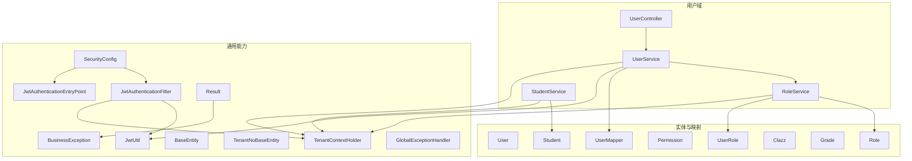
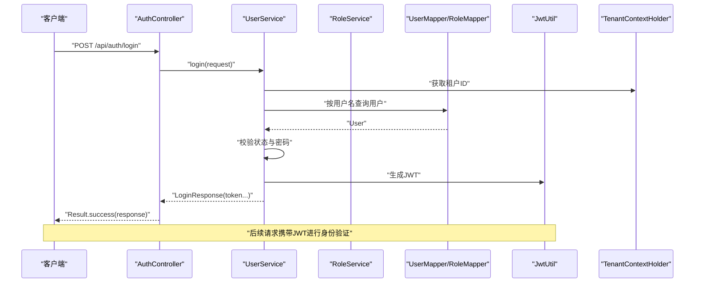
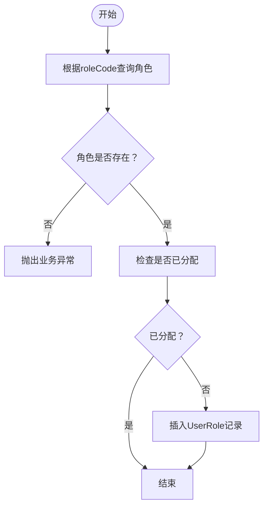
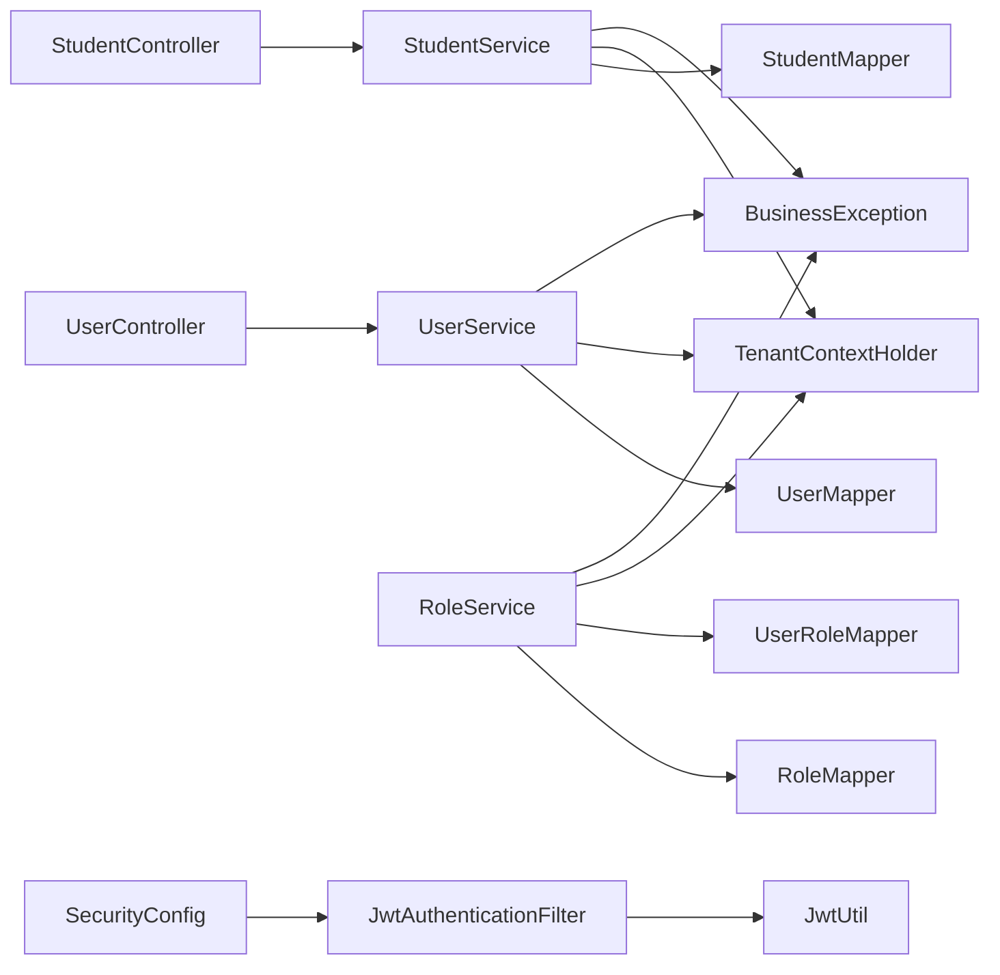

# 用户管理

<cite>
**本文引用的文件**
- [UserController.java](file://backend/src/main/java/com/edu/user/controller/UserController.java)
- [UserService.java](file://backend/src/main/java/com/edu/user/service/UserService.java)
- [User.java](file://backend/src/main/java/com/edu/user/entity/User.java)
- [CreateUserRequest.java](file://backend/src/main/java/com/edu/user/dto/CreateUserRequest.java)
- [UserMapper.java](file://backend/src/main/java/com/edu/user/mapper/UserMapper.java)
- [RoleService.java](file://backend/src/main/java/com/edu/user/service/RoleService.java)
- [Role.java](file://backend/src/main/java/com/edu/user/entity/Role.java)
- [UserRole.java](file://backend/src/main/java/com/edu/user/entity/UserRole.java)
- [Permission.java](file://backend/src/main/java/com/edu/user/entity/Permission.java)
- [StudentService.java](file://backend/src/main/java/com/edu/user/service/StudentService.java)
- [Student.java](file://backend/src/main/java/com/edu/user/entity/Student.java)
- [Clazz.java](file://backend/src/main/java/com/edu/user/entity/Clazz.java)
- [Grade.java](file://backend/src/main/java/com/edu/user/entity/Grade.java)
- [StudentController.java](file://backend/src/main/java/com/edu/user/controller/StudentController.java)
- [ClassController.java](file://backend/src/main/java/com/edu/user/controller/ClassController.java)
- [BaseEntity.java](file://backend/src/main/java/com/edu/common/entity/BaseEntity.java)
- [TenantNoBaseEntity.java](file://backend/src/main/java/com/edu/common/entity/TenantNoBaseEntity.java)
- [Result.java](file://backend/src/main/java/com/edu/common/entity/Result.java)
- [BusinessException.java](file://backend/src/main/java/com/edu/common/exception/BusinessException.java)
- [GlobalExceptionHandler.java](file://backend/src/main/java/com/edu/common/exception/GlobalExceptionHandler.java)
- [JwtUtil.java](file://backend/src/main/java/com/edu/common/util/JwtUtil.java)
- [TenantContextHolder.java](file://backend/src/main/java/com/edu/common/util/TenantContextHolder.java)
- [SecurityConfig.java](file://backend/src/main/java/com/edu/common/config/SecurityConfig.java)
- [JwtAuthenticationFilter.java](file://backend/src/main/java/com/edu/common/security/JwtAuthenticationFilter.java)
- [JwtAuthenticationEntryPoint.java](file://backend/src/main/java/com/edu/common/security/JwtAuthenticationEntryPoint.java)
- [MybatisPlusConfig.java](file://backend/src/main/java/com/edu/common/config/MybatisPlusConfig.java)
- [application.yml](file://backend/src/main/resources/application.yml)
- [schema.sql](file://backend/src/main/resources/db/schema.sql)
- [init-data.sql](file://backend/src/main/resources/db/init-data.sql)
</cite>

## 目录
1. [简介](#简介)
2. [项目结构](#项目结构)
3. [核心组件](#核心组件)
4. [架构总览](#架构总览)
5. [详细组件分析](#详细组件分析)
6. [依赖分析](#依赖分析)
7. [性能考虑](#性能考虑)
8. [故障排查指南](#故障排查指南)
9. [结论](#结论)
10. [附录](#附录)

## 简介
本文件为“用户管理模块”的综合技术文档，覆盖以下主题：
- 用户CRUD操作：创建、更新、查询、删除与当前用户信息获取
- 学生信息管理：创建、更新、按班级查询、学号查询、转班与删除
- 班级与年级管理：列表、按年级筛选、创建、更新、删除
- 角色与权限管理：角色分配、角色代码查询、权限继承与动态权限控制
- 完整API接口文档：请求参数、响应格式、错误处理
- 数据安全与隐私：密码加密、租户隔离、逻辑删除
- 数据迁移策略：基于MyBatis-Plus与数据库脚本的迁移方案

## 项目结构
后端采用分层架构，用户管理相关代码位于 com.edu.user 包下，包含控制器、服务、实体、映射器与DTO等。同时，通用能力如安全、异常处理、租户上下文、结果封装等位于 com.edu.common。



图表来源
- [UserController.java:1-79](file://backend/src/main/java/com/edu/user/controller/UserController.java#L1-L79)
- [UserService.java:1-194](file://backend/src/main/java/com/edu/user/service/UserService.java#L1-L194)
- [RoleService.java:1-83](file://backend/src/main/java/com/edu/user/service/RoleService.java#L1-L83)
- [StudentService.java:1-78](file://backend/src/main/java/com/edu/user/service/StudentService.java#L1-L78)
- [User.java:1-21](file://backend/src/main/java/com/edu/user/entity/User.java#L1-L21)
- [UserRole.java:1-15](file://backend/src/main/java/com/edu/user/entity/UserRole.java#L1-L15)
- [Role.java:1-18](file://backend/src/main/java/com/edu/user/entity/Role.java#L1-L18)
- [Permission.java:1-18](file://backend/src/main/java/com/edu/user/entity/Permission.java#L1-L18)
- [Student.java:1-22](file://backend/src/main/java/com/edu/user/entity/Student.java#L1-L22)
- [Clazz.java:1-18](file://backend/src/main/java/com/edu/user/entity/Clazz.java#L1-L18)
- [Grade.java:1-17](file://backend/src/main/java/com/edu/user/entity/Grade.java#L1-L17)
- [UserMapper.java:1-9](file://backend/src/main/java/com/edu/user/mapper/UserMapper.java#L1-L9)
- [SecurityConfig.java](file://backend/src/main/java/com/edu/common/config/SecurityConfig.java)
- [JwtAuthenticationFilter.java](file://backend/src/main/java/com/edu/common/security/JwtAuthenticationFilter.java)
- [JwtAuthenticationEntryPoint.java](file://backend/src/main/java/com/edu/common/security/JwtAuthenticationEntryPoint.java)
- [JwtUtil.java](file://backend/src/main/java/com/edu/common/util/JwtUtil.java)
- [TenantContextHolder.java](file://backend/src/main/java/com/edu/common/util/TenantContextHolder.java)
- [BaseEntity.java](file://backend/src/main/java/com/edu/common/entity/BaseEntity.java)
- [TenantNoBaseEntity.java](file://backend/src/main/java/com/edu/common/entity/TenantNoBaseEntity.java)
- [Result.java](file://backend/src/main/java/com/edu/common/entity/Result.java)
- [BusinessException.java](file://backend/src/main/java/com/edu/common/exception/BusinessException.java)
- [GlobalExceptionHandler.java](file://backend/src/main/java/com/edu/common/exception/GlobalExceptionHandler.java)

章节来源
- [UserController.java:1-79](file://backend/src/main/java/com/edu/user/controller/UserController.java#L1-L79)
- [UserService.java:1-194](file://backend/src/main/java/com/edu/user/service/UserService.java#L1-L194)
- [StudentService.java:1-78](file://backend/src/main/java/com/edu/user/service/StudentService.java#L1-L78)
- [RoleService.java:1-83](file://backend/src/main/java/com/edu/user/service/RoleService.java#L1-L83)

## 核心组件
- 控制器层：提供REST接口，负责请求接收、鉴权与返回统一结果包装
- 服务层：实现业务逻辑，包含租户上下文校验、密码加密、JWT签发、角色分配、学生管理等
- 实体与映射：定义用户、角色、学生、班级、年级等核心实体及MyBatis-Plus映射
- 安全与异常：基于Spring Security与JWT，全局异常处理统一返回

章节来源
- [UserController.java:1-79](file://backend/src/main/java/com/edu/user/controller/UserController.java#L1-L79)
- [UserService.java:1-194](file://backend/src/main/java/com/edu/user/service/UserService.java#L1-L194)
- [User.java:1-21](file://backend/src/main/java/com/edu/user/entity/User.java#L1-L21)
- [Role.java:1-18](file://backend/src/main/java/com/edu/user/entity/Role.java#L1-L18)
- [Student.java:1-22](file://backend/src/main/java/com/edu/user/entity/Student.java#L1-L22)
- [Clazz.java:1-18](file://backend/src/main/java/com/edu/user/entity/Clazz.java#L1-L18)
- [Grade.java:1-17](file://backend/src/main/java/com/edu/user/entity/Grade.java#L1-L17)
- [Result.java](file://backend/src/main/java/com/edu/common/entity/Result.java)
- [BusinessException.java](file://backend/src/main/java/com/edu/common/exception/BusinessException.java)
- [GlobalExceptionHandler.java](file://backend/src/main/java/com/edu/common/exception/GlobalExceptionHandler.java)

## 架构总览
用户管理模块遵循“控制器-服务-数据访问”分层，结合租户隔离与JWT认证，确保多租户环境下数据独立与安全。



图表来源
- [UserService.java:68-104](file://backend/src/main/java/com/edu/user/service/UserService.java#L68-L104)
- [JwtUtil.java](file://backend/src/main/java/com/edu/common/util/JwtUtil.java)
- [TenantContextHolder.java](file://backend/src/main/java/com/edu/common/util/TenantContextHolder.java)

## 详细组件分析

### 用户CRUD与当前用户信息
- 列表：GET /api/user/list
- 获取单个：GET /api/user/{id}
- 创建：POST /api/user（请求体 CreateUserRequest）
- 更新：PUT /api/user/{id}（请求体 User）
- 删除：DELETE /api/user/{id}
- 当前用户：GET /api/user/me（基于Authentication Principal）

实现要点
- 租户隔离：所有用户查询与创建均通过租户上下文过滤
- 密码安全：注册与登录使用PasswordEncoder与JWT
- 逻辑删除：删除用户时执行逻辑删除并清理用户角色关联
- 统一返回：Result.success()/Result.error()

章节来源
- [UserController.java:21-65](file://backend/src/main/java/com/edu/user/controller/UserController.java#L21-L65)
- [UserService.java:133-192](file://backend/src/main/java/com/edu/user/service/UserService.java#L133-L192)
- [CreateUserRequest.java:1-19](file://backend/src/main/java/com/edu/user/dto/CreateUserRequest.java#L1-L19)
- [User.java:1-21](file://backend/src/main/java/com/edu/user/entity/User.java#L1-L21)
- [UserMapper.java:1-9](file://backend/src/main/java/com/edu/user/mapper/UserMapper.java#L1-L9)
- [Result.java](file://backend/src/main/java/com/edu/common/entity/Result.java)

### 角色与权限管理
- 分配角色：PUT /api/user/{id}/role?roleCode=...
- 查询角色：GET /api/user/{id}/roles
- 角色实体：Role（code/name/description）
- 用户-角色关联：UserRole
- 权限实体：Permission（code/name/resource/action）

流程图：分配角色


图表来源
- [RoleService.java:34-55](file://backend/src/main/java/com/edu/user/service/RoleService.java#L34-L55)
- [Role.java:1-18](file://backend/src/main/java/com/edu/user/entity/Role.java#L1-L18)
- [UserRole.java:1-15](file://backend/src/main/java/com/edu/user/entity/UserRole.java#L1-L15)

章节来源
- [UserController.java:67-77](file://backend/src/main/java/com/edu/user/controller/UserController.java#L67-L77)
- [RoleService.java:26-81](file://backend/src/main/java/com/edu/user/service/RoleService.java#L26-L81)
- [Role.java:1-18](file://backend/src/main/java/com/edu/user/entity/Role.java#L1-L18)
- [UserRole.java:1-15](file://backend/src/main/java/com/edu/user/entity/UserRole.java#L1-L15)
- [Permission.java:1-18](file://backend/src/main/java/com/edu/user/entity/Permission.java#L1-L18)

### 学生信息管理
- 按班级查询：GET /api/student/class/{classId}
- 按ID查询：GET /api/student/{id}
- 按学号查询：GET /api/student/no/{studentNo}
- 创建：POST /api/student
- 更新：PUT /api/student/{id}
- 转班：PUT /api/student/{id}/transfer?newClassId=...
- 删除：DELETE /api/student/{id}

实现要点
- 租户隔离：查询与创建均绑定租户上下文
- 班级排序：按学号升序排列
- 转班：仅更新班级ID字段

章节来源
- [StudentController.java:1-66](file://backend/src/main/java/com/edu/user/controller/StudentController.java#L1-L66)
- [StudentService.java:21-77](file://backend/src/main/java/com/edu/user/service/StudentService.java#L21-L77)
- [Student.java:1-22](file://backend/src/main/java/com/edu/user/entity/Student.java#L1-L22)

### 班级与年级管理
- 班级
  - 列表：GET /api/class/list
  - 按年级筛选：GET /api/class/grade/{gradeId}
  - 获取：GET /api/class/{id}
  - 创建：POST /api/class
  - 更新：PUT /api/class/{id}
  - 删除：DELETE /api/class/{id}
- 年级：Grade（schoolId/name/level/sequence）

实现要点
- 班级列表按年级与名称排序
- 新建班级初始学生计数为0

章节来源
- [ClassController.java:1-64](file://backend/src/main/java/com/edu/user/controller/ClassController.java#L1-L64)
- [Clazz.java:1-18](file://backend/src/main/java/com/edu/user/entity/Clazz.java#L1-L18)
- [Grade.java:1-17](file://backend/src/main/java/com/edu/user/entity/Grade.java#L1-L17)

### 登录与注册流程
- 注册：UserService.register
  - 校验租户上下文
  - 校验用户名唯一性
  - 密码加密
  - 分配默认角色（TEACHER或指定角色）
- 登录：UserService.login
  - 校验租户上下文与用户存在性
  - 校验状态与密码
  - 生成JWT令牌

章节来源
- [UserService.java:35-104](file://backend/src/main/java/com/edu/user/service/UserService.java#L35-L104)

## 依赖分析
- 控制器依赖服务：UserController依赖UserService；StudentController依赖StudentService
- 服务依赖映射：UserService依赖UserMapper；StudentService依赖StudentMapper；RoleService依赖RoleMapper与UserRoleMapper
- 安全依赖：SecurityConfig配置过滤器链；JwtAuthenticationFilter负责解析JWT；JwtUtil生成与验证令牌
- 租户依赖：TenantContextHolder提供租户上下文；各Service在查询与创建时读取租户ID
- 异常依赖：BusinessException用于业务异常；GlobalExceptionHandler统一处理异常并返回Result.error



图表来源
- [UserController.java:1-79](file://backend/src/main/java/com/edu/user/controller/UserController.java#L1-L79)
- [UserService.java:1-194](file://backend/src/main/java/com/edu/user/service/UserService.java#L1-L194)
- [StudentController.java:1-66](file://backend/src/main/java/com/edu/user/controller/StudentController.java#L1-L66)
- [StudentService.java:1-78](file://backend/src/main/java/com/edu/user/service/StudentService.java#L1-L78)
- [RoleService.java:1-83](file://backend/src/main/java/com/edu/user/service/RoleService.java#L1-L83)
- [SecurityConfig.java](file://backend/src/main/java/com/edu/common/config/SecurityConfig.java)
- [JwtAuthenticationFilter.java](file://backend/src/main/java/com/edu/common/security/JwtAuthenticationFilter.java)
- [JwtUtil.java](file://backend/src/main/java/com/edu/common/util/JwtUtil.java)
- [TenantContextHolder.java](file://backend/src/main/java/com/edu/common/util/TenantContextHolder.java)
- [BusinessException.java](file://backend/src/main/java/com/edu/common/exception/BusinessException.java)

章节来源
- [UserController.java:1-79](file://backend/src/main/java/com/edu/user/controller/UserController.java#L1-L79)
- [UserService.java:1-194](file://backend/src/main/java/com/edu/user/service/UserService.java#L1-L194)
- [StudentController.java:1-66](file://backend/src/main/java/com/edu/user/controller/StudentController.java#L1-L66)
- [StudentService.java:1-78](file://backend/src/main/java/com/edu/user/service/StudentService.java#L1-L78)
- [RoleService.java:1-83](file://backend/src/main/java/com/edu/user/service/RoleService.java#L1-L83)

## 性能考虑
- 查询优化：按租户ID与必要字段建立索引，避免N+1查询；批量查询角色代码时先查UserRole再批量取Role
- 缓存建议：对常用角色与权限代码进行缓存，减少数据库访问
- 分页与排序：列表接口支持排序，建议在大数据量场景引入分页
- 事务边界：注册、分配角色、删除用户等操作使用@Transactional，保证一致性

## 故障排查指南
常见问题与定位
- 用户名重复：注册/创建用户时用户名唯一性校验失败
- 用户不存在：查询/更新/删除用户时未找到对应ID
- 密码错误：登录时密码不匹配
- 租户上下文缺失：未设置租户ID导致查询为空或业务异常
- 角色不存在：分配角色时roleCode无效

统一异常处理
- 全局异常处理器将业务异常转换为Result.error，便于前端统一处理

章节来源
- [UserService.java:41-47](file://backend/src/main/java/com/edu/user/service/UserService.java#L41-L47)
- [UserService.java:177-181](file://backend/src/main/java/com/edu/user/service/UserService.java#L177-L181)
- [UserService.java:88-91](file://backend/src/main/java/com/edu/user/service/UserService.java#L88-L91)
- [RoleService.java:36-39](file://backend/src/main/java/com/edu/user/service/RoleService.java#L36-L39)
- [GlobalExceptionHandler.java](file://backend/src/main/java/com/edu/common/exception/GlobalExceptionHandler.java)
- [BusinessException.java](file://backend/src/main/java/com/edu/common/exception/BusinessException.java)

## 结论
用户管理模块以租户隔离为核心，结合JWT认证与角色权限体系，实现了用户、学生、班级与年级的完整管理能力。通过统一的结果封装与异常处理，提升了系统的可用性与可维护性。建议在生产环境中进一步完善缓存策略、分页查询与审计日志。

## 附录

### API 接口文档

- 用户管理
  - GET /api/user/list
    - 请求：无
    - 响应：Result<List<User>>
  - GET /api/user/{id}
    - 请求：路径参数 id
    - 响应：Result<User>
  - POST /api/user
    - 请求体：CreateUserRequest（username/password/realName/email/phone/roleCode）
    - 响应：Result<User>
  - PUT /api/user/{id}
    - 请求体：User（除id外字段）
    - 响应：Result<Void>
  - DELETE /api/user/{id}
    - 请求：路径参数 id
    - 响应：Result<Void>
  - GET /api/user/me
    - 请求：认证头（Authorization: Bearer ...）
    - 响应：Result<User>
  - PUT /api/user/{id}/role?roleCode=...
    - 请求：路径参数 id，查询参数 roleCode
    - 响应：Result<Void>
  - GET /api/user/{id}/roles
    - 请求：路径参数 id
    - 响应：Result<List<String>>

- 学生管理
  - GET /api/student/class/{classId}
    - 请求：路径参数 classId
    - 响应：Result<List<Student>>
  - GET /api/student/{id}
    - 请求：路径参数 id
    - 响应：Result<Student>
  - GET /api/student/no/{studentNo}
    - 请求：路径参数 studentNo
    - 响应：Result<Student>
  - POST /api/student
    - 请求体：Student
    - 响应：Result<Student>
  - PUT /api/student/{id}
    - 请求体：Student
    - 响应：Result<Void>
  - PUT /api/student/{id}/transfer?newClassId=...
    - 请求：路径参数 id，查询参数 newClassId
    - 响应：Result<Void>
  - DELETE /api/student/{id}
    - 请求：路径参数 id
    - 响应：Result<Void>

- 班级管理
  - GET /api/class/list
    - 请求：无
    - 响应：Result<List<Clazz>>
  - GET /api/class/grade/{gradeId}
    - 请求：路径参数 gradeId
    - 响应：Result<List<Clazz>>
  - GET /api/class/{id}
    - 请求：路径参数 id
    - 响应：Result<Clazz>
  - POST /api/class
    - 请求体：Clazz
    - 响应：Result<Clazz>
  - PUT /api/class/{id}
    - 请求体：Clazz
    - 响应：Result<Void>
  - DELETE /api/class/{id}
    - 请求：路径参数 id
    - 响应：Result<Void>

章节来源
- [UserController.java:21-77](file://backend/src/main/java/com/edu/user/controller/UserController.java#L21-L77)
- [StudentController.java:18-65](file://backend/src/main/java/com/edu/user/controller/StudentController.java#L18-L65)
- [ClassController.java:19-63](file://backend/src/main/java/com/edu/user/controller/ClassController.java#L19-L63)
- [CreateUserRequest.java:1-19](file://backend/src/main/java/com/edu/user/dto/CreateUserRequest.java#L1-L19)
- [User.java:1-21](file://backend/src/main/java/com/edu/user/entity/User.java#L1-L21)
- [Student.java:1-22](file://backend/src/main/java/com/edu/user/entity/Student.java#L1-L22)
- [Clazz.java:1-18](file://backend/src/main/java/com/edu/user/entity/Clazz.java#L1-L18)

### 数据模型设计

```mermaid
erDiagram
SYS_USER {
bigint id PK
bigint tenant_id
varchar username
varchar password
varchar real_name
varchar email
varchar phone
varchar avatar
int status
datetime created_at
datetime updated_at
int deleted
}
ROLE {
bigint id PK
bigint tenant_id
varchar name
varchar code
varchar description
datetime created_at
datetime updated_at
}
USER_ROLE {
bigint id PK
bigint user_id FK
bigint role_id FK
datetime created_at
}
PERMISSION {
bigint id PK
bigint tenant_id
varchar code
varchar name
varchar resource
varchar action
datetime created_at
datetime updated_at
}
STUDENT {
bigint id PK
bigint tenant_id
bigint class_id FK
bigint user_id FK
varchar name
varchar student_no
int gender
date birth_date
int status
datetime created_at
datetime updated_at
int deleted
}
CLASS {
bigint id PK
bigint grade_id FK
varchar name
bigint teacher_id
int student_count
datetime created_at
datetime updated_at
}
GRADE {
bigint id PK
bigint school_id
varchar name
int level
int sequence
datetime created_at
}
SYS_USER ||--o{ USER_ROLE : "拥有"
ROLE ||--o{ USER_ROLE : "被授予"
CLASS ||--o{ STUDENT : "包含"
GRADE ||--o{ CLASS : "包含"
```

图表来源
- [User.java:1-21](file://backend/src/main/java/com/edu/user/entity/User.java#L1-L21)
- [UserRole.java:1-15](file://backend/src/main/java/com/edu/user/entity/UserRole.java#L1-L15)
- [Role.java:1-18](file://backend/src/main/java/com/edu/user/entity/Role.java#L1-L18)
- [Permission.java:1-18](file://backend/src/main/java/com/edu/user/entity/Permission.java#L1-L18)
- [Student.java:1-22](file://backend/src/main/java/com/edu/user/entity/Student.java#L1-L22)
- [Clazz.java:1-18](file://backend/src/main/java/com/edu/user/entity/Clazz.java#L1-L18)
- [Grade.java:1-17](file://backend/src/main/java/com/edu/user/entity/Grade.java#L1-L17)

### 安全与隐私
- 密码存储：注册与登录使用PasswordEncoder进行加密存储
- 认证与授权：基于JWT的无状态认证；SecurityConfig配置过滤器链
- 租户隔离：TenantContextHolder在服务层读取租户ID，确保跨租户数据隔离
- 逻辑删除：用户与学生删除时执行逻辑删除，保留审计痕迹

章节来源
- [UserService.java:52-53](file://backend/src/main/java/com/edu/user/service/UserService.java#L52-L53)
- [UserService.java:88-89](file://backend/src/main/java/com/edu/user/service/UserService.java#L88-L89)
- [SecurityConfig.java](file://backend/src/main/java/com/edu/common/config/SecurityConfig.java)
- [JwtAuthenticationFilter.java](file://backend/src/main/java/com/edu/common/security/JwtAuthenticationFilter.java)
- [JwtAuthenticationEntryPoint.java](file://backend/src/main/java/com/edu/common/security/JwtAuthenticationEntryPoint.java)
- [TenantContextHolder.java](file://backend/src/main/java/com/edu/common/util/TenantContextHolder.java)

### 数据迁移策略
- 初始化脚本：schema.sql定义表结构；init-data.sql初始化基础数据
- 迁移工具：MyBatis-Plus配置支持逻辑删除与自动填充
- 版本演进：新增字段建议使用非空约束与默认值，保持向后兼容

章节来源
- [schema.sql](file://backend/src/main/resources/db/schema.sql)
- [init-data.sql](file://backend/src/main/resources/db/init-data.sql)
- [MybatisPlusConfig.java](file://backend/src/main/java/com/edu/common/config/MybatisPlusConfig.java)
- [BaseEntity.java](file://backend/src/main/java/com/edu/common/entity/BaseEntity.java)
- [TenantNoBaseEntity.java](file://backend/src/main/java/com/edu/common/entity/TenantNoBaseEntity.java)