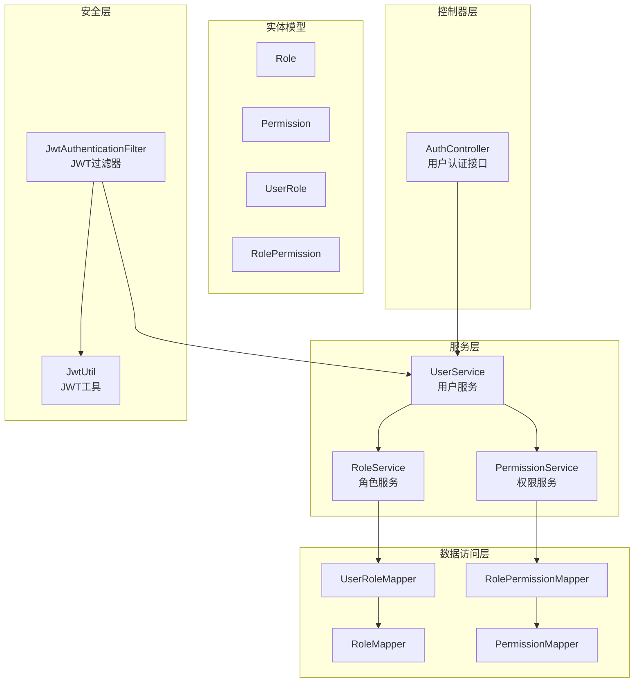
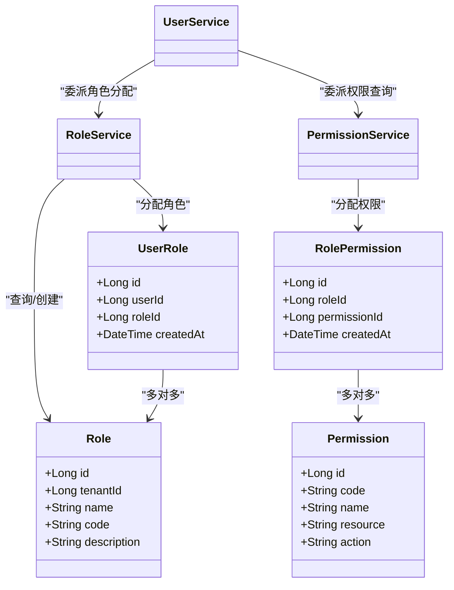
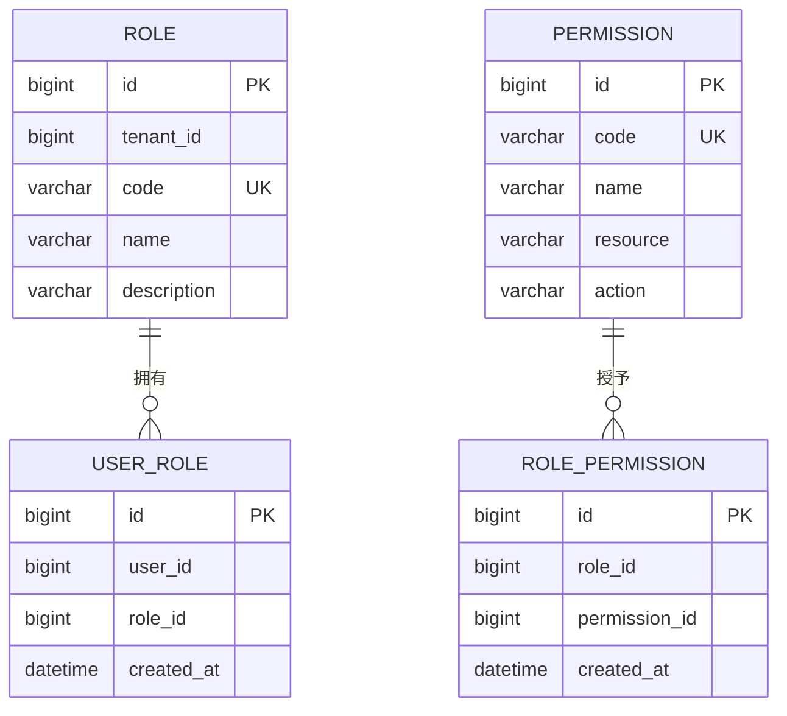
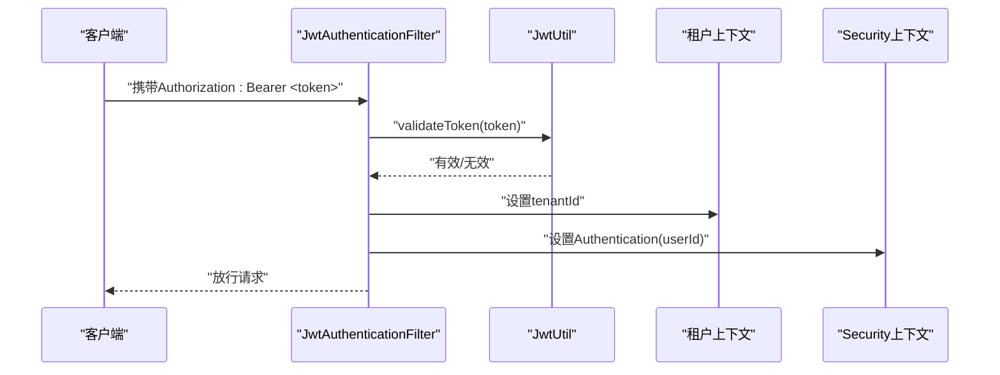
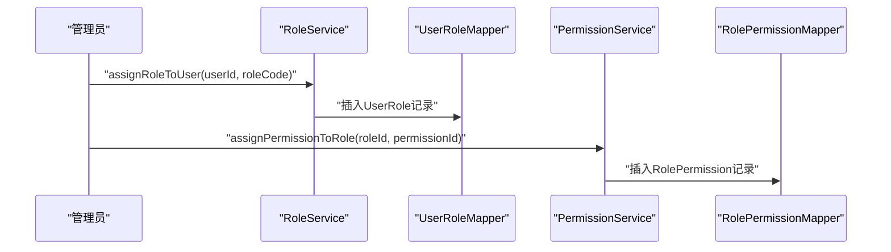
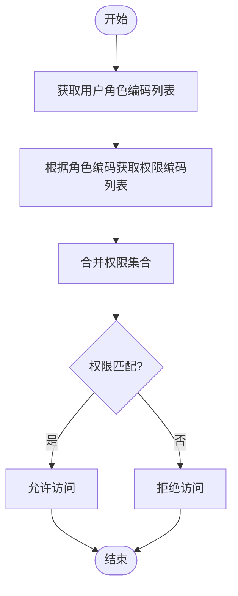
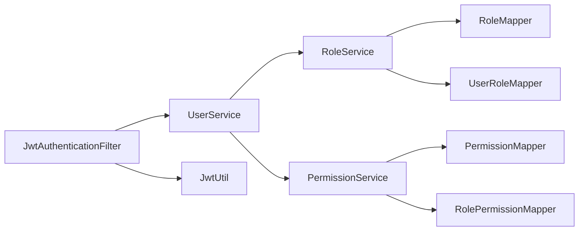

# 角色权限系统

<cite>
**本文引用的文件**
- [Role.java](file://backend/src/main/java/com/edu/user/entity/Role.java)
- [Permission.java](file://backend/src/main/java/com/edu/user/entity/Permission.java)
- [UserRole.java](file://backend/src/main/java/com/edu/user/entity/UserRole.java)
- [RolePermission.java](file://backend/src/main/java/com/edu/user/entity/RolePermission.java)
- [RoleMapper.java](file://backend/src/main/java/com/edu/user/mapper/RoleMapper.java)
- [PermissionMapper.java](file://backend/src/main/java/com/edu/user/mapper/PermissionMapper.java)
- [UserRoleMapper.java](file://backend/src/main/java/com/edu/user/mapper/UserRoleMapper.java)
- [RolePermissionMapper.java](file://backend/src/main/java/com/edu/user/mapper/RolePermissionMapper.java)
- [RoleService.java](file://backend/src/main/java/com/edu/user/service/RoleService.java)
- [PermissionService.java](file://backend/src/main/java/com/edu/user/service/PermissionService.java)
- [UserService.java](file://backend/src/main/java/com/edu/user/service/UserService.java)
- [AuthController.java](file://backend/src/main/java/com/edu/user/controller/AuthController.java)
- [JwtAuthenticationFilter.java](file://backend/src/main/java/com/edu/common/security/JwtAuthenticationFilter.java)
- [JwtUtil.java](file://backend/src/main/java/com/edu/common/util/JwtUtil.java)
- [schema.sql](file://backend/src/main/resources/db/schema.sql)
</cite>

## 目录
1. [简介](#简介)
2. [项目结构](#项目结构)
3. [核心组件](#核心组件)
4. [架构总览](#架构总览)
5. [详细组件分析](#详细组件分析)
6. [依赖分析](#依赖分析)
7. [性能考虑](#性能考虑)
8. [故障排查指南](#故障排查指南)
9. [结论](#结论)
10. [附录](#附录)

## 简介
本文件面向“角色权限系统”的设计与实现，围绕 RBAC（基于角色的访问控制）模型，系统性阐述角色定义、权限分配与用户授权的完整流程；深入解析 Role、Permission、UserRole、RolePermission 实体之间的关联关系与数据模型；说明权限系统的动态配置能力（如权限继承、角色组合与条件授权的扩展点）；给出角色权限管理的 API 接口文档；解释权限验证的执行流程、缓存策略与性能优化方案；并覆盖权限安全审计、冲突检测与权限回收机制。

## 项目结构
权限系统位于后端模块的用户子系统中，采用分层架构：控制器层负责对外暴露 API；服务层封装业务逻辑；数据访问层通过 MyBatis-Plus Mapper 进行数据库交互；安全层通过 JWT 过滤器注入用户身份上下文。

图表来源
- [AuthController.java:1-32](file://backend/src/main/java/com/edu/user/controller/AuthController.java#L1-32)
- [UserService.java:1-194](file://backend/src/main/java/com/edu/user/service/UserService.java#L1-194)
- [RoleService.java:1-83](file://backend/src/main/java/com/edu/user/service/RoleService.java#L1-83)
- [PermissionService.java:1-63](file://backend/src/main/java/com/edu/user/service/PermissionService.java#L1-63)
- [UserRoleMapper.java:1-9](file://backend/src/main/java/com/edu/user/mapper/UserRoleMapper.java#L1-9)
- [RolePermissionMapper.java:1-9](file://backend/src/main/java/com/edu/user/mapper/RolePermissionMapper.java#L1-9)
- [RoleMapper.java:1-9](file://backend/src/main/java/com/edu/user/mapper/RoleMapper.java#L1-9)
- [PermissionMapper.java:1-9](file://backend/src/main/java/com/edu/user/mapper/PermissionMapper.java#L1-9)
- [JwtAuthenticationFilter.java:1-70](file://backend/src/main/java/com/edu/common/security/JwtAuthenticationFilter.java#L1-70)
- [JwtUtil.java:1-123](file://backend/src/main/java/com/edu/common/util/JwtUtil.java#L1-123)

章节来源
- [AuthController.java:1-32](file://backend/src/main/java/com/edu/user/controller/AuthController.java#L1-32)
- [UserService.java:1-194](file://backend/src/main/java/com/edu/user/service/UserService.java#L1-194)
- [RoleService.java:1-83](file://backend/src/main/java/com/edu/user/service/RoleService.java#L1-83)
- [PermissionService.java:1-63](file://backend/src/main/java/com/edu/user/service/PermissionService.java#L1-63)
- [JwtAuthenticationFilter.java:1-70](file://backend/src/main/java/com/edu/common/security/JwtAuthenticationFilter.java#L1-70)
- [JwtUtil.java:1-123](file://backend/src/main/java/com/edu/common/util/JwtUtil.java#L1-123)

## 核心组件
- 实体模型
  - Role：角色实体，包含租户维度标识、角色编码与描述等字段。
  - Permission：权限实体，包含权限编码、资源与动作等字段。
  - UserRole：用户与角色的多对多关联表，记录用户的角色分配。
  - RolePermission：角色与权限的多对多关联表，记录角色的权限集合。
- 数据访问层
  - RoleMapper、PermissionMapper、UserRoleMapper、RolePermissionMapper：MyBatis-Plus Mapper 接口，提供基础 CRUD 能力。
- 服务层
  - RoleService：提供角色查询、分配、批量查询角色编码、创建角色等能力。
  - PermissionService：提供权限查询、角色权限查询、分配权限到角色等能力。
  - UserService：提供用户注册、登录、角色分配、角色列表查询等能力。
- 安全层
  - JwtAuthenticationFilter：从请求头提取 JWT，解析用户与租户上下文，注入 Spring Security 上下文。
  - JwtUtil：JWT 生成、解析与校验工具。

章节来源
- [Role.java:1-18](file://backend/src/main/java/com/edu/user/entity/Role.java#L1-18)
- [Permission.java:1-18](file://backend/src/main/java/com/edu/user/entity/Permission.java#L1-18)
- [UserRole.java:1-15](file://backend/src/main/java/com/edu/user/entity/UserRole.java#L1-15)
- [RolePermission.java:1-15](file://backend/src/main/java/com/edu/user/entity/RolePermission.java#L1-15)
- [RoleMapper.java:1-9](file://backend/src/main/java/com/edu/user/mapper/RoleMapper.java#L1-9)
- [PermissionMapper.java:1-9](file://backend/src/main/java/com/edu/user/mapper/PermissionMapper.java#L1-9)
- [UserRoleMapper.java:1-9](file://backend/src/main/java/com/edu/user/mapper/UserRoleMapper.java#L1-9)
- [RolePermissionMapper.java:1-9](file://backend/src/main/java/com/edu/user/mapper/RolePermissionMapper.java#L1-9)
- [RoleService.java:1-83](file://backend/src/main/java/com/edu/user/service/RoleService.java#L1-83)
- [PermissionService.java:1-63](file://backend/src/main/java/com/edu/user/service/PermissionService.java#L1-63)
- [UserService.java:1-194](file://backend/src/main/java/com/edu/user/service/UserService.java#L1-194)
- [JwtAuthenticationFilter.java:1-70](file://backend/src/main/java/com/edu/common/security/JwtAuthenticationFilter.java#L1-70)
- [JwtUtil.java:1-123](file://backend/src/main/java/com/edu/common/util/JwtUtil.java#L1-123)

## 架构总览
RBAC 权限架构以“用户—角色—权限”三层映射为核心，结合 JWT 认证与租户隔离，形成可扩展的权限体系。

图表来源
- [Role.java:1-18](file://backend/src/main/java/com/edu/user/entity/Role.java#L1-18)
- [Permission.java:1-18](file://backend/src/main/java/com/edu/user/entity/Permission.java#L1-18)
- [UserRole.java:1-15](file://backend/src/main/java/com/edu/user/entity/UserRole.java#L1-15)
- [RolePermission.java:1-15](file://backend/src/main/java/com/edu/user/entity/RolePermission.java#L1-15)
- [RoleService.java:1-83](file://backend/src/main/java/com/edu/user/service/RoleService.java#L1-83)
- [PermissionService.java:1-63](file://backend/src/main/java/com/edu/user/service/PermissionService.java#L1-63)
- [UserService.java:1-194](file://backend/src/main/java/com/edu/user/service/UserService.java#L1-194)

## 详细组件分析

### 数据模型与关系
- 角色与权限：通过 RolePermission 关联，支持角色拥有多个权限，权限可被多个角色复用。
- 用户与角色：通过 UserRole 关联，支持用户拥有多个角色，实现角色组合。
- 租户隔离：Role 与 User 表包含 tenant_id 字段，确保权限在租户维度内生效。
- 权限定义：Permission 为系统级权限，不绑定租户，便于跨租户统一管理。

图表来源
- [schema.sql:64-104](file://backend/src/main/resources/db/schema.sql#L64-L104)
- [Role.java:1-18](file://backend/src/main/java/com/edu/user/entity/Role.java#L1-18)
- [Permission.java:1-18](file://backend/src/main/java/com/edu/user/entity/Permission.java#L1-18)
- [UserRole.java:1-15](file://backend/src/main/java/com/edu/user/entity/UserRole.java#L1-15)
- [RolePermission.java:1-15](file://backend/src/main/java/com/edu/user/entity/RolePermission.java#L1-15)

章节来源
- [schema.sql:64-104](file://backend/src/main/resources/db/schema.sql#L64-L104)
- [Role.java:1-18](file://backend/src/main/java/com/edu/user/entity/Role.java#L1-18)
- [Permission.java:1-18](file://backend/src/main/java/com/edu/user/entity/Permission.java#L1-18)
- [UserRole.java:1-15](file://backend/src/main/java/com/edu/user/entity/UserRole.java#L1-15)
- [RolePermission.java:1-15](file://backend/src/main/java/com/edu/user/entity/RolePermission.java#L1-15)

### 权限验证执行流程
- 请求进入时，JwtAuthenticationFilter 从 Authorization 头解析 Bearer Token。
- 使用 JwtUtil 校验签名与有效期，提取 userId、tenantId、username。
- 将 tenantId 写入租户上下文，将 userId 注入 Spring Security 上下文，供后续业务使用。
- 对于公开接口（如 /api/auth/*），过滤器直接放行。

图表来源
- [JwtAuthenticationFilter.java:27-68](file://backend/src/main/java/com/edu/common/security/JwtAuthenticationFilter.java#L27-L68)
- [JwtUtil.java:66-77](file://backend/src/main/java/com/edu/common/util/JwtUtil.java#L66-L77)

章节来源
- [JwtAuthenticationFilter.java:1-70](file://backend/src/main/java/com/edu/common/security/JwtAuthenticationFilter.java#L1-70)
- [JwtUtil.java:1-123](file://backend/src/main/java/com/edu/common/util/JwtUtil.java#L1-123)

### 角色与权限分配流程
- 角色分配给用户：RoleService 根据角色编码查询角色，去重后写入 UserRole。
- 角色授予权限：PermissionService 将权限写入 RolePermission。
- 用户登录：UserService 登录成功后返回 JWT，前端用于后续鉴权。

图表来源
- [RoleService.java:34-55](file://backend/src/main/java/com/edu/user/service/RoleService.java#L34-L55)
- [PermissionService.java:49-56](file://backend/src/main/java/com/edu/user/service/PermissionService.java#L49-L56)

章节来源
- [RoleService.java:1-83](file://backend/src/main/java/com/edu/user/service/RoleService.java#L1-83)
- [PermissionService.java:1-63](file://backend/src/main/java/com/edu/user/service/PermissionService.java#L1-63)

### 动态配置能力与扩展点
- 权限继承与角色组合：当前模型通过 UserRole 支持用户拥有多个角色，实现角色组合；权限继承可通过在 RolePermission 中为角色添加更多权限实现。
- 条件授权：可在 Permission 增加条件字段（如 scope、condition），在权限检查时进行条件判断（当前实现未包含该字段，属于扩展点）。
- 动态授权：建议在权限检查处引入缓存与策略引擎，结合租户维度进行权限缓存与失效控制。

章节来源
- [UserRole.java:1-15](file://backend/src/main/java/com/edu/user/entity/UserRole.java#L1-15)
- [RolePermission.java:1-15](file://backend/src/main/java/com/edu/user/entity/RolePermission.java#L1-15)
- [Permission.java:1-18](file://backend/src/main/java/com/edu/user/entity/Permission.java#L1-18)

### API 接口文档
- 用户认证与注册
  - POST /api/auth/login：登录，返回 token、用户信息。
  - POST /api/auth/register：注册，创建用户并分配默认角色。
- 角色管理
  - GET /api/roles/by-code/{code}：按角色编码查询角色（需实现）。
  - POST /api/roles/{userId}/assign/{roleCode}：为用户分配角色。
  - GET /api/roles/{userId}/codes：获取用户角色编码列表。
  - POST /api/roles：创建角色。
- 权限管理
  - GET /api/permissions/by-code/{code}：按权限编码查询权限（需实现）。
  - GET /api/permissions/role/{roleId}/codes：获取角色权限编码列表。
  - POST /api/permissions/role/{roleId}/assign/{permissionId}：为角色分配权限。
  - GET /api/users/{userId}/permissions/codes：获取用户权限编码列表（需实现）。
- 用户管理
  - GET /api/users/{userId}/roles：获取用户角色列表。
  - POST /api/users/{userId}/roles/assign/{roleCode}：为用户分配角色。

章节来源
- [AuthController.java:1-32](file://backend/src/main/java/com/edu/user/controller/AuthController.java#L1-32)
- [UserService.java:124-131](file://backend/src/main/java/com/edu/user/service/UserService.java#L124-L131)
- [RoleService.java:26-32](file://backend/src/main/java/com/edu/user/service/RoleService.java#L26-L32)
- [RoleService.java:57-74](file://backend/src/main/java/com/edu/user/service/RoleService.java#L57-L74)
- [RoleService.java:76-81](file://backend/src/main/java/com/edu/user/service/RoleService.java#L76-L81)
- [PermissionService.java:24-28](file://backend/src/main/java/com/edu/user/service/PermissionService.java#L24-L28)
- [PermissionService.java:30-47](file://backend/src/main/java/com/edu/user/service/PermissionService.java#L30-L47)
- [PermissionService.java:49-56](file://backend/src/main/java/com/edu/user/service/PermissionService.java#L49-L56)

### 权限检查流程（建议实现）
- 获取当前用户角色编码列表。
- 根据角色编码获取角色权限编码列表。
- 合并用户所有角色的权限，形成权限集合。
- 进行权限匹配与条件判断（如资源范围、动作类型）。
- 返回允许/拒绝结果。

（本图为概念流程图，用于指导实现）

## 依赖分析
- 组件耦合
  - UserService 依赖 RoleService 与 PermissionService，承担用户生命周期与角色分配职责。
  - RoleService 与 PermissionService 依赖对应的 Mapper，实现角色与权限的持久化。
  - JwtAuthenticationFilter 依赖 JwtUtil 与租户上下文，负责认证与上下文注入。
- 外部依赖
  - MyBatis-Plus 提供 ORM 与 Mapper 能力。
  - Spring Security 提供认证上下文集成。
  - JWT 库用于令牌生成与校验。

图表来源
- [UserService.java:29-32](file://backend/src/main/java/com/edu/user/service/UserService.java#L29-L32)
- [RoleService.java:24-25](file://backend/src/main/java/com/edu/user/service/RoleService.java#L24-L25)
- [PermissionService.java:22-23](file://backend/src/main/java/com/edu/user/service/PermissionService.java#L22-L23)
- [JwtAuthenticationFilter.java:25-25](file://backend/src/main/java/com/edu/common/security/JwtAuthenticationFilter.java#L25-L25)

章节来源
- [UserService.java:1-194](file://backend/src/main/java/com/edu/user/service/UserService.java#L1-194)
- [RoleService.java:1-83](file://backend/src/main/java/com/edu/user/service/RoleService.java#L1-83)
- [PermissionService.java:1-63](file://backend/src/main/java/com/edu/user/service/PermissionService.java#L1-63)
- [JwtAuthenticationFilter.java:1-70](file://backend/src/main/java/com/edu/common/security/JwtAuthenticationFilter.java#L1-70)

## 性能考虑
- 批量查询优化
  - RoleService 在查询用户角色时，先查询用户的所有 UserRole，再批量查询角色，避免 N+1 查询。
  - PermissionService 在查询角色权限时，同样采用批量查询策略。
- 缓存策略
  - 建议对“用户角色编码列表”和“角色权限编码列表”进行缓存，结合租户维度与 TTL 控制。
  - 缓存失效：当角色或权限发生变更时，清理对应租户的缓存。
- 数据库索引
  - 用户角色与角色权限表均建立唯一索引，避免重复分配。
  - 建议为角色编码、权限编码建立唯一索引，提升查询效率。
- 事务与一致性
  - 角色分配与权限分配均使用事务，保证原子性。
  - 租户上下文在 JWT 过滤器中注入，避免跨租户数据泄露。

章节来源
- [RoleService.java:57-74](file://backend/src/main/java/com/edu/user/service/RoleService.java#L57-L74)
- [PermissionService.java:30-47](file://backend/src/main/java/com/edu/user/service/PermissionService.java#L30-L47)
- [schema.sql:88-104](file://backend/src/main/resources/db/schema.sql#L88-L104)

## 故障排查指南
- 认证失败
  - 检查 Authorization 头格式是否为 Bearer Token。
  - 校验 JWT 密钥与过期时间配置。
  - 查看 JwtAuthenticationFilter 是否正确注入租户上下文。
- 用户不存在或密码错误
  - 确认用户名与租户上下文匹配。
  - 检查密码编码器是否一致。
- 角色或权限不存在
  - 确认角色编码与权限编码是否正确。
  - 检查租户维度下的角色与权限是否存在。
- 权限不足
  - 检查用户角色是否正确分配。
  - 检查角色是否已授予所需权限。
  - 如启用缓存，确认缓存是否已刷新。

章节来源
- [JwtAuthenticationFilter.java:34-50](file://backend/src/main/java/com/edu/common/security/JwtAuthenticationFilter.java#L34-L50)
- [JwtUtil.java:66-77](file://backend/src/main/java/com/edu/common/util/JwtUtil.java#L66-L77)
- [UserService.java:68-104](file://backend/src/main/java/com/edu/user/service/UserService.java#L68-L104)
- [RoleService.java:34-55](file://backend/src/main/java/com/edu/user/service/RoleService.java#L34-L55)
- [PermissionService.java:49-56](file://backend/src/main/java/com/edu/user/service/PermissionService.java#L49-L56)

## 结论
本权限系统以 RBAC 为核心，结合 JWT 认证与租户隔离，提供了清晰的角色与权限模型。当前实现支持角色分配、权限授予与用户权限查询的基础能力；建议后续增强条件授权、权限缓存与审计日志，以满足更复杂的业务场景与性能需求。

## 附录
- 数据库初始化脚本与索引参考见 schema.sql。
- JWT 配置项（密钥与过期时间）由 JwtUtil 读取，需在应用配置中正确设置。

章节来源
- [schema.sql:1-379](file://backend/src/main/resources/db/schema.sql#L1-L379)
- [JwtUtil.java:20-24](file://backend/src/main/java/com/edu/common/util/JwtUtil.java#L20-L24)