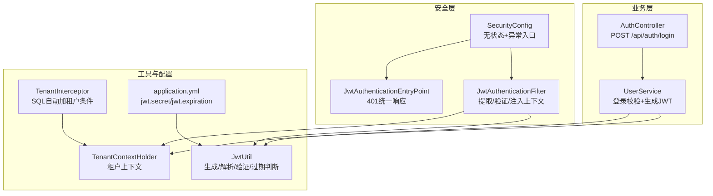
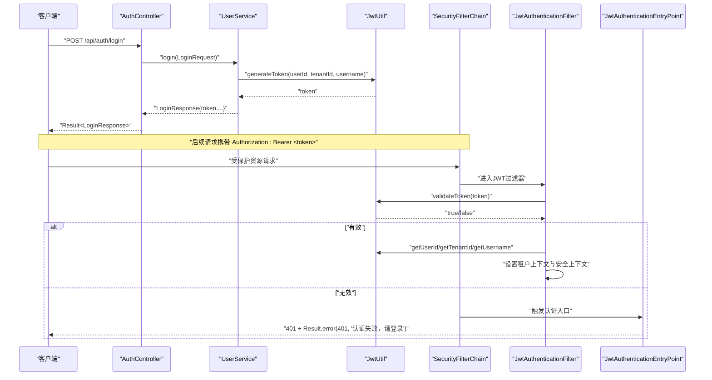
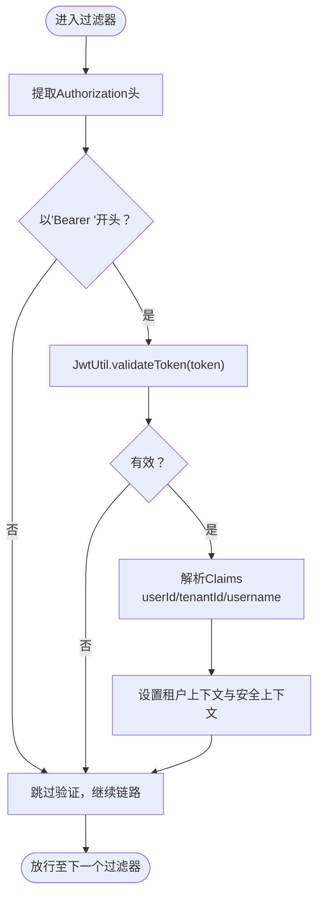
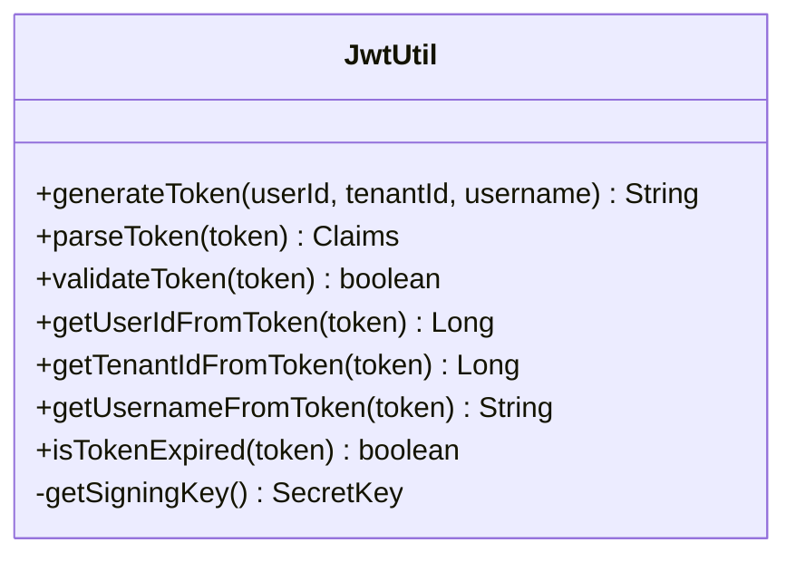
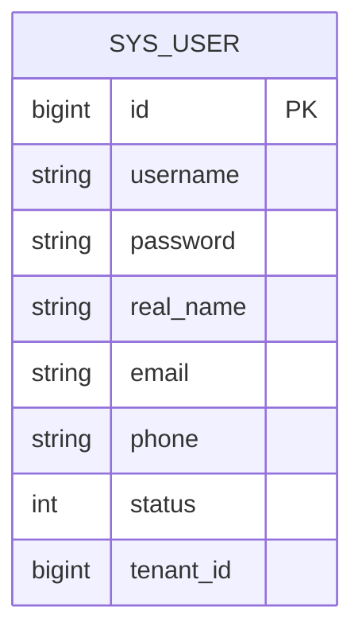
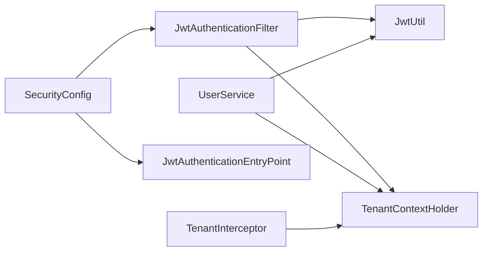

# JWT认证机制

<cite>
**本文引用的文件**
- [JwtAuthenticationFilter.java](file://backend/src/main/java/com/edu/common/security/JwtAuthenticationFilter.java)
- [JwtAuthenticationEntryPoint.java](file://backend/src/main/java/com/edu/common/security/JwtAuthenticationEntryPoint.java)
- [SecurityConfig.java](file://backend/src/main/java/com/edu/common/config/SecurityConfig.java)
- [JwtUtil.java](file://backend/src/main/java/com/edu/common/util/JwtUtil.java)
- [UserService.java](file://backend/src/main/java/com/edu/user/service/UserService.java)
- [AuthController.java](file://backend/src/main/java/com/edu/user/controller/AuthController.java)
- [LoginRequest.java](file://backend/src/main/java/com/edu/user/dto/LoginRequest.java)
- [LoginResponse.java](file://backend/src/main/java/com/edu/user/dto/LoginResponse.java)
- [TenantContextHolder.java](file://backend/src/main/java/com/edu/common/util/TenantContextHolder.java)
- [TenantInterceptor.java](file://backend/src/main/java/com/edu/common/interceptor/TenantInterceptor.java)
- [application.yml](file://backend/src/main/resources/application.yml)
- [Result.java](file://backend/src/main/java/com/edu/common/entity/Result.java)
- [JwtUtilTest.java](file://backend/src/test/java/com/edu/common/util/JwtUtilTest.java)
</cite>

## 目录
1. [简介](#简介)
2. [项目结构](#项目结构)
3. [核心组件](#核心组件)
4. [架构总览](#架构总览)
5. [详细组件分析](#详细组件分析)
6. [依赖分析](#依赖分析)
7. [性能考虑](#性能考虑)
8. [故障排查指南](#故障排查指南)
9. [结论](#结论)
10. [附录](#附录)

## 简介
本文件系统性阐述本教育平台的JWT认证机制，覆盖以下关键点：
- JWT结构与签名算法：基于对称密钥（HMAC）签名，包含标准字段与自定义租户信息。
- 生命周期：登录生成token、请求携带token、过滤器解析与校验、设置安全上下文。
- 过期与刷新：当前实现未提供自动刷新机制，建议客户端在过期前主动刷新或重新登录。
- 安全最佳实践：密钥管理、传输加密、最小权限、日志与异常处理。

## 项目结构
围绕JWT认证的关键模块分布如下：
- 安全配置：Spring Security配置与无状态策略、异常入口。
- 过滤器链：JWT过滤器负责提取、解析与验证token，并注入认证上下文。
- 工具类：JWT工具类封装生成、解析、验证、过期判断等核心能力。
- 控制器与服务：登录接口生成token；业务层通过租户上下文隔离数据。
- 统一响应：统一返回体包装错误码与消息。

图表来源
- [SecurityConfig.java:26-43](file://backend/src/main/java/com/edu/common/config/SecurityConfig.java#L26-L43)
- [JwtAuthenticationFilter.java:27-53](file://backend/src/main/java/com/edu/common/security/JwtAuthenticationFilter.java#L27-L53)
- [JwtAuthenticationEntryPoint.java:18-30](file://backend/src/main/java/com/edu/common/security/JwtAuthenticationEntryPoint.java#L18-L30)
- [JwtUtil.java:33-45](file://backend/src/main/java/com/edu/common/util/JwtUtil.java#L33-L45)
- [UserService.java:68-104](file://backend/src/main/java/com/edu/user/service/UserService.java#L68-L104)
- [AuthController.java:20-24](file://backend/src/main/java/com/edu/user/controller/AuthController.java#L20-L24)
- [application.yml:45-47](file://backend/src/main/resources/application.yml#L45-L47)

章节来源
- [SecurityConfig.java:26-43](file://backend/src/main/java/com/edu/common/config/SecurityConfig.java#L26-L43)
- [JwtAuthenticationFilter.java:27-53](file://backend/src/main/java/com/edu/common/security/JwtAuthenticationFilter.java#L27-L53)
- [JwtUtil.java:33-45](file://backend/src/main/java/com/edu/common/util/JwtUtil.java#L33-L45)
- [UserService.java:68-104](file://backend/src/main/java/com/edu/user/service/UserService.java#L68-L104)
- [AuthController.java:20-24](file://backend/src/main/java/com/edu/user/controller/AuthController.java#L20-L24)
- [application.yml:45-47](file://backend/src/main/resources/application.yml#L45-L47)

## 核心组件
- 安全配置
  - 无状态会话策略，关闭CSRF与H2控制台防护。
  - 公开接口放行（认证与租户相关），其余请求需认证。
  - 自定义认证入口，统一返回401与Result格式。
- JWT过滤器
  - 从Authorization头提取Bearer token。
  - 调用JwtUtil进行验证与解析，注入用户ID到安全上下文。
  - 放行公共路径（/api/auth/, /api/tenant/）。
- JWT工具类
  - 基于HMAC-SHA对称密钥生成与验证。
  - Claims包含用户ID、租户ID、用户名；过期时间由配置决定。
  - 提供解析、验证、取用户ID/租户ID/用户名、过期判断。
- 用户服务与控制器
  - 登录时根据租户上下文校验用户并生成JWT。
  - 返回统一Result包装的LoginResponse，包含token与用户信息。
- 租户上下文与拦截器
  - TenantContextHolder在线程内传递租户ID。
  - TenantInterceptor在MyBatis查询前自动追加tenant_id条件，保障多租户隔离。

章节来源
- [SecurityConfig.java:26-43](file://backend/src/main/java/com/edu/common/config/SecurityConfig.java#L26-L43)
- [JwtAuthenticationFilter.java:34-50](file://backend/src/main/java/com/edu/common/security/JwtAuthenticationFilter.java#L34-L50)
- [JwtUtil.java:33-45](file://backend/src/main/java/com/edu/common/util/JwtUtil.java#L33-L45)
- [UserService.java:68-104](file://backend/src/main/java/com/edu/user/service/UserService.java#L68-L104)
- [AuthController.java:20-24](file://backend/src/main/java/com/edu/user/controller/AuthController.java#L20-L24)
- [TenantContextHolder.java:12-18](file://backend/src/main/java/com/edu/common/util/TenantContextHolder.java#L12-L18)
- [TenantInterceptor.java:66-95](file://backend/src/main/java/com/edu/common/interceptor/TenantInterceptor.java#L66-L95)

## 架构总览
JWT认证在请求生命周期中的位置与交互如下：

图表来源
- [AuthController.java:20-24](file://backend/src/main/java/com/edu/user/controller/AuthController.java#L20-L24)
- [UserService.java:68-104](file://backend/src/main/java/com/edu/user/service/UserService.java#L68-L104)
- [JwtUtil.java:33-45](file://backend/src/main/java/com/edu/common/util/JwtUtil.java#L33-L45)
- [SecurityConfig.java:32-40](file://backend/src/main/java/com/edu/common/config/SecurityConfig.java#L32-L40)
- [JwtAuthenticationFilter.java:34-50](file://backend/src/main/java/com/edu/common/security/JwtAuthenticationFilter.java#L34-L50)
- [JwtAuthenticationEntryPoint.java:18-30](file://backend/src/main/java/com/edu/common/security/JwtAuthenticationEntryPoint.java#L18-L30)

## 详细组件分析

### JwtAuthenticationFilter 安全过滤器
职责与流程
- 提取token：从Authorization头按Bearer模式提取。
- 验证与解析：调用JwtUtil.validateToken与parseToken。
- 注入上下文：当userId与tenantId有效时，设置租户上下文与Spring Security认证上下文。
- 放行策略：对公开路径直接放行。

图表来源
- [JwtAuthenticationFilter.java:34-50](file://backend/src/main/java/com/edu/common/security/JwtAuthenticationFilter.java#L34-L50)
- [JwtUtil.java:66-77](file://backend/src/main/java/com/edu/common/util/JwtUtil.java#L66-L77)

章节来源
- [JwtAuthenticationFilter.java:27-68](file://backend/src/main/java/com/edu/common/security/JwtAuthenticationFilter.java#L27-L68)

### JwtUtil 工具类
核心方法与行为
- generateToken：构建JWT，设置sub（用户ID）、自定义claims（tenantId、username）、签发时间与过期时间，使用HMAC签名。
- parseToken：解析并返回Claims，异常时记录告警并返回null。
- validateToken：尝试解析并验证签名，成功返回true，失败返回false。
- getUserIdFromToken/getTenantIdFromToken/getUsernameFromToken：从Claims中读取对应值。
- isTokenExpired：判断是否过期。

图表来源
- [JwtUtil.java:33-121](file://backend/src/main/java/com/edu/common/util/JwtUtil.java#L33-L121)

章节来源
- [JwtUtil.java:33-121](file://backend/src/main/java/com/edu/common/util/JwtUtil.java#L33-L121)

### SecurityConfig 安全配置
要点
- 无状态：SessionCreationPolicy.STATELESS。
- 异常处理：JwtAuthenticationEntryPoint统一401响应。
- 路由放行：/api/auth/**、/api/tenant/**、/h2-console/**、/error放行。
- 过滤器插入：在UsernamePasswordAuthenticationFilter之前加入JWT过滤器。

章节来源
- [SecurityConfig.java:26-43](file://backend/src/main/java/com/edu/common/config/SecurityConfig.java#L26-L43)

### 认证流程与代码示例路径
- 登录生成token
  - 控制器：[AuthController.java:20-24](file://backend/src/main/java/com/edu/user/controller/AuthController.java#L20-L24)
  - 服务：[UserService.java:68-104](file://backend/src/main/java/com/edu/user/service/UserService.java#L68-L104)
  - 工具：[JwtUtil.java:33-45](file://backend/src/main/java/com/edu/common/util/JwtUtil.java#L33-L45)
- 请求携带token并验证
  - 过滤器：[JwtAuthenticationFilter.java:34-50](file://backend/src/main/java/com/edu/common/security/JwtAuthenticationFilter.java#L34-L50)
  - 配置：[SecurityConfig.java:32-40](file://backend/src/main/java/com/edu/common/config/SecurityConfig.java#L32-L40)
- 统一响应
  - [Result.java:21-38](file://backend/src/main/java/com/edu/common/entity/Result.java#L21-L38)

章节来源
- [AuthController.java:20-24](file://backend/src/main/java/com/edu/user/controller/AuthController.java#L20-L24)
- [UserService.java:68-104](file://backend/src/main/java/com/edu/user/service/UserService.java#L68-L104)
- [JwtUtil.java:33-45](file://backend/src/main/java/com/edu/common/util/JwtUtil.java#L33-L45)
- [JwtAuthenticationFilter.java:34-50](file://backend/src/main/java/com/edu/common/security/JwtAuthenticationFilter.java#L34-L50)
- [SecurityConfig.java:32-40](file://backend/src/main/java/com/edu/common/config/SecurityConfig.java#L32-L40)
- [Result.java:21-38](file://backend/src/main/java/com/edu/common/entity/Result.java#L21-L38)

### 数据模型与租户隔离
- 用户实体映射sys_user表。
- 租户上下文在请求线程内传递，TenantInterceptor在SQL查询前自动追加tenant_id条件，避免跨租户数据泄露。

图表来源
- [User.java:11-20](file://backend/src/main/java/com/edu/user/entity/User.java#L11-L20)
- [TenantInterceptor.java:66-95](file://backend/src/main/java/com/edu/common/interceptor/TenantInterceptor.java#L66-L95)

章节来源
- [User.java:11-20](file://backend/src/main/java/com/edu/user/entity/User.java#L11-L20)
- [TenantContextHolder.java:12-18](file://backend/src/main/java/com/edu/common/util/TenantContextHolder.java#L12-L18)
- [TenantInterceptor.java:66-95](file://backend/src/main/java/com/edu/common/interceptor/TenantInterceptor.java#L66-L95)

## 依赖分析
- 组件耦合
  - JwtAuthenticationFilter依赖JwtUtil与TenantContextHolder。
  - UserService依赖JwtUtil、TenantContextHolder与PasswordEncoder。
  - SecurityConfig依赖JwtAuthenticationFilter与JwtAuthenticationEntryPoint。
  - TenantInterceptor依赖TenantContextHolder。
- 外部依赖
  - JWT库：io.jsonwebtoken（HMAC-SHA）。
  - Spring Security：过滤器链、异常处理。
  - MyBatis-Plus：SQL拦截与租户条件注入。

图表来源
- [JwtAuthenticationFilter.java:25-25](file://backend/src/main/java/com/edu/common/security/JwtAuthenticationFilter.java#L25-L25)
- [UserService.java:32-32](file://backend/src/main/java/com/edu/user/service/UserService.java#L32-L32)
- [SecurityConfig.java:23-24](file://backend/src/main/java/com/edu/common/config/SecurityConfig.java#L23-L24)

章节来源
- [JwtAuthenticationFilter.java:25-25](file://backend/src/main/java/com/edu/common/security/JwtAuthenticationFilter.java#L25-L25)
- [UserService.java:32-32](file://backend/src/main/java/com/edu/user/service/UserService.java#L32-L32)
- [SecurityConfig.java:23-24](file://backend/src/main/java/com/edu/common/config/SecurityConfig.java#L23-L24)

## 性能考虑
- 无状态设计：避免服务器端会话存储，降低内存压力。
- 过滤器轻量：仅做token提取与验证，不涉及数据库访问。
- 密钥计算：每次验证均进行HMAC校验，建议在高并发场景确保密钥长度与CPU性能充足。
- 建议
  - 将租户ID与用户ID放入Claims，减少后续查询解析成本。
  - 对高频接口可考虑缓存短期有效的token元信息（需配合黑名单策略）。

## 故障排查指南
- 401未认证
  - 检查请求头Authorization是否为Bearer模式。
  - 查看JwtAuthenticationEntryPoint返回的统一错误响应。
- token无效或过期
  - 使用JwtUtil.validateToken与isTokenExpired进行诊断。
  - 核对jwt.secret与jwt.expiration配置是否一致且合理。
- 登录失败
  - 确认用户名、密码正确，租户上下文已设置。
  - 检查UserService中密码编码与匹配逻辑。
- 单元测试参考
  - [JwtUtilTest.java:21-54](file://backend/src/test/java/com/edu/common/util/JwtUtilTest.java#L21-L54)

章节来源
- [JwtAuthenticationEntryPoint.java:18-30](file://backend/src/main/java/com/edu/common/security/JwtAuthenticationEntryPoint.java#L18-L30)
- [JwtUtil.java:66-77](file://backend/src/main/java/com/edu/common/util/JwtUtil.java#L66-L77)
- [JwtUtilTest.java:21-54](file://backend/src/test/java/com/edu/common/util/JwtUtilTest.java#L21-L54)
- [UserService.java:68-104](file://backend/src/main/java/com/edu/user/service/UserService.java#L68-L104)

## 结论
本项目采用标准JWT方案实现无状态认证：登录生成token，请求携带token，过滤器解析验证并注入上下文。结合租户上下文与SQL拦截器，实现多租户数据隔离。当前未内置token刷新机制，建议客户端在过期前主动刷新或重新登录。整体设计简洁清晰，易于扩展与维护。

## 附录
- 配置项
  - jwt.secret：JWT签名密钥（建议足够长且保密）。
  - jwt.expiration：token有效期（毫秒，默认24小时）。
- 关键DTO
  - [LoginRequest.java:7-12](file://backend/src/main/java/com/edu/user/dto/LoginRequest.java#L7-L12)
  - [LoginResponse.java:6-11](file://backend/src/main/java/com/edu/user/dto/LoginResponse.java#L6-L11)
- 统一响应
  - [Result.java:21-38](file://backend/src/main/java/com/edu/common/entity/Result.java#L21-L38)

章节来源
- [application.yml:45-47](file://backend/src/main/resources/application.yml#L45-L47)
- [LoginRequest.java:7-12](file://backend/src/main/java/com/edu/user/dto/LoginRequest.java#L7-L12)
- [LoginResponse.java:6-11](file://backend/src/main/java/com/edu/user/dto/LoginResponse.java#L6-L11)
- [Result.java:21-38](file://backend/src/main/java/com/edu/common/entity/Result.java#L21-L38)