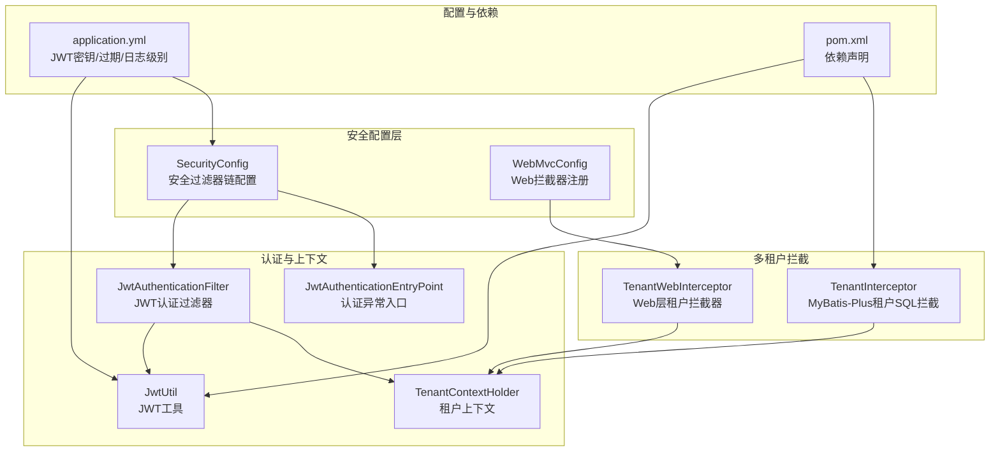
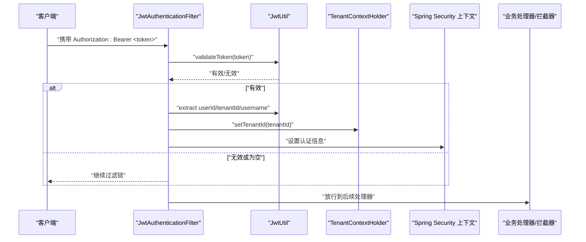
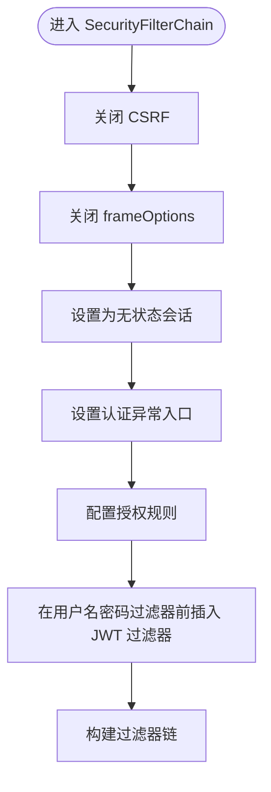
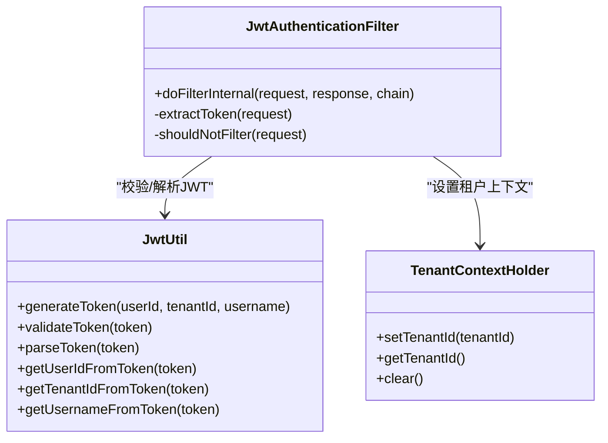
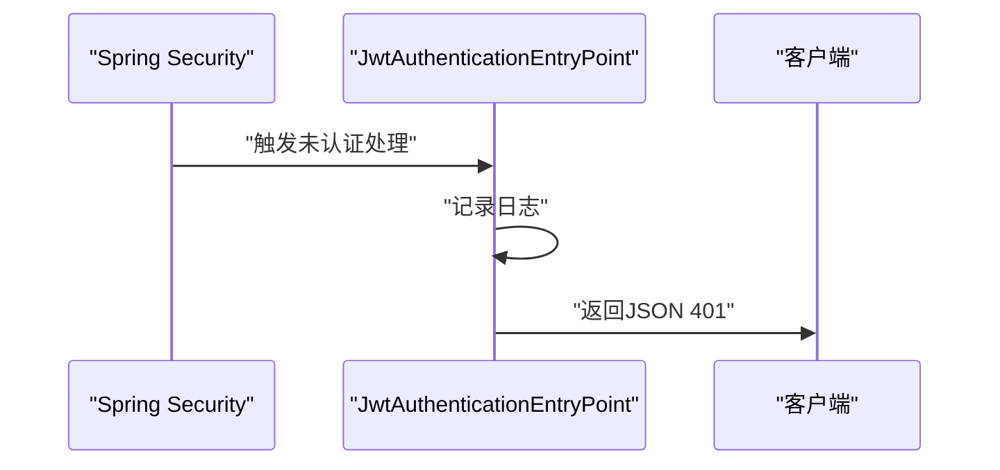
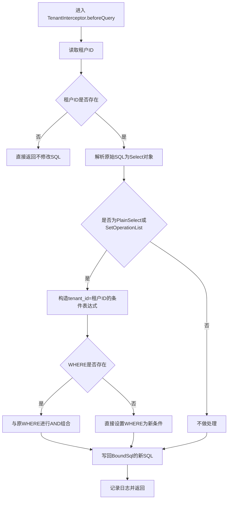
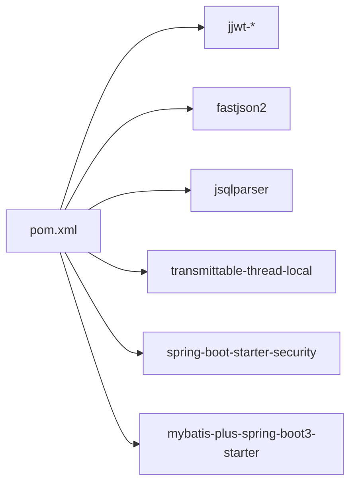

# 安全配置

<cite>
**本文引用的文件**
- [SecurityConfig.java](file://backend/src/main/java/com/edu/common/config/SecurityConfig.java)
- [JwtAuthenticationFilter.java](file://backend/src/main/java/com/edu/common/security/JwtAuthenticationFilter.java)
- [JwtAuthenticationEntryPoint.java](file://backend/src/main/java/com/edu/common/security/JwtAuthenticationEntryPoint.java)
- [JwtUtil.java](file://backend/src/main/java/com/edu/common/util/JwtUtil.java)
- [TenantContextHolder.java](file://backend/src/main/java/com/edu/common/util/TenantContextHolder.java)
- [TenantInterceptor.java](file://backend/src/main/java/com/edu/common/interceptor/TenantInterceptor.java)
- [TenantWebInterceptor.java](file://backend/src/main/java/com/edu/common/interceptor/TenantWebInterceptor.java)
- [WebMvcConfig.java](file://backend/src/main/java/com/edu/common/config/WebMvcConfig.java)
- [application.yml](file://backend/src/main/resources/application.yml)
- [pom.xml](file://backend/pom.xml)
</cite>

## 目录
1. [简介](#简介)
2. [项目结构](#项目结构)
3. [核心组件](#核心组件)
4. [架构总览](#架构总览)
5. [详细组件分析](#详细组件分析)
6. [依赖分析](#依赖分析)
7. [性能考虑](#性能考虑)
8. [故障排查指南](#故障排查指南)
9. [结论](#结论)
10. [附录](#附录)

## 简介
本文件系统性梳理后端安全配置与实现，重点覆盖以下方面：
- Spring Security 的 HTTP 安全配置、CORS 跨域处理、CSRF 防护与会话管理策略
- 安全过滤器链：认证过滤器、权限过滤器与多租户拦截器的执行顺序与作用机制
- 租户隔离的安全实现：数据访问控制与多租户上下文管理
- 安全最佳实践：密码加密策略、安全头设置、HTTPS 强制跳转等加固建议
- 异常处理机制与安全事件日志记录方案

## 项目结构
围绕安全相关的关键文件分布如下：
- 安全配置类：SecurityConfig
- 认证与异常处理：JwtAuthenticationFilter、JwtAuthenticationEntryPoint、JwtUtil
- 多租户上下文与拦截器：TenantContextHolder、TenantInterceptor、TenantWebInterceptor、WebMvcConfig
- 应用配置：application.yml
- 依赖声明：pom.xml

图表来源
- [SecurityConfig.java:26-43](file://backend/src/main/java/com/edu/common/config/SecurityConfig.java#L26-L43)
- [WebMvcConfig.java:18-23](file://backend/src/main/java/com/edu/common/config/WebMvcConfig.java#L18-L23)
- [JwtAuthenticationFilter.java:27-53](file://backend/src/main/java/com/edu/common/security/JwtAuthenticationFilter.java#L27-L53)
- [JwtAuthenticationEntryPoint.java:18-30](file://backend/src/main/java/com/edu/common/security/JwtAuthenticationEntryPoint.java#L18-L30)
- [JwtUtil.java:33-45](file://backend/src/main/java/com/edu/common/util/JwtUtil.java#L33-L45)
- [TenantContextHolder.java:12-22](file://backend/src/main/java/com/edu/common/util/TenantContextHolder.java#L12-L22)
- [TenantWebInterceptor.java:20-41](file://backend/src/main/java/com/edu/common/interceptor/TenantWebInterceptor.java#L20-L41)
- [TenantInterceptor.java:68-95](file://backend/src/main/java/com/edu/common/interceptor/TenantInterceptor.java#L68-L95)
- [application.yml:45-64](file://backend/src/main/resources/application.yml#L45-L64)
- [pom.xml:75-92](file://backend/pom.xml#L75-L92)

章节来源
- [SecurityConfig.java:26-43](file://backend/src/main/java/com/edu/common/config/SecurityConfig.java#L26-L43)
- [WebMvcConfig.java:18-23](file://backend/src/main/java/com/edu/common/config/WebMvcConfig.java#L18-L23)

## 核心组件
- 安全过滤器链与授权规则：通过 SecurityFilterChain 配置 CSRF 关闭、frameOptions 关闭、无状态会话、公开路径放行与统一认证入口。
- JWT 认证过滤器：在用户名密码过滤器之前执行，从 Authorization 头解析 Bearer Token，校验并通过后设置租户上下文与 Spring Security 上下文。
- 认证异常处理：未认证时返回 JSON 错误响应与 401 状态码。
- 密码加密策略：BCryptPasswordEncoder。
- 多租户上下文：基于 TransmittableThreadLocal 的租户 ID 传递。
- 数据访问控制：TenantInterceptor 基于 JSqlParser 自动为 SELECT 添加 tenant_id 条件，并对特定表豁免。
- Web 层租户拦截：TenantWebInterceptor 从请求头 X-Tenant-Id 注入租户上下文。

章节来源
- [SecurityConfig.java:26-48](file://backend/src/main/java/com/edu/common/config/SecurityConfig.java#L26-L48)
- [JwtAuthenticationFilter.java:27-68](file://backend/src/main/java/com/edu/common/security/JwtAuthenticationFilter.java#L27-L68)
- [JwtAuthenticationEntryPoint.java:18-30](file://backend/src/main/java/com/edu/common/security/JwtAuthenticationEntryPoint.java#L18-L30)
- [JwtUtil.java:33-45](file://backend/src/main/java/com/edu/common/util/JwtUtil.java#L33-L45)
- [TenantContextHolder.java:12-22](file://backend/src/main/java/com/edu/common/util/TenantContextHolder.java#L12-L22)
- [TenantInterceptor.java:68-140](file://backend/src/main/java/com/edu/common/interceptor/TenantInterceptor.java#L68-L140)
- [TenantWebInterceptor.java:20-41](file://backend/src/main/java/com/edu/common/interceptor/TenantWebInterceptor.java#L20-L41)

## 架构总览
下图展示安全过滤器链与多租户拦截的整体交互流程：

图表来源
- [JwtAuthenticationFilter.java:27-53](file://backend/src/main/java/com/edu/common/security/JwtAuthenticationFilter.java#L27-L53)
- [JwtUtil.java:66-99](file://backend/src/main/java/com/edu/common/util/JwtUtil.java#L66-L99)
- [TenantContextHolder.java:12-18](file://backend/src/main/java/com/edu/common/util/TenantContextHolder.java#L12-L18)

## 详细组件分析

### Spring Security 过滤器链与授权策略
- CSRF 关闭：开发阶段便于前后端分离调试，生产环境建议启用。
- Headers 中 frameOptions 关闭：为 H2 控制台放行。
- SessionCreationPolicy 设为 STATELESS：无状态会话，依赖 JWT。
- 异常处理：未认证统一由 JwtAuthenticationEntryPoint 输出 JSON 401。
- 授权规则：/api/auth/**、/api/tenant/**、/h2-console/**、/error 明确放行；其余请求需认证。
- 过滤器插入点：在 UsernamePasswordAuthenticationFilter 之前插入 JwtAuthenticationFilter。

图表来源
- [SecurityConfig.java:27-42](file://backend/src/main/java/com/edu/common/config/SecurityConfig.java#L27-L42)

章节来源
- [SecurityConfig.java:27-42](file://backend/src/main/java/com/edu/common/config/SecurityConfig.java#L27-L42)

### JWT 认证过滤器与上下文注入
- 请求头解析：从 Authorization 提取 Bearer Token。
- 校验与解析：调用 JwtUtil.validateToken 与 parseToken 获取 claims。
- 上下文设置：将 tenantId 写入 TenantContextHolder；将 userId 写入 Spring Security 上下文以供方法级安全与业务使用。
- 放行逻辑：对 /api/auth/** 与 /api/tenant/** 路径直接放行，避免重复认证。

图表来源
- [JwtAuthenticationFilter.java:27-68](file://backend/src/main/java/com/edu/common/security/JwtAuthenticationFilter.java#L27-L68)
- [JwtUtil.java:33-121](file://backend/src/main/java/com/edu/common/util/JwtUtil.java#L33-L121)
- [TenantContextHolder.java:12-22](file://backend/src/main/java/com/edu/common/util/TenantContextHolder.java#L12-L22)

章节来源
- [JwtAuthenticationFilter.java:27-68](file://backend/src/main/java/com/edu/common/security/JwtAuthenticationFilter.java#L27-L68)
- [JwtUtil.java:33-121](file://backend/src/main/java/com/edu/common/util/JwtUtil.java#L33-L121)
- [TenantContextHolder.java:12-22](file://backend/src/main/java/com/edu/common/util/TenantContextHolder.java#L12-L22)

### 认证异常处理与统一响应
- 未认证时输出 JSON 结构的错误响应，状态码 401。
- 日志记录：记录认证失败原因，便于审计与排障。

图表来源
- [JwtAuthenticationEntryPoint.java:18-30](file://backend/src/main/java/com/edu/common/security/JwtAuthenticationEntryPoint.java#L18-L30)

章节来源
- [JwtAuthenticationEntryPoint.java:18-30](file://backend/src/main/java/com/edu/common/security/JwtAuthenticationEntryPoint.java#L18-L30)

### 多租户上下文与拦截器
- Web 层拦截：TenantWebInterceptor 从请求头 X-Tenant-Id 注入租户上下文，并在请求完成后清理。
- 数据层拦截：TenantInterceptor 使用 JSqlParser 解析 SQL，为 SELECT 添加 tenant_id 条件；对预定义豁免表集不加条件。
- 豁免表集：包含与租户无直接列关联或通过父表关联的表，避免错误过滤。

图表来源
- [TenantInterceptor.java:68-140](file://backend/src/main/java/com/edu/common/interceptor/TenantInterceptor.java#L68-L140)

章节来源
- [TenantWebInterceptor.java:20-41](file://backend/src/main/java/com/edu/common/interceptor/TenantWebInterceptor.java#L20-L41)
- [TenantInterceptor.java:68-140](file://backend/src/main/java/com/edu/common/interceptor/TenantInterceptor.java#L68-L140)

### WebMvc 拦截器注册与优先级
- 将 TenantWebInterceptor 注册为最高优先级（order=0），确保在业务拦截器之前设置租户上下文。
- 对 /api/** 路径生效。

章节来源
- [WebMvcConfig.java:18-23](file://backend/src/main/java/com/edu/common/config/WebMvcConfig.java#L18-L23)

### 密码加密策略与安全头设置
- 密码加密：使用 BCryptPasswordEncoder，确保密码安全存储。
- 安全头：当前配置未显式设置安全头（如 HSTS、X-Frame-Options、X-Content-Type-Options、Referrer-Policy 等）。建议在生产环境补充以增强浏览器侧防护。
- HTTPS 强制跳转：当前未启用 HTTPS 重定向。建议在网关或服务器层开启 302/308 跳转至 HTTPS。

章节来源
- [SecurityConfig.java:45-48](file://backend/src/main/java/com/edu/common/config/SecurityConfig.java#L45-L48)

### CORS 跨域处理
- 当前未显式配置 CorsConfigurationSource。若前端与后端跨域部署，应在 WebMvcConfig 或 SecurityFilterChain 中补充 CORS 规则，限定源、方法与头部，并允许必要的凭据。

章节来源
- [SecurityConfig.java:27-42](file://backend/src/main/java/com/edu/common/config/SecurityConfig.java#L27-L42)
- [WebMvcConfig.java:18-23](file://backend/src/main/java/com/edu/common/config/WebMvcConfig.java#L18-L23)

## 依赖分析
- JWT 工具链：jjwt-api/jjwt-impl/jjwt-jackson
- JSON 序列化：fastjson2
- SQL 解析与改写：jsqlparser
- 线程上下文传播：transmittable-thread-local
- 安全框架：spring-boot-starter-security
- MyBatis-Plus 插件：mybatis-plus-spring-boot3-starter

图表来源
- [pom.xml:75-113](file://backend/pom.xml#L75-L113)

章节来源
- [pom.xml:75-113](file://backend/pom.xml#L75-L113)

## 性能考虑
- JWT 校验：每次请求均需解析与校验签名，建议合理设置过期时间与密钥长度，避免频繁刷新导致额外开销。
- SQL 改写：TenantInterceptor 在查询前解析 SQL 并追加条件，对复杂 SQL 可能带来解析成本；可通过减少不必要的 SELECT 或优化索引降低影响。
- 线程本地：TransmittableThreadLocal 在多线程与线程池场景下传播租户上下文，避免上下文丢失，但需注意内存泄漏风险，确保在请求结束时清理。

## 故障排查指南
- 认证失败
  - 现象：返回 401 且消息提示“认证失败，请登录”
  - 排查：检查 Authorization 头格式是否为 Bearer Token；确认 JWT 是否过期或签名无效；查看日志中的警告信息
- 租户数据越权
  - 现象：查询到非本租户数据
  - 排查：确认 TenantInterceptor 是否正确注入；检查 SQL 是否被改写；核对豁免表集是否包含误配表
- 租户上下文未设置
  - 现象：业务层无法获取租户ID
  - 排查：确认 TenantWebInterceptor 是否生效（请求头 X-Tenant-Id 是否存在且合法）；检查 WebMvcConfig 注册顺序
- 密码无法匹配
  - 现象：登录失败
  - 排查：确认使用 BCryptPasswordEncoder 进行编码与比对；检查数据库中密码字段是否正确

章节来源
- [JwtAuthenticationEntryPoint.java:23-29](file://backend/src/main/java/com/edu/common/security/JwtAuthenticationEntryPoint.java#L23-L29)
- [JwtUtil.java:57-76](file://backend/src/main/java/com/edu/common/util/JwtUtil.java#L57-L76)
- [TenantInterceptor.java:68-95](file://backend/src/main/java/com/edu/common/interceptor/TenantInterceptor.java#L68-L95)
- [TenantWebInterceptor.java:20-41](file://backend/src/main/java/com/edu/common/interceptor/TenantWebInterceptor.java#L20-L41)
- [SecurityConfig.java:45-48](file://backend/src/main/java/com/edu/common/config/SecurityConfig.java#L45-L48)

## 结论
本项目采用无状态 JWT 认证与多租户上下文结合的方式实现安全访问控制。通过在过滤器链中前置 JWT 校验并在数据层通过 SQL 拦截器自动注入租户条件，形成“认证+授权+数据隔离”的闭环。建议在生产环境中补充 CORS、安全头与 HTTPS 强制跳转等加固措施，并持续监控认证异常与越权访问日志，以提升整体安全性与可观测性。

## 附录
- JWT 配置项
  - 密钥与过期时间来源于应用配置文件，建议在生产环境通过环境变量注入并定期轮换
- 日志级别
  - 已开启 com.edu 与 Spring Security 的调试日志，便于问题定位

章节来源
- [application.yml:45-64](file://backend/src/main/resources/application.yml#L45-L64)