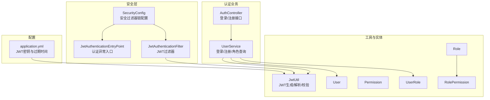
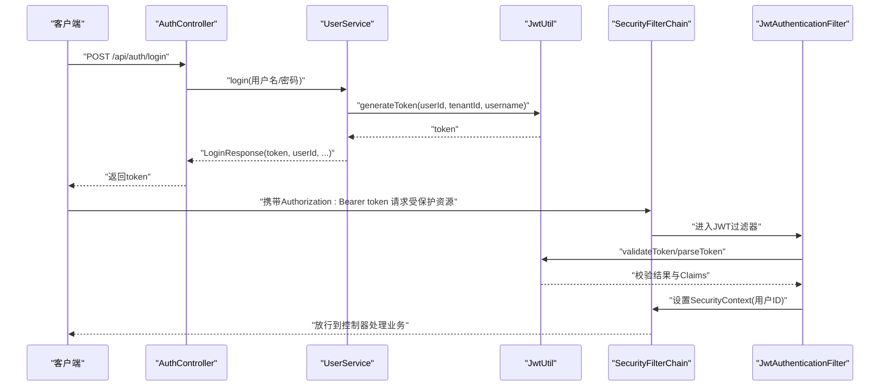
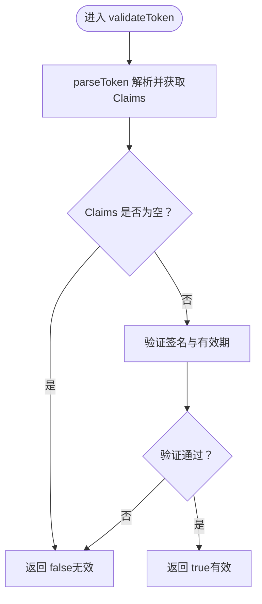
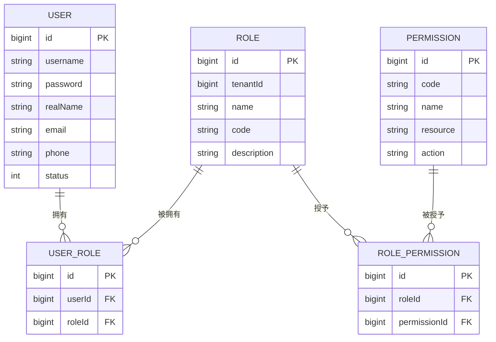
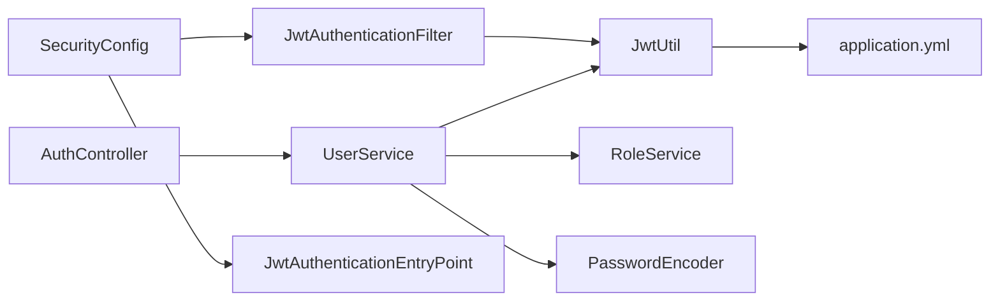

# 用户认证与授权

<cite>
**本文引用的文件**
- [JwtAuthenticationEntryPoint.java](file://backend/src/main/java/com/edu/common/security/JwtAuthenticationEntryPoint.java)
- [JwtAuthenticationFilter.java](file://backend/src/main/java/com/edu/common/security/JwtAuthenticationFilter.java)
- [JwtUtil.java](file://backend/src/main/java/com/edu/common/util/JwtUtil.java)
- [SecurityConfig.java](file://backend/src/main/java/com/edu/common/config/SecurityConfig.java)
- [AuthController.java](file://backend/src/main/java/com/edu/user/controller/AuthController.java)
- [UserService.java](file://backend/src/main/java/com/edu/user/service/UserService.java)
- [User.java](file://backend/src/main/java/com/edu/user/entity/User.java)
- [Role.java](file://backend/src/main/java/com/edu/user/entity/Role.java)
- [Permission.java](file://backend/src/main/java/com/edu/user/entity/Permission.java)
- [UserRole.java](file://backend/src/main/java/com/edu/user/entity/UserRole.java)
- [RolePermission.java](file://backend/src/main/java/com/edu/user/entity/RolePermission.java)
- [LoginRequest.java](file://backend/src/main/java/com/edu/user/dto/LoginRequest.java)
- [LoginResponse.java](file://backend/src/main/java/com/edu/user/dto/LoginResponse.java)
- [application.yml](file://backend/src/main/resources/application.yml)
</cite>

## 目录
1. [简介](#简介)
2. [项目结构](#项目结构)
3. [核心组件](#核心组件)
4. [架构总览](#架构总览)
5. [详细组件分析](#详细组件分析)
6. [依赖分析](#依赖分析)
7. [性能考虑](#性能考虑)
8. [故障排查指南](#故障排查指南)
9. [结论](#结论)
10. [附录](#附录)

## 简介
本文件系统性阐述本教育平台的用户认证与授权模块，重点覆盖以下方面：
- JWT（JSON Web Token）认证机制：token 的生成、验证与过期判断。
- 用户角色权限体系：角色、权限的数据模型与分配关系。
- 安全过滤器链：认证拦截、权限校验与异常处理。
- API 接口文档与使用示例：登录、注册、权限验证等。
- 安全配置最佳实践与常见安全问题的防护。

## 项目结构
围绕认证与授权的关键目录与文件如下：
- 安全配置与过滤器：common/config、common/security
- 认证控制器与服务：user/controller、user/service
- 实体与DTO：user/entity、user/dto
- 工具类：common/util
- 配置文件：application.yml

图表来源
- [SecurityConfig.java:1-50](file://backend/src/main/java/com/edu/common/config/SecurityConfig.java#L1-L50)
- [JwtAuthenticationEntryPoint.java:1-32](file://backend/src/main/java/com/edu/common/security/JwtAuthenticationEntryPoint.java#L1-L32)
- [JwtAuthenticationFilter.java:1-70](file://backend/src/main/java/com/edu/common/security/JwtAuthenticationFilter.java#L1-L70)
- [AuthController.java:1-32](file://backend/src/main/java/com/edu/user/controller/AuthController.java#L1-L32)
- [UserService.java:1-194](file://backend/src/main/java/com/edu/user/service/UserService.java#L1-L194)
- [JwtUtil.java:1-123](file://backend/src/main/java/com/edu/common/util/JwtUtil.java#L1-L123)
- [User.java:1-21](file://backend/src/main/java/com/edu/user/entity/User.java#L1-L21)
- [Role.java:1-18](file://backend/src/main/java/com/edu/user/entity/Role.java#L1-L18)
- [Permission.java:1-18](file://backend/src/main/java/com/edu/user/entity/Permission.java#L1-L18)
- [UserRole.java:1-15](file://backend/src/main/java/com/edu/user/entity/UserRole.java#L1-L15)
- [RolePermission.java:1-15](file://backend/src/main/java/com/edu/user/entity/RolePermission.java#L1-L15)
- [application.yml:45-47](file://backend/src/main/resources/application.yml#L45-L47)

章节来源
- [SecurityConfig.java:1-50](file://backend/src/main/java/com/edu/common/config/SecurityConfig.java#L1-L50)
- [JwtAuthenticationFilter.java:1-70](file://backend/src/main/java/com/edu/common/security/JwtAuthenticationFilter.java#L1-L70)
- [JwtAuthenticationEntryPoint.java:1-32](file://backend/src/main/java/com/edu/common/security/JwtAuthenticationEntryPoint.java#L1-L32)
- [AuthController.java:1-32](file://backend/src/main/java/com/edu/user/controller/AuthController.java#L1-L32)
- [UserService.java:1-194](file://backend/src/main/java/com/edu/user/service/UserService.java#L1-L194)
- [JwtUtil.java:1-123](file://backend/src/main/java/com/edu/common/util/JwtUtil.java#L1-L123)
- [application.yml:45-47](file://backend/src/main/resources/application.yml#L45-L47)

## 核心组件
- 安全过滤器链：禁用CSRF与H2控制台帧选项，设置无状态会话，统一异常入口，添加JWT过滤器在用户名密码过滤器之前执行。
- JWT工具：负责密钥加载、token生成、解析、校验、过期判断以及从token中提取用户ID、租户ID与用户名。
- 认证控制器：提供登录与注册接口，返回登录响应（含token与用户基本信息）。
- 用户服务：完成登录校验（用户名存在性、状态、密码匹配）、生成JWT、查询用户角色列表、创建与分配角色等。
- 角色权限模型：Role、Permission、UserRole、RolePermission四张表构成角色-权限映射，支持按租户隔离。

章节来源
- [SecurityConfig.java:26-43](file://backend/src/main/java/com/edu/common/config/SecurityConfig.java#L26-L43)
- [JwtUtil.java:20-121](file://backend/src/main/java/com/edu/common/util/JwtUtil.java#L20-L121)
- [AuthController.java:20-30](file://backend/src/main/java/com/edu/user/controller/AuthController.java#L20-L30)
- [UserService.java:68-104](file://backend/src/main/java/com/edu/user/service/UserService.java#L68-L104)
- [Role.java:1-18](file://backend/src/main/java/com/edu/user/entity/Role.java#L1-L18)
- [Permission.java:1-18](file://backend/src/main/java/com/edu/user/entity/Permission.java#L1-L18)
- [UserRole.java:1-15](file://backend/src/main/java/com/edu/user/entity/UserRole.java#L1-L15)
- [RolePermission.java:1-15](file://backend/src/main/java/com/edu/user/entity/RolePermission.java#L1-L15)

## 架构总览
下图展示认证与授权的整体交互流程：客户端发起登录请求，后端校验凭据并签发JWT；后续请求由过滤器解析token，填充安全上下文，交由控制器处理业务。

图表来源
- [AuthController.java:20-24](file://backend/src/main/java/com/edu/user/controller/AuthController.java#L20-L24)
- [UserService.java:68-104](file://backend/src/main/java/com/edu/user/service/UserService.java#L68-L104)
- [JwtUtil.java:33-45](file://backend/src/main/java/com/edu/common/util/JwtUtil.java#L33-L45)
- [SecurityConfig.java:27-40](file://backend/src/main/java/com/edu/common/config/SecurityConfig.java#L27-L40)
- [JwtAuthenticationFilter.java:27-53](file://backend/src/main/java/com/edu/common/security/JwtAuthenticationFilter.java#L27-L53)

## 详细组件分析

### JWT工具类（JwtUtil）
- 职责：密钥加载、token生成、解析、校验、过期判断、从token提取用户ID、租户ID与用户名。
- 关键点：
  - 密钥来源于配置项，过期时间同样来自配置。
  - 生成时写入用户ID作为主题、租户ID与用户名作为自定义声明。
  - 校验与解析异常会被记录日志并返回空或false，避免泄露内部细节。
  - 过期判断通过比较token过期时间与当前时间实现。

图表来源
- [JwtUtil.java:66-77](file://backend/src/main/java/com/edu/common/util/JwtUtil.java#L66-L77)
- [JwtUtil.java:50-61](file://backend/src/main/java/com/edu/common/util/JwtUtil.java#L50-L61)

章节来源
- [JwtUtil.java:20-121](file://backend/src/main/java/com/edu/common/util/JwtUtil.java#L20-L121)
- [application.yml:45-47](file://backend/src/main/resources/application.yml#L45-L47)

### 安全过滤器链（SecurityConfig）
- 职责：全局安全策略配置，包括禁用CSRF、无状态会话、公开路径放行、异常处理入口、过滤器顺序等。
- 关键点：
  - 对 /api/auth/** 与 /api/tenant/** 与 /h2-console/** 与 /error 放行，便于登录与租户初始化。
  - 在用户名密码过滤器前插入JWT过滤器，确保每次请求都进行token解析与上下文设置。
  - 异常入口统一返回401未认证响应。

章节来源
- [SecurityConfig.java:26-43](file://backend/src/main/java/com/edu/common/config/SecurityConfig.java#L26-L43)

### 认证入口点（JwtAuthenticationEntryPoint）
- 职责：当认证失败时统一输出JSON格式的401未认证响应，便于前端统一处理。
- 关键点：设置响应状态码为401，内容类型为application/json，消息体为通用“认证失败，请登录”。

章节来源
- [JwtAuthenticationEntryPoint.java:18-30](file://backend/src/main/java/com/edu/common/security/JwtAuthenticationEntryPoint.java#L18-L30)

### JWT认证过滤器（JwtAuthenticationFilter）
- 职责：从请求头Authorization中提取Bearer token，调用JwtUtil进行校验，解析用户ID、租户ID与用户名，填充Spring Security上下文，同时设置租户上下文。
- 关键点：
  - 仅对非公开路径生效（/api/auth/** 与 /api/tenant/** 不需要JWT）。
  - 成功解析后，将userId作为认证主体放入SecurityContext，供后续方法级权限注解使用。
  - 租户ID用于多租户隔离，贯穿后续业务逻辑。

章节来源
- [JwtAuthenticationFilter.java:27-68](file://backend/src/main/java/com/edu/common/security/JwtAuthenticationFilter.java#L27-L68)

### 认证控制器（AuthController）
- 职责：对外暴露登录与注册接口，返回标准结果包装。
- 关键点：
  - 登录接口：接收用户名与密码，调用UserService完成登录并返回LoginResponse（包含token与用户基本信息）。
  - 注册接口：接收注册参数，调用UserService完成用户创建与默认角色分配。

章节来源
- [AuthController.java:20-30](file://backend/src/main/java/com/edu/user/controller/AuthController.java#L20-L30)

### 用户服务（UserService）
- 职责：登录校验（用户名存在性、状态、密码匹配）、生成JWT、查询用户角色列表、创建与分配角色等。
- 关键点：
  - 登录流程：根据租户上下文查询用户，检查状态，使用BCrypt校验密码，成功则生成JWT并封装登录响应。
  - 注册流程：校验用户名唯一性，加密密码，创建用户并分配默认角色（若未指定角色代码则默认为TEACHER）。
  - 角色查询：通过UserRole与Role联合查询，返回用户的角色编码列表。

章节来源
- [UserService.java:68-104](file://backend/src/main/java/com/edu/user/service/UserService.java#L68-L104)
- [UserService.java:34-66](file://backend/src/main/java/com/edu/user/service/UserService.java#L34-L66)
- [UserService.java:129-131](file://backend/src/main/java/com/edu/user/service/UserService.java#L129-L131)

### 数据模型与权限体系
- 用户（User）：用户名、密码、实名、邮箱、电话、状态等字段。
- 角色（Role）：角色名称与编码，支持按租户隔离。
- 权限（Permission）：权限编码、名称、资源与动作。
- 用户角色（UserRole）：用户与角色的多对多中间表。
- 角色权限（RolePermission）：角色与权限的多对多中间表。

图表来源
- [User.java:11-20](file://backend/src/main/java/com/edu/user/entity/User.java#L11-L20)
- [Role.java:10-17](file://backend/src/main/java/com/edu/user/entity/Role.java#L10-L17)
- [Permission.java:10-17](file://backend/src/main/java/com/edu/user/entity/Permission.java#L10-L17)
- [UserRole.java:8-14](file://backend/src/main/java/com/edu/user/entity/UserRole.java#L8-L14)
- [RolePermission.java:8-14](file://backend/src/main/java/com/edu/user/entity/RolePermission.java#L8-L14)

章节来源
- [User.java:1-21](file://backend/src/main/java/com/edu/user/entity/User.java#L1-L21)
- [Role.java:1-18](file://backend/src/main/java/com/edu/user/entity/Role.java#L1-L18)
- [Permission.java:1-18](file://backend/src/main/java/com/edu/user/entity/Permission.java#L1-L18)
- [UserRole.java:1-15](file://backend/src/main/java/com/edu/user/entity/UserRole.java#L1-L15)
- [RolePermission.java:1-15](file://backend/src/main/java/com/edu/user/entity/RolePermission.java#L1-L15)

### API接口文档与使用示例

- 登录接口
  - 方法与路径：POST /api/auth/login
  - 请求体：用户名与密码（参考 DTO 字段定义）
  - 响应体：包含token与用户基本信息的登录响应
  - 使用示例（示意）：
    - 请求头：Content-Type: application/json
    - 请求体：{"username":"...","password":"..."}
    - 返回：{"code":200,"data":{"token":"...","userId":...,"username":"...","realName":"..."}}

- 注册接口
  - 方法与路径：POST /api/auth/register
  - 请求体：用户名、密码、实名、邮箱、电话、角色代码（可选，默认TEACHER）
  - 响应体：新创建的用户对象
  - 使用示例（示意）：
    - 请求头：Content-Type: application/json
    - 请求体：{"username":"...","password":"...","realName":"...","email":"...","phone":"...","roleCode":"..."}
    - 返回：{"code":200,"data":{...}}

- 受保护资源访问
  - 方法与路径：任意受保护接口（除公开路径外）
  - 请求头：Authorization: Bearer <token>
  - 行为：JWT过滤器解析token并填充SecurityContext，随后控制器处理业务

章节来源
- [AuthController.java:20-30](file://backend/src/main/java/com/edu/user/controller/AuthController.java#L20-L30)
- [LoginRequest.java:1-14](file://backend/src/main/java/com/edu/user/dto/LoginRequest.java#L1-L14)
- [LoginResponse.java:1-12](file://backend/src/main/java/com/edu/user/dto/LoginResponse.java#L1-L12)
- [UserService.java:68-104](file://backend/src/main/java/com/edu/user/service/UserService.java#L68-L104)

## 依赖分析
- 组件耦合：
  - AuthController 依赖 UserService。
  - UserService 依赖 JwtUtil、RoleService、PasswordEncoder、租户上下文。
  - JwtAuthenticationFilter 依赖 JwtUtil 与租户上下文。
  - SecurityConfig 依赖 JwtAuthenticationFilter 与 JwtAuthenticationEntryPoint。
- 外部依赖：
  - Spring Security（过滤器链、方法级安全、密码编码器）。
  - JWT库（io.jsonwebtoken）。
  - 配置项：jwt.secret、jwt.expiration。

图表来源
- [AuthController.java:18-20](file://backend/src/main/java/com/edu/user/controller/AuthController.java#L18-L20)
- [UserService.java:30-32](file://backend/src/main/java/com/edu/user/service/UserService.java#L30-L32)
- [JwtAuthenticationFilter.java:25](file://backend/src/main/java/com/edu/common/security/JwtAuthenticationFilter.java#L25)
- [SecurityConfig.java:23-24](file://backend/src/main/java/com/edu/common/config/SecurityConfig.java#L23-L24)
- [application.yml:45-47](file://backend/src/main/resources/application.yml#L45-L47)

章节来源
- [AuthController.java:18-20](file://backend/src/main/java/com/edu/user/controller/AuthController.java#L18-L20)
- [UserService.java:30-32](file://backend/src/main/java/com/edu/user/service/UserService.java#L30-L32)
- [JwtAuthenticationFilter.java:25](file://backend/src/main/java/com/edu/common/security/JwtAuthenticationFilter.java#L25)
- [SecurityConfig.java:23-24](file://backend/src/main/java/com/edu/common/config/SecurityConfig.java#L23-L24)
- [application.yml:45-47](file://backend/src/main/resources/application.yml#L45-L47)

## 性能考虑
- 无状态会话：采用JWT无状态设计，降低服务器存储压力，适合水平扩展。
- 过滤器链轻量：JWT过滤器仅做token解析与上下文填充，不涉及复杂业务逻辑。
- 密钥与过期时间：建议在生产环境使用强随机密钥与合理过期时间，结合刷新策略（如需）提升安全性与体验。
- 密码编码：使用BCrypt，成本因子适中以平衡安全与性能。

## 故障排查指南
- 401未认证
  - 现象：接口返回401且消息为“认证失败，请登录”。
  - 可能原因：请求未携带有效的Bearer token、token已过期或签名无效、租户上下文缺失。
  - 排查步骤：确认Authorization头格式为“Bearer <token>”，检查token是否过期，核对JWT密钥与过期时间配置。
- 登录失败
  - 现象：登录返回业务错误（如用户不存在、密码错误、用户已禁用）。
  - 排查步骤：确认用户名与密码正确，检查用户状态，确认租户上下文已设置。
- 角色权限不足
  - 现象：受方法级安全保护的接口返回403。
  - 排查步骤：确认用户已分配对应角色与权限，检查权限资源与动作配置是否匹配。

章节来源
- [JwtAuthenticationEntryPoint.java:23-29](file://backend/src/main/java/com/edu/common/security/JwtAuthenticationEntryPoint.java#L23-L29)
- [UserService.java:80-91](file://backend/src/main/java/com/edu/user/service/UserService.java#L80-L91)
- [SecurityConfig.java:33-39](file://backend/src/main/java/com/edu/common/config/SecurityConfig.java#L33-L39)

## 结论
本模块基于Spring Security与JWT实现了无状态认证与授权基础能力，配合角色权限模型与租户隔离，满足多租户场景下的用户管理需求。通过统一的安全过滤器链与异常入口，保证了认证流程的一致性与可维护性。建议在生产环境中强化密钥管理、引入刷新机制与审计日志，并持续完善权限矩阵与最小权限原则。

## 附录

### 安全配置最佳实践
- 密钥管理：使用强随机密钥，定期轮换；避免硬编码，使用环境变量或密钥管理服务。
- 过期策略：合理设置过期时间，结合刷新令牌机制（如需）提升用户体验。
- 请求头规范：严格要求Authorization头格式为“Bearer <token>”，并在网关层统一校验。
- 日志与监控：记录认证失败与异常事件，结合告警机制快速定位风险。
- 最小权限：权限设计遵循最小权限原则，定期清理无效权限与角色。

### 常见安全问题与防护
- 中间人攻击：使用HTTPS传输，避免明文泄露token。
- 短时间内暴力破解：限制登录尝试次数，启用验证码或二次验证。
- CSRF：当前已禁用CSRF，适用于前后端分离场景；若引入Cookie会话，需重新评估。
- 令牌泄露：建议在客户端安全存储token，避免localStorage长期存放；必要时加入设备指纹与IP白名单。